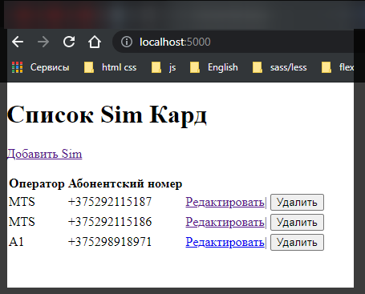
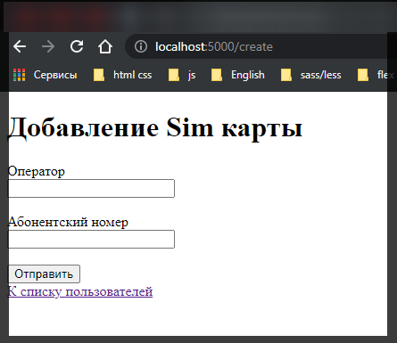
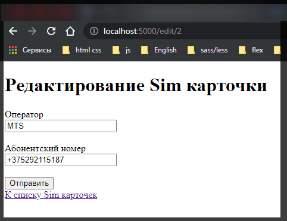
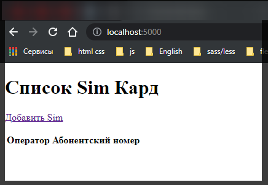

# Squelize и Express

Создадим простейшее веб-приложение с использованием **Express**, которое взаимодействует с бд **MySQL** через **Sequelize**. Прежде всего определим новый проект и добавим в него пакеты **express**, **mysql2**, **sequelize**, **handlebars** и **body-parser**:

```shell
npm install --save hbs express body-parser mysql2 sequelize
```

В качестве визуальной части мы будем использовать представления **Handlebars**. Для этого определим в проекте папку **views**. В ней создадим новый файл **index.hbs**:

```html
<!DOCTYPE html>
<html>
  <head>
    <title>Список Sim Кард</title>
    <meta charset="utf-8" />
  </head>
  <body>
    <h1>Список Sim Кард</h1>
    <p><a href="/create">Добавить Sim</a></p>
    <table>
      <tr>
        <th>Оператор</th>
        <th>Абонентский номер</th>
        <th></th>
      </tr>
      {{#each cards}}
      <tr>
        <td>{{this.operator}}</td>
        <td>{{this.number}}</td>
        <td>
          <a href="/edit/{{this.id}}">Edit</a>|
          <form
            action="delete/{{this.id}}"
            method="POST"
            style="display:inline;"
          >
            <input type="submit" value="Удалить" />
          </form>
        </td>
      </tr>
      {{/each}}
    </table>
  </body>
  <html></html>
</html>
```

Данное представление выводит список объектов в виде таблицы с возможностью их редактирования и удаления. Над таблицей определена ссылка на добавление новых объектов.

Затем добавим в папку **views** новый файл **create.hbs** с формой для создания нового объекта:

```html
<!DOCTYPE html>
<html>
  <head>
    <title>Добавление Sim карты</title>
    <meta charset="utf-8" />
    <style>
      .field {
        width: 180px;
      }
    </style>
  </head>
  <body>
    <h1>Добавление Sim карты</h1>
    <form method="POST">
      <label>Оператор</label><br />
      <input name="operator" class="field" /><br /><br />
      <label>Абонентский номер</label><br />
      <input name="number" type="text" class="field" /><br /><br />
      <input type="submit" value="Отправить" />
    </form>
    <a href="/">К списку пользователей</a>
  </body>
  <html></html>
</html>
```

И также добавим в папку **views** новый файл **edit.hbs** с формой для редактирования объекта:

```html
<!DOCTYPE html>
<html>
  <head>
    <title>Редактирование Sim карточки</title>
    <meta charset="utf-8" />
    <style>
      .field {
        width: 180px;
      }
    </style>
  </head>
  <body>
    <h1>Редактирование Sim карточки</h1>
    <form action="/edit" method="POST">
      <input type="hidden" name="id" value="{{card.id}}" />
      <label>Оператор</label><br />
      <input
        name="operator"
        value="{{card.operator}}"
        class="field"
      /><br /><br />
      <label>Абонентский номер</label><br />
      <input
        name="number"
        type="text"
        value="{{card.number}}"
        class="field"
      /><br /><br />
      <input type="submit" value="Отправить" />
    </form>
    <a href="/">К списку Sim карточек</a>
  </body>
  <html></html>
</html>
```

И в конце определим в корневой папке проекта главный файл приложения - **app.js**:

```js
const Sequelize = require('sequelize');
const express = require('express');
const bodyParser = require('body-parser');

const app = express();
const urlencodedParser = bodyParser.urlencoded({ extended: false });

// Определяем объекты Sequelize
const sequelize = new Sequelize('network', 'asu8', '123', {
  dialect: 'mysql',
  host: '10.178.4.52',
});

// Определяем модель
const SimCard = sequelize.define('simCard', {
  id: {
    type: Sequelize.INTEGER,
    autoIncrement: true,
    primaryKey: true,
    allowNull: false,
  },
  operator: {
    type: Sequelize.STRING,
    allowNull: true,
  },
  number: {
    type: Sequelize.STRING,
    allowNull: true,
  },
});

app.set('view engine', 'hbs'); // определяю движок handlebars

// синхронизация с бд, после успшной синхронизации запускаем сервер
sequelize
  .sync()
  .then(() => {
    app.listen(5000, function () {
      console.log('Сервер ожидает подключения...');
    });
  })
  .catch((err) => console.log(err));

// получение данных
app.get('/', function (req, res) {
  SimCard.findAll({ raw: true })
    .then((data) => {
      res.render('index.hbs', {
        cards: data,
      });
    })
    .catch((err) => console.log(err));
});

app.get('/create', function (req, res) {
  res.render('create.hbs');
});

// Добавление данных
app.post('/create', urlencodedParser, function (req, res) {
  if (!req.body) return res.sendStatus(400);

  const operator = req.body.operator;
  const number = req.body.number;
  SimCard.create({ operator, number })
    .then(() => {
      res.redirect('/');
    })
    .catch((err) => console.log(err));
});

// получаем объект по id для редактирования
app.get('/edit/:id', urlencodedParser, function (req, res) {
  const userid = req.params.id;
  SimCard.findAll({ where: { id: userid }, raw: true })
    .then((data) => {
      res.render('edit.hbs', { card: data[0] });
    })
    .catch((err) => console.log(err));
});

// обновление данных в БД
app.post('/edit', urlencodedParser, function (req, res) {
  if (!req.body) return res.sendStatus(400);

  const operator = req.body.operator;
  const number = req.body.number;
  const userid = req.body.id;
  SimCard.update({ operator, number }, { where: { id: userid } })
    .then(() => {
      res.redirect('/');
    })
    .catch((err) => console.log(err));
});

// Удаление данных
app.post('/delete/:id', function (req, res) {
  const userid = req.params.id;
  SimCard.destroy({ where: { id: userid } })
    .then(() => {
      res.redirect('/');
    })
    .catch((err) => console.log(err));
});
```

При обращении к корню приложения срабатывает метод

```js
// получение данных
app.get('/', function (req, res) {
  SimCard.findAll({ raw: true })
    .then((data) => {
      res.render('index.hbs', {
        cards: data,
      });
    })
    .catch((err) => console.log(err));
});
```

Он получает данные из бд и передает их представлению **index.hbs**. Если база данных уже содержит какие-либо данные, то при запуске приложения мы увидим их на странице:



При нажатии на ссылку добавления серверу будет отправлятьс **get**-запрос, который будет обрабатываться следующим методом:

```js
app.get('/create', function (req, res) {
  res.render('create.hbs');
});
```

Метод возвращает клиенту форму для добавления:



После отправки формы данные в запросе **POST** отправляются методу:

```js
// Добавление данных
app.post('/create', urlencodedParser, function (req, res) {
  if (!req.body) return res.sendStatus(400);

  const operator = req.body.operator;
  const number = req.body.number;
  SimCard.create({ operator, number })
    .then(() => {
      res.redirect('/');
    })
    .catch((err) => console.log(err));
});
```

Метод получает данные и отправляет их БД.

При нажатии на ссылку редактирования в списке объектов следующему методу в **GET**-зпросе передается **id** объекта:

```js
// получаем объект по id для редактирования
app.get('/edit/:id', urlencodedParser, function (req, res) {
  const userid = req.params.id;
  SimCard.findAll({ where: { id: userid }, raw: true })
    .then((data) => {
      res.render('edit.hbs', { card: data[0] });
    })
    .catch((err) => console.log(err));
});
```

Метод получает **id** и по нему извлекает из БД нужный объект из БД и передается его на форму в представлении **edit.hbs**:



После редактирования и нажатия на кнопку данные отправляются в **POST**-запросе следующему методу:

```js
// обновление данных в БД
app.post('/edit', urlencodedParser, function (req, res) {
  if (!req.body) return res.sendStatus(400);

  const operator = req.body.operator;
  const number = req.body.number;
  const userid = req.body.id;
  SimCard.update({ operator, number }, { where: { id: userid } })
    .then(() => {
      res.redirect('/');
    })
    .catch((err) => console.log(err));
});
```

Метод получает данные и отправляет их в БД.

При нажатии на кнопку удаления в списке объектов срабатывает метод

```js
// Удаление данных
app.post('/delete/:id', function (req, res) {
  const userid = req.params.id;
  SimCard.destroy({ where: { id: userid } })
    .then(() => {
      res.redirect('/');
    })
    .catch((err) => console.log(err));
});
```


