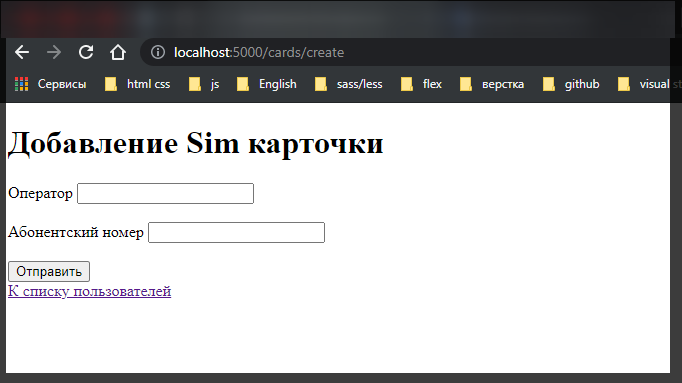
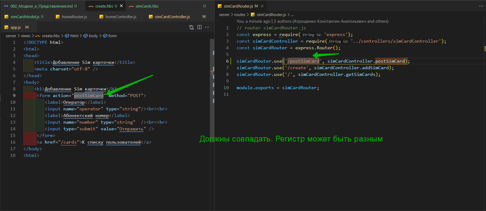
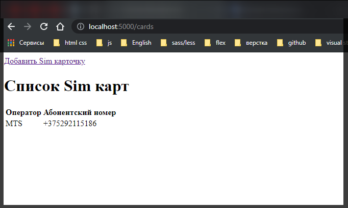

# Модели и Представления

Прежде всего, добавим в проект пакет **body-parser** для парсинга отправляемых приложению данных и пакет **"hbs"** для работы с представлениями. Вместо движка **Handlebars** естественно можно использовать любой другой движок представлений.

```shell
npm install --save body-parser hbs
```

Добавим в проект новую папку **models** и определим в ней новый файл **user.js**, который будет хранить код следующей модели:

Добавим в проект новую папку **models** и определим в ней новый файл **simCardModel.js**, который будет хранить код следующей модели:

```js
// models simCardModel.js
const simCards = [];

module.exports = class SimCard {
  constructor(operator, number) {
    this.operator = operator;
    this.number = number;
  }

  save() {
    simCards.push(this);
  }
  static getAll() {
    return simCards;
  }
};
```

Модель фактически представляет класс **SimCard**, который имеет два поля: **operator** и **number**. Для упрощения демонстрации работы с моделями в данным случае все объекты **User** будут храниться в массиве **users**, однако в конечном счете это может быть любое хранилище - файлы, база данных. И с помощью методов **save** и **getAll** класса **SimCard** мы можем сохранить текущего пользователя в массив, либо получить пользователей из массива. Следует обратить внимание, что метод **getAll** определен как статический, поэтому относится в целом ко всему классу **SimCard**.

Теперь добавим в проект представления. В данном случае в качесте движка представлений будет использоваться движок **Handlebars**, но естественно можно использовать любой предпочтительный движок представлений.

Итак, определим в проекте папку **views**. Добавим в нее новый файл **simCards.hbs**, который будет выводить список пользователей на веб-страницу:

```html
<!DOCTYPE html>
<html>
  <head>
    <title>Список Sim карточек</title>
    <meta charset="utf-8" />
  </head>
  <body>
    <a href="/cards/create">Добавить Sim карточку</a>
    <h1>Список Sim карт</h1>
    <table>
      <tr>
        <th>Оператор</th>
        <th>Абонентский номер</th>
      </tr>
      {{#each listSimCards}}
      <tr>
        <td>{{this.operator}}</td>
        <td>{{this.number}}</td>
      </tr>
      {{/each}}
    </table>
  </body>
  <html></html>
</html>
```

И также добавим в папку views второй файл - **create.hbs:**

```html
<!DOCTYPE html>
<html>
  <head>
    <title>Добавление Sim карточки</title>
    <meta charset="utf-8" />
  </head>
  <body>
    <h1>Добавление Sim карточки</h1>
    <form action="postSimCard" method="POST">
      <label>Оператор</label>
      <input name="operator" type="string" /><br /><br />
      <label>Абонентский номер</label>
      <input name="number" type="string" /><br /><br />
      <input type="submit" value="Отправить" />
    </form>
    <a href="/cards">К списку пользователей</a>
  </body>
  <html></html>
</html>
```

Данное представление содержит форму для добавления нового пользователя.

Теперь изменим контроллер **userController**:

```js
// controllers simCardController.js
const SimCards = require('../models/simCardModel'); // Модель

exports.addSimCard = function (req, res) {
  res.render('create.hbs');
};

exports.getSimCards = function (req, res) {
  res.render('simCards.hbs', {
    listSimCards: SimCards.getAll(),
  });
};

exports.postSimCard = function (req, res) {
  const operator = req.body.operator;
  const number = req.body.number;
  const sim = new SimCards(operator, number);
  sim.save();
  res.redirect('/cards');
};
```

Контроллер теперь определяет три метода. Метод **addSimCard()** возвращение представление **create.hbs** для добавления новой Сим-карты.

Метод **postSimCards()** получает отправленные данные, создает объект **SimCards** и вызывает у него метод **save**, тем самым сохраняя его в массив **SimCards** из файла **simCardModel.js**. После добавления идет переадресация на список Сим-карт.

Метод **getSimCards** возвращает представление **simCards.hbs**, в которое передает список пользователей с помощью вызова метода **SimCards.getAll()**.

Теперь изменим файл файл **simCardRouter.js** для определения всех необходимых маршрутов.

```js
// router simCardRouter.js
const express = require('express');
const simCardController = require('../controllers/simCardController');
const simCardRouter = express.Router();

simCardRouter.use('/postSimCard', simCardController.postSimCard);
simCardRouter.use('/create', simCardController.addSimCard);
simCardRouter.use('/', simCardController.getSimCards);

module.exports = simCardRouter;
```

И изменим главный файл приложения:

```js
const express = require('express');
const app = express();
const bodyParser = require('body-parser');
const simCardRouter = require('./routes/simCardRouter');
const homeRouter = require('.//routes/homeRouter');

app.set('views engine', 'hbs'); // регистрирую движок
app.use(bodyParser.urlencoded({ extended: false }));

// определяю маршрут
app.use('/cards', simCardRouter);
app.use('/', homeRouter);

// Обработка ошибки 404
app.use(function (req, res, next) {
  res.status(404).send('Не найдено');
});

app.listen(5000);
```







