# JWT теория

**JWT** - представляет собой обычную закодированную строку

Эта строка состоит из 3-х частей разделенных точкой.

1. часть это заголовок
2. часть это какие-то данные которые в этот **token** мы вшиваем.
3. часть сигнатура.

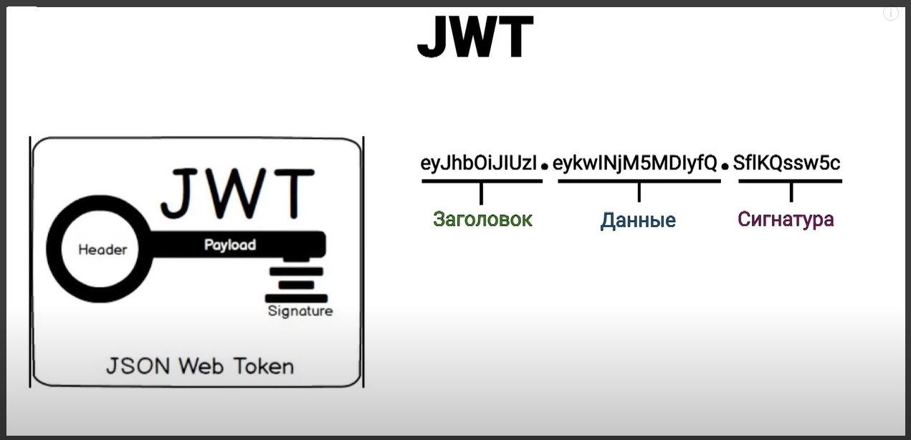

Поговорим о каждой части и начнем с заголовка. Заголовок по сути нас интересует меньше всего. Обязательно он должен хранить в себе с помощью какого алгоритма происхотит шифрование. И не обязательным полем может хранить тип **token** или еще какие-то другие вспомогательные элементы.

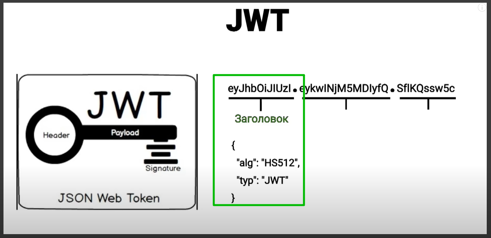

Вторая часть **JWT** **token** это какие-то данные. Эти данные мы вшиваем в **token** непосредственно сами. Чаще всего это какая-то информация о пользователе который проходит авторизацию. Его **userName** его уникальный **id** и например его роли, что бы можно было определять какие **end-point** ему доступны а какие нет. Заголовок и данные по сути храняться в открытом виде. Раскодировать их может абсолютно каждый. По этому хранить там какую-то важную информацию не стоит.

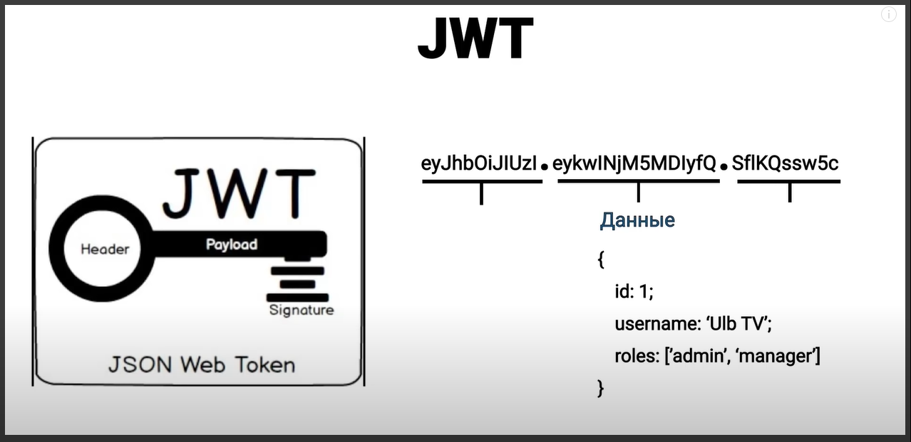

Тогда какую безопасность нам предоставляет **JWT**? И вот здесь мы уже подходим к сигнатуре.

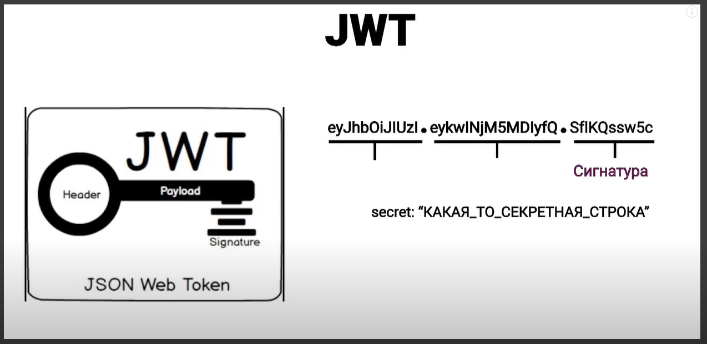

Для того что бы нам эту сигнатуру получить нам необходим некий секретный ключ. Этот секретный ключ будет знать только наш сервер.

Т.е. как это работает? Мы берем заголовок + данные и с помощью секретного ключа мы это все кодируем и на выходе получаем как раз сигнатуру.

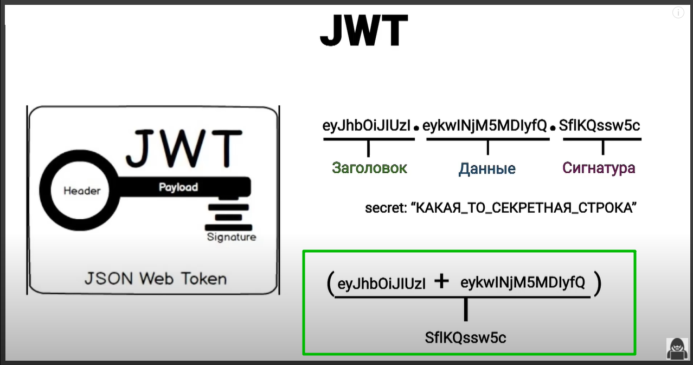

Эта сигнатура нужна как раз для того что бы убедиться в том что **token** не был потделан. Т.е. если фактически не знать секретный ключ то эту сигнатуру получить практически не возможно.

Теперь рассмотрим с какими **token** нам придеться работать.

Каждый **JWT** токен имеет срок своей жизни. Т.е. через какое-то время он становится не валиден и по сути умирает. Это делается для безопасности. Т.е. если мошенник каким-то образом ваш **token** украл. А у **token** к примеру срок жизни 15 мин, то он сервисом этим 15 мин попользуется и затем **token** умрет и мошеннику уже получить доступ не получится.

И тут возникает вопрос. Как нам получать новый **token**. Не ужели придеться каждые 15 мин логинится?

И на этот случай придумали два типа **token**. Это **token** доступа т.е. **ACCES**. И **token** который этот **ACCESS** токет перезаписывает. Он называется **REFRESH**.

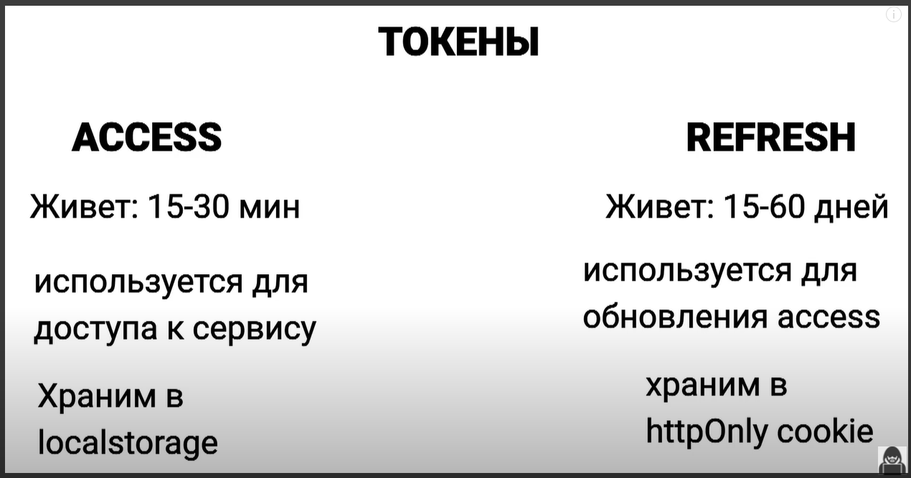

Флаг **httpOnly** является очень важным условием что бы через **JS** было не возможно эти **cookie** изменить. Т.е. **cookie** непосредственно будет устанавливать только сервер.
**REFRESH** так же в свою очередь записывается в БД на сервере и получается своего рода сессия. Туда так же можно записывать **ip** адрес с которого произошло подключение. И в случае если там был однаружен новый **ip** адресс, то можно отправлять пользователю уведомление о том что кто-то зашел с чужого устройства. Или же вместо **ip** адреса можно запоминать браузер с которого произошла авторизация. В общем способов достаточно много. Это уже на ваше усмотрение. Главное понять суть.

Теперь рассмотрим взаимодействие клиента и сервера.

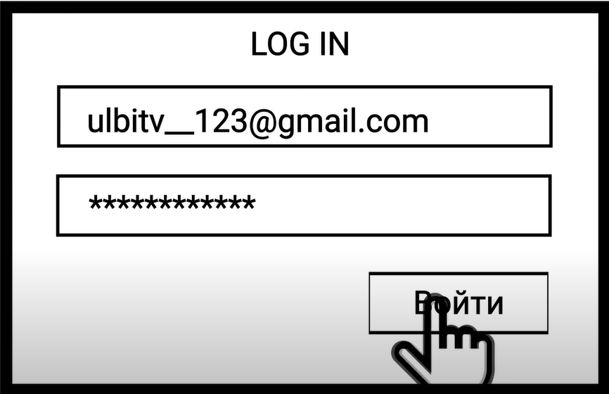

В теле запроса мы указываем этот **email** и **password** и отправляем на сервер.

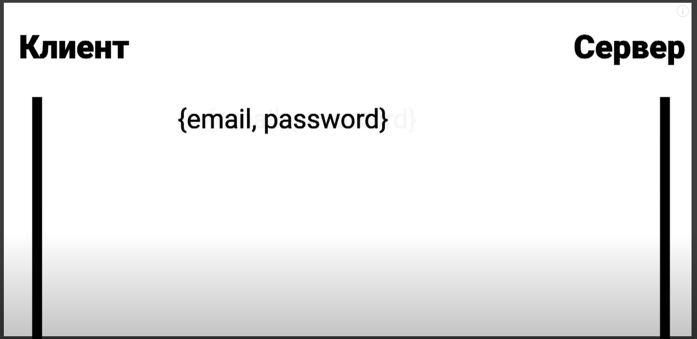

После чего сервер нам генерирует пару токенов. **accessToken** и **refreshToken** соответственно.

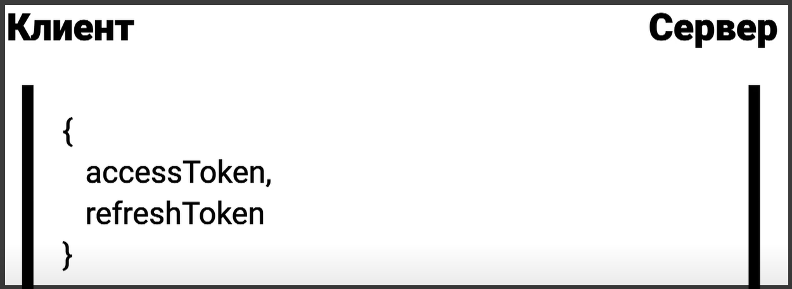

**accessToken** мы сразу сохраняем в **localStorage**. А **refreshToken** нам уже сервер установил в **cookie**.
Мы успешно залогинились. Входим в приложение. И отправляется запрос, например на получение сообщений.

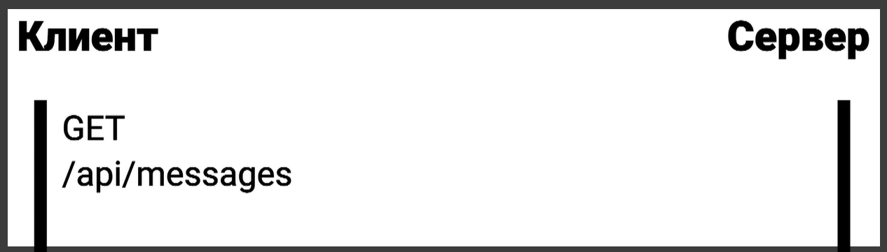

К этому запросу мы добавляем **headers: Autorization** и в этот **header** записывам **accessToken**

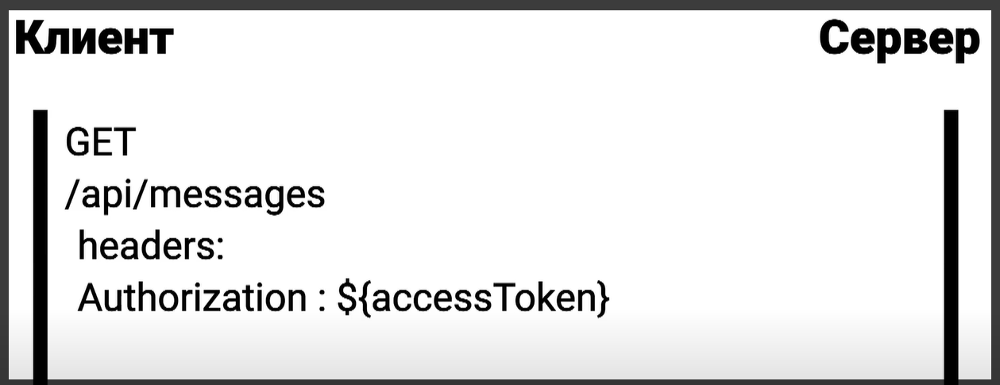

И отправляем запрос на сервер.

Первое что даелает сервер это проверяет **token**. Если он валидный, не потделанный и у него не истек срок годности, то сервер возвращает статус код **200** и возвращает нам сообщение которое мы запросили.

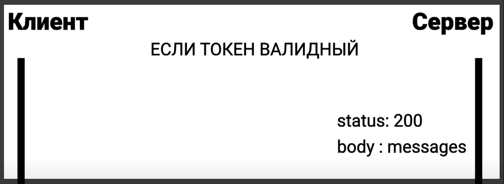

Это обычный сценарий при котором все работает как надо.

Если **token** не валидный.

В таком случае сервер нам возвращает статус код **401**

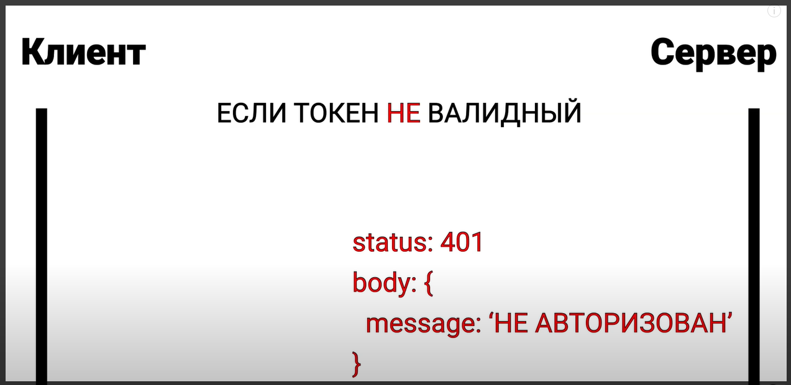

Мы такое поведение на клиенте предусмотрели и на **401** код у нас стоит перехватчик т.е. интерцептер. В момент когда мы получили **401** статус код. Мы сразу же отправляем запрос на обновление **accessToken**. В **cookie** у нас сразу же находиться **refresh** токен по этому нам добавлять его ни куда не надо.

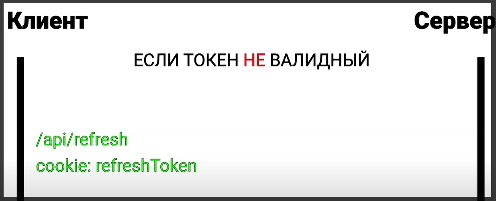

Мы отправляем запрос с этим **token**.

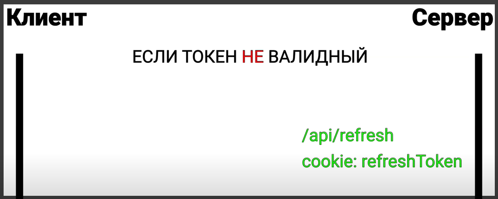

Сервер этот токен обрабатывает, проверяет, сверяет с тем который лежит в БД.

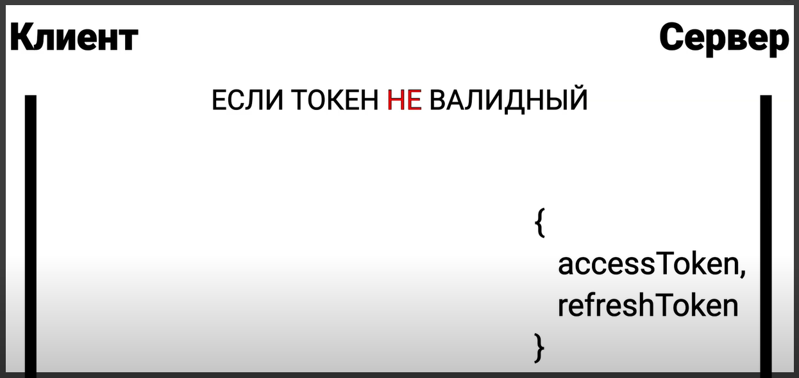

После чего возвращает нам новую пару **accessToken** и **refreshToken**.

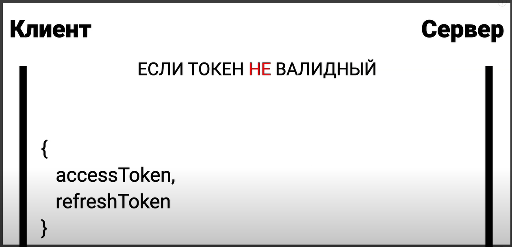

И мы снова в течении получаса можем этот **accesToken** использовать. И после того как его срок годности опять иссякнет вся эта поцедура повториться.
