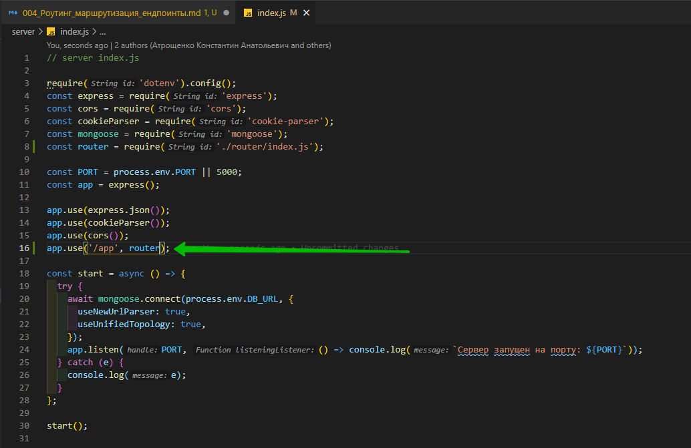
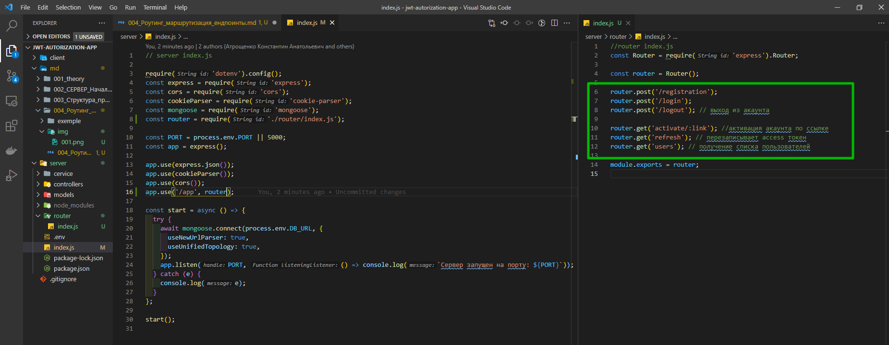
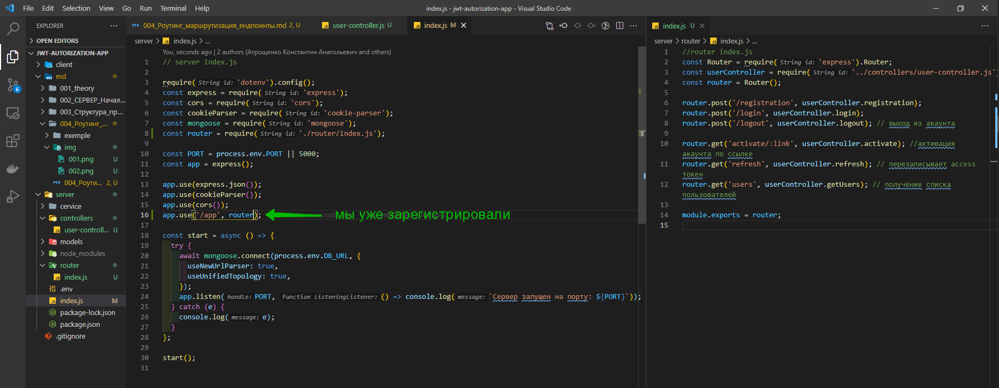
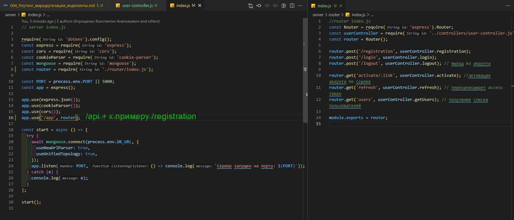
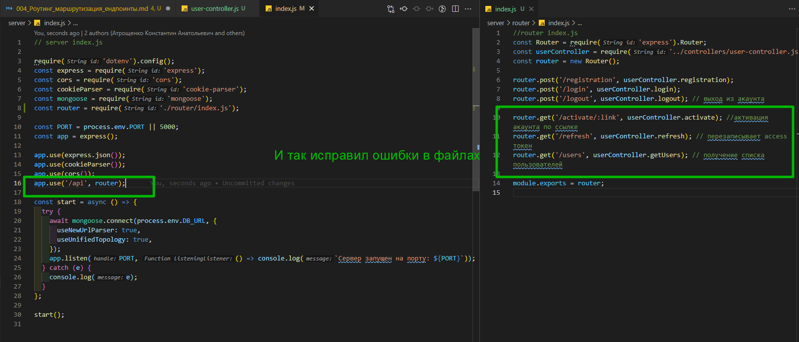
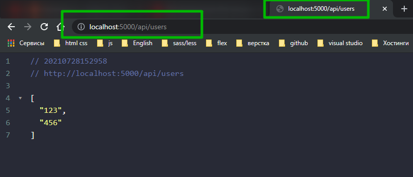

# Роутинг маршрутизация ендпоинты и userController

Смотри конечные файлы так как на скриншотах совершаю ошибки.

В папке **route** создаю **index.js**.

Первое что я делаю это импортирую **Router** из **express**.

```js
//router index.js
const Router = require('express').Router;
```

Затем создаю экземпляр роутера

```js
//router index.js
const Router = require('express').Router;

const router = Router();
```

И обозначаем какие **end-point** у нас в приложнии будут. У нас будет **end-point** для регистрации. Это будет **POST** запрос. Так же у нас будет post запрос для логина. Так же будет **post** запрос что бы с акаунта выйти. Внутри этого **end-point** у нас будет **refresh** токен удаляться из БД.

```js
//router index.js
const Router = require('express').Router;

const router = Router();

router.post('/registration');
router.post('/login');
router.post('/logout');
```

Так же у нас будут два **end-point** с **get** запросом. Первый для активации акаунта по ссылке, которая будет приходить на почту.

Еще один end-point который будет перезаписывать **access** токен в случае если он умер.

И так же будет один тестовый **end-point** c помощью которого мы будем получать список пользователей. Он будет доступен только для авторизованных пользователей.

```js
//router index.js
const Router = require('express').Router;

const router = Router();

router.post('/registration');
router.post('/login');
router.post('/logout'); // выход из акаунта

router.get('activate/:link'); //активация акаунта по ссылке
router.get('refresh'); // перезаписывает access токен
router.get('users'); // получение списка пользователей

module.exports = router;
```

Возвращаюсь в корневой **index.js** т.е в папке **server**. Сюда мы этот **router** уже импортируем.

```js
// server index.js

require('dotenv').config();
const express = require('express');
const cors = require('cors');
const cookieParser = require('cookie-parser');
const mongoose = require('mongoose');
const router = require('./router/index.js');

const PORT = process.env.PORT || 5000;
const app = express();

app.use(express.json());
app.use(cookieParser());
app.use(cors());

const start = async () => {
  try {
    await mongoose.connect(process.env.DB_URL, {
      useNewUrlParser: true,
      useUnifiedTopology: true,
    });
    app.listen(PORT, () => console.log(`Сервер запущен на порту: ${PORT}`));
  } catch (e) {
    console.log(e);
  }
};

start();
```

У **app** опять вызываю функцию **use**. Первым переметром передаю маршрут по которому этот **router** будет отрабатывать, а вторым параметром передаю сам **router**



И так на данный момент у меня есть список некоторых адресов.



И для каждого адреса необходимо сделать функцию которая по запросу на этот адрес будет вызываться.

Для этого в папке **controllers** создаю **user-controller.js**. Это будет одноименный класс. И по итогу из этого файла мы экспортируем объект т.е. экземпляр этого класса.

```js
// controllers user=controller.js

class UserController {}

module.exports = new UserController();
```

И внутри этого класса у нас будет несколько методов.

Это будет функция регистации **registration**.

Все функции будут асинхронными.

Функции в контроллере принимают 3-ри аргумента. Это request т.е. запрос, **responce** т.е. ответ и функция **next** о которой поговорим чуть позже.

```js
// controllers user-controller.js

class UserController {
  async registration(req, res, next) {
    try {
    } catch (e) {}
  }
}

module.exports = new UserController();
```

В блоке **try** **catch** отлавливаю потенциальные ошибки. Ну и конечно для того что бы приложение у нас не сломалось.

Так же делаю функци для **login** и **logout**. В общем для каждого маршрута создаю по функции.

```js
// controllers user-controller.js

class UserController {
  async registration(req, res, next) {
    try {
    } catch (e) {}
  }

  async login(req, res, next) {
    try {
    } catch (e) {}
  }

  async logout(req, res, next) {
    try {
    } catch (e) {}
  }

  async activate(req, res, next) {
    try {
    } catch (e) {}
  }

  async refresh(req, res, next) {
    try {
    } catch (e) {}
  }

  async getUsers(req, res, next) {
    try {
    } catch (e) {}
  }
}

module.exports = new UserController();
```

Сразуже внутри функции **getUsers** попробую что-то вернуть на клиент для того что бы проверить что контроллер у нас работает.
В блоке **try** у **res** выщываю функцию **json** и передаю массив с пару элементами.

```js
// controllers user-controller.js

class UserController {
  async registration(req, res, next) {
    try {
    } catch (e) {}
  }

  async login(req, res, next) {
    try {
    } catch (e) {}
  }

  async logout(req, res, next) {
    try {
    } catch (e) {}
  }

  async activate(req, res, next) {
    try {
    } catch (e) {}
  }

  async refresh(req, res, next) {
    try {
    } catch (e) {}
  }

  async getUsers(req, res, next) {
    try {
      res.json(['123', '456']);
    } catch (e) {}
  }
}

module.exports = new UserController();
```

Возвращаюсь к **router** **index.js** и сопоставляю маршруты с функцией контроллера. Но перед этим сюда этот контроллер необходимо импортировать.

```js
//router index.js
const Router = require('express').Router;
const userController = require('../controllers/user-controller.js');
const router = Router();

router.post('/registration');
router.post('/login');
router.post('/logout'); // выход из акаунта

router.get('/activate/:link'); //активация акаунта по ссылке
router.get('/refresh'); // перезаписывает access токен
router.get('/users'); // получение списка пользователей

module.exports = router;
```

Для маршрута **registration** вторым параметром вызываю функцию **registration** из контроллера. И так пробегаемся по каждому **end-point**.

```js
//router index.js
const Router = require('express').Router;
const userController = require('../controllers/user-controller.js');
const router = new Router();

router.post('/registration', userController.registration);
router.post('/login', userController.login);
router.post('/logout', userController.logout); // выход из акаунта

router.get('/activate/:link', userController.activate); //активация акаунта по ссылке
router.get('/refresh', userController.refresh); // перезаписывает access токен
router.get('/users', userController.getUsers); // получение списка пользователей

module.exports = router;
```



И он доступен по адресу **/api + маршру с самого end-point** т.е.







```js
// controllers user-controller.js

class UserController {
  async registration(req, res, next) {
    try {
    } catch (e) {}
  }

  async login(req, res, next) {
    try {
    } catch (e) {}
  }

  async logout(req, res, next) {
    try {
    } catch (e) {}
  }

  async activate(req, res, next) {
    try {
    } catch (e) {}
  }

  async refresh(req, res, next) {
    try {
    } catch (e) {}
  }

  async getUsers(req, res, next) {
    try {
      res.json(['123', '456']);
    } catch (e) {}
  }
}

module.exports = new UserController();
```

```js
// server index.js

require('dotenv').config();
const express = require('express');
const cors = require('cors');
const cookieParser = require('cookie-parser');
const mongoose = require('mongoose');
const router = require('./router/index.js');

const PORT = process.env.PORT || 5000;
const app = express();

app.use(express.json());
app.use(cookieParser());
app.use(cors());
app.use('/api', router);

const start = async () => {
  try {
    await mongoose.connect(process.env.DB_URL, {
      useNewUrlParser: true,
      useUnifiedTopology: true,
    });
    app.listen(PORT, () => console.log(`Сервер запущен на порту: ${PORT}`));
  } catch (e) {
    console.log(e);
  }
};

start();
```

```js
//router index.js
const Router = require('express').Router;
const userController = require('../controllers/user-controller.js');
const router = new Router();

router.post('/registration', userController.registration);
router.post('/login', userController.login);
router.post('/logout', userController.logout); // выход из акаунта

router.get('/activate/:link', userController.activate); //активация акаунта по ссылке
router.get('/refresh', userController.refresh); // перезаписывает access токен
router.get('/users', userController.getUsers); // получение списка пользователей

module.exports = router;
```
