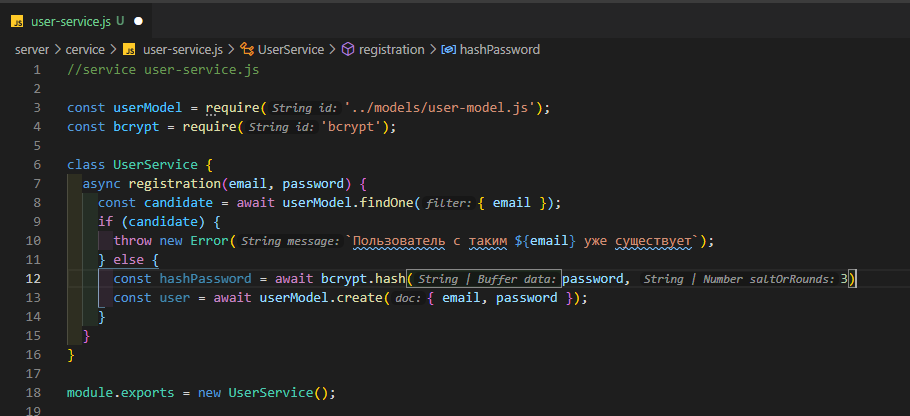
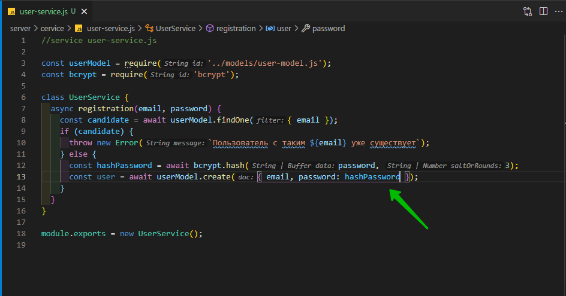
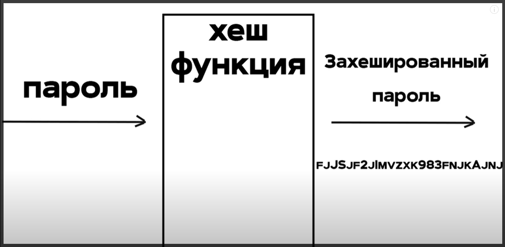
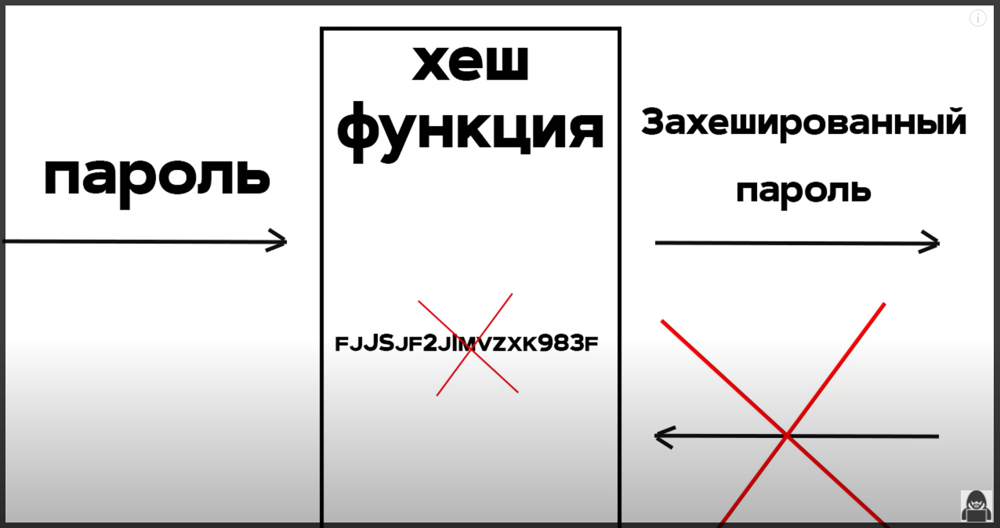
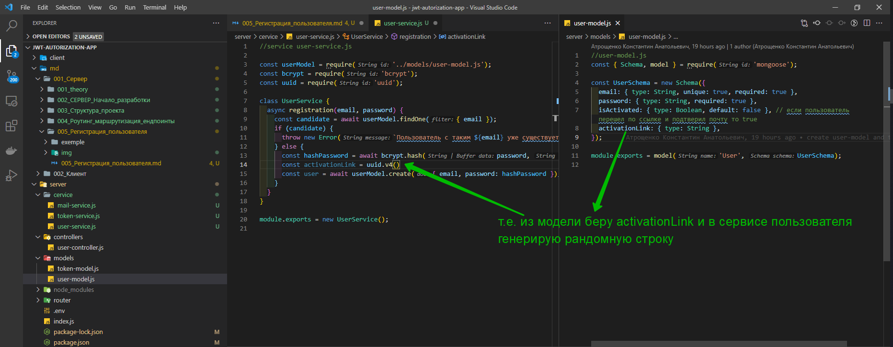
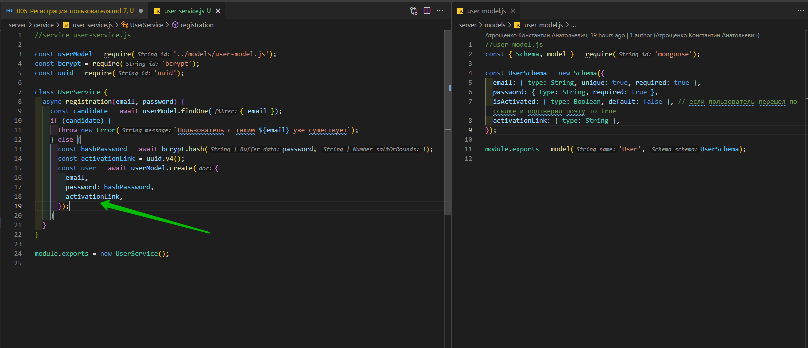

# Регистрация пользователя

Для того что бы контроллер у нас не был слишком толстый всю логику мы будем выносить в так называемые сервисы.

У нас будет три сервиса.

1. Для работы с пользователем. Создание, удаление поиск и т.д. В папке **service** создаю **user-service.js**
2. Для работы с **token**
3. И сервис для работы с почтой. Из него мы будем отправлять сообщения пользователям с активацией.

Опять же сервис у нас представляет просто класс. И из файла мы экспортируем экземпляр этого класса.

```js
//service user-service.js
class UserService {}

module.exports = new UserService();
```

тоже самое делаем для **mail-service.js** и для **token-service.js**.

```js
//service token-service.js

class TokenService {}

module.exports = new TokenService();
```

```js
//service mail-service.js

class MailService {}

module.exports = new MailService();
```

Начну я с **UserService**. И создаю здесь первую функцию. Это будет так же асинхронная функция для регистрации пользователей **registration**. Параметром данная функция будет принимать **email**, **password**. Которые мы будем получать в теле запроса.

```js
//service user-service.js
class UserService {
  async registration(email, password) {}
}

module.exports = new UserService();
```

Здесь мне понадобится модель пользвателя которую мы создавали чуть раньше. Поэтому импортируем ее в этот файл.

```js
//service user-service.js

const userModel = require('../models/user-model.js');

class UserService {
  async registration(email, password) {}
}

module.exports = new UserService();
```

И приступаем к логике регистрации.

Первым делом мы должны убедиться что в БД с таким **email** нет записи. Поэтому у **UserModel** вызываем функцию **findOne** и параметром туда передаю объект с полем **email**.

```js
//service user-service.js

const userModel = require('../models/user-model.js');

class UserService {
  async registration(email, password) {
    const candidate = await userModel.findOne({ email });
  }
}

module.exports = new UserService();
```

Т.е. поиск будет осуществляться именно по полю **email**.

Затем мы делаем проверку. Если **candidate** не равен **null**, то тогда мы пробрасываем ошибку которая будет обрабатываться в контроллере.

```js
//service user-service.js

const userModel = require('../models/user-model.js');

class UserService {
  async registration(email, password) {
    const candidate = await userModel.findOne({ email });
    if (candidate) {
      throw new Error(`Пользователь с таким ${email} уже существует`);
    }
  }
}

module.exports = new UserService();
```

Если это условие не выполнилось, то мы создаем пользователя и сохраняем его в БД.

```js
//service user-service.js

const userModel = require('../models/user-model.js');

class UserService {
  async registration(email, password) {
    const candidate = await userModel.findOne({ email });
    if (candidate) {
      throw new Error(`Пользователь с таким ${email} уже существует`);
    } else {
      const user = await userModel.create({ email, password });
    }
  }
}

module.exports = new UserService();
```

Не забываем что все операции связанные с БД это асинхронные операции. По этому не забываем **await**.

И так у модели т.е. **UserModel** вызываю функцию **create** и передаем туда **email** и пароль.

Но пароль в БД хранить в открытом виде это плохая практика. Поэтому мы сначало его закодируем.

Установим еще несколько модулей.

```shell
npm i jsonwebtoken bcrypt uuid
```

1. **jsonwebtoken** для генерации того самого **JWT**
2. **bcrypt** для шифрования пароля
3. **uuid** для генерации рандомных строк и их мы будем привязывать к ссылке для активации акаунта который будем отправлять на почту.

И так импортирую **bcrypt**. Сейчас идет создание пользователя с паролем который он нписал в форме. Но нам такое не подходит. Мы пароль захэшируем. Для этого обращается к **bcrypt** и вызываем функцию **hash**. Первым переметром передаю сам пароль т.е. **password**, а вторым параметром передаю **salt**



```js
//service user-service.js

const userModel = require('../models/user-model.js');
const bcrypt = require('bcrypt');

class UserService {
  async registration(email, password) {
    const candidate = await userModel.findOne({ email });
    if (candidate) {
      throw new Error(`Пользователь с таким ${email} уже существует`);
    } else {
      const hashPassword = await bcrypt.hash(password, 3);
      const user = await userModel.create({ email, password });
    }
  }
}

module.exports = new UserService();
```

И при создании пользователя мы указываем этот хешированный пароль.



```js
//service user-service.js

const userModel = require('../models/user-model.js');
const bcrypt = require('bcrypt');

class UserService {
  async registration(email, password) {
    const candidate = await userModel.findOne({ email });
    if (candidate) {
      throw new Error(`Пользователь с таким ${email} уже существует`);
    } else {
      const hashPassword = await bcrypt.hash(password, 3);
      const user = await userModel.create({ email, password: hashPassword });
    }
  }
}

module.exports = new UserService();
```

Что бы небыло черных ящиков обговорим как это работает.

Допустим злоумышленники каким-то образом получили доступ к нашей БД. И у них есть все пароли в открытом виде. В общем с этими паролями можно сделать все что угодно. Продать, использовать...

И у нас есть два варианта.

1. Либо эти пароли захешировать.
2. Либо эти пароли зашифровать.

Начнем с шифрования. Шифрование осуществляется по какому-то секретному ключу который знает только сервер. Это хороший вариант, но тут опять же если злоумышленники получили доступ к БД, то с большой вероятностью что они и подберут этот ключ. Т.е. зная ключ злоумышлинникам не составит труда расшифровать все пароли.

Поговорим о том как работает хэширование.

Пользователь присылает пароль и этот пароль проходит через некоторую хэш функцию . Как она работает нас пока особо не интересует.



На выходе из этой хэш функции мы имеем захешированный пароль. Это некоторая строка примерно такая которую вы видите на слайде. Т.е. в БД вместо обычных открытых паролей у нас будут храниться вот такие захэшированные строки.

Но главное отличие от шифрования здесь в том что обратно расхэшировать пароль мы не можем.



Т.е. злоумышленник имеет набор этих хэшей, но они ему абсолютно ни о чем не говорят.

И едиственный способ что пользователь правильно ввел пароль это его снова захэшировать и сравнить хэш который получился с тем хэшем котороый лежит в БД.

На данном этапе мы создали пользователя. У него есть **email** и захэшированный пароль.

Теперь нам необходимо активировать ссылку по которой пользователь будет активировать акаунт, подтверждать что эта почта принадлежит ему.

Соответственно эту ссылку для активации необходимо сгенерировать. Воспользуемся как раз тем пакетом **uuid** который мы установили чуть раньше.

Импортируем его в **user-service.js**. И вызовем у него функцию **v4** которая вернет нам рандомную уникальную строку.



Так же здесь можно было использовать захэшированный пароль в качестве этой ссылки



```js
//service user-service.js

const userModel = require('../models/user-model.js');
const bcrypt = require('bcrypt');
const uuid = require('uuid');

class UserService {
  async registration(email, password) {
    const candidate = await userModel.findOne({ email });
    if (candidate) {
      throw new Error(`Пользователь с таким ${email} уже существует`);
    } else {
      const hashPassword = await bcrypt.hash(password, 3);
      const activationLink = uuid.v4();
      const user = await userModel.create({
        email,
        password: hashPassword,
        activationLink,
      });
    }
  }
}

module.exports = new UserService();
```

После того как мы создали пользователя нам необходимо ему на почту отправить уведомление с этой ссылкой. Для этого я импортирую **mail-service.js**.

```js
//service user-service.js

const userModel = require('../models/user-model.js');
const bcrypt = require('bcrypt');
const uuid = require('uuid');
const mailService = require('./mail-service.js');

class UserService {
  async registration(email, password) {
    const candidate = await userModel.findOne({ email });
    if (candidate) {
      throw new Error(`Пользователь с таким ${email} уже существует`);
    } else {
      const hashPassword = await bcrypt.hash(password, 3);
      const activationLink = uuid.v4();
      const user = await userModel.create({
        email,
        password: hashPassword,
        activationLink,
      });
    }
  }
}

module.exports = new UserService();
```

**mail-service.js** у меня пока что пустой. Создам в нем функцию.

```js
//service mail-service.js

class MailService {
  async sendActivationMail() {}
}

module.exports = new MailService();
```

Пока что **sendActivationMail** оставляю пустой. Важно понимать что логика этой функции будет как раз по отправке письма для активации. Единственно сразу укажем параметры которые она будет принимать это **email** по которому отправлять письмо т.е. куда т.е. to и **link**.

```js
//service mail-service.js

class MailService {
  async sendActivationMail(to, link) {}
}

module.exports = new MailService();
```

Отправляемся обратно в **user-service.js** и вызываю эту функцию у **mailService**. первым параметром указываю **email** а вторым параметром пока что указываю **activationLink**. Чуть позже к **activationLink** мы вернемся и поправим.

```js
//service user-service.js

const userModel = require('../models/user-model.js');
const bcrypt = require('bcrypt');
const uuid = require('uuid');
const mailService = require('./mail-service.js');

class UserService {
  async registration(email, password) {
    const candidate = await userModel.findOne({ email });
    if (candidate) {
      throw new Error(`Пользователь с таким ${email} уже существует`);
    } else {
      const hashPassword = await bcrypt.hash(password, 3);
      const activationLink = uuid.v4();
      const user = await userModel.create({
        email,
        password: hashPassword,
        activationLink,
      });
      await mailService.sendActivationMail(email, activationLink);
    }
  }
}

module.exports = new UserService();
```
