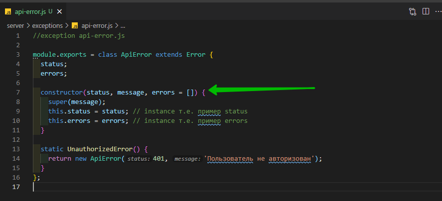
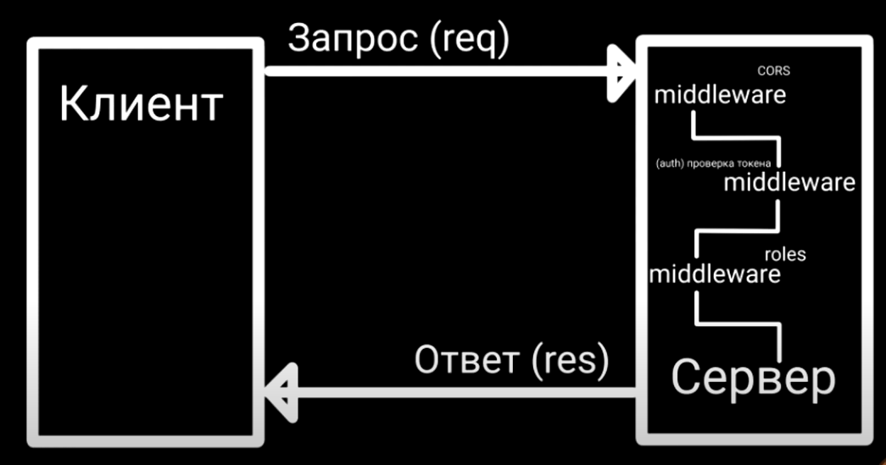
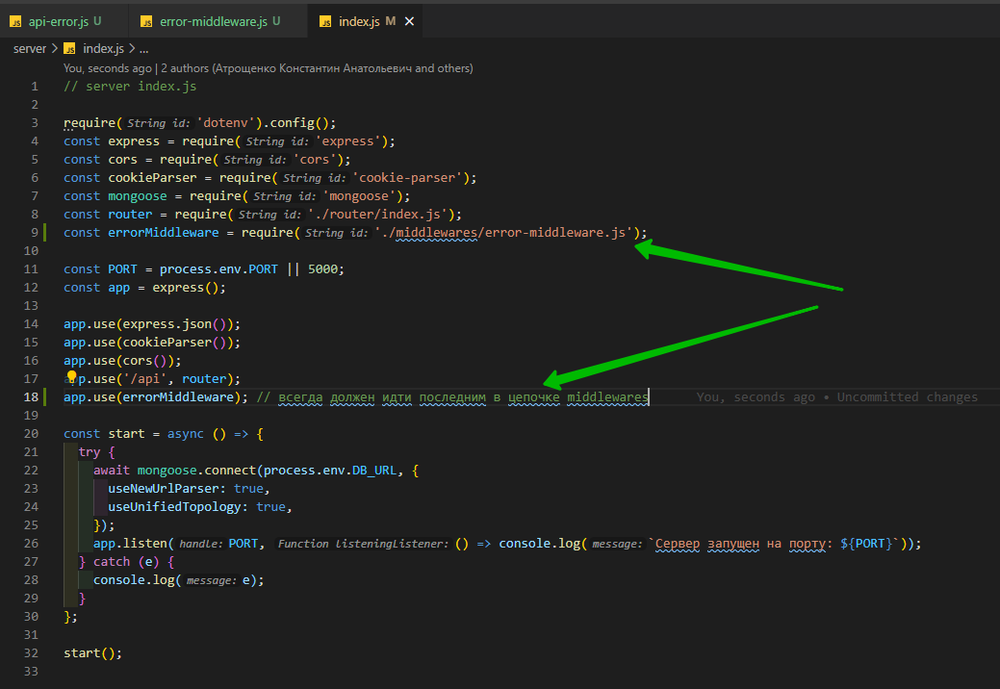
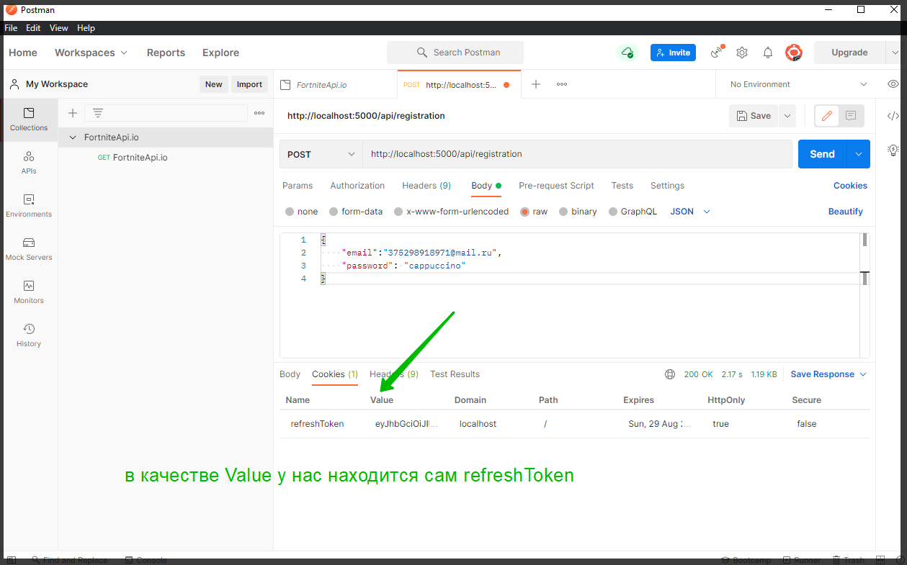
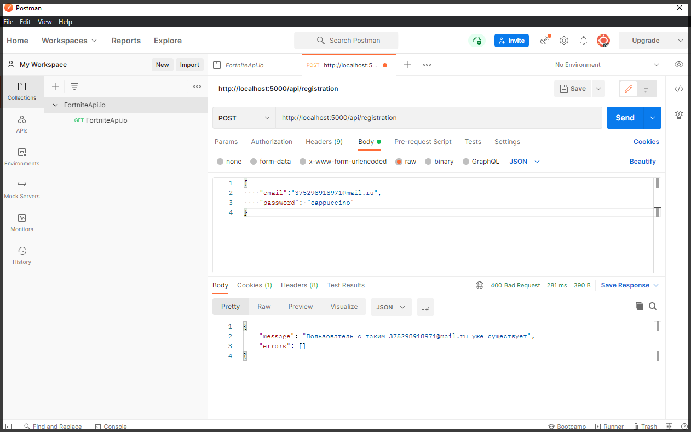
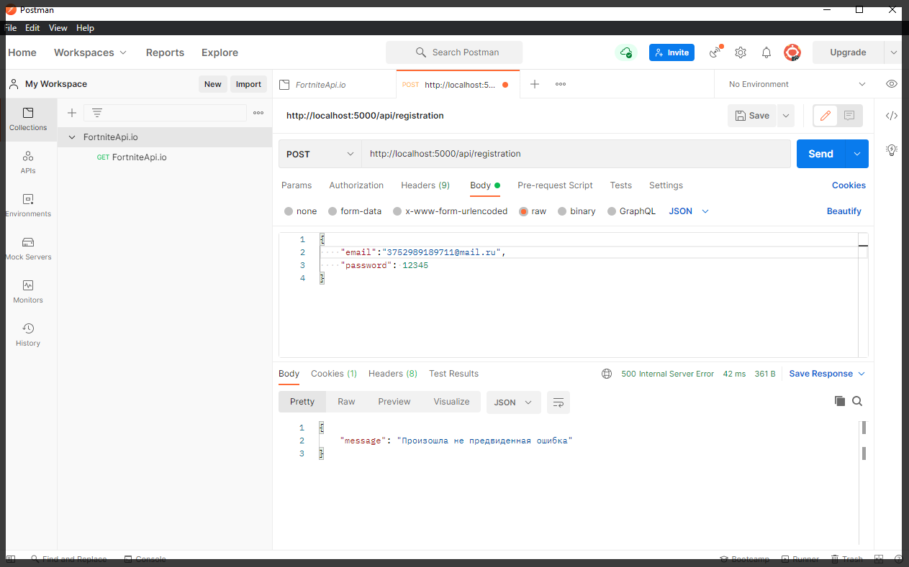

# Мидлвейр для обработки ошибок Error handler

Создаю в папке **server** папку **exceptions** в переводе исключения. В ней создам универсальный класс для ошибок которые связаны как-то с **API**. Т.е. сейчас в некоторых местах мы прокидывали **default** **JS** **Error**.

А сейчас мы реализуем свой собственный класс для ошибок.

```js
//exception api-error.js

module.exports = class ApiError extends Error {};
```

Наследуемся от **JS** класса **Error**.

На самом деле таким образом создавая класс **ApiError** через наследование от стандартного **JS** класса **Error** мы забираем все из **default** класса. Плюс то что мы напишем в своем собственном классе **ApiError**. Таким образом мы расширяем **default** **JS** класс **Error**.

В данный класс добавляю поле **status** и поле **errors**.

```js
//exception api-error.js

module.exports = class ApiError extends Error {
  status;
  errors;
};
```

Т.е. когда мы будем пробрасывать эту ошибку мы так же будем показывать **http** статус.

Далее создаю **constructor**. Он параметрами принимает **status**, **message**, **errors**.

```js
//exception api-error.js

module.exports = class ApiError extends Error {
  status;
  errors;

  constructor(status, message, errors) {}
};
```

так же с помощью метода **super** вызываю родительский конструктор и туду передаю **message**. И в инстанс этого класса помещаю **status** и **errors**.

```js
//exception api-error.js

module.exports = class ApiError extends Error {
  status;
  errors;

  constructor(status, message, errors) {
    super(message);
    this.status = status; // instance т.е. пример status
    this.errors = errors; // instance т.е. пример errors
  }
};
```

Про ошибки мы поговорим чуть позже к ним мы еще вернемся.

И так создадим пару **static** функций. Для тех кто не в курсе **static** функции это функции которые можно использовать не создавай экземпляр класса. Первую функцию назовем **UnauthorizedError**

```js
//exception api-error.js

module.exports = class ApiError extends Error {
  status;
  errors;

  constructor(status, message, errors) {
    super(message);
    this.status = status; // instance т.е. пример status
    this.errors = errors; // instance т.е. пример errors
  }

  static UnauthorizedError() {}
};
```

Параметрами она ничего принимать не будет. И все что мы делаем из этой функции это возвращаем экземпляр текущего класса. Т.е. мы создаем эту new **ApiError**. как статус указываем **401** т.е. пользователь не авторизован. И вторым параметром передаем как раз это сообщение.

```js
//exception api-error.js

module.exports = class ApiError extends Error {
  status;
  errors;

  constructor(status, message, errors) {
    super(message);
    this.status = status; // instance т.е. пример status
    this.errors = errors; // instance т.е. пример errors
  }

  static UnauthorizedError() {
    return new ApiError(401, 'Пользователь не авторизован');
  }
};
```

Ошибок у нас здесь нет. По этому мы можем по **default** массив ошибок делать просто пустым.



```js
//exception api-error.js

module.exports = class ApiError extends Error {
  status;
  errors;

  constructor(status, message, errors = []) {
    super(message);
    this.status = status; // instance т.е. пример status
    this.errors = errors; // instance т.е. пример errors
  }

  static UnauthorizedError() {
    return new ApiError(401, 'Пользователь не авторизован');
  }
};
```

Теперь создадим вторую **static** функцию и назовем ее **BadRequest** т.е. если пользователь указал какие-то не корректные значения. Не прошел валидацию или что-то еще.

```js
//exception api-error.js

module.exports = class ApiError extends Error {
  status;
  errors;

  constructor(status, message, errors = []) {
    super(message);
    this.status = status; // instance т.е. пример status
    this.errors = errors; // instance т.е. пример errors
  }

  static UnauthorizedError() {
    return new ApiError(401, 'Пользователь не авторизован');
  }

  static BadRequest(message, errors = []) {}
};
```

Здесь у нас уже будут сообщения и будут ошибки которые мы принимаем параметрами.

Опять же возвращаю **instance** текущего класса т.е. **new** **ApiError**. Статус код указываю **400**, передаю **message**, **errors**.

```js
//exception api-error.js

module.exports = class ApiError extends Error {
  status;
  errors;

  constructor(status, message, errors = []) {
    super(message);
    this.status = status; // instance т.е. пример status
    this.errors = errors; // instance т.е. пример errors
  }

  static UnauthorizedError() {
    return new ApiError(401, 'Пользователь не авторизован');
  }

  static BadRequest(message, errors = []) {
    return new ApiError(400, message, errors);
  }
};
```

Ну и на этом пока что закончим.

Теперь разберемся с **middleware** который будет эти ошибки обрабатывать. Создаю в папке **server** соответствующую папку **middlewares**. И в ней файл **error-middleware.js**

> В **web** разработке есть клиентская часть и есть **server** на котором. С клиента отправляется запрос по определенному маршруту. И какая-то функция на сервере этот запрос должна обработать. Любо вернуть какие-то данные либо их изменить.
>
> И вот тут мы подходим к концепции **middleware**.
> В данном контексте **middleware** это некоторое промежуточное звено межу запросом и функцией которая этот запрос должна обработать. Т.е. прежде чем запрос попадет в функцию он пройдет по цепочке **middleware**. Этих **middlewares** может быть сколько угодно много и все они вызываются последовательно.
>
> Однин из вариантов **middleware** может быть проверка запроса на соответствие **CORS**.
>
> Или же допустим функция обрабатывает только авторизованных пользователей. И авторизация проходит через **token** доступа. И прежде чем запрос попадает в эту функцию, мы попадаем в **middleware** который проверит **token**. Если **token** валидный и пользователь действительно авторизован, то вызывается следующий **middleware**. Если же нет, то бросаем ошибку. Т.е. запрос до функции просто не дойдет.
>
> Как еще один пример можно привести проверку ролей. Допустим какими-то функциями могут пользоваться только администраторы. По этому в **middleware** мы сначало проверим является ли пользователь администратором или нет и только потом разрешим ему доступ. И после всей этой цепочки **middlewares** запрос доходит до функции, обрабатывается и возвращается обратно на клиент.



И так создаю **middleware** и он будет отвечать за обработку ошибок. Это функция которая параметрами принимает опять же **req**, **res**, и функцию **next**. Но **middleware** для обработки ошибок так же первым параметром принимае саму ошибку err ЭТО ВАЖНЫЙ МОМЕНТ!!!!

```js
//server middleware error-middleware.js

module.exports = function (err, req, res, next) {
  console.log(err);
};
```

Внутри этого **middleware** во-первых мы эту ошибку будем логировать т.е. выводить ее вконсоль для того что бы это не делать в каждой функции контроллера. Так же импортирую туда класс который мы создали чуть ренее т.е. тот самый **ApiError**.

```js
//server middleware error-middleware.js

const ApiError = require('../exceptions/api-error.js');

module.exports = function (err, req, res, next) {
  console.log(err);
};
```

И делаем проверку. Если ошибка является инстансом этого класса **err** **instanceof** **ApiError**, то тогда мы сразу возвращаем ответ на клиент. Обращаемся к объекту res вызываю функицию **status**, туду передаю статус из ошибки **err.status**. Это либо **401** или **400**. Затем результат этой функции с помощью функции **json** передаю ее в виде сообщения на клиент. В **message** указываю само сообщение, его мы так же достаем из самой ошибки. И так же тело ответа мы помещаем в массив ошибок **errors**.

```js
//server middleware error-middleware.js

const ApiError = require('../exceptions/api-error.js');

module.exports = function (err, req, res, next) {
  console.log(err);
  if (err instanceof ApiError) {
    return res
      .status(err.status)
      .json({ message: err.message, errors: err.errors });
  }
};
```

Если же это условие не выполнилось, то значит ошибку мы не предусмотрели и что-то у нас пошло не по плану. Это **500** статус код и говорит он о том что произошла какая-то серверная ошибка.

```js
//server middleware error-middleware.js

const ApiError = require('../exceptions/api-error.js');

module.exports = function (err, req, res, next) {
  console.log(err);
  if (err instanceof ApiError) {
    return res
      .status(err.status)
      .json({ message: err.message, errors: err.errors });
  } else {
    return res
      .status(500)
      .json({ message: 'Произошла не предвиденная ошибка' });
  }
};
```

Так же для наглядности можно указать сообщение ошибки.

Теперь заставлю работать этот **middleware**. Перехожу в **server** **index.js**. И для того что бы его подключить импортирую данный **middleware**.

И еще один важный нюанс. Когда вы подключаете **middleware** для обработки ошибок он обязательно должен идти последним в цепочке **middlewares**



```js
// server index.js

require('dotenv').config();
const express = require('express');
const cors = require('cors');
const cookieParser = require('cookie-parser');
const mongoose = require('mongoose');
const router = require('./router/index.js');
const errorMiddleware = require('./middlewares/error-middleware.js');

const PORT = process.env.PORT || 5000;
const app = express();

app.use(express.json());
app.use(cookieParser());
app.use(cors());
app.use('/api', router);
app.use(errorMiddleware); // всегда должен идти последним в цепочке middlewares

const start = async () => {
  try {
    await mongoose.connect(process.env.DB_URL, {
      useNewUrlParser: true,
      useUnifiedTopology: true,
    });
    app.listen(PORT, () => console.log(`Сервер запущен на порту: ${PORT}`));
  } catch (e) {
    console.log(e);
  }
};

start();
```

И еще один важный момент это **cookie**. Их можно посмотреть прям в самом **postman**.



И так как теперь эту ошибку загнать в сам **middleware**.

Во-первых откроем **user-service.js** и там где мы пробрасывали обычный **Error** теперь будем пробрасывать **ApiError**, но для этого его сюда надо импортировать.

```js
//service user-service.js

const userModel = require('../models/user-model.js');
const bcrypt = require('bcrypt');
const uuid = require('uuid');
const mailService = require('./mail-service.js');
const tokenService = require('./token-service.js');
const UserDto = require('../dtos/user-dto.js');
const ApiError = require('../exceptions/api-error.js');

class UserService {
  // регистрация пользователя
  async registration(email, password) {
    const candidate = await userModel.findOne({ email });
    if (candidate) {
      throw ApiError.BadRequest(`Пользователь с таким ${email} уже существует`);
    } else {
      const hashPassword = await bcrypt.hash(password, 3);
      const activationLink = uuid.v4();
      const user = await userModel.create({
        email,
        password: hashPassword,
        activationLink,
      });
      await mailService.sendActivationMail(
        email,
        `${process.env.API_URL}/api/activate/${activationLink}`
      );

      const userDto = new UserDto(user); // id, email, isActivated
      const tokens = tokenService.generateToken({ ...userDto }); // помещаю accessToken и refreshToken в объект
      await tokenService.saveToken(userDto.id, tokens.refreshToken);

      return { ...tokens, user: userDto };
    }
  }

  // активация акаунта по ссылке
  async activate(activationLink) {
    const user = await userModel.findOne({ activationLink }); // ищем пользователя по ссылке
    if (!user) {
      throw ApiError.BadRequest('Неккоректная ссылка активации ');
    } else {
      user.isActivated = true; // активирую акаунт
      await user.save(); // сохраняю обновленного пользователя
    }
  }
}

module.exports = new UserService();
```

Здесь везде BadRequest потому что с **UnauthorizedError** мы будем работать позже когда пользователь уже будет пытаться запросить данные которые доступны только зарегистрированным пользователем.

Теперь открываем **user-controller.js** и в блоке **catch** где мы ловим ошибку мы вызываемфукцию **next** и туда эту ошибку передаем.

```js
// controllers user-controller.js

const { activate } = require('../service/user-service.js');
const userService = require('../service/user-service.js');
class UserController {
  async registration(req, res, next) {
    try {
      const { email, password } = req.body;
      const userData = await userService.registration(email, password);
      res.cookie('refreshToken', userData.refreshToken, {
        maxAge: 30 * 24 * 60 * 60 * 1000,
        httpOnly: true,
      });
      return res.json(userData);
    } catch (e) {
      next(e);
    }
  }

  async login(req, res, next) {
    try {
    } catch (e) {
      next(e);
    }
  }

  async logout(req, res, next) {
    try {
    } catch (e) {
      next(e);
    }
  }

  async activate(req, res, next) {
    try {
      const activationLink = req.params.link;
      await userService.activate(activationLink); //передаю activationLink в  userService а точнее  user-service.js где отлавливаю в функции activate
      return res.redirect(process.env.CLIENT_URL); // перенаправляю на front-end
    } catch (e) {
      next(e);
    }
  }

  async refresh(req, res, next) {
    try {
    } catch (e) {
      next(e);
    }
  }

  async getUsers(req, res, next) {
    try {
      res.json(['123', '456']);
    } catch (e) {
      next(e);
    }
  }
}

module.exports = new UserController();
```

Таким образом если в этот **next** попадает **ApiError** он будет обработан соответствующим образом. Вызывая next с ошибкой мы как раз попадаем в том **middleware** который мы чуть ранее реализовали.

Через postmat отправляю еще раз запрос. По идее должна возникнуть ошибка что пользователь с таким **email** существует.



И если я пароль сделаю **number**. То будет не предвиденная ошибка.


