# Функция логина

В **user-controller.js** в функции **login** мы вытаскиваем из тела запроса **email** и **password**.

После чего аналогичным регистрации образом нам необходимо вызвать функцию из **useService** которая будет называться **login** и праметрами в нее как раз передать **email** и **password**.

```js
// controllers user-controller.js

const { activate } = require('../service/user-service.js');
const userService = require('../service/user-service.js');
const { validationResult } = require('express-validator');
const ApiError = require('../exceptions/api-error.js');

class UserController {
  async registration(req, res, next) {
    try {
      const errors = validationResult(req);

      if (!errors.isEmpty()) {
        return next(
          ApiError.BadRequest('Ошибка при валидации', errors.array())
        );
      }

      const { email, password } = req.body;
      const userData = await userService.registration(email, password);
      res.cookie('refreshToken', userData.refreshToken, {
        maxAge: 30 * 24 * 60 * 60 * 1000,
        httpOnly: true,
      });
      return res.json(userData);
    } catch (e) {
      next(e);
    }
  }

  async login(req, res, next) {
    try {
      const { email, password } = req.body;
      const userData = await userService.login(email, password);
    } catch (e) {
      next(e);
    }
  }

  async logout(req, res, next) {
    try {
    } catch (e) {
      next(e);
    }
  }

  async activate(req, res, next) {
    try {
      const activationLink = req.params.link;
      await userService.activate(activationLink); //передаю activationLink в  userService а точнее  user-service.js где отлавливаю в функции activate
      return res.redirect(process.env.CLIENT_URL); // перенаправляю на front-end
    } catch (e) {
      next(e);
    }
  }

  async refresh(req, res, next) {
    try {
    } catch (e) {
      next(e);
    }
  }

  async getUsers(req, res, next) {
    try {
      res.json(['123', '456']);
    } catch (e) {
      next(e);
    }
  }
}

module.exports = new UserController();
```

Так же необходимо будет установить **refreshToken** в **cookie**

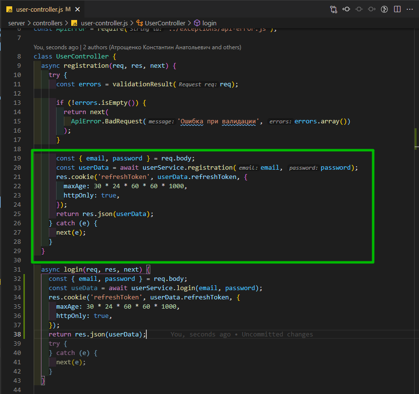

```js
// controllers user-controller.js

const { activate } = require('../service/user-service.js');
const userService = require('../service/user-service.js');
const { validationResult } = require('express-validator');
const ApiError = require('../exceptions/api-error.js');

class UserController {
  async registration(req, res, next) {
    try {
      const errors = validationResult(req);

      if (!errors.isEmpty()) {
        return next(
          ApiError.BadRequest('Ошибка при валидации', errors.array())
        );
      }

      const { email, password } = req.body;
      const userData = await userService.registration(email, password);
      res.cookie('refreshToken', userData.refreshToken, {
        maxAge: 30 * 24 * 60 * 60 * 1000,
        httpOnly: true,
      });
      return res.json(userData);
    } catch (e) {
      next(e);
    }
  }

  async login(req, res, next) {
    try {
      const { email, password } = req.body;
      const userData = await userService.login(email, password);
      res.cookie('refreshToken', userData.refreshToken, {
        maxAge: 30 * 24 * 60 * 60 * 1000,
        httpOnly: true,
      });
      return res.json(userData);
    } catch (e) {
      next(e);
    }
  }

  async logout(req, res, next) {
    try {
    } catch (e) {
      next(e);
    }
  }

  async activate(req, res, next) {
    try {
      const activationLink = req.params.link;
      await userService.activate(activationLink); //передаю activationLink в  userService а точнее  user-service.js где отлавливаю в функции activate
      return res.redirect(process.env.CLIENT_URL); // перенаправляю на front-end
    } catch (e) {
      next(e);
    }
  }

  async refresh(req, res, next) {
    try {
    } catch (e) {
      next(e);
    }
  }

  async getUsers(req, res, next) {
    try {
      res.json(['123', '456']);
    } catch (e) {
      next(e);
    }
  }
}

module.exports = new UserController();
```

Теперь перехожу к **user-service.js** и создаю эту функцию. И здесь создам эту самую функцию для логина которая как я говорил ранее принимает **email** и **password**.

```js
//service user-service.js

const userModel = require('../models/user-model.js');
const bcrypt = require('bcrypt');
const uuid = require('uuid');
const mailService = require('./mail-service.js');
const tokenService = require('./token-service.js');
const UserDto = require('../dtos/user-dto.js');
const ApiError = require('../exceptions/api-error.js');

class UserService {
  // регистрация пользователя
  async registration(email, password) {
    const candidate = await userModel.findOne({ email });
    if (candidate) {
      throw ApiError.BadRequest(`Пользователь с таким ${email} уже существует`);
    } else {
      const hashPassword = await bcrypt.hash(password, 3);
      const activationLink = uuid.v4();
      const user = await userModel.create({
        email,
        password: hashPassword,
        activationLink,
      });
      await mailService.sendActivationMail(
        email,
        `${process.env.API_URL}/api/activate/${activationLink}`
      );

      const userDto = new UserDto(user); // id, email, isActivated
      const tokens = tokenService.generateToken({ ...userDto }); // помещаю accessToken и refreshToken в объект
      await tokenService.saveToken(userDto.id, tokens.refreshToken);

      return { ...tokens, user: userDto };
    }
  }

  // активация акаунта по ссылке
  async activate(activationLink) {
    const user = await userModel.findOne({ activationLink }); // ищем пользователя по ссылке
    if (!user) {
      throw ApiError.BadRequest('Неккоректная ссылка активации ');
    } else {
      user.isActivated = true; // активирую акаунт
      await user.save(); // сохраняю обновленного пользователя
    }
  }

  // функция логина пользователя

  async login(email, password) {}
}

module.exports = new UserService();
```

И здесь сама логика будет очень похода на регистрацию. В первую очередь мы ищем пользователя в БД c данным **email**.

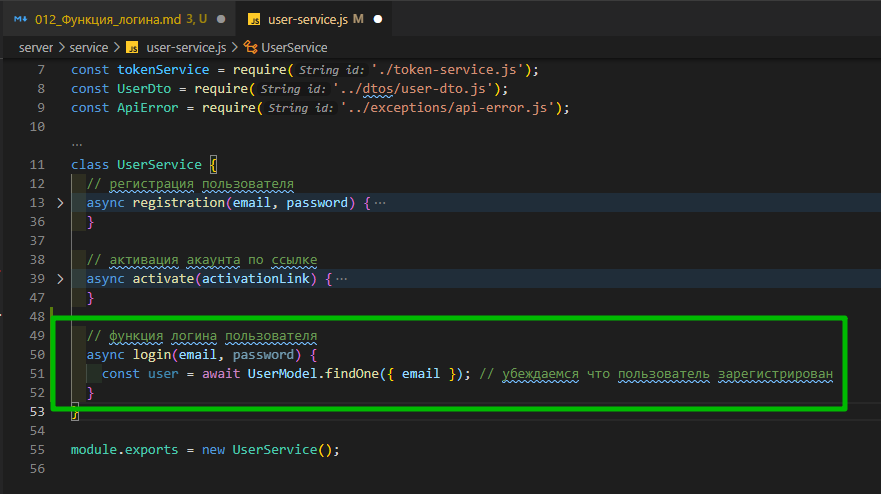

Далее пишем условие. Если пользователь не найден, то тогда же конечно мы пробрасывам ошибку. через **throw** обращаемся к **ApiError.BadRequest** и в сообщении указываем что пользователь не был найден.

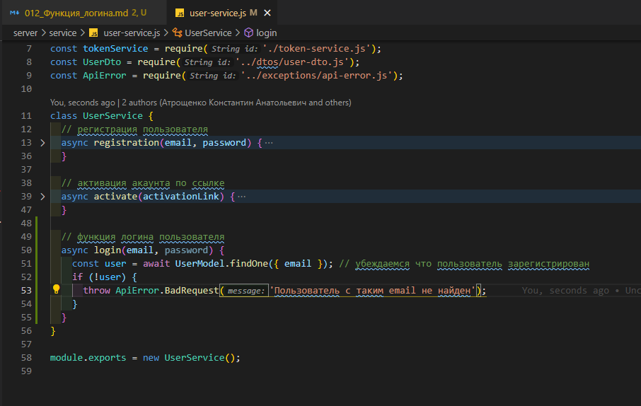

```js
//service user-service.js

const userModel = require('../models/user-model.js');
const bcrypt = require('bcrypt');
const uuid = require('uuid');
const mailService = require('./mail-service.js');
const tokenService = require('./token-service.js');
const UserDto = require('../dtos/user-dto.js');
const ApiError = require('../exceptions/api-error.js');

class UserService {
  // регистрация пользователя
  async registration(email, password) {
    const candidate = await userModel.findOne({ email });
    if (candidate) {
      throw ApiError.BadRequest(`Пользователь с таким ${email} уже существует`);
    } else {
      const hashPassword = await bcrypt.hash(password, 3);
      const activationLink = uuid.v4();
      const user = await userModel.create({
        email,
        password: hashPassword,
        activationLink,
      });
      await mailService.sendActivationMail(
        email,
        `${process.env.API_URL}/api/activate/${activationLink}`
      );

      const userDto = new UserDto(user); // id, email, isActivated
      const tokens = tokenService.generateToken({ ...userDto }); // помещаю accessToken и refreshToken в объект
      await tokenService.saveToken(userDto.id, tokens.refreshToken);

      return { ...tokens, user: userDto };
    }
  }

  // активация акаунта по ссылке
  async activate(activationLink) {
    const user = await userModel.findOne({ activationLink }); // ищем пользователя по ссылке
    if (!user) {
      throw ApiError.BadRequest('Неккоректная ссылка активации ');
    } else {
      user.isActivated = true; // активирую акаунт
      await user.save(); // сохраняю обновленного пользователя
    }
  }

  // функция логина пользователя
  async login(email, password) {
    const user = await UserModel.findOne({ email }); // убеждаемся что пользователь зарегистрирован
    if (!user) {
      throw ApiError.BadRequest('Пользователь с таким email не найден');
    }
  }
}

module.exports = new UserService();
```

Если это условие не выполнилось, то пользователь был найден, и нам необходимо сравнить пароли. Но не забываем что пароли мы храним в захэшированном виде. По этому нам необходимо сравнить паролько торый отправил пользователь с захэшированным паролем который храниться в БД. Создаю переменную **isPassEaqls** в которую **await** и для того что бы сравнить у **bcrypt** вызываю функцию **compare()**. Первым параметром передаю сам пароль. А вторым параметром передаю пароль из БД **user.password** который является захэшированным.

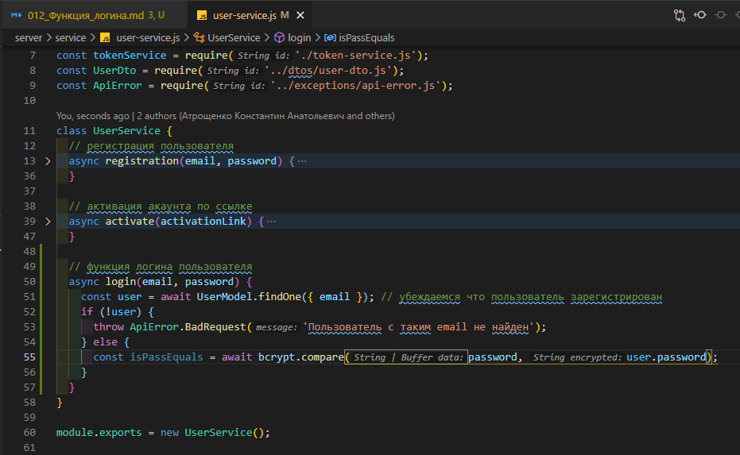

```js
//service user-service.js

const userModel = require('../models/user-model.js');
const bcrypt = require('bcrypt');
const uuid = require('uuid');
const mailService = require('./mail-service.js');
const tokenService = require('./token-service.js');
const UserDto = require('../dtos/user-dto.js');
const ApiError = require('../exceptions/api-error.js');

class UserService {
  // регистрация пользователя
  async registration(email, password) {
    const candidate = await userModel.findOne({ email });
    if (candidate) {
      throw ApiError.BadRequest(`Пользователь с таким ${email} уже существует`);
    } else {
      const hashPassword = await bcrypt.hash(password, 3);
      const activationLink = uuid.v4();
      const user = await userModel.create({
        email,
        password: hashPassword,
        activationLink,
      });
      await mailService.sendActivationMail(
        email,
        `${process.env.API_URL}/api/activate/${activationLink}`
      );

      const userDto = new UserDto(user); // id, email, isActivated
      const tokens = tokenService.generateToken({ ...userDto }); // помещаю accessToken и refreshToken в объект
      await tokenService.saveToken(userDto.id, tokens.refreshToken);

      return { ...tokens, user: userDto };
    }
  }

  // активация акаунта по ссылке
  async activate(activationLink) {
    const user = await userModel.findOne({ activationLink }); // ищем пользователя по ссылке
    if (!user) {
      throw ApiError.BadRequest('Неккоректная ссылка активации ');
    } else {
      user.isActivated = true; // активирую акаунт
      await user.save(); // сохраняю обновленного пользователя
    }
  }

  // функция логина пользователя
  async login(email, password) {
    const user = await UserModel.findOne({ email }); // убеждаемся что пользователь зарегистрирован
    if (!user) {
      throw ApiError.BadRequest('Пользователь с таким email не найден');
    } else {
      const isPassEquals = await bcrypt.compare(password, user.password);
    }
  }
}

module.exports = new UserService();
```

После чего мы делаем условие и если пароли не равны **!isPassEquals** и мы возвращаем опять же ошибку **throw** С сообщением что пароль не верен.

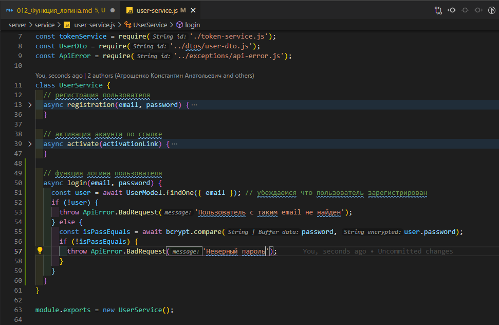

```js
//service user-service.js

const userModel = require('../models/user-model.js');
const bcrypt = require('bcrypt');
const uuid = require('uuid');
const mailService = require('./mail-service.js');
const tokenService = require('./token-service.js');
const UserDto = require('../dtos/user-dto.js');
const ApiError = require('../exceptions/api-error.js');

class UserService {
  // регистрация пользователя
  async registration(email, password) {
    const candidate = await userModel.findOne({ email });
    if (candidate) {
      throw ApiError.BadRequest(`Пользователь с таким ${email} уже существует`);
    } else {
      const hashPassword = await bcrypt.hash(password, 3);
      const activationLink = uuid.v4();
      const user = await userModel.create({
        email,
        password: hashPassword,
        activationLink,
      });
      await mailService.sendActivationMail(
        email,
        `${process.env.API_URL}/api/activate/${activationLink}`
      );

      const userDto = new UserDto(user); // id, email, isActivated
      const tokens = tokenService.generateToken({ ...userDto }); // помещаю accessToken и refreshToken в объект
      await tokenService.saveToken(userDto.id, tokens.refreshToken);

      return { ...tokens, user: userDto };
    }
  }

  // активация акаунта по ссылке
  async activate(activationLink) {
    const user = await userModel.findOne({ activationLink }); // ищем пользователя по ссылке
    if (!user) {
      throw ApiError.BadRequest('Неккоректная ссылка активации ');
    } else {
      user.isActivated = true; // активирую акаунт
      await user.save(); // сохраняю обновленного пользователя
    }
  }

  // функция логина пользователя
  async login(email, password) {
    const user = await UserModel.findOne({ email }); // убеждаемся что пользователь зарегистрирован
    if (!user) {
      throw ApiError.BadRequest('Пользователь с таким email не найден');
    } else {
      const isPassEquals = await bcrypt.compare(password, user.password);
      if (!isPassEquals) {
        throw ApiError.BadRequest('Неверный пароль');
      }
    }
  }
}

module.exports = new UserService();
```

После чего мы опять генерируем **userDto** т.е. из модели выбрасываем все не нужное. **const userDto = new UserDto(user)**

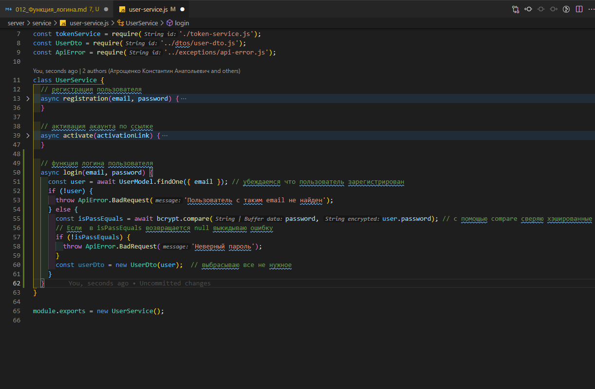

```js
//service user-service.js

const userModel = require('../models/user-model.js');
const bcrypt = require('bcrypt');
const uuid = require('uuid');
const mailService = require('./mail-service.js');
const tokenService = require('./token-service.js');
const UserDto = require('../dtos/user-dto.js');
const ApiError = require('../exceptions/api-error.js');

class UserService {
  // регистрация пользователя
  async registration(email, password) {
    const candidate = await userModel.findOne({ email });
    if (candidate) {
      throw ApiError.BadRequest(`Пользователь с таким ${email} уже существует`);
    } else {
      const hashPassword = await bcrypt.hash(password, 3);
      const activationLink = uuid.v4();
      const user = await userModel.create({
        email,
        password: hashPassword,
        activationLink,
      });
      await mailService.sendActivationMail(
        email,
        `${process.env.API_URL}/api/activate/${activationLink}`
      );

      const userDto = new UserDto(user); // id, email, isActivated
      const tokens = tokenService.generateToken({ ...userDto }); // помещаю accessToken и refreshToken в объект
      await tokenService.saveToken(userDto.id, tokens.refreshToken);

      return { ...tokens, user: userDto };
    }
  }

  // активация акаунта по ссылке
  async activate(activationLink) {
    const user = await userModel.findOne({ activationLink }); // ищем пользователя по ссылке
    if (!user) {
      throw ApiError.BadRequest('Неккоректная ссылка активации ');
    } else {
      user.isActivated = true; // активирую акаунт
      await user.save(); // сохраняю обновленного пользователя
    }
  }

  // функция логина пользователя
  async login(email, password) {
    const user = await UserModel.findOne({ email }); // убеждаемся что пользователь зарегистрирован
    if (!user) {
      throw ApiError.BadRequest('Пользователь с таким email не найден');
    } else {
      const isPassEquals = await bcrypt.compare(password, user.password); // c помощью compare сверяю хэшированные пароли
      // Если  в isPassEquals возвращается null выкидываю ошибку
      if (!isPassEquals) {
        throw ApiError.BadRequest('Неверный пароль');
      }
      const userDto = new UserDto(user); // выбрасываю все не нужное
    }
  }
}

module.exports = new UserService();
```

Затем так же как в функции регистрации мы генерируем пару токенов. **const tokens =** для этого у нас есть соответствующая функция в **tokenServise.generateTokens()** передаем туда **{...userDto}**

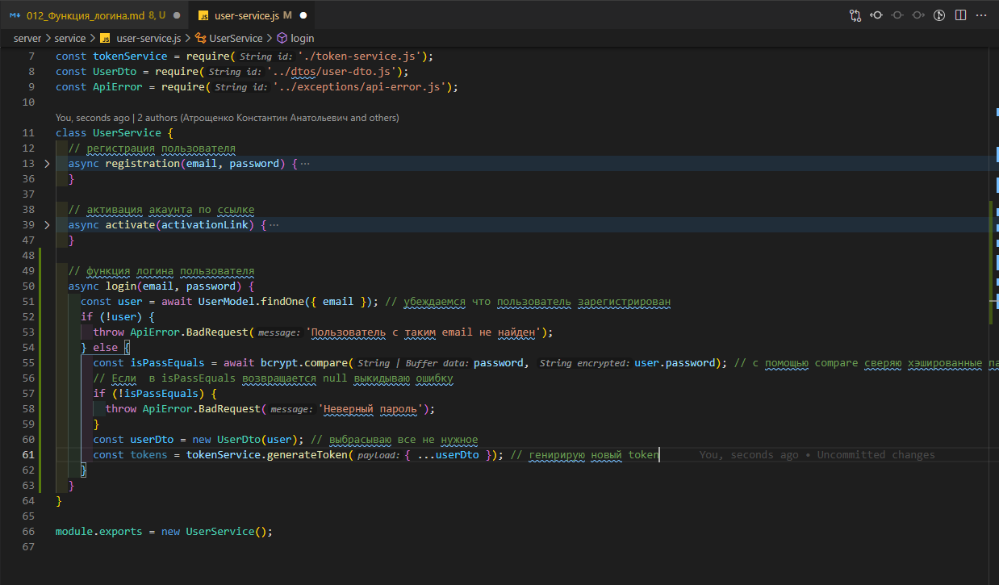

```js
//service user-service.js

const userModel = require('../models/user-model.js');
const bcrypt = require('bcrypt');
const uuid = require('uuid');
const mailService = require('./mail-service.js');
const tokenService = require('./token-service.js');
const UserDto = require('../dtos/user-dto.js');
const ApiError = require('../exceptions/api-error.js');

class UserService {
  // регистрация пользователя
  async registration(email, password) {
    const candidate = await userModel.findOne({ email });
    if (candidate) {
      throw ApiError.BadRequest(`Пользователь с таким ${email} уже существует`);
    } else {
      const hashPassword = await bcrypt.hash(password, 3);
      const activationLink = uuid.v4();
      const user = await userModel.create({
        email,
        password: hashPassword,
        activationLink,
      });
      await mailService.sendActivationMail(
        email,
        `${process.env.API_URL}/api/activate/${activationLink}`
      );

      const userDto = new UserDto(user); // id, email, isActivated
      const tokens = tokenService.generateToken({ ...userDto }); // помещаю accessToken и refreshToken в объект
      await tokenService.saveToken(userDto.id, tokens.refreshToken);

      return { ...tokens, user: userDto };
    }
  }

  // активация акаунта по ссылке
  async activate(activationLink) {
    const user = await userModel.findOne({ activationLink }); // ищем пользователя по ссылке
    if (!user) {
      throw ApiError.BadRequest('Неккоректная ссылка активации ');
    } else {
      user.isActivated = true; // активирую акаунт
      await user.save(); // сохраняю обновленного пользователя
    }
  }

  // функция логина пользователя
  async login(email, password) {
    const user = await UserModel.findOne({ email }); // убеждаемся что пользователь зарегистрирован
    if (!user) {
      throw ApiError.BadRequest('Пользователь с таким email не найден');
    } else {
      const isPassEquals = await bcrypt.compare(password, user.password); // c помощью compare сверяю хэшированные пароли
      // Если  в isPassEquals возвращается null выкидываю ошибку
      if (!isPassEquals) {
        throw ApiError.BadRequest('Неверный пароль');
      }
      const userDto = new UserDto(user); // выбрасываю все не нужное
      const tokens = tokenService.generateToken({ ...userDto }); // генирирую новый token
    }
  }
}

module.exports = new UserService();
```

Затем **refreshToken** нам необходимо сохранить в БД

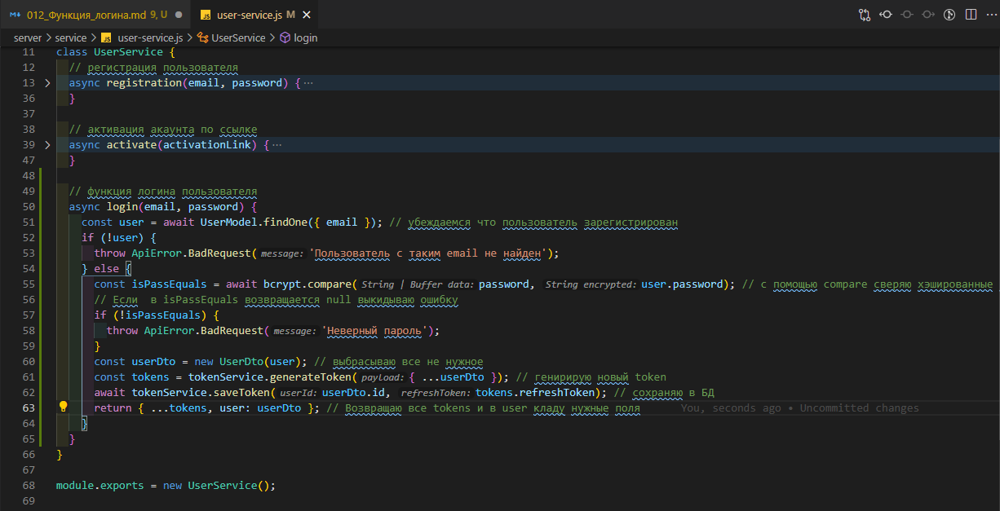

```js
//service user-service.js

const userModel = require('../models/user-model.js');
const bcrypt = require('bcrypt');
const uuid = require('uuid');
const mailService = require('./mail-service.js');
const tokenService = require('./token-service.js');
const UserDto = require('../dtos/user-dto.js');
const ApiError = require('../exceptions/api-error.js');

class UserService {
  // регистрация пользователя
  async registration(email, password) {
    const candidate = await userModel.findOne({ email });
    if (candidate) {
      throw ApiError.BadRequest(`Пользователь с таким ${email} уже существует`);
    } else {
      const hashPassword = await bcrypt.hash(password, 3);
      const activationLink = uuid.v4();
      const user = await userModel.create({
        email,
        password: hashPassword,
        activationLink,
      });
      await mailService.sendActivationMail(
        email,
        `${process.env.API_URL}/api/activate/${activationLink}`
      );

      const userDto = new UserDto(user); // id, email, isActivated
      const tokens = tokenService.generateToken({ ...userDto }); // помещаю accessToken и refreshToken в объект
      await tokenService.saveToken(userDto.id, tokens.refreshToken);

      return { ...tokens, user: userDto };
    }
  }

  // активация акаунта по ссылке
  async activate(activationLink) {
    const user = await userModel.findOne({ activationLink }); // ищем пользователя по ссылке
    if (!user) {
      throw ApiError.BadRequest('Неккоректная ссылка активации ');
    } else {
      user.isActivated = true; // активирую акаунт
      await user.save(); // сохраняю обновленного пользователя
    }
  }

  // функция логина пользователя
  async login(email, password) {
    const user = await UserModel.findOne({ email }); // убеждаемся что пользователь зарегистрирован
    if (!user) {
      throw ApiError.BadRequest('Пользователь с таким email не найден');
    } else {
      const isPassEquals = await bcrypt.compare(password, user.password); // c помощью compare сверяю хэшированные пароли
      // Если  в isPassEquals возвращается null выкидываю ошибку
      if (!isPassEquals) {
        throw ApiError.BadRequest('Неверный пароль');
      }
      const userDto = new UserDto(user); // выбрасываю все не нужное
      const tokens = tokenService.generateToken({ ...userDto }); // генирирую новый token
      await tokenService.saveToken(userDto.id, tokens.refreshToken); // сохраняю в БД
      return { ...tokens, user: userDto }; // Возвращаю все tokens и в user кладу нужные поля
    }
  }
}

module.exports = new UserService();
```

И так как обычно исправлено пару синтаксических ошибок.

```js
// controllers user-controller.js

const { activate } = require('../service/user-service.js');
const userService = require('../service/user-service.js');
const { validationResult } = require('express-validator');
const ApiError = require('../exceptions/api-error.js');

class UserController {
  async registration(req, res, next) {
    try {
      const errors = validationResult(req); // валидация

      if (!errors.isEmpty()) {
        return next(
          ApiError.BadRequest('Ошибка при валидации', errors.array())
        );
      }

      const { email, password } = req.body;
      const userData = await userService.registration(email, password);
      res.cookie('refreshToken', userData.refreshToken, {
        maxAge: 30 * 24 * 60 * 60 * 1000,
        httpOnly: true,
      });
      return res.json(userData);
    } catch (e) {
      next(e);
    }
  }

  async login(req, res, next) {
    try {
      const { email, password } = req.body;
      const userData = await userService.login(email, password);
      res.cookie('refreshToken', userData.refreshToken, {
        maxAge: 30 * 24 * 60 * 60 * 1000,
        httpOnly: true,
      });
      return res.json(userData);
    } catch (e) {
      next(e);
    }
  }

  async logout(req, res, next) {
    try {
    } catch (e) {
      next(e);
    }
  }

  async activate(req, res, next) {
    try {
      const activationLink = req.params.link;
      await userService.activate(activationLink); //передаю activationLink в  userService а точнее  user-service.js где отлавливаю в функции activate
      return res.redirect(process.env.CLIENT_URL); // перенаправляю на front-end
    } catch (e) {
      next(e);
    }
  }

  async refresh(req, res, next) {
    try {
    } catch (e) {
      next(e);
    }
  }

  async getUsers(req, res, next) {
    try {
      res.json(['123', '456']);
    } catch (e) {
      next(e);
    }
  }
}

module.exports = new UserController();
```

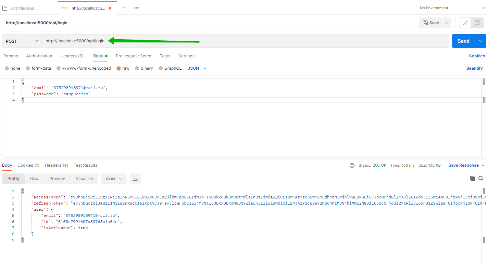

И так пользователь залогинелся.

Пробую написать не правильный пароль.

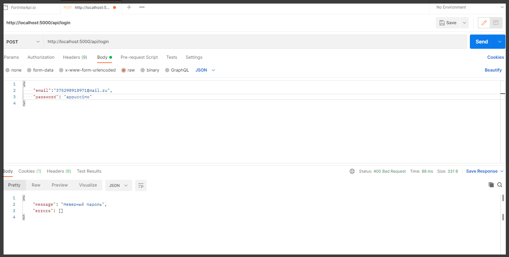

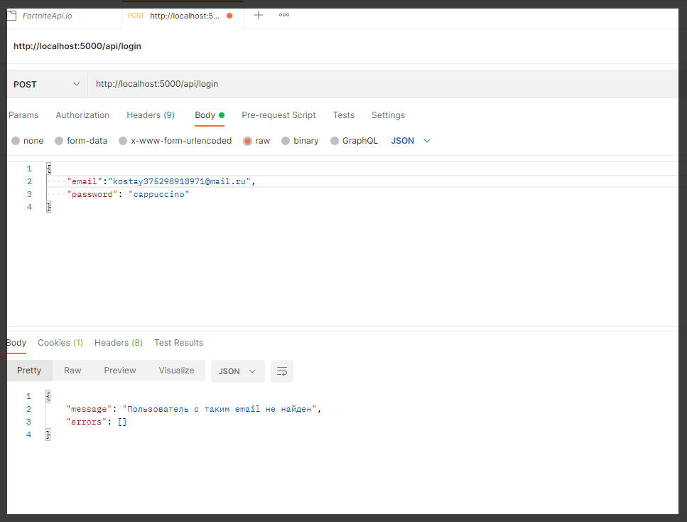

Все необходимые ситуации мы обработали и функция логина у нас готова.
