# Функция для обновления токена refresh

Перехожу в **user-controller.js** к функции **refresh**

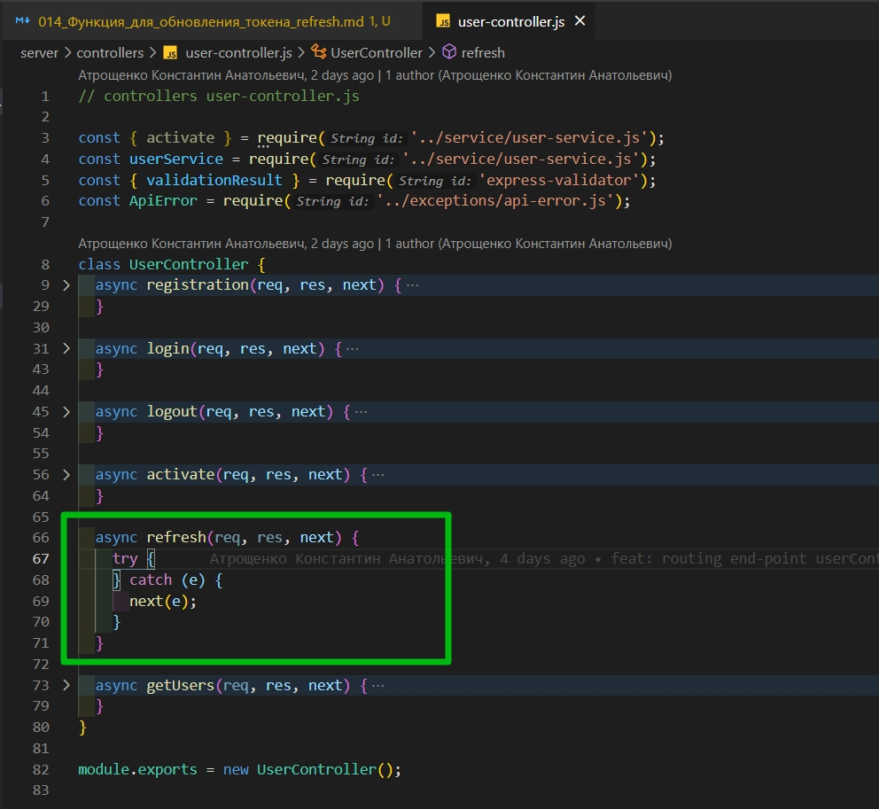

Опять же здесь нам необходимо из **cookies** достать **refreshToken**, а именно **const refreshToken = req.cookies**

```js
// controllers user-controller.js

const { activate } = require('../service/user-service.js');
const userService = require('../service/user-service.js');
const { validationResult } = require('express-validator');
const ApiError = require('../exceptions/api-error.js');

class UserController {
  async registration(req, res, next) {
    try {
      const errors = validationResult(req); // валидация

      if (!errors.isEmpty()) {
        return next(
          ApiError.BadRequest('Ошибка при валидации', errors.array())
        );
      }

      const { email, password } = req.body;
      const userData = await userService.registration(email, password);
      res.cookie('refreshToken', userData.refreshToken, {
        maxAge: 30 * 24 * 60 * 60 * 1000,
        httpOnly: true,
      });
      return res.json(userData);
    } catch (e) {
      next(e);
    }
  }

  async login(req, res, next) {
    try {
      const { email, password } = req.body;
      const userData = await userService.login(email, password);
      res.cookie('refreshToken', userData.refreshToken, {
        maxAge: 30 * 24 * 60 * 60 * 1000,
        httpOnly: true,
      });
      return res.json(userData);
    } catch (e) {
      next(e);
    }
  }

  async logout(req, res, next) {
    try {
      const { refreshToken } = req.cookies;
      const token = userService.logout(refreshToken); // передаю  refreshToken в функцию logout
      res.clearCookie('refreshToken'); // очищаю cookie
      return res.json(token); // обычно возвращают res.status(200)
    } catch (e) {
      next(e);
    }
  }

  async activate(req, res, next) {
    try {
      const activationLink = req.params.link;
      await userService.activate(activationLink); //передаю activationLink в  userService а точнее  user-service.js где отлавливаю в функции activate
      return res.redirect(process.env.CLIENT_URL); // перенаправляю на front-end
    } catch (e) {
      next(e);
    }
  }

  async refresh(req, res, next) {
    try {
      const { refreshToken } = req.cookies; // из запроса вытаскиваю cookies
    } catch (e) {
      next(e);
    }
  }

  async getUsers(req, res, next) {
    try {
      res.json(['123', '456']);
    } catch (e) {
      next(e);
    }
  }
}

module.exports = new UserController();
```

И поскольку мы **token** перезаписывам нам необходимо его опять же сгененрировать, установить в **cookie** и отправить ответ на клиент. Тоже самое что мы делали и при логине.

По этому вот этот блок их функции **login** можно скопировать

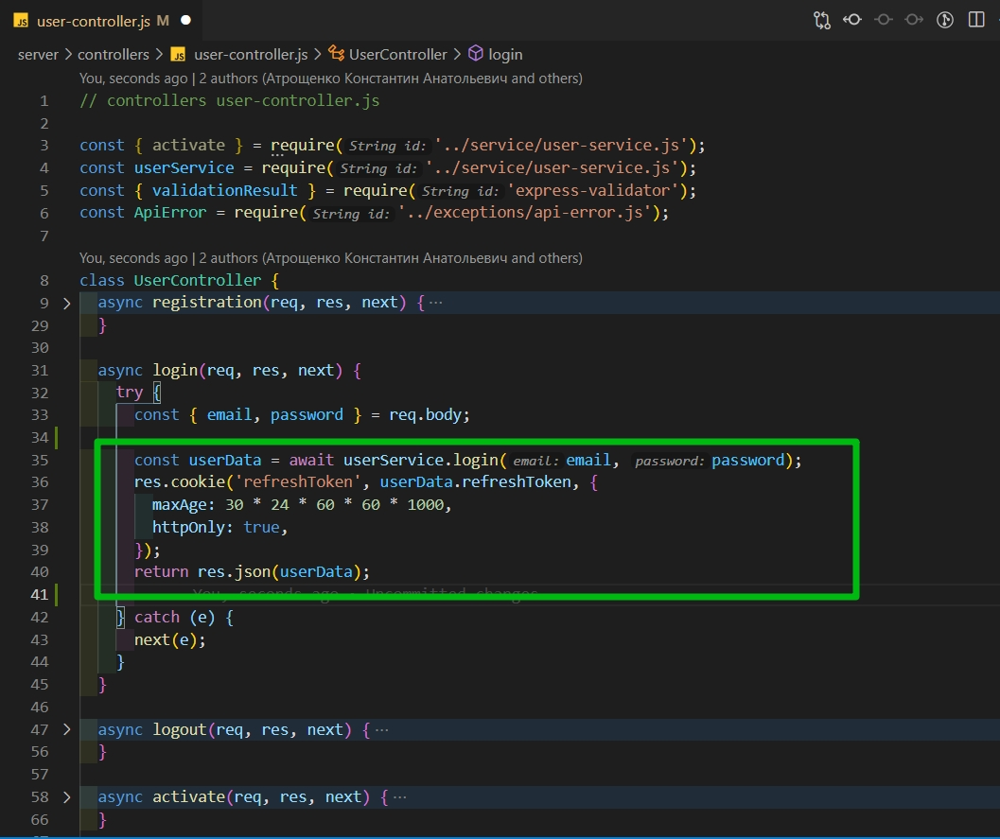

Единственное что у **userService** вызываю не функцию **login** а функцию **refresh** и в нее передаем **refreshToken**

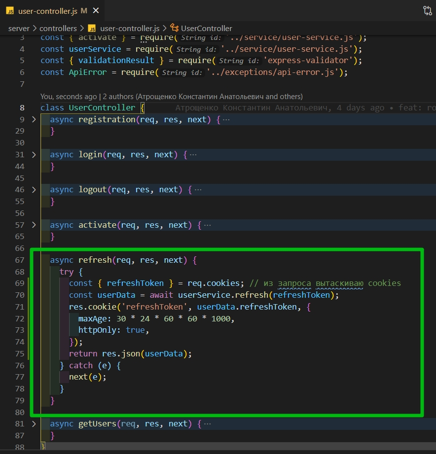

```js
// controllers user-controller.js

const { activate } = require('../service/user-service.js');
const userService = require('../service/user-service.js');
const { validationResult } = require('express-validator');
const ApiError = require('../exceptions/api-error.js');

class UserController {
  async registration(req, res, next) {
    try {
      const errors = validationResult(req); // валидация

      if (!errors.isEmpty()) {
        return next(
          ApiError.BadRequest('Ошибка при валидации', errors.array())
        );
      }

      const { email, password } = req.body;
      const userData = await userService.registration(email, password);
      res.cookie('refreshToken', userData.refreshToken, {
        maxAge: 30 * 24 * 60 * 60 * 1000,
        httpOnly: true,
      });
      return res.json(userData);
    } catch (e) {
      next(e);
    }
  }

  async login(req, res, next) {
    try {
      const { email, password } = req.body;

      const userData = await userService.login(email, password);
      res.cookie('refreshToken', userData.refreshToken, {
        maxAge: 30 * 24 * 60 * 60 * 1000,
        httpOnly: true,
      });
      return res.json(userData);
    } catch (e) {
      next(e);
    }
  }

  async logout(req, res, next) {
    try {
      const { refreshToken } = req.cookies;
      const token = userService.logout(refreshToken); // передаю  refreshToken в функцию logout
      res.clearCookie('refreshToken'); // очищаю cookie
      return res.json(token); // обычно возвращают res.status(200)
    } catch (e) {
      next(e);
    }
  }

  async activate(req, res, next) {
    try {
      const activationLink = req.params.link;
      await userService.activate(activationLink); //передаю activationLink в  userService а точнее  user-service.js где отлавливаю в функции activate
      return res.redirect(process.env.CLIENT_URL); // перенаправляю на front-end
    } catch (e) {
      next(e);
    }
  }

  async refresh(req, res, next) {
    try {
      const { refreshToken } = req.cookies; // из запроса вытаскиваю cookies
      const userData = await userService.refresh(refreshToken);
      res.cookie('refreshToken', userData.refreshToken, {
        maxAge: 30 * 24 * 60 * 60 * 1000,
        httpOnly: true,
      });
      return res.json(userData);
    } catch (e) {
      next(e);
    }
  }

  async getUsers(req, res, next) {
    try {
      res.json(['123', '456']);
    } catch (e) {
      next(e);
    }
  }
}

module.exports = new UserController();
```

Далее перехожу к **user-service.js**. И здесь создаю функцию **refresh**. Она принимает **refreshToken**. И в данной функции сразу же делаю проверку. Если нам пришел какойнибудь **null** или **undefined**, то мы сразуже пробрасываем ошибку. И в ошибке я уже возвращаю **UnauthorizedError**. Поскольку если у пользователя **token** нет, то значит он и не авторизован соответственно.

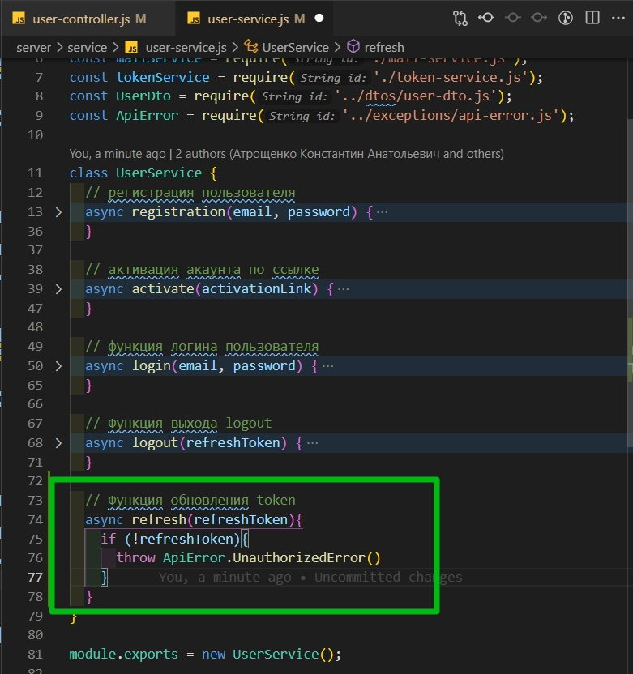

```js
//service user-service.js

const userModel = require('../models/user-model.js');
const bcrypt = require('bcrypt');
const uuid = require('uuid');
const mailService = require('./mail-service.js');
const tokenService = require('./token-service.js');
const UserDto = require('../dtos/user-dto.js');
const ApiError = require('../exceptions/api-error.js');

class UserService {
  // регистрация пользователя
  async registration(email, password) {
    const candidate = await userModel.findOne({ email });
    if (candidate) {
      throw ApiError.BadRequest(`Пользователь с таким ${email} уже существует`);
    } else {
      const hashPassword = await bcrypt.hash(password, 3);
      const activationLink = uuid.v4();
      const user = await userModel.create({
        email,
        password: hashPassword,
        activationLink,
      });
      await mailService.sendActivationMail(
        email,
        `${process.env.API_URL}/api/activate/${activationLink}`
      );

      const userDto = new UserDto(user); // id, email, isActivated
      const tokens = tokenService.generateToken({ ...userDto }); // помещаю accessToken и refreshToken в объект
      await tokenService.saveToken(userDto.id, tokens.refreshToken);

      return { ...tokens, user: userDto };
    }
  }

  // активация акаунта по ссылке
  async activate(activationLink) {
    const user = await userModel.findOne({ activationLink }); // ищем пользователя по ссылке
    if (!user) {
      throw ApiError.BadRequest('Неккоректная ссылка активации ');
    } else {
      user.isActivated = true; // активирую акаунт
      await user.save(); // сохраняю обновленного пользователя
    }
  }

  // функция логина пользователя
  async login(email, password) {
    const user = await userModel.findOne({ email }); // убеждаемся что пользователь зарегистрирован
    if (!user) {
      throw ApiError.BadRequest('Пользователь с таким email не найден');
    } else {
      const isPassEquals = await bcrypt.compare(password, user.password); // c помощью compare сверяю хэшированные пароли
      // Если  в isPassEquals возвращается null выкидываю ошибку
      if (!isPassEquals) {
        throw ApiError.BadRequest('Неверный пароль');
      }
      const userDto = new UserDto(user); // выбрасываю все не нужное
      const tokens = tokenService.generateToken({ ...userDto }); // генирирую новый token
      await tokenService.saveToken(userDto.id, tokens.refreshToken); // сохраняю в БД
      return { ...tokens, user: userDto }; // Возвращаю все tokens и в user кладу нужные поля
    }
  }

  // Функция выхода logout
  async logout(refreshToken) {
    const token = await tokenService.removeToken(refreshToken);
    return token;
  }

  // Функция обновления token
  async refresh(refreshToken) {
    if (!refreshToken) {
      throw ApiError.UnauthorizedError(); // если у пользователя token нет то значит он не авторизован
    }
  }
}

module.exports = new UserService();
```

Следующим этапом нам необходимо этот **token** провалидировать. Перехожу в **token-service.js**. Мне нужно убедится что он не потделан и что срок годности у него не изсяк.

Для этого создадим пару функций которые во-первых будут проверять **access** токен и точно такую же функцию которая будет проверять **refresh** токен.

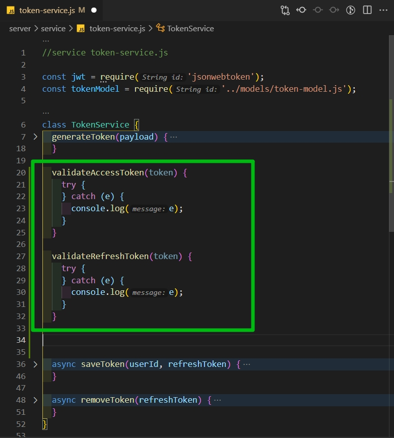

```js
//service token-service.js

const jwt = require('jsonwebtoken');
const tokenModel = require('../models/token-model.js');

class TokenService {
  generateToken(payload) {
    const accessToken = jwt.sign(payload, process.env.JWT_ACCESS_SECRET, {
      expiresIn: '30m',
    });
    const refreshToken = jwt.sign(payload, process.env.JWT_REFRESH_SECRET, {
      expiresIn: '30d',
    });
    return {
      accessToken,
      refreshToken,
    };
  }

  validateAccessToken(token) {
    try {
    } catch (e) {
      console.log(e);
    }
  }

  validateRefreshToken(token) {
    try {
    } catch (e) {
      console.log(e);
    }
  }

  async saveToken(userId, refreshToken) {
    const tokenData = await tokenModel.findOne({ user: userId });
    if (tokenData) {
      tokenData.refreshToken = refreshToken; // если в БД нашел токен, то перезаписываю
      return tokenData.save(); // сохраняю новый токен
    } else {
      // если userId не найден вероятно он логинется первый раз
      const token = await tokenModel.create({ user: userId, refreshToken });
      return token; // возвращаю созданный token
    }
  }

  async removeToken(refreshToken) {
    const tokenData = await tokenModel.deleteOne({ refreshToken });
    return tokenData;
  }
}

module.exports = new TokenService();
```

Обрати внимание на рассположение функций может быть играет роль.

После того как token мы верефицируем, провалидируем нам вернется тот самый **payload** который мы в него вшивали.

Верифицируем мы **token** с помощью функции **verify**. А именно **const userData = jwt.verify()**. Первым параметром передаем сам **token**, а вторым параметром секретный ключ. **process.env.JWT_ACCESS_SECRET**. Секретный ключ мы храним в переменной окружения который называется в случае acess токена **JWT_ACCESS_SECRET**.

Если же при верификации токена произошла какая-то ошибка, то мы попадаем в блок **catch** и просто из этой функции возвращаем **null**. Ошибку ни какую в данном случае на верх мы пробрасывать не будем.

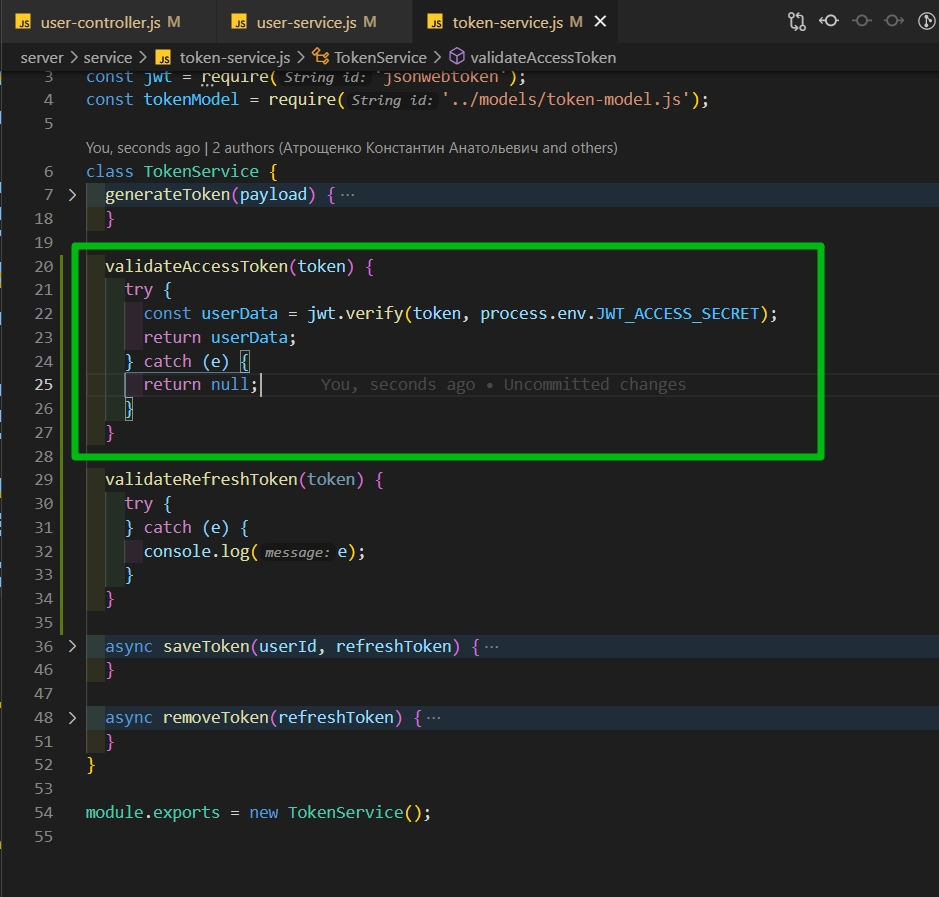

```js
//service token-service.js

const jwt = require('jsonwebtoken');
const tokenModel = require('../models/token-model.js');

class TokenService {
  generateToken(payload) {
    const accessToken = jwt.sign(payload, process.env.JWT_ACCESS_SECRET, {
      expiresIn: '30m',
    });
    const refreshToken = jwt.sign(payload, process.env.JWT_REFRESH_SECRET, {
      expiresIn: '30d',
    });
    return {
      accessToken,
      refreshToken,
    };
  }

  validateAccessToken(token) {
    try {
      const userData = jwt.verify(token, process.env.JWT_ACCESS_SECRET);
      return userData;
    } catch (e) {
      return null;
    }
  }

  validateRefreshToken(token) {
    try {
    } catch (e) {
      console.log(e);
    }
  }

  async saveToken(userId, refreshToken) {
    const tokenData = await tokenModel.findOne({ user: userId });
    if (tokenData) {
      tokenData.refreshToken = refreshToken; // если в БД нашел токен, то перезаписываю
      return tokenData.save(); // сохраняю новый токен
    } else {
      // если userId не найден вероятно он логинется первый раз
      const token = await tokenModel.create({ user: userId, refreshToken });
      return token; // возвращаю созданный token
    }
  }

  async removeToken(refreshToken) {
    const tokenData = await tokenModel.deleteOne({ refreshToken });
    return tokenData;
  }
}

module.exports = new TokenService();
```

Тоже самое делаем и в случае с refreshToken.

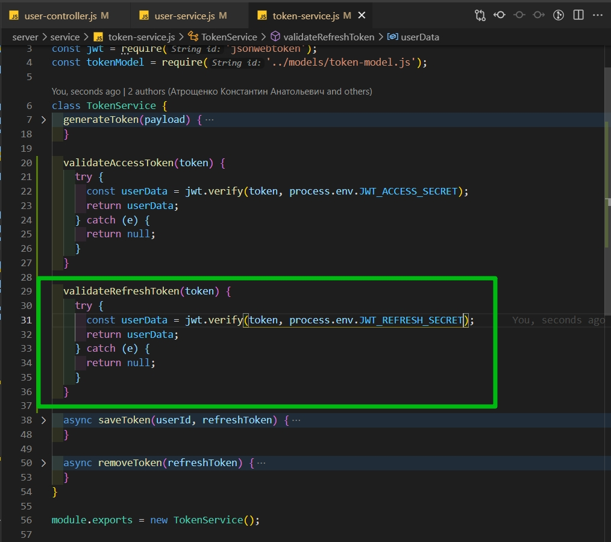

```js
//service token-service.js

const jwt = require('jsonwebtoken');
const tokenModel = require('../models/token-model.js');

class TokenService {
  generateToken(payload) {
    const accessToken = jwt.sign(payload, process.env.JWT_ACCESS_SECRET, {
      expiresIn: '30m',
    });
    const refreshToken = jwt.sign(payload, process.env.JWT_REFRESH_SECRET, {
      expiresIn: '30d',
    });
    return {
      accessToken,
      refreshToken,
    };
  }

  validateAccessToken(token) {
    try {
      const userData = jwt.verify(token, process.env.JWT_ACCESS_SECRET);
      return userData;
    } catch (e) {
      return null;
    }
  }

  validateRefreshToken(token) {
    try {
      const userData = jwt.verify(token, process.env.JWT_REFRESH_SECRET);
      return userData;
    } catch (e) {
      return null;
    }
  }

  async saveToken(userId, refreshToken) {
    const tokenData = await tokenModel.findOne({ user: userId });
    if (tokenData) {
      tokenData.refreshToken = refreshToken; // если в БД нашел токен, то перезаписываю
      return tokenData.save(); // сохраняю новый токен
    } else {
      // если userId не найден вероятно он логинется первый раз
      const token = await tokenModel.create({ user: userId, refreshToken });
      return token; // возвращаю созданный token
    }
  }

  async removeToken(refreshToken) {
    const tokenData = await tokenModel.deleteOne({ refreshToken });
    return tokenData;
  }
}

module.exports = new TokenService();
```

Возвращаюсь обратно в **user-cervice.js** и после проверки **!refreshToken** я пытаюсь провалидировать **token**. **const userData = tokenServise** поскольку это **refresh** токен то вызываю соответствующую функцию **validateRefreshToken** и передаю туда соответственно сам **refreshToken**

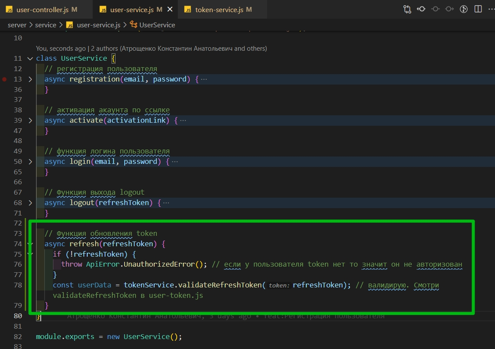

После чего необходимо убедится что этот **token** действительно находится в БД.

Опять же перехожу в **token-service.js** и реализую здесь функцию которая будет этот **token** искать.

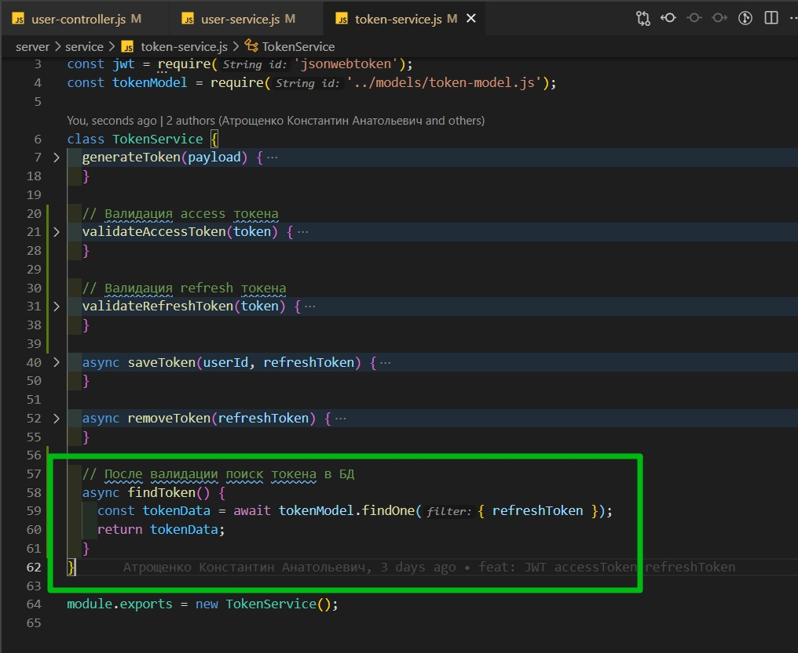

```js
//service token-service.js

const jwt = require('jsonwebtoken');
const tokenModel = require('../models/token-model.js');

class TokenService {
  generateToken(payload) {
    const accessToken = jwt.sign(payload, process.env.JWT_ACCESS_SECRET, {
      expiresIn: '30m',
    });
    const refreshToken = jwt.sign(payload, process.env.JWT_REFRESH_SECRET, {
      expiresIn: '30d',
    });
    return {
      accessToken,
      refreshToken,
    };
  }

  // Валидация access токена
  validateAccessToken(token) {
    try {
      const userData = jwt.verify(token, process.env.JWT_ACCESS_SECRET);
      return userData;
    } catch (e) {
      return null;
    }
  }

  // Валидация refresh токена
  validateRefreshToken(token) {
    try {
      const userData = jwt.verify(token, process.env.JWT_REFRESH_SECRET);
      return userData;
    } catch (e) {
      return null;
    }
  }

  async saveToken(userId, refreshToken) {
    const tokenData = await tokenModel.findOne({ user: userId });
    if (tokenData) {
      tokenData.refreshToken = refreshToken; // если в БД нашел токен, то перезаписываю
      return tokenData.save(); // сохраняю новый токен
    } else {
      // если userId не найден вероятно он логинется первый раз
      const token = await tokenModel.create({ user: userId, refreshToken });
      return token; // возвращаю созданный token
    }
  }

  async removeToken(refreshToken) {
    const tokenData = await tokenModel.deleteOne({ refreshToken });
    return tokenData;
  }

  // После валидации поиск токена в БД
  async findToken() {
    const tokenData = await tokenModel.findOne({ refreshToken });
    return tokenData;
  }
}

module.exports = new TokenService();
```

Возвращаюсь обратно в **user-cervice.js** и воспользуемся этой функцией. co**nst tokenFromDb = await tokenService.findToken(refreshToken)**

И обрати внимание на код выше. В функцию findToken забыл передать refreshToken. Даннуб ошибку заметил только на клиенте. Совет читай логи NodeJS

```js
//service token-service.js

const jwt = require('jsonwebtoken');
const tokenModel = require('../models/token-model.js');

class TokenService {
  generateToken(payload) {
    const accessToken = jwt.sign(payload, process.env.JWT_ACCESS_SECRET, {
      expiresIn: '30m',
    });
    const refreshToken = jwt.sign(payload, process.env.JWT_REFRESH_SECRET, {
      expiresIn: '30d',
    });
    return {
      accessToken,
      refreshToken,
    };
  }

  // Валидация access токена
  validateAccessToken(token) {
    try {
      const userData = jwt.verify(token, process.env.JWT_ACCESS_SECRET);
      return userData;
    } catch (e) {
      return null;
    }
  }

  // Валидация refresh токена
  validateRefreshToken(token) {
    try {
      const userData = jwt.verify(token, process.env.JWT_REFRESH_SECRET);
      return userData;
    } catch (e) {
      return null;
    }
  }

  async saveToken(userId, refreshToken) {
    const tokenData = await tokenModel.findOne({ user: userId });
    if (tokenData) {
      tokenData.refreshToken = refreshToken; // если в БД нашел токен, то перезаписываю
      return tokenData.save(); // сохраняю новый токен
    } else {
      // если userId не найден вероятно он логинется первый раз
      const token = await tokenModel.create({ user: userId, refreshToken });
      return token; // возвращаю созданный token
    }
  }

  async removeToken(refreshToken) {
    const tokenData = await tokenModel.deleteOne({ refreshToken });
    return tokenData;
  }

  // После валидации поиск токена в БД
  async findToken(refreshToken) {
    const tokenData = await tokenModel.findOne({ refreshToken });
    return tokenData;
  }
}

module.exports = new TokenService();
```

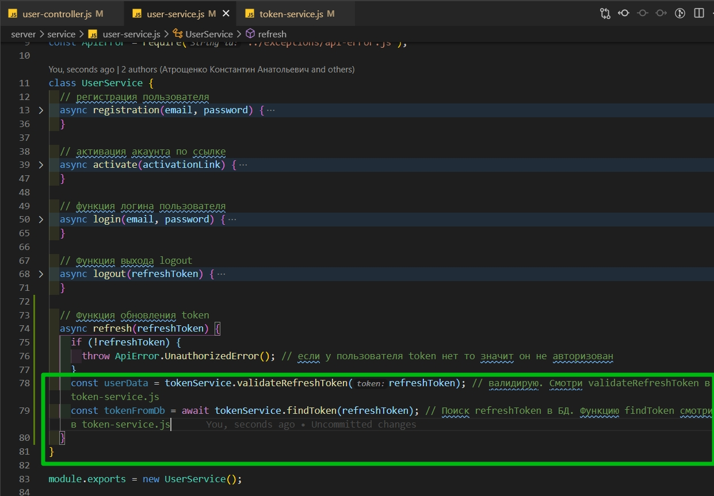

```js
//service user-service.js

const userModel = require('../models/user-model.js');
const bcrypt = require('bcrypt');
const uuid = require('uuid');
const mailService = require('./mail-service.js');
const tokenService = require('./token-service.js');
const UserDto = require('../dtos/user-dto.js');
const ApiError = require('../exceptions/api-error.js');

class UserService {
  // регистрация пользователя
  async registration(email, password) {
    const candidate = await userModel.findOne({ email });
    if (candidate) {
      throw ApiError.BadRequest(`Пользователь с таким ${email} уже существует`);
    } else {
      const hashPassword = await bcrypt.hash(password, 3);
      const activationLink = uuid.v4();
      const user = await userModel.create({
        email,
        password: hashPassword,
        activationLink,
      });
      await mailService.sendActivationMail(
        email,
        `${process.env.API_URL}/api/activate/${activationLink}`
      );

      const userDto = new UserDto(user); // id, email, isActivated
      const tokens = tokenService.generateToken({ ...userDto }); // помещаю accessToken и refreshToken в объект
      await tokenService.saveToken(userDto.id, tokens.refreshToken);

      return { ...tokens, user: userDto };
    }
  }

  // активация акаунта по ссылке
  async activate(activationLink) {
    const user = await userModel.findOne({ activationLink }); // ищем пользователя по ссылке
    if (!user) {
      throw ApiError.BadRequest('Неккоректная ссылка активации ');
    } else {
      user.isActivated = true; // активирую акаунт
      await user.save(); // сохраняю обновленного пользователя
    }
  }

  // функция логина пользователя
  async login(email, password) {
    const user = await userModel.findOne({ email }); // убеждаемся что пользователь зарегистрирован
    if (!user) {
      throw ApiError.BadRequest('Пользователь с таким email не найден');
    } else {
      const isPassEquals = await bcrypt.compare(password, user.password); // c помощью compare сверяю хэшированные пароли
      // Если  в isPassEquals возвращается null выкидываю ошибку
      if (!isPassEquals) {
        throw ApiError.BadRequest('Неверный пароль');
      }
      const userDto = new UserDto(user); // выбрасываю все не нужное
      const tokens = tokenService.generateToken({ ...userDto }); // генирирую новый token
      await tokenService.saveToken(userDto.id, tokens.refreshToken); // сохраняю в БД
      return { ...tokens, user: userDto }; // Возвращаю все tokens и в user кладу нужные поля
    }
  }

  // Функция выхода logout
  async logout(refreshToken) {
    const token = await tokenService.removeToken(refreshToken);
    return token;
  }

  // Функция обновления token
  async refresh(refreshToken) {
    if (!refreshToken) {
      throw ApiError.UnauthorizedError(); // если у пользователя token нет то значит он не авторизован
    }
    const userData = tokenService.validateRefreshToken(refreshToken); // валидирую. Смотри validateRefreshToken в token-service.js
    const tokenFromDb = await tokenService.findToken(refreshToken); // Поиск refreshToken в БД. Функцию findToken смотри в token-service.js
  }
}

module.exports = new UserService();
```

Теперь делаем проверку и убеждаемся что и валидация **!userData** и поиск в БД **!tokenFromDb** у нас прошли успешно. Если не прошла валидация и если мы не нашли токен в БД, если в этих переменных находится **null**, то тогда очевидно что пользватель не авторизован и мы должны пробросить ощибку **UnauthorizedError**.

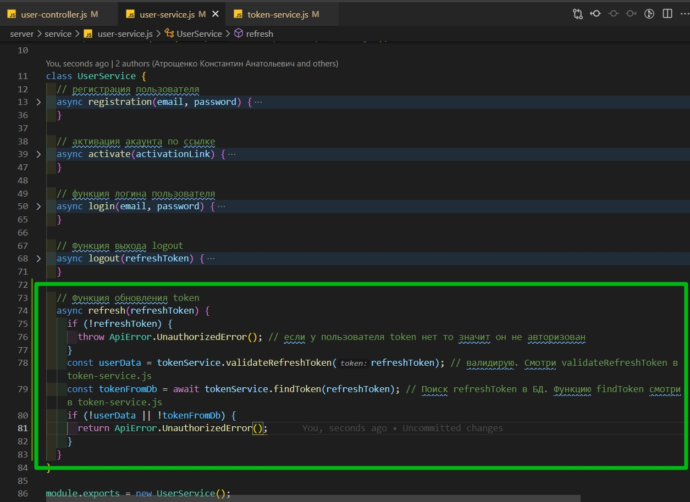

```js
//service user-service.js

const userModel = require('../models/user-model.js');
const bcrypt = require('bcrypt');
const uuid = require('uuid');
const mailService = require('./mail-service.js');
const tokenService = require('./token-service.js');
const UserDto = require('../dtos/user-dto.js');
const ApiError = require('../exceptions/api-error.js');

class UserService {
  // регистрация пользователя
  async registration(email, password) {
    const candidate = await userModel.findOne({ email });
    if (candidate) {
      throw ApiError.BadRequest(`Пользователь с таким ${email} уже существует`);
    } else {
      const hashPassword = await bcrypt.hash(password, 3);
      const activationLink = uuid.v4();
      const user = await userModel.create({
        email,
        password: hashPassword,
        activationLink,
      });
      await mailService.sendActivationMail(
        email,
        `${process.env.API_URL}/api/activate/${activationLink}`
      );

      const userDto = new UserDto(user); // id, email, isActivated
      const tokens = tokenService.generateToken({ ...userDto }); // помещаю accessToken и refreshToken в объект
      await tokenService.saveToken(userDto.id, tokens.refreshToken);

      return { ...tokens, user: userDto };
    }
  }

  // активация акаунта по ссылке
  async activate(activationLink) {
    const user = await userModel.findOne({ activationLink }); // ищем пользователя по ссылке
    if (!user) {
      throw ApiError.BadRequest('Неккоректная ссылка активации ');
    } else {
      user.isActivated = true; // активирую акаунт
      await user.save(); // сохраняю обновленного пользователя
    }
  }

  // функция логина пользователя
  async login(email, password) {
    const user = await userModel.findOne({ email }); // убеждаемся что пользователь зарегистрирован
    if (!user) {
      throw ApiError.BadRequest('Пользователь с таким email не найден');
    } else {
      const isPassEquals = await bcrypt.compare(password, user.password); // c помощью compare сверяю хэшированные пароли
      // Если  в isPassEquals возвращается null выкидываю ошибку
      if (!isPassEquals) {
        throw ApiError.BadRequest('Неверный пароль');
      }
      const userDto = new UserDto(user); // выбрасываю все не нужное
      const tokens = tokenService.generateToken({ ...userDto }); // генирирую новый token
      await tokenService.saveToken(userDto.id, tokens.refreshToken); // сохраняю в БД
      return { ...tokens, user: userDto }; // Возвращаю все tokens и в user кладу нужные поля
    }
  }

  // Функция выхода logout
  async logout(refreshToken) {
    const token = await tokenService.removeToken(refreshToken);
    return token;
  }

  // Функция обновления token
  async refresh(refreshToken) {
    if (!refreshToken) {
      throw ApiError.UnauthorizedError(); // если у пользователя token нет то значит он не авторизован
    }
    const userData = tokenService.validateRefreshToken(refreshToken); // валидирую. Смотри validateRefreshToken в token-service.js
    const tokenFromDb = await tokenService.findToken(refreshToken); // Поиск refreshToken в БД. Функцию findToken смотри в token-service.js
    if (!userData || !tokenFromDb) {
      return ApiError.UnauthorizedError();
    }
  }
}

module.exports = new UserService();
```

Если это условие не выполнилось, то мы точно так же как при логине генерируем новую пару токенов. **refreshToken** сохраняю в БД и возвращаем ответ.

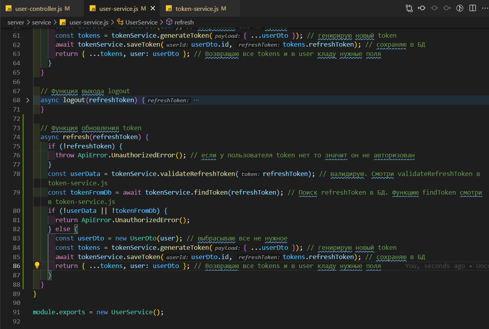

Удинственное по хорошему здесь еще вытаскиваем пользователя из БД, потому что за 60 дней какая-то информация о нем могла поменяться и нам в токен необходимо засунуть свежую информцию. **const user = await UserModal.findById()**. Мы знаем **id** пользователя после того как верифицировали токен. По этому с помощью функции **findById** по **userData.id** мы как раз пользователя находим.

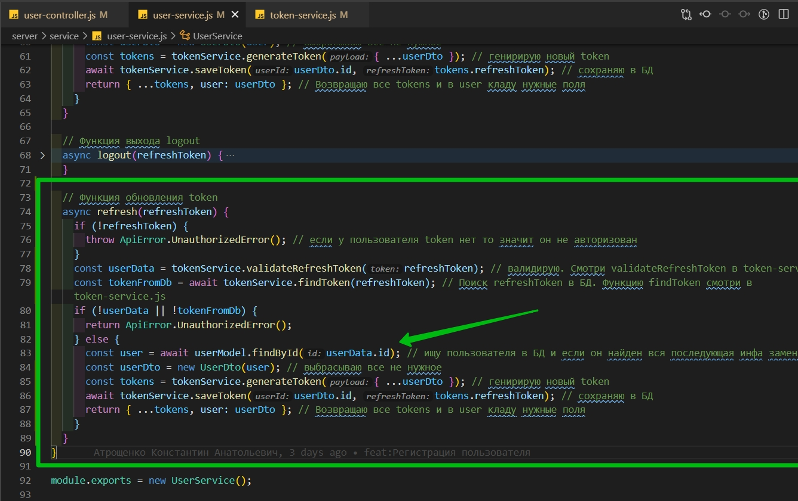

```js
//service user-service.js

const userModel = require('../models/user-model.js');
const bcrypt = require('bcrypt');
const uuid = require('uuid');
const mailService = require('./mail-service.js');
const tokenService = require('./token-service.js');
const UserDto = require('../dtos/user-dto.js');
const ApiError = require('../exceptions/api-error.js');

class UserService {
  // регистрация пользователя
  async registration(email, password) {
    const candidate = await userModel.findOne({ email });
    if (candidate) {
      throw ApiError.BadRequest(`Пользователь с таким ${email} уже существует`);
    } else {
      const hashPassword = await bcrypt.hash(password, 3);
      const activationLink = uuid.v4();
      const user = await userModel.create({
        email,
        password: hashPassword,
        activationLink,
      });
      await mailService.sendActivationMail(
        email,
        `${process.env.API_URL}/api/activate/${activationLink}`
      );

      const userDto = new UserDto(user); // id, email, isActivated
      const tokens = tokenService.generateToken({ ...userDto }); // помещаю accessToken и refreshToken в объект
      await tokenService.saveToken(userDto.id, tokens.refreshToken);

      return { ...tokens, user: userDto };
    }
  }

  // активация акаунта по ссылке
  async activate(activationLink) {
    const user = await userModel.findOne({ activationLink }); // ищем пользователя по ссылке
    if (!user) {
      throw ApiError.BadRequest('Неккоректная ссылка активации ');
    } else {
      user.isActivated = true; // активирую акаунт
      await user.save(); // сохраняю обновленного пользователя
    }
  }

  // функция логина пользователя
  async login(email, password) {
    const user = await userModel.findOne({ email }); // убеждаемся что пользователь зарегистрирован
    if (!user) {
      throw ApiError.BadRequest('Пользователь с таким email не найден');
    } else {
      const isPassEquals = await bcrypt.compare(password, user.password); // c помощью compare сверяю хэшированные пароли
      // Если  в isPassEquals возвращается null выкидываю ошибку
      if (!isPassEquals) {
        throw ApiError.BadRequest('Неверный пароль');
      }
      const userDto = new UserDto(user); // выбрасываю все не нужное
      const tokens = tokenService.generateToken({ ...userDto }); // генирирую новый token
      await tokenService.saveToken(userDto.id, tokens.refreshToken); // сохраняю в БД
      return { ...tokens, user: userDto }; // Возвращаю все tokens и в user кладу нужные поля
    }
  }

  // Функция выхода logout
  async logout(refreshToken) {
    const token = await tokenService.removeToken(refreshToken);
    return token;
  }

  // Функция обновления token
  async refresh(refreshToken) {
    if (!refreshToken) {
      throw ApiError.UnauthorizedError(); // если у пользователя token нет то значит он не авторизован
    }
    const userData = tokenService.validateRefreshToken(refreshToken); // валидирую. Смотри validateRefreshToken в token-service.js
    const tokenFromDb = await tokenService.findToken(refreshToken); // Поиск refreshToken в БД. Функцию findToken смотри в token-service.js
    if (!userData || !tokenFromDb) {
      return ApiError.UnauthorizedError();
    } else {
      const user = await userModel.findById(userData.id); // ищу пользователя в БД и если он найден вся последующая инфа заменится.
      const userDto = new UserDto(user); // выбрасываю все не нужное
      const tokens = tokenService.generateToken({ ...userDto }); // генирирую новый token
      await tokenService.saveToken(userDto.id, tokens.refreshToken); // сохраняю в БД
      return { ...tokens, user: userDto }; // Возвращаю все tokens и в user кладу нужные поля
    }
  }
}

module.exports = new UserService();
```
