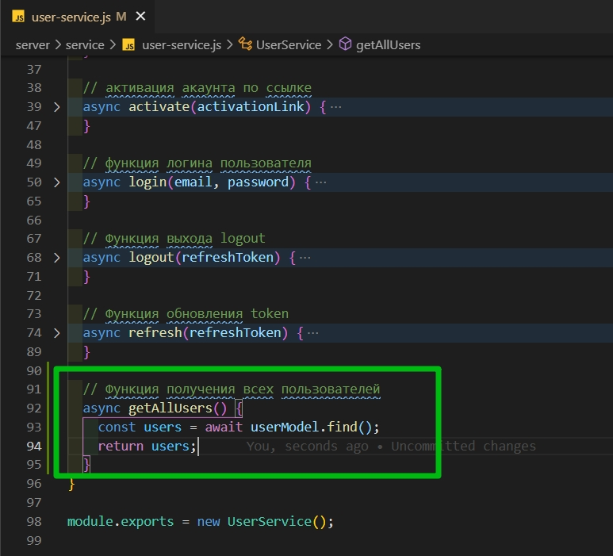
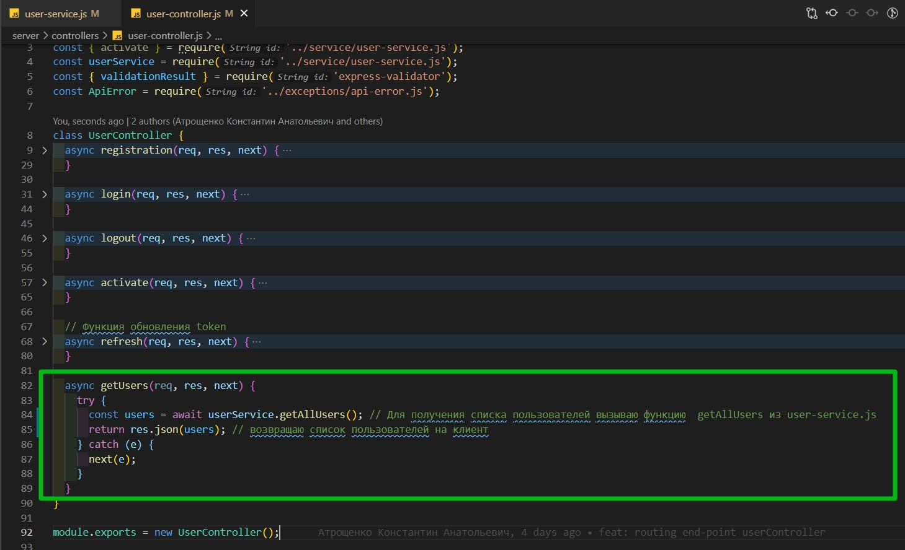
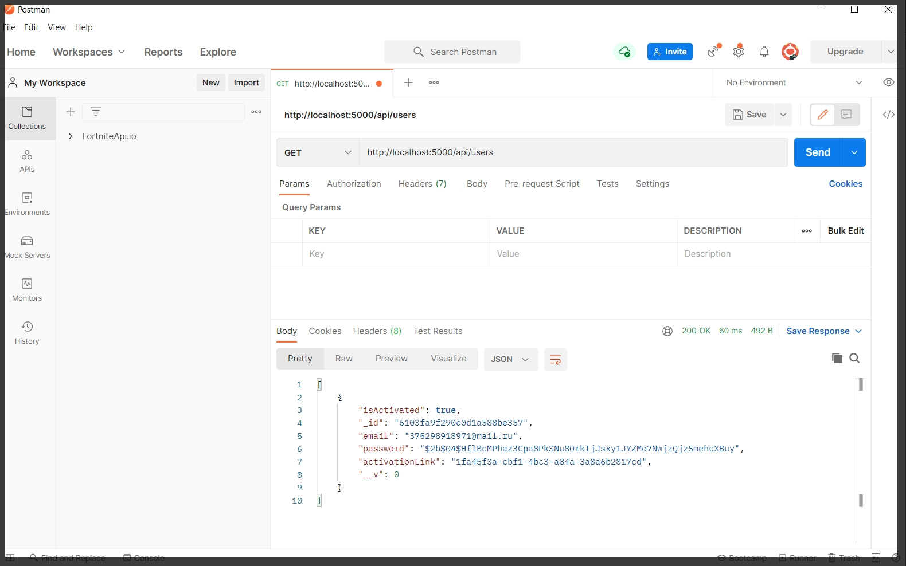

# 015*Функция*для*получения*ользователей

Перехожу в **user-service.js** и реализую асинхронную функцию **getAllUser**. Здесь мы просто обращаеся к модели и вызываем функцию **find**. Она без параметров вернет абсолютно все записи из БД. **const users = await UserModel.find()**



```js
//service user-service.js

const userModel = require('../models/user-model.js');
const bcrypt = require('bcrypt');
const uuid = require('uuid');
const mailService = require('./mail-service.js');
const tokenService = require('./token-service.js');
const UserDto = require('../dtos/user-dto.js');
const ApiError = require('../exceptions/api-error.js');

class UserService {
  // регистрация пользователя
  async registration(email, password) {
    const candidate = await userModel.findOne({ email });
    if (candidate) {
      throw ApiError.BadRequest(`Пользователь с таким ${email} уже существует`);
    } else {
      const hashPassword = await bcrypt.hash(password, 3);
      const activationLink = uuid.v4();
      const user = await userModel.create({
        email,
        password: hashPassword,
        activationLink,
      });
      await mailService.sendActivationMail(
        email,
        `${process.env.API_URL}/api/activate/${activationLink}`
      );

      const userDto = new UserDto(user); // id, email, isActivated
      const tokens = tokenService.generateToken({ ...userDto }); // помещаю accessToken и refreshToken в объект
      await tokenService.saveToken(userDto.id, tokens.refreshToken);

      return { ...tokens, user: userDto };
    }
  }

  // активация акаунта по ссылке
  async activate(activationLink) {
    const user = await userModel.findOne({ activationLink }); // ищем пользователя по ссылке
    if (!user) {
      throw ApiError.BadRequest('Неккоректная ссылка активации ');
    } else {
      user.isActivated = true; // активирую акаунт
      await user.save(); // сохраняю обновленного пользователя
    }
  }

  // функция логина пользователя
  async login(email, password) {
    const user = await userModel.findOne({ email }); // убеждаемся что пользователь зарегистрирован
    if (!user) {
      throw ApiError.BadRequest('Пользователь с таким email не найден');
    } else {
      const isPassEquals = await bcrypt.compare(password, user.password); // c помощью compare сверяю хэшированные пароли
      // Если  в isPassEquals возвращается null выкидываю ошибку
      if (!isPassEquals) {
        throw ApiError.BadRequest('Неверный пароль');
      }
      const userDto = new UserDto(user); // выбрасываю все не нужное
      const tokens = tokenService.generateToken({ ...userDto }); // генирирую новый token
      await tokenService.saveToken(userDto.id, tokens.refreshToken); // сохраняю в БД
      return { ...tokens, user: userDto }; // Возвращаю все tokens и в user кладу нужные поля
    }
  }

  // Функция выхода logout
  async logout(refreshToken) {
    const token = await tokenService.removeToken(refreshToken);
    return token;
  }

  // Функция обновления token
  async refresh(refreshToken) {
    if (!refreshToken) {
      throw ApiError.UnauthorizedError(); // если у пользователя token нет то значит он не авторизован
    }
    const userData = tokenService.validateRefreshToken(refreshToken); // валидирую. Смотри validateRefreshToken в token-service.js
    const tokenFromDb = await tokenService.findToken(refreshToken); // Поиск refreshToken в БД. Функцию findToken смотри в token-service.js
    if (!userData || !tokenFromDb) {
      return ApiError.UnauthorizedError();
    } else {
      const user = await userModel.findById(userData.id); // ищу пользователя в БД и если он найден вся последующая инфа заменится.
      const userDto = new UserDto(user); // выбрасываю все не нужное
      const tokens = tokenService.generateToken({ ...userDto }); // генирирую новый token
      await tokenService.saveToken(userDto.id, tokens.refreshToken); // сохраняю в БД
      return { ...tokens, user: userDto }; // Возвращаю все tokens и в user кладу нужные поля
    }
  }

  // Функция получения всех пользователей
  async getAllUsers() {
    const users = await userModel.find();
    return users;
  }
}

module.exports = new UserService();
```

В **user-controller.js** в функции getUsers мы сразу возвращаем ответ на клиент. **return** res где в поле **json** помещаем список пользователей, а этот список мы получим вызывав соответствующую функцию в сервисе.



```js
// controllers user-controller.js

const { activate } = require('../service/user-service.js');
const userService = require('../service/user-service.js');
const { validationResult } = require('express-validator');
const ApiError = require('../exceptions/api-error.js');

class UserController {
  async registration(req, res, next) {
    try {
      const errors = validationResult(req); // валидация

      if (!errors.isEmpty()) {
        return next(
          ApiError.BadRequest('Ошибка при валидации', errors.array())
        );
      }

      const { email, password } = req.body;
      const userData = await userService.registration(email, password);
      res.cookie('refreshToken', userData.refreshToken, {
        maxAge: 30 * 24 * 60 * 60 * 1000,
        httpOnly: true,
      });
      return res.json(userData);
    } catch (e) {
      next(e);
    }
  }

  async login(req, res, next) {
    try {
      const { email, password } = req.body;

      const userData = await userService.login(email, password);
      res.cookie('refreshToken', userData.refreshToken, {
        maxAge: 30 * 24 * 60 * 60 * 1000,
        httpOnly: true,
      });
      return res.json(userData);
    } catch (e) {
      next(e);
    }
  }

  async logout(req, res, next) {
    try {
      const { refreshToken } = req.cookies;
      const token = userService.logout(refreshToken); // передаю  refreshToken в функцию logout
      res.clearCookie('refreshToken'); // очищаю cookie
      return res.json(token); // обычно возвращают res.status(200)
    } catch (e) {
      next(e);
    }
  }

  async activate(req, res, next) {
    try {
      const activationLink = req.params.link;
      await userService.activate(activationLink); //передаю activationLink в  userService а точнее  user-service.js где отлавливаю в функции activate
      return res.redirect(process.env.CLIENT_URL); // перенаправляю на front-end
    } catch (e) {
      next(e);
    }
  }

  // Функция обновления token
  async refresh(req, res, next) {
    try {
      const { refreshToken } = req.cookies; // из запроса вытаскиваю cookies
      const userData = await userService.refresh(refreshToken);
      res.cookie('refreshToken', userData.refreshToken, {
        maxAge: 30 * 24 * 60 * 60 * 1000,
        httpOnly: true,
      });
      return res.json(userData);
    } catch (e) {
      next(e);
    }
  }

  async getUsers(req, res, next) {
    try {
      const users = await userService.getAllUsers(); // Для получения списка пользователей вызываю функцию  getAllUsers из user-service.js
      return res.json(users); // возвращаю список пользователей на клиент
    } catch (e) {
      next(e);
    }
  }
}

module.exports = new UserController();
```

Теперь открою **postman** и попробую получить этих пользователей.



На данный момент эта функция доступна каждому вообще не важно зарегистрирован ты или нет.

И давайте сделаем так что бы этот **end-point** могли дергать только зарегистрированные пользователи.
