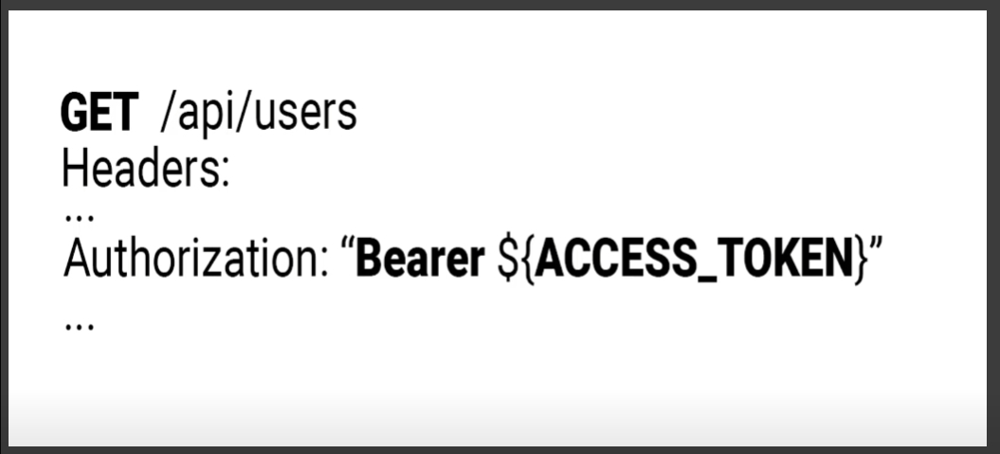
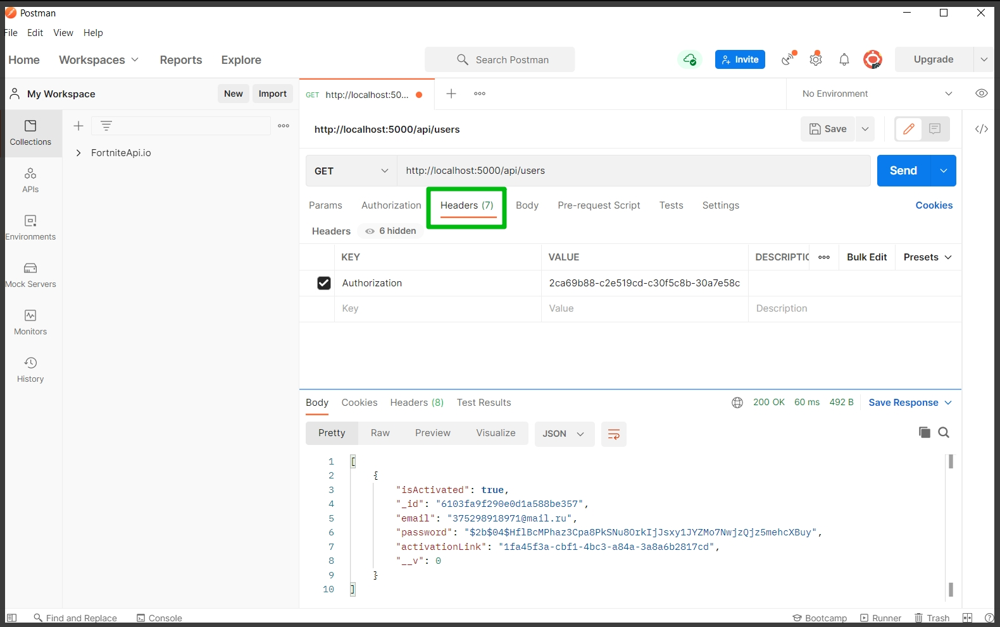
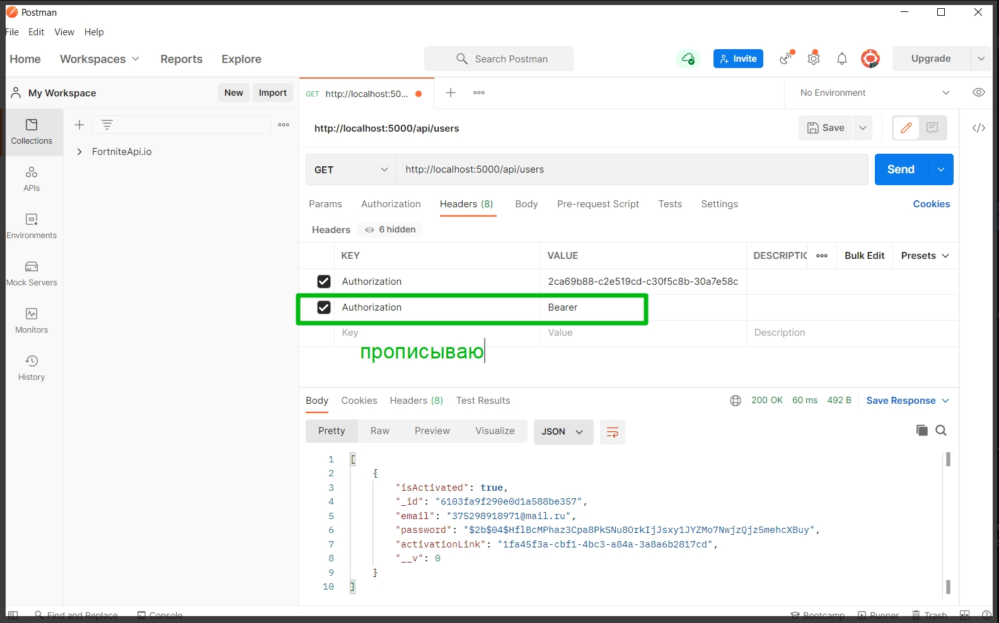
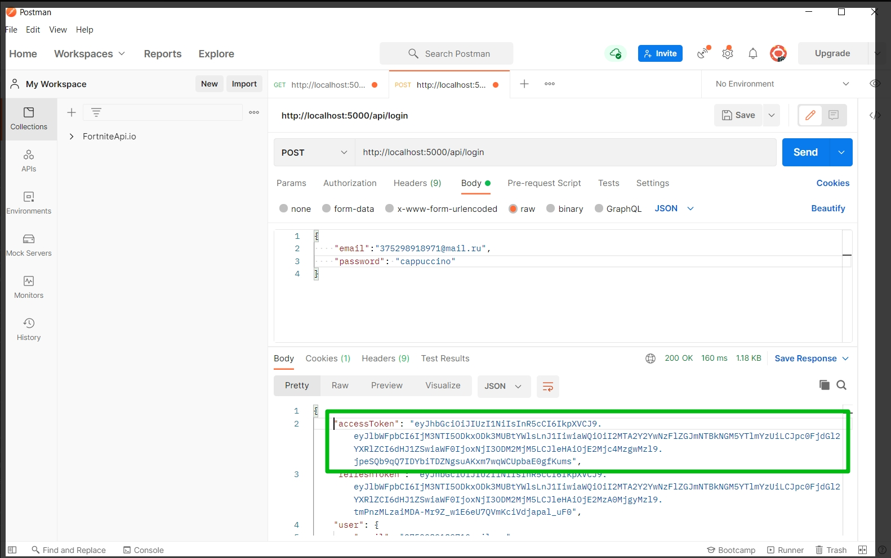
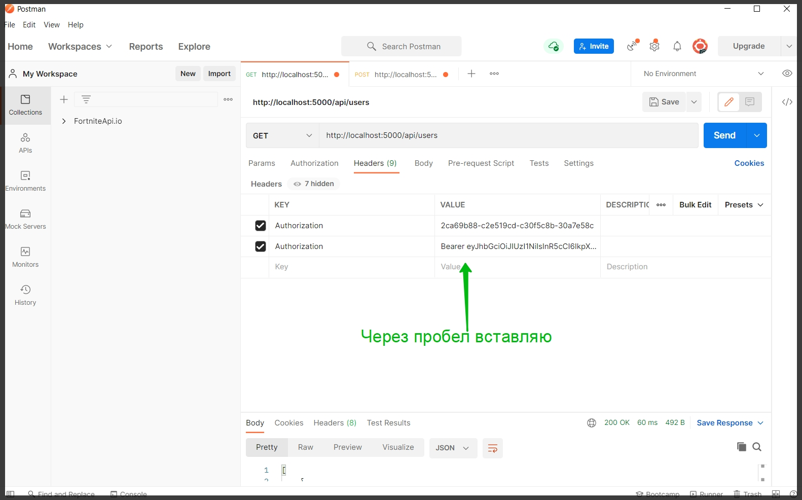
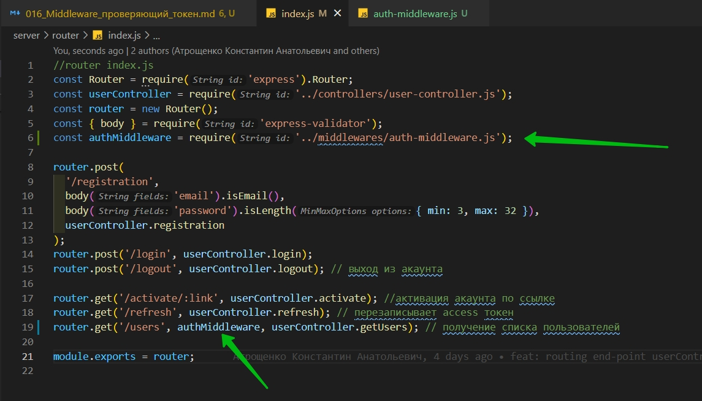
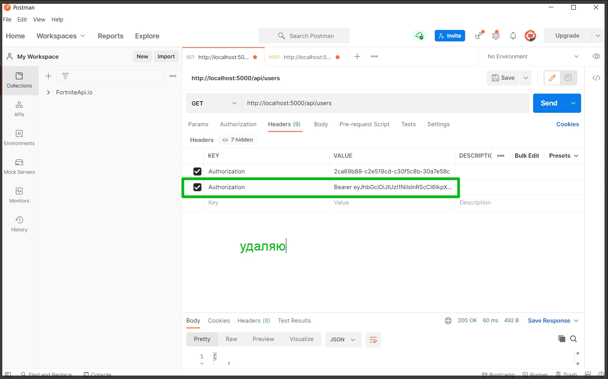
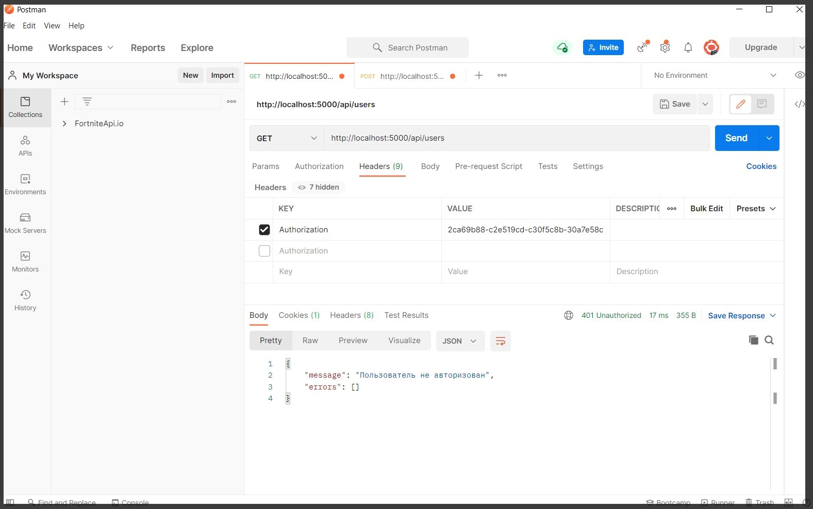
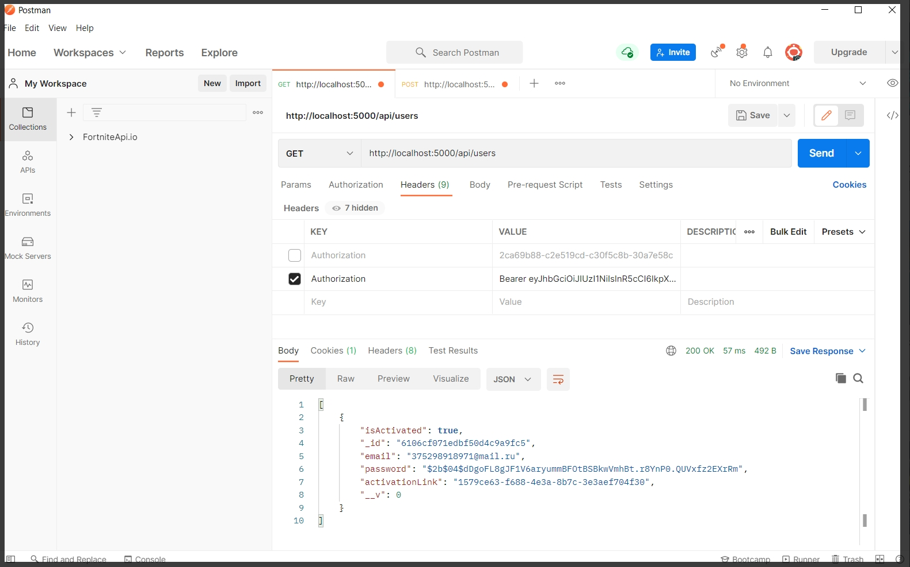
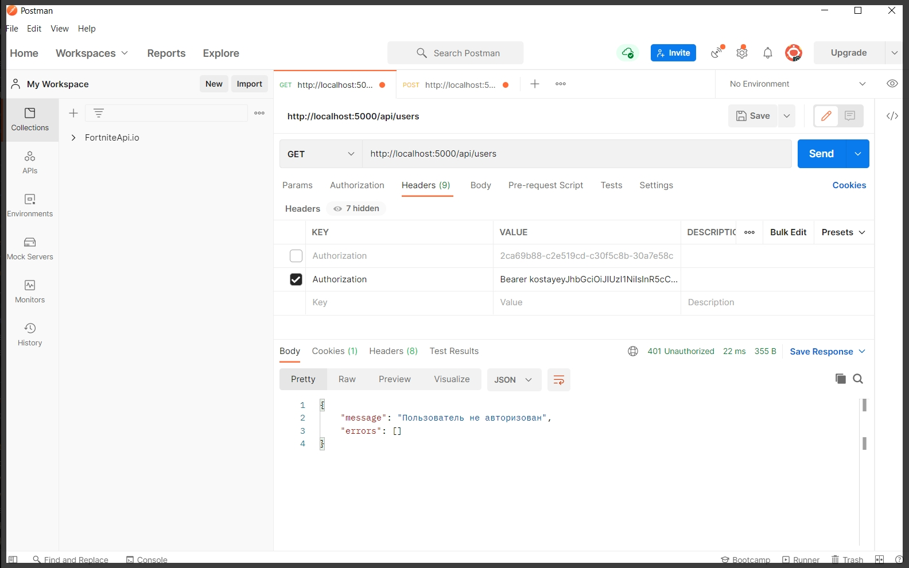

# Middleware проверяющий токен

В middlewares создаю auth-middleware.js

```js
// middlewares auth-middleware.js
module.exports = function (req, res, next) {
  try {
  } catch (e) {}
};
```

Функция next вызывает следующий в цепочке middleware и ее вызывать обязательно.

Нам здесь так же понадобится класс ApiError по этому я его импортирую его. И если мы попали в блок catch, то тогла прокидываю функцию next и в ней ApiError.UnauthorizedError() значит пользователь не авторизован.

```js
// middlewares auth-middleware.js
const ApiError = require('../exceptions/api-error.js');

module.exports = function (req, res, next) {
  try {
  } catch (e) {
    return next(ApiError.UnauthorizedError());
  }
};
```

И так для лучшего понимания.

Мы отправляем запрос на получение пользователей GET/api/users и знаем что этот запрос доступен только авторизованным пользователям. Поэтому нам надо как-то к запросу прицепить token.


Делается это с помощью Headers заголовков http запроса. И обычно токен указывают в заголовке Authorization



Сначало указывается тип токена. Обычно это Bearer и затем сам токен доступа т.е. наш access токен.

И вот сейчас внутри этого middleware у нас задача этот token вытащить из заголовка.

Создаю const authorizationHeader. Обращаюсь к req полю headers и указываю authorization

```js
// middlewares auth-middleware.js
const ApiError = require('../exceptions/api-error.js');

module.exports = function (req, res, next) {
  try {
    const authorizationHeader = req.headers.authorization;
  } catch (e) {
    return next(ApiError.UnauthorizedError());
  }
};
```

Давайте рассмотрим на примере postman как этот header указать.

У нас есть вкладка Headers.





Далее либо из коллекции MongoDB или из запроса login в частности он делает. Копирую accessToken. Идиот так как из коллекции MongoDB не смогу взять так как в БД храниться только refreshToken. Беру из postman.





Теперь если я сделаю запрос, то внутри middleware мы этот токен сможем прочитать.

И теперь в middleware делаю проверку и указываю что если !authorizationHeader не указан, то опятьже пробрасываем return next(ApiError.UnauthorizedError());

```js
// middlewares auth-middleware.js
const ApiError = require('../exceptions/api-error.js');

module.exports = function (req, res, next) {
  try {
    const authorizationHeader = req.headers.authorization;
    if (!authorizationHeader) {
      return next(ApiError.UnauthorizedError());
    }
  } catch (e) {
    return next(ApiError.UnauthorizedError());
  }
};
```

Если же это условие не отработало, то мы двигаемся дальше.

Сейчас header у нас состоит непосредственно из двух слов это Bearer и непосредственно сам токен.

создаю const accessToken = authorizationHeader вызываю функцию split(' ') мы эту строку разбиваем на два слова с помощью пробела указанного в функции split. Bearer будет первым элементом массива а сам токен будет вторым элементом массива. По этому по первому индексу мы этот токен достаем.

```js
// middlewares auth-middleware.js
const ApiError = require('../exceptions/api-error.js');

module.exports = function (req, res, next) {
  try {
    const authorizationHeader = req.headers.authorization;
    if (!authorizationHeader) {
      return next(ApiError.UnauthorizedError());
    } else {
      const accessToken = authorizationHeader.split(' ')[1]; // разбиваю строку на два элемента массива и 1-м индексом достаю token
    }
  } catch (e) {
    return next(ApiError.UnauthorizedError());
  }
};
```

Опять же можем сделать проверку. Если этого !accessToken нет то пробрасываем ошибку.

```js
// middlewares auth-middleware.js
const ApiError = require('../exceptions/api-error.js');

module.exports = function (req, res, next) {
  try {
    const authorizationHeader = req.headers.authorization;
    if (!authorizationHeader) {
      return next(ApiError.UnauthorizedError());
    } else {
      const accessToken = authorizationHeader.split(' ')[1]; // разбиваю строку на два элемента массива и 1-м индексом достаю token
      if (!accessToken) {
        return next(ApiError.UnauthorizedError());
      }
    }
  } catch (e) {
    return next(ApiError.UnauthorizedError());
  }
};
```

Если и этот блок не отработал, то у нас есть токен и нам необходимо этот токен провалидировать. Импортирую tokenService из которого достану неообходимую мне функцию.

```js
// middlewares auth-middleware.js
const ApiError = require('../exceptions/api-error.js');
const tokenService = require('../service/token-service.js');

module.exports = function (req, res, next) {
  try {
    const authorizationHeader = req.headers.authorization;
    if (!authorizationHeader) {
      return next(ApiError.UnauthorizedError());
    } else {
      const accessToken = authorizationHeader.split(' ')[1]; // разбиваю строку на два элемента массива и 1-м индексом достаю token
      if (!accessToken) {
        return next(ApiError.UnauthorizedError());
      }
      const userData = tokenService.validateAccessToken(accessToken); // валидирую accessToken
    }
  } catch (e) {
    return next(ApiError.UnauthorizedError());
  }
};
```

Если там при валидации произошла какая-то ошибка, то эта функция вернет нам null. По этому нам так же необходимо проверить что эта функция нам что-то вернула. И если userData нет то мы так же пробрасывам ошибку.

```js
// middlewares auth-middleware.js
const ApiError = require('../exceptions/api-error.js');
const tokenService = require('../service/token-service.js');

module.exports = function (req, res, next) {
  try {
    const authorizationHeader = req.headers.authorization;
    if (!authorizationHeader) {
      return next(ApiError.UnauthorizedError());
    } else {
      const accessToken = authorizationHeader.split(' ')[1]; // разбиваю строку на два элемента массива и 1-м индексом достаю token
      if (!accessToken) {
        return next(ApiError.UnauthorizedError());
      }
      const userData = tokenService.validateAccessToken(accessToken); // валидирую accessToken
      if (!userData) {
        return next(ApiError.UnauthorizedError());
      } else {
      }
    }
  } catch (e) {
    return next(ApiError.UnauthorizedError());
  }
};
```

Если же все у нас хорошо, токен валидный, то тогда в поле user у объекта req мы помещаем данные пользователя которые вытащили из токена. После чего вызываю функцию next с помощью которой передаю управление следующему middleware.

```js
// middlewares auth-middleware.js
const ApiError = require('../exceptions/api-error.js');
const tokenService = require('../service/token-service.js');

module.exports = function (req, res, next) {
  try {
    const authorizationHeader = req.headers.authorization;
    if (!authorizationHeader) {
      return next(ApiError.UnauthorizedError());
    } else {
      const accessToken = authorizationHeader.split(' ')[1]; // разбиваю строку на два элемента массива и 1-м индексом достаю token
      if (!accessToken) {
        return next(ApiError.UnauthorizedError());
      }
      const userData = tokenService.validateAccessToken(accessToken); // валидирую accessToken
      if (!userData) {
        return next(ApiError.UnauthorizedError());
      } else {
        req.user = userData; // Помещаю данные в поле user пользователя котороые вытащил из token
        next(); // передаю управление следующему middleware
      }
    }
  } catch (e) {
    return next(ApiError.UnauthorizedError());
  }
};
```

Теперь перехожу к router index.js и в нем воспользуюсь этим middleware. В первую очередь импортирую его. И передаю его вторым параметром в end-point для получения пользователей.



```js
//router index.js
const Router = require('express').Router;
const userController = require('../controllers/user-controller.js');
const router = new Router();
const { body } = require('express-validator');
const authMiddleware = require('../middlewares/auth-middleware.js');

router.post(
  '/registration',
  body('email').isEmail(),
  body('password').isLength({ min: 3, max: 32 }),
  userController.registration
);
router.post('/login', userController.login);
router.post('/logout', userController.logout); // выход из акаунта

router.get('/activate/:link', userController.activate); //активация акаунта по ссылке
router.get('/refresh', userController.refresh); // перезаписывает access токен
router.get('/users', authMiddleware, userController.getUsers); // получение списка пользователей

module.exports = router;
```



И пробуем отправить запрос



И получаю что пользователь не авторизован.

Теперь логинюсь, отправляю accessToken. Прописываю как до этого в Headers и пробую полуить пользователей.



Так же порчу токен прописывая в него рандомные значения и получаю что пользователь не авторизован.



т.е. токен стал не валиден.

Найдем функцию в которой генерируются токены и в место 30 мин сделаю 30 сек.

```js
//service token-service.js

const jwt = require('jsonwebtoken');
const tokenModel = require('../models/token-model.js');

class TokenService {
  generateToken(payload) {
    const accessToken = jwt.sign(payload, process.env.JWT_ACCESS_SECRET, {
      expiresIn: '30s',
    });
    const refreshToken = jwt.sign(payload, process.env.JWT_REFRESH_SECRET, {
      expiresIn: '30d',
    });
    return {
      accessToken,
      refreshToken,
    };
  }

  // Валидация access токена
  validateAccessToken(token) {
    try {
      const userData = jwt.verify(token, process.env.JWT_ACCESS_SECRET);
      return userData;
    } catch (e) {
      return null;
    }
  }

  // Валидация refresh токена
  validateRefreshToken(token) {
    try {
      const userData = jwt.verify(token, process.env.JWT_REFRESH_SECRET);
      return userData;
    } catch (e) {
      return null;
    }
  }

  async saveToken(userId, refreshToken) {
    const tokenData = await tokenModel.findOne({ user: userId });
    if (tokenData) {
      tokenData.refreshToken = refreshToken; // если в БД нашел токен, то перезаписываю
      return tokenData.save(); // сохраняю новый токен
    } else {
      // если userId не найден вероятно он логинется первый раз
      const token = await tokenModel.create({ user: userId, refreshToken });
      return token; // возвращаю созданный token
    }
  }

  async removeToken(refreshToken) {
    const tokenData = await tokenModel.deleteOne({ refreshToken });
    return tokenData;
  }

  // После валидации поиск токена в БД
  async findToken() {
    const tokenData = await tokenModel.findOne({ refreshToken });
    return tokenData;
  }
}

module.exports = new TokenService();
```

Далее в postman логинемся. Копирую accessToken. Теперь он может жить только 30 сек.

Все отрабатывает норм через 30 сек он умирает и снова нужно авторизовываться. И так если перезаписывать токен в postmant то все ок. Лень было описывать если что посмотири <https://www.youtube.com/watch?v=fN25fMQZ2v0&t=3685s>
