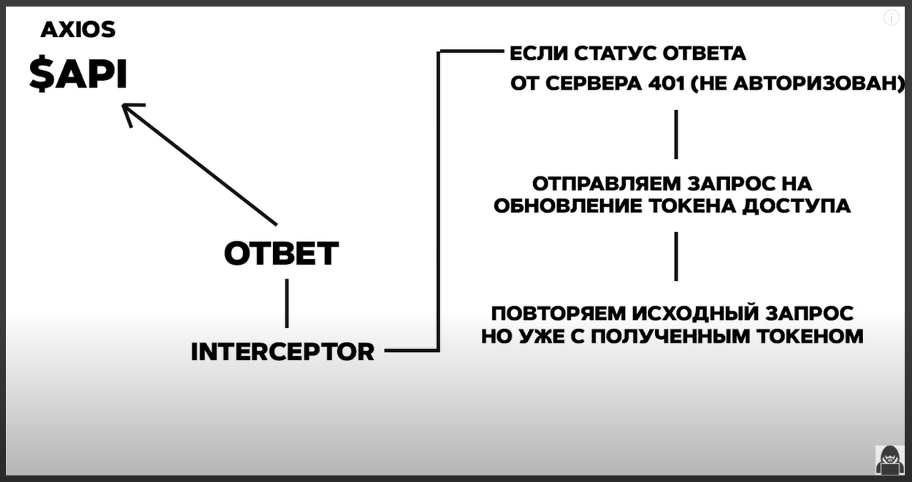

# Interceptors и добавление токена к запросу

Поговорим про **interceptors** и про то как мы будем перезаписывать наш **accessToken**.

Начнем с того что такое **interceptor** и с помощью **axios** мы можем сделать некий запрос и получить какой-то ответ от сервера.


Так вот и на отправку запроса и на получение ответа мы можем повесить некоторый интерцептор, так называемый перехватчик. Это самая обычная функция которая будет отрабатывать на каждый запрос и на каждый ответ. По этому она и называется **interceptor** потому что условно перехватывает эти запросы и ответы.

Поговорим сначало про **interceptor** который мы повесим на запрос.


Здесь все максимально просто. Все что будет делать этот **interceptor** это перед каждым запросом устанавливать ему **header** **Authorization** и помещать туда наш **token**. Это нужно для того что бы мы каждый раз не цепляли этот **header** каждый раз вручную.

Теперь поговорим об **interceptor** который мы будем вешать на получение ответа от сервера.


Здесь уже все немного по сложнее.

Мы получили ответ от сервера. Если там статус код **200**, то мы ничего не делаем и просто пропускаем. Запрос прошел успешно, у нас все впорядке. Мы получили нужные для нас данные.

В этом **interceptor** нас интересует ситуация когда мы получили статус код **401** т.е. статус код который говорит о том что пользователь не авторизован.


А пользователь считается не авторизованым когда у него умер токен доступа т.е. **accessToken**. Он умирает каждый 15 мин. Но на такой случай у нас есть **refreshToken** который живет допустим 30 дней. И так же у нас есть **end-point** который по наличию **refreshToken** перезаписывает **accessToken** и возвращает нам новую пару. Так вот если мы с сервера получили ответ с 401 статус кодом, то мы отправляем **refreshToken** как раз на этот **end-point**.


Если **refreshToken** у нас есть, если он валидный, если срок годности не истек, то сервер нам вернет новую пару **accessToken** и **refreshToken**. В свою очередь мы **accessToken** опять сохраняем на клиенте.



Пользователь вновь считается авторизованным. И мы снова повторяем исходный запрос но уже с обновленным токеном.

Например мы отправили запрос на получение пользователей. Нам вернулся 401 статус, мы токен перезаписали и вновь повторили запрос на получение пользователей.

Перехожу к **http index.ts**.

Начну с **interceptor** на **request** запрос. Обращаюсь к переменной **$api** после по цепочке обращаюсь к **interceptors** далее к **request** и вызываю функцию **use**. Параметром переда **callback**. И этот **callback** параметром принимает **config**. **config** как раз инстанса **axios**


```ts
//  http index.ts

import axios from 'axios';

export const API_URL = `http://localhost:5000`;

const $api = axios.create({
  withCredentials: true, // автоматический подхват cookie
  baseURL: API_URL, // базовый URL
});

$api.interceptors.request.use((config) => {});
```

У этого **config** есть все те же поля **baseURL** **headers** и т.д.И вот нас интересует **config.headers.Authorization**. Ему мы как и договаривались присваиваем **\`Bearer\`** и потом токен. Токен мы будем хранить в **localStorage** по ключу **token**. И результатом возвращаю **config**.


```ts
//  http index.ts

import axios from 'axios';

export const API_URL = `http://localhost:5000`;

const $api = axios.create({
  withCredentials: true, // автоматический подхват cookie
  baseURL: API_URL, // базовый URL
});

$api.interceptors.request.use((config) => {
  config.headers.Authorization = `Bearer ${localStorage.getItem(`token`)}`;
  return config;
});
```

На этом **interceptor** готов. Теперь на каждый запрос у нас будет цепляться токен.
Пока что оставляю все так только экспортирую от сюда инстанс аксиоса.

```js
//  http index.ts

import axios from 'axios';

export const API_URL = `http://localhost:5000`;

const $api = axios.create({
  withCredentials: true, // автоматический подхват cookie
  baseURL: API_URL, // базовый URL
});

$api.interceptors.request.use((config) => {
  config.headers.Authorization = `Bearer ${localStorage.getItem(`token`)}`;
  return config;
});

export default $api; // Экспортирую инстанс axios
```

К **interceptor** для ответа мы перейдем чуть позже.
