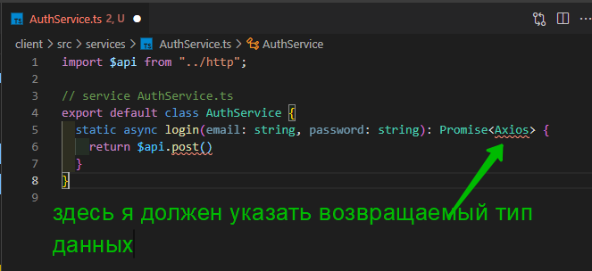
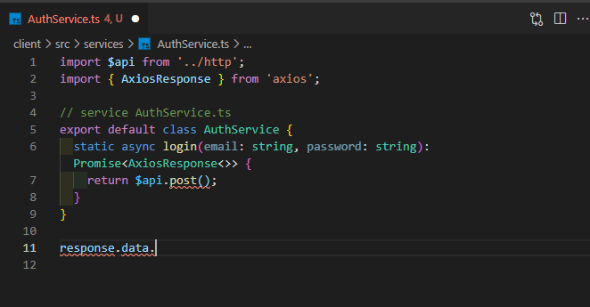
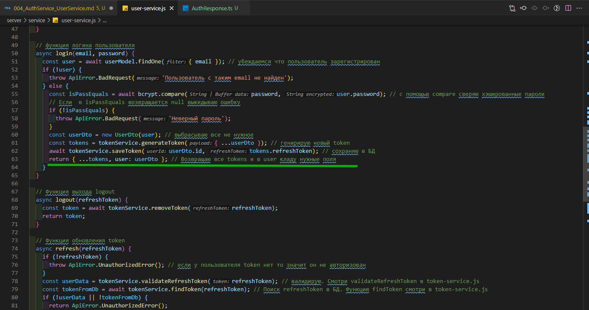
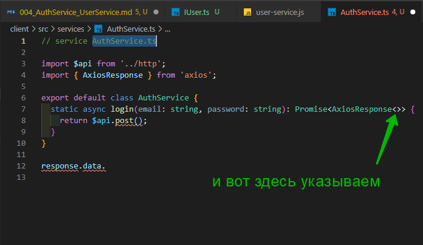
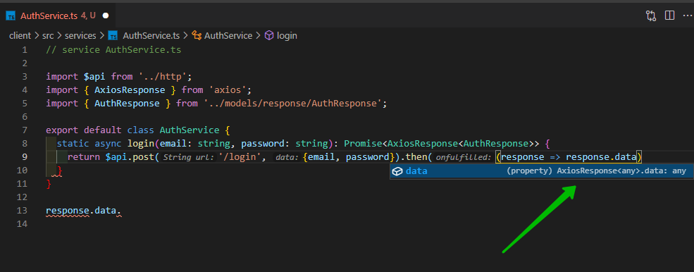
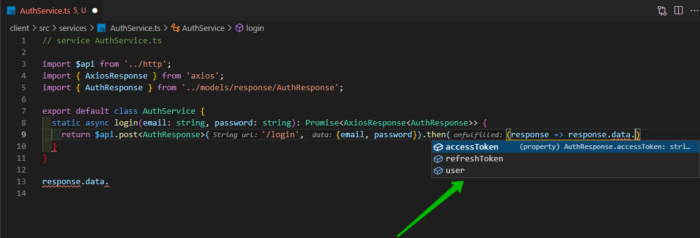

# AuthService UserService

Теперь перейдем к **service** и напишем все необходимые для нас функции.

```ts
// service AuthService.ts
export default class AuthService {}
```

И здесь у меня будут так же **static** функции с помощью которых мы будем отправлять запросы на сервер.

Начну с функии **login**. На вход эта функция будет принимать **email** и **password**. И поскольку функция у нас асинхронная она всегда будет возвращать **Promise**

```js
// service  AuthService.ts
export default class AuthService {
  static async login(email: string, password: string): Promise {}
}
```

Теперь для отправки нам как раз понадобится инстанс **axios** который мы сделали. И это у нас **post** запрос. И поскольку мы используем **TypeScript** нам необходимо указать какие данные будет возвращать эта функция.



Импортирую **Axios**. На сколько вы знаете **axios** всегда возвращает объект. А данные которые мы получили в теле ответа храняться в поле **data**.

И для того что бы указать тип этих данных, нам нужет тип который мы импортируем из **axios** и называется он **AxiosResponse**.

```ts
import $api from '../http';
import { AxiosResponse } from 'axios';

// service AuthService.ts
export default class AuthService {
  static async login(
    email: string,
    password: string
  ): Promise<AxiosResponse<>> {
    return $api.post();
  }
}
```

Вот этого я нихрена не понял: т.е. мы сделали **axios.post** нам от туда прилетел объект **response**. И здесь данные которые вернул нам сервер хранятся в поле **data**. И вот нам необходимо знать какие данные оттуда нам придут. Т.е. мы должны явно это указать иначе нет смысла от того что к проекту мы подключили **TS**.



Для этих типов данных мы создадим отдельную папку. Назовем ее **models** и в ней создам **AuthResponse.ts**.

Мы значем что после логина, регистрации, и **refresh** обновления, нам возвращается объект у которого есть **accessToken**, **refreshToken**. И то и другое это строка.

```ts
//models response AuthResponse.ts

export interface AuthResponse {
  accessToken: string;
  refreshToken: string;
}
```

И так же нам еще приходит **userDto**.

Давайте сейчас откроем **server** и вспомним как это выглядит.



Вот мы возвращаем **tokens** и вот мы возвращаем **user: userDto**.

По этому мы в **AuthResponse.ts** так же указываем что здесь будет поле **user**.

```ts
//models AuthResponse.ts

export interface AuthResponse {
  accessToken: string;
  refreshToken: string;
  user:
}
```

Но это уже не приметивные данные. По этому для него лучше создать отдельный **interface**.

В **models** создаю файлик **IUser.ts**.

```ts
// models IUser.ts

export interface IUser {
  email: string;
  isActivated: boolean;
  id: string;
}
```

и теперь в **AuthResponse.ts** в поле user как его тип я могу указать этот **intarface**.

```ts
//models AuthResponse.ts

import { IUser } from '../IUser';

export interface AuthResponse {
  accessToken: string;
  refreshToken: string;
  user: IUser;
}
```

Возвращаюсь обратно к **AuthService.ts**



И вот здесь как дженерик мы указываем этот **AuthResponce**.

```js
// service AuthService.ts

import $api from '../http';
import { AxiosResponse } from 'axios';
import { AuthResponse } from '../models/response/AuthResponse';

export default class AuthService {
  static async login(email: string, password: string): Promise<AxiosResponse<AuthResponse>> {
    return $api.post();
  }
}

response.data.
```

Теперь мы четко знаем что эта функция будет возвращать.

Первым параметром **$api.post()** мы указываем адресс **end-point** это у нас просто **login**, и вторым параметром мы указываем тело запроса.


И смотрите что получается. Для чего мы вообще создавали эти типы. Если мы сделаем **then** и передадим туда **callback**. У **response** обращаюсь к **data**. и мы не видим какие поля есть у **data**. Для нас это какой-то черный ящик.



Но если мы как **generic** укажем у **post** укажем **AuthResponse**.



Т.е. теперь **data** это не какой-то черный ящик, а прозрачный вполне очевидный объект.

Удаляю **then**

```ts
// service AuthService.ts

import $api from '../http';
import { AxiosResponse } from 'axios';
import { AuthResponse } from '../models/response/AuthResponse';

export default class AuthService {
  static async login(
    email: string,
    password: string
  ): Promise<AxiosResponse<AuthResponse>> {
    return $api.post<AuthResponse>('/login', { email, password });
  }
}
```

Для новичков которые с **TS** не знакомы возможно сейчас что-то не понятно. Смотри дальше и все прояснится.

Создаю функцию для регистрации.

Так же функция выхода которая в параметры ничего не принимает. Так же нас не особо интересует что эта функция возвращает поэтому выставляю **void**.
Подправляю **url** и убираю тело запроса.

```ts
// service AuthService.ts

import $api from '../http';
import { AxiosResponse } from 'axios';
import { AuthResponse } from '../models/response/AuthResponse';

export default class AuthService {
  static async login(
    email: string,
    password: string
  ): Promise<AxiosResponse<AuthResponse>> {
    return $api.post<AuthResponse>('/login', { email, password });
  }

  static async registration(
    email: string,
    password: string
  ): Promise<AxiosResponse<AuthResponse>> {
    return $api.post<AuthResponse>('/login', { email, password });
  }

  static async logout(): Promise<void> {
    return $api.post('/logout');
  }
}
```

Так же остается функция для получения пользователей. Но как-то в семантику сервиса авторизации она не попадает поэтому давайте создадим отдельный сервис. И здесь будет одна функция которая будет список пользователей получать.

```ts
// service UserService.ts

import $api from '../http';
import { AxiosResponse } from 'axios';
import { IUser } from '../models/IUser';

export default class UserService {
  static fetchUsers(): Promise<AxiosResponse<IUser[]>> {
    return $api.get<IUser[]>('/users');
  }
}
```
