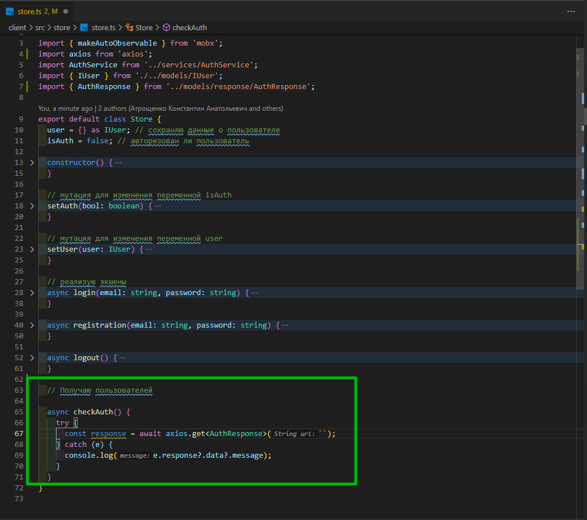
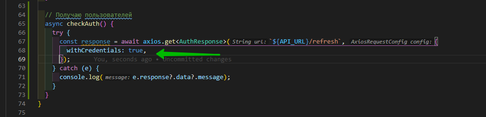
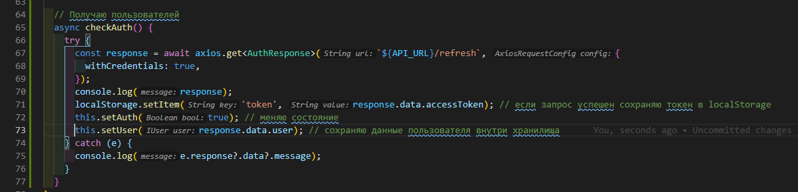
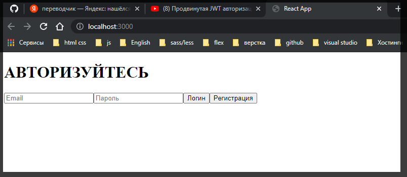
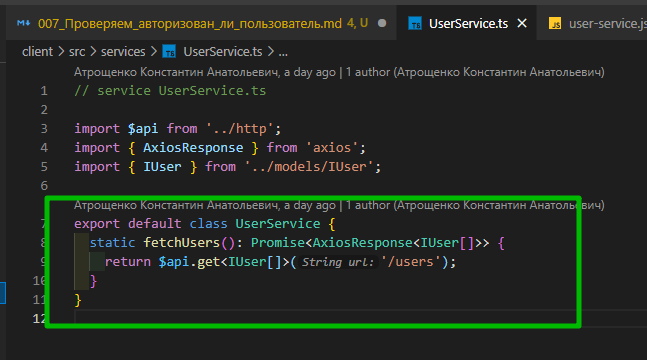
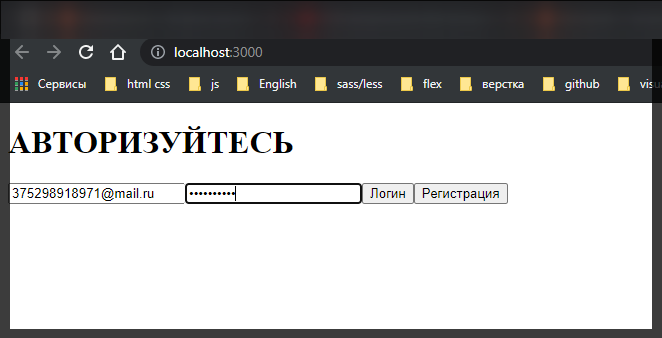
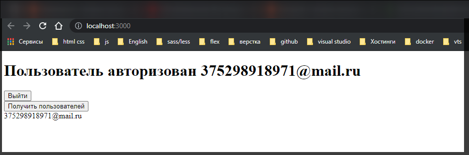
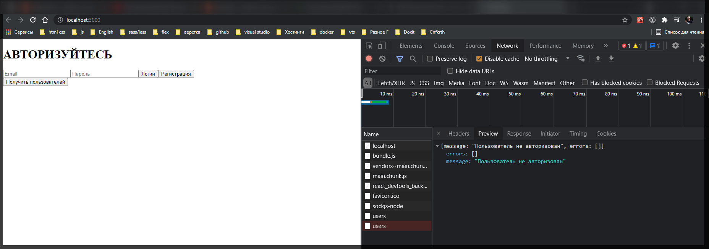

# Проверяем_авторизован ли пользователь

Каждый раз когда мы открываем приложение нам нужно каким-то образом получать информацию о пользователе и вообще убедится в том что пользователь авторизован. Для этого в **store** **store.js**
создаю еще один асинхронный **action**. Называю его **checkAuth**. Опять же здесь заворачиваю все в блок **try** **catch**. В случае ошибки выводим ее в логи.

Но здесь для отправки запроса мы не будем использовать тот **instance** **axios** который мы сделали, на который мы повесили интерцепторы. А здесь мы воспользуемся **default** **instance** **axios**. Для этого импортирую **axios**. Поскольку здесь нам может вернуться статус код **401** и мы уже четко знаем что пользователь не авторизован. И **interceptor** будет выполнять лишнюю работу.

```ts
// store store.js

import { makeAutoObservable } from 'mobx';
import axios from 'axios';
import AuthService from '../services/AuthService';
import { IUser } from './../models/IUser';

export default class Store {
  user = {} as IUser; // сохраняю данные о пользователе
  isAuth = false; // авторизован ли пользователь

  constructor() {
    makeAutoObservable(this);
  }

  // мутация для изменения переменной isAuth
  setAuth(bool: boolean) {
    this.isAuth = bool;
  }

  // мутация для изменения переменной user
  setUser(user: IUser) {
    this.user = user;
  }

  // реализую экшены
  async login(email: string, password: string) {
    try {
      const response = await AuthService.login(email, password); // делаю запрос
      console.log(response);
      localStorage.setItem('token', response.data.accessToken); // если запрос успешен сохраняю токен в localStorage
      this.setAuth(true); // меняю состояние
      this.setUser(response.data.user); // сохраняю данные пользователя внутри хранилища
    } catch (e) {
      console.log(e.response?.data?.message);
    }
  }

  async registration(email: string, password: string) {
    try {
      const response = await AuthService.registration(email, password); // делаю запрос
      console.log(response);
      localStorage.setItem('token', response.data.accessToken); // если запрос успешен сохраняю токен в localStorage
      this.setAuth(true); // меняю состояние
      this.setUser(response.data.user); // сохраняю данные пользователя внутри хранилища
    } catch (e) {
      console.log(e.response?.data?.message);
    }
  }

  async logout() {
    try {
      const response = await AuthService.logout(); // делаю запрос
      localStorage.removeItem('token'); // Удаляю токен
      this.setAuth(false); // меняю состояние
      this.setUser({} as IUser); // сохраняю данные пользователя внутри хранилища
    } catch (e) {
      console.log(e.response?.data?.message);
    }
  }

  // Получаю пользователей

  async checkAuth() {
    try {
      const response = await axios;
    } catch (e) {
      console.log(e.response?.data?.message);
    }
  }
}
```

По это му как я уже сказал используем **default** **instance** **axios**. В **checkAuth** в **axios** вызываю функцию **get**. Через **generic** указываю что как тело запроса я ожидаю **AuthResponce**



```ts
// store store.js

import { makeAutoObservable } from 'mobx';
import axios from 'axios';
import AuthService from '../services/AuthService';
import { IUser } from './../models/IUser';
import { AuthResponse } from '../models/response/AuthResponse';

export default class Store {
  user = {} as IUser; // сохраняю данные о пользователе
  isAuth = false; // авторизован ли пользователь

  constructor() {
    makeAutoObservable(this);
  }

  // мутация для изменения переменной isAuth
  setAuth(bool: boolean) {
    this.isAuth = bool;
  }

  // мутация для изменения переменной user
  setUser(user: IUser) {
    this.user = user;
  }

  // реализую экшены
  async login(email: string, password: string) {
    try {
      const response = await AuthService.login(email, password); // делаю запрос
      console.log(response);
      localStorage.setItem('token', response.data.accessToken); // если запрос успешен сохраняю токен в localStorage
      this.setAuth(true); // меняю состояние
      this.setUser(response.data.user); // сохраняю данные пользователя внутри хранилища
    } catch (e) {
      console.log(e.response?.data?.message);
    }
  }

  async registration(email: string, password: string) {
    try {
      const response = await AuthService.registration(email, password); // делаю запрос
      console.log(response);
      localStorage.setItem('token', response.data.accessToken); // если запрос успешен сохраняю токен в localStorage
      this.setAuth(true); // меняю состояние
      this.setUser(response.data.user); // сохраняю данные пользователя внутри хранилища
    } catch (e) {
      console.log(e.response?.data?.message);
    }
  }

  async logout() {
    try {
      const response = await AuthService.logout(); // делаю запрос
      localStorage.removeItem('token'); // Удаляю токен
      this.setAuth(false); // меняю состояние
      this.setUser({} as IUser); // сохраняю данные пользователя внутри хранилища
    } catch (e) {
      console.log(e.response?.data?.message);
    }
  }

  // Получаю пользователей
  async checkAuth() {
    try {
      const response = await axios.get<AuthResponse>(``);
    } catch (e) {
      console.log(e.response?.data?.message);
    }
  }
}
```

В функции **get** необходимо указать полный **url** и затем через слэш указываю **/refresh**. Т.е. это тот свмый адресс по которому у нас идет выдача **access** и **refresh** токена.

```ts
// store store.js

import { makeAutoObservable } from 'mobx';
import axios from 'axios';
import AuthService from '../services/AuthService';
import { IUser } from './../models/IUser';
import { AuthResponse } from '../models/response/AuthResponse';
import { API_URL } from '../http/index';

export default class Store {
  user = {} as IUser; // сохраняю данные о пользователе
  isAuth = false; // авторизован ли пользователь

  constructor() {
    makeAutoObservable(this);
  }

  // мутация для изменения переменной isAuth
  setAuth(bool: boolean) {
    this.isAuth = bool;
  }

  // мутация для изменения переменной user
  setUser(user: IUser) {
    this.user = user;
  }

  // реализую экшены
  async login(email: string, password: string) {
    try {
      const response = await AuthService.login(email, password); // делаю запрос
      console.log(response);
      localStorage.setItem('token', response.data.accessToken); // если запрос успешен сохраняю токен в localStorage
      this.setAuth(true); // меняю состояние
      this.setUser(response.data.user); // сохраняю данные пользователя внутри хранилища
    } catch (e) {
      console.log(e.response?.data?.message);
    }
  }

  async registration(email: string, password: string) {
    try {
      const response = await AuthService.registration(email, password); // делаю запрос
      console.log(response);
      localStorage.setItem('token', response.data.accessToken); // если запрос успешен сохраняю токен в localStorage
      this.setAuth(true); // меняю состояние
      this.setUser(response.data.user); // сохраняю данные пользователя внутри хранилища
    } catch (e) {
      console.log(e.response?.data?.message);
    }
  }

  async logout() {
    try {
      const response = await AuthService.logout(); // делаю запрос
      localStorage.removeItem('token'); // Удаляю токен
      this.setAuth(false); // меняю состояние
      this.setUser({} as IUser); // сохраняю данные пользователя внутри хранилища
    } catch (e) {
      console.log(e.response?.data?.message);
    }
  }

  // Получаю пользователей
  async checkAuth() {
    try {
      const response = await axios.get<AuthResponse>(`${API_URL}/refresh`);
    } catch (e) {
      console.log(e.response?.data?.message);
    }
  }
}
```

И напомню что когда мы делали конфигурацию нашего кастомного объекта **axios** мы с вами указывали вот такой флаг **withCredentials: true**, // автоматический подхват **cookie**. Для того что бы отправлять автоматически **cookie** с запросом.

```ts
//  http index.ts

import axios from 'axios';

export const API_URL = `http://localhost:5000/api`;

const $api = axios.create({
  withCredentials: true, // автоматический подхват cookie
  baseURL: API_URL, // базовый URL
});

$api.interceptors.request.use((config) => {
  config.headers.Authorization = `Bearer ${localStorage.getItem(`token`)}`;
  return config;
});

export default $api; // Экспортирую инстанс axios
```

Так как в **checkAuth** мы используем **default** **axios** нам это поле нужно указать.



Если запрос прошел успешно значит пользователь авторизован. Его **refreshToken** еще валиден. Мы так же сохраняем **accessToken** и вызываем соответствующиу мутации.



```ts
// store store.js

import { makeAutoObservable } from 'mobx';
import axios from 'axios';
import AuthService from '../services/AuthService';
import { IUser } from './../models/IUser';
import { AuthResponse } from '../models/response/AuthResponse';
import { API_URL } from '../http/index';

export default class Store {
  user = {} as IUser; // сохраняю данные о пользователе
  isAuth = false; // авторизован ли пользователь

  constructor() {
    makeAutoObservable(this);
  }

  // мутация для изменения переменной isAuth
  setAuth(bool: boolean) {
    this.isAuth = bool;
  }

  // мутация для изменения переменной user
  setUser(user: IUser) {
    this.user = user;
  }

  // реализую экшены
  async login(email: string, password: string) {
    try {
      const response = await AuthService.login(email, password); // делаю запрос
      console.log(response);
      localStorage.setItem('token', response.data.accessToken); // если запрос успешен сохраняю токен в localStorage
      this.setAuth(true); // меняю состояние
      this.setUser(response.data.user); // сохраняю данные пользователя внутри хранилища
    } catch (e) {
      console.log(e.response?.data?.message);
    }
  }

  async registration(email: string, password: string) {
    try {
      const response = await AuthService.registration(email, password); // делаю запрос
      console.log(response);
      localStorage.setItem('token', response.data.accessToken); // если запрос успешен сохраняю токен в localStorage
      this.setAuth(true); // меняю состояние
      this.setUser(response.data.user); // сохраняю данные пользователя внутри хранилища
    } catch (e) {
      console.log(e.response?.data?.message);
    }
  }

  async logout() {
    try {
      const response = await AuthService.logout(); // делаю запрос
      localStorage.removeItem('token'); // Удаляю токен
      this.setAuth(false); // меняю состояние
      this.setUser({} as IUser); // сохраняю данные пользователя внутри хранилища
    } catch (e) {
      console.log(e.response?.data?.message);
    }
  }

  // Получаю пользователей
  async checkAuth() {
    try {
      const response = await axios.get<AuthResponse>(`${API_URL}/refresh`, {
        withCredentials: true,
      });
      console.log(response);
      localStorage.setItem('token', response.data.accessToken); // если запрос успешен сохраняю токен в localStorage
      this.setAuth(true); // меняю состояние
      this.setUser(response.data.user); // сохраняю данные пользователя внутри хранилища
    } catch (e) {
      console.log(e.response?.data?.message);
    }
  }
}
```

Теперь у нас задача при первом запуске приложения этот **action** вызывать. В **App.tsx** вызываю хук **useEffect** c пустым массивом зависимостей. Т.е. он будет отрабатывать при первом запуске приложения.

Так же с помощью хука **useContext** получаю **store**.

И внутри **useEffect** делаю проверку. Если в **localStorage** по ключу **token** что-то есть, то тогда мы вызываем этот **action** т.е. **store.checkAuth()**. Т.е. если пользователь нажмет на кнопку выйти, то там этого token не будет и эта функция даже не отработате.

```tsx
import React, { FC, useEffect, useContext } from 'react';
import LoginForm from './components/LoginForm';
import { Context } from './index';

const App: FC = () => {
  const { store } = useContext(Context);

  useEffect(() => {
    if (localStorage.getItem(`token`)) {
      store.checkAuth();
    }
  }, []);
  return (
    <div>
      <h1>
        {store.isAuth
          ? `Пользователь авторизован ${store.user.email}`
          : 'АВТОРИЗУЙТЕСЬ'}
      </h1>
      <LoginForm />
    </div>
  );
};

export default App;
```



И так данные из **LocalStorage** не подгружались потому что пока мы не обернем компонент в функцию observer **MobX** не может отслеживать какие-либо изменения в данных. Импортирую ее из пакета **mobx-react-lite**

```tsx
import React, { FC, useEffect, useContext } from 'react';
import LoginForm from './components/LoginForm';
import { Context } from './index';
import { observer } from 'mobx-react-lite';

const App: FC = () => {
  const { store } = useContext(Context);

  useEffect(() => {
    if (localStorage.getItem('token')) {
      store.checkAuth();
    }
  }, []);

  return (
    <div>
      <h1>
        {store.isAuth
          ? `Пользователь авторизован ${store.user.email}`
          : 'АВТОРИЗУЙТЕСЬ'}
      </h1>
      <LoginForm />
    </div>
  );
};

export default observer(App);
```

```tsx
// components LoginForm.tsx
import React, { FC, useState, useContext } from 'react';
import { Context } from '../index';
import { observer } from 'mobx-react-lite';

const LoginForm: FC = () => {
  const [email, setEmail] = useState < string > '';
  const [password, setPassword] = useState < string > '';

  const { store } = useContext(Context); //извлекаю объект хранилища

  return (
    <div>
      <input
        onChange={(e) => setEmail(e.target.value)}
        value={email}
        type="text"
        placeholder="Email"
      />

      <input
        onChange={(e) => setPassword(e.target.value)}
        value={password}
        type="password"
        placeholder="Пароль"
      />
      <button onClick={() => store.login(email, password)}>Логин</button>
      <button onClick={() => store.registration(email, password)}>
        Регистрация
      </button>
    </div>
  );
};

export default observer(LoginForm);
```

Так же при подгрузке данных из **localStorage** уменя вылетела **500** ошибка. И сразу совет. Читай логи **NodeJS**. Оказывается я забыл в функцию поиска **findToken** передать **refreshToken** как раз то что мы ищем в БД.

```js
//service token-service.js

const jwt = require('jsonwebtoken');
const tokenModel = require('../models/token-model.js');

class TokenService {
  generateToken(payload) {
    const accessToken = jwt.sign(payload, process.env.JWT_ACCESS_SECRET, {
      expiresIn: '30m',
    });
    const refreshToken = jwt.sign(payload, process.env.JWT_REFRESH_SECRET, {
      expiresIn: '30d',
    });
    return {
      accessToken,
      refreshToken,
    };
  }

  // Валидация access токена
  validateAccessToken(token) {
    try {
      const userData = jwt.verify(token, process.env.JWT_ACCESS_SECRET);
      return userData;
    } catch (e) {
      return null;
    }
  }

  // Валидация refresh токена
  validateRefreshToken(token) {
    try {
      const userData = jwt.verify(token, process.env.JWT_REFRESH_SECRET);
      return userData;
    } catch (e) {
      return null;
    }
  }

  async saveToken(userId, refreshToken) {
    const tokenData = await tokenModel.findOne({ user: userId });
    if (tokenData) {
      tokenData.refreshToken = refreshToken; // если в БД нашел токен, то перезаписываю
      return tokenData.save(); // сохраняю новый токен
    } else {
      // если userId не найден вероятно он логинется первый раз
      const token = await tokenModel.create({ user: userId, refreshToken });
      return token; // возвращаю созданный token
    }
  }

  async removeToken(refreshToken) {
    const tokenData = await tokenModel.deleteOne({ refreshToken });
    return tokenData;
  }

  // После валидации поиск токена в БД
  async findToken(refreshToken) {
    const tokenData = await tokenModel.findOne({ refreshToken });
    return tokenData;
  }
}

module.exports = new TokenService();
```

Давайте еще наведем красоты. Как видите форма у нас по прежнему остается хотя пользователь уже авторизован.

Переходим в комопонент **App** и делаю здесь условие если пользователь авторизован, то мы будем возвращать другой шаблон.

```tsx
import React, { FC, useEffect, useContext } from 'react';
import LoginForm from './components/LoginForm';
import { Context } from './index';
import { observer } from 'mobx-react-lite';

const App: FC = () => {
  const { store } = useContext(Context);

  useEffect(() => {
    if (localStorage.getItem('token')) {
      store.checkAuth();
    }
  }, []);

  if (!store.isAuth) {
    return <LoginForm />;
  }

  return (
    <div>
      <h1>
        {store.isAuth
          ? `Пользователь авторизован ${store.user.email}`
          : 'АВТОРИЗУЙТЕСЬ'}
      </h1>
      <button onClick={() => store.logout()}>Выйти</button>
    </div>
  );
};

export default observer(App);
```

Сейчас на долю секудны при обновлении отрисовывается форма.

Теперь внутри **store.ts** создаю еще одну переменную которая называется **isLoading = false**.

Создаю для нее соответствующую мутацию **setLoading**.

После чего перехожу к функции **checkAuth**. И в самом начале перед тем как отправить запрос мы значение переменной setLoading сделаем **true** т.е. пошла загрузка.

И после того как пошла загрузка, не важно с ошибкой или без, после блока **catch** создаю блок **finally** в котором переменную **setLoading** перевожу в **false**.

```ts
// store store.js

import { makeAutoObservable } from 'mobx';
import axios from 'axios';
import AuthService from '../services/AuthService';
import { IUser } from './../models/IUser';
import { AuthResponse } from '../models/response/AuthResponse';
import { API_URL } from '../http/index';

export default class Store {
  user = {} as IUser; // сохраняю данные о пользователе
  isAuth = false; // авторизован ли пользователь
  isLoading = false; // Загрузка

  constructor() {
    makeAutoObservable(this);
  }

  // мутация для изменения переменной isAuth
  setAuth(bool: boolean) {
    this.isAuth = bool;
  }

  // мутация для изменения переменной user
  setUser(user: IUser) {
    this.user = user;
  }

  // мутация состояния загрузки
  setLoading(bool: boolean) {
    this.isLoading = bool;
  }

  // реализую экшены
  async login(email: string, password: string) {
    try {
      const response = await AuthService.login(email, password); // делаю запрос
      console.log(response);
      localStorage.setItem('token', response.data.accessToken); // если запрос успешен сохраняю токен в localStorage
      this.setAuth(true); // меняю состояние
      this.setUser(response.data.user); // сохраняю данные пользователя внутри хранилища
    } catch (e) {
      console.log(e.response?.data?.message);
    }
  }

  async registration(email: string, password: string) {
    try {
      const response = await AuthService.registration(email, password); // делаю запрос
      console.log(response);
      localStorage.setItem('token', response.data.accessToken); // если запрос успешен сохраняю токен в localStorage
      this.setAuth(true); // меняю состояние
      this.setUser(response.data.user); // сохраняю данные пользователя внутри хранилища
    } catch (e) {
      console.log(e.response?.data?.message);
    }
  }

  async logout() {
    try {
      const response = await AuthService.logout(); // делаю запрос
      localStorage.removeItem('token'); // Удаляю токен
      this.setAuth(false); // меняю состояние
      this.setUser({} as IUser); // сохраняю данные пользователя внутри хранилища
    } catch (e) {
      console.log(e.response?.data?.message);
    }
  }

  // Получаю пользователей
  async checkAuth() {
    this.setLoading(true); // пошла загрузка
    try {
      const response = await axios.get<AuthResponse>(`${API_URL}/refresh`, {
        withCredentials: true,
      });
      console.log(response);
      localStorage.setItem('token', response.data.accessToken); // если запрос успешен сохраняю токен в localStorage
      this.setAuth(true); // меняю состояние
      this.setUser(response.data.user); // сохраняю данные пользователя внутри хранилища
    } catch (e) {
      console.log(e.response?.data?.message);
    } finally {
      this.setLoading(false); // конец загрузки
    }
  }
}
```

Теперь мы возвращаемся в наш компонент **App** и добавляем еще одно условие. Если **store.setLoading** т.е. true то возвращаю **div** блок с надписью загрузка.

Долго эксперементировал. Для того что бы блок с надписью Загрузка... Мат.... Мат.... и еще раз мат.

У нас должна быть кнопка при нажатии на которую мы должны получать список пользователей. И сразу же создаю функция **getUsers** с помощью которой мы будем этих пользователей получать.
У нас уже есть соответствующая функция внутри сервиса.



И остается ее только вызвать. И так же с помощью хука **useState** создаим локальное состояние куда мы будем помещать наших пользователей.

```tsx
import React, { FC, useEffect, useContext } from 'react';
import LoginForm from './components/LoginForm';
import { Context } from './index';
import { observer } from 'mobx-react-lite';
import { useState } from 'react';
import { IUser } from './models/IUser';

const App: FC = () => {
  const { store } = useContext(Context);
  const [users, serUsers] = useState<IUser[]>([]);

  useEffect(() => {
    if (localStorage.getItem('token')) {
      store.checkAuth();
    }
  }, []);

  // получаю пользователей
  async function getUsers() {
    try {
    } catch (e) {
      console.log(e);
    }
  }

  if (store.isLoading) {
    return <div>Загрузка...</div>;
  }

  if (!store.isAuth) {
    return (
      <div>
        <LoginForm />
      </div>
    );
  }

  return (
    <div>
      <h1>
        {store.isAuth
          ? `Пользователь авторизован ${store.user.email}`
          : 'АВТОРИЗУЙТЕСЬ'}
      </h1>
      <button onClick={() => store.logout()}>Выйти</button>
      <div>
        <button>Получить пользователей</button>
      </div>
    </div>
  );
};

export default observer(App);
```

Теперь обращаюсь к нашему **getUsers** создаю переменную **response** в которой обращаюсь к **UserService** вызываю функцию **fetchUsers()**

```js
import React, { FC, useEffect, useContext } from 'react';
import LoginForm from './components/LoginForm';
import { Context } from './index';
import { observer } from 'mobx-react-lite';
import { useState } from 'react';
import { IUser } from './models/IUser';
import UserService from './services/UserService';

const App: FC = () => {
  const { store } = useContext(Context);
  const [users, setUsers] = useState<IUser[]>([]);

  useEffect(() => {
    if (localStorage.getItem('token')) {
      store.checkAuth();
    }
  }, []);

  // получаю пользователей
  async function getUsers() {
    try {
      const response = await UserService.fetchUsers(); // из сервиса UserService вызываю функцию fetchUsers с помощью которой делаю запрос на получение пользователей.
      setUsers(response.data); // то что возвращает сервер помещаю в состояние
    } catch (e) {
      console.log(e);
    }
  }

  if (store.isLoading) {
    return <div>Загрузка...</div>;
  }

  if (!store.isAuth) {
    return (
      <div>
        <LoginForm />
      </div>
    );
  }

  return (
    <div>
      <h1>
        {store.isAuth
          ? `Пользователь авторизован ${store.user.email}`
          : 'АВТОРИЗУЙТЕСЬ'}
      </h1>
      <button onClick={() => store.logout()}>Выйти</button>
      <div>
        <button>Получить пользователей</button>
      </div>
    </div>
  );
};

export default observer(App);

```

Теперь после того как эта функция **getUsers** вызовется у нас в состоянии будет список пользователей. Вешаю слушатель клика на кнопку. и что бы это было нагляднее отрисовываю пользователей.

```tsx
import React, { FC, useEffect, useContext } from 'react';
import LoginForm from './components/LoginForm';
import { Context } from './index';
import { observer } from 'mobx-react-lite';
import { useState } from 'react';
import { IUser } from './models/IUser';
import UserService from './services/UserService';

const App: FC = () => {
  const { store } = useContext(Context);
  const [users, setUsers] = useState<IUser[]>([]);

  useEffect(() => {
    if (localStorage.getItem('token')) {
      store.checkAuth();
    }
  }, []);

  // получаю пользователей
  async function getUsers() {
    try {
      const response = await UserService.fetchUsers(); // из сервиса UserService вызываю функцию fetchUsers с помощью которой делаю запрос на получение пользователей.
      setUsers(response.data); // то что возвращает сервер помещаю в состояние
    } catch (e) {
      console.log(e);
    }
  }

  if (store.isLoading) {
    return <div>Загрузка...</div>;
  }

  if (!store.isAuth) {
    return (
      <div>
        <h1>АВТОРИЗУЙТЕСЬ</h1>
        <LoginForm />
        <div>
          <button onClick={getUsers}>Получить пользователей</button>
        </div>
      </div>
    );
  }

  return (
    <div>
      <h1>{`Пользователь авторизован ${store.user.email}`}</h1>
      <button onClick={() => store.logout()}>Выйти</button>
      <div>
        <button onClick={getUsers}>Получить пользователей</button>
      </div>
      {users.map((user) => (
        <div key={user.email}>{user.email}</div>
      ))}
    </div>
  );
};

export default observer(App);
```






