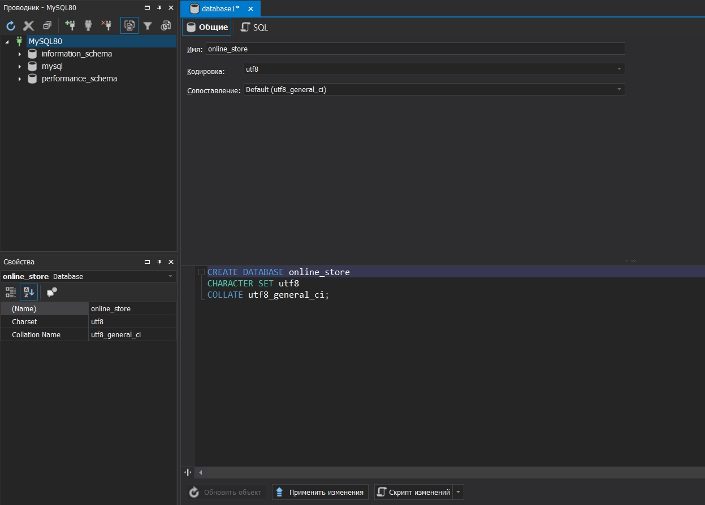
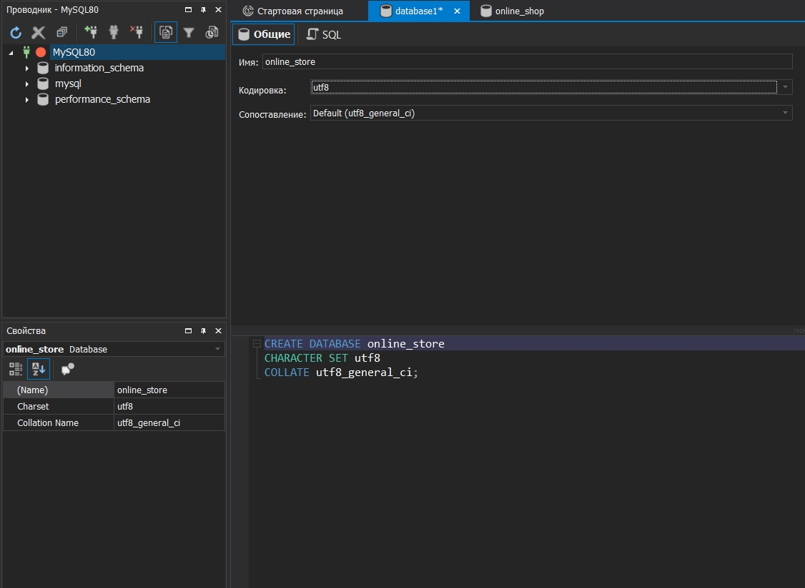
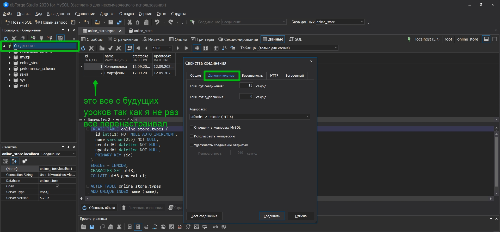
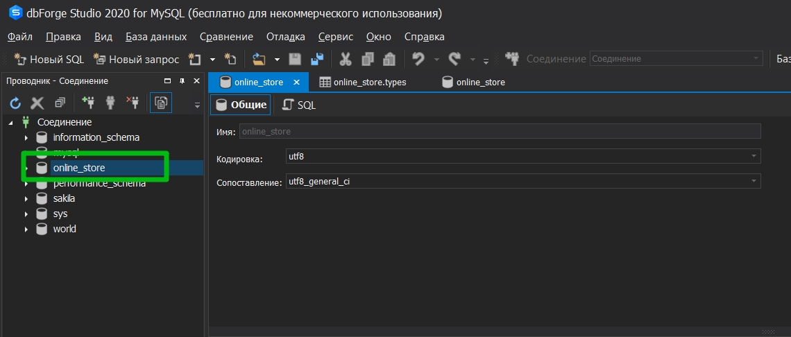

# Подключение к БД

Сконфигурируем подключение к БД. Это один из самых важных моментов. Создаю файл **db.js**

Сразу подключаю **Sequelize** и стразу делаю его деструктуризацию так как модуль большой. И нам нужен конкретно вот этот вот класс **Sequelize**

```js
// db.js
const { Sequelize } = require('sequelize');
```

Затем на выходе мы экспортируем объект который мы создаем из этого класса.

```js
// db.js
const { Sequelize } = require('sequelize');

module.exports = new Sequelize();
```

Далее в конструкторе этого класса как раз и будем указывать конфигурацию. В данном случае необходимо передать пользователя под которым будем подключаться к БД. Пароль и тд.

И так после установки и настройки сервера **MySQL** продолжаю подключение. Лучше всего разберись как взаимодействовать с **Docker**.

Создаю БД **online_store**





Теперь приступаю к конфигурации. Все настройки подключения опятьже вынесу в переменные окружения.

```env
# .env
PORT=5000
DB_NAME=online_store
DB_USER=root
DB_PASSWORD=4343
DB_HOST=localhost
DB_PORT=3306
```

И теперь все эти переменные передаю в конструктор.

```js
// db.js
const { Sequelize } = require('sequelize');

module.exports = new Sequelize(
  process.env.DB_NAME, // имя БД
  process.env.DB_USER, // имя пользователя
  process.env.DB_PASSWORD, // пароль
  {}
);
```

И затем передаю объект у которого будут следующие поля. Необходимо указать **dialect:'mysql'** либо какая-нибудь другая СУБД. Затем указываю **host** и **port**.

```js
// db.js
const { Sequelize } = require('sequelize');

module.exports = new Sequelize(
  process.env.DB_NAME, // имя БД
  process.env.DB_USER, // имя пользователя
  process.env.DB_PASSWORD, // пароль
  {
    dialect: 'mysql',
    host: process.env.DB_HOST,
    port: process.env.DB_PORT,
  }
);
```

На этом с конфигурацией мы закончили.

Возвращаемся в **index.js**. И теперь сюда мы имполртируем объект который мы сделали в файле **db.js**.

```js
require('dotenv').config();
const express = require('express');
const sequelize = require('./db'); // импортирую объект конфигурации

const PORT = process.env.PORT || 5000;

const app = express();

app.listen(PORT, () => console.log(`Сервер запущен на порту ${PORT}`));
```

И теперь необходимо вызвать функцию для подключения к БД. Для этого мы создадим функцию **start**, сделаем ее асинхронной, по сколку все операции с БД являются асинхронными.

```js
require('dotenv').config();
const express = require('express');
const sequelize = require('./db'); // импортирую объект конфигурации

const PORT = process.env.PORT || 5000;

const app = express();

const start = async () => {
  try {
    app.listen(PORT, () => console.log(`Сервер запущен на порту ${PORT}`));
  } catch (e) {
    console.log(e);
  }
};

start();
```

Теперь в блоке **try**, у обхекта **sequelize**, который мы сюда импортировали, мы вызываем функцию **authenticate**. С помощью нее будет устанавливаться подключение к БД. Среда разработки нам подсказывает что эта функция асинхронная

```js
require('dotenv').config();
const express = require('express');
const sequelize = require('./db'); // импортирую объект конфигурации

const PORT = process.env.PORT || 5000;

const app = express();

const start = async () => {
  try {
    await sequelize.authenticate();
    app.listen(PORT, () => console.log(`Сервер запущен на порту ${PORT}`));
  } catch (e) {
    console.log(e);
  }
};

start();
```

Следующим этапом у этой же функции **sequelize** вызываю функцию **sync**. Эта функция будет сверять состояние БД со схемой данных которую мы опишем чуть позже.

```js
require('dotenv').config();
const express = require('express');
const sequelize = require('./db'); // импортирую объект конфигурации

const PORT = process.env.PORT || 5000;

const app = express();

const start = async () => {
  try {
    await sequelize.authenticate();
    await sequelize.sync();
    app.listen(PORT, () => console.log(`Сервер запущен на порту ${PORT}`));
  } catch (e) {
    console.log(e);
  }
};

start();
```

И так для того что бы в dbForge отображалось все корректно при подключении нужно указать правильную кодировку. У меня сработала следующая конфигурация.




