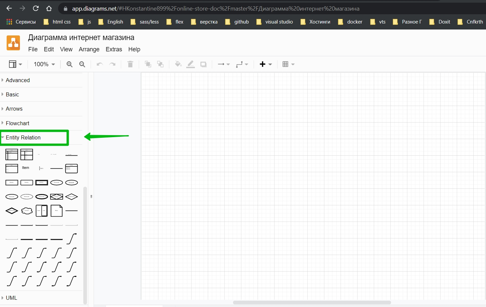
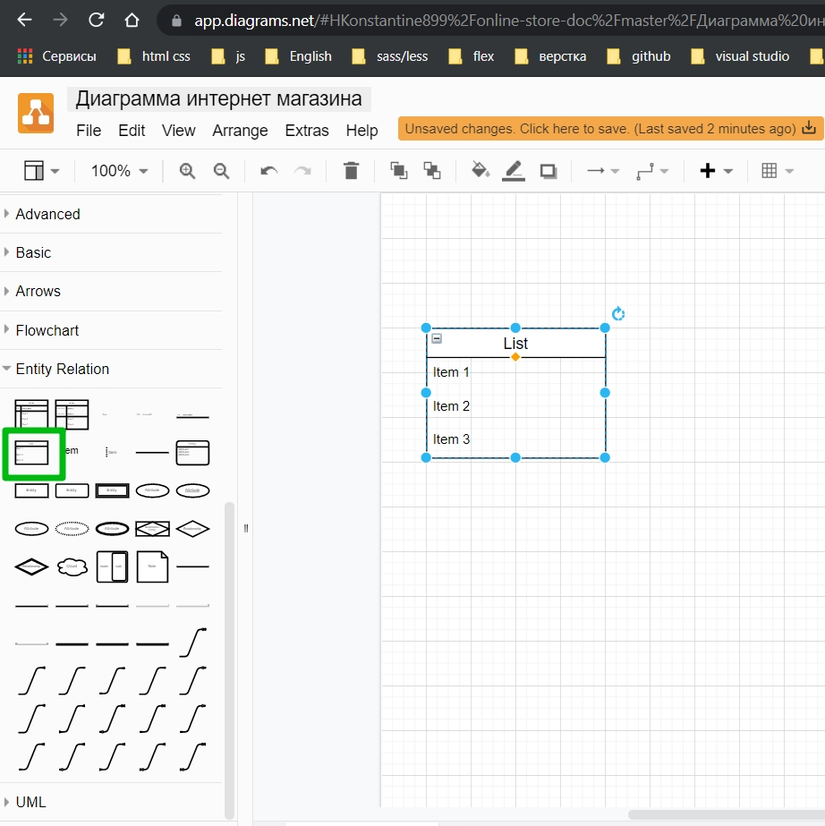
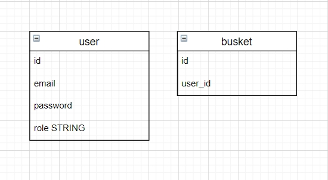
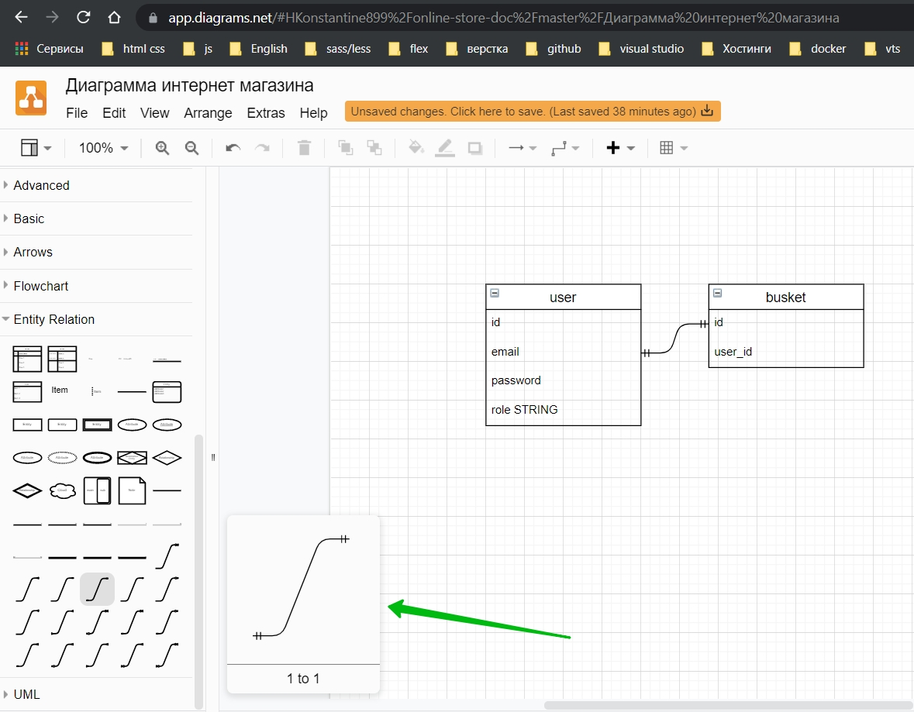
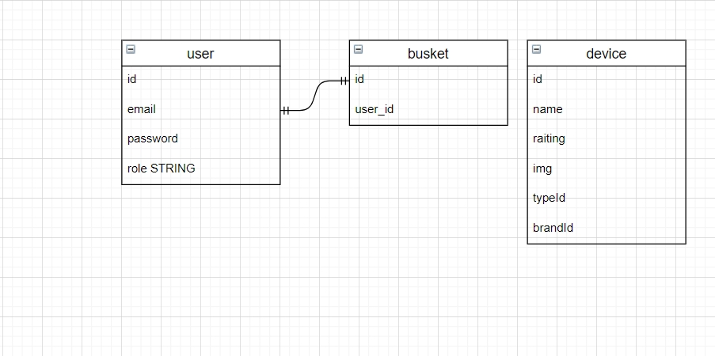
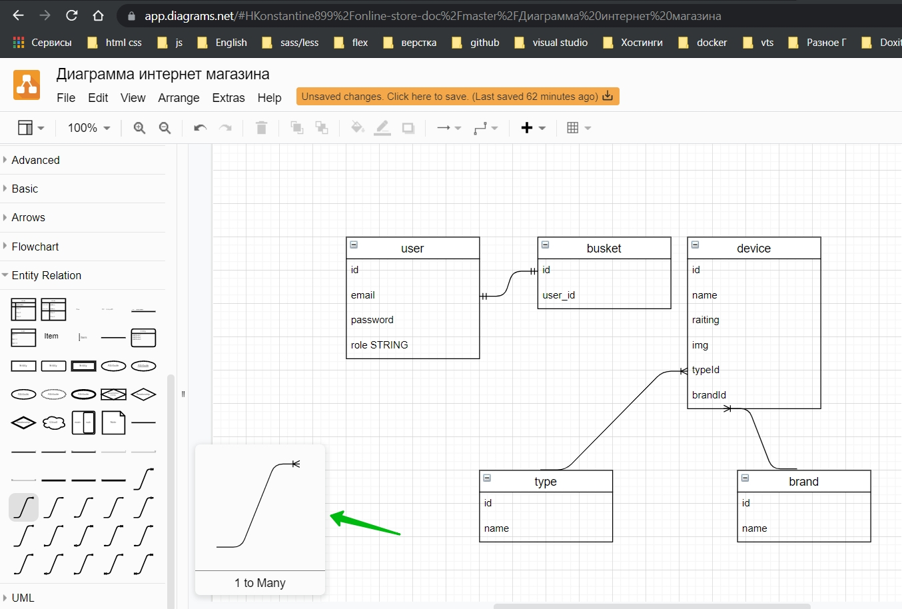
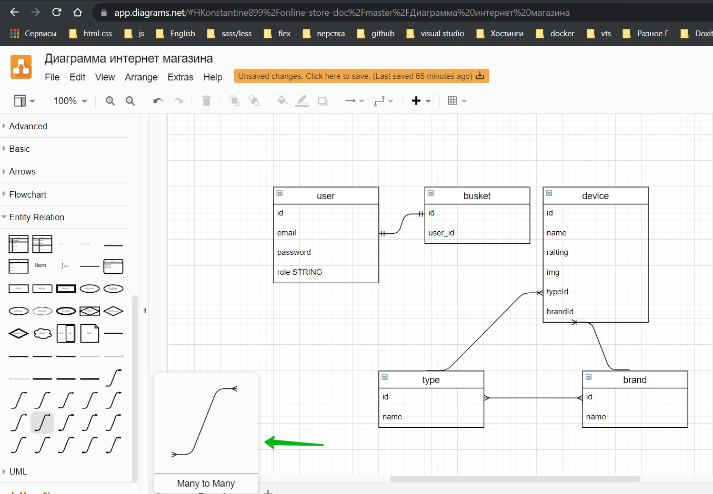
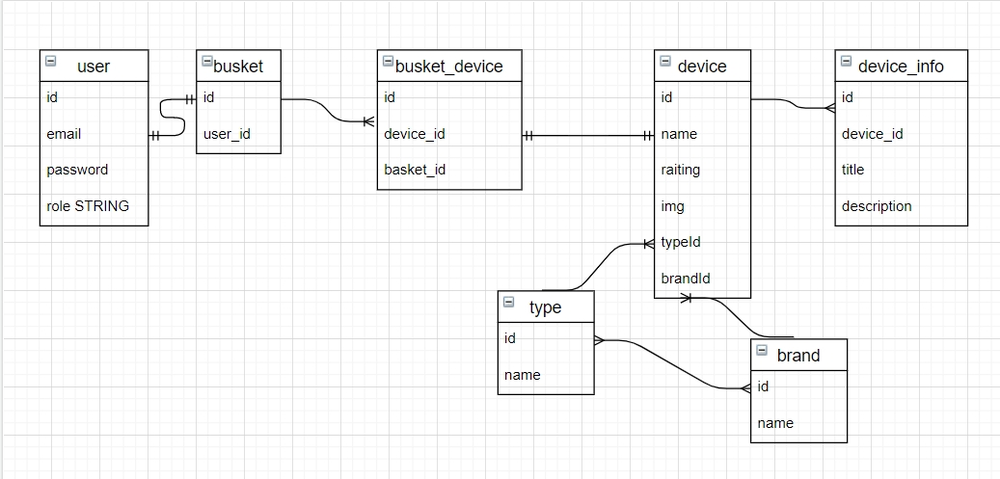

# Строим диаграмму БД

Это так же важный этап.

Нахожу вот эту вкладку.

И здесь есть вот такой элемент с таблицей.

Пишем название таблицы. Мы начнем с описания сущности пользователя. У каждой сущности по идее должен быть уникальный индентификатор который однозначно определяет сущность это **id**. Так же у пользователя будет **email**, **password**. И так же у пользователя будет роль. По хорошему у каждого пользователя должен быть массив ролей. Т.е. он может быть одновременно и пользователем и модератором и администратором. Но в нашем случае у пользователя будет одна роль. Он просто пользователь либо просто администратор.

Далее создадим еще одну сущность. Это сущность корзины пользователя. Здесь будет всего два поля. Это уникальный **id** и ссылка т.е. внешний ключ так называемый на пользователя. Что бы понимать кому эта корзина принадлежит.

Связь между этими таблицами будет один к одному т.е. одному пользователю может принадлежать только одна корзина. В то время как одна корзина может принадлежать только одному пользователю.

Краткий курс по реляционным БД [https://www.youtube.com/watch?v=IK6e1SFCdow](https://www.youtube.com/watch?v=IK6e1SFCdow).

Следующая сущность это сущность устройства конкретного **device**.

Под **typeId** я подразумеваю холодильник, телевизор, смартфон.
Под **brandId** я подразумеваю Sumsung, **Lenovo**. И вот эти типы и брэнды будут так же храниться в отдельных двух таблицах. Одну называю **type** другую **brand**.

Здесь связь будет следующей. Одному типу могут принадлежать несколько устройств. В то время как одному брэнду так же могут принадлежать несколько устройств. Соответственно связь между этими таблицами один ко многим.

Теперь опишем поля которые будут у **type** и у **brand**. и у них будут всего два поля это **id** и **name**.

Таблицы **type** и **id** будут так же между собой связаны поскольку не каждому типу принадлежит брэнд. Например **apple** стиральные машины не производит. Связь между этими сущностями будет много ко многим.

так же у каждого устройства будет какая-то индивидуальная информация. Например у телефона можно описать оперативную память а у телефона нет. Для этого создадим таблицу которая будет хранить информацию о конкретном **divece_info**

Связь между **device** и **device_info** один ко многим. один девайс может иметь много характеристик.

И так же в каких-то полях эти характеристики необходимо хранить по этому в **device_info** создаю поле **title**. Там будет название характеристики например оперативная память. И поле **discription** там уже будет само описание.

Теперь возвращаюсь к корзине. У каждого пользователя в корзине могут находится какие-то товары. Для этого так же создадим еще одну табличку. Назовем ее **basket_device**. Эта таблица будет неким связующим звеном между конзиной и устройством. Она будет содержать ссылки на корзину **basket_id** и соответственно на устройство **device_id**.

basket и **basket_device** будет связь один ко многим поскольку одна корзина может содержать большое количество устройств

И в тоже время устройство которое находится в корзине однозначно ссылается на реальное устройство которое есть у нас в магазине. По этому **basket_device** и **device** связь будет один к одному.

Вот такая вод диаграмка у нас получилась, но это еще не все. Нам как-то необходимо высчитывать **rating** для конкретного устройства. Но на данный момент мы данную информацию нигде не храним. Т.е. один пользователь мжет поставить одну и ту же оценку и мы ни как не узнаем ставил этот пользователь оценку или нет.

Поэтому делаю еще одну таблицу **rating** где мы будем хранить **id** пользователя и **id** устройства и соответственно оценку которую он поставил. И каждый раз когда пользователь заходит на страницу того или иного товара мы проверяем ставил он оценку или нет. Т.е. есть пользователь в данной таблице или нет. Если он есть знацит запрещаем ему возможность ставить оценку еще раз.

