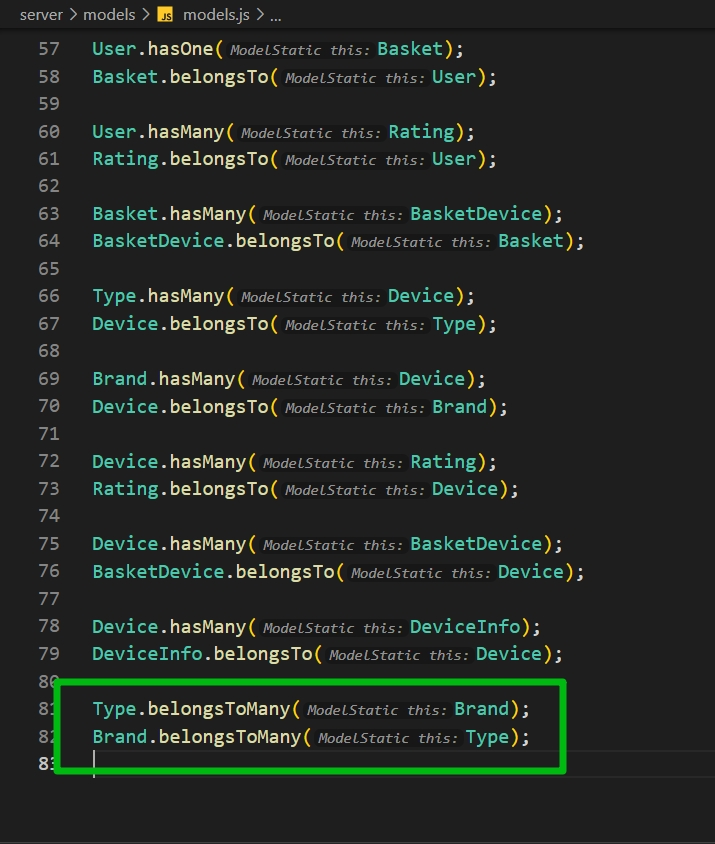
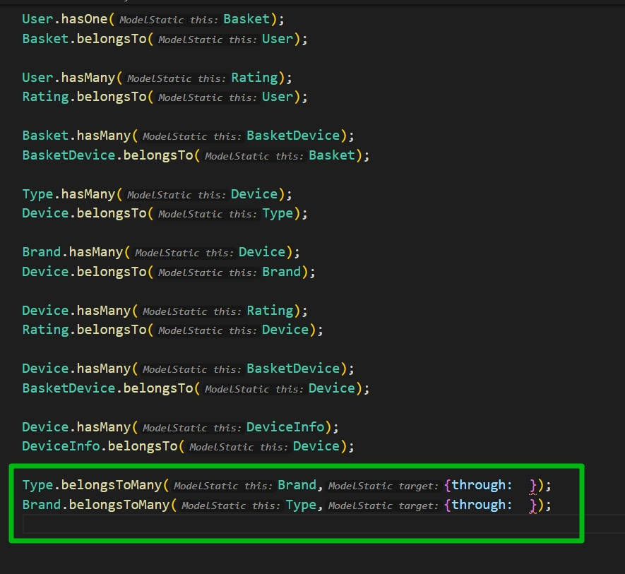
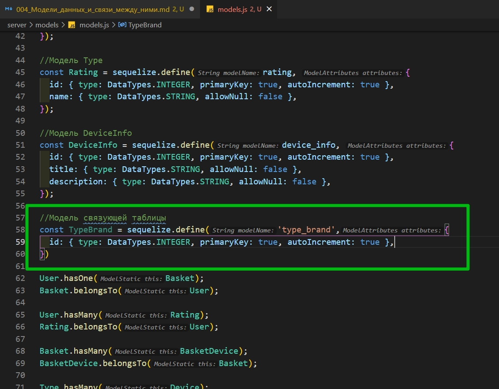
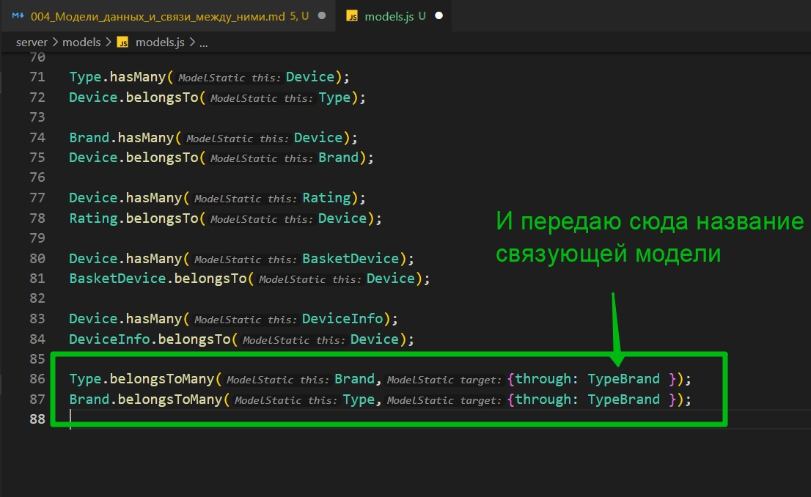
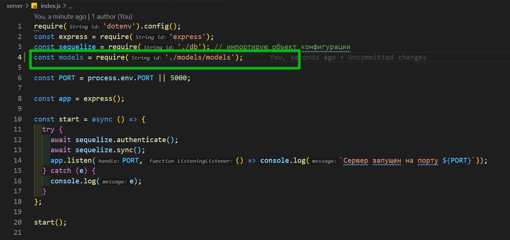
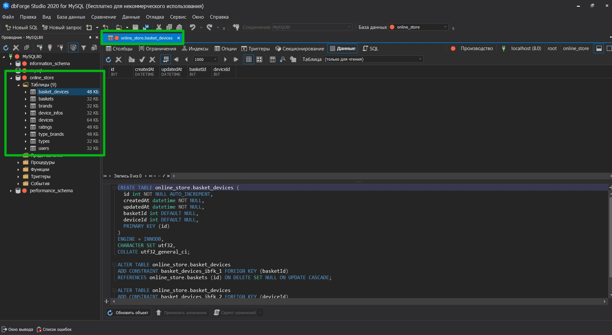
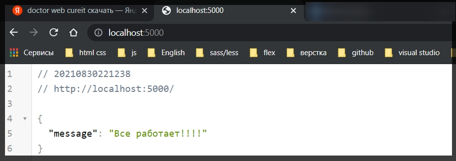

# Модели данных и связи между ними

Создаю папку **models** и в ней файл **models.js**

Сюда мы импортируем объект **sequelize** который мы создавали в файле **db.js** И из самого пакета **sequelize** мне необходимо импортировать класс **DataTypes** с помощью которого описываются типы того или иного поля т.е. **STRING**, **INTEGER** и т.д.

```js
// models models.js
const sequelize = require('../db');
const { DataTypes } = require('sequelize');
```

И начнем описывать первую модель. Начнем с модели пользователя. **const User = у sequelize** вызываю функцию **define()**. Передаю туда объект, а первым параметром указываем название этой модели.

```js
// models models.js
const sequelize = require('../db');
const { DataTypes } = require('sequelize');

const User = sequelize.define(user, {});
```

И внутри объекта уже описываю поля которые будут у этой модели.

Первое поле **id** и **type:** у этого поля **DataTypes.INTEGER**, **primaryKey: true, autoIncrement**. Это будет первичный ключ и он будет автоинкрементироваться т.е. Т.е. при создании каждого нового объекта **id** будет только увеличиваться.

Следующее поле это **email**. **type:** у него уже будет **DataTypes.STRING**. Он должен быть уникальным **unique: true**, поскольку двух пользователей с одинаковым **email** в системе быть не может.

Третье поле это **password**. Пароль уже уникальным быть не может.

И последнее поле это **role**. Роль тоже будет просто строкой и по умолчанию будем делать пользователя просто **USER**. Роль будем указывать в верхнем регистре.

```js
// models models.js
const sequelize = require('../db');
const { DataTypes } = require('sequelize');

//Модель пользователя
const User = sequelize.define('user', {
  id: { type: DataTypes.INTEGER, primaryKey: true, autoIncrement: true },
  email: { type: DataTypes.STRING, unique: true },
  password: { type: DataTypes.STRING },
  role: { type: DataTypes.STRING, defaultValue: 'USER' },
});
```

Следующая модель будет моделью Корзины.

```js
// models models.js
const sequelize = require('../db');
const { DataTypes } = require('sequelize');

//Модель пользователя
const User = sequelize.define('user', {
  id: { type: DataTypes.INTEGER, primaryKey: true, autoIncrement: true },
  email: { type: DataTypes.STRING, unique: true },
  password: { type: DataTypes.STRING },
  role: { type: DataTypes.STRING, defaultValue: 'USER' },
});

//Модель Корзины
const Basket = sequelize.define('basket', {
  id: { type: DataTypes.INTEGER, primaryKey: true, autoIncrement: true },
});

// девайса в корзине
const BasketDevice = sequelize.define('basket_device', {
  id: { type: DataTypes.INTEGER, primaryKey: true, autoIncrement: true },
});
```

Приступаю к самой большой сужности

```js
// models models.js
const sequelize = require('../db');
const { DataTypes } = require('sequelize');

//Модель пользователя
const User = sequelize.define('user', {
  id: { type: DataTypes.INTEGER, primaryKey: true, autoIncrement: true },
  email: { type: DataTypes.STRING, unique: true },
  password: { type: DataTypes.STRING },
  role: { type: DataTypes.STRING, defaultValue: 'USER' },
});

//Модель Корзины
const Basket = sequelize.define('basket', {
  id: { type: DataTypes.INTEGER, primaryKey: true, autoIncrement: true },
});

// девайса в корзине
const BasketDevice = sequelize.define('basket_device', {
  id: { type: DataTypes.INTEGER, primaryKey: true, autoIncrement: true },
});

// Модель Device
const Device = sequelize.define('device', {
  id: { type: DataTypes.INTEGER, primaryKey: true, autoIncrement: true },
  name: { type: DataTypes.STRING, unique: true, allowNull: false },
  price: { type: DataTypes.INTEGER, allowNull: false },
  rating: { type: DataTypes.INTEGER, defaultValue: 0 },
  img: { type: DataTypes.STRING, allowNull: false },
});
```

В принцыпе все понятьно. **img** это строка в которой мы будем хранить название файла. Модель **Type** и **Brand** у нас одинаковые.

```js
// models models.js
const sequelize = require('../db');
const { DataTypes, STRING } = require('sequelize');

//Модель пользователя
const User = sequelize.define('user', {
  id: { type: DataTypes.INTEGER, primaryKey: true, autoIncrement: true },
  email: { type: DataTypes.STRING, unique: true },
  password: { type: DataTypes.STRING },
  role: { type: DataTypes.STRING, defaultValue: 'USER' },
});

//Модель Корзины
const Basket = sequelize.define('basket', {
  id: { type: DataTypes.INTEGER, primaryKey: true, autoIncrement: true },
});

// девайса в корзине
const BasketDevice = sequelize.define('basket_device', {
  id: { type: DataTypes.INTEGER, primaryKey: true, autoIncrement: true },
});

// Модель Device
const Device = sequelize.define('device', {
  id: { type: DataTypes.INTEGER, primaryKey: true, autoIncrement: true },
  name: { type: DataTypes.STRING, unique: true, allowNull: false },
  price: { type: DataTypes.INTEGER, allowNull: false },
  rating: { type: DataTypes.INTEGER, defaultValue: 0 },
  img: { type: DataTypes.STRING, allowNull: false },
});

//Модель Type
const Type = sequelize.define('type', {
  id: { type: DataTypes.INTEGER, primaryKey: true, autoIncrement: true },
  name: { type: DataTypes > STRING, unique: true, allowNull: false },
});

//Модель Type
const Brand = sequelize.define('brand', {
  id: { type: DataTypes.INTEGER, primaryKey: true, autoIncrement: true },
  name: { type: DataTypes > STRING, unique: true, allowNull: false },
});
```

Остается **rating** и **device_info**.

В **rating** у нас едиственное поле которое не является внешним ключем это сама оценка. Будет просто числом и не может быть пустым.

```js
// models models.js
const sequelize = require('../db');
const { DataTypes, STRING } = require('sequelize');

//Модель пользователя
const User = sequelize.define('user', {
  id: { type: DataTypes.INTEGER, primaryKey: true, autoIncrement: true },
  email: { type: DataTypes.STRING, unique: true },
  password: { type: DataTypes.STRING },
  role: { type: DataTypes.STRING, defaultValue: 'USER' },
});

//Модель Корзины
const Basket = sequelize.define('basket', {
  id: { type: DataTypes.INTEGER, primaryKey: true, autoIncrement: true },
});

// девайса в корзине
const BasketDevice = sequelize.define('basket_device', {
  id: { type: DataTypes.INTEGER, primaryKey: true, autoIncrement: true },
});

// Модель Device
const Device = sequelize.define('device', {
  id: { type: DataTypes.INTEGER, primaryKey: true, autoIncrement: true },
  name: { type: DataTypes.STRING, unique: true, allowNull: false },
  price: { type: DataTypes.INTEGER, allowNull: false },
  rating: { type: DataTypes.INTEGER, defaultValue: 0 },
  img: { type: DataTypes.STRING, allowNull: false },
});

//Модель Type
const Type = sequelize.define('type', {
  id: { type: DataTypes.INTEGER, primaryKey: true, autoIncrement: true },
  name: { type: DataTypes.STRING, unique: true, allowNull: false },
});

//Модель Type
const Brand = sequelize.define('brand', {
  id: { type: DataTypes.INTEGER, primaryKey: true, autoIncrement: true },
  name: { type: DataTypes.STRING, unique: true, allowNull: false },
});

//Модель Type
const Rating = sequelize.define('rating', {
  id: { type: DataTypes.INTEGER, primaryKey: true, autoIncrement: true },
  name: { type: DataTypes.STRING, allowNull: false },
});

//Модель DeviceInfo
const DeviceInfo = sequelize.define('device_info', {
  id: { type: DataTypes.INTEGER, primaryKey: true, autoIncrement: true },
  title: { type: DataTypes.STRING, allowNull: false },
  description: { type: DataTypes.STRING, allowNull: false },
});
```

И теперь настал момен описать как эти таблицы связаны между собой.

Обращаемся к модели и вызываем соотвтетствующую функцию **Device.hasMany(DeviceInfo)**, либо **hasMany** либо **hasOne**. Таким образом мы сообщаем что одна запись **device** в БД содержит много записей с характеристиками. Я указываю что сущность **DiviceInfo** принадлежит **Device**.

И так это было объяснение. Я же начну с **User** и **Basket** которые имеют связь один к одному. **User.hasOne(Basket);** Далее **Basket** вызываю функцию **belongsTo** и в нее помещаю **User**. Таким образом я сообщаю что корзина принадлежит пользователю.

```js
// models models.js
const sequelize = require('../db');
const { DataTypes, STRING } = require('sequelize');

//Модель пользователя
const User = sequelize.define('user', {
  id: { type: DataTypes.INTEGER, primaryKey: true, autoIncrement: true },
  email: { type: DataTypes.STRING, unique: true },
  password: { type: DataTypes.STRING },
  role: { type: DataTypes.STRING, defaultValue: 'USER' },
});

//Модель Корзины
const Basket = sequelize.define('basket', {
  id: { type: DataTypes.INTEGER, primaryKey: true, autoIncrement: true },
});

// девайса в корзине
const BasketDevice = sequelize.define('basket_device', {
  id: { type: DataTypes.INTEGER, primaryKey: true, autoIncrement: true },
});

// Модель Device
const Device = sequelize.define('device', {
  id: { type: DataTypes.INTEGER, primaryKey: true, autoIncrement: true },
  name: { type: DataTypes.STRING, unique: true, allowNull: false },
  price: { type: DataTypes.INTEGER, allowNull: false },
  rating: { type: DataTypes.INTEGER, defaultValue: 0 },
  img: { type: DataTypes.STRING, allowNull: false },
});

//Модель Type
const Type = sequelize.define('type', {
  id: { type: DataTypes.INTEGER, primaryKey: true, autoIncrement: true },
  name: { type: DataTypes.STRING, unique: true, allowNull: false },
});

//Модель Type
const Brand = sequelize.define('brand', {
  id: { type: DataTypes.INTEGER, primaryKey: true, autoIncrement: true },
  name: { type: DataTypes.STRING, unique: true, allowNull: false },
});

//Модель Type
const Rating = sequelize.define('rating', {
  id: { type: DataTypes.INTEGER, primaryKey: true, autoIncrement: true },
  name: { type: DataTypes.STRING, allowNull: false },
});

//Модель DeviceInfo
const DeviceInfo = sequelize.define('device_info', {
  id: { type: DataTypes.INTEGER, primaryKey: true, autoIncrement: true },
  title: { type: DataTypes.STRING, allowNull: false },
  description: { type: DataTypes.STRING, allowNull: false },
});

User.hasOne(Basket);
Basket.belongsTo(User);
```

Один **User** может иметь несколько оценок **hasMany(Rating)**. Для **Raiting** опять же вызываю функцию **belongsTo** и туда передаю **User**.

```js
// models models.js
const sequelize = require('../db');
const { DataTypes, STRING } = require('sequelize');

//Модель пользователя
const User = sequelize.define('user', {
  id: { type: DataTypes.INTEGER, primaryKey: true, autoIncrement: true },
  email: { type: DataTypes.STRING, unique: true },
  password: { type: DataTypes.STRING },
  role: { type: DataTypes.STRING, defaultValue: 'USER' },
});

//Модель Корзины
const Basket = sequelize.define('basket', {
  id: { type: DataTypes.INTEGER, primaryKey: true, autoIncrement: true },
});

// девайса в корзине
const BasketDevice = sequelize.define('basket_device', {
  id: { type: DataTypes.INTEGER, primaryKey: true, autoIncrement: true },
});

// Модель Device
const Device = sequelize.define('device', {
  id: { type: DataTypes.INTEGER, primaryKey: true, autoIncrement: true },
  name: { type: DataTypes.STRING, unique: true, allowNull: false },
  price: { type: DataTypes.INTEGER, allowNull: false },
  rating: { type: DataTypes.INTEGER, defaultValue: 0 },
  img: { type: DataTypes.STRING, allowNull: false },
});

//Модель Type
const Type = sequelize.define('type', {
  id: { type: DataTypes.INTEGER, primaryKey: true, autoIncrement: true },
  name: { type: DataTypes.STRING, unique: true, allowNull: false },
});

//Модель Type
const Brand = sequelize.define('brand', {
  id: { type: DataTypes.INTEGER, primaryKey: true, autoIncrement: true },
  name: { type: DataTypes.STRING, unique: true, allowNull: false },
});

//Модель Type
const Rating = sequelize.define('rating', {
  id: { type: DataTypes.INTEGER, primaryKey: true, autoIncrement: true },
  name: { type: DataTypes.STRING, allowNull: false },
});

//Модель DeviceInfo
const DeviceInfo = sequelize.define('device_info', {
  id: { type: DataTypes.INTEGER, primaryKey: true, autoIncrement: true },
  title: { type: DataTypes.STRING, allowNull: false },
  description: { type: DataTypes.STRING, allowNull: false },
});

User.hasOne(Basket);
Basket.belongsTo(User);

User.hasMany(Rating);
Rating.belongsTo(User);
```

И остально все такое же рутинное.

```js
// models models.js
const sequelize = require('../db');
const { DataTypes, STRING } = require('sequelize');

//Модель пользователя
const User = sequelize.define('user', {
  id: { type: DataTypes.INTEGER, primaryKey: true, autoIncrement: true },
  email: { type: DataTypes.STRING, unique: true },
  password: { type: DataTypes.STRING },
  role: { type: DataTypes.STRING, defaultValue: 'USER' },
});

//Модель Корзины
const Basket = sequelize.define('basket', {
  id: { type: DataTypes.INTEGER, primaryKey: true, autoIncrement: true },
});

// девайса в корзине
const BasketDevice = sequelize.define('basket_device', {
  id: { type: DataTypes.INTEGER, primaryKey: true, autoIncrement: true },
});

// Модель Device
const Device = sequelize.define('device', {
  id: { type: DataTypes.INTEGER, primaryKey: true, autoIncrement: true },
  name: { type: DataTypes.STRING, unique: true, allowNull: false },
  price: { type: DataTypes.INTEGER, allowNull: false },
  rating: { type: DataTypes.INTEGER, defaultValue: 0 },
  img: { type: DataTypes.STRING, allowNull: false },
});

//Модель Type
const Type = sequelize.define('type', {
  id: { type: DataTypes.INTEGER, primaryKey: true, autoIncrement: true },
  name: { type: DataTypes.STRING, unique: true, allowNull: false },
});

//Модель Type
const Brand = sequelize.define('brand', {
  id: { type: DataTypes.INTEGER, primaryKey: true, autoIncrement: true },
  name: { type: DataTypes.STRING, unique: true, allowNull: false },
});

//Модель Type
const Rating = sequelize.define('rating', {
  id: { type: DataTypes.INTEGER, primaryKey: true, autoIncrement: true },
  name: { type: DataTypes.STRING, allowNull: false },
});

//Модель DeviceInfo
const DeviceInfo = sequelize.define('device_info', {
  id: { type: DataTypes.INTEGER, primaryKey: true, autoIncrement: true },
  title: { type: DataTypes.STRING, allowNull: false },
  description: { type: DataTypes.STRING, allowNull: false },
});

User.hasOne(Basket);
Basket.belongsTo(User);

User.hasMany(Rating);
Rating.belongsTo(User);

Basket.hasMany(BasketDevice);
BasketDevice.belongsTo(Basket);

Type.hasMany(Device);
Device.belongsTo(Type);

Brand.hasMany(Device);
Device.belongsTo(Brand);

Device.hasMany(Rating);
Rating.belongsTo(Device);

Device.hasMany(BasketDevice);
BasketDevice.belongsTo(Device);

Device.hasMany(DeviceInfo);
DeviceInfo.belongsTo(Device);
```

Далее опишем вид связи между **Type** и **Brand**. Как я уже сказал вид **Many** to **Many**. Поэтому здесь я вызываю функцию **belongsToMany**



```js
// models models.js
const sequelize = require('../db');
const { DataTypes, STRING } = require('sequelize');

//Модель пользователя
const User = sequelize.define('user', {
  id: { type: DataTypes.INTEGER, primaryKey: true, autoIncrement: true },
  email: { type: DataTypes.STRING, unique: true },
  password: { type: DataTypes.STRING },
  role: { type: DataTypes.STRING, defaultValue: 'USER' },
});

//Модель Корзины
const Basket = sequelize.define('basket', {
  id: { type: DataTypes.INTEGER, primaryKey: true, autoIncrement: true },
});

// девайса в корзине
const BasketDevice = sequelize.define('basket_device', {
  id: { type: DataTypes.INTEGER, primaryKey: true, autoIncrement: true },
});

// Модель Device
const Device = sequelize.define('device', {
  id: { type: DataTypes.INTEGER, primaryKey: true, autoIncrement: true },
  name: { type: DataTypes.STRING, unique: true, allowNull: false },
  price: { type: DataTypes.INTEGER, allowNull: false },
  rating: { type: DataTypes.INTEGER, defaultValue: 0 },
  img: { type: DataTypes.STRING, allowNull: false },
});

//Модель Type
const Type = sequelize.define('type', {
  id: { type: DataTypes.INTEGER, primaryKey: true, autoIncrement: true },
  name: { type: DataTypes.STRING, unique: true, allowNull: false },
});

//Модель Type
const Brand = sequelize.define('brand', {
  id: { type: DataTypes.INTEGER, primaryKey: true, autoIncrement: true },
  name: { type: DataTypes.STRING, unique: true, allowNull: false },
});

//Модель Type
const Rating = sequelize.define('rating', {
  id: { type: DataTypes.INTEGER, primaryKey: true, autoIncrement: true },
  name: { type: DataTypes.STRING, allowNull: false },
});

//Модель DeviceInfo
const DeviceInfo = sequelize.define('device_info', {
  id: { type: DataTypes.INTEGER, primaryKey: true, autoIncrement: true },
  title: { type: DataTypes.STRING, allowNull: false },
  description: { type: DataTypes.STRING, allowNull: false },
});

User.hasOne(Basket);
Basket.belongsTo(User);

User.hasMany(Rating);
Rating.belongsTo(User);

Basket.hasMany(BasketDevice);
BasketDevice.belongsTo(Basket);

Type.hasMany(Device);
Device.belongsTo(Type);

Brand.hasMany(Device);
Device.belongsTo(Brand);

Device.hasMany(Rating);
Rating.belongsTo(Device);

Device.hasMany(BasketDevice);
BasketDevice.belongsTo(Device);

Device.hasMany(DeviceInfo);
DeviceInfo.belongsTo(Device);

Type.belongsToMany(Brand);
Brand.belongsToMany(Type);
```

Но здесь не все так просто. При связи много ко многим создается промежуточная таблица в которой мы должны хранить информацию о том какой брэнд принадлежит какому типу и какой тип связан с каким типом. И для этого нам нужен второй аргумент. Вторым аргументом передаем объект и в нем необходимо указать свойство **through**



Здесь необходимо указать связующую таблицу т.е. связующую модель которую мы сейчас как раз создадим. Называю модель **TypeBrand**. И в данной модели указываю просто **id**. Остальные поля **sequelize** добавит сам когда мы вызываем функцию **belongsToMany**.



sequelize будет все внешнии ключи добавлять автоматически.

```js
// models models.js
const sequelize = require('../db');
const { DataTypes, STRING } = require('sequelize');

//Модель пользователя
const User = sequelize.define('user', {
  id: { type: DataTypes.INTEGER, primaryKey: true, autoIncrement: true },
  email: { type: DataTypes.STRING, unique: true },
  password: { type: DataTypes.STRING },
  role: { type: DataTypes.STRING, defaultValue: 'USER' },
});

//Модель Корзины
const Basket = sequelize.define('basket', {
  id: { type: DataTypes.INTEGER, primaryKey: true, autoIncrement: true },
});

// девайса в корзине
const BasketDevice = sequelize.define('basket_device', {
  id: { type: DataTypes.INTEGER, primaryKey: true, autoIncrement: true },
});

// Модель Device
const Device = sequelize.define('device', {
  id: { type: DataTypes.INTEGER, primaryKey: true, autoIncrement: true },
  name: { type: DataTypes.STRING, unique: true, allowNull: false },
  price: { type: DataTypes.INTEGER, allowNull: false },
  rating: { type: DataTypes.INTEGER, defaultValue: 0 },
  img: { type: DataTypes.STRING, allowNull: false },
});

//Модель Type
const Type = sequelize.define('type', {
  id: { type: DataTypes.INTEGER, primaryKey: true, autoIncrement: true },
  name: { type: DataTypes.STRING, unique: true, allowNull: false },
});

//Модель Type
const Brand = sequelize.define('brand', {
  id: { type: DataTypes.INTEGER, primaryKey: true, autoIncrement: true },
  name: { type: DataTypes.STRING, unique: true, allowNull: false },
});

//Модель Type
const Rating = sequelize.define('rating', {
  id: { type: DataTypes.INTEGER, primaryKey: true, autoIncrement: true },
  name: { type: DataTypes.STRING, allowNull: false },
});

//Модель DeviceInfo
const DeviceInfo = sequelize.define('device_info', {
  id: { type: DataTypes.INTEGER, primaryKey: true, autoIncrement: true },
  title: { type: DataTypes.STRING, allowNull: false },
  description: { type: DataTypes.STRING, allowNull: false },
});

//Модель связующей таблицы
const TypeBrand = sequelize.define('type_brand', {
  id: { type: DataTypes.INTEGER, primaryKey: true, autoIncrement: true },
});

User.hasOne(Basket);
Basket.belongsTo(User);

User.hasMany(Rating);
Rating.belongsTo(User);

Basket.hasMany(BasketDevice);
BasketDevice.belongsTo(Basket);

Type.hasMany(Device);
Device.belongsTo(Type);

Brand.hasMany(Device);
Device.belongsTo(Brand);

Device.hasMany(Rating);
Rating.belongsTo(Device);

Device.hasMany(BasketDevice);
BasketDevice.belongsTo(Device);

Device.hasMany(DeviceInfo);
DeviceInfo.belongsTo(Device);

Type.belongsToMany(Brand, { through: TypeBrand });
Brand.belongsToMany(Type, { through: TypeBrand });
```

И на данном этапе с описанием моделей и типами связей мы закончили. Остается экспортировать все модели.

```js
// models models.js
const sequelize = require('../db');
const { DataTypes, STRING } = require('sequelize');

//Модель пользователя
const User = sequelize.define('user', {
  id: { type: DataTypes.INTEGER, primaryKey: true, autoIncrement: true },
  email: { type: DataTypes.STRING, unique: true },
  password: { type: DataTypes.STRING },
  role: { type: DataTypes.STRING, defaultValue: 'USER' },
});

//Модель Корзины
const Basket = sequelize.define('basket', {
  id: { type: DataTypes.INTEGER, primaryKey: true, autoIncrement: true },
});

// девайса в корзине
const BasketDevice = sequelize.define('basket_device', {
  id: { type: DataTypes.INTEGER, primaryKey: true, autoIncrement: true },
});

// Модель Device
const Device = sequelize.define('device', {
  id: { type: DataTypes.INTEGER, primaryKey: true, autoIncrement: true },
  name: { type: DataTypes.STRING, unique: true, allowNull: false },
  price: { type: DataTypes.INTEGER, allowNull: false },
  rating: { type: DataTypes.INTEGER, defaultValue: 0 },
  img: { type: DataTypes.STRING, allowNull: false },
});

//Модель Type
const Type = sequelize.define('type', {
  id: { type: DataTypes.INTEGER, primaryKey: true, autoIncrement: true },
  name: { type: DataTypes.STRING, unique: true, allowNull: false },
});

//Модель Type
const Brand = sequelize.define('brand', {
  id: { type: DataTypes.INTEGER, primaryKey: true, autoIncrement: true },
  name: { type: DataTypes.STRING, unique: true, allowNull: false },
});

//Модель Type
const Rating = sequelize.define('rating', {
  id: { type: DataTypes.INTEGER, primaryKey: true, autoIncrement: true },
  name: { type: DataTypes.STRING, allowNull: false },
});

//Модель DeviceInfo
const DeviceInfo = sequelize.define('device_info', {
  id: { type: DataTypes.INTEGER, primaryKey: true, autoIncrement: true },
  title: { type: DataTypes.STRING, allowNull: false },
  description: { type: DataTypes.STRING, allowNull: false },
});

//Модель связующей таблицы
const TypeBrand = sequelize.define('type_brand', {
  id: { type: DataTypes.INTEGER, primaryKey: true, autoIncrement: true },
});

User.hasOne(Basket);
Basket.belongsTo(User);

User.hasMany(Rating);
Rating.belongsTo(User);

Basket.hasMany(BasketDevice);
BasketDevice.belongsTo(Basket);

Type.hasMany(Device);
Device.belongsTo(Type);

Brand.hasMany(Device);
Device.belongsTo(Brand);

Device.hasMany(Rating);
Rating.belongsTo(Device);

Device.hasMany(BasketDevice);
BasketDevice.belongsTo(Device);

Device.hasMany(DeviceInfo);
DeviceInfo.belongsTo(Device);

Type.belongsToMany(Brand, { through: TypeBrand });
Brand.belongsToMany(Type, { through: TypeBrand });

module.exports = {
  User,
  Basket,
  BasketDevice,
  Device,
  Type,
  Brand,
  Rating,
  TypeBrand,
  DeviceInfo,
};
```

Возвращаемся в файл **index.js** И сюда мы все эти модели импортируем





```js
require('dotenv').config();
const express = require('express');
const sequelize = require('./db'); // импортирую объект конфигурации
const models = require('./models/models');

const PORT = process.env.PORT || 5000;

const app = express();

const start = async () => {
  try {
    await sequelize.authenticate();
    await sequelize.sync();
    app.listen(PORT, () => console.log(`Сервер запущен на порту ${PORT}`));
  } catch (e) {
    console.log(e);
  }
};

start();
```



Для удобной работы настроим **cors** для того что бы мы могли отправлять запросы с браузера. Для этого импортирую сюда функцию **cors** из пакета **cors** которую мы установили в начале урока.

Далее у **app**.вызываю функцию use и передаю в нее функцию **cors()**

```js
require('dotenv').config();
const express = require('express');
const sequelize = require('./db'); // импортирую объект конфигурации
const models = require('./models/models');
const cors = require('cors');

const PORT = process.env.PORT || 5000;

const app = express();
app.use(cors());

const start = async () => {
  try {
    await sequelize.authenticate();
    await sequelize.sync();
    app.listen(PORT, () => console.log(`Сервер запущен на порту ${PORT}`));
  } catch (e) {
    console.log(e);
  }
};

start();
```

Так же еще раз вызываю **app.use()** куда передадим **express.json** для того что бы наше приложение могла парсить **json** формат.

```js
require('dotenv').config();
const express = require('express');
const sequelize = require('./db'); // импортирую объект конфигурации
const models = require('./models/models');
const cors = require('cors');

const PORT = process.env.PORT || 5000;

const app = express();
app.use(cors());
app.use(express.json());

const start = async () => {
  try {
    await sequelize.authenticate();
    await sequelize.sync();
    app.listen(PORT, () => console.log(`Сервер запущен на порту ${PORT}`));
  } catch (e) {
    console.log(e);
  }
};

start();
```

И попробуем создать первый **get** метод. Для этого у app вызываю функцию **get**. Первым параметром передаю **url** по которому этот запрос будет отрабатывать, а вторым параметром функцию **callback** которая принимает параметрами запрос и ответ.

```js
require('dotenv').config();
const express = require('express');
const sequelize = require('./db'); // импортирую объект конфигурации
const models = require('./models/models');
const cors = require('cors');

const PORT = process.env.PORT || 5000;

const app = express();
app.use(cors());
app.use(express.json());

app.get('/', (req, res) => {
  res.status(200).json({ message: 'Все работает!!!!' });
});

const start = async () => {
  try {
    await sequelize.authenticate();
    await sequelize.sync();
    app.listen(PORT, () => console.log(`Сервер запущен на порту ${PORT}`));
  } catch (e) {
    console.log(e);
  }
};

start();
```


