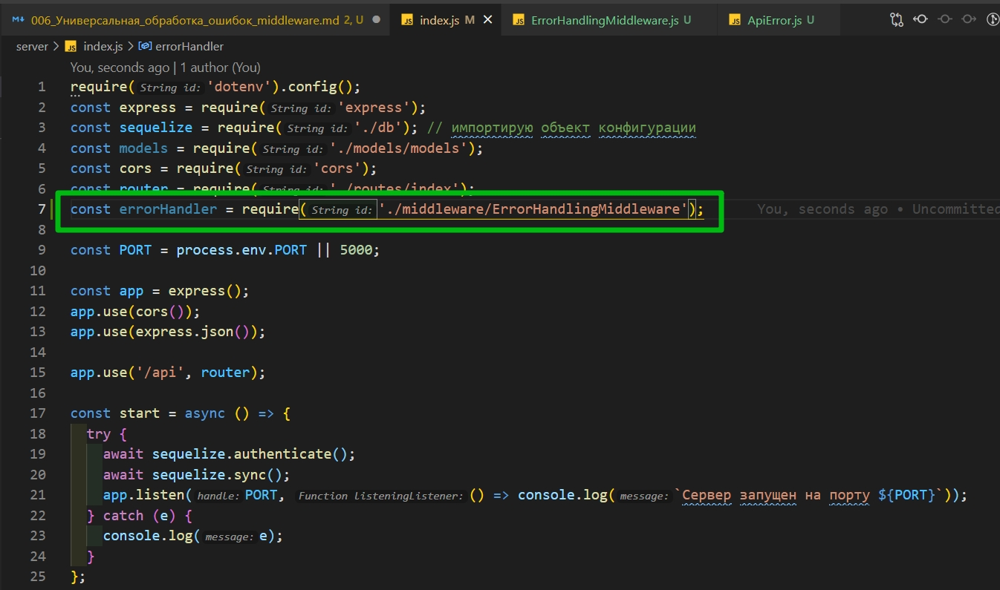
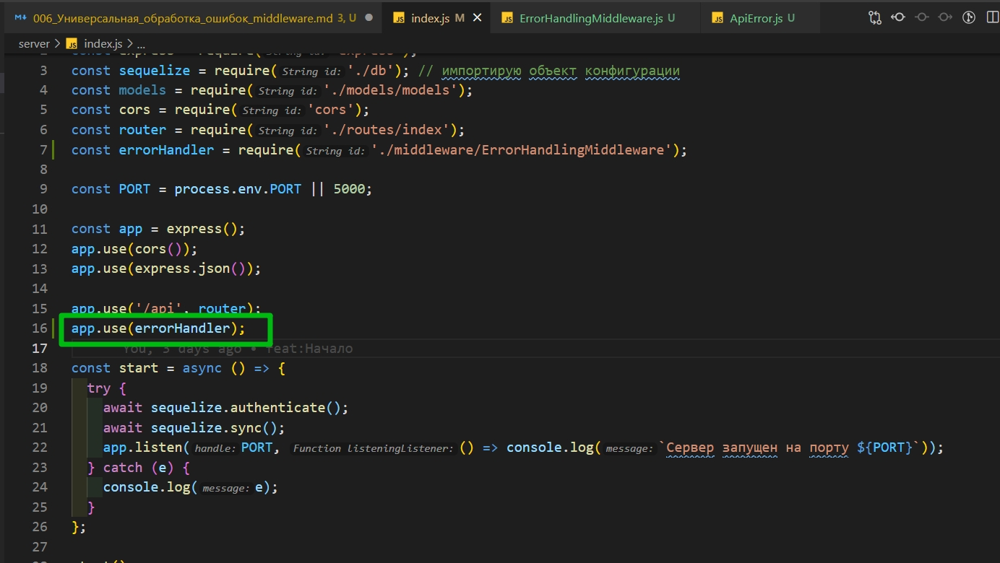
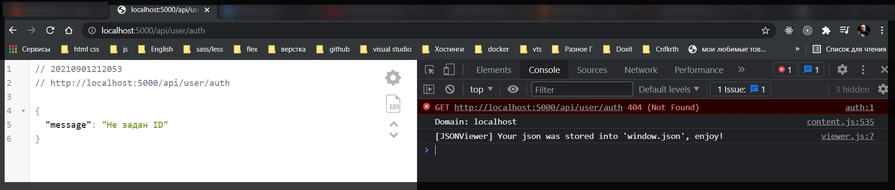
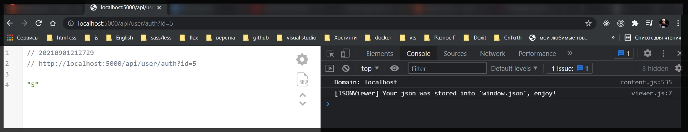

# Универсальная обработка ошибок middleware

Создаю папку **error** и в ней создаю файл **ApiError.js**.

Это будет опять же класс. В классе реализовываю конструктор. Конструктор параметрами будет принимать статус код и сообщение которое мы будем возвращать на клиент.

```js
// error ApiError

class ApiError extends Error {
  constructor(status, message) {
    super();
  }
}
module.exports = ApiError;
```

Класс будет расширять **Error**. Вызываю родительский класс с помощью функции **super()**. И здесь присваиваю то что получаю параметрами.

```js
// error ApiError

class ApiError extends Error {
  constructor(status, message) {
    super();
    this.status = status;
    this.message = message;
  }
}
module.exports = ApiError;
```

Теперь создадим пару статичных функций т.е. **static**. Статические функции это функции которые можно вызывать без создания объекта т.е. мы можем обращаться напрямую к классу и вызывать ту или иную функцию. Первая функция будет называться **badRequest**. Параметрами она принимает message. В теле возвращаю **new ApiError**. первым параметром передаю статус **404** а вторым сообщение которое будем получать.

```js
// error ApiError

class ApiError extends Error {
  constructor(status, message) {
    super();
    this.status = status;
    this.message = message;
  }
  static badRequest(message) {
    return new ApiError(404, message);
  }
}
module.exports = ApiError;
```

Таким образом можно создать несколько функций под разные **status** коды. Создадим еще под **500**. Функцию назовем **internal**.

```js
// error ApiError

class ApiError extends Error {
  constructor(status, message) {
    super();
    this.status = status;
    this.message = message;
  }

  static badRequest(message) {
    return new ApiError(404, message);
  }

  static internal(message) {
    return new ApiError(500, message);
  }
}
module.exports = ApiError;
```

Например можно сделать еще функцию **forbidden**. Она говорит о том что доступа нет. Статус код будем возвращать **403**.

```js
// error ApiError

class ApiError extends Error {
  constructor(status, message) {
    super();
    this.status = status;
    this.message = message;
  }

  static badRequest(message) {
    return new ApiError(404, message);
  }

  static internal(message) {
    return new ApiError(500, message);
  }

  static forbidden(message) {
    return new ApiError(403, message);
  }
}

module.exports = ApiError;
```

На на этом с классо ошибки мы закончили.

И следующим этапом создадим наш первый **middleware**.

Создаю папку **middleware**. В ней **ErrorHandlingMiddleware.js**. Сюда импортирую тот класс который мы только то сделали.

```js
// middleware ErrorHandlingMiddleware.js
const ApiError = require('../error/ApiError');
```

И из самого файла экспортируем функцию. По сути функция в данном случае и есть **middleware**.

```js
// middleware ErrorHandlingMiddleware.js
const ApiError = require('../error/ApiError');

module.exports = function (err, req, res, next) {};
```

Она должна принимать следующие параметры.

- **err** - ошибка
- **req** - запрос
- **res**- ответ
- и функция **next** вызвав которую мы передадим управление следующему в цепочке middleware.

В теле функции в условии проверим если класс ошибки т.е. **err [instanceof](https://learn.javascript.ru/instanceof) ApiError**. То тогда на клиен возвращаем ответ со статус кодом который будем получать из ошибки **res.status(err.status).json({message:err.message})**.

```js
// middleware ErrorHandlingMiddleware.js
const ApiError = require('../error/ApiError');

module.exports = function (err, req, res, next) {
  if (err instanceof ApiError) {
    return res.status(err.status).json({ message: err.message });
  }
};
```

Что бы функция на этом завершилась не забываем про **return**.

И если есть такая ситуация что сюда попала ошибка которая не является инстансом **ApiError**, то тогда вернем **500** ошибку. И в сообщении укажем что ошибка была не предвиденной. Т.е. мы ее никак не обработали.

```js
// middleware ErrorHandlingMiddleware.js
const ApiError = require('../error/ApiError');

module.exports = function (err, req, res, next) {
  if (err instanceof ApiError) {
    return res.status(err.status).json({ message: err.message });
  } else {
    return res.status(500).json({ message: 'Непредвиденная ошибка' });
  }
};
```

Следующим этапом перейдем в **index.js** где этот **middleware** необходимо зарегистрировать.



И еще важный момент. **Middleware** который работает с ошибками обязательно должен регистрироваться в самом конце.



```js
require('dotenv').config();
const express = require('express');
const sequelize = require('./db'); // импортирую объект конфигурации
const models = require('./models/models');
const cors = require('cors');
const router = require('./routes/index');
const errorHandler = require('./middleware/ErrorHandlingMiddleware');

const PORT = process.env.PORT || 5000;

const app = express();
app.use(cors());
app.use(express.json());

app.use('/api', router);

//Обработка ошибок, последний middleware
app.use(errorHandler);

const start = async () => {
  try {
    await sequelize.authenticate();
    await sequelize.sync();
    app.listen(PORT, () => console.log(`Сервер запущен на порту ${PORT}`));
  } catch (e) {
    console.log(e);
  }
};

start();
```

так как этот **middleware** является замыкающим. Именно по этой причине мы внутри него нигде не вызвали функцию **next**, поскольку на нем работа **middleware** прекращается.

Открываю **userController.js** и в функции **check** проверяю. Если пользователь **id** не указал, то тогда вызываю функцию **next** которая идет третьим параметром. Туда передадим одну из функций которая есть у класса **ApiError**.

```js
// controller userController.js

const ApiError = require('../error/ApiError');
class UserController {
  async registration(req, res) {}

  async login(req, res) {}

  async check(req, res, next) {
    const { id } = req.query;
    if (!id) {
      return next(ApiError.badRequest('Не задан ID'));
    }
    res.json(id);
  }
}

module.exports = new UserController();
```



Если я передаю id.


