# Получение устройств фильтрация пагинация постраничный вывод

Возвращаемся к **deviceController** и реализуем функцию для получения всех **devices** т.е. функцию **getAll**. Здесь логика будет несколько сложнее чем в предыдущих реализациях получения. Здесь мы будем так же принимать **brandId** и **typeId**

И если они не указаны будет получать все **device**. В случае если хоть один из них указан будем делать некую фильтрацию. **brandId** и **typeId** будем получать из query т.е. из строки запроса.

Сделаем несколько проверок. Если нет **!brandId** и **!typeId** то тогда будем возвращать все **device**.

Если есть **brandId** и нет **!typeId**. Тогда будем делать фильтрацию только по **brandId**.

Далее обратная ситуация. Если нет **!brandId** и есть **typeId**, то делаем фильтрацию по типу.

И вариант когда оба из них указаны.

И затем на выходе из функции будем возвращать массив этих **devices**.

```js
// controllers deviceController.js
const uuid = require('uuid');
const path = require('path');
const ApiError = require('../error/ApiError');

const { Device } = require('../models/models');

class DeviceController {
  async create(req, res, next) {
    try {
      const { name, price, brandId, typeId, info } = req.body;
      const { img } = req.files;
      let fileName = uuid.v4() + '.jpg';
      img.mv(path.resolve(__dirname, '..', 'static', fileName));

      const device = await Device.create({
        name,
        price,
        brandId,
        typeId,
        img: fileName,
      });

      return res.json(device);
    } catch (error) {
      next(ApiError.badRequest(error.message));
    }
  }

  async getAll(req, res) {
    let { brandId, typeId } = req.query;
    let devices;

    // если brandId и typeId не указаны возвращаю все devices
    if (!brandId && !typeId) {
    }

    //Фильтрация по brandId
    if (brandId && !typeId) {
    }
    // Фильтрация по typeId
    if (!brandId && typeId) {
    }

    //Фильтрация по typeId и по typeId
    if (brandId && typeId) {
    }
    // возвращаю массив девайсов
    return res.json(devices);
  }

  async getOne(req, res) {}
}

module.exports = new DeviceController();
```

Следующим этапом пишу запрос к БД.

далее в Фильтрация по **brandId** прописываю все тоже самое **devices = await Device.findAll()**. В **findAll** параметром передаю объект, указываю поле **where:** это будет так же объект в котором мы указываем поля по которым необходимо искать. **where:{ brandId}**

```js
// controllers deviceController.js
const uuid = require('uuid');
const path = require('path');
const ApiError = require('../error/ApiError');

const { Device } = require('../models/models');

class DeviceController {
  async create(req, res, next) {
    try {
      const { name, price, brandId, typeId, info } = req.body;
      const { img } = req.files;
      let fileName = uuid.v4() + '.jpg';
      img.mv(path.resolve(__dirname, '..', 'static', fileName));

      const device = await Device.create({
        name,
        price,
        brandId,
        typeId,
        img: fileName,
      });

      return res.json(device);
    } catch (error) {
      next(ApiError.badRequest(error.message));
    }
  }

  async getAll(req, res) {
    let { brandId, typeId } = req.query;
    let devices;

    // если brandId и typeId не указаны возвращаю все devices
    if (!brandId && !typeId) {
      devices = await Device.findAll();
    }

    //Фильтрация по brandId
    if (brandId && !typeId) {
      devices = await Device.findAll({ where: { brandId } });
    }
    // Фильтрация по typeId
    if (!brandId && typeId) {
      devices = await Device.findAll({ where: { typeId } });
    }

    //Фильтрация по typeId и по typeId
    if (brandId && typeId) {
      devices = await Device.findAll({ where: { brandId, typeId } });
    }
    // возвращаю массив девайсов
    return res.json(devices);
  }

  async getOne(req, res) {}
}

module.exports = new DeviceController();
```

C БД нам вернутся только те объекты у которых **typeId** или **brandId** заданы. В последнем условии передаю оба параметра. Т.е. и **typeId** и **brandId** должен совпадать.

Давайте попробуем это дело протестировать. Но для начало подобавляю объекты с разными типами.

И так так как я несколько раз удалял БД то я заново дабавляю **type**

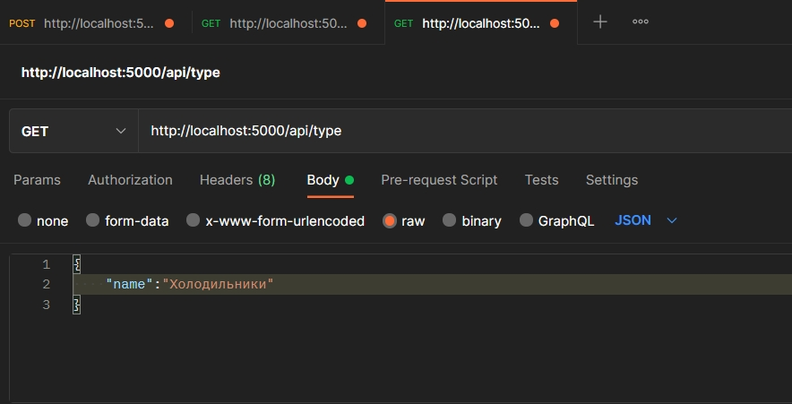

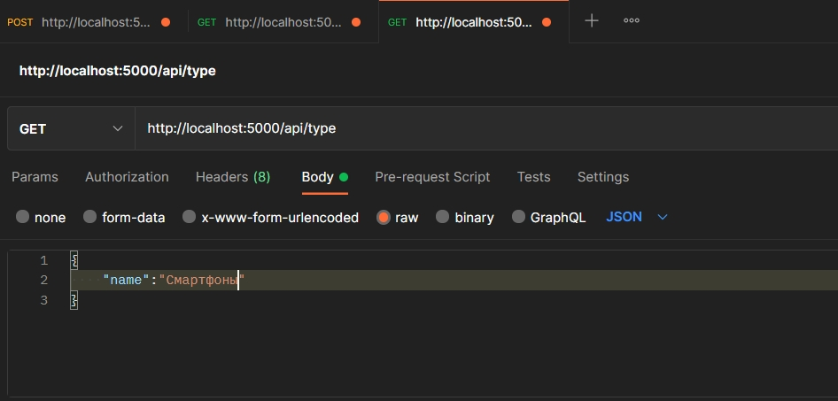

Теперь получаю их.

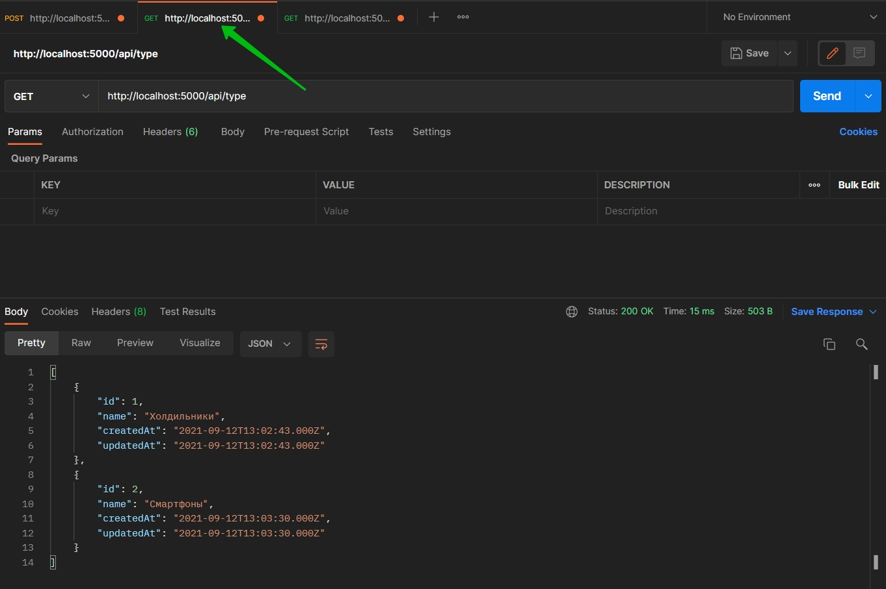

Далее в **brand** добавляю

Далее добавляю **device**. Здесь тель уже будет не как **JSON** строка а как **form-data** поскольку я прикрепляю файл.

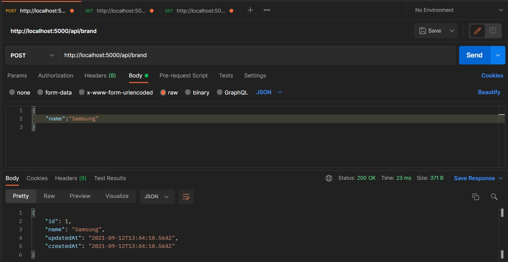

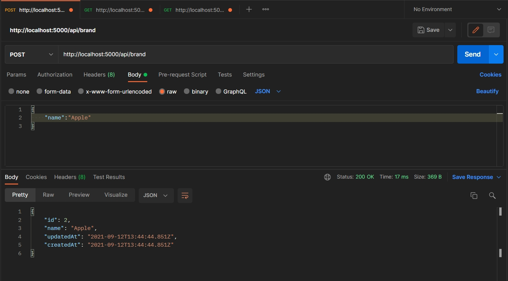

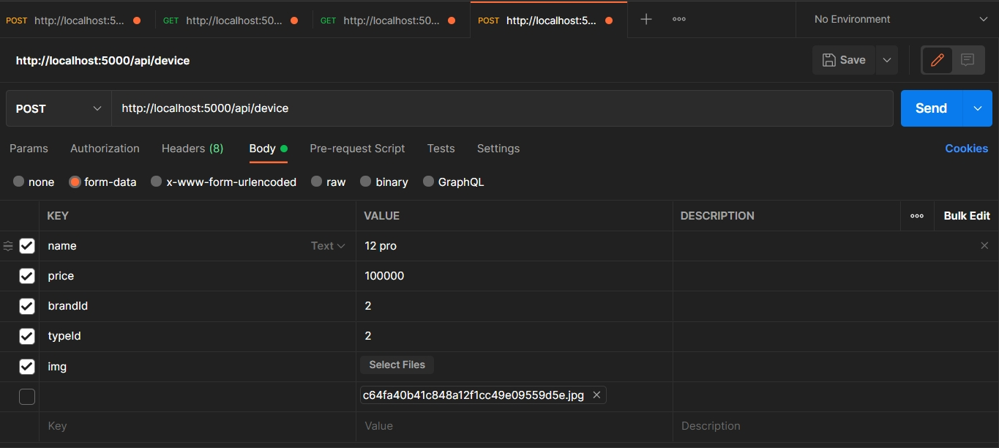

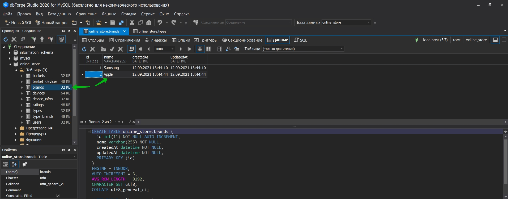

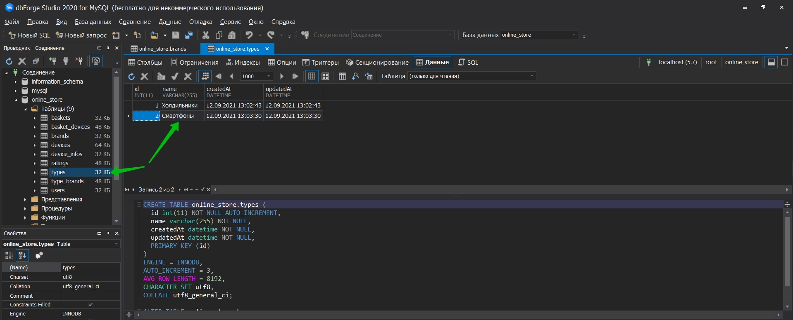

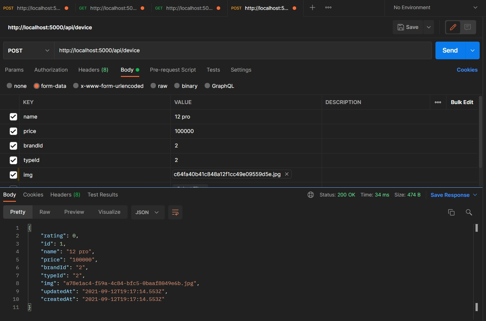

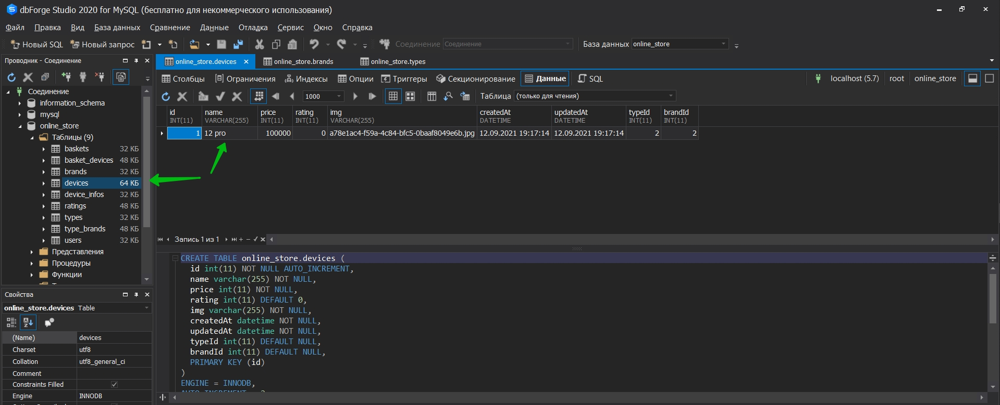

Теперь после написания условий получения девайсов а именно:

```js
// controllers deviceController.js
const uuid = require('uuid');
const path = require('path');
const ApiError = require('../error/ApiError');

const { Device } = require('../models/models');

class DeviceController {
  async create(req, res, next) {
    try {
      const { name, price, brandId, typeId, info } = req.body;
      const { img } = req.files;
      let fileName = uuid.v4() + '.jpg';
      img.mv(path.resolve(__dirname, '..', 'static', fileName));

      const device = await Device.create({
        name,
        price,
        brandId,
        typeId,
        img: fileName,
      });

      return res.json(device);
    } catch (error) {
      next(ApiError.badRequest(error.message));
    }
  }

  async getAll(req, res) {
    let { brandId, typeId } = req.query;
    let devices;

    // если brandId и typeId не указаны возвращаю все devices
    if (!brandId && !typeId) {
      devices = await Device.findAll();
    }

    //Фильтрация по brandId
    if (brandId && !typeId) {
      devices = await Device.findAll({ where: { brandId } });
    }
    // Фильтрация по typeId
    if (!brandId && typeId) {
      devices = await Device.findAll({ where: { typeId } });
    }

    //Фильтрация по typeId и по typeId
    if (brandId && typeId) {
      devices = await Device.findAll({ where: { brandId, typeId } });
    }
    // возвращаю массив девайсов
    return res.json(devices);
  }

  async getOne(req, res) {}
}

module.exports = new DeviceController();
```

Теперь тестирую получение девайсов.

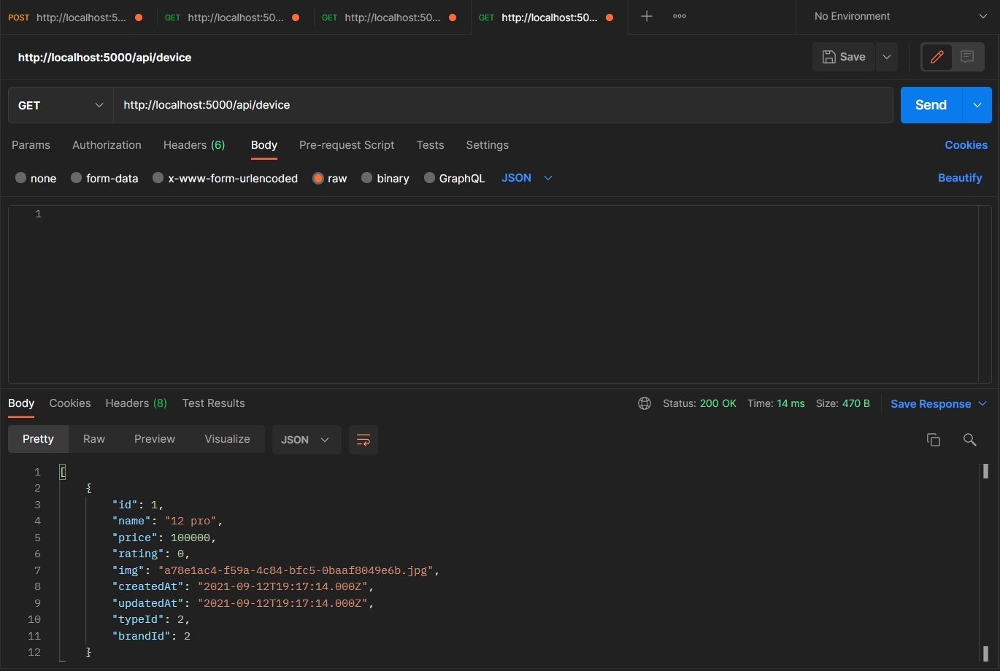

Но на данный момент он один и особо не потестируешь.

Добавляю объекты с разными типами.

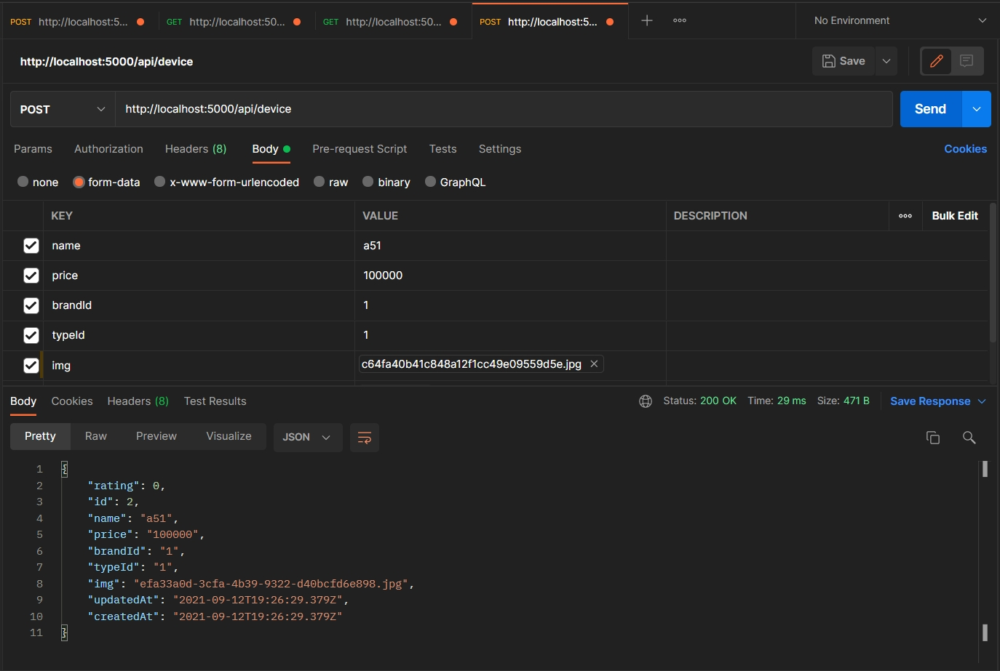

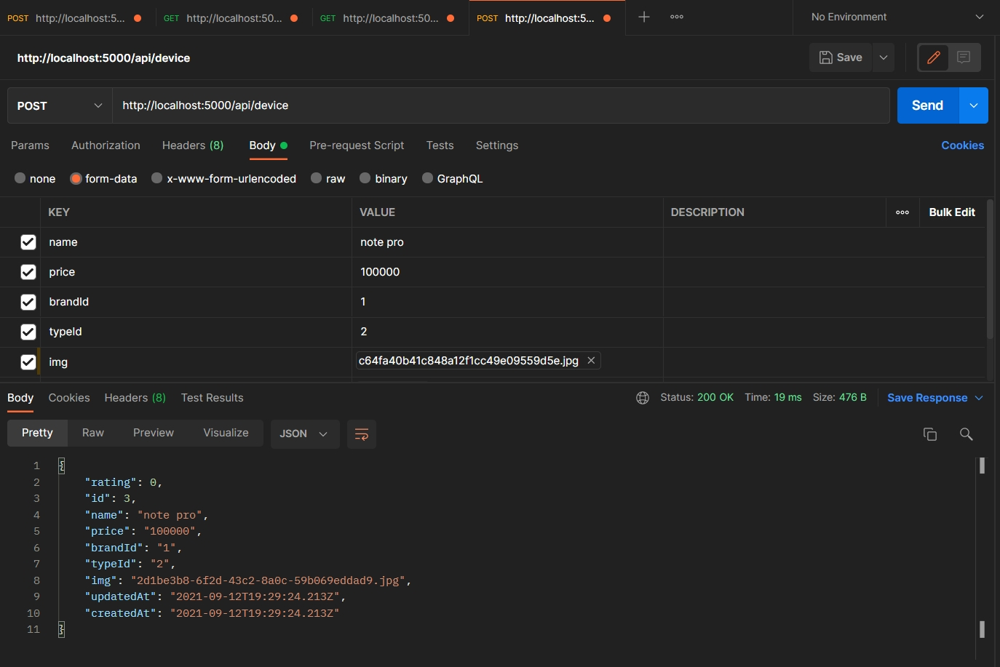


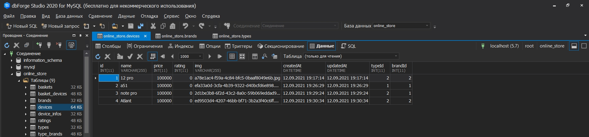

Теперь в БД есть 4-ре объекта. И в запроесе без параметров получаем все **device**. Но попробуем указать **brandId : 1**.

И теперь я получаю все девайсы у которых **brandId** равен заданному.

В запросе без параметров указываю **brandId 1**.

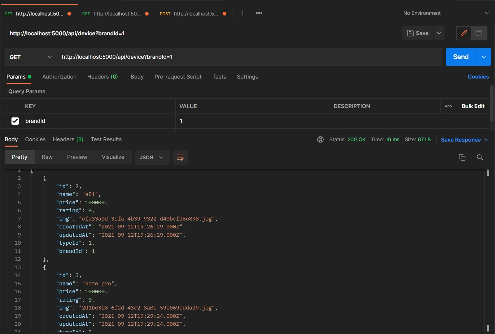

<br/>
<br/>
<br/>

Получаю **brand**

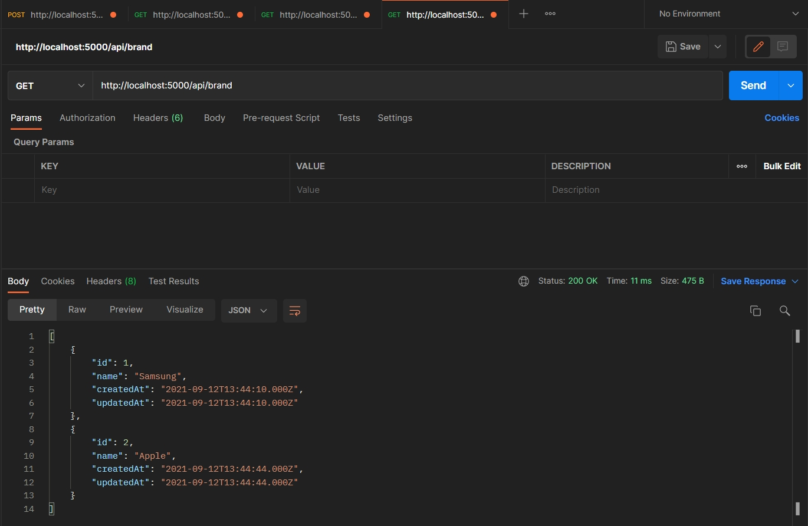

Если типов и брендов относительно не большое количество и какой-то постраничный вывод делать не разумно, то устройств может быть тысячи, сотни. И отображать все на одной странице по крайней мере не разумно.

По этому еще сделаем и постраничный вывод. К **req.query** добавим еще два параметра текущая страница **page** и **limit**.

```js
// controllers deviceController.js
const uuid = require('uuid');
const path = require('path');
const ApiError = require('../error/ApiError');

const { Device } = require('../models/models');

class DeviceController {
  async create(req, res, next) {
    try {
      const { name, price, brandId, typeId, info } = req.body;
      const { img } = req.files;
      let fileName = uuid.v4() + '.jpg';
      img.mv(path.resolve(__dirname, '..', 'static', fileName));

      const device = await Device.create({
        name,
        price,
        brandId,
        typeId,
        img: fileName,
      });

      return res.json(device);
    } catch (error) {
      next(ApiError.badRequest(error.message));
    }
  }

  async getAll(req, res) {
    let { brandId, typeId, limit, page } = req.query;
    let devices;

    // если brandId и typeId не указаны возвращаю все devices
    if (!brandId && !typeId) {
      devices = await Device.findAll();
    }

    //Фильтрация по brandId
    if (brandId && !typeId) {
      devices = await Device.findAll({ where: { brandId } });
    }
    // Фильтрация по typeId
    if (!brandId && typeId) {
      devices = await Device.findAll({ where: { typeId } });
    }

    //Фильтрация по typeId и по typeId
    if (brandId && typeId) {
      devices = await Device.findAll({ where: { brandId, typeId } });
    }
    // возвращаю массив девайсов
    return res.json(devices);
  }

  async getOne(req, res) {}
}

module.exports = new DeviceController();
```

**limit** это количество девайсов которые будут отображаться на одной странице. Сразу же задам **default** значения.

```js
// controllers deviceController.js
const uuid = require('uuid');
const path = require('path');
const ApiError = require('../error/ApiError');

const { Device } = require('../models/models');

class DeviceController {
  async create(req, res, next) {
    try {
      const { name, price, brandId, typeId, info } = req.body;
      const { img } = req.files;
      let fileName = uuid.v4() + '.jpg';
      img.mv(path.resolve(__dirname, '..', 'static', fileName));

      const device = await Device.create({
        name,
        price,
        brandId,
        typeId,
        img: fileName,
      });

      return res.json(device);
    } catch (error) {
      next(ApiError.badRequest(error.message));
    }
  }

  async getAll(req, res) {
    let { brandId, typeId, limit, page } = req.query;
    page = page || 1; // если страница не указана делаю ее первой
    limit = limit || 9; // Если лимит не указан то буду отправлять по 9-ть устройств на страницу.
    let devices;

    // если brandId и typeId не указаны возвращаю все devices
    if (!brandId && !typeId) {
      devices = await Device.findAll();
    }

    //Фильтрация по brandId
    if (brandId && !typeId) {
      devices = await Device.findAll({ where: { brandId } });
    }
    // Фильтрация по typeId
    if (!brandId && typeId) {
      devices = await Device.findAll({ where: { typeId } });
    }

    //Фильтрация по typeId и по typeId
    if (brandId && typeId) {
      devices = await Device.findAll({ where: { brandId, typeId } });
    }
    // возвращаю массив девайсов
    return res.json(devices);
  }

  async getOne(req, res) {}
}

module.exports = new DeviceController();
```

теперь посчитаю отступ. Допустим перешли на вторую страницу и первых девять товаров нам надо пропустить. В переменной **let ofset = page _ limit - limit. Т.е. page = 2 _ 9 - 9** т.е. отступ получается в 9-ть товаров.

```js
// controllers deviceController.js
const uuid = require('uuid');
const path = require('path');
const ApiError = require('../error/ApiError');

const { Device } = require('../models/models');

class DeviceController {
  async create(req, res, next) {
    try {
      const { name, price, brandId, typeId, info } = req.body;
      const { img } = req.files;
      let fileName = uuid.v4() + '.jpg';
      img.mv(path.resolve(__dirname, '..', 'static', fileName));

      const device = await Device.create({
        name,
        price,
        brandId,
        typeId,
        img: fileName,
      });

      return res.json(device);
    } catch (error) {
      next(ApiError.badRequest(error.message));
    }
  }

  async getAll(req, res) {
    let { brandId, typeId, limit, page } = req.query;
    page = page || 1; // если страница не указана делаю ее первой
    limit = limit || 9; // Если лимит не указан то буду отправлять по 9-ть устройств на страницу.
    let offset = page * limit - limit;
    let devices;

    // если brandId и typeId не указаны возвращаю все devices
    if (!brandId && !typeId) {
      devices = await Device.findAll();
    }

    //Фильтрация по brandId
    if (brandId && !typeId) {
      devices = await Device.findAll({ where: { brandId } });
    }
    // Фильтрация по typeId
    if (!brandId && typeId) {
      devices = await Device.findAll({ where: { typeId } });
    }

    //Фильтрация по brandId и по typeId
    if (brandId && typeId) {
      devices = await Device.findAll({ where: { brandId, typeId } });
    }
    // возвращаю массив девайсов
    return res.json(devices);
  }

  async getOne(req, res) {}
}

module.exports = new DeviceController();
```

Каждый запрос у нас принимает объект опций где мы указывали **where**. Здесь так же параметрами передаем **limit** и **offset**.

```js
// controllers deviceController.js
const uuid = require('uuid');
const path = require('path');
const ApiError = require('../error/ApiError');

const { Device } = require('../models/models');

class DeviceController {
  async create(req, res, next) {
    try {
      const { name, price, brandId, typeId, info } = req.body;
      const { img } = req.files;
      let fileName = uuid.v4() + '.jpg';
      img.mv(path.resolve(__dirname, '..', 'static', fileName));

      const device = await Device.create({
        name,
        price,
        brandId,
        typeId,
        img: fileName,
      });

      return res.json(device);
    } catch (error) {
      next(ApiError.badRequest(error.message));
    }
  }

  async getAll(req, res) {
    let { brandId, typeId, limit, page } = req.query;
    page = page || 1; // если страница не указана делаю ее первой
    limit = limit || 9; // Если лимит не указан то буду отправлять по 9-ть устройств на страницу.
    let offset = page * limit - limit;
    let devices;

    // если brandId и typeId не указаны возвращаю все devices
    if (!brandId && !typeId) {
      devices = await Device.findAll({ limit, offset });
    }

    //Фильтрация по brandId
    if (brandId && !typeId) {
      devices = await Device.findAll({ where: { brandId }, limit, offset });
    }
    // Фильтрация по typeId
    if (!brandId && typeId) {
      devices = await Device.findAll({ where: { typeId }, limit, offset });
    }

    //Фильтрация по typeId и по typeId
    if (brandId && typeId) {
      devices = await Device.findAll({
        where: { brandId, typeId },
        limit,
        offset,
      });
    }
    // возвращаю массив девайсов
    return res.json(devices);
  }

  async getOne(req, res) {}
}

module.exports = new DeviceController();
```

**В let { brandId, typeId, limit, page } = req.query; У меня вместо let было const**

Теперь в **params** попробуем указать **limit 2**.

И так у меня вознакала вот такая ошибка в **POSTMAN**.

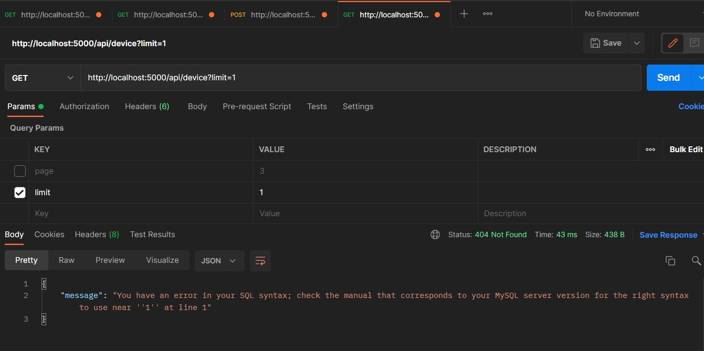

Это все происходит потому что со строки **url**, в запрашиваемых **GET** парамерах, я получаю строку, а не число.

Полученный **GET** параметр преобразую в число **Number(limit)**.

```js
// controllers deviceController.js
const uuid = require('uuid');
const path = require('path');
const ApiError = require('../error/ApiError');

const { Device } = require('../models/models');

class DeviceController {
  async create(req, res, next) {
    try {
      const { name, price, brandId, typeId, info } = req.body;
      const { img } = req.files;
      let fileName = uuid.v4() + '.jpg';
      img.mv(path.resolve(__dirname, '..', 'static', fileName));

      const device = await Device.create({
        name,
        price,
        brandId,
        typeId,
        img: fileName,
      });
      return res.json(device);
    } catch (error) {
      next(ApiError.badRequest(error.message));
    }
  }

  async getAll(req, res, next) {
    let { brandId, typeId, page, limit } = req.query;

    page = page || 1;
    limit = Number(limit) || 9; // Для того что бы нормально отработало переведи в Number
    let offset = page * limit - limit;
    let devices;
    console.log('page', typeof page);
    console.log('limit', typeof limit);

    try {
      // если brandId и typeId не указаны возвращаю все devices
      if (!brandId && !typeId) {
        devices = await Device.findAll({ limit, offset });
      }

      //Фильтрация по brandId
      if (brandId && !typeId) {
        devices = await Device.findAll({ where: { brandId }, limit, offset });
      }
      // Фильтрация по typeId
      if (!brandId && typeId) {
        devices = await Device.findAll({ where: { typeId }, limit, offset });
      }

      //Фильтрация по typeId и по typeId
      if (brandId && typeId) {
        devices = await Device.findAll({
          where: { brandId, typeId },
          limit,
          offset,
        });
      }
      // возвращаю массив девайсов
      return res.json(devices);
    } catch (error) {
      next(ApiError.badRequest(error.message));
    }
  }

  async getOne(req, res) {}
}

module.exports = new DeviceController();
```

Как видим на скриншоте на каждой странице должно выводиться по одному товару.

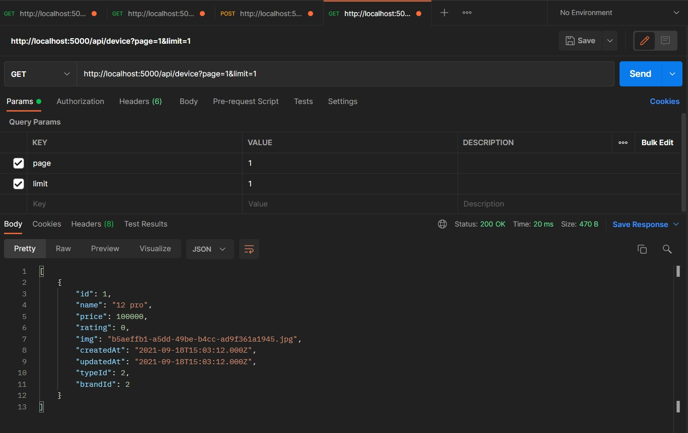

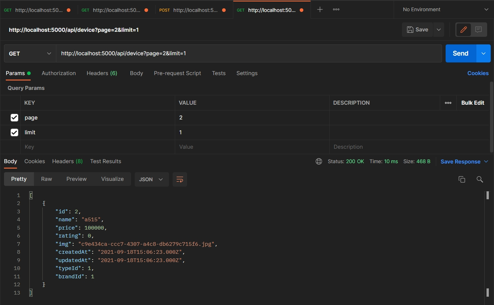

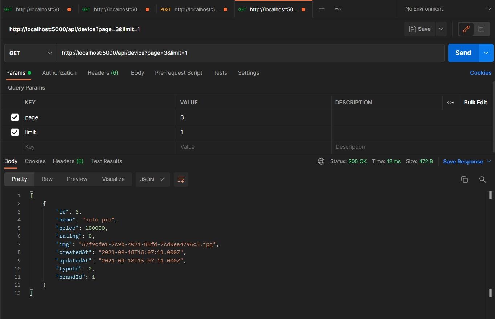

Но что бы посчитать количество товаров на **frontend** нам нужно знать общее количество товаров. Поэтому вместо функции **findAll** я использую функцию **findAndCountAll**. Общее количество товаром вернется нам по заданному **findAndCountAll** запросу. Эта функция **findAndCountAll** предназначена для пагинации

```js
// controllers deviceController.js
const uuid = require('uuid');
const path = require('path');
const ApiError = require('../error/ApiError');

const { Device } = require('../models/models');

class DeviceController {
  async create(req, res, next) {
    try {
      const { name, price, brandId, typeId, info } = req.body;
      const { img } = req.files;
      let fileName = uuid.v4() + '.jpg';
      img.mv(path.resolve(__dirname, '..', 'static', fileName));

      const device = await Device.create({
        name,
        price,
        brandId,
        typeId,
        img: fileName,
      });
      return res.json(device);
    } catch (error) {
      next(ApiError.badRequest(error.message));
    }
  }

  async getAll(req, res, next) {
    let { brandId, typeId, page, limit } = req.query;

    page = page || 1;
    limit = Number(limit) || 9; // Для того что бы нормально отработало переведи в Number
    let offset = page * limit - limit;
    let devices;

    try {
      // если brandId и typeId не указаны возвращаю все devices
      if (!brandId && !typeId) {
        devices = await Device.findAndCountAll({ limit, offset });
      }

      //Фильтрация по brandId
      if (brandId && !typeId) {
        devices = await Device.findAndCountAll({
          where: { brandId },
          limit,
          offset,
        });
      }
      // Фильтрация по typeId
      if (!brandId && typeId) {
        devices = await Device.findAndCountAll({
          where: { typeId },
          limit,
          offset,
        });
      }

      //Фильтрация по typeId и по typeId
      if (brandId && typeId) {
        devices = await Device.findAndCountAll({
          where: { brandId, typeId },
          limit,
          offset,
        });
      }
      // возвращаю массив девайсов
      return res.json(devices);
    } catch (error) {
      next(ApiError.badRequest(error.message));
    }
  }

  async getOne(req, res) {}
}

module.exports = new DeviceController();
```

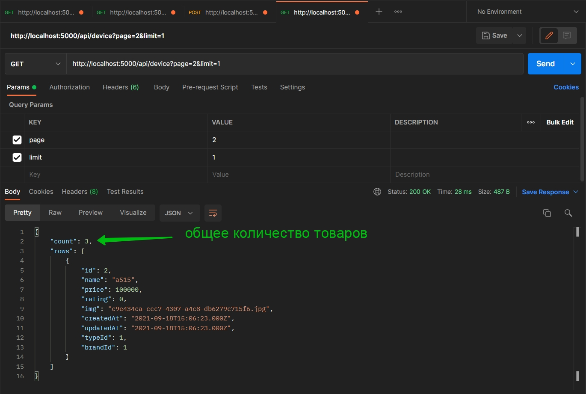

И так двигаемся дальше. И так в функции **create** я оставил без внимания массив **info**.

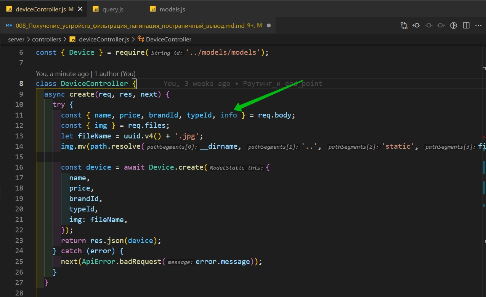

Это та самая модель **DeviceInfo**. Обращаюсь к связи **Device** один ко многим. Вторым параметром в объекте я могу указать название поля которое будет у массива характеристик. И назову его просто как **'info'**.

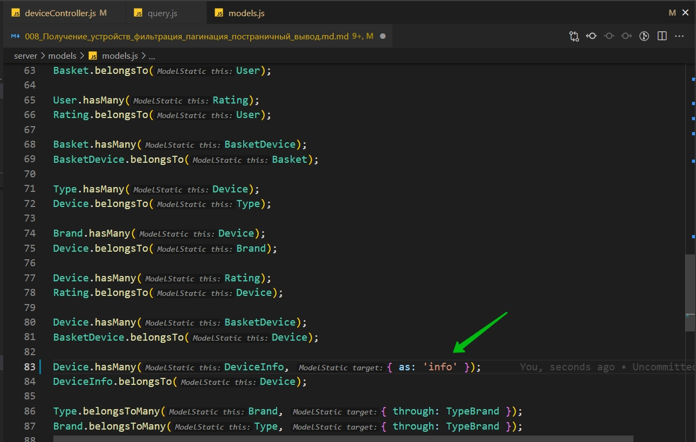

```js
// models models.js
const sequelize = require('../db');
const { DataTypes, STRING } = require('sequelize');

//Модель пользователя
const User = sequelize.define('user', {
  id: { type: DataTypes.INTEGER, primaryKey: true, autoIncrement: true },
  email: { type: DataTypes.STRING, unique: true },
  password: { type: DataTypes.STRING },
  role: { type: DataTypes.STRING, defaultValue: 'USER' },
});

//Модель Корзины
const Basket = sequelize.define('basket', {
  id: { type: DataTypes.INTEGER, primaryKey: true, autoIncrement: true },
});

// девайса в корзине
const BasketDevice = sequelize.define('basket_device', {
  id: { type: DataTypes.INTEGER, primaryKey: true, autoIncrement: true },
});

// Модель Device
const Device = sequelize.define('device', {
  id: { type: DataTypes.INTEGER, primaryKey: true, autoIncrement: true },
  name: { type: DataTypes.STRING, unique: true, allowNull: false },
  price: { type: DataTypes.INTEGER, allowNull: false },
  rating: { type: DataTypes.INTEGER, defaultValue: 0 },
  img: { type: DataTypes.STRING, allowNull: false },
});

//Модель Type
const Type = sequelize.define('type', {
  id: { type: DataTypes.INTEGER, primaryKey: true, autoIncrement: true },
  name: { type: DataTypes.STRING, unique: true, allowNull: false },
});

//Модель Type
const Brand = sequelize.define('brand', {
  id: { type: DataTypes.INTEGER, primaryKey: true, autoIncrement: true },
  name: { type: DataTypes.STRING, unique: true, allowNull: false },
});

//Модель Type
const Rating = sequelize.define('rating', {
  id: { type: DataTypes.INTEGER, primaryKey: true, autoIncrement: true },
  name: { type: DataTypes.STRING, allowNull: false },
});

//Модель DeviceInfo
const DeviceInfo = sequelize.define('device_info', {
  id: { type: DataTypes.INTEGER, primaryKey: true, autoIncrement: true },
  title: { type: DataTypes.STRING, allowNull: false },
  description: { type: DataTypes.STRING, allowNull: false },
});

//Модель связующей таблицы
const TypeBrand = sequelize.define('type_brand', {
  id: { type: DataTypes.INTEGER, primaryKey: true, autoIncrement: true },
});

User.hasOne(Basket);
Basket.belongsTo(User);

User.hasMany(Rating);
Rating.belongsTo(User);

Basket.hasMany(BasketDevice);
BasketDevice.belongsTo(Basket);

Type.hasMany(Device);
Device.belongsTo(Type);

Brand.hasMany(Device);
Device.belongsTo(Brand);

Device.hasMany(Rating);
Rating.belongsTo(Device);

Device.hasMany(BasketDevice);
BasketDevice.belongsTo(Device);

Device.hasMany(DeviceInfo, { as: 'info' });
DeviceInfo.belongsTo(Device);

Type.belongsToMany(Brand, { through: TypeBrand });
Brand.belongsToMany(Type, { through: TypeBrand });

module.exports = {
  User,
  Basket,
  BasketDevice,
  Device,
  Type,
  Brand,
  Rating,
  TypeBrand,
  DeviceInfo,
};
```

Теперь в **deviceController** так же импортирую **DeviceInfo**. И затем в функции **create** зададим условие проверки. Если **info**, т.е. если мы его передали в теле запроса.

Единственный момент это когда мы передаем данные через **form-data** они у нас приходят ввиде строки. Поэтому мы этот массив будем парсить **info = JSON.parse(info)**. На **frontend** в **JSON** строку, а на **backend** опять перегонять в **JS** объекты. Затем после того как мы распарсили объект с помощъю функции **forEach** пробегаемся и для каждого элемента массива **DeviceInfo** вызываем функцию **create**. **await** не ставим намеренно что бы не блокировать весь поток. В сам объект передаем заголовок **title**, **description**, и не забываем указать **deviceId**. **id** объекту присваивается после создания.

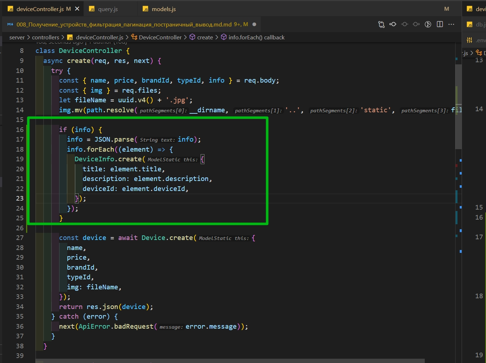

И теперь осталась одна функция это функция получения одного конкретного **device**. В первую очередь получаем **id** этого устройсва. Получаем его из **req.params**. Этот параметр мы указывали в **deviceRouter**.

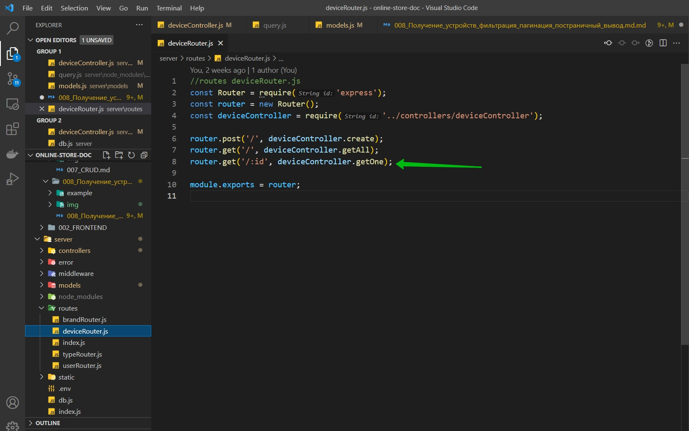

```js
//routes deviceRouter.js
const Router = require('express');
const router = new Router();
const deviceController = require('../controllers/deviceController');

router.post('/', deviceController.create);
router.get('/', deviceController.getAll);
router.get('/:id', deviceController.getOne);

module.exports = router;
```

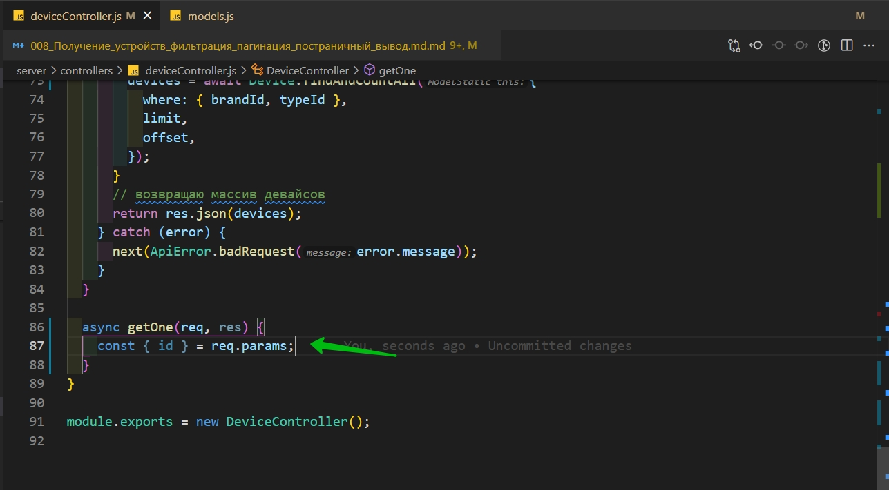

После того как в функции **getOne** отлавливаю **id**. Далее у модели **Device** вызываю функцию **findOne**. В нее передаем объект опций. Здесь указываем условие по которому необходимо этот **device** искать т.е. указываю **where** т.е. куда **: id**.

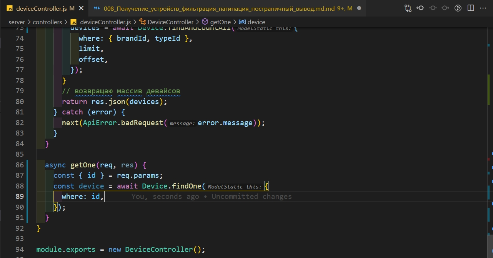

Но помимо самого устройства нам необходимо получить массив характеристик. Поскольку этот запрос будет отрабатывать тогда когда мы открываем страницу детального просмотра того или иного устройства. Поэтому характеристики по хорошему нам нужно подгрузить сразу. Для этого используется поле **include** т.е. включает. В массиве указываю объект, указваю какую модель я хочу подгрузить **model: deviceInfo** и название поля которое будет в этом объекте **as: 'info'**.

Остается отсюда на клиент этот **device** только вернуть **return res.json(device)**.

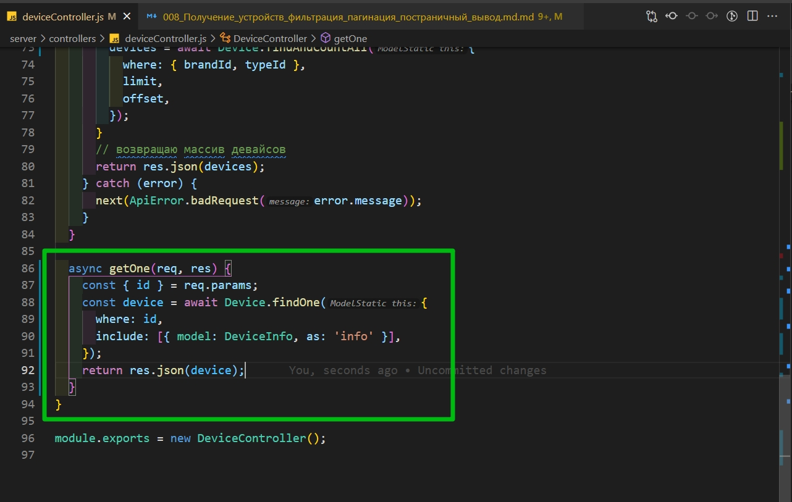

И пробую протестировать.

В **url** через слэш указываю **id device**.

И тут у меня такая же ситуевина

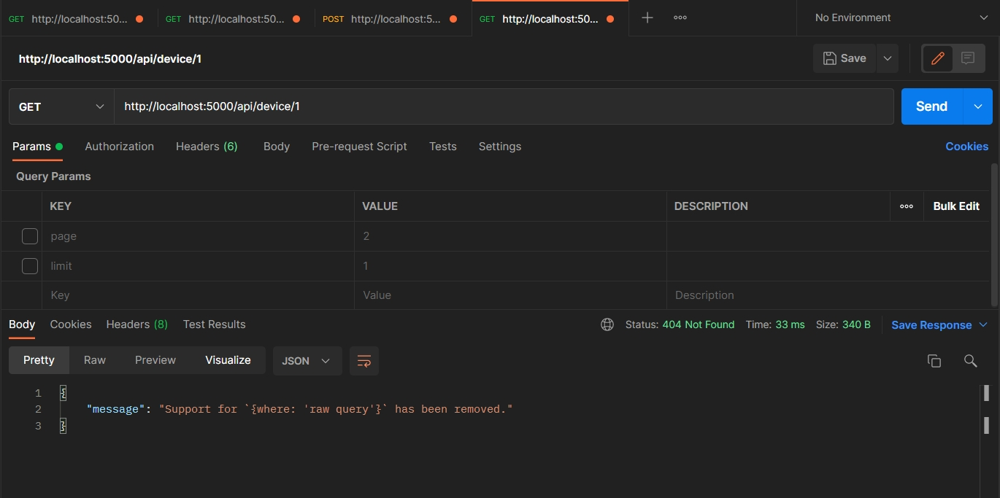

Т.е. **id** у меня прилетает как строка. И точто так же прогоняю **id** с помощью функции **Number(id)**.

```js
// controllers deviceController.js
const uuid = require('uuid');
const path = require('path');
const ApiError = require('../error/ApiError');

const { Device, DeviceInfo } = require('../models/models');

class DeviceController {
  async create(req, res, next) {
    try {
      const { name, price, brandId, typeId, info } = req.body;
      const { img } = req.files;
      let fileName = uuid.v4() + '.jpg';
      img.mv(path.resolve(__dirname, '..', 'static', fileName));

      if (info) {
        info = JSON.parse(info);
        info.forEach((element) => {
          DeviceInfo.create({
            title: element.title,
            description: element.description,
            deviceId: element.deviceId,
          });
        });
      }

      const device = await Device.create({
        name,
        price,
        brandId,
        typeId,
        img: fileName,
      });
      return res.json(device);
    } catch (error) {
      next(ApiError.badRequest(error.message));
    }
  }

  async getAll(req, res, next) {
    let { brandId, typeId, page, limit } = req.query;

    page = page || 1;
    limit = Number(limit) || 9; // Для того что бы нормально отработало переведи в Number
    let offset = page * limit - limit;
    let devices;

    try {
      // если brandId и typeId не указаны возвращаю все devices
      if (!brandId && !typeId) {
        devices = await Device.findAndCountAll({ limit, offset });
      }

      //Фильтрация по brandId
      if (brandId && !typeId) {
        devices = await Device.findAndCountAll({
          where: { brandId },
          limit,
          offset,
        });
      }
      // Фильтрация по typeId
      if (!brandId && typeId) {
        devices = await Device.findAndCountAll({
          where: { typeId },
          limit,
          offset,
        });
      }

      //Фильтрация по typeId и по typeId
      if (brandId && typeId) {
        devices = await Device.findAndCountAll({
          where: { brandId, typeId },
          limit,
          offset,
        });
      }
      // возвращаю массив девайсов
      return res.json(devices);
    } catch (error) {
      next(ApiError.badRequest(error.message));
    }
  }

  async getOne(req, res, next) {
    const { id } = req.params;
    try {
      const device = await Device.findOne({
        where: Number(id),
        include: [{ model: DeviceInfo, as: 'info' }],
      });
      return res.json(device);
    } catch (error) {
      next(ApiError.badRequest(error.message));
    }
  }
}

module.exports = new DeviceController();
```

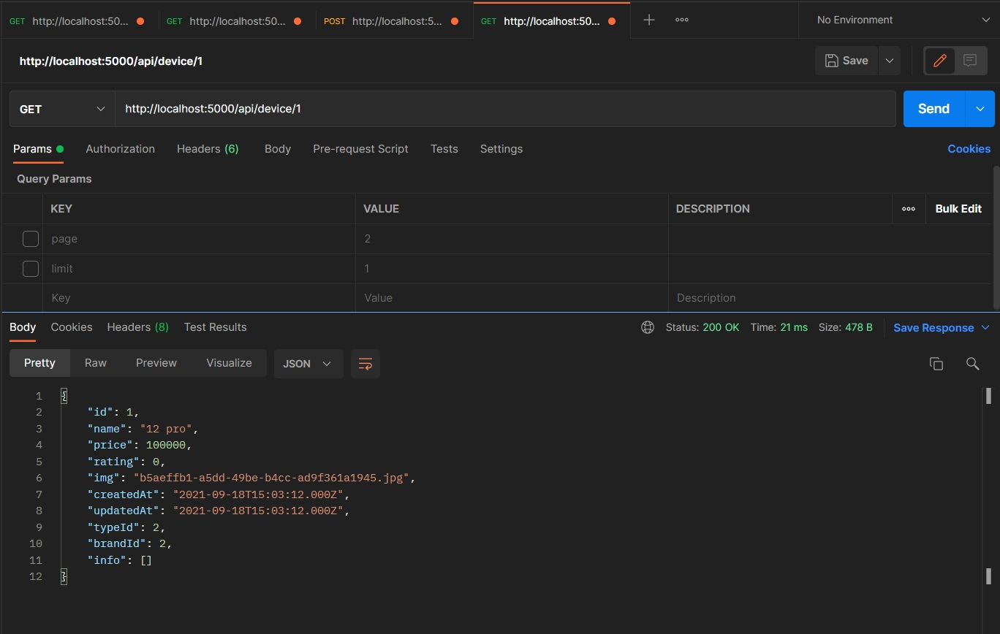

И как видите есть поле **info**. оно пустое потому что мы его не заполняли при создании.
