# Регистрация авторизация jwt токен bcrypt

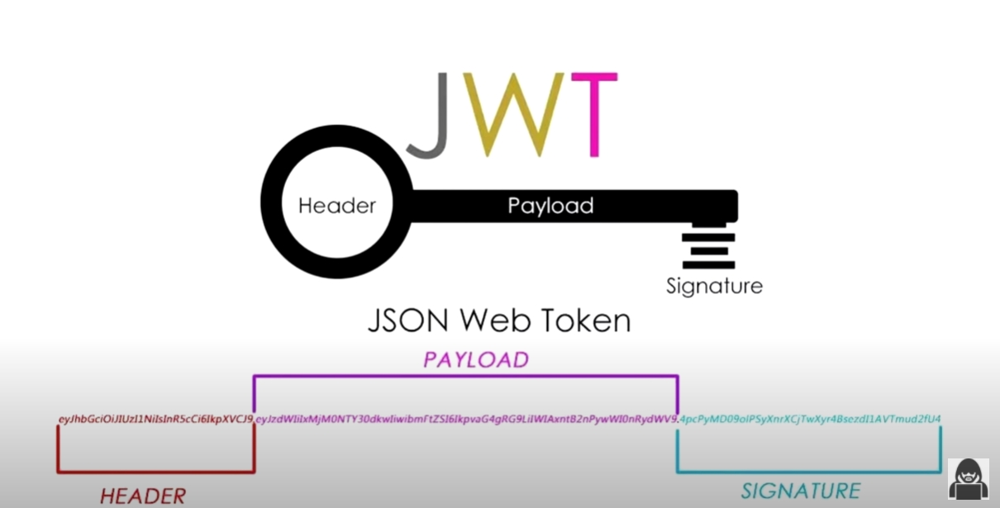

Авторизация будет происходить по **JWT** токену.

**JWT** токен или токен доступа - это простоя строка разделенная точками на три части. По большей части нас интересует центральная часть. Это **payload**. Туда мы будем прятать данные о пользователе. Это его **email**, **id**, и его роль.

После того как пользователь зарегистрировался для него генерируется подобный токен. И что тут важно понимать. Эти данные ни как не шифруются они в принципе ни какой секретной информации не несут. И мы на клиенте можем спокойно их рассшифровывать. Но проверить на то валиден токен или нет можно только с помощью секретного ключа который объявлен на сервере. Его уже по идее никто знать не должен.

В общем пользователь ввадит **email**, **password**. В первую очередь мы проверяем существует ли пользователь с таким **email** в системе. Если да, то сравниваем пароль который находится в БД с паролем который написал пользователь. Если эти пароли совпадают, мы генерируем **JWT** токен и отправляем его на клиент. После чего где-то на клиенте этот токен сохраняется. Любо в **cookies** или в **localStorage**.

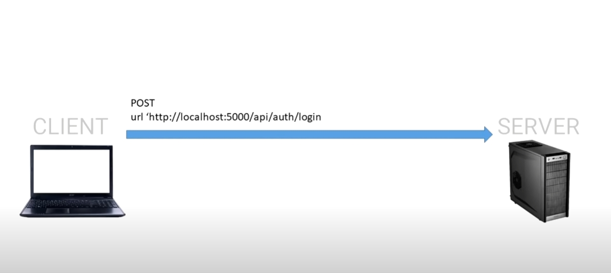

Затем этот токен прикрепляется к запросам где необходима авторизация. Допустим в корзину мы не можем зайти если мы не авторизованы.

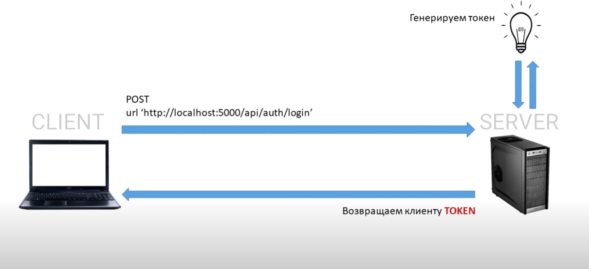

Мы авторизуемся. Сервер генерирует токен и возвращает его обратно на клиент.

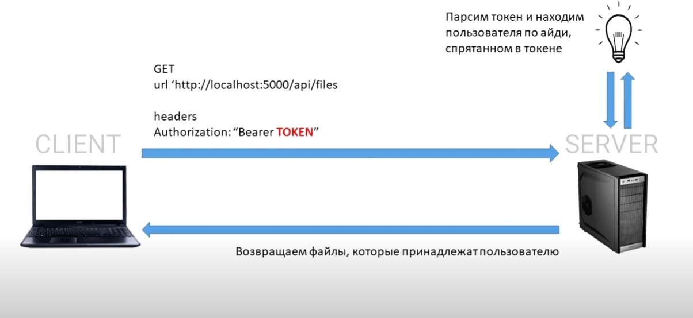

Затем мы нажимаем на кнопку Войти в корзину. И у нас отправляется запрос на получение товаров. К этому запросу в **headers** в **http** заголовки мы добавляем **Authorization** и туда помещаем тот самый токен. Который мы достаем опять же из cookies или же из **localStorage**.
Сервер валидирует этот токен по секретному ключу. И если он валидный, то пользователь попадает на страницу корзины и получает все товары которые у него там находяться.

В общем с помощью **JWT** токена обеспечивается доступ к той или иной функции.

<br/>
<br/>
<br/>

Теперь приступим к реализации.

Первое что мы сделаем это установим несколько модулей.

```shell
npm i jsonwebtoken bcrypt
```

- **jsonwebtoken** - для генерации webtoken
- **bcrypt** - для хэширования пароля и не хранить его в открытом виде в БД.

Теперь в **userController.js** импортирую **bcrypt**. Так же мне понадобяться модели **User**, **Busket**.

```js
// controller userController.js
const ApiError = require('../error/ApiError');
const bcrypt = require('bcrypt');
const { User, Basket } = require('../models/models');

class UserController {
  async registration(req, res) {}

  async login(req, res) {}

  async check(req, res, next) {
    const { id } = req.query;
    if (!id) {
      return next(ApiError.badRequest('Не задан ID'));
    }
    res.json(id);
  }
}

module.exports = new UserController();
```

<br/>
<br/>
<br/>

Начнем с **registration**.

Здесь в первую очередь из тела запроса получаем **email** и **password**. И как я уже говорил что роль у нас носит второстепенный характер, она нигде не задается. По этому мы ее будет принимать тоже в запросе. Просто что бы мы могли отдельно создавать пользователей, и отдельно создавать администратора.

```js
// controller userController.js
const ApiError = require('../error/ApiError');
const bcrypt = require('bcrypt');
const { User, Basket } = require('../models/models');

class UserController {
  async registration(req, res) {
    const { email, password, role } = req.body;
  }

  async login(req, res) {}

  async check(req, res, next) {
    const { id } = req.query;
    if (!id) {
      return next(ApiError.badRequest('Не задан ID'));
    }
    res.json(id);
  }
}

module.exports = new UserController();
```

Затем делаю небольшую проверку. Если в теле запроса **email** или password пустые, то будем генерировать ошибку. Как сделать нормальную валидацию смотри [https://www.youtube.com/playlist?list=PL6DxKON1uLOGd4E6kG6d5K-tsTFj-Deln](https://www.youtube.com/playlist?list=PL6DxKON1uLOGd4E6kG6d5K-tsTFj-Deln).

```js
// controller userController.js
const ApiError = require('../error/ApiError');
const bcrypt = require('bcrypt');
const { User, Basket } = require('../models/models');

class UserController {
  async registration(req, res, next) {
    const { email, password, role } = req.body;
    if (!email || !password) {
      return next(ApiError.badRequest('Не корректный email или пароль'));
    }
  }

  async login(req, res) {}

  async check(req, res, next) {
    const { id } = req.query;
    if (!id) {
      return next(ApiError.badRequest('Не задан ID'));
    }
    res.json(id);
  }
}

module.exports = new UserController();
```

Следующий этап это проверка существует пользователь с таким **email** в системе. Возможно под этот **email** уже кто-то пытался пользователя зарегистрировать.

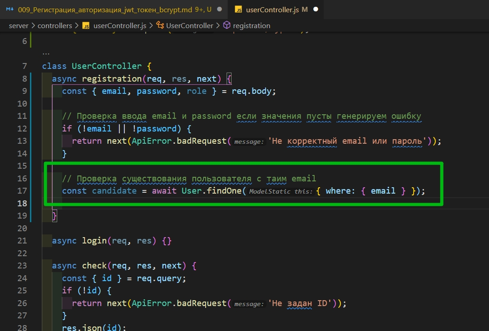

```js
// controller userController.js
const ApiError = require('../error/ApiError');
const bcrypt = require('bcrypt');
const { User, Basket } = require('../models/models');
const { where } = require('sequelize/types');

class UserController {
  async registration(req, res, next) {
    const { email, password, role } = req.body;

    // Проверка ввода email и password если значения пусты генерируем ошибку
    if (!email || !password) {
      return next(ApiError.badRequest('Не корректный email или пароль'));
    }

    // Проверка существования пользователя с таим email
    const candidate = await User.findOne({ where: { email } });
  }

  async login(req, res) {}

  async check(req, res, next) {
    const { id } = req.query;
    if (!id) {
      return next(ApiError.badRequest('Не задан ID'));
    }
    res.json(id);
  }
}

module.exports = new UserController();
```

Следующим этапом задаем условие. Если нам вернулся пользователь и он не пустой, то тогда опять же возвращаем ошибку в котором указываем что пользователь с таким **email** уже существует.

Если же это условие не выполнилось. Пользователя мы не нашли. Тогда мы можем захэшировать пароль и создать нового пользователя. Функция хэширования в **bcrypt** асинхронная. При вызове **bcrypt.hash()** первым параметром передаю **password** пользователя который мы получили в теле запроса, а вторым параметром передаем сколько раз мы его будем хэшировать.

```js
// controller userController.js
const ApiError = require('../error/ApiError');
const bcrypt = require('bcrypt');
const { User, Basket } = require('../models/models');

class UserController {
  async registration(req, res, next) {
    const { email, password, role } = req.body;

    // Проверка ввода email и password если значения пусты генерируем ошибку
    if (!email || !password) {
      return next(ApiError.badRequest('Не корректный email или пароль'));
    }

    // Проверка существования пользователя с таим email
    const candidate = await User.findOne({ where: { email } });
    if (candidate) {
      return next(
        ApiError.badRequest(`Пользватель с таким email уже сужествует`)
      );
    } else {
      const hashPassword = await bcrypt.hash(password, 5);
    }
  }

  async login(req, res) {}

  async check(req, res, next) {
    const { id } = req.query;
    if (!id) {
      return next(ApiError.badRequest('Не задан ID'));
    }
    res.json(id);
  }
}

module.exports = new UserController();
```

Следущим этапом с помощью функции create пользователя создаем. Передаем **email**, **role**, **password: hashPassword**. Пароль не забываем передавать захэшированным.

```js
// controller userController.js
const ApiError = require('../error/ApiError');
const bcrypt = require('bcrypt');
const { User, Basket } = require('../models/models');

class UserController {
  async registration(req, res, next) {
    const { email, password, role } = req.body;

    // Проверка ввода email и password если значения пусты генерируем ошибку
    if (!email || !password) {
      return next(ApiError.badRequest('Не корректный email или пароль'));
    }

    // Проверка существования пользователя с таим email
    const candidate = await User.findOne({ where: { email } });
    if (candidate) {
      return next(
        ApiError.badRequest(`Пользватель с таким email уже сужествует`)
      );
    } else {
      const hashPassword = await bcrypt.hash(password, 5);
      const user = await User.create({ email, role, password: hashPassword }); // создаю пользователя
    }
  }

  async login(req, res) {}

  async check(req, res, next) {
    const { id } = req.query;
    if (!id) {
      return next(ApiError.badRequest('Не задан ID'));
    }
    res.json(id);
  }
}

module.exports = new UserController();
```

Сразу же для пользователя создаю корзину **basket = await Basket.create({})** и все что туда необходимо передать это **id** пользователя **userId: user.id**. Которое мы можем получить уже из созданного объекта самого пользователя **user**.

```js
// controller userController.js
const ApiError = require('../error/ApiError');
const bcrypt = require('bcrypt');
const { User, Basket } = require('../models/models');

class UserController {
  async registration(req, res, next) {
    const { email, password, role } = req.body;

    // Проверка ввода email и password если значения пусты генерируем ошибку
    if (!email || !password) {
      return next(ApiError.badRequest('Не корректный email или пароль'));
    }

    // Проверка существования пользователя с таим email
    const candidate = await User.findOne({ where: { email } });
    if (candidate) {
      return next(
        ApiError.badRequest(`Пользватель с таким email уже сужествует`)
      );
    } else {
      const hashPassword = await bcrypt.hash(password, 5);
      const user = await User.create({ email, role, password: hashPassword }); // создаю пользователя
      const basket = await Basket.create({ userId: user.id }); // создаю корзину пользователя
    }
  }

  async login(req, res) {}

  async check(req, res, next) {
    const { id } = req.query;
    if (!id) {
      return next(ApiError.badRequest('Не задан ID'));
    }
    res.json(id);
  }
}

module.exports = new UserController();
```

Затем мне надо сгенерировать тот самый **jsonwebtoket**.

Импортируем в файл котроллера модуль **jsonwebtoket** и присваиваю переменной **jwt**.

Далее в функции обращаюсь к **jwt** и вызываю функцию **sign()**. И в эту функцию необходимо передать некоторые данные. Первым параметром передается объект, т.е. тот самый **payload**. Т.е. центральная часть **jwt** токена в которорую будут вшиваться какие-то данные. Туда мы передаем **id** пользователя, **email** , **role**.

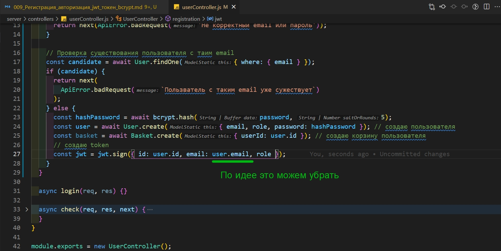

Вторым параметром передается секретный ключ. Этот секретный ключ мы можем захардкодить, но по хорошему его лучше вынести в файл с переменными окружения.

Назову поле **SECRET_KEY=** и тут можно написать абсолютно рандомную строку лишь бы ее никто не знал.

```env
# .env
PORT=5000
DB_NAME=online_store
DB_USER=root
DB_PASSWORD=4343
DB_HOST=localhost
DB_PORT=3306
SECRET_KEY=random_secret_key123
```

Возвращаюсь в контроллер и вторым параметром передаю секретный ключ.

И третьим параметром функция **sign** принимает обект с опциями. Здесь одна из основных опций это опция которая отвечает за то сколько живет токен **expiresIn:'24h'**.

И после того как токен сгенерирован возвращаем его на клиент.

```js
// controller userController.js
const ApiError = require('../error/ApiError');
const bcrypt = require('bcrypt');
const jwt = require('jsonwebtoken');
const { User, Basket } = require('../models/models');

class UserController {
  async registration(req, res, next) {
    const { email, password, role } = req.body;

    // Проверка ввода email и password если значения пусты генерируем ошибку
    if (!email || !password) {
      return next(ApiError.badRequest('Не корректный email или пароль'));
    }

    // Проверка существования пользователя с таим email
    const candidate = await User.findOne({ where: { email } });
    if (candidate) {
      return next(
        ApiError.badRequest(`Пользватель с таким email уже сужествует`)
      );
    } else {
      const hashPassword = await bcrypt.hash(password, 5);
      const user = await User.create({ email, role, password: hashPassword }); // создаю пользователя
      const basket = await Basket.create({ userId: user.id }); // создаю корзину пользователя
      // создаю token
      const token = jwt.sign(
        { id: user.id, email: user.email, role },
        process.env.SECRET_KEY,
        { expiresIn: '24h' }
      );
    }
    return res.json({ token });
  }

  async login(req, res) {}

  async check(req, res, next) {
    const { id } = req.query;
    if (!id) {
      return next(ApiError.badRequest('Не задан ID'));
    }
    res.json(id);
  }
}

module.exports = new UserController();
```

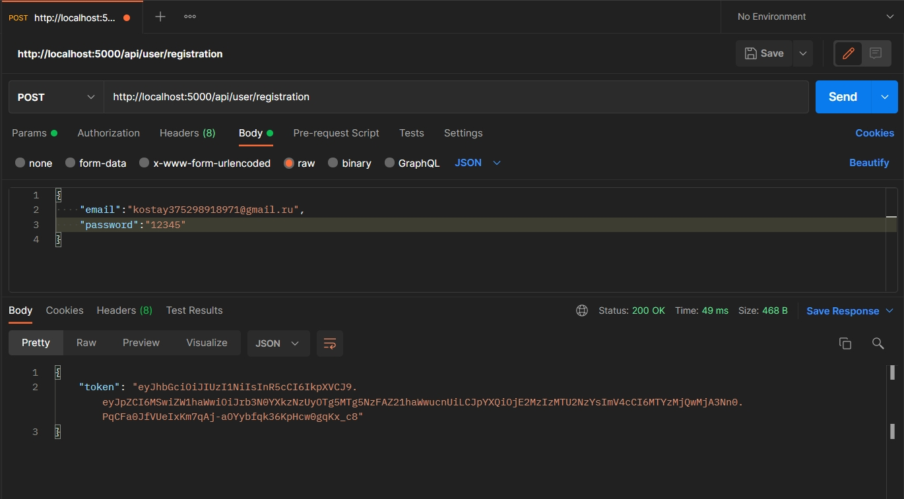

Теперь попробуем этот токен скопировать и перейти на сайт которые это токены декодируют [https://jwt.io/](https://jwt.io/).

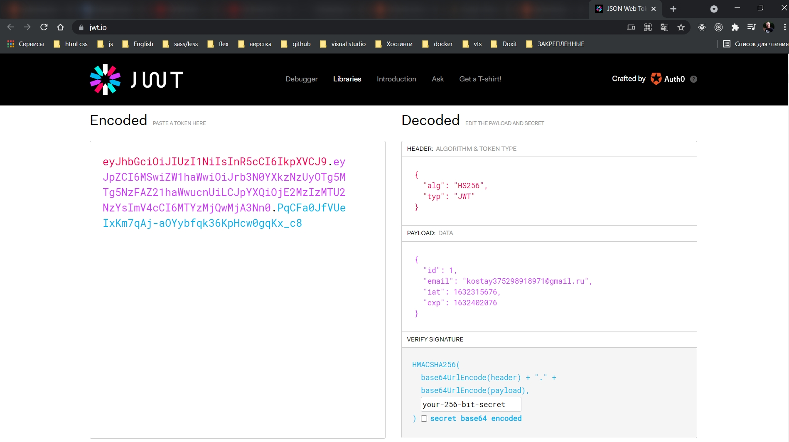

И вот получаю данные зашитые в токен.

зд**role**есь пустая потому что мы ее передавали напрямую из запроса. А в запросе мы **role** не указали. Поэтому она пустая.

Поскольку генерировать токен нам придеться и в функции логина создадим для этого отдельную функцию **generateJWT**. И в функции **registration** в переменную token заношу результат работы функции **generateToken** пуутем ее вызова. И в вызов передаю **user.id**, **user.email**, **user.role**.

```js
// controller userController.js
const ApiError = require('../error/ApiError');
const bcrypt = require('bcrypt');
const jwt = require('jsonwebtoken');
const { User, Basket } = require('../models/models');

const generateJWT = (id, email, role) => {
  return jwt.sign(
    { id: user.id, email: user.email, role },
    process.env.SECRET_KEY,
    {
      expiresIn: '24h',
    }
  );
  return res.json({ token });
};

class UserController {
  async registration(req, res, next) {
    const { email, password, role } = req.body;

    // Проверка ввода email и password если значения пусты генерируем ошибку
    if (!email || !password) {
      return next(ApiError.badRequest('Не корректный email или пароль'));
    }

    // Проверка существования пользователя с таим email
    const candidate = await User.findOne({ where: { email } });
    if (candidate) {
      return next(
        ApiError.badRequest(`Пользватель с таким email уже сужествует`)
      );
    } else {
      const hashPassword = await bcrypt.hash(password, 5);
      const user = await User.create({ email, role, password: hashPassword }); // создаю пользователя
      const basket = await Basket.create({ userId: user.id }); // создаю корзину пользователя
      // создаю token
      const token = generateJWT(user.id, user.email, user.role);
      return res.json({ token });
    }
  }

  async login(req, res) {}

  async check(req, res, next) {
    const { id } = req.query;
    if (!id) {
      return next(ApiError.badRequest('Не задан ID'));
    }
    res.json(id);
  }
}

module.exports = new UserController();
```

На данном моменте **role** никуда не потеряется так как по **default** присваивается **user** после того как пользователь был создан.

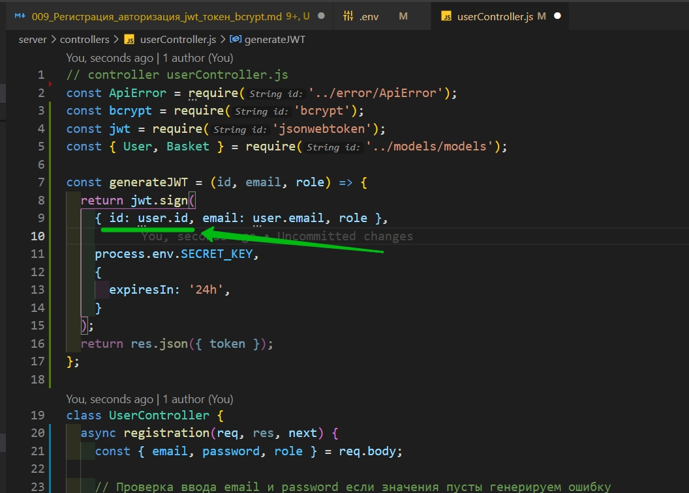

Можно сократить до **id**, **email**, **role**.

```js
// controller userController.js
const ApiError = require('../error/ApiError');
const bcrypt = require('bcrypt');
const jwt = require('jsonwebtoken');
const { User, Basket } = require('../models/models');

const generateJWT = (id, email, role) => {
  return jwt.sign(
    { id, email, role },

    process.env.SECRET_KEY,
    {
      expiresIn: '24h',
    }
  );
};

class UserController {
  async registration(req, res, next) {
    const { email, password, role } = req.body;

    // Проверка ввода email и password если значения пусты генерируем ошибку
    if (!email || !password) {
      return next(ApiError.badRequest('Не корректный email или пароль'));
    }

    // Проверка существования пользователя с таим email
    const candidate = await User.findOne({ where: { email } });
    if (candidate) {
      return next(
        ApiError.badRequest(`Пользватель с таким email уже сужествует`)
      );
    } else {
      const hashPassword = await bcrypt.hash(password, 5);
      const user = await User.create({ email, role, password: hashPassword }); // создаю пользователя
      const basket = await Basket.create({ userId: user.id }); // создаю корзину пользователя
      // создаю token
      const token = generateJWT(user.id, user.email, user.role);
      return res.json({ token });
    }
  }

  async login(req, res) {}

  async check(req, res, next) {
    const { id } = req.query;
    if (!id) {
      return next(ApiError.badRequest('Не задан ID'));
    }
    res.json(id);
  }
}

module.exports = new UserController();
```

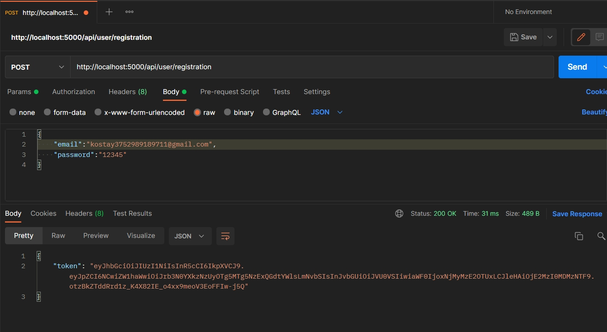

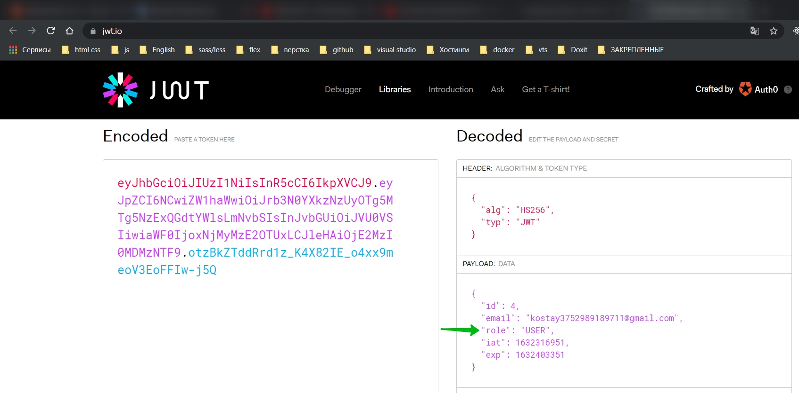

<br/>
<br/>
<br/>

Реализовываю функцию **login**.

Здесь так же из тела запроса получаю **email**, **password**. **const { email, password } = req.body;**

Затем нам необходимо убедиться что пользователь с таким **email** в БД существует. Поэтому опять же по условию ищем этого пользователя. Но здесь в отличие от регистрации проверяем что если пользователь не найден, то тогда возвращаем соответственно ошибку.

```js
// controller userController.js
const ApiError = require('../error/ApiError');
const bcrypt = require('bcrypt');
const jwt = require('jsonwebtoken');
const { User, Basket } = require('../models/models');

const generateJWT = (id, email, role) => {
  return jwt.sign(
    { id, email, role },

    process.env.SECRET_KEY,
    {
      expiresIn: '24h',
    }
  );
};

class UserController {
  async registration(req, res, next) {
    const { email, password, role } = req.body;

    // Проверка ввода email и password если значения пусты генерируем ошибку
    if (!email || !password) {
      return next(ApiError.badRequest('Не корректный email или пароль'));
    }

    // Проверка существования пользователя с таим email
    const candidate = await User.findOne({ where: { email } });
    if (candidate) {
      return next(
        ApiError.badRequest(`Пользватель с таким email уже сужествует`)
      );
    } else {
      const hashPassword = await bcrypt.hash(password, 5);
      const user = await User.create({ email, role, password: hashPassword }); // создаю пользователя
      const basket = await Basket.create({ userId: user.id }); // создаю корзину пользователя
      // создаю token
      const token = generateJWT(user.id, user.email, user.role);
      return res.json({ token });
    }
  }

  async login(req, res, next) {
    const { email, password } = req.body;
    const user = await User.findOne({ where: { email } });
    if (!user) {
      return next(
        ApiError.internal(`Пользователь с таким ${email} не найден `)
      );
    }
  }

  async check(req, res, next) {
    const { id } = req.query;
    if (!id) {
      return next(ApiError.badRequest('Не задан ID'));
    }
    res.json(id);
  }
}

module.exports = new UserController();
```

Если это условие мы проскачили нам нужно убедиться в том что пароль который мы написали в форме совпадает с тем который лежит в БД. Но в БД у нас лежит захэшированный пароль. По этому с помощью **bcrypt** и ее функции **compareSync**, она является синхронной. Сравниваем эти пароли. Первым параметром передаю пароль который написал пользователь **password**, а второй получаем с БД **user.password**. Затем если пароли не совпадают так же возвращаем ошибку.

```js
// controller userController.js
const ApiError = require('../error/ApiError');
const bcrypt = require('bcrypt');
const jwt = require('jsonwebtoken');
const { User, Basket } = require('../models/models');

const generateJWT = (id, email, role) => {
  return jwt.sign(
    { id, email, role },

    process.env.SECRET_KEY,
    {
      expiresIn: '24h',
    }
  );
};

class UserController {
  async registration(req, res, next) {
    const { email, password, role } = req.body;

    // Проверка ввода email и password если значения пусты генерируем ошибку
    if (!email || !password) {
      return next(ApiError.badRequest('Не корректный email или пароль'));
    }

    // Проверка существования пользователя с таим email
    const candidate = await User.findOne({ where: { email } });
    if (candidate) {
      return next(
        ApiError.badRequest(`Пользватель с таким email уже сужествует`)
      );
    } else {
      const hashPassword = await bcrypt.hash(password, 5);
      const user = await User.create({ email, role, password: hashPassword }); // создаю пользователя
      const basket = await Basket.create({ userId: user.id }); // создаю корзину пользователя
      // создаю token
      const token = generateJWT(user.id, user.email, user.role);
      return res.json({ token });
    }
  }

  async login(req, res, next) {
    const { email, password } = req.body;
    // ищу пользователя
    const user = await User.findOne({ where: { email } });
    if (!user) {
      return next(
        ApiError.internal(`Пользователь с таким ${email} не найден `)
      );
    }
    // сравниваю пароли
    let comparePassword = bcrypt.compareSync(password.user.password);
    if (!comparePassword) {
      return next(ApiError.badRequest(`указан не верный пароль`));
    }
  }

  async check(req, res, next) {
    const { id } = req.query;
    if (!id) {
      return next(ApiError.badRequest('Не задан ID'));
    }
    res.json(id);
  }
}

module.exports = new UserController();
```

Затем опять же генерируем токен с помощью функции **generateJWT**. И в функции **check** пока что все закоментирую.

```js
// controller userController.js
const ApiError = require('../error/ApiError');
const bcrypt = require('bcrypt');
const jwt = require('jsonwebtoken');
const { User, Basket } = require('../models/models');

const generateJWT = (id, email, role) => {
  return jwt.sign(
    { id, email, role },

    process.env.SECRET_KEY,
    {
      expiresIn: '24h',
    }
  );
};

class UserController {
  async registration(req, res, next) {
    const { email, password, role } = req.body;

    // Проверка ввода email и password если значения пусты генерируем ошибку
    if (!email || !password) {
      return next(ApiError.badRequest('Не корректный email или пароль'));
    }

    // Проверка существования пользователя с таим email
    const candidate = await User.findOne({ where: { email } });
    if (candidate) {
      return next(
        ApiError.badRequest(`Пользватель с таким email уже сужествует`)
      );
    } else {
      const hashPassword = await bcrypt.hash(password, 5);
      const user = await User.create({ email, role, password: hashPassword }); // создаю пользователя
      const basket = await Basket.create({ userId: user.id }); // создаю корзину пользователя
      // создаю token
      const token = generateJWT(user.id, user.email, user.role);
      return res.json({ token });
    }
  }

  async login(req, res, next) {
    const { email, password } = req.body;
    // ищу пользователя
    const user = await User.findOne({ where: { email } });
    if (!user) {
      return next(
        ApiError.internal(`Пользователь с таким ${email} не найден `)
      );
    }
    // сравниваю пароли
    let comparePassword = bcrypt.compareSync(password, user.password);
    if (!comparePassword) {
      return next(ApiError.badRequest(`указан не верный пароль`));
    }
    // генерирую новый токен
    const token = generateJWT(user.id, user.email, user.role);
    return res.json({ token });
  }

  async check(req, res, next) {
    // const { id } = req.query;
    // if (!id) {
    //   return next(ApiError.badRequest('Не задан ID'));
    // }
    // res.json(id);
  }
}

module.exports = new UserController();
```

И так получаю новый токен

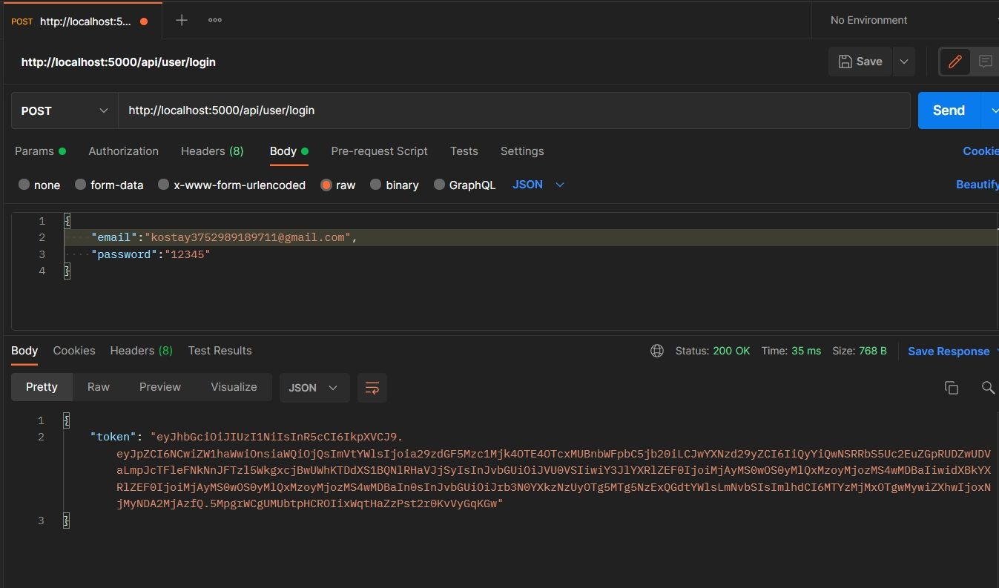

Ввожу не правильный **email**

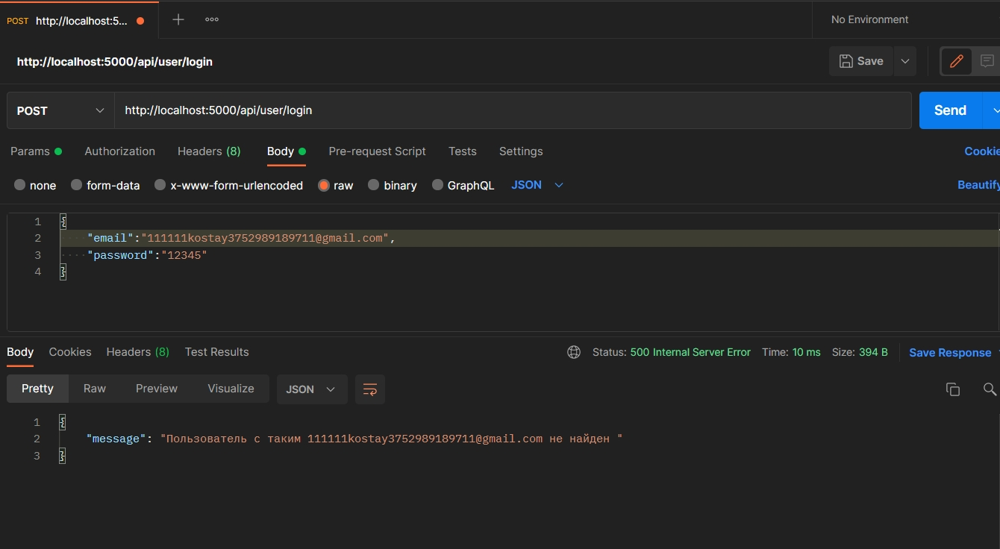

Ввожу не правильный **password**


