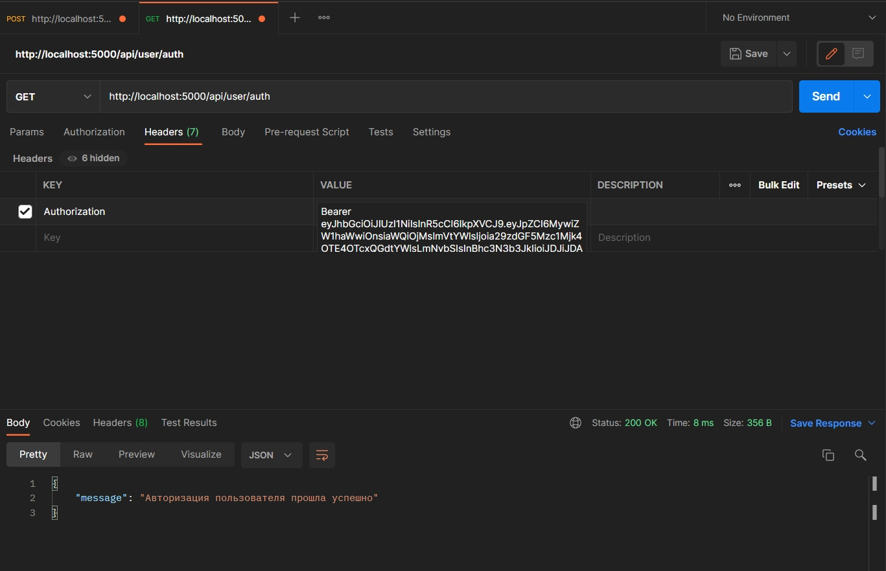

    # 010 Middleware проверяющий авторизован ли пользователь

Перед тем как приступить к реализации функции **check** реализуем еще один **middleware**. Именно в нем мы будем декодировать токен и проверять его на валидность. Если токен не валидный будем сразу возвращать ошибку о том что пользователь не авторизован.

В папке **middleware** создаю **authMiddleware.js**. И отсюда сразу экспортирую функцию **middleware**.

```js
// middleware authMiddleware.js

module.exports = function (req, res, next) {};
```

Здесь сразу делаю вот таку проверку.

```js
// middleware authMiddleware.js

module.exports = function (req, res, next) {
  if (req.method === 'OPTIONS') {
    next();
  }
};
```

Если метод у нас равен **OPTIONS** то пропускаем.

Нас интересует только **POST**, **GET**, **PUT**, **DELETE**.

Если все таки где-то ошибка, возвращаем статус 401 и в сообщении напишем что пользователь не авторизован.
**401** статус это статус не авторизованного пользователя.

```js
// middleware authMiddleware.js

module.exports = function (req, res, next) {
  if (req.method === 'OPTIONS') {
    next();
  }
  try {
  } catch (error) {
    res.status(401).json({ message: 'Пользователь не авторизован' });
  }
};
```

Теперь приступаю к логике.

Первое что необходимо сделать это из **headers**. Как я уже говорил **token** помещают в хэдер **authorization**. Выцепить сам токен. Но в хэдер обычно помещают сам тип токена, а потом сам токен. Выглядит это примерно так. Тип токена в нашем случае это **Bearer** а затем сам токен ...

```js
// middleware authMiddleware.js

module.exports = function (req, res, next) {
  if (req.method === 'OPTIONS') {
    next();
  }
  try {
    // Вытаскиваю токен
    const token = req.headers.authorization.split(' ')[1]; // Bearer asdfghjkl
  } catch (error) {
    res.status(401).json({ message: 'Пользователь не авторизован' });
  }
};
```

По этому нам по пробелу два этих слова нужно отлепить, для этого использую **split**. И по первому индексу получить непосредственно сам токен.

Если этого токена нет, если он не существует , опять же возвращаем ошибку.

```js
// middleware authMiddleware.js

module.exports = function (req, res, next) {
  if (req.method === 'OPTIONS') {
    next();
  }
  try {
    // Вытаскиваю токен
    const token = req.headers.authorization.split(' ')[1]; // Bearer asdfghjkl
    if (!token) {
      return res.status(401).json({ message: 'Пользователь не авторизован' });
    }
  } catch (error) {
    res.status(401).json({ message: 'Пользователь не авторизован' });
  }
};
```

И идем дальше. Если **token** есть нам надо его раскодировать. Импортирую сюда модуль **jsonwebtoken**.

Далее **const decoder = jwt.verify**, функция **verify** будет проверять токен на валидность. В нее необходимо первым параметром необходимо передать сам **token**, а вторым секретный ключ который мы помещали в переменные окружения.

```js
// middleware authMiddleware.js
const jwt = require('jsonwebtoken');

module.exports = function (req, res, next) {
  if (req.method === 'OPTIONS') {
    next();
  }
  try {
    // Вытаскиваю токен
    const token = req.headers.authorization.split(' ')[1]; // Bearer asdfghjkl
    if (!token) {
      return res.status(401).json({ message: 'Пользователь не авторизован' });
    } else {
      // Если токен есть я его декодирую
      const decoded = jwt.verify(token, process.env.SECRET_KEY);
    }
  } catch (error) {
    res.status(401).json({ message: 'Пользователь не авторизован' });
  }
};
```

Следующим этапом, например к полю **user** добавим данные которые мы вытащили из этого токена. И во всех функциях этот user будет доступен. Затем вызываем функция **next** и этим мы вызываем следующий в цепочке **middleware**.

```js
// middleware authMiddleware.js
const jwt = require('jsonwebtoken');

module.exports = function (req, res, next) {
  if (req.method === 'OPTIONS') {
    next();
  }
  try {
    // Вытаскиваю токен
    const token = req.headers.authorization.split(' ')[1]; // Bearer asdfghjkl
    if (!token) {
      return res.status(401).json({ message: 'Пользователь не авторизован' });
    } else {
      // Если токен есть я его декодирую
      const decoded = jwt.verify(token, process.env.SECRET_KEY);
      // в поле req.user добавляю декодированные данные
      req.user = decoded;
      next();
    }
  } catch (error) {
    res.status(401).json({ message: 'Пользователь не авторизован' });
  }
};
```

Перехожу в **userRouter**. Сюда этот **middleware** мы импортируем. И передаем его вторым параметром в **GET** запрос который будет проверять полтзователя на авторизованность.

```js
//routes userRouter.js
const Router = require('express');
const router = new Router();
const userController = require('../controllers/userController');
const authMiddleware = require('../middleware/authMiddleware');

router.post('/registration', userController.registration);
router.post('/login', userController.login);
router.get('/auth', authMiddleware, userController.check);

module.exports = router;
```


Пользователь не авторизован поскольку мы не указали токен.

Теперь в функции **check** пишу хоть что-нибудь для проверки работоспособности.

```js
// controller userController.js
const ApiError = require('../error/ApiError');
const bcrypt = require('bcrypt');
const jwt = require('jsonwebtoken');
const { User, Basket } = require('../models/models');

const generateJWT = (id, email, role) => {
  return jwt.sign(
    { id, email, role },

    process.env.SECRET_KEY,
    {
      expiresIn: '24h',
    }
  );
};

class UserController {
  async registration(req, res, next) {
    const { email, password, role } = req.body;

    // Проверка ввода email и password если значения пусты генерируем ошибку
    if (!email || !password) {
      return next(ApiError.badRequest('Не корректный email или пароль'));
    }

    // Проверка существования пользователя с таим email
    const candidate = await User.findOne({ where: { email } });
    if (candidate) {
      return next(
        ApiError.badRequest(`Пользватель с таким email уже сужествует`)
      );
    } else {
      const hashPassword = await bcrypt.hash(password, 5);
      const user = await User.create({ email, role, password: hashPassword }); // создаю пользователя
      const basket = await Basket.create({ userId: user.id }); // создаю корзину пользователя
      // создаю token
      const token = generateJWT(user.id, user.email, user.role);
      return res.json({ token });
    }
  }

  async login(req, res, next) {
    const { email, password } = req.body;
    // ищу пользователя
    const user = await User.findOne({ where: { email } });
    if (!user) {
      return next(
        ApiError.internal(`Пользователь с таким ${email} не найден `)
      );
    }
    // сравниваю пароли
    let comparePassword = bcrypt.compareSync(password, user.password);
    if (!comparePassword) {
      return next(ApiError.badRequest(`указан не верный пароль`));
    }
    // генерирую новый токен
    const token = generateJWT(user.id, user, email, user.role);
    return res.json({ token });
  }

  async check(req, res, next) {
    res.json({ message: 'Авторизация пользователя прошла успешно' });
  }
}

module.exports = new UserController();
```

Теперь пробуем авторизоваться.


Возвращаюсь к **GET** запросу и в **headers** добавляю **Authorization** из которого мы как раз получали **token**. Вставляю токен и добавляю его тип **Bearer**.



В принципе вся функция check будет сводится к тому что бы сгенерировать новый **token** и отправить его обратно на клиент. Грубо если пользователь постоянно использует свой аккаунт то токен у него будет перезаписываться.

Генерирую новый токен

```js
// controller userController.js
const ApiError = require('../error/ApiError');
const bcrypt = require('bcrypt');
const jwt = require('jsonwebtoken');
const { User, Basket } = require('../models/models');

const generateJWT = (id, email, role) => {
  return jwt.sign(
    { id, email, role },

    process.env.SECRET_KEY,
    {
      expiresIn: '24h',
    }
  );
};

class UserController {
  async registration(req, res, next) {
    const { email, password, role } = req.body;

    // Проверка ввода email и password если значения пусты генерируем ошибку
    if (!email || !password) {
      return next(ApiError.badRequest('Не корректный email или пароль'));
    }

    // Проверка существования пользователя с таим email
    const candidate = await User.findOne({ where: { email } });
    if (candidate) {
      return next(
        ApiError.badRequest(`Пользватель с таким email уже сужествует`)
      );
    } else {
      const hashPassword = await bcrypt.hash(password, 5);
      const user = await User.create({ email, role, password: hashPassword }); // создаю пользователя
      const basket = await Basket.create({ userId: user.id }); // создаю корзину пользователя
      // создаю token
      const token = generateJWT(user.id, user.email, user.role);
      return res.json({ token });
    }
  }

  async login(req, res, next) {
    const { email, password } = req.body;
    // ищу пользователя
    const user = await User.findOne({ where: { email } });
    if (!user) {
      return next(
        ApiError.internal(`Пользователь с таким ${email} не найден `)
      );
    }
    // сравниваю пароли
    let comparePassword = bcrypt.compareSync(password, user.password);
    if (!comparePassword) {
      return next(ApiError.badRequest(`указан не верный пароль`));
    }
    // генерирую новый токен
    const token = generateJWT(user.id, user, email, user.role);
    return res.json({ token });
  }

  async check(req, res, next) {
    const token = jwt.generateJWT(req.user.id, req.user.email, req.user.role);
    return res.json({ token });
  }
}

module.exports = new UserController();
```

Как домашнее задание сделать корзину и рейтинг.
