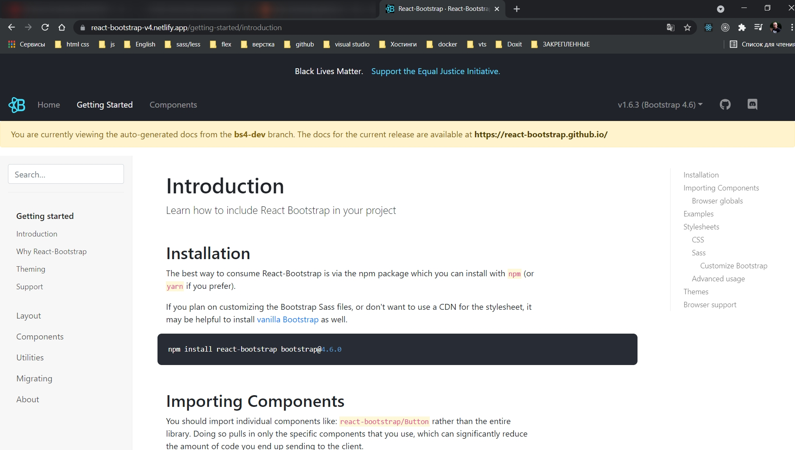
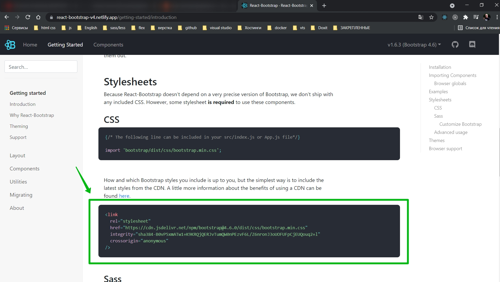

# Начало структура приложения

Перехожу в папку client.

```shell
npx create-react-app .
```

И после установки удаляю лишнее.

После устанавливаю

```shell
npm i axios react-router-dom mobx mobx-react-lite
```

- **axios** - для запросов на сервер
- **react-router-dom** - для постраничной навигации
- **mobx** - state manager
- **mobx-react-lite** - для работы с функциональными компонентами

Так же мы будем использовать **Bootstrap** для того что бы не тратить время на верстку.

В поисковике [https://react-bootstrap.github.io/](https://react-bootstrap.github.io/).



```shell
npm install react-bootstrap bootstrap@4.6.0
```

Так же мне понадобятся стили. Пролистай чуть ниже.



Добавляю в корневой **index.html**.

```html
<!DOCTYPE html>
<html lang="en">
  <head>
    <meta charset="utf-8" />
    <meta name="viewport" content="width=device-width, initial-scale=1" />
    <meta name="theme-color" content="#000000" />
    <link
      rel="stylesheet"
      href="https://cdn.jsdelivr.net/npm/bootstrap@4.6.0/dist/css/bootstrap.min.css"
      integrity="sha384-B0vP5xmATw1+K9KRQjQERJvTumQW0nPEzvF6L/Z6nronJ3oUOFUFpCjEUQouq2+l"
      crossorigin="anonymous"
    />
    <title>React App</title>
  </head>
  <body>
    <div id="root"></div>
  </body>
</html>
```

Теперь задаю структуру. Создадим все папки которые нам в дальнейшем понадобяться.

- **store** - Здесь мы будем взаимодействовать с **mobx** и хранить какие-то данные.
- **pages** - тут будут корневые компоненты которые будут являться страницами
- **components** - папкак с компонентами.

И сразу же создадим страницы.

- **Auth.js** - страница авторизации.

```js
import React from 'react';

const Auth = () => {
  return <div>AUTH</div>;
};

export default Auth;
```

- Shop.js

```js
//pages Shop.js
import React from 'react';

const Shop = () => {
  return <div>Shop</div>;
};

export default Shop;
```

- **DevicePage** - страница конкретного устройства

```js
// pages DevicePage
import React from 'react';

const DevicePage = () => {
  return <div>DevicePage</div>;
};

export default DevicePage;
```

- **Admin.js** Тут администратор будет добавлять типы брэнды и устройства в магазин.

```js
// pages Admin.js
import React from 'react';

const Admin = () => {
  return <div>Admin</div>;
};

export default Admin;
```

Basket.js Страница корзины

```js
// pages Basket
import React from 'react';

const Basket = () => {
  return <div>Basket</div>;
};

export default Basket;
```
