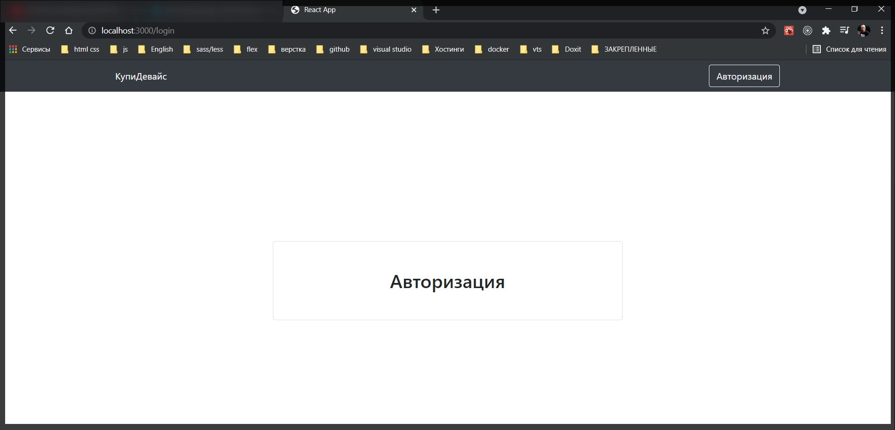
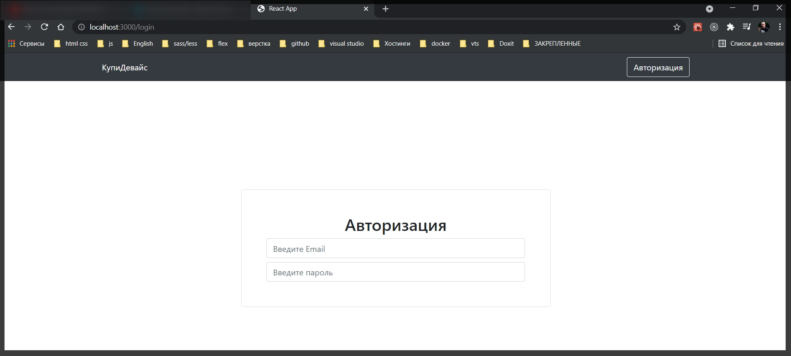
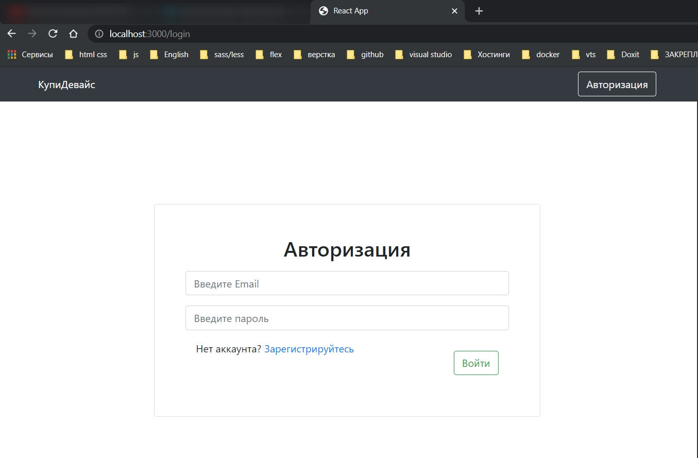
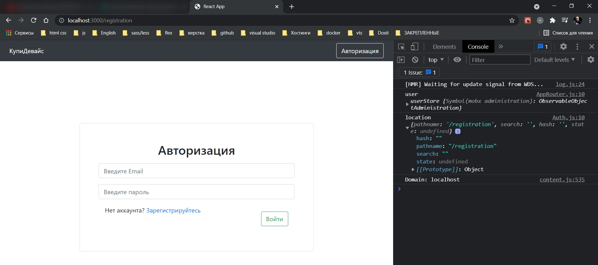
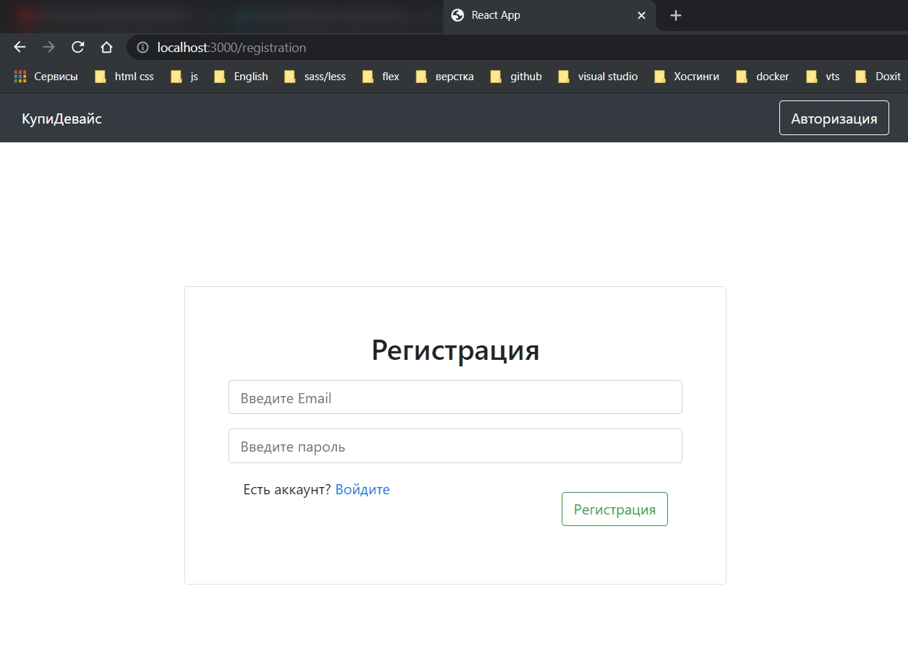

# Страница регистрации авторизации

Для этого у меня уже есть созданный компонент **Auth.js**. И мы сделаем его универсальным. Он будет как под регистрацию, так и под авторизацию.

```js
// pages Auth.js
import React from 'react';
import { Container } from 'react-bootstrap';

const Auth = () => {
  return (
    <Container
      className="d-flex justify-content-center align-items-center"
      style={{ height: window.innerHeight - 54 }}
    >
      AUTH
    </Container>
  );
};

export default Auth;
```

C помощью **justify-content-center** **align-items-center** отцентровываю содержимое как по горизонтали так и по вертикали.

C помощь **style={{height:window.innerHeight - 54}}** задаю высоту контейнера. Ее мы будем получать от высоты браузера минус высоту **NavBar**.

```js
// pages Auth.js
import React from 'react';
import { Container } from 'react-bootstrap';

const Auth = () => {
  return (
    <Container
      className="d-flex justify-content-center align-items-center"
      style={{ height: window.innerHeight - 54 }}
    >
      AUTH
    </Container>
  );
};

export default Auth;
```


Теперь сделаем саму форму. С помощью **bootstrap** компонента Form создаю форму. Но саму форму помесим в компонент **Card**. **Card** - это обычная карточка которая обрамлена рамкой.

```js
// pages Auth.js
import React from 'react';
import { Container, Card, Form } from 'react-bootstrap';

const Auth = () => {
  return (
    <Container
      className="d-flex justify-content-center align-items-center"
      style={{ height: window.innerHeight - 54 }}
    >
      <Card style={{ width: 600 }} className="p-5">
        <h2 className="m-auto">Авторизация</h2>
        <Form style="d-flex flex-column">
          <Form.Control />
        </Form>
      </Card>
    </Container>
  );
};

export default Auth;
```



```js
// pages Auth.js
import React from 'react';
import { Container, Card, Form } from 'react-bootstrap';

const Auth = () => {
  return (
    <Container
      className="d-flex justify-content-center align-items-center"
      style={{ height: window.innerHeight - 54 }}
    >
      <Card style={{ width: 600 }} className="p-5">
        <h2 className="m-auto">Авторизация</h2>
        <Form>
          <Form.Control className="mt-2" placeholder="Введите Email" />
          <Form.Control className="mt-2" placeholder="Введите пароль" />
        </Form>
      </Card>
    </Container>
  );
};

export default Auth;
```



```js
// pages Auth.js
import React from 'react';
import { Container, Card, Form, Button, Row } from 'react-bootstrap';
import { NavLink } from 'react-router-dom';
import { REGISTRATION_ROUTE } from '../utils/consts';

const Auth = () => {
  return (
    <Container
      className="d-flex justify-content-center align-items-center"
      style={{ height: window.innerHeight - 54 }}
    >
      <Card style={{ width: 600 }} className="p-5">
        <h2 className="m-auto">Авторизация</h2>
        <Form className="d-flex flex-column">
          <Form.Control className="mt-3" placeholder="Введите Email" />
          <Form.Control className="mt-3" placeholder="Введите пароль" />
          <Row className="d-lg-flex justify-content-lg-between m-3">
            <div>
              Нет аккаунта?{' '}
              <NavLink to={REGISTRATION_ROUTE}>Зарегистрируйтесь</NavLink>
            </div>
            <Button className="mt-3" variant={'outline-success'}>
              Войти
            </Button>
          </Row>
        </Form>
      </Card>
    </Container>
  );
};

export default Auth;
```



И теперь в зависимости от ссылки мне необходимо отрисовывать либо страницу авторизации, либо страницу регистрации.

Для этого воспользуемся хуком **useLocation** из **react-router-dom**. С помощью него можно полуить маршрут в строке запроса. Выведем в логи и посмотрим

```js
// pages Auth.js
import React from 'react';
import { Container, Card, Form, Button, Row } from 'react-bootstrap';
import { NavLink, useLocation } from 'react-router-dom';
import { REGISTRATION_ROUTE } from '../utils/consts';

const Auth = () => {
  const location = useLocation();

  console.log('location', location);

  return (
    <Container
      className="d-flex justify-content-center align-items-center"
      style={{ height: window.innerHeight - 54 }}
    >
      <Card style={{ width: 600 }} className="p-5">
        <h2 className="m-auto">Авторизация</h2>
        <Form className="d-flex flex-column">
          <Form.Control className="mt-3" placeholder="Введите Email" />
          <Form.Control className="mt-3" placeholder="Введите пароль" />
          <Row className="d-lg-flex justify-content-lg-between m-3">
            <div>
              Нет аккаунта?{' '}
              <NavLink to={REGISTRATION_ROUTE}>Зарегистрируйтесь</NavLink>
            </div>
            <Button className="mt-3" variant={'outline-success'}>
              Войти
            </Button>
          </Row>
        </Form>
      </Card>
    </Container>
  );
};

export default Auth;
```



Вижу **pathname** в нем я получаю ссылку.

Сразу же делаю переменную. Называю ее **isLogin**. Она будет true только в том случае если ее маршрут совпадает с **LOGIN_ROUTE**

```js
// pages Auth.js
import React from 'react';
import { Container, Card, Form, Button, Row } from 'react-bootstrap';
import { NavLink, useLocation } from 'react-router-dom';
import { REGISTRATION_ROUTE, LOGIN_ROUTE } from '../utils/consts';

const Auth = () => {
  const location = useLocation();

  const isLogin = location.pathname === LOGIN_ROUTE;

  console.log('location', location);

  return (
    <Container
      className="d-flex justify-content-center align-items-center"
      style={{ height: window.innerHeight - 54 }}
    >
      <Card style={{ width: 600 }} className="p-5">
        <h2 className="m-auto">{isLogin ? 'Авторизация' : 'Регистрация'}</h2>
        <Form className="d-flex flex-column">
          <Form.Control className="mt-3" placeholder="Введите Email" />
          <Form.Control className="mt-3" placeholder="Введите пароль" />
          <Row className="d-lg-flex justify-content-lg-between m-3">
            {isLogin ? (
              <div>
                Нет аккаунта?{' '}
                <NavLink to={REGISTRATION_ROUTE}>Зарегистрируйтесь</NavLink>
              </div>
            ) : (
              <div>
                Есть аккаунт? <NavLink to={LOGIN_ROUTE}>Войдите</NavLink>
              </div>
            )}
            <Button className="mt-3" variant={'outline-success'}>
              {isLogin ? 'Войти' : 'Регистрация'}
            </Button>
          </Row>
        </Form>
      </Card>
    </Container>
  );
};

export default Auth;
```



