# Главная страница список товаров типов брендов

Опять полностью весь компонент Shop оборачиваю в Container

```js
//pages Shop.js
import React from 'react';
import { Container } from 'react-bootstrap';

const Shop = () => {
  return <Container>Shop</Container>;
};

export default Shop;
```

Внутрь контайнера добавим строку компонента бутстрапа **Row**. И уже внутрь строки добавим калонки. Строка состоит из 12 колонок. Под левую панель с типами выделим три колонки.

```js
//pages Shop.js
import React from 'react';
import { Container, Row, Col } from 'react-bootstrap';

const Shop = () => {
  return (
    <Container>
      <Row>
        <Col md={3}></Col>
        <Col md={9}></Col>
      </Row>
    </Container>
  );
};

export default Shop;
```

А под все остальное выделю 9 колонок. По 3 на каждый товар.

Начну с создания левой панели с типами. В папке **components** создаю **TypeBar**.

Сразу компонент оборачиваю в функцию **observer**

```js
import React from 'react';
import { observer } from 'mobx-react-lite';

const TypeBar = observer(() => {
  return <div></div>;
});

export default TypeBar;
```

Следующим этапом из store получаю **device**.

```js
import React, { useContext } from 'react';
import { observer } from 'mobx-react-lite';
import { Context } from '../index';

const TypeBar = observer(() => {
  const { device } = useContext(Context);
  return <div></div>;
});

export default TypeBar;
```

Открываю документацию **bootstrap**. Здесь нахожу компонент **List** **Group**.

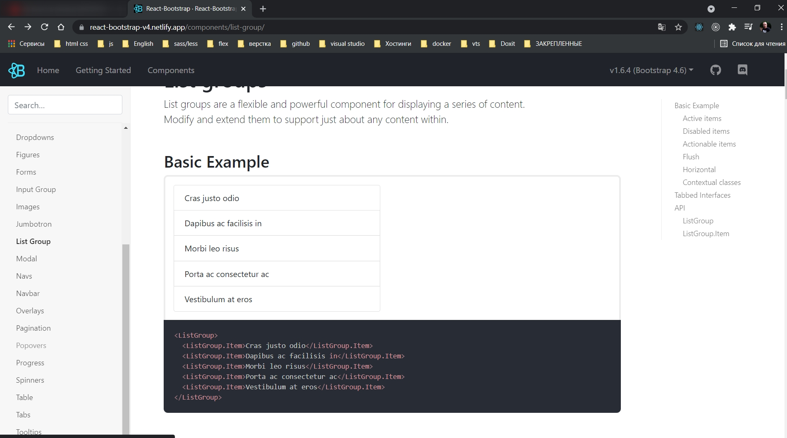

```js
import React, { useContext } from 'react';
import { ListGroup } from 'react-bootstrap';
import { observer } from 'mobx-react-lite';
import { Context } from '../index';

const TypeBar = observer(() => {
  const { device } = useContext(Context);
  return (
    <ListGroup>
      <ListGroup.Item>Cras justo odio</ListGroup.Item>
      <ListGroup.Item>Dapibus ac facilisis in</ListGroup.Item>
      <ListGroup.Item>Morbi leo risus</ListGroup.Item>
      <ListGroup.Item>Porta ac consectetur ac</ListGroup.Item>
      <ListGroup.Item>Vestibulum at eros</ListGroup.Item>
    </ListGroup>
  );
});

export default TypeBar;
```

Перехожу в компонент **Shop** и сразу же добавляю наш **TypeBar**.

```js
//pages Shop.js
import React from 'react';
import { Container, Row, Col } from 'react-bootstrap';
import TypeBar from '../components/TypeBar';

const Shop = () => {
  return (
    <Container>
      <Row className="mt-2">
        <Col md={3}>
          <TypeBar />
        </Col>
        <Col md={9}></Col>
      </Row>
    </Container>
  );
};

export default Shop;
```

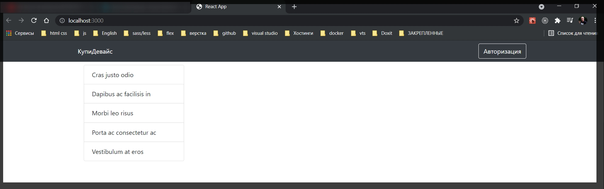

Возвращаюсь в **TypeBar**. Удаляю все **ListGroup.Item**. После чего пробегаюсь с помощью функции **map** по **device.types**. И для каждого типа мы как раз буудем отрисовывать **ListGroup.Item**.

```js
import React, { useContext } from 'react';
import { ListGroup } from 'react-bootstrap';
import { observer } from 'mobx-react-lite';
import { Context } from '../index';

const TypeBar = observer(() => {
  const { device } = useContext(Context);
  return (
    <ListGroup>
      {device._types.map((type) => (
        <ListGroup.Item key={type.id}>{type.name}</ListGroup.Item>
      ))}
    </ListGroup>
  );
});

export default TypeBar;
```

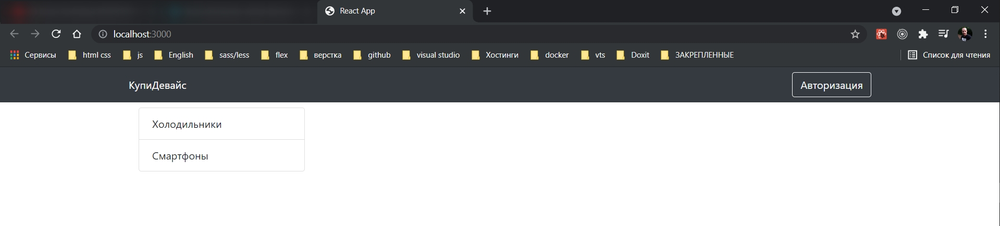

Открываю **store** и в массив добавлю еще пару типов.

```js
// store deviceStore.js

import { makeAutoObservable } from 'mobx';

export default class deviceStore {
  constructor() {
    this._types = [
      { id: 1, name: 'Холодильники' },
      { id: 2, name: 'Смартфоны' },
      { id: 3, name: 'Ноутбуки' },
      { id: 4, name: 'Телевизоры' },
    ];
    this._brands = [
      { id: 1, name: 'Samsung' },
      { id: 2, name: 'Apple' },
    ];
    this._devices = [
      {
        id: 1,
        name: 'Iphone 12 pro',
        price: 2500,
        rating: 5,
        img: 'https://static.21vek.by/img/galleries/6240/333/iphone12pro128gbmgmn3_apple_5f9bdbcc46c7c.jpeg',
      },
      {
        id: 2,
        name: 'Iphone 12 pro',
        price: 2500,
        rating: 5,
        img: 'https://static.21vek.by/img/galleries/6240/333/iphone12pro128gbmgmn3_apple_5f9bdbcc46c7c.jpeg',
      },
      {
        id: 3,
        name: 'Iphone 12 pro',
        price: 2500,
        rating: 5,
        img: 'https://static.21vek.by/img/galleries/6240/333/iphone12pro128gbmgmn3_apple_5f9bdbcc46c7c.jpeg',
      },
      {
        id: 4,
        name: 'Iphone 12 pro',
        price: 2500,
        rating: 5,
        img: 'https://static.21vek.by/img/galleries/6240/333/iphone12pro128gbmgmn3_apple_5f9bdbcc46c7c.jpeg',
      },
      {
        id: 5,
        name: 'Iphone 12 pro',
        price: 2500,
        rating: 5,
        img: 'https://static.21vek.by/img/galleries/6240/333/iphone12pro128gbmgmn3_apple_5f9bdbcc46c7c.jpeg',
      },
    ];
    makeAutoObservable(this);
  }

  // изменяю
  setTypes(types) {
    this._types = types;
  }

  setBrands(brands) {
    this._brands = brands;
  }

  setDevices(devices) {
    this._devices = devices;
  }

  // получаю данные
  get types() {
    return this._types;
  }

  get brands() {
    return this._brands;
  }

  get devices() {
    return this._brands;
  }
}
```

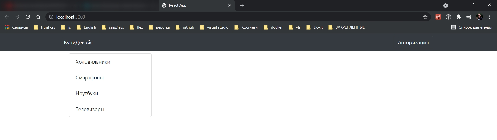

Теперь сделаем следующую логику при нажатии на какой-либо тип нам нужно будет его выделять. Но этот выделенный тип нам соответственно где-то нужно хранить. Поэтому в **DeviceStore** добавляю новое поле и называю его **\_selectedType** и по умолчанию это будет пустой объект.

И создаю сразу же **action** **setSelectedType** в котором мы в это поле type будем присваивать значение.

И сразу же делаем геттер

```js
// store deviceStore.js

import { makeAutoObservable } from 'mobx';

export default class deviceStore {
  constructor() {
    this._types = [
      { id: 1, name: 'Холодильники' },
      { id: 2, name: 'Смартфоны' },
      { id: 3, name: 'Ноутбуки' },
      { id: 4, name: 'Телевизоры' },
    ];
    this._brands = [
      { id: 1, name: 'Samsung' },
      { id: 2, name: 'Apple' },
    ];
    this._devices = [
      {
        id: 1,
        name: 'Iphone 12 pro',
        price: 2500,
        rating: 5,
        img: 'https://static.21vek.by/img/galleries/6240/333/iphone12pro128gbmgmn3_apple_5f9bdbcc46c7c.jpeg',
      },
      {
        id: 2,
        name: 'Iphone 12 pro',
        price: 2500,
        rating: 5,
        img: 'https://static.21vek.by/img/galleries/6240/333/iphone12pro128gbmgmn3_apple_5f9bdbcc46c7c.jpeg',
      },
      {
        id: 3,
        name: 'Iphone 12 pro',
        price: 2500,
        rating: 5,
        img: 'https://static.21vek.by/img/galleries/6240/333/iphone12pro128gbmgmn3_apple_5f9bdbcc46c7c.jpeg',
      },
      {
        id: 4,
        name: 'Iphone 12 pro',
        price: 2500,
        rating: 5,
        img: 'https://static.21vek.by/img/galleries/6240/333/iphone12pro128gbmgmn3_apple_5f9bdbcc46c7c.jpeg',
      },
      {
        id: 5,
        name: 'Iphone 12 pro',
        price: 2500,
        rating: 5,
        img: 'https://static.21vek.by/img/galleries/6240/333/iphone12pro128gbmgmn3_apple_5f9bdbcc46c7c.jpeg',
      },
    ];
    this._selectedType = {};
    makeAutoObservable(this);
  }

  // изменяю
  setTypes(types) {
    this._types = types;
  }

  setBrands(brands) {
    this._brands = brands;
  }

  setDevices(devices) {
    this._devices = devices;
  }

  setSelectedType(type) {
    this._selectedType = type;
  }

  // получаю данные
  get types() {
    return this._types;
  }

  get brands() {
    return this._brands;
  }

  get devices() {
    return this._brands;
  }
  get selectedType() {
    return this._selectedType;
  }
}
```

Возвращаемся в компонент **TypeBar**. И добавляю слушатель события клика на **ListGroup.Item**. И так же добавляю **active={type.id === device.selectedType.id}** т.е. если **id** типа элемента итерации совпадает с типом который мы сохранили в **store**, то тогда он будет активным.

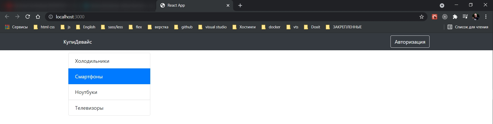

```js
import React, { useContext } from 'react';
import { ListGroup } from 'react-bootstrap';
import { observer } from 'mobx-react-lite';
import { Context } from '../index';

const TypeBar = observer(() => {
  const { device } = useContext(Context);
  return (
    <ListGroup>
      {device._types.map((type) => (
        <ListGroup.Item
          style={{ cursor: 'pointer' }}
          active={type.id === device.selectedType.id}
          onClick={() => device.setSelectedType(type)}
          key={type.id}
        >
          {type.name}
        </ListGroup.Item>
      ))}
    </ListGroup>
  );
});

export default TypeBar;
```

Теперь создадим панельку с брендами **BrandBar.js**

```js
import React from 'react';
import { observer } from 'mobx-react-lite';

const BrandBar = observer(() => {
  return <div></div>;
});

export default BrandBar;
```

Так же получаю device из store

```js
import React, { useContext } from 'react';
import { Row, Card } from 'react-bootstrap';
import { Context } from '../index';
import { observer } from 'mobx-react-lite';

const BrandBar = observer(() => {
  const { device } = useContext(Context);
  return (
    <Row className="d-flex">
      {device._brands.map((brand) => (
        <Card key={brand.id} className="p-3">
          {brand.name}
        </Card>
      ))}
    </Row>
  );
});

export default BrandBar;
```

Перейдем в **Shop** и уже во второй колонке этот **BrandBar** добавляем.

```js
//pages Shop.js
import React from 'react';
import { Container, Row, Col } from 'react-bootstrap';
import TypeBar from '../components/TypeBar';
import BrandBar from '../components/BrandBar';

const Shop = () => {
  return (
    <Container>
      <Row className="mt-2">
        <Col md={3}>
          <TypeBar />
        </Col>
        <Col md={9}>
          <BrandBar />
        </Col>
      </Row>
    </Container>
  );
};

export default Shop;
```

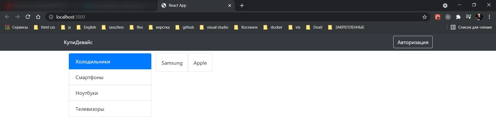

Осталось их сделать кликабельными.

Открываю deviceStore. Создаю поле **\_selectedBrand** в который так же помещаю пустой объект.

Создаю action **setSelectedBrand**.

И так же геттер.

```js
// store deviceStore.js

import { makeAutoObservable } from 'mobx';

export default class deviceStore {
  constructor() {
    this._types = [
      { id: 1, name: 'Холодильники' },
      { id: 2, name: 'Смартфоны' },
      { id: 3, name: 'Ноутбуки' },
      { id: 4, name: 'Телевизоры' },
    ];
    this._brands = [
      { id: 1, name: 'Samsung' },
      { id: 2, name: 'Apple' },
    ];
    this._devices = [
      {
        id: 1,
        name: 'Iphone 12 pro',
        price: 2500,
        rating: 5,
        img: 'https://static.21vek.by/img/galleries/6240/333/iphone12pro128gbmgmn3_apple_5f9bdbcc46c7c.jpeg',
      },
      {
        id: 2,
        name: 'Iphone 12 pro',
        price: 2500,
        rating: 5,
        img: 'https://static.21vek.by/img/galleries/6240/333/iphone12pro128gbmgmn3_apple_5f9bdbcc46c7c.jpeg',
      },
      {
        id: 3,
        name: 'Iphone 12 pro',
        price: 2500,
        rating: 5,
        img: 'https://static.21vek.by/img/galleries/6240/333/iphone12pro128gbmgmn3_apple_5f9bdbcc46c7c.jpeg',
      },
      {
        id: 4,
        name: 'Iphone 12 pro',
        price: 2500,
        rating: 5,
        img: 'https://static.21vek.by/img/galleries/6240/333/iphone12pro128gbmgmn3_apple_5f9bdbcc46c7c.jpeg',
      },
      {
        id: 5,
        name: 'Iphone 12 pro',
        price: 2500,
        rating: 5,
        img: 'https://static.21vek.by/img/galleries/6240/333/iphone12pro128gbmgmn3_apple_5f9bdbcc46c7c.jpeg',
      },
    ];
    this._selectedType = {};
    this._selectedBrand = {};
    makeAutoObservable(this);
  }

  // изменяю
  setTypes(types) {
    this._types = types;
  }

  setBrands(brands) {
    this._brands = brands;
  }

  setDevices(devices) {
    this._devices = devices;
  }

  setSelectedType(type) {
    this._selectedType = type;
  }

  setSelectedBrand(brand) {
    this._selectedBrand = brand;
  }

  // получаю данные
  get types() {
    return this._types;
  }

  get brands() {
    return this._brands;
  }

  get devices() {
    return this._brands;
  }
  get selectedType() {
    return this._selectedType;
  }
  get selectedBrand() {
    return this._selectedBrand;
  }
}
```

Возвращаюсь в **BrandBar**. По аналогии вешаю слушатель события нажатия кнопки мыши.

```js
import React, { useContext } from 'react';
import { Row, Card } from 'react-bootstrap';
import { Context } from '../index';
import { observer } from 'mobx-react-lite';

const BrandBar = observer(() => {
  const { device } = useContext(Context);
  return (
    <Row className="d-flex">
      {device._brands.map((brand) => (
        <Card
          key={brand.id}
          className="p-3"
          onClick={() => device.setSelectedBrand(brand)}
          border={brand.id === device.selectedBrand.id ? 'danger' : 'light'}
          style={{ cursor: 'pointer' }}
        >
          {brand.name}
        </Card>
      ))}
    </Row>
  );
});

export default BrandBar;
```

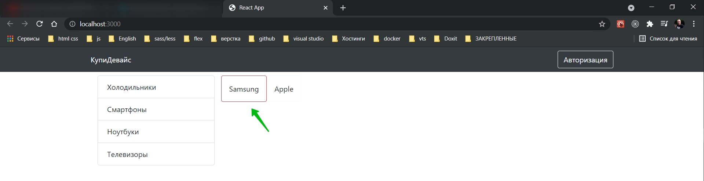

```js
// store deviceStore.js

import { makeAutoObservable } from 'mobx';

export default class deviceStore {
  constructor() {
    this._types = [
      { id: 1, name: 'Холодильники' },
      { id: 2, name: 'Смартфоны' },
      { id: 3, name: 'Ноутбуки' },
      { id: 4, name: 'Телевизоры' },
    ];
    this._brands = [
      { id: 1, name: 'Samsung' },
      { id: 2, name: 'Apple' },
      { id: 3, name: 'Lenovo' },
      { id: 4, name: 'Asus' },
    ];
    this._devices = [
      {
        id: 1,
        name: 'Iphone 12 pro',
        price: 2500,
        rating: 5,
        img: 'https://static.21vek.by/img/galleries/6240/333/iphone12pro128gbmgmn3_apple_5f9bdbcc46c7c.jpeg',
      },
      {
        id: 2,
        name: 'Iphone 12 pro',
        price: 2500,
        rating: 5,
        img: 'https://static.21vek.by/img/galleries/6240/333/iphone12pro128gbmgmn3_apple_5f9bdbcc46c7c.jpeg',
      },
      {
        id: 3,
        name: 'Iphone 12 pro',
        price: 2500,
        rating: 5,
        img: 'https://static.21vek.by/img/galleries/6240/333/iphone12pro128gbmgmn3_apple_5f9bdbcc46c7c.jpeg',
      },
      {
        id: 4,
        name: 'Iphone 12 pro',
        price: 2500,
        rating: 5,
        img: 'https://static.21vek.by/img/galleries/6240/333/iphone12pro128gbmgmn3_apple_5f9bdbcc46c7c.jpeg',
      },
      {
        id: 5,
        name: 'Iphone 12 pro',
        price: 2500,
        rating: 5,
        img: 'https://static.21vek.by/img/galleries/6240/333/iphone12pro128gbmgmn3_apple_5f9bdbcc46c7c.jpeg',
      },
    ];
    this._selectedType = {};
    this._selectedBrand = {};
    makeAutoObservable(this);
  }

  // изменяю
  setTypes(types) {
    this._types = types;
  }

  setBrands(brands) {
    this._brands = brands;
  }

  setDevices(devices) {
    this._devices = devices;
  }

  setSelectedType(type) {
    this._selectedType = type;
  }

  setSelectedBrand(brand) {
    this._selectedBrand = brand;
  }

  // получаю данные
  get types() {
    return this._types;
  }

  get brands() {
    return this._brands;
  }

  get devices() {
    return this._brands;
  }
  get selectedType() {
    return this._selectedType;
  }
  get selectedBrand() {
    return this._selectedBrand;
  }
}
```

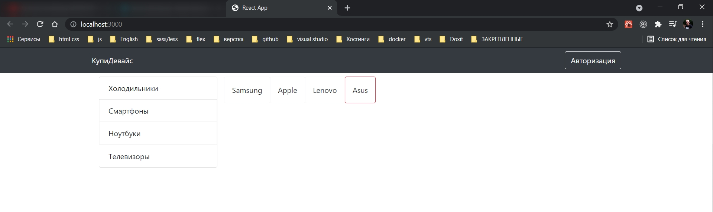

Теперь займемся списком товаров.

Создаю новый компонент и называю его **deviceList.js**.

```js
// components DeviceList.js
import React, { useContext } from 'react';
import { observer } from 'mobx-react-lite';
import { Row } from 'react-bootstrap';
import { Context } from '../index';

const DeviceList = observer(() => {
  const { device } = useContext(Context);
  return <Row className="d-flex">
    {device._devices.map(device=>)}
  </Row>;
});

export default DeviceList;
```

И для каждого устройства будем отрисовывать компонент который назовем **DeviceItem**

```js
import React from 'react';
import { Col } from 'react-bootstrap';

const DeviceItem = () => {
  return <Col md={3}></Col>;
};

export default DeviceItem;
```

Возвращать отсюда будем компонент колонки т.е. **Col**. И занимать она будет 3 столбца. Т.е. в строке должно помещаться 4 ре естройства.

```js
// components DeviceList.js
import React, { useContext } from 'react';
import { observer } from 'mobx-react-lite';
import { Row } from 'react-bootstrap';
import { Context } from '../index';
import DeviceItem from './DeviceItem';

const DeviceList = observer(() => {
  const { device } = useContext(Context);
  return (
    <Row className="d-flex">
      {device._devices.map((device) => (
        <DeviceItem key={device.id} device={device} />
      ))}
    </Row>
  );
});

export default DeviceList;
```

```js
import React from 'react';
import { Col } from 'react-bootstrap';

const DeviceItem = ({ device }) => {
  return <Col md={3}>item</Col>;
};

export default DeviceItem;
```

Перехожу в **Shop** и добавляю **DeviceList**

```js
//pages Shop.js
import React from 'react';
import { Container, Row, Col } from 'react-bootstrap';
import TypeBar from '../components/TypeBar';
import BrandBar from '../components/BrandBar';
import DeviceList from '../components/DeviceList';

const Shop = () => {
  return (
    <Container>
      <Row className="mt-2">
        <Col md={3}>
          <TypeBar />
        </Col>
        <Col md={9}>
          <BrandBar />
          <DeviceList />
        </Col>
      </Row>
    </Container>
  );
};

export default Shop;
```

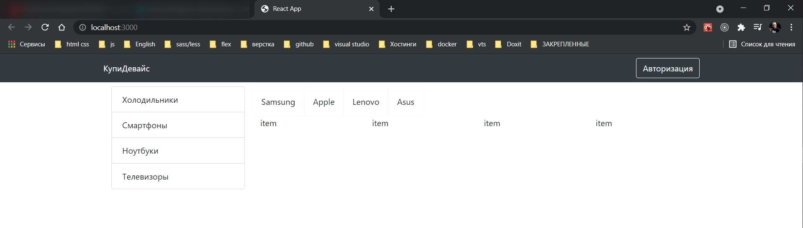

Теперь перехожу к самому компоненту **DeviceItem** и сделаю картинку, название.

Оборачиваю все в **Card** что бы появилась рамка.

```js
import React from 'react';
import { Col, Card, Image } from 'react-bootstrap';

const DeviceItem = ({ device }) => {
  return (
    <Col md={3}>
      <Card style={{ width: 150, cursor: 'pointer', border: 'light' }}>
        <Image width={150} height={150} src={device.img} />
        <div>
          <div>Samsung...</div>
        </div>
        <div>
          <div>{device.rating}</div>
        </div>
      </Card>
    </Col>
  );
};

export default DeviceItem;
```

Из макета фигмы экспортирую звездочку. В корне **client** создаю папку **assets** и сюда эту **star.png** сохраняю.

```js
import React from 'react';
import { Col, Card, Image } from 'react-bootstrap';
import star from '../assets/star.png';

const DeviceItem = ({ device }) => {
  return (
    <Col md={3}>
      <Card style={{ width: 150, cursor: 'pointer', border: 'light' }}>
        <Image width={150} height={150} src={device.img} />
        <div>
          <div>Samsung...</div>
        </div>
        <div>
          <div>{device.rating}</div>
          <Image src={star} />
        </div>
      </Card>
    </Col>
  );
};

export default DeviceItem;
```

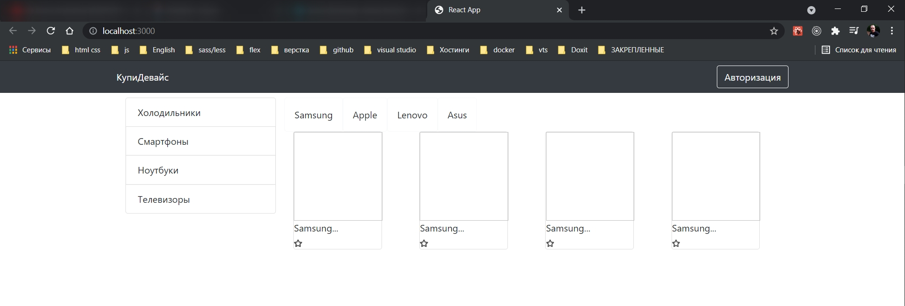

Теперь это все нужно выровнять в одну строку

```js
import React from 'react';
import { Col, Card, Image } from 'react-bootstrap';
import star from '../assets/star.png';

const DeviceItem = ({ device }) => {
  return (
    <Col md={3}>
      <Card style={{ width: 150, cursor: 'pointer', border: 'light' }}>
        <Image width={150} height={150} src={device.img} />
        <div className="d-flex justify-content-lg-between align-items-center">
          <div>Samsung...</div>
          <div>
            <div>{device.rating}</div>
            <Image src={star} />
          </div>
        </div>
      </Card>
    </Col>
  );
};

export default DeviceItem;
```

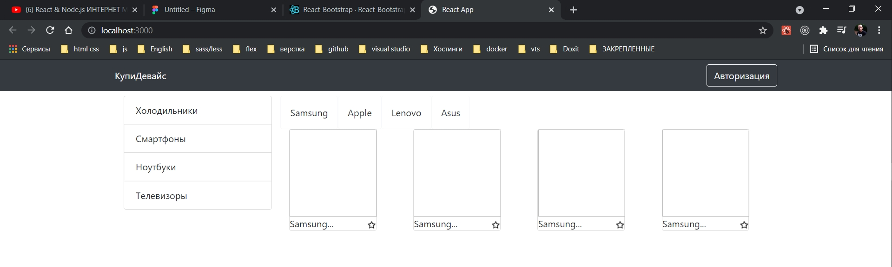

```js
import React from 'react';
import { Col, Card, Image } from 'react-bootstrap';
import star from '../assets/star.png';

const DeviceItem = ({ device }) => {
  // console.log('device', device);
  return (
    <Col md={3} className="mt-3">
      <Card style={{ width: 150, cursor: 'pointer', border: 'light' }}>
        <Image width={150} height={150} src={device.img} />
        <div className=" text-black-50 mt-1 d-flex justify-content-lg-between align-items-center">
          <div>Samsung...</div>
          <div>
            <div>{device.rating}</div>
            <Image width={18} height={18} src={star} />
          </div>
        </div>
        <div>{device.name}</div>
      </Card>
    </Col>
  );
};

export default DeviceItem;
```

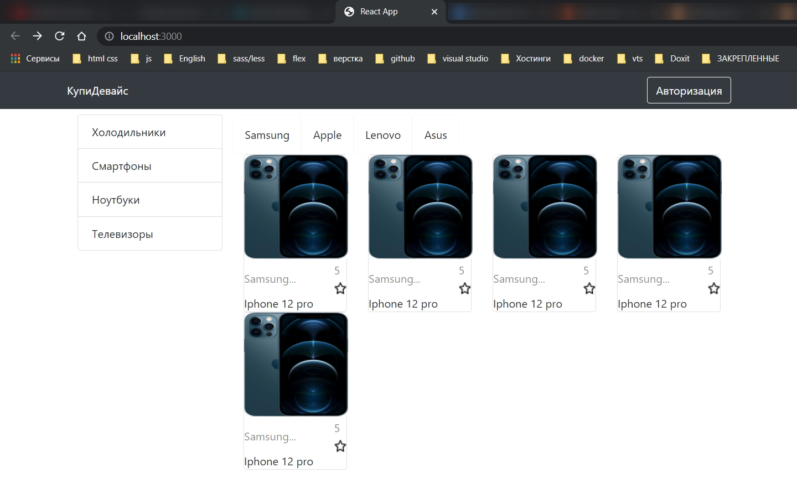

А сейчас мы сделаем наши устройства кликабельными что бы переходить на страницу детального просмотра. Для этого воспользуемся хуком **useHistory**. Его мы импортируем из **react-router-dom**. С помощью него можно динамически передвигатся по страницам. У нее есть функция **push** с помощью которой можно переходить на конкретную страницу.

```js
import React from 'react';
import { useHistory } from 'react-router-dom';
import { Col, Card, Image } from 'react-bootstrap';
import star from '../assets/star.png';
import { DEVICE_ROUTE } from '../utils/consts';

const DeviceItem = ({ device }) => {
  const history = useHistory();

  console.log(history);

  return (
    <Col
      md={3}
      className="mt-3"
      onClick={() => history.push(DEVICE_ROUTE + '/' + device.id)}
    >
      <Card style={{ width: 150, cursor: 'pointer', border: 'light' }}>
        <Image width={150} height={150} src={device.img} />
        <div className=" text-black-50 mt-1 d-flex justify-content-lg-between align-items-center">
          <div>Samsung...</div>
          <div>
            <div>{device.rating}</div>
            <Image width={18} height={18} src={star} />
          </div>
        </div>
        <div>{device.name}</div>
      </Card>
    </Col>
  );
};

export default DeviceItem;
```

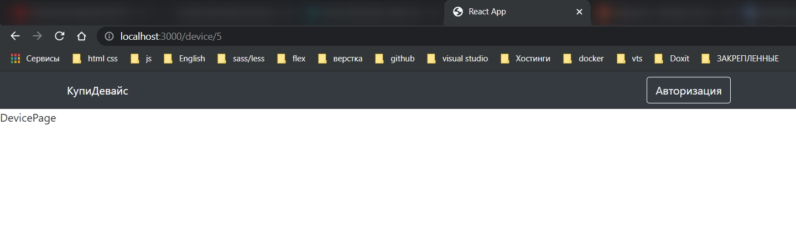

Теперь при клике на карточку попадаю на страницу конкретного **device**. В **url** появляется нужный **id** нужного товара. Затем мы будем этот **id** отлавливать, делать запрос на сервер и получать данные о товаре.
