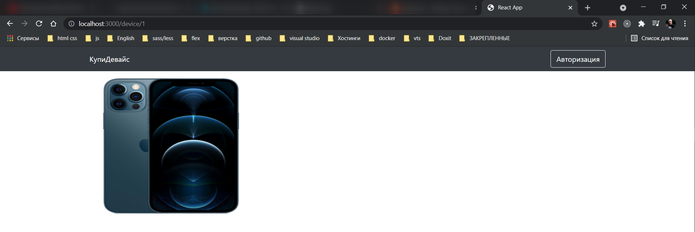
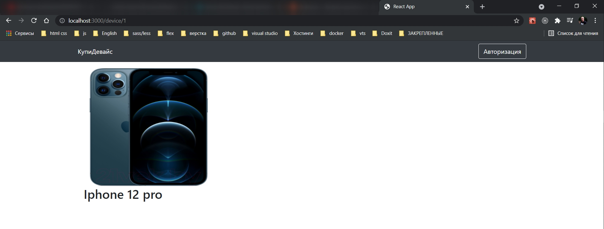
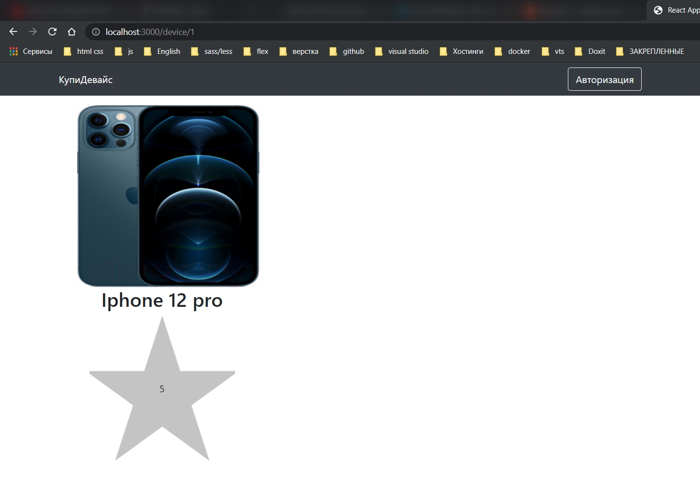
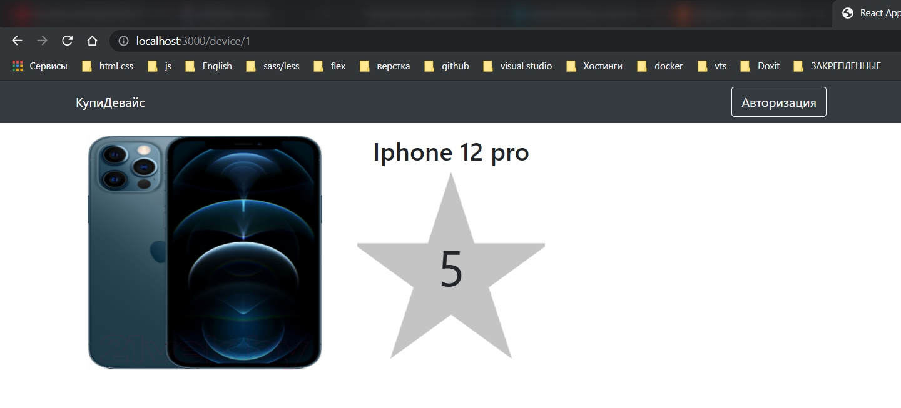
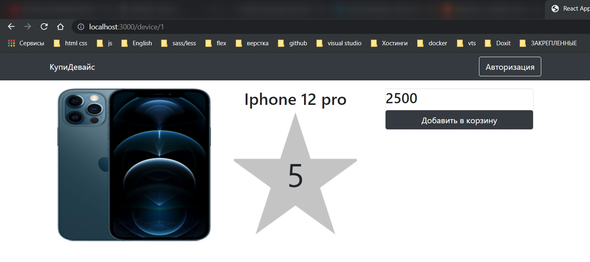
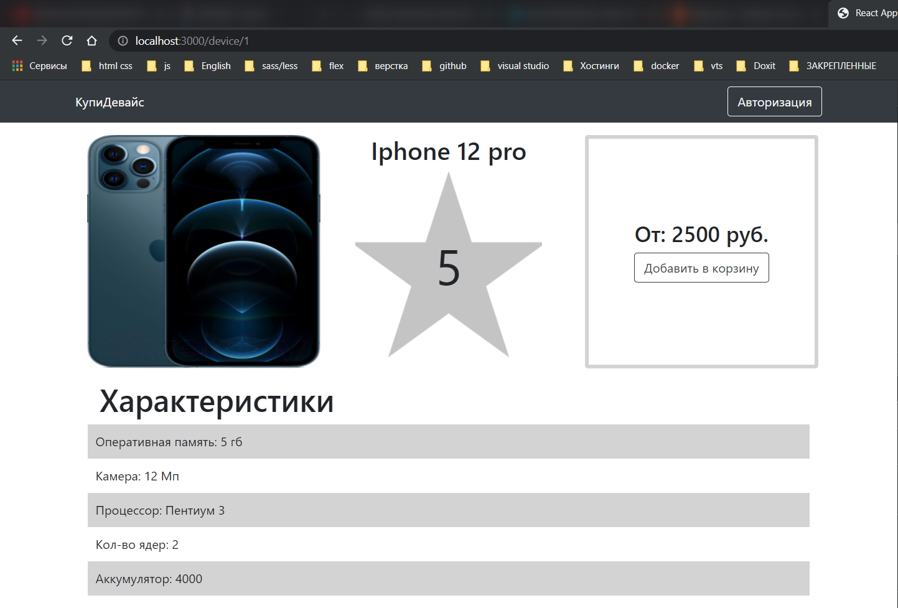

# Страница просмотра товара и его характеристик

Теперь займемся **DevicePage.js**.

```js
// pages DevicePage
import React from 'react';
import { Container, Col } from 'react-bootstrap';

const DevicePage = () => {
  return (
    <Container>
      <Col md={4}></Col>
      <Col md={4}></Col>
      <Col md={4}></Col>
    </Container>
  );
};

export default DevicePage;
```

создаю константу заглушку.

```js
// pages DevicePage
import React from 'react';
import { Container, Col } from 'react-bootstrap';

const DevicePage = () => {
  const device = {
    id: 1,
    name: 'Iphone 12 pro',
    price: 2500,
    rating: 5,
    img: 'https://static.21vek.by/img/galleries/6240/333/iphone12pro128gbmgmn3_apple_5f9bdbcc46c7c.jpeg',
  };
  return (
    <Container>
      <Col md={4}></Col>
      <Col md={4}></Col>
      <Col md={4}></Col>
    </Container>
  );
};

export default DevicePage;
```

В первую колонку добавляю компонент **Image**.

```js
// pages DevicePage
import React from 'react';
import { Container, Col, Image } from 'react-bootstrap';

const DevicePage = () => {
  const device = {
    id: 1,
    name: 'Iphone 12 pro',
    price: 2500,
    rating: 5,
    img: 'https://static.21vek.by/img/galleries/6240/333/iphone12pro128gbmgmn3_apple_5f9bdbcc46c7c.jpeg',
  };
  return (
    <Container className="mt-3">
      <Col md={4}>
        <Image width={300} height={300} src={device.img} />
      </Col>
      <Col md={4}></Col>
      <Col md={4}></Col>
    </Container>
  );
};

export default DevicePage;
```



Теперь нужно сделать звездочку с райтингом и вывести название устройства. Во вторую колонку добавляю Row. Внутри **h2**

```js
// pages DevicePage
import React from 'react';
import { Container, Col, Image, Row } from 'react-bootstrap';

const DevicePage = () => {
  const device = {
    id: 1,
    name: 'Iphone 12 pro',
    price: 2500,
    rating: 5,
    img: 'https://static.21vek.by/img/galleries/6240/333/iphone12pro128gbmgmn3_apple_5f9bdbcc46c7c.jpeg',
  };
  return (
    <Container className="mt-3">
      <Col md={4}>
        <Image width={300} height={300} src={device.img} />
      </Col>
      <Col md={4}>
        <Row>
          <h2>{device.name}</h2>
        </Row>
      </Col>
      <Col md={4}></Col>
    </Container>
  );
};

export default DevicePage;
```



Далее делаю звездочку.

```js
// pages DevicePage
import React from 'react';
import { Container, Col, Image, Row } from 'react-bootstrap';
import bigStar from '../assets/bigStar.png';

const DevicePage = () => {
  const device = {
    id: 1,
    name: 'Iphone 12 pro',
    price: 2500,
    rating: 5,
    img: 'https://static.21vek.by/img/galleries/6240/333/iphone12pro128gbmgmn3_apple_5f9bdbcc46c7c.jpeg',
  };
  return (
    <Container className="mt-3">
      <Col md={4}>
        <Image width={300} height={300} src={device.img} />
      </Col>
      <Col md={4}>
        <Row className="d-flex flex-column align-items-center">
          <h2>{device.name}</h2>
          <div
            className="d-flex align-items-center justify-content-lg-center"
            style={{
              background: `url(${bigStar}) no-repeat center center`,
              width: 240,
              height: 240,
              backgroundSize: 'cover',
            }}
          >
            {device.rating}
          </div>
        </Row>
      </Col>
      <Col md={4}></Col>
    </Container>
  );
};

export default DevicePage;
```



Что бы колонки не переходили на новую строку обернем их все в **Row**.

```js
// pages DevicePage
import React from 'react';
import { Container, Col, Image, Row } from 'react-bootstrap';
import bigStar from '../assets/bigStar.png';

const DevicePage = () => {
  const device = {
    id: 1,
    name: 'Iphone 12 pro',
    price: 2500,
    rating: 5,
    img: 'https://static.21vek.by/img/galleries/6240/333/iphone12pro128gbmgmn3_apple_5f9bdbcc46c7c.jpeg',
  };
  return (
    <Container className="mt-3">
      <Row>
        <Col md={4}>
          <Image width={300} height={300} src={device.img} />
        </Col>
        <Col md={4}>
          <Row className="d-flex flex-column align-items-center">
            <h2>{device.name}</h2>
            <div
              className="d-flex align-items-center justify-content-lg-center"
              style={{
                background: `url(${bigStar}) no-repeat center center`,
                width: 240,
                height: 240,
                backgroundSize: 'cover',
                fontSize: 64,
              }}
            >
              {device.rating}
            </div>
          </Row>
        </Col>
        <Col md={4}></Col>
      </Row>
    </Container>
  );
};

export default DevicePage;
```



Добавляю кнопку Добавить в корзину.

Внутрь третьей колонки добавляю карточку. В нутри добавляю **h3** с ценой.

```js
// pages DevicePage
import React from 'react';
import { Container, Col, Image, Row, Card, Button } from 'react-bootstrap';
import bigStar from '../assets/bigStar.png';

const DevicePage = () => {
  const device = {
    id: 1,
    name: 'Iphone 12 pro',
    price: 2500,
    rating: 5,
    img: 'https://static.21vek.by/img/galleries/6240/333/iphone12pro128gbmgmn3_apple_5f9bdbcc46c7c.jpeg',
  };
  return (
    <Container className="mt-3">
      <Row>
        <Col md={4}>
          <Image width={300} height={300} src={device.img} />
        </Col>
        <Col md={4}>
          <Row className="d-flex flex-column align-items-center">
            <h2>{device.name}</h2>
            <div
              className="d-flex align-items-center justify-content-lg-center"
              style={{
                background: `url(${bigStar}) no-repeat center center`,
                width: 240,
                height: 240,
                backgroundSize: 'cover',
                fontSize: 64,
              }}
            >
              {device.rating}
            </div>
          </Row>
        </Col>
        <Col md={4}>
          <Card>
            <h3>{device.price}</h3>
            <Button variant={'outline-dark'}>Добавить в корзину</Button>
          </Card>
        </Col>
      </Row>
    </Container>
  );
};

export default DevicePage;
```



На саму карточку добавляю стили.

```js
// pages DevicePage
import React from 'react';
import { Container, Col, Image, Row, Card, Button } from 'react-bootstrap';
import bigStar from '../assets/bigStar.png';

const DevicePage = () => {
  const device = {
    id: 1,
    name: 'Iphone 12 pro',
    price: 2500,
    rating: 5,
    img: 'https://static.21vek.by/img/galleries/6240/333/iphone12pro128gbmgmn3_apple_5f9bdbcc46c7c.jpeg',
  };
  return (
    <Container className="mt-3">
      <Row>
        <Col md={4}>
          <Image width={300} height={300} src={device.img} />
        </Col>
        <Col md={4}>
          <Row className="d-flex flex-column align-items-center">
            <h2>{device.name}</h2>
            <div
              className="d-flex align-items-center justify-content-lg-center"
              style={{
                background: `url(${bigStar}) no-repeat center center`,
                width: 240,
                height: 240,
                backgroundSize: 'cover',
                fontSize: 64,
              }}
            >
              {device.rating}
            </div>
          </Row>
        </Col>
        <Col md={4}>
          <Card
            className="d-flex flex-column align-items-center justify-content-center"
            style={{
              width: 300,
              height: 300,
              fontSize: 32,
              border: '5px solid lightgray',
            }}
          >
            <h3>От:{device.price} руб.</h3>
            <Button variant={'outline-dark'}>Добавить в корзину</Button>
          </Card>
        </Col>
      </Row>
    </Container>
  );
};

export default DevicePage;
```


Осталось сделать характеристики.

Под характеристики создадим отдельный массив. Чуть позже мы все это будем получать с **backend**.

```js
// pages DevicePage
import React from 'react';
import { Container, Col, Image, Row, Card, Button } from 'react-bootstrap';
import bigStar from '../assets/bigStar.png';

const DevicePage = () => {
  const device = {
    id: 1,
    name: 'Iphone 12 pro',
    price: 2500,
    rating: 5,
    img: 'https://static.21vek.by/img/galleries/6240/333/iphone12pro128gbmgmn3_apple_5f9bdbcc46c7c.jpeg',
  };

  const description = [
    { id: 1, title: 'Оперативная память', description: '5 гб' },
    { id: 2, title: 'Камера', description: '12 Мп' },
    { id: 3, title: 'Процессор', description: 'Пентиум 3' },
    { id: 4, title: 'Кол-во ядер', description: '2' },
    { id: 5, title: 'Аккумулятор', description: '4000' },
  ];

  return (
    <Container className="mt-3">
      <Row>
        <Col md={4}>
          <Image width={300} height={300} src={device.img} />
        </Col>
        <Col md={4}>
          <Row className="d-flex flex-column align-items-center">
            <h2>{device.name}</h2>
            <div
              className="d-flex align-items-center justify-content-lg-center"
              style={{
                background: `url(${bigStar}) no-repeat center center`,
                width: 240,
                height: 240,
                backgroundSize: 'cover',
                fontSize: 64,
              }}
            >
              {device.rating}
            </div>
          </Row>
        </Col>
        <Col md={4}>
          <Card
            className="d-flex flex-column align-items-center justify-content-center"
            style={{
              width: 300,
              height: 300,
              fontSize: 32,
              border: '5px solid lightgray',
            }}
          >
            <h3>От: {device.price} руб.</h3>
            <Button variant={'outline-dark'}>Добавить в корзину</Button>
          </Card>
        </Col>
      </Row>
    </Container>
  );
};

export default DevicePage;
```

В самый низ контейнера добавляем еще одну строку

```js
// pages DevicePage
import React from 'react';
import { Container, Col, Image, Row, Card, Button } from 'react-bootstrap';
import bigStar from '../assets/bigStar.png';

const DevicePage = () => {
  const device = {
    id: 1,
    name: 'Iphone 12 pro',
    price: 2500,
    rating: 5,
    img: 'https://static.21vek.by/img/galleries/6240/333/iphone12pro128gbmgmn3_apple_5f9bdbcc46c7c.jpeg',
  };

  const description = [
    { id: 1, title: 'Оперативная память', description: '5 гб' },
    { id: 2, title: 'Камера', description: '12 Мп' },
    { id: 3, title: 'Процессор', description: 'Пентиум 3' },
    { id: 4, title: 'Кол-во ядер', description: '2' },
    { id: 5, title: 'Аккумулятор', description: '4000' },
  ];

  return (
    <Container className="mt-3">
      <Row>
        <Col md={4}>
          <Image width={300} height={300} src={device.img} />
        </Col>
        <Col md={4}>
          <Row className="d-flex flex-column align-items-center">
            <h2>{device.name}</h2>
            <div
              className="d-flex align-items-center justify-content-lg-center"
              style={{
                background: `url(${bigStar}) no-repeat center center`,
                width: 240,
                height: 240,
                backgroundSize: 'cover',
                fontSize: 64,
              }}
            >
              {device.rating}
            </div>
          </Row>
        </Col>
        <Col md={4}>
          <Card
            className="d-flex flex-column align-items-center justify-content-center"
            style={{
              width: 300,
              height: 300,
              fontSize: 32,
              border: '5px solid lightgray',
            }}
          >
            <h3>От: {device.price} руб.</h3>
            <Button variant={'outline-dark'}>Добавить в корзину</Button>
          </Card>
        </Col>
      </Row>
      <Row className="d-flex flex-column m-3">
        <h1>Характеристики</h1>
        {description.map((info, index) => (
          <Row
            key={info.id}
            style={{
              background: index % 2 === 0 ? 'lightgray' : 'transparent',
              padding: 10,
            }}
          >
            {info.title}: {info.description}
          </Row>
        ))}
      </Row>
    </Container>
  );
};

export default DevicePage;
```


