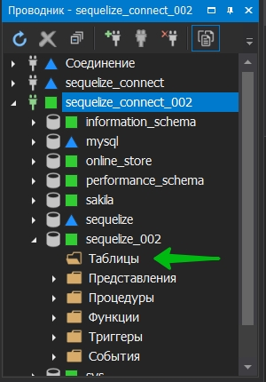
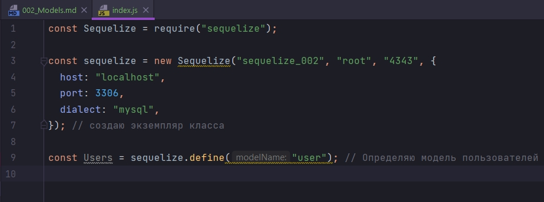
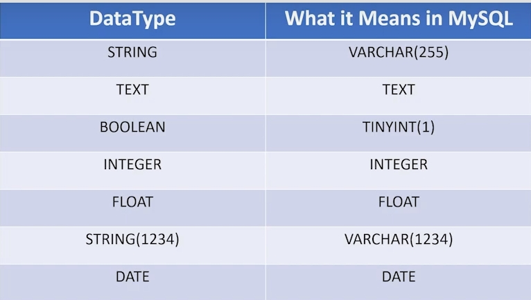
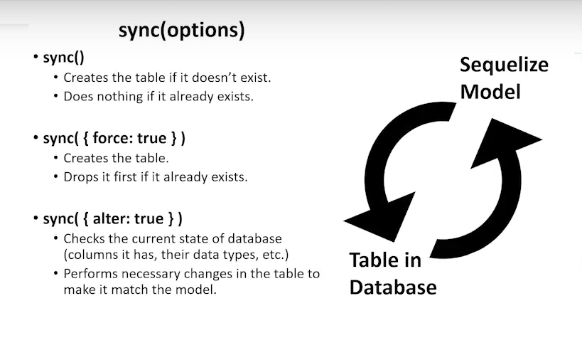
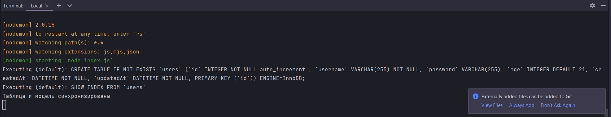
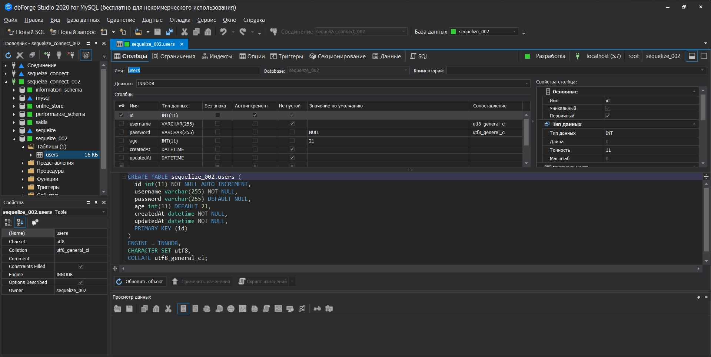
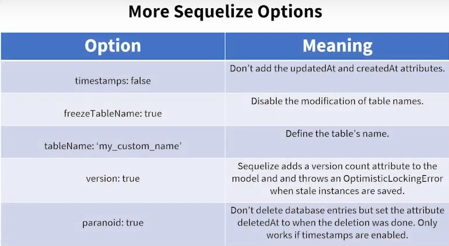
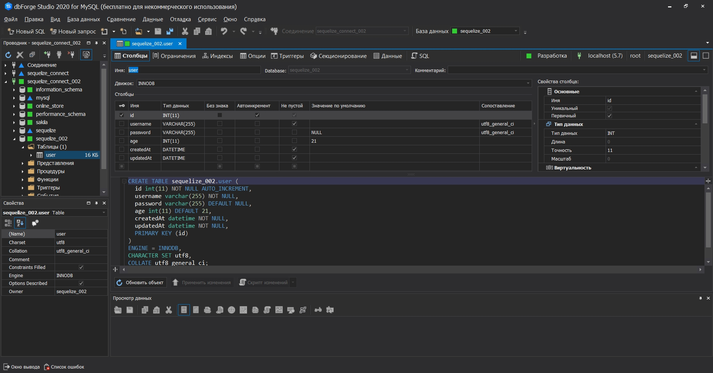
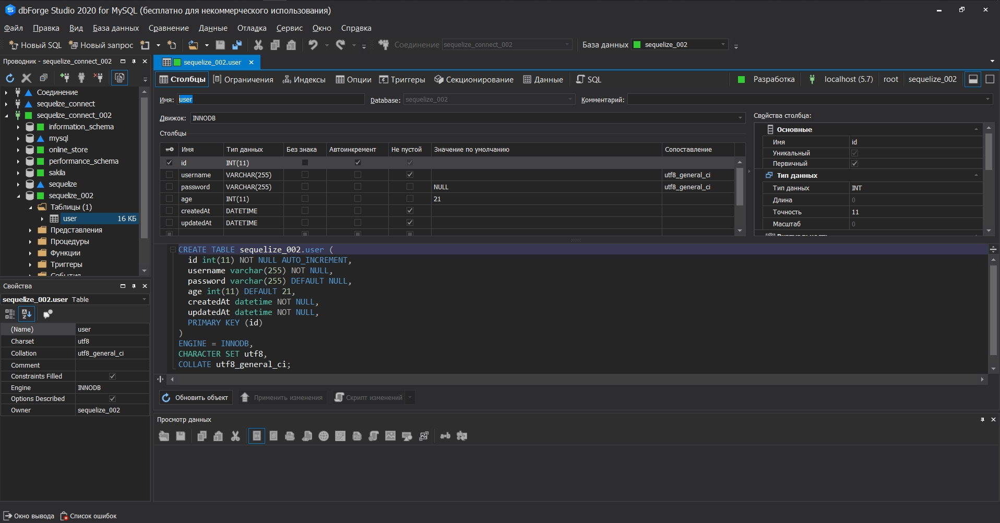
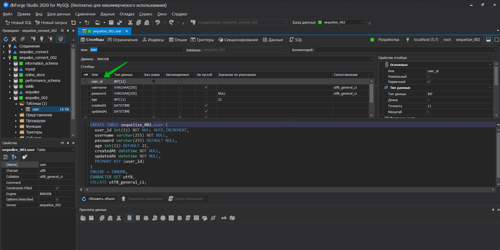

# Модели

* [Creating_a_Model_with_Define()](Creating_a_Model_with_Define())
* [Sync()](Sync())
* [Drop()](Drop())


# Creating_a_Model_with_Define

В sequelize модель представляет собой таблицу в нашей БД. По этому здесь например в нашей схеме у нас есть таблицы



В sequelize мы можем использовать объект для представления таблиц. 

Модель информирует sequelize о таблице, которую он представляет. Например имя таблицы, имя ее столбцов, типы данных столбцов и т.д. По сути это означает что вы можете взаимодействовать с таблицей в своей БД, используя sequelize.

Возвращаюсь в index.js. Удаляю подключение к БД т.к. я уже знаю что я могу успешно подключиться.

Создаю переменную и называю ее  Users. По сути это будет таблица users для нашего приложения. Определить таблицу я могу таким вот образом.

```js
const Sequelize = require("sequelize");

const sequelize = new Sequelize("sequelize_002", "root", "4343", {
  host: "localhost",
  port: 3306,
  dialect: "mysql",
}); // создаю экземпляр класса

const Users = sequelize.define(); // Определяю модель пользователей

```

Это означает что мы хотим в нашей БД создать таблицу users.

Метод define принимает три аргумента.

- name т.е. имя таблицы которая является строкой.

Передаю имя user. Sequelize позже переделает это во множественном числе и создаст таблицу users.

```js
const Sequelize = require("sequelize");

const sequelize = new Sequelize("sequelize_002", "root", "4343", {
  host: "localhost",
  port: 3306,
  dialect: "mysql",
}); // создаю экземпляр класса

const Users = sequelize.define("user"); // Определяю модель пользователей

```

IDE подсказывает 



- Второй атрибут или второй аргумент - это атрибуты модели, такие как столбцы. И он определяется как объект.

```js
const Sequelize = require("sequelize");

const sequelize = new Sequelize("sequelize_002", "root", "4343", {
  host: "localhost",
  port: 3306,
  dialect: "mysql",
}); // создаю экземпляр класса

const Users = sequelize.define("user", {
  username: {},
  password: {},
  age: {},
}); // Определяю модель пользователей

```

Каждый атрибут модели будет соответсвовать столбцу. По этому если мы создадим эту таблицу здесь, то у нас будет три столбца. 

Так как мы передаем атрибуты ввиде объекта мы можем передать определенные вещи, которые фактически определяют этот столбец. К примеру указываем что username это строка.



```js
const Sequelize = require("sequelize");

const sequelize = new Sequelize("sequelize_002", "root", "4343", {
  host: "localhost",
  port: 3306,
  dialect: "mysql",
}); // создаю экземпляр класса

const Users = sequelize.define("user", {
  username: {
    type: Sequelize.DataTypes.STRING,
  },
  password: {
    type: Sequelize.DataTypes.STRING,
  },
  age: {
    type: Sequelize.DataTypes.INTEGER,
  },
}); // Определяю модель пользователей

```

Так же я могу указывать и другие значения. К примеру что бы столбец пользователя не был пустым     allowNull: false,


```js
const Sequelize = require("sequelize");

const sequelize = new Sequelize("sequelize_002", "root", "4343", {
  host: "localhost",
  port: 3306,
  dialect: "mysql",
}); // создаю экземпляр класса

const Users = sequelize.define("user", {
  username: {
    type: Sequelize.DataTypes.STRING,
    allowNull: false,
  },
  password: {
    type: Sequelize.DataTypes.STRING,
  },
  age: {
    type: Sequelize.DataTypes.INTEGER,
  },
}); // Определяю модель пользователей

```

Так же я могу определять значения по умолчанию. К примеру для возраста я хочу что бы значение по умолчанию было 21

```js
const Sequelize = require("sequelize");

const sequelize = new Sequelize("sequelize_002", "root", "4343", {
  host: "localhost",
  port: 3306,
  dialect: "mysql",
}); // создаю экземпляр класса

const Users = sequelize.define("user", {
  username: {
    type: Sequelize.DataTypes.STRING,
    allowNull: false,
  },
  password: {
    type: Sequelize.DataTypes.STRING,
  },
  age: {
    type: Sequelize.DataTypes.INTEGER,
    defaultValue: 21,
  },
}); // Определяю модель пользователей

```

По сути это означает что если мы создаем пользователя, а он не предоставляет возраст, то просто давайте установим его значение в 21. 
  По умолчанию  sequelize предполагает что значение колонки имеет значение null. Если к примеру в поле password мы не указываем значение по умолчанию, то по умолчанию данной колонке будет присваиваться значение null.

Конечно есть еще огромное количество вариантов описания полей. Но мы их рассмотрим позже.

Для того что бы создать таблицу в БД не необходимо использовать синхронизацию. Для того что бы синхронизировать таблицу в БД с нашей моделью, необходимо использовать метод sync.



<br/>
<br/>
<br/>
<br/>

# Sync()

- создает таблицу, если она не существует
- ничего не делает, если оно уже существует

sync({force: true})
- Создает таблицу
- Сначало удалит если она уже существует

sync({alter: true})
- Проверит текущее состояие БД(столбцы которые есть и их типы данных)
- выполняет необходимые изменения в таблице, чтобы она соответствовала модели

Вызываю модель User. Далее у модели вызываю метод sync

```js
const Sequelize = require("sequelize");

const sequelize = new Sequelize("sequelize_002", "root", "4343", {
  host: "localhost",
  port: 3306,
  dialect: "mysql",
}); // создаю экземпляр класса

const User = sequelize.define("user", {
  username: {
    type: Sequelize.DataTypes.STRING,
    allowNull: false,
  },
  password: {
    type: Sequelize.DataTypes.STRING,
  },
  age: {
    type: Sequelize.DataTypes.INTEGER,
    defaultValue: 21,
  },
}); // Определяю модель пользователей

User.sync();

```

Метод sync так же возвращает promise(обежание). Практически каждый метод в sequelize использует promise

```js
const Sequelize = require("sequelize");

const sequelize = new Sequelize("sequelize_002", "root", "4343", {
  host: "localhost",
  port: 3306,
  dialect: "mysql",
}); // создаю экземпляр класса

const User = sequelize.define("user", {
  username: {
    type: Sequelize.DataTypes.STRING,
    allowNull: false,
  },
  password: {
    type: Sequelize.DataTypes.STRING,
  },
  age: {
    type: Sequelize.DataTypes.INTEGER,
    defaultValue: 21,
  },
}); // Определяю модель пользователей

User.sync()
  .then((data) => {
    console.log(`Таблица и модель синхронизированы`);
  })
  .catch((error) => {
    console.log(`Произошла ошибка при синхронизации таблицы и модели`);
  });

```



sync по сути это еще один способ записи sql




Первое что мы можем заметить это имя таблицы. Мы его объявляли совсем не так как нам сгенерировал sequelize. В БД это множественное число. Это связано с тем что sequelize автоматически формирует множественно число для имени модели и использует его в качестве имени таблицы. Это делается под капотом библиотеки. Называется это inflection.

Вот теперь самое время рассмотреть третий аргумент в нашей функции определения т.е. функции define(переводится как определять).

Третий аргумент по ути позволяет настроить нашу таблицу.

Для этого вручную удаляю таблицу из БД.



| Options  |    Значение   |
|:--------:|:-------------:|
|timestamp:false| Не добавляет атрибуты upDateAt и createAt|
|freezeTableName:true|Отключает изменение имен таблиц|
|tableName:'my_custom_name'|Определяет имя таблицы|
|version:true|sequelize добавляет атрибут количества версий в модель и выдает ошибку OptimisticLockingError при сохранении объектов состояния|
|paranoid:true|Не удаляет записи БД, но устанавливает для атрибута deleteAt значение, когда было выполнено удаление. Работает только в том случае когда метка времени включена|

Третиф аргумент так же является объектом. И по этому он позволяет нам еще больше настроить нашу таблицу. Например я хочу создавать имя таблици в нашей БД. И я хочу что бы имя совпадало с именем нашей модели. freezeTableName:true

```js
const Sequelize = require("sequelize");

const sequelize = new Sequelize("sequelize_002", "root", "4343", {
  host: "localhost",
  port: 3306,
  dialect: "mysql",
}); // создаю экземпляр класса

const User = sequelize.define(
  "user",
  {
    username: {
      type: Sequelize.DataTypes.STRING,
      allowNull: false,
    },
    password: {
      type: Sequelize.DataTypes.STRING,
    },
    age: {
      type: Sequelize.DataTypes.INTEGER,
      defaultValue: 21,
    },
  },
  {
    freezeTableName: true, // указываю что бы имя нашей модели совпадало с именем нашей таблицы
  }
); // Определяю модель пользователей

User.sync()
  .then((data) => {
    console.log(`Таблица и модель синхронизированы`);
  })
  .catch((error) => {
    console.log(`Произошла ошибка при синхронизации таблицы и модели`);
  });

```




Так же я забыл создать первичный ключ. Это будет поле user_id

```js
const Sequelize = require("sequelize");

const sequelize = new Sequelize("sequelize_002", "root", "4343", {
  host: "localhost",
  port: 3306,
  dialect: "mysql",
}); // создаю экземпляр класса

const User = sequelize.define(
        "user",
        {
          user_id: {
            type: Sequelize.DataTypes.INTEGER,
            primaryKey: true, // Первичный ключ
            autoIncrement: true, //Автоматическое приращение
          },
          username: {
            type: Sequelize.DataTypes.STRING,
            allowNull: false,
          },
          password: {
            type: Sequelize.DataTypes.STRING,
          },
          age: {
            type: Sequelize.DataTypes.INTEGER,
            defaultValue: 21,
          },
        },
        {
          freezeTableName: true, // указываю что бы имя нашей модели совпадало с именем нашей таблицы
        }
); // Определяю модель пользователей

User.sync()
        .then((data) => {
          console.log(`Таблица и модель синхронизированы`);
        })
        .catch((error) => {
          console.log(`Произошла ошибка при синхронизации таблицы и модели`);
        });

```



И как мы видимм внесенные нами изменения  не применились. Это происходит потому что метод sync создает таблицу только в том случае, если она не существует. Он ничего не делелает если таблица существует.

Вопрос как нам изменить уже существующую таблицу в нашей БД? Для этого метод sync принимает параметры которые я рассматривал выше. Одна из этих опций force:true.

```js
const Sequelize = require("sequelize");

const sequelize = new Sequelize("sequelize_002", "root", "4343", {
  host: "localhost",
  port: 3306,
  dialect: "mysql",
}); // создаю экземпляр класса

const User = sequelize.define(
  "user",
  {
    user_id: {
      type: Sequelize.DataTypes.INTEGER,
      primaryKey: true, // Первичный ключ
      autoIncrement: true, //Автоматическое приращение
    },
    username: {
      type: Sequelize.DataTypes.STRING,
      allowNull: false,
    },
    password: {
      type: Sequelize.DataTypes.STRING,
    },
    age: {
      type: Sequelize.DataTypes.INTEGER,
      defaultValue: 21,
    },
  },
  {
    freezeTableName: true, // указываю что бы имя нашей модели совпадало с именем нашей таблицы
  }
); // Определяю модель пользователей

User.sync({ force: true })
  .then((data) => {
    console.log(`Таблица и модель синхронизированы`);
  })
  .catch((error) => {
    console.log(`Произошла ошибка при синхронизации таблицы и модели`);
  });

```

Теперь если в модели произошли изменения, то старая таблица в БД будет удалена и создана новая.



Еще одна полезная вещь. Допустим у вас больше чем одна таблица. Тогда вы можете это синхронизировать  все сразу, вместо того что бы делать это для каждого. 

Для этого после инстанса класса sequelize указываю sequelize.sync({force:true}). В этом варианте даже если в одной таблице произошли изменения он будет переделывать все таблицы. 

Для того что бы изменения применялись точечно нужно вместо force:true использовать alter:true

```js
const Sequelize = require("sequelize");

const sequelize = new Sequelize("sequelize_002", "root", "4343", {
  host: "localhost",
  port: 3306,
  dialect: "mysql",
}); // создаю экземпляр класса

sequelize.sync({ alter: true }); //Будет синхронизировать каждую таблицу по отдельности не пересобирая все таблицы

const User = sequelize.define(
  "user",
  {
    user_id: {
      type: Sequelize.DataTypes.INTEGER,
      primaryKey: true, // Первичный ключ
      autoIncrement: true, //Автоматическое приращение
    },
    username: {
      type: Sequelize.DataTypes.STRING,
      allowNull: false,
    },
    password: {
      type: Sequelize.DataTypes.STRING,
    },
    age: {
      type: Sequelize.DataTypes.INTEGER,
      defaultValue: 21,
    },
  },
  {
    freezeTableName: true, // указываю что бы имя нашей модели совпадало с именем нашей таблицы
  }
); // Определяю модель пользователей

User.sync({ force: true })
  .then((data) => {
    console.log(`Таблица и модель синхронизированы`);
  })
  .catch((error) => {
    console.log(`Произошла ошибка при синхронизации таблицы и модели`);
  });

```

# Drop()

И для того что бы удалить таблицу с sequelize я использую метод drop. Например если мы хотим удалить нашу таблицу user. User.drop()

```js
const Sequelize = require("sequelize");

const sequelize = new Sequelize("sequelize_002", "root", "4343", {
  host: "localhost",
  port: 3306,
  dialect: "mysql",
}); // создаю экземпляр класса

sequelize.sync({ alter: true }); //Будет синхронизировать каждую таблицу по отдельности не пересобирая все таблицы

const User = sequelize.define(
  "user",
  {
    user_id: {
      type: Sequelize.DataTypes.INTEGER,
      primaryKey: true, // Первичный ключ
      autoIncrement: true, //Автоматическое приращение
    },
    username: {
      type: Sequelize.DataTypes.STRING,
      allowNull: false,
    },
    password: {
      type: Sequelize.DataTypes.STRING,
    },
    age: {
      type: Sequelize.DataTypes.INTEGER,
      defaultValue: 21,
    },
  },
  {
    freezeTableName: true, // указываю что бы имя нашей модели совпадало с именем нашей таблицы
  }
); // Определяю модель пользователей

User.drop(); // удаляю таблицу

User.sync({ force: true })
  .then((data) => {
    console.log(`Таблица и модель синхронизированы`);
  })
  .catch((error) => {
    console.log(`Произошла ошибка при синхронизации таблицы и модели`);
  });

```

Не знаю у меня удаления не произошло.

Далее он опиывает что если мы хотим удалить каждую таблицу по отдельности. То я должен у инстанса sequelize вызвать метод drop. Но таким способом мы можем потерят все данные в БД. Для того что бы этого не произошло добавляю force:true. Ну или в параметре math мы можем написать регулярное выражение в котором скажем что мы отбрасываем все таблицы которые заканчиваются на test. math:/_test$/

Однако использоват удаление не рекомендуется. Лучше использовать минрации. И Синхронизация должна выполняться с миграциями.

И последнее что я хочу сделать это то что после того как мы определили модель. Мы можем получать доступ к нашему экземпляру клааса sequelize через модель. По этому если мы хотим получать доступ через модель. Для этого мы можем передать модель в массив models. sequelize.models.user.

```js
const Sequelize = require("sequelize");

const sequelize = new Sequelize("sequelize_002", "root", "4343", {
  host: "localhost",
  port: 3306,
  dialect: "mysql",
}); // создаю экземпляр класса

sequelize.sync({ alter: true }); //Будет синхронизировать каждую таблицу по отдельности не пересобирая все таблицы

const User = sequelize.define(
  "user",
  {
    user_id: {
      type: Sequelize.DataTypes.INTEGER,
      primaryKey: true, // Первичный ключ
      autoIncrement: true, //Автоматическое приращение
    },
    username: {
      type: Sequelize.DataTypes.STRING,
      allowNull: false,
    },
    password: {
      type: Sequelize.DataTypes.STRING,
    },
    age: {
      type: Sequelize.DataTypes.INTEGER,
      defaultValue: 21,
    },
  },
  {
    freezeTableName: true, // указываю что бы имя нашей модели совпадало с именем нашей таблицы
  }
); // Определяю модель пользователей

sequelize.models.user; // передаю модель точнее ее назване пользователей в массив

User.sync({ force: true })
  .then((data) => {
    console.log(`Таблица и модель синхронизированы`);
  })
  .catch((error) => {
    console.log(`Произошла ошибка при синхронизации таблицы и модели`);
  });

```