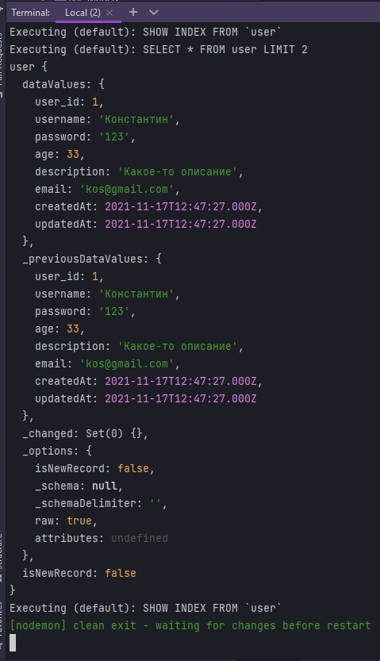

# 009_sql_injection_and_raw_queries

* [Sequelize_Query_Function](#Sequelize_Query_Function)
* [Dialect_Affect_on_Results_and_Metadata](#Dialect_Affect_on_Results_and_Metadata)
* [Query_with_Type_SELECT](#Query_with_Type_SELECT)
* [Query_with_Type_UPDATE](#Query_with_Type_UPDATE)
* [Returning_Model_Instances_with_Query](#Returning_Model_Instances_with_Query)
* [Returning_One_Model_Instance_with_Plain](#Returning_One_Model_Instance_with_Plain)
* [Creating_a_Custom_Logging_Function_for_Query](#Creating_a_Custom_Logging_Function_for_Query)
* [What_is_SQL_Injection](#What_is_SQL_Injection)
* [SQL_Injection_Demonstration](#SQL_Injection_Demonstration)
* [Stopping_SQL_Injection_with_Replacements](#Stopping_SQL_Injection_with_Replacements)
* [Other_Ways_to_Pass_Replacements_to_Query](#Other_Ways_to_Pass_Replacements_to_Query)
* [Passing_an_Array_to_Replacements](#Passing_an_Array_to_Replacements)
* [WildCard_Operator_with_Replacements](#WildCard_Operator_with_Replacements)
* [Stopping_SQL_Injection_with_Bind_Parameters](#Stopping_SQL_Injection_with_Bind_Parameters)
* [Passing_Bind_Parameters_as_an_Object](#Passing_Bind_Parameters_as_an_Object)
* [Some_Important_Notes_on_Bind_Parameters](#Some_Important_Notes_on_Bind_Parameters)

SQL инекция и необработанные запросы


# Sequelize_Query_Function

Рассмотрим не обработанные запросы и такие интересные вещи как sql-инъекции и способы их предотвращения. 

Иногда мы действительно можем захотеть написать свой собственный sql запрос использую sequelize. Т.е написать свой собственный sql запрос, а затем выполнить его через sequelize c использованием функций запроса.

Для этого после синхронизации модели, в первом then в теле анонимной функции я обращаюсь к экземпляру класса sequelize и вызываю у него метод query.


Функция query возвращает массив содержащий две вещи:

1. Это результаты запроса
2. Это объект содержащий метаданные. Такие как количество затронутых строк. Если это что-то вроде оператора обновления


Давайте сделаем наш собственный оператор.

```js
const Sequelize = require("sequelize");
const { DataTypes, Op } = Sequelize;
const bcrypt = require("bcrypt");
const zlib = require("zlib");

// DB=network
// USER=asu8
// PASSWORD=123
// DIALECT=mysql
// HOST=10.178.4.52

const sequelize = new Sequelize("network", "asu8", "123", {
  host: "10.178.4.52",
  dialect: "mysql",
}); // создаю экземпляр класса

sequelize.sync({ alter: true }); //Будет синхронизировать каждую таблицу по отдельности не пересобирая все таблицы

const User = sequelize.define(
  "user",
  {
    user_id: {
      type: DataTypes.INTEGER,
      primaryKey: true, // Первичный ключ
      autoIncrement: true, //Автоматическое приращение
    },
    username: {
      type: DataTypes.STRING,
      allowNull: false,
      validate: {
        len: [4, 6],
      },

      // get() {
      //   const rawValue = this.getDataValue("username"); //Получаю не обработанное значение от текущего пользователя
      //   return rawValue.toUpperCase();
      // },
    },
    password: {
      type: DataTypes.STRING,
      // set(value) {
      //   const salt = bcrypt.genSaltSync(12);
      //   const hash = bcrypt.hashSync(value, salt); // мфдгу переданное значение salt захэшированный пароль
      //   this.setDataValue("password", hash);
      // },
    },
    age: {
      type: DataTypes.INTEGER,
      defaultValue: 21,
      validate: {
        isNumeric: {
          msg: "Вы должны ввести число для возраста",
        },
      },
    },
    description: {
      type: DataTypes.STRING,
      // set(value) {
      //   const compressed = zlib.deflateSync(value).toString("base64");
      //   this.setDataValue("description", compressed);
      // },
      // get() {
      //   const value = this.getDataValue("description");
      //   const uncompressed = zlib.inflateSync(Buffer.from(value, "base64")); //расспаковываю
      //   return uncompressed.toString(); // привожу buffer object к строке
      // },
    },
    aboutUser: {
      type: DataTypes.VIRTUAL,
      get() {
        return `${this.username} ${this.description}`;
      },
    },
    email: {
      type: DataTypes.STRING,
      unique: true, // ограничение, поле email является уникальным.
      allowNull: true, // обязательно устанавливаю в true для того что бы при проверке перейти к validate
      validate: {
        myEmailValidator(value) {
          if (value === null) {
            throw new Error("Пожалуйста введите email");
          }
        },
      },
    },
  },

  {
    freezeTableName: true, // указываю что бы имя нашей модели совпадало с именем нашей таблицы
    //Провожу валидацию на уровне модели
    validate: {
      usernamePassMatch() {
        if (this.username === this.password) {
          throw new Error(`Имя пользователя и пароль не должны совпадать!!!`);
        } else {
          console.log(`Регистрация прошла успешно`);
        }
      },
    },
  }
); // Определяю модель пользователей
User.sync({ alter: true })
  .then(() => {
    return sequelize.query(`UPDATE user SET age = 54 WHERE username='Никита'`);
  })
  .then((data) => {
    const [result, metadata] = data;
    console.log(result);
    console.log(metadata);
  })
  .catch((error) => {
    console.log(error);
  });

```


# Dialect_Affect_on_Results_and_Metadata

Поскольку это не обработанный запрос метаданные относятся к диалекту, который вы используете. Диалект означает postgres или mysql. Мы используем mySql. Например некоторые диалекты возвращают метаданные в объекте результатов. А другие, в частности mssql и mysql, возвращают две ссылки на один и тот же объект. И именно по этому мы получаем результат напечатанный два раза


# Query_with_Type_SELECT

А затем как и большинство функций в sequelize, функция запроса принимает аргумент или аргументы. И один из этих аргументов сообщает sequelize как форматировать результаты. Поэтому, если например в простом запросе  выбора, где не затрагиваются ни какие строки. Вам просто нужны результаты запроса а не метаданные. По этому мы сделаем следующее.

Первым парметров в функцию query прописать sql запрос. `SELECT * FROM user`, \Вторым параметром указываю объект. Указываю type: и после указываю тим запроса который я хочу сделать Sequelize.QueryTypes.SELECT

```js
const Sequelize = require("sequelize");
const { DataTypes, QueryTypes, Op } = Sequelize;
const bcrypt = require("bcrypt");
const zlib = require("zlib");

// DB=network
// USER=asu8
// PASSWORD=123
// DIALECT=mysql
// HOST=10.178.4.52

const sequelize = new Sequelize("network", "asu8", "123", {
    host: "10.178.4.52",
    dialect: "mysql",
}); // создаю экземпляр класса

sequelize.sync({ alter: true }); //Будет синхронизировать каждую таблицу по отдельности не пересобирая все таблицы

const User = sequelize.define(
    "user",
    {
        user_id: {
            type: DataTypes.INTEGER,
            primaryKey: true, // Первичный ключ
            autoIncrement: true, //Автоматическое приращение
        },
        username: {
            type: DataTypes.STRING,
            allowNull: false,
            // get() {
            //   const rawValue = this.getDataValue("username"); //Получаю не обработанное значение от текущего пользователя
            //   return rawValue.toUpperCase();
            // },
        },
        password: {
            type: DataTypes.STRING,
            // set(value) {
            //   const salt = bcrypt.genSaltSync(12);
            //   const hash = bcrypt.hashSync(value, salt); // мфдгу переданное значение salt захэшированный пароль
            //   this.setDataValue("password", hash);
            // },
        },
        age: {
            type: DataTypes.INTEGER,
            defaultValue: 21,
            validate: {
                isNumeric: {
                    msg: "Вы должны ввести число для возраста",
                },
            },
        },
        description: {
            type: DataTypes.STRING,
            // set(value) {
            //   const compressed = zlib.deflateSync(value).toString("base64");
            //   this.setDataValue("description", compressed);
            // },
            // get() {
            //   const value = this.getDataValue("description");
            //   const uncompressed = zlib.inflateSync(Buffer.from(value, "base64")); //расспаковываю
            //   return uncompressed.toString(); // привожу buffer object к строке
            // },
        },
        aboutUser: {
            type: DataTypes.VIRTUAL,
            get() {
                return `${this.username} ${this.description}`;
            },
        },
        email: {
            type: DataTypes.STRING,
            unique: true, // ограничение, поле email является уникальным.
            allowNull: true, // обязательно устанавливаю в true для того что бы при проверке перейти к validate
            validate: {
                myEmailValidator(value) {
                    if (value === null) {
                        throw new Error("Пожалуйста введите email");
                    }
                },
            },
        },
    },

    {
        freezeTableName: true, // указываю что бы имя нашей модели совпадало с именем нашей таблицы
        //Провожу валидацию на уровне модели
        validate: {
            usernamePassMatch() {
                if (this.username === this.password) {
                    throw new Error(`Имя пользователя и пароль не должны совпадать!!!`);
                } else {
                    console.log(`Регистрация прошла успешно`);
                }
            },
        },
    }
); // Определяю модель пользователей
User.sync({ alter: true })
    .then(() => {
        return sequelize.query(`SELECT * FROM user`, {
            type: QueryTypes.SELECT,
        });
    })
    .then((data) => {
        console.log(data);
    })
    .catch((error) => {
        console.log(error);
    });


```


<br/>
<br/>
<br/>

# Query_with_Type_UPDATE


```js
const Sequelize = require("sequelize");
const { DataTypes, QueryTypes, Op } = Sequelize;
const bcrypt = require("bcrypt");
const zlib = require("zlib");

// DB=network
// USER=asu8
// PASSWORD=123
// DIALECT=mysql
// HOST=10.178.4.52

const sequelize = new Sequelize("network", "asu8", "123", {
  host: "10.178.4.52",
  dialect: "mysql",
}); // создаю экземпляр класса

sequelize.sync({ alter: true }); //Будет синхронизировать каждую таблицу по отдельности не пересобирая все таблицы

const User = sequelize.define(
  "user",
  {
    user_id: {
      type: DataTypes.INTEGER,
      primaryKey: true, // Первичный ключ
      autoIncrement: true, //Автоматическое приращение
    },
    username: {
      type: DataTypes.STRING,
      allowNull: false,
      // get() {
      //   const rawValue = this.getDataValue("username"); //Получаю не обработанное значение от текущего пользователя
      //   return rawValue.toUpperCase();
      // },
    },
    password: {
      type: DataTypes.STRING,
      // set(value) {
      //   const salt = bcrypt.genSaltSync(12);
      //   const hash = bcrypt.hashSync(value, salt); // мфдгу переданное значение salt захэшированный пароль
      //   this.setDataValue("password", hash);
      // },
    },
    age: {
      type: DataTypes.INTEGER,
      defaultValue: 21,
      validate: {
        isNumeric: {
          msg: "Вы должны ввести число для возраста",
        },
      },
    },
    description: {
      type: DataTypes.STRING,
      // set(value) {
      //   const compressed = zlib.deflateSync(value).toString("base64");
      //   this.setDataValue("description", compressed);
      // },
      // get() {
      //   const value = this.getDataValue("description");
      //   const uncompressed = zlib.inflateSync(Buffer.from(value, "base64")); //расспаковываю
      //   return uncompressed.toString(); // привожу buffer object к строке
      // },
    },
    aboutUser: {
      type: DataTypes.VIRTUAL,
      get() {
        return `${this.username} ${this.description}`;
      },
    },
    email: {
      type: DataTypes.STRING,
      unique: true, // ограничение, поле email является уникальным.
      allowNull: true, // обязательно устанавливаю в true для того что бы при проверке перейти к validate
      validate: {
        myEmailValidator(value) {
          if (value === null) {
            throw new Error("Пожалуйста введите email");
          }
        },
      },
    },
  },

  {
    freezeTableName: true, // указываю что бы имя нашей модели совпадало с именем нашей таблицы
    //Провожу валидацию на уровне модели
    validate: {
      usernamePassMatch() {
        if (this.username === this.password) {
          throw new Error(`Имя пользователя и пароль не должны совпадать!!!`);
        } else {
          console.log(`Регистрация прошла успешно`);
        }
      },
    },
  }
); // Определяю модель пользователей
User.sync({ alter: true })
  .then(() => {
    return sequelize.query(
      `UPDATE user SET age=33 WHERE username='Константин'`,
      {
        type: QueryTypes.UPDATE,
      }
    );
  })
  .then((data) => {
    console.log(data);
  })
  .catch((error) => {
    console.log(error);
  });

```


Так что это еще одна крутая вещь если вы специализируете типы запросов и обновляете здесь

<br/>
<br/>
<br/>


# Returning_Model_Instances_with_Query

Возврат экземпляра модели с запросом.

Еще один вариант который мы можем передать здесь - это модель. Если мы передадим модель возвращаемые данные будут экземплярами этой представленной модели или другими словами будут строки содержащие добавленную информацию. 

Для того что бы сделать это во второй параметр функции query передаю объект {model: User}

```js
const Sequelize = require("sequelize");
const { DataTypes, QueryTypes, Op } = Sequelize;
const bcrypt = require("bcrypt");
const zlib = require("zlib");

// DB=network
// USER=asu8
// PASSWORD=123
// DIALECT=mysql
// HOST=10.178.4.52

const sequelize = new Sequelize("network", "asu8", "123", {
  host: "10.178.4.52",
  dialect: "mysql",
}); // создаю экземпляр класса

sequelize.sync({ alter: true }); //Будет синхронизировать каждую таблицу по отдельности не пересобирая все таблицы

const User = sequelize.define(
  "user",
  {
    user_id: {
      type: DataTypes.INTEGER,
      primaryKey: true, // Первичный ключ
      autoIncrement: true, //Автоматическое приращение
    },
    username: {
      type: DataTypes.STRING,
      allowNull: false,
      // get() {
      //   const rawValue = this.getDataValue("username"); //Получаю не обработанное значение от текущего пользователя
      //   return rawValue.toUpperCase();
      // },
    },
    password: {
      type: DataTypes.STRING,
      // set(value) {
      //   const salt = bcrypt.genSaltSync(12);
      //   const hash = bcrypt.hashSync(value, salt); // мфдгу переданное значение salt захэшированный пароль
      //   this.setDataValue("password", hash);
      // },
    },
    age: {
      type: DataTypes.INTEGER,
      defaultValue: 21,
      validate: {
        isNumeric: {
          msg: "Вы должны ввести число для возраста",
        },
      },
    },
    description: {
      type: DataTypes.STRING,
      // set(value) {
      //   const compressed = zlib.deflateSync(value).toString("base64");
      //   this.setDataValue("description", compressed);
      // },
      // get() {
      //   const value = this.getDataValue("description");
      //   const uncompressed = zlib.inflateSync(Buffer.from(value, "base64")); //расспаковываю
      //   return uncompressed.toString(); // привожу buffer object к строке
      // },
    },
    aboutUser: {
      type: DataTypes.VIRTUAL,
      get() {
        return `${this.username} ${this.description}`;
      },
    },
    email: {
      type: DataTypes.STRING,
      unique: true, // ограничение, поле email является уникальным.
      allowNull: true, // обязательно устанавливаю в true для того что бы при проверке перейти к validate
      validate: {
        myEmailValidator(value) {
          if (value === null) {
            throw new Error("Пожалуйста введите email");
          }
        },
      },
    },
  },

  {
    freezeTableName: true, // указываю что бы имя нашей модели совпадало с именем нашей таблицы
    //Провожу валидацию на уровне модели
    validate: {
      usernamePassMatch() {
        if (this.username === this.password) {
          throw new Error(`Имя пользователя и пароль не должны совпадать!!!`);
        } else {
          console.log(`Регистрация прошла успешно`);
        }
      },
    },
  }
); // Определяю модель пользователей
User.sync({ alter: true })
  .then(() => {
    return sequelize.query(`SELECT * FROM user LIMIT 2`, {
      model: User,
    });
  })
  .then((data) => {
    console.log(data);
  })
  .catch((error) => {
    console.log(error);
  });

```


Как видите мы получаем всю добавленную информацию 

<br/>
<br/>
<br/>

# Returning_One_Model_Instance_with_Plain

Возврат одного экземпляра модели с помощью Plain. Для этого вторым параметром в model: User, передаю plain:true.




И вот мы просто возвращаем одно значение.


<br/>
<br/>
<br/>


# Creating_a_Custom_Logging_Function_for_Query

Создаю функцию  myFunction


А затем для нашего запроса мы можем передать вторым параметром в функцию query передаю ключ  logging: и в ее значение передаю функцию myFunction.

```js
const Sequelize = require("sequelize");
const { DataTypes, QueryTypes, Op } = Sequelize;
const bcrypt = require("bcrypt");
const zlib = require("zlib");

// DB=network
// USER=asu8
// PASSWORD=123
// DIALECT=mysql
// HOST=10.178.4.52

const sequelize = new Sequelize("network", "asu8", "123", {
  host: "10.178.4.52",
  dialect: "mysql",
}); // создаю экземпляр класса

sequelize.sync({ alter: true }); //Будет синхронизировать каждую таблицу по отдельности не пересобирая все таблицы

const User = sequelize.define(
  "user",
  {
    user_id: {
      type: DataTypes.INTEGER,
      primaryKey: true, // Первичный ключ
      autoIncrement: true, //Автоматическое приращение
    },
    username: {
      type: DataTypes.STRING,
      allowNull: false,
      // get() {
      //   const rawValue = this.getDataValue("username"); //Получаю не обработанное значение от текущего пользователя
      //   return rawValue.toUpperCase();
      // },
    },
    password: {
      type: DataTypes.STRING,
      // set(value) {
      //   const salt = bcrypt.genSaltSync(12);
      //   const hash = bcrypt.hashSync(value, salt); // мфдгу переданное значение salt захэшированный пароль
      //   this.setDataValue("password", hash);
      // },
    },
    age: {
      type: DataTypes.INTEGER,
      defaultValue: 21,
      validate: {
        isNumeric: {
          msg: "Вы должны ввести число для возраста",
        },
      },
    },
    description: {
      type: DataTypes.STRING,
      // set(value) {
      //   const compressed = zlib.deflateSync(value).toString("base64");
      //   this.setDataValue("description", compressed);
      // },
      // get() {
      //   const value = this.getDataValue("description");
      //   const uncompressed = zlib.inflateSync(Buffer.from(value, "base64")); //расспаковываю
      //   return uncompressed.toString(); // привожу buffer object к строке
      // },
    },
    aboutUser: {
      type: DataTypes.VIRTUAL,
      get() {
        return `${this.username} ${this.description}`;
      },
    },
    email: {
      type: DataTypes.STRING,
      unique: true, // ограничение, поле email является уникальным.
      allowNull: true, // обязательно устанавливаю в true для того что бы при проверке перейти к validate
      validate: {
        myEmailValidator(value) {
          if (value === null) {
            throw new Error("Пожалуйста введите email");
          }
        },
      },
    },
  },

  {
    freezeTableName: true, // указываю что бы имя нашей модели совпадало с именем нашей таблицы
    //Провожу валидацию на уровне модели
    validate: {
      usernamePassMatch() {
        if (this.username === this.password) {
          throw new Error(`Имя пользователя и пароль не должны совпадать!!!`);
        } else {
          console.log(`Регистрация прошла успешно`);
        }
      },
    },
  }
); // Определяю модель пользователей

function myFunction() {
  console.log("запуск sql");
}

User.sync({ alter: true })
  .then(() => {
    return sequelize.query(`SELECT * FROM user LIMIT 2`, {
      logging: myFunction,
    });
  })
  .then((data) => {
    console.log(data);
  })
  .catch((error) => {
    console.log(error);
  });

```


Это простой способ если вам нужна дополнительная информация о том что вы на самом деле делаете или что-то в этом роде.

<br/>
<br/>
<br/>

# What_is_SQL_Injection


sql инъекция - это размещение вредоносного кода и операторов sql, которые непосредственно вводяться с веб-страницы. Злоумышленник может даже удалить ваши таблицы.

sql - инъекция является одним из наиболее распостраненных методов веб - взлома. И постоянно входит в топ 10 owasp по рискам безопасности веб-приложений.


sql- инъекция инъекция обычно происходит, когда web-приложение запрашивает ввод пользователя. Наприме имя пользователя. Но вместо того что бы предоставить имя пользователя, предоставляется оператор sql который будет выполняться в вашей БД. 


<br/>
<br/>
<br/>

# SQL_Injection_Demonstration


Данная форма уязвима для sql инъекций 


И мы входим в систему


Но нигде здесь нет имени пользователя или пароля.

Кароче много текста и ничего по делу.

<br/>
<br/>
<br/>

# Stopping_SQL_Injection_with_Replacements

Кароче не закончил с sql инъекциями. [https://www.youtube.com/watch?v=jtVk2iUytGE&list=PLkqiWyX-_Lov8qmMOVn4SEQwr9yOjNn3f&index=10](https://www.youtube.com/watch?v=jtVk2iUytGE&list=PLkqiWyX-_Lov8qmMOVn4SEQwr9yOjNn3f&index=10)