# 011_associations

* [What_are_Associations](#What_are_Associations)
* [Standard_Association_Types](#Standard_Association_Types)
* [What_is_a_One_to_One_Association](#What_is_a_One_to_One_Association)
* [What_Table_Does_The_Foreign_Key_Go_On](#What_Table_Does_The_Foreign_Key_Go_On)
* [Setting_Up_Models_to_Demonstrate_One_to_One](#Setting_Up_Models_to_Demonstrate_One_to_One)
* [Creating_a_One_to_One_Relationship_with_hasOne](#Creating_a_One_to_One_Relationship_with_hasOne)
* [Passing_Options_to_hasOne](#Passing_Options_to_hasOne)
* [Bulk_Creating_Records_to_Demonstrate_One_to_One](#Bulk_Creating_Records_to_Demonstrate_One_to_One)
* [Linking_Records_with_hasOne_Helper_Methods](#Linking_Records_with_hasOne_Helper_Methods)
* [Using_belongsTo_with_hasOne_for_a_One_to_One](#Using_belongsTo_with_hasOne_for_a_One_to_One)
* [Passing_Options_to_belongsTo_and_hasOne](#Passing_Options_to_belongsTo_and_hasOne)
* [onDelete_and_onUpdate_with_One_to_One](#onDelete_and_onUpdate_with_One_to_One)
* [belongsTo_vs_hasMany_when_Linking_Records](#belongsTo_vs_hasMany_when_Linking_Records)

---
* [What_is_a_One_to_Many_Association](#What_is_a_One_to_Many_Association)
* [Setting_Up_Models_to_Demonstrate_One_to_Many](#Setting_Up_Models_to_Demonstrate_One_to_Many)
* [Creating_a_One_To_Many_Association_with_hasMany_and_belongsTo](#Creating_a_One_To_Many_Association_with_hasMany_and_belongsTo)
* [Bulk_Creating_Records_to_Demonstrate_One_to_Many](#Bulk_Creating_Records_to_Demonstrate_One_to_Many)
* [hasMany_Helper_Methods](#hasMany_Helper_Methods)
* [onDelete_and_onUpdate_with_hasMany](#onDelete_and_onUpdate_with_hasMany)
* [belongsTo_Helper_Methods_with_One_to_Many](#belongsTo_Helper_Methods_with_One_to_Many)

___

* [What_is_a_Many_to_Many_Relationship](#What_is_a_Many_to_Many_Relationship)
* [Creating_Models_to_Demonstrate_Many_to_Many](#Creating_Models_to_Demonstrate_Many_to_Many)
* [Creating_a_Many_to_Many_with_belongsToMany](#Creating_a_Many_to_Many_with_belongsToMany)
* [Passing_More_Options_to_belongsToMany](#Passing_More_Options_to_belongsToMany)
* [Creating_Our_Own_Junction_Table](#Creating_Our_Own_Junction_Table)
* [Bulk_Creating_Records_to_Demonstrate_Many_to_Many](#Bulk_Creating_Records_to_Demonstrate_Many_to_Many)
* [belongsToMany_Helper_Methods](#belongsToMany_Helper_Methods)
* [onDelete_onUpdate_with_Many_to_Many](#onDelete_onUpdate_with_Many_to_Many)


```js
//associations.js
const Sequelize = require("sequelize");
const { DataTypes, Op } = require("sequelize");

const sequelize = new Sequelize("network", "asu8", "123", {
  host: "10.178.4.52",
  dialect: "mysql",
});

```

<br/>
<br/>
<br/>

# What_are_Associations

Рассмотрим ассоциации с **sequelize**. По этому прежде чем я перейду к тому как реализовать ассоциации с **sequelize**, я хочу пояснить что такое ассоциации.

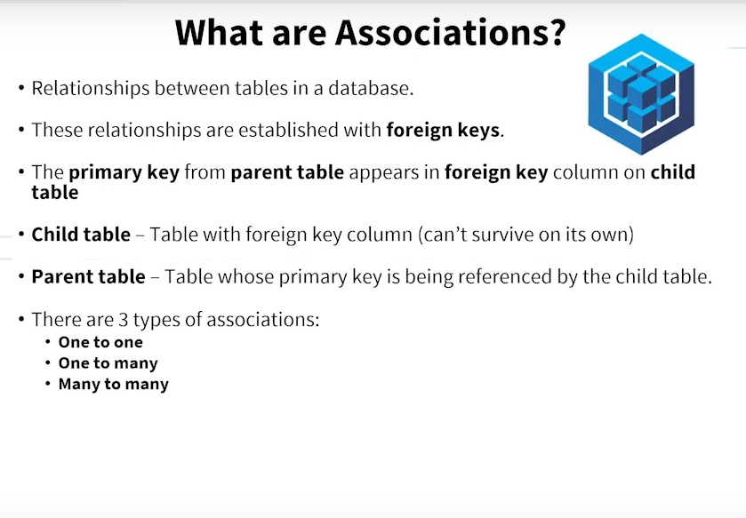

**Ассоциация** - это отношения между таблицами и БД на основе общих атрибутов. Это выражается в реляционной БД с первичными и внешними ключами.

**Первичный ключ** - это специальный столбец реляционной БД или даже несколько столбцов, которые однозначно индентифицируют каждую строку в таблице. 

**Внешний ключ** - это столбец или даже группа столбцов, которые обеспечивают связь, между двумя таблицами, которые имеют общий атрибут. Так же таблица с внешним ключом известна как дочерняя таблица. А таблица, на которую ссылается дочерняя таблица, теперь является родительской таблицей. 

<br/>
<br/>
<br/>

# Standard_Association_Types

Стандартные типы ассоциаций делятся на:

1. **One-to-One** - один к одному.
2. **One-to-many** - один ко многим
3. **Many-to-many** - многие ко многим.

<br/>
<br/>
<br/>

# What_is_a_One_to_One_Association

Мы начнем с перебора ассоциации **One-to-One**

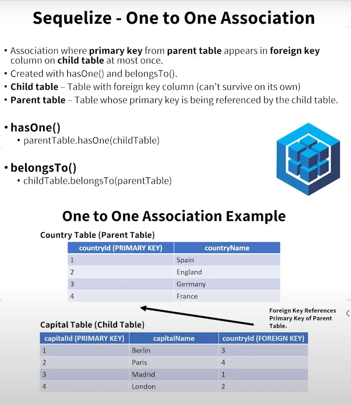

Эта ассоциация означает что одна строка в таблице может быть связана не более чем с одной строкой в другой таблице. Одним из примеров может быть номер социального страхования и человек у которого есть только один номер социального страхования. Или другими словами один номер социального страхования принадлежит только одному человеку.

Другой пример страны и столицы. В стране только одна столица. Столица принадлежит только одной стране.

По этому в любом из этих случаев столбец внешнего ключа будет иметь не более одного первичного ключа. Потому что при отношении один к одному одна строка в таблице может быть связана не более чем с одной строкой в другой таблице. 

<br/>
<br/>
<br/>

# What_Table_Does_The_Foreign_Key_Go_On


Теперь вы знаете что мы можем испоьзовать отношения один к одному между таблицами.

Однако вам может быть интересно, в какую таблицу мы помещаем столбец внешнего ключа. Как это решается? Какая таблица должна быть родительской.

В нашем примере страны и столицы вы не можете иметь столицу страны без страны. По этому столбец внешнего ключа будет помещен в таблицу Сталиц.

<br/>
<br/>
<br/>

# Setting_Up_Models_to_Demonstrate_One_to_One

Настройка моделей для демострации **One-to-one**

Рассмотрим на примере страны и столицы.  

```js
//associations.js
const Sequelize = require("sequelize");
const { DataTypes, Op } = require("sequelize");

const sequelize = new Sequelize("network", "asu8", "123", {
  host: "10.178.4.52",
  dialect: "mysql",
});

//Таблица стран
const Country = sequelize.define(
  "country",
  {
    countryName: { type: DataTypes.STRING, unique: true },
  },
  {
    timestamps: false, //убираю временные метки. Так же в этом третьем параметре функции define могу задать чтоное имя таблицы tableName
  }
);

//Таблица столиц
const Capital = sequelize.define(
  "capital",
  {
    capitalName: {
      type: DataTypes.STRING,
      unique: true,
    },
  },
  {
    timestamps: false, //убираю временные метки. Так же в этом третьем параметре функции define могу задать чтоное имя таблицы tableName
  }
);

```


<br/>
<br/>
<br/>

# Creating_a_One_to_One_Relationship_with_hasOne

Создание типа отношений **one-to-one** с **nasOne**

Для того что бы установить тип отношений в **sequelize** имеется четыре метода.

Для создания связи **one-to-one** в **sequelize** мы используем метод **hasOne**. После определения таблиц пишу **hasOne()**. Как мы говорили что столица страны не может существовать без таблицы стран. По этому давайте добавим наш внешний ключ в нашу таблицу Столиц **Capital** с помощью метода **hasOne**. В методе **hasOne** указываю название таблицы в которой я хочу видеть внешний ключ, столбец который,который должен быть включен, находится внутри круглых скобок

```js
//associations.js
const Sequelize = require("sequelize");
const { DataTypes, Op } = require("sequelize");

const sequelize = new Sequelize("network", "asu8", "123", {
  host: "10.178.4.52",
  dialect: "mysql",
});

//Таблица стран
const Country = sequelize.define(
  "country",
  {
    countryName: { type: DataTypes.STRING, unique: true },
  },
  {
    timestamps: false, //убираю временные метки. Так же в этом третьем параметре функции define могу задать чтоное имя таблицы tableName
  }
);

//Таблица столиц
const Capital = sequelize.define(
  "capital",
  {
    capitalName: {
      type: DataTypes.STRING,
      unique: true,
    },
  },
  {
    timestamps: false, //убираю временные метки. Так же в этом третьем параметре функции define могу задать чтоное имя таблицы tableName
  }
);

hasOne(Capital); // Указываю таблицу к которой привязываю внешний ключ

```

Далее мне нужно указать родительскую таблицу.

**Родительская таблица** - это таблица, у которой вызывается метод **hasOne()**. И далее указываю таблицу в которой будет содержаться внешний ключ.

```js
//associations.js
const Sequelize = require("sequelize");
const { DataTypes, Op } = require("sequelize");

const sequelize = new Sequelize("network", "asu8", "123", {
  host: "10.178.4.52",
  dialect: "mysql",
});

//Таблица стран
const Country = sequelize.define(
  "country",
  {
    countryName: { type: DataTypes.STRING, unique: true },
  },
  {
    timestamps: false, //убираю временные метки. Так же в этом третьем параметре функции define могу задать чтоное имя таблицы tableName
  }
);

//Таблица столиц
const Capital = sequelize.define(
  "capital",
  {
    capitalName: {
      type: DataTypes.STRING,
      unique: true,
    },
  },
  {
    timestamps: false, //убираю временные метки. Так же в этом третьем параметре функции define могу задать чтоное имя таблицы tableName
  }
);

Country.hasOne(Capital); // Country - родительская таблица, Capital дочерняя таблица в которой содержится внешний ключ который мы создали с помощью hasOne

```

Другими словами я вызываю метод **hasOne** в родительской таблице, но передаю в данный метод дочернюю таблицу в качестве аргумента. Так что теперь давайте синхронизируем, то что у нас есть с рабочей средой **mysql**

```js
//associations.js
const Sequelize = require("sequelize");
const { DataTypes, Op } = require("sequelize");

const sequelize = new Sequelize("network", "asu8", "123", {
  host: "10.178.4.52",
  dialect: "mysql",
});

//Таблица стран
const Country = sequelize.define(
  "country",
  {
    countryName: { type: DataTypes.STRING, unique: true },
  },
  {
    timestamps: false, //убираю временные метки. Так же в этом третьем параметре функции define могу задать чтоное имя таблицы tableName
  }
);

//Таблица столиц
const Capital = sequelize.define(
  "capital",
  {
    capitalName: {
      type: DataTypes.STRING,
      unique: true,
    },
  },
  {
    timestamps: false, //убираю временные метки. Так же в этом третьем параметре функции define могу задать чтоное имя таблицы tableName
  }
);

Country.hasOne(Capital); // Country - родительская таблица, Capital дочерняя таблица в которой содержится внешний ключ который мы создали с помощью hasOne

//
sequelize
  .sync({ alter: true })
  .then(() => {
    //работаем с нашими обновленными таблицами
  })
  .catch((error) => {
    console.log(error);
  });

```

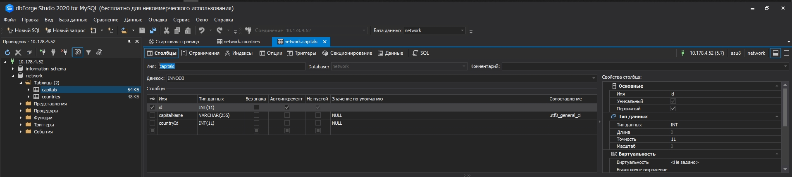

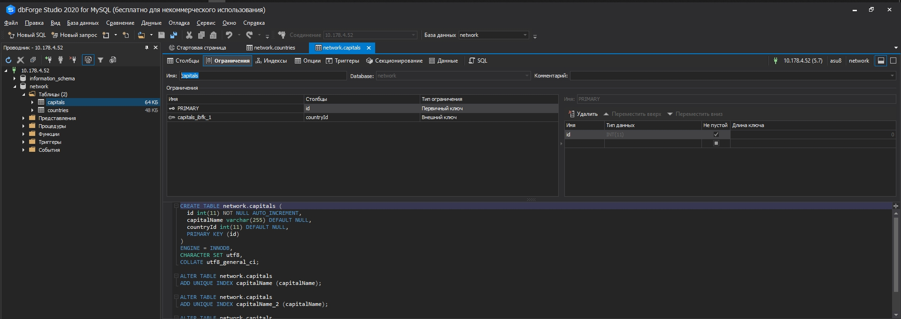

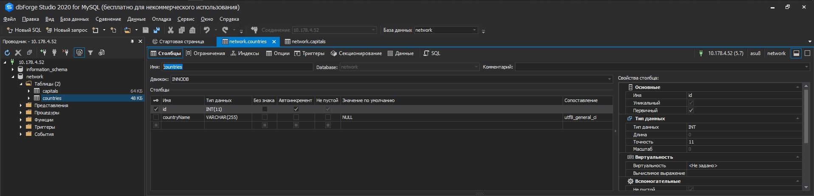

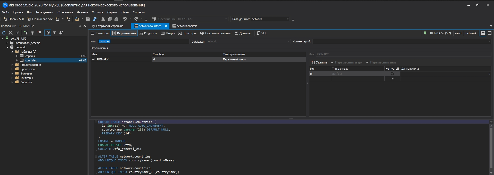


<br/>
<br/>
<br/>

# Passing_Options_to_hasOne

Помните что **countries** это наша родительская таблица. Как видим она имеет первичный ключ.

Если я перейду в нашу дочернюю таблицу **capitals**. Как видим у нас есть столбец по названием **countryId**

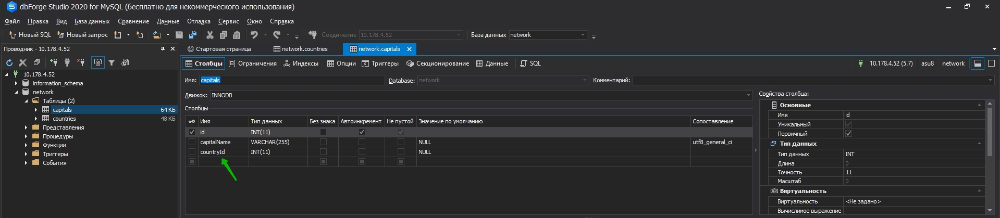

Он добавляет **countryId** потому что мы не создавали свой собственный внешний ключ. И теперь у меня есть индификатор страны **countryId** прямо в таблице столиц **Capital**. Вы можете видеть что **sequelize** автоматически установил индентификатор внешнего ключа как комбинацию внешнего ключа в едиственном числе и первичного ключа таблицы на которую он ссылается т.е. на таблицу **countries**.

По этому если мы сделаем так. Например наша родительская таблица называется **country**, а первичный индентификатор для нее - это просто индентификатор. То он сделет двойное объединение и создасть индентификатор страны, в качестве внешнего ключа.

И это конечно можно настроить. Все методы **one-to-one**, **many-to-one** и **many-to-may** принимают объект параметров в качестве второго параметра.

По этому возвращаюсь в код

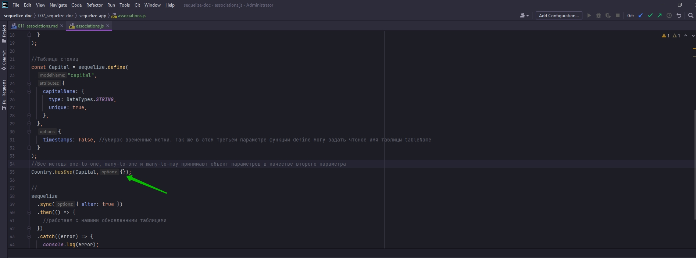

Этот объект мы используем для передачи большего количества параметров. И один из ключей которые вы можете передать в этом объекте, является внешним ключом. А затем вы можете строку с именем, с которым вы хотите вызывать столбец внешнего ключа.

```js
//associations.js
const Sequelize = require("sequelize");
const { DataTypes, Op } = require("sequelize");

const sequelize = new Sequelize("network", "asu8", "123", {
  host: "10.178.4.52",
  dialect: "mysql",
});

//Таблица стран
const Country = sequelize.define(
  "country",
  {
    countryName: { type: DataTypes.STRING, unique: true },
  },
  {
    timestamps: false, //убираю временные метки. Так же в этом третьем параметре функции define могу задать чтоное имя таблицы tableName
  }
);

//Таблица столиц
const Capital = sequelize.define(
  "capital",
  {
    capitalName: {
      type: DataTypes.STRING,
      unique: true,
    },
  },
  {
    timestamps: false, //убираю временные метки. Так же в этом третьем параметре функции define могу задать чтоное имя таблицы tableName
  }
);
//Все методы one-to-one, many-to-one и many-to-may принимают объект параметров в качестве второго параметра
Country.hasOne(Capital, {
  foreignKey: "countryForeignKey",
});

//
sequelize
  .sync({ alter: true })
  .then(() => {
    //работаем с нашими обновленными таблицами
  })
  .catch((error) => {
    console.log(error);
  });

```

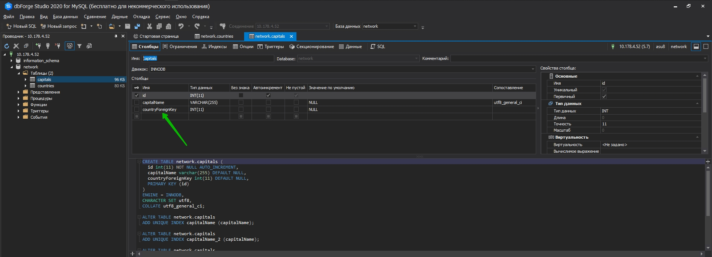

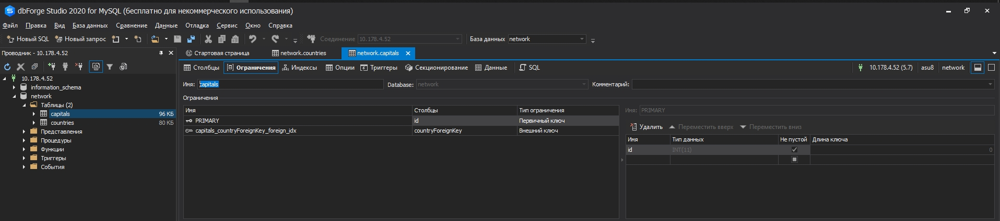

Но пока что уберу этот объект с параметрами.

<br/>
<br/>
<br/>

# Bulk_Creating_Records_to_Demonstrate_One_to_One

Массовое создание записей для демострации отношений **one-to-one**

Теперь создадим несколько стран и столиц которые мы можем использовать позже что бы продемонстрировать эти ассоциации.

```js
//associations.js
const Sequelize = require("sequelize");
const { DataTypes, Op } = require("sequelize");

const sequelize = new Sequelize("network", "asu8", "123", {
  host: "10.178.4.52",
  dialect: "mysql",
});

//Таблица стран
const Country = sequelize.define(
  "country",
  {
    countryName: { type: DataTypes.STRING, unique: true },
  },
  {
    timestamps: false, //убираю временные метки. Так же в этом третьем параметре функции define могу задать чтоное имя таблицы tableName
  }
);

//Таблица столиц
const Capital = sequelize.define(
  "capital",
  {
    capitalName: {
      type: DataTypes.STRING,
      unique: true,
    },
  },
  {
    timestamps: false, //убираю временные метки. Так же в этом третьем параметре функции define могу задать чтоное имя таблицы tableName
  }
);
//Все методы one-to-one, many-to-one и many-to-may принимают объект параметров в качестве второго параметра
Country.hasOne(Capital);

//
sequelize
  .sync({ alter: true })
  .then(() => {
    //работаем с нашими обновленными таблицами
    //Создаю страны
    return Country.bulkCreate([
      {
        countryName: "Испания",
      },
      {
        countryName: "Франция",
      },
      {
        countryName: "Германия",
      },
      {
        countryName: "Англия",
      },
    ]);

    //Создаю сталицы
    return Capital.bulkCreate([
      {
        capitalName: "Лондон",
      },
      {
        capitalName: "Мадрид",
      },
      {
        capitalName: "Париж",
      },
      {
        capitalName: "Берлин",
      },
    ]);
  })
  .catch((error) => {
    console.log(error);
  });

```

Запускаю что бы вставить все в таблицу.

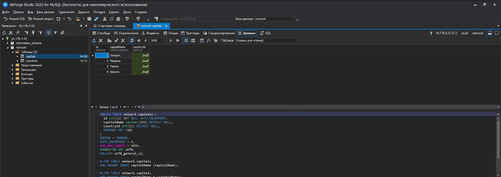

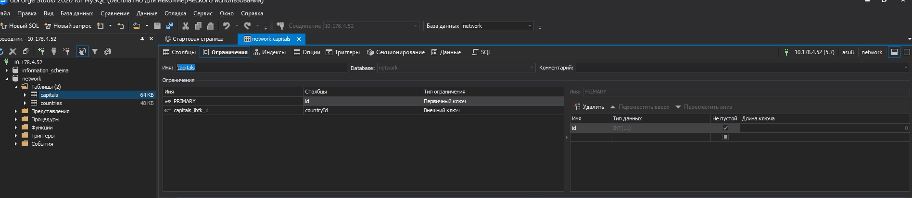

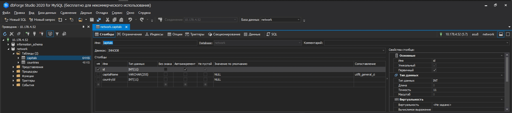

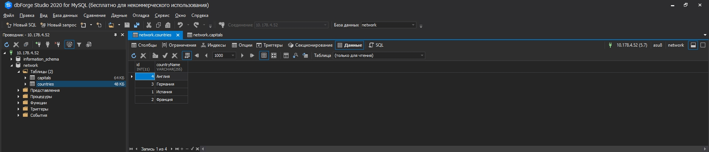

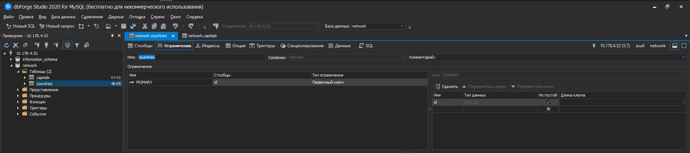

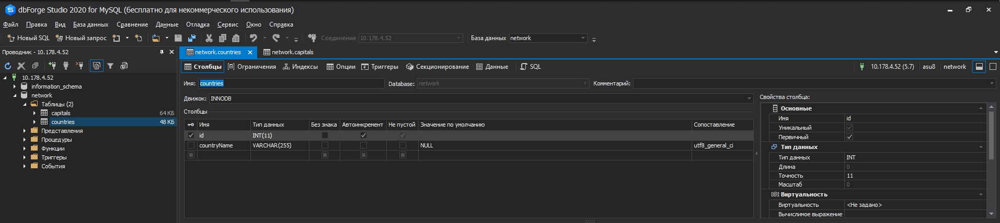

**countryId** **null** потому что мы еще не связали ни каких ассоциаций между таблицей **countries** и таблицей **capitals**.

Избавляюсь от массового создания.

<br/>
<br/>
<br/>

# Linking_Records_with_hasOne_Helper_Methods

Связывание записей с помощью вспомогательных методов **hasOne**.

Свяжем наши таблицы используя внешний ключ инденификатора **countryId** в таблице **capitals**. Другими словами давайте установим индентификатор для каждой столицы В которой **capital** столица пренадлежит стране. По этому использование метода **hasOne**.

Исходная модель является моделью, в которой выполняется, вызывается функция. Такой моделью у нас является **Country**

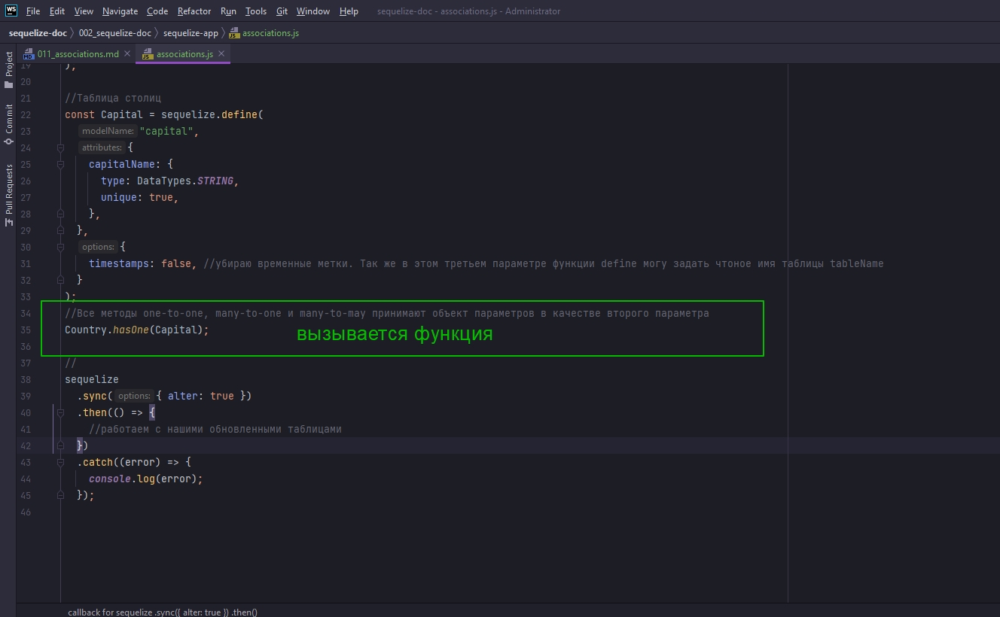

Так что **Country** это наша исходная модель. У нас есть некоторые служебные методы, которые помогут нам вставить значения в столбец **countryId**. Этот индентификатор свяжет название столицы с названием страны.

Эти вспомогательные методы могут делать определенные вещи, такие как установка внешнего ключа в экземпляре модели. Экземпляр модели извлекается по его внешнему ключу. 

Эти вспомогательные вещи различаются в зависимости от того, к какому методу они принадлежат и т.д. На самом деле используется много методов после которых указывается имя дочерней модели.

Начнем сначало с поиска страны и столицы. Первое что я собираюсь сделать это создать две переменные **country** и **capital**. И мы хотим связать их с помощью столбца внешенго ключа.

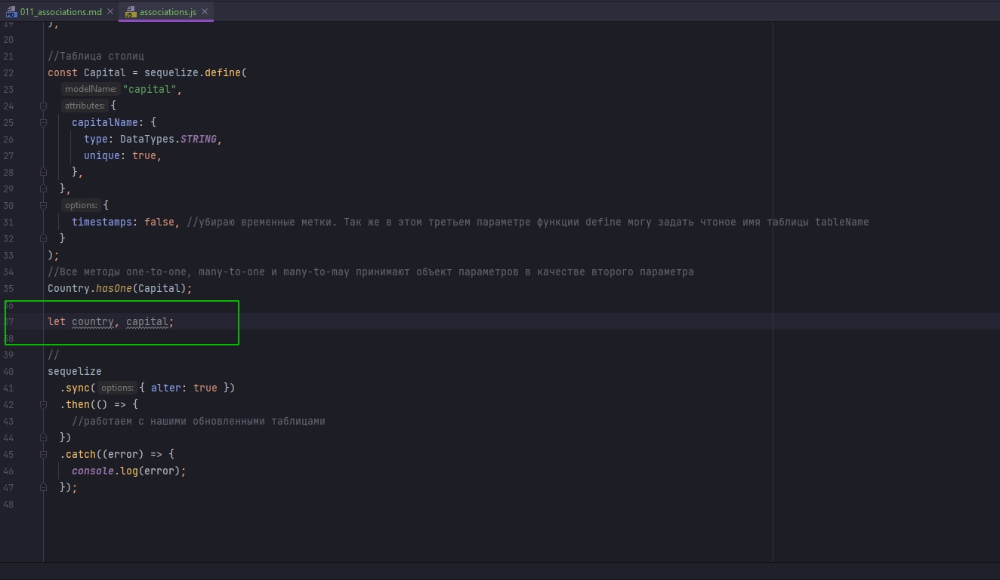

Далее используя метод **findOne** и ищу к примеру в модели **Capital** по **capitalName:"Мадрид"**

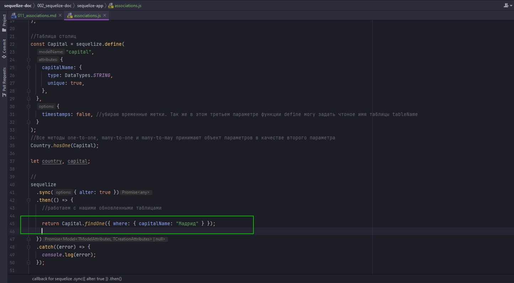

И этот метод возвращает **promise**. В следующей цепочке отлавливаю полученные данные и обрабатываю. И заношу эти данные в наши объявленные выше переменные. **capital.data** тут будет содержаться Мадрид. Далее в этом же **then** обращаюсь к модели **Country** вызываю метод **findOne** и ищу имя интересующей меня страны. Делаем это мы потому что знаем что Мадрид является столицей Испании. Это снова возвращает **promise**. По этому давайте продолжим цепочку.

```js
//associations.js
const Sequelize = require("sequelize");
const { DataTypes, Op } = require("sequelize");

const sequelize = new Sequelize("network", "asu8", "123", {
    host: "10.178.4.52",
    dialect: "mysql",
});

//Таблица стран
const Country = sequelize.define(
    "country",
    {
        countryName: { type: DataTypes.STRING, unique: true },
    },
    {
        timestamps: false, //убираю временные метки. Так же в этом третьем параметре функции define могу задать чтоное имя таблицы tableName
    }
);

//Таблица столиц
const Capital = sequelize.define(
    "capital",
    {
        capitalName: {
            type: DataTypes.STRING,
            unique: true,
        },
    },
    {
        timestamps: false, //убираю временные метки. Так же в этом третьем параметре функции define могу задать чтоное имя таблицы tableName
    }
);
//Все методы one-to-one, many-to-one и many-to-may принимают объект параметров в качестве второго параметра
Country.hasOne(Capital);

let country, capital;

//
sequelize
    .sync({ alter: true })
    .then(() => {
        //работаем с нашими обновленными таблицами

        return Capital.findOne({ where: { capitalName: "Мадрид" } });
    })
    .then((data) => {
        capital = data; //Здесь находится полученная столица Мадрид
        return Country.findOne({
            where: {
                countryName: "Испания",
            },
        });
    })
    .then((data) => {
        country = data;
    })
    .catch((error) => {
        console.log(error);
    });


```

И здесь мы можем использовать наши вспомогательные методы. У **country** я могу вызвать **setCapital()** и аргументом передаю переменную в которую я полил найденное значение сталицы **capital**.

```js
//associations.js
const Sequelize = require("sequelize");
const { DataTypes, Op } = require("sequelize");

const sequelize = new Sequelize("network", "asu8", "123", {
  host: "10.178.4.52",
  dialect: "mysql",
});

//Таблица стран
const Country = sequelize.define(
  "country",
  {
    countryName: { type: DataTypes.STRING, unique: true },
  },
  {
    timestamps: false, //убираю временные метки. Так же в этом третьем параметре функции define могу задать чтоное имя таблицы tableName
  }
);

//Таблица столиц
const Capital = sequelize.define(
  "capital",
  {
    capitalName: {
      type: DataTypes.STRING,
      unique: true,
    },
  },
  {
    timestamps: false, //убираю временные метки. Так же в этом третьем параметре функции define могу задать чтоное имя таблицы tableName
  }
);
//Все методы one-to-one, many-to-one и many-to-may принимают объект параметров в качестве второго параметра
Country.hasOne(Capital);

let country, capital;

//
sequelize
  .sync({ alter: true })
  .then(() => {
    //работаем с нашими обновленными таблицами

    return Capital.findOne({ where: { capitalName: "Мадрид" } });
  })
  .then((data) => {
    capital = data; //Здесь находится полученная столица Мадрид
    return Country.findOne({
      where: {
        countryName: "Испания",
      },
    });
  })
  .then((data) => {
    country = data;
    country.setCapital(capital);
  })
  .catch((error) => {
    console.log(error);
  });

```
Как видите индентификатор страны был заполнен.

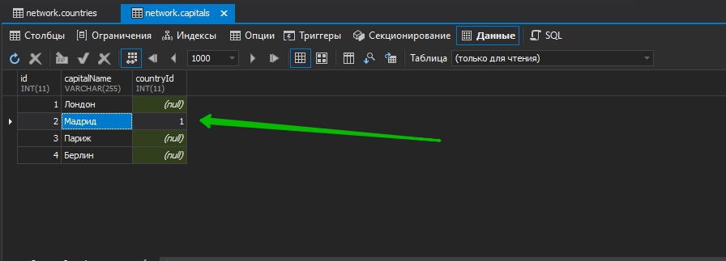

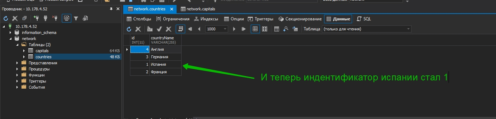

Мы успешно соединили эти две строки. Для этого мы использовали **setCapital**.


Рассмотрим еще один вспомогательный метод. Теперь давайте использовать **getCapital**. По этому я собираюсь удалить все цепочки **then** .

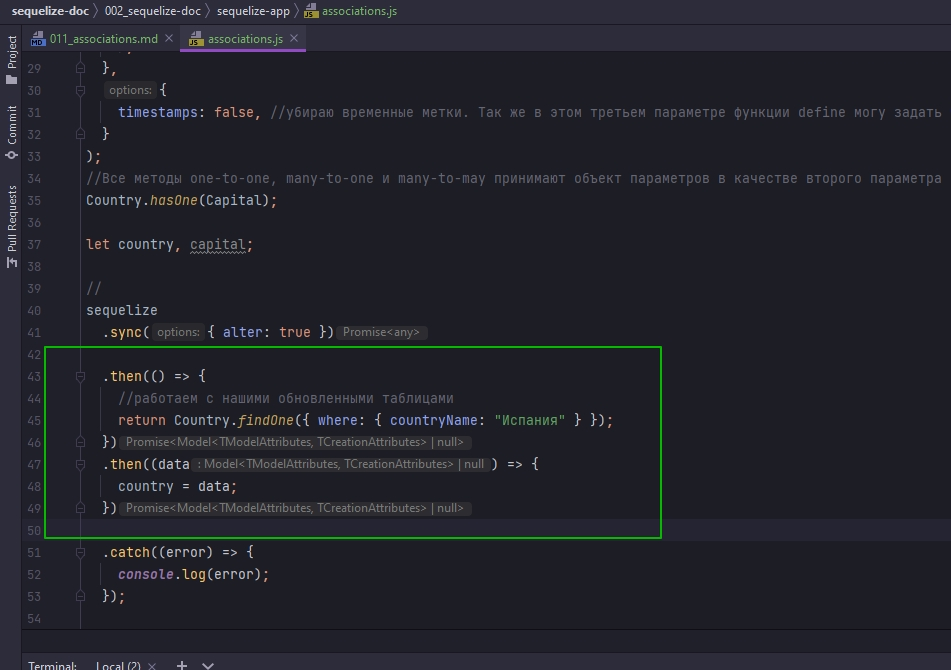

```js
//associations.js
const Sequelize = require("sequelize");
const { DataTypes, Op } = require("sequelize");

const sequelize = new Sequelize("network", "asu8", "123", {
  host: "10.178.4.52",
  dialect: "mysql",
});

//Таблица стран
const Country = sequelize.define(
  "country",
  {
    countryName: { type: DataTypes.STRING, unique: true },
  },
  {
    timestamps: false, //убираю временные метки. Так же в этом третьем параметре функции define могу задать чтоное имя таблицы tableName
  }
);

//Таблица столиц
const Capital = sequelize.define(
  "capital",
  {
    capitalName: {
      type: DataTypes.STRING,
      unique: true,
    },
  },
  {
    timestamps: false, //убираю временные метки. Так же в этом третьем параметре функции define могу задать чтоное имя таблицы tableName
  }
);
//Все методы one-to-one, many-to-one и many-to-may принимают объект параметров в качестве второго параметра
Country.hasOne(Capital);

let country, capital;

//
sequelize
  .sync({ alter: true })

  .then(() => {
    //работаем с нашими обновленными таблицами
    return Country.findOne({ where: { countryName: "Испания" } });
  })
  .then((data) => {
    country = data;
  })

  .catch((error) => {
    console.log(error);
  });

```
Мы собираемся найти страну в которой название страны Испания. И теперь у меня есть вспомогательный метод потому что эти два поля в таблице, **capitalName:** Мадрид и **countryName:Испарния**, связаны внешним ключом. Здесь мы можем по сужеству использовать этот индентификатор для получения **capital** столицы.

```js
//associations.js
const Sequelize = require("sequelize");
const { DataTypes, Op } = require("sequelize");

const sequelize = new Sequelize("network", "asu8", "123", {
  host: "10.178.4.52",
  dialect: "mysql",
});

//Таблица стран
const Country = sequelize.define(
  "country",
  {
    countryName: { type: DataTypes.STRING, unique: true },
  },
  {
    timestamps: false, //убираю временные метки. Так же в этом третьем параметре функции define могу задать чтоное имя таблицы tableName
  }
);

//Таблица столиц
const Capital = sequelize.define(
  "capital",
  {
    capitalName: {
      type: DataTypes.STRING,
      unique: true,
    },
  },
  {
    timestamps: false, //убираю временные метки. Так же в этом третьем параметре функции define могу задать чтоное имя таблицы tableName
  }
);
//Все методы one-to-one, many-to-one и many-to-may принимают объект параметров в качестве второго параметра
Country.hasOne(Capital);

let country, capital;

//
sequelize
  .sync({ alter: true })

  .then(() => {
    //работаем с нашими обновленными таблицами
    return Country.findOne({ where: { countryName: "Испания" } });
  })
  .then((data) => {
    country = data;
    return country.getCapital(capital);
  })
  .then((data) => {
    console.log(data.toJSON());
  })

  .catch((error) => {
    console.log(error);
  });

```

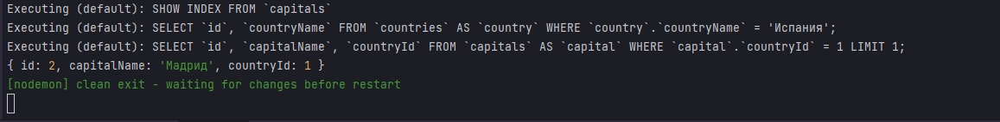

И вот я получаю индентификаторы, индентификатор страны **countryId:2** и индентификатор сталицы.

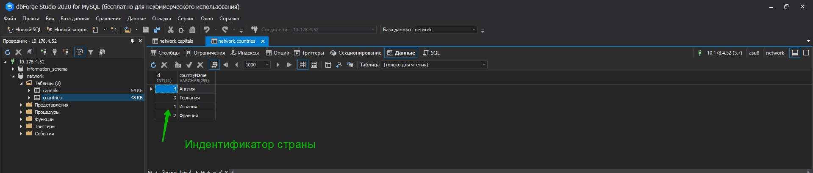

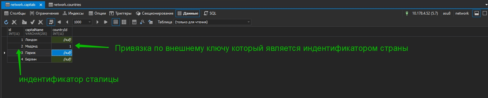

Так что **getCapital** это еще один вспомогательный метод который мы можем использовать.

Как только мы связали два поля внешним ключом, он вошел в таблицу **capitals**  и нашел индификатор внешнего ключа. А затем он вернул всю связанную с этим информацию.

Теперь давайте рассмотрим тот послежний метод о котором я вам рассказывал. Сделать связь при создании страны.

```js
//associations.js
const Sequelize = require("sequelize");
const { DataTypes, Op } = require("sequelize");

const sequelize = new Sequelize("network", "asu8", "123", {
    host: "10.178.4.52",
    dialect: "mysql",
});

//Таблица стран
const Country = sequelize.define(
    "country",
    {
        countryName: { type: DataTypes.STRING, unique: true },
    },
    {
        timestamps: false, //убираю временные метки. Так же в этом третьем параметре функции define могу задать чтоное имя таблицы tableName
    }
);

//Таблица столиц
const Capital = sequelize.define(
    "capital",
    {
        capitalName: {
            type: DataTypes.STRING,
            unique: true,
        },
    },
    {
        timestamps: false, //убираю временные метки. Так же в этом третьем параметре функции define могу задать чтоное имя таблицы tableName
    }
);
//Все методы one-to-one, many-to-one и many-to-may принимают объект параметров в качестве второго параметра
Country.hasOne(Capital);

let country, capital;

//
sequelize
    .sync({ alter: true })

    .then(() => {
        //работаем с нашими обновленными таблицами
        return Country.create({
            countryName: "USA", // создаю страну
        });
    })
    .then((data) => {
        country = data; //Присваиваю страну
        return country.createCapital({
            capitalName: "Washington", // при создании сталицы создается индентификатор связывающий найденную страну в country и создаваемой столицы.
        });
    })
    .catch((error) => {
        console.log(error);
    });

```

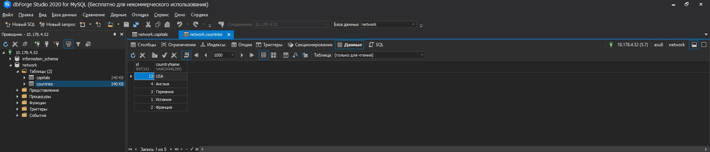

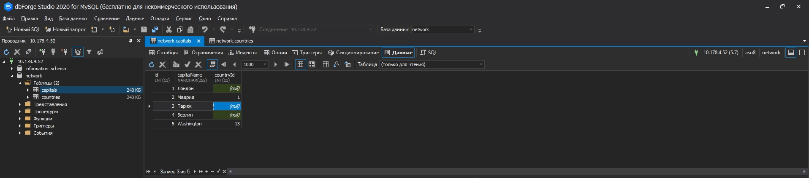


Мы сделали это с помощью нашего вспомогательного метода **createCapital**.


<br/>
<br/>
<br/>

# Using_belongsTo_with_hasOne_for_a_One_to_One

Использование **belongTo** c **hasOne** для **one-to-one**

А теперь давайте воспользуемся нашими методами, такими же **createCountry**, **getCountry**, **setCountry**.

Первое что мы собираемся сделать это найти страну. И на этот раз двайте возьмем Францию.

```js
//associations.js
const Sequelize = require("sequelize");
const { DataTypes, Op } = require("sequelize");
const { log } = require("nodemon/lib/utils");

const sequelize = new Sequelize("network", "asu8", "123", {
  host: "10.178.4.52",
  dialect: "mysql",
});

//Таблица стран
const Country = sequelize.define(
  "country",
  {
    countryName: { type: DataTypes.STRING, unique: true },
  },
  {
    timestamps: false, //убираю временные метки. Так же в этом третьем параметре функции define могу задать чтоное имя таблицы tableName
  }
);

//Таблица столиц
const Capital = sequelize.define(
  "capital",
  {
    capitalName: {
      type: DataTypes.STRING,
      unique: true,
    },
  },
  {
    timestamps: false, //убираю временные метки. Так же в этом третьем параметре функции define могу задать чтоное имя таблицы tableName
  }
);
//Все методы one-to-one, many-to-one и many-to-may принимают объект параметров в качестве второго параметра
Country.hasOne(Capital);

let country, capital;

//
sequelize
  .sync({ alter: true })

  .then(() => {
    //работаем с нашими обновленными таблицами
    return Country.findOne({
      where: {
        countryName: "Франция",
      },
    });
  })
  .then((data) => {
    country = data;
    return Capital.findOne({
      where: {
        capitalName: "Париж",
      },
    });
  })
  .then((data) => {
    capital = data;
    return capital.setCountry(country);
  })
  .then((data) => {
    console.log(data);
  })
  .catch((error) => {
    console.log(error);
  });

```

И здесь мы получаем ошибку о том что **setCountry** не является функцией.

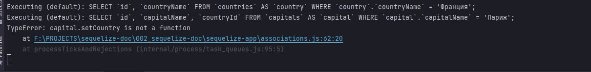


И это фактически сегментирует следующую тему. Это использование метода **belongsTo(Принадлежит к)**. Не толко страна принадлежит к одной сталице, но и сталица принадлежит одной стране. Скажем так указываем обратную связь. По этому в определении ассоцииации я должен указать что Сталица Принадлежик к  Стране т.е. **Capital.belongsTo(Country)**. Другими словами это помещает индентификатор Страны внешнего ключа в нашу таблицу Сталиц.

```js
//associations.js
const Sequelize = require("sequelize");
const { DataTypes, Op } = require("sequelize");
const { log } = require("nodemon/lib/utils");

const sequelize = new Sequelize("network", "asu8", "123", {
  host: "10.178.4.52",
  dialect: "mysql",
});

//Таблица стран
const Country = sequelize.define(
  "country",
  {
    countryName: { type: DataTypes.STRING, unique: true },
  },
  {
    timestamps: false, //убираю временные метки. Так же в этом третьем параметре функции define могу задать чтоное имя таблицы tableName
  }
);

//Таблица столиц
const Capital = sequelize.define(
  "capital",
  {
    capitalName: {
      type: DataTypes.STRING,
      unique: true,
    },
  },
  {
    timestamps: false, //убираю временные метки. Так же в этом третьем параметре функции define могу задать чтоное имя таблицы tableName
  }
);

//Определяю ассоциации
//Все методы one-to-one, many-to-one и many-to-may принимают объект параметров в качестве второго параметра
Country.hasOne(Capital);
Capital.belongsTo(Country); //Сталица принадлежит к стране

let country, capital;

//
sequelize
  .sync({ alter: true })

  .then(() => {
    //работаем с нашими обновленными таблицами
    return Country.findOne({
      where: {
        countryName: "Франция",
      },
    });
  })
  .then((data) => {
    country = data;
    return Capital.findOne({
      where: {
        capitalName: "Париж",
      },
    });
  })
  .then((data) => {
    capital = data;
    return capital.setCountry(country);
  })
  .then((data) => {
    console.log(data);
  })
  .catch((error) => {
    console.log(error);
  });

```

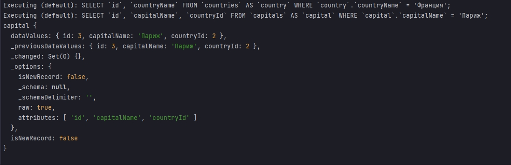

Рекомендуется использовать **hasOne** и **belongTo** только в исходной модели т.е. я так понимаю в родительской модели.

А исходная модель, дочерняя всегда является таблицей, для которой вызываются методы.

По переводу у него везде исходные таблицы. Если я правильно понял

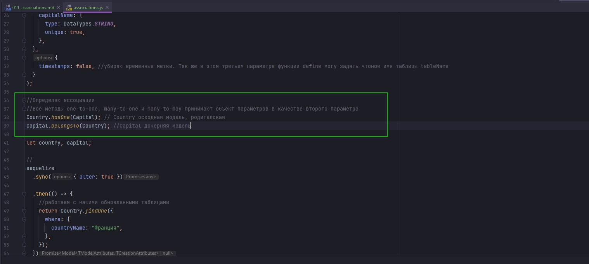

Мы должны использовать два оператора **hasOne** и **belongTo** описывающих одну и туде ассоциацию, даже если она будет иметь одинаковый эффект. Именно по этому мы не смогли сделать **setCountry**. Нам говорят что **setCountry** не является функцией. Потому что мы никогда не запускали это раньше. По этому у нас на самом деле нет ни каких служебных методов, помещенных в экземпляры нашей модели **Capital**.

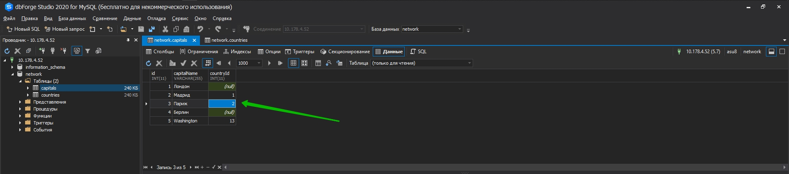

И теперь у Парижа есть индентификатор страны. Теперь я могу получить сталицу из страны.


<br/>
<br/>
<br/>


# Passing_Options_to_belongsTo_and_hasOne

передача опций в методы **belongTo** и **hasOne**

Прежде чем мы перейдем к другим типам ассоциации я хочу упомянуть, что вы так же можете задать имя внешнему ключу.
В **foreignKey** мы так же можем передать объект опций. Если я хочу поменять имя я передаю ключ **name:** и дальше передаю строковое значение имени внешнего ключа.

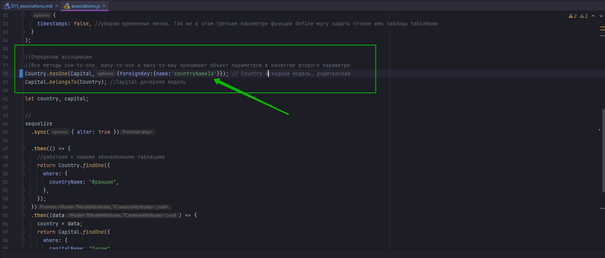

Так же я могу приенить тип данных для внешнего ключа **type: DataTypes.INTEGER**

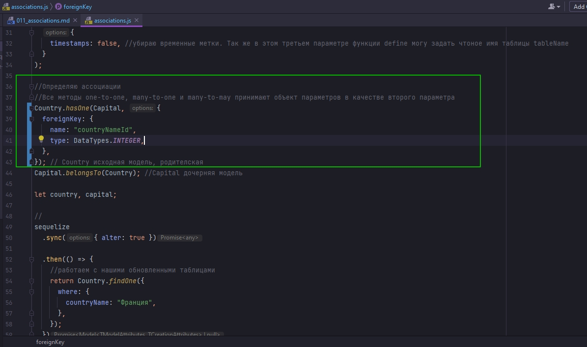

Мы сказали что хотим что бы внешний ключ назывался **countryNameId** и тип данных его был целочисленный т.е. **INTEGER**. Когда вы это делаете это тоже самое, что настройка столбца при использовании метода определения **define**. Мы знаем что тип имени **Type.DataTypes.STRING** и что значения в данном столбце должны быть уникальными.

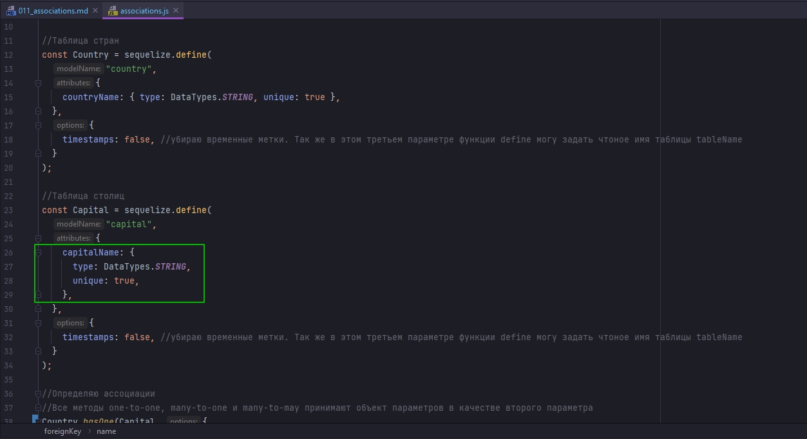

Так что здесь **Country.hasOne()** мы знаем что тип имени **capitalName** уникален. Это тоже самое что в объекте опций вешнего ключа я задам **allowNull:false**. Вы конечно можете использвать **allowNull:false**. Вы конечно можете не разрешать **null** значений по умолчанию. Хорошим примером является то, что по умолчанию ассоциация считается необязательной. По этому здесь индентификатор страны внешнего ключа может быть **null**, и по этому конечно у нас есть в нашей таблице **capitals** значения **null**

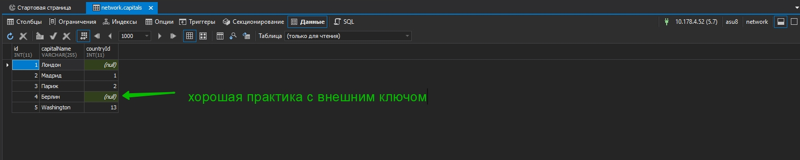

```js
//associations.js
const Sequelize = require("sequelize");
const { DataTypes, Op } = require("sequelize");
const { log } = require("nodemon/lib/utils");

const sequelize = new Sequelize("network", "asu8", "123", {
  host: "10.178.4.52",
  dialect: "mysql",
});

//Таблица стран
const Country = sequelize.define(
  "country",
  {
    countryName: { type: DataTypes.STRING, unique: true },
  },
  {
    timestamps: false, //убираю временные метки. Так же в этом третьем параметре функции define могу задать чтоное имя таблицы tableName
  }
);

//Таблица столиц
const Capital = sequelize.define(
  "capital",
  {
    capitalName: {
      type: DataTypes.STRING,
      unique: true,
    },
  },
  {
    timestamps: false, //убираю временные метки. Так же в этом третьем параметре функции define могу задать чтоное имя таблицы tableName
  }
);

//Определяю ассоциации
//Все методы one-to-one, many-to-one и many-to-may принимают объект параметров в качестве второго параметра
Country.hasOne(Capital, {
  foreignKey: {
    name: "countryNameId",
    type: DataTypes.INTEGER,
    allowNull: false, //Плохая практика запрещать null значения во внешнем ключе
  },
}); // Country исходная модель, родителская
Capital.belongsTo(Country); //Capital дочерняя модель

let country, capital;

//
sequelize
  .sync({ alter: true })

  .then(() => {
    //работаем с нашими обновленными таблицами
    return Country.findOne({
      where: {
        countryName: "Франция",
      },
    });
  })
  .then((data) => {
    country = data;
    return Capital.findOne({
      where: {
        capitalName: "Париж",
      },
    });
  })
  .then((data) => {
    capital = data;
    return capital.setCountry(country);
  })
  .then((data) => {
    console.log(data);
  })
  .catch((error) => {
    console.log(error);
  });

```

<br/>
<br/>
<br/>


# onDelete_and_onUpdate_with_One_to_One

Удаление и обновление с **one-to-one**.

Перейдем к некоторым важным параметрам для параметров, котрый передается в **hasOne**. Это по сути триггеры означающие все что мы им передаем. Плохо когда запись в нашей родительско таблице удаляется или обновляется. 

В объекте опций, параметров есть поле **onDelete** и есть так же **onUpdate**. 

Например мы скажем что удаляем страну из нашей таблицы стран. Мы могли бы использовать команду **onDelete**,что бы удалить все связи которые ссылаются на удаленную страну. Другими словами удалите все сталицы, где значение столбца внешнего ключа совпадает с первичным ключом удаленной страны. Поскольку это взаимно однозначное отношение, только одна запись должна быть удалена из столиц дочерней таблицы. Но если бы мы хотели это сделать, мы бы передали ей в **CASCADE**. И конечно я бы рекомендовал передать это и в обратную связь.

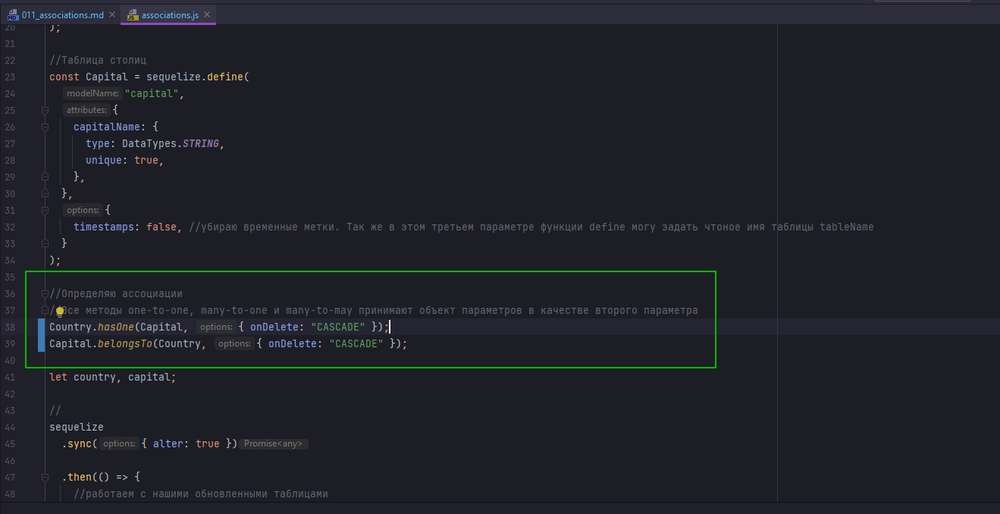

```js
//associations.js
const Sequelize = require("sequelize");
const { DataTypes, Op } = require("sequelize");
const { log } = require("nodemon/lib/utils");

const sequelize = new Sequelize("network", "asu8", "123", {
  host: "10.178.4.52",
  dialect: "mysql",
});

//Таблица стран
const Country = sequelize.define(
  "country",
  {
    countryName: { type: DataTypes.STRING, unique: true },
  },
  {
    timestamps: false, //убираю временные метки. Так же в этом третьем параметре функции define могу задать чтоное имя таблицы tableName
  }
);

//Таблица столиц
const Capital = sequelize.define(
  "capital",
  {
    capitalName: {
      type: DataTypes.STRING,
      unique: true,
    },
  },
  {
    timestamps: false, //убираю временные метки. Так же в этом третьем параметре функции define могу задать чтоное имя таблицы tableName
  }
);

//Определяю ассоциации
//Все методы one-to-one, many-to-one и many-to-may принимают объект параметров в качестве второго параметра
Country.hasOne(Capital, { onDelete: "CASCADE" });
Capital.belongsTo(Country, { onDelete: "CASCADE" });

let country, capital;

//
sequelize
  .sync({ alter: true })

  .then(() => {
    //работаем с нашими обновленными таблицами
    return Country.findOne({
      where: {
        countryName: "Франция",
      },
    });
  })
  .then((data) => {
    country = data;
    return Capital.findOne({
      where: {
        capitalName: "Париж",
      },
    });
  })
  .then((data) => {
    capital = data;
    return capital.setCountry(country);
  })
  .then((data) => {
    console.log(data);
  })
  .catch((error) => {
    console.log(error);
  });

```

Так что это по существу означает что если мы удаляем страну, удаляем все связанные с ней внешнии ключи, потому что это взаимооднозначные отношения.

Разберем на примере.

Реализую удаление

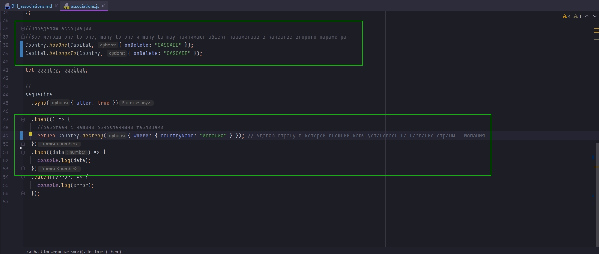


```js
//associations.js
const Sequelize = require("sequelize");
const { DataTypes, Op } = require("sequelize");
const { log } = require("nodemon/lib/utils");

const sequelize = new Sequelize("network", "asu8", "123", {
  host: "10.178.4.52",
  dialect: "mysql",
});

//Таблица стран
const Country = sequelize.define(
  "country",
  {
    countryName: { type: DataTypes.STRING, unique: true },
  },
  {
    timestamps: false, //убираю временные метки. Так же в этом третьем параметре функции define могу задать чтоное имя таблицы tableName
  }
);

//Таблица столиц
const Capital = sequelize.define(
  "capital",
  {
    capitalName: {
      type: DataTypes.STRING,
      unique: true,
    },
  },
  {
    timestamps: false, //убираю временные метки. Так же в этом третьем параметре функции define могу задать чтоное имя таблицы tableName
  }
);

//Определяю ассоциации
//Все методы one-to-one, many-to-one и many-to-may принимают объект параметров в качестве второго параметра
Country.hasOne(Capital, { onDelete: "CASCADE" });
Capital.belongsTo(Country, { onDelete: "CASCADE" });

let country, capital;

//
sequelize
  .sync({ alter: true })

  .then(() => {
    //работаем с нашими обновленными таблицами
    return Country.destroy({ where: { countryName: "Испания" } }); // Удаляю страну в которой внешний ключ установлен на название страны - Испания
  })
  .then((data) => {
    console.log(data);
  })
  .catch((error) => {
    console.log(error);
  });

```

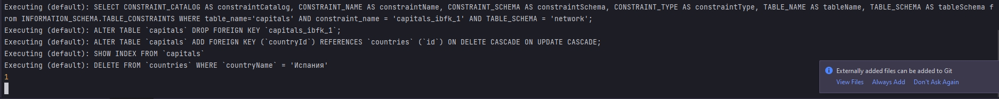

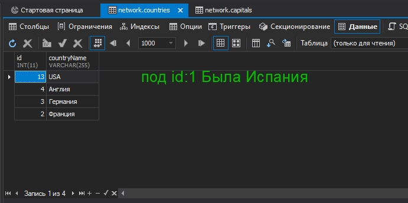

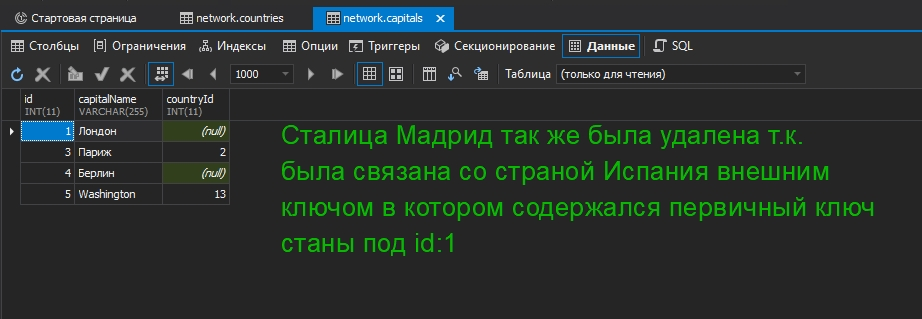

Это произошло потому что мы установили каскадное удаление. По этому когда мы удалили нашу страну, он удалил все внешнии ключи в дочерней таблице связанные с этой страной, а именно Мадрид т.к. по внешнему ключу 1 Испания ссылалась на мадрид.

И еще раз поскольку это **one-to-one** была удалена только одна запись из нашей дочерней таблицы. 


И мы конечно можем сделать тоже самое при обновлении.

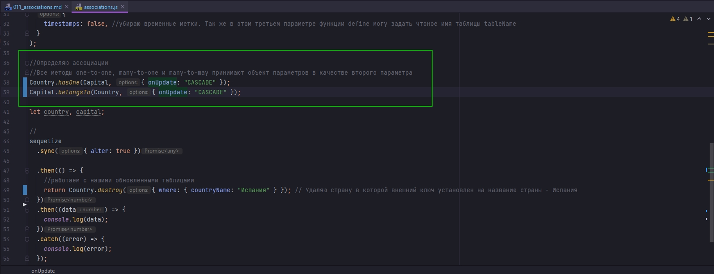

Это означает что если первичный ключ был обновлен или изменен, соответствующее значение в столбце внешнего ключа в дочерней таблице так же будет обновлен, что бы соответствовать первичному ключу в родительской таблице. И конечно в **CASCADE** есть другие параметры.

Список возможных параметров ограничить **CASCADE** без действий, установить значение по умолчанию.


<br/>
<br/>
<br/>

# belongsTo_vs_hasMany_when_Linking_Records

**belongsTo** и **hasMany** при связывании записей.

Это то что меня немного смутило. Я помню как при **one-to-one** столбцы внешнего ключа должны быть уникальными. Другими словами не должно быть повторяющихся внешних ключей в столбце внешнего ключа в ассоциациях один к одному. Потому что в ассоциации один к одному должна быть только одна ссылка в дочерней таблице на родительскую таблицу.

Давайте рассмотрим следующий пример.

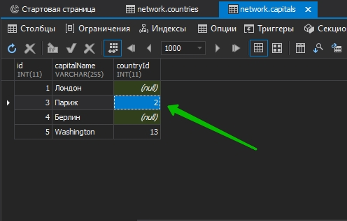

Как видите сталице Париж присвоен индентификатор внешнего ключа **2** по которому мы ссылаемся на страну Франция

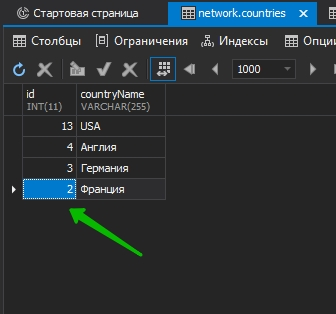


Если я установлю индентификатор внешнего ключа Лондон так же на **2**. И давайте посмотрим что получится.

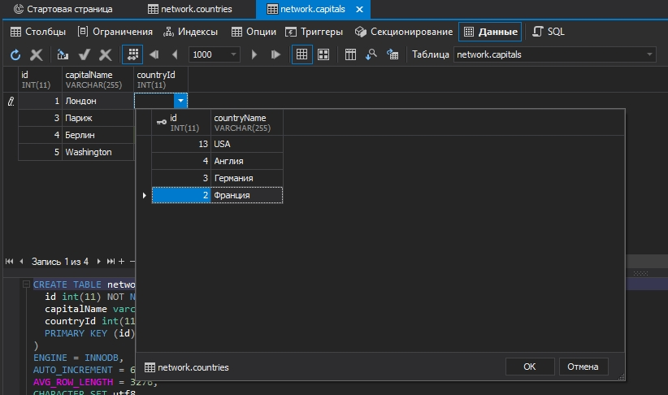

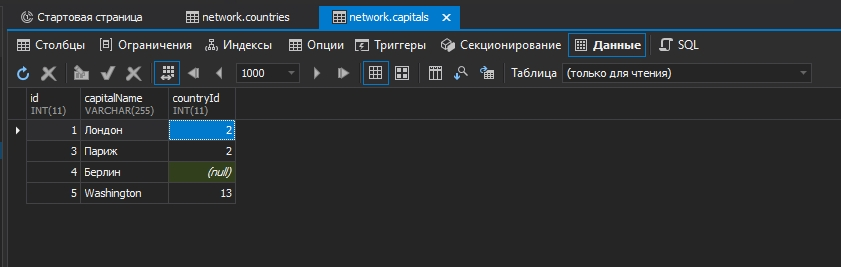

Пишу следующий код. Связываю внешним ключом Францию и Лондон

```js
//associations.js
const Sequelize = require("sequelize");
const { DataTypes, Op } = require("sequelize");
const { log } = require("nodemon/lib/utils");

const sequelize = new Sequelize("network", "asu8", "123", {
    host: "10.178.4.52",
    dialect: "mysql",
});

//Таблица стран
const Country = sequelize.define(
    "country",
    {
        countryName: { type: DataTypes.STRING, unique: true },
    },
    {
        timestamps: false, //убираю временные метки. Так же в этом третьем параметре функции define могу задать чтоное имя таблицы tableName
    }
);

//Таблица столиц
const Capital = sequelize.define(
    "capital",
    {
        capitalName: {
            type: DataTypes.STRING,
            unique: true,
        },
    },
    {
        timestamps: false, //убираю временные метки. Так же в этом третьем параметре функции define могу задать чтоное имя таблицы tableName
    }
);

//Определяю ассоциации
//Все методы one-to-one, many-to-one и many-to-may принимают объект параметров в качестве второго параметра
Country.hasOne(Capital, { onUpdate: "CASCADE" });
Capital.belongsTo(Country, { onDelete: "CASCADE" });

let country, capital;

//
sequelize
    .sync({ alter: true })

    .then(() => {
        //работаем с нашими обновленными таблицами
        return Country.findOne({ where: { countryName: "Франция" } });
    })
    .then((data) => {
        country = data;
        return Capital.findOne({ where: { capitalName: "Лондон" } });
    })
    .then((data) => {
        console.log(data);
        capital = data;
        return country.setCapital(capital);
    })
    .then((data) => {
        console.log(data);
    })

    .catch((error) => {
        console.log(error);
    });

```

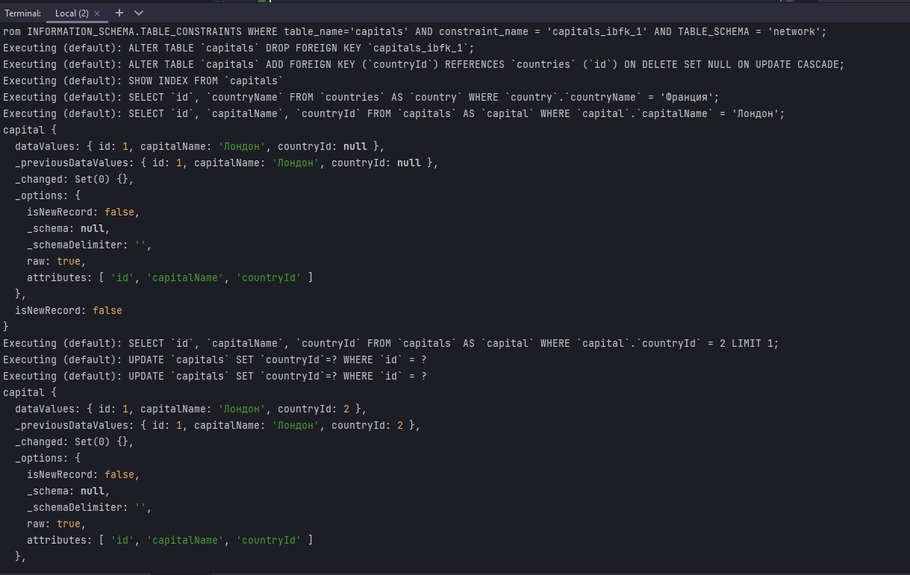

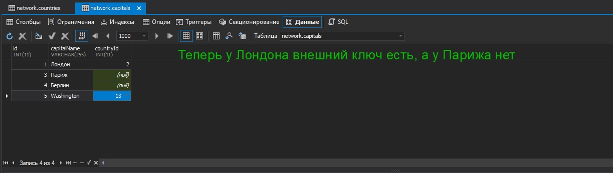

Мы остались верны тому факту что это отношение один к одному. Потому что в противном случае этот индентификатор страны Франция равный 2 был бы присвоен двум сталицам, Парижу и Лондону. Но это будет отношение **one-to-many**.

Теперь попробую наоборот сталице присвоить внешний ключ на страну.

```js
//associations.js
const Sequelize = require("sequelize");
const { DataTypes, Op } = require("sequelize");
const { log } = require("nodemon/lib/utils");

const sequelize = new Sequelize("network", "asu8", "123", {
  host: "10.178.4.52",
  dialect: "mysql",
});

//Таблица стран
const Country = sequelize.define(
  "country",
  {
    countryName: { type: DataTypes.STRING, unique: true },
  },
  {
    timestamps: false, //убираю временные метки. Так же в этом третьем параметре функции define могу задать чтоное имя таблицы tableName
  }
);

//Таблица столиц
const Capital = sequelize.define(
  "capital",
  {
    capitalName: {
      type: DataTypes.STRING,
      unique: true,
    },
  },
  {
    timestamps: false, //убираю временные метки. Так же в этом третьем параметре функции define могу задать чтоное имя таблицы tableName
  }
);

//Определяю ассоциации
//Все методы one-to-one, many-to-one и many-to-may принимают объект параметров в качестве второго параметра
Country.hasOne(Capital, { onUpdate: "CASCADE" });
Capital.belongsTo(Country, { onDelete: "CASCADE" });

let country, capital;

//
sequelize
  .sync({ alter: true })

  .then(() => {
    //работаем с нашими обновленными таблицами
    return Country.findOne({ where: { countryName: "Франция" } });
  })
  .then((data) => {
    country = data;
    return Capital.findOne({ where: { capitalName: "Париж" } });
  })
  .then((data) => {
    console.log(data);
    capital = data;
    return capital.setCountry(country);
  })
  .then((data) => {
    console.log(data);
  })

  .catch((error) => {
    console.log(error);
  });

```


И вот что странно у него теперь Лондону и Парижу принадлежит внешний ключ и Лондону и Парижу при явно прописанной ассоциации **hasOne**.

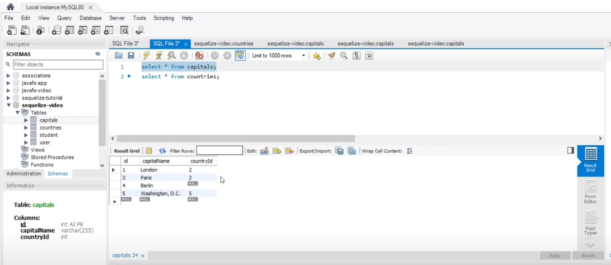

Дальше он объясняет что это не та ассоциация которая .... 


У меня же присвоился внешний ключ Парижу а у Лондона стал **Null**.

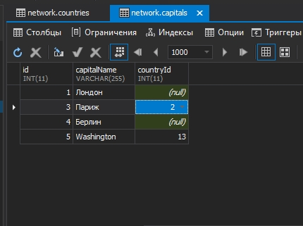


<br/>
<br/>
<br/>

# What_is_a_One_to_Many_Association

Что такое ассоциация один ко многим?

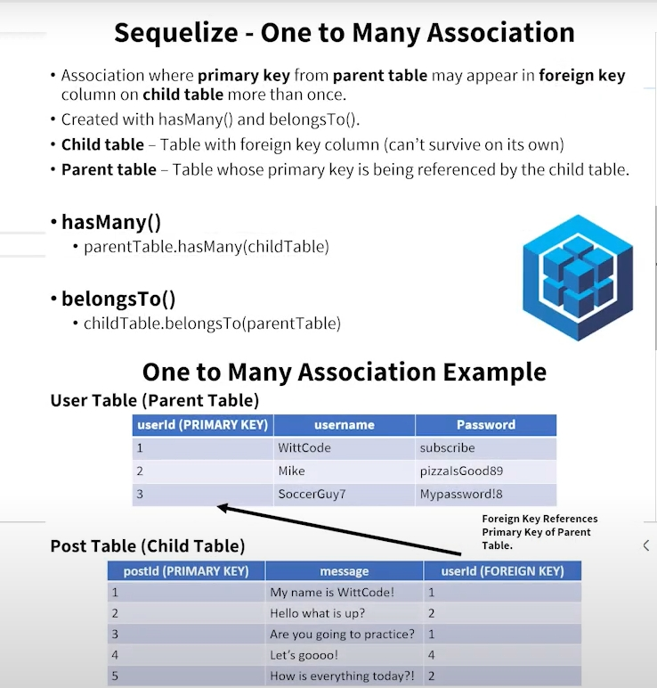

**Один ко многоим** - это когда запись или строка в родительской таблице потенционально могут ссылаться на несколько записей или строк в дочерней таблице. Например это сообщения которые пользователь создает в приложении. У одного пользователя много сообщений. И сообщения принадлежат одному пользователю.

По этому у нас будут пользователи в качестве родительской таблицы, а сообщения в качестве дочерней таблицы. И в столбце внешнего ключа дочерней таблицы, в таблице **posts**, может быть много вхождений одного первичного ключа из родительской таблицы.


<br/>
<br/>
<br/>

# Setting_Up_Models_to_Demonstrate_One_to_Many 

Настройка модели для демострации **one-to-many**

По этому что бы настроить эту настройку я собираюсь создать в корне проекта файл **associations2.js**

```js
const Sequelize = require("sequelize");
const { DataTypes, Op } = require("sequelize");

const sequelize = new Sequelize("network", "asu8", "123", {
  host: "10.178.4.52",
  dialect: "mysql",
});

//Модель пользователей
const User = sequelize.define(
  "user",
  { username: DataTypes.STRING, password: DataTypes.STRING },
  { timestamps: false }
);

//Модель сообщений
const Post = sequelize.define(
  "post",
  {
    message: DataTypes.STRING,
  },
  {
    timestamps: false,
  }
);

```

И так у меня есть две настройки что бы это продемонстрировать связь один ко многим. По этому для демострации связи один ко многим в **sequelize** мы используем **hasMany** и **belongsTo**. 

У модели **User** много сообщений, по этому модель **User** имеет **hasMany(Post)**. А затем указываю что наши посты принадлежать одному пользователю **Post.belongsTo(User)**.

```js
const Sequelize = require("sequelize");
const { DataTypes, Op } = require("sequelize");

const sequelize = new Sequelize("network", "asu8", "123", {
  host: "10.178.4.52",
  dialect: "mysql",
});

//Модель пользователей
const User = sequelize.define(
  "user",
  { username: DataTypes.STRING, password: DataTypes.STRING },
  { timestamps: false }
);

//Модель сообщений
const Post = sequelize.define(
  "post",
  {
    message: DataTypes.STRING,
  },
  {
    timestamps: false,
  }
);

User.hasMany(Post); // Пользователь имеет много сообщений
Post.belongsTo(User); //Сообщения принадлежат одному пользователю

```

<br/>
<br/>
<br/>

# Creating_a_One_To_Many_Association_with_hasMany_and_belongsTo

>Помните что служебные методы,**hasOne**, **hasMany**, **belongsTo**, размещаются только в исходной модели!!!. В данном случае в модели **User**. 

Вставим несколько пользователей и несколько сообщений. И я сделаю **undelete** **cascade**, что бы показать вам, как пользователь удаляет кажде сообщение которое он сделал. И так же мы будем удалять все сообщения при удалении пользователя так как пользователь уже не является частью нашего приложения. И мы не хотим хранить все его сообщения.

Синхронезирую нашу модель и БД.

```js
const Sequelize = require("sequelize");
const { DataTypes, Op } = require("sequelize");

const sequelize = new Sequelize("network", "asu8", "123", {
  host: "10.178.4.52",
  dialect: "mysql",
});

//Модель пользователей
const User = sequelize.define(
  "user",
  { username: DataTypes.STRING, password: DataTypes.STRING },
  { timestamps: false }
);

//Модель сообщений
const Post = sequelize.define(
  "post",
  {
    message: DataTypes.STRING,
  },
  {
    timestamps: false,
  }
);

User.hasMany(Post); // Пользователь имеет много сообщений
Post.belongsTo(User); //Сообщения принадлежат одному пользователю

//Синхронезирую модель и БД
sequelize
  .sync({ alter: true })
  .then(() => {})
  .catch((error) => {
    console.log(error);
  });

```

Запускаю и смотрим где расположен внешний ключ


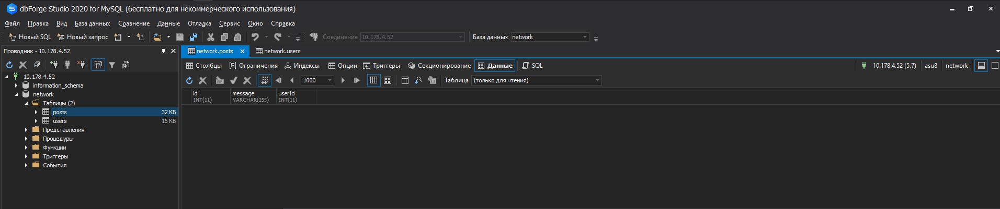

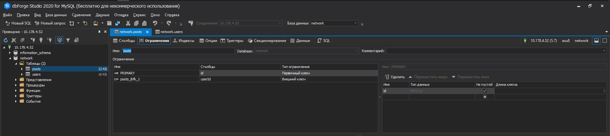

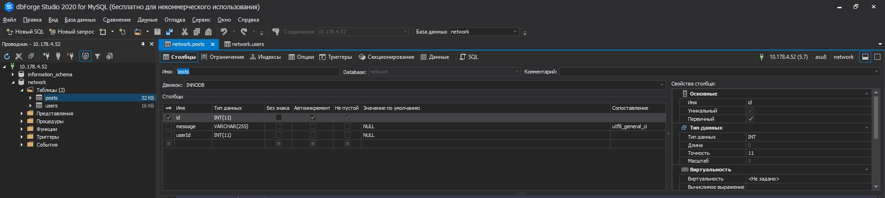

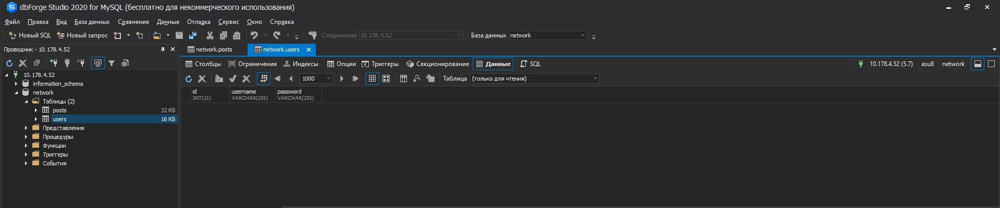

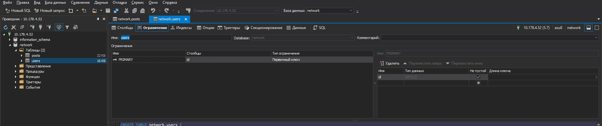

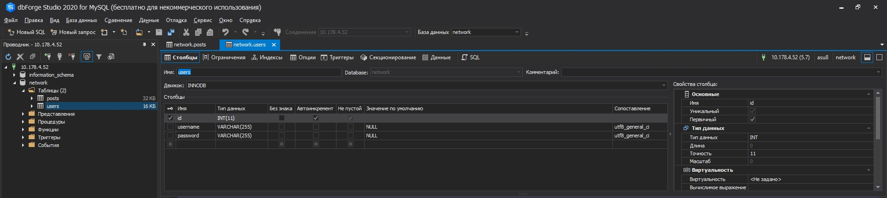

Если вы помните внешний ключ должен быть в дочерней т.е. в целевой таблице, а именно в таблице **posts**

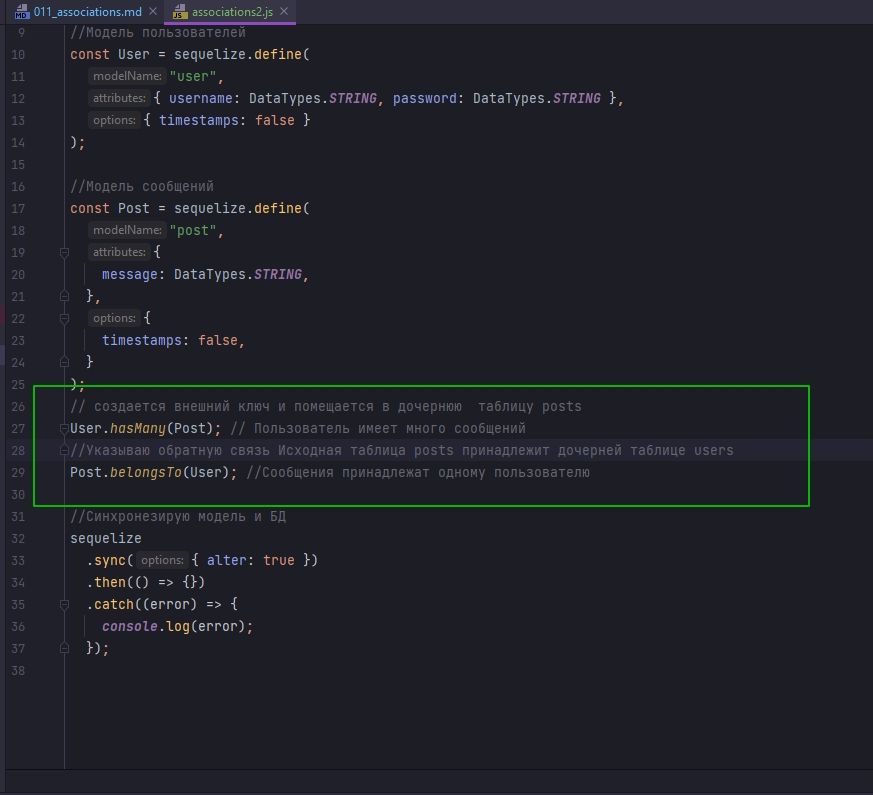

В таблице **users** есть **id**, **username**, **password**. В таблице **posts** у нас есть **userId** который является внешним ключом, который помещается по умолчанию или называется так по умолчанию **sequelize**. Потому что наша модель пользователя называется в едиственном числе. А первичным ключом является индентификатор пользователя. По этому он добавляет столбец **userId**


<br/>
<br/>
<br/>

# Bulk_Creating_Records_to_Demonstrate_One_to_Many

Массовое создание записей для демонстрации **one-to-many**

```js
const Sequelize = require("sequelize");
const { DataTypes, Op } = require("sequelize");

const sequelize = new Sequelize("network", "asu8", "123", {
  host: "10.178.4.52",
  dialect: "mysql",
});

//Модель пользователей
const User = sequelize.define(
  "user",
  { username: DataTypes.STRING, password: DataTypes.STRING },
  { timestamps: false }
);

//Модель сообщений
const Post = sequelize.define(
  "post",
  {
    message: DataTypes.STRING,
  },
  {
    timestamps: false,
  }
);
// создается внешний ключ и помещается в дочернюю  таблицу posts
User.hasMany(Post); // Пользователь имеет много сообщений
//Указываю обратную связь Исходная таблица posts принадлежит дочерней таблице users
Post.belongsTo(User); //Сообщения принадлежат одному пользователю

//Синхронезирую модель и БД
sequelize
  .sync({ alter: true })
  .then(() => {
    User.bulkCreate([
      {
        username: "Константин",
        password: "123",
      },
      {
        username: "Екатерина",
        password: "kat15",
      },
      {
        username: "Илья",
        password: "ilay12",
      },
      {
        username: "Никита",
        password: "nik19",
      },
    ]);
    Post.bulkCreate([
      {
        message: "Потрясающее первое сообщение",
      },
      {
        message: "Потрясающее первое сообщение",
      },
      {
        message: "Потрясающее первое сообщение",
      },
      {
        message: "Потрясающее первое сообщение",
      },
      {
        message: "Потрясающее первое сообщение",
      },
      {
        message: "Потрясающее первое сообщение",
      },
      {
        message: "Потрясающее первое сообщение",
      },
      {
        message: "Потрясающее первое сообщение",
      },
      {
        message: "Потрясающее первое сообщение",
      },
    ]);
  })
  .catch((error) => {
    console.log(error);
  });

```


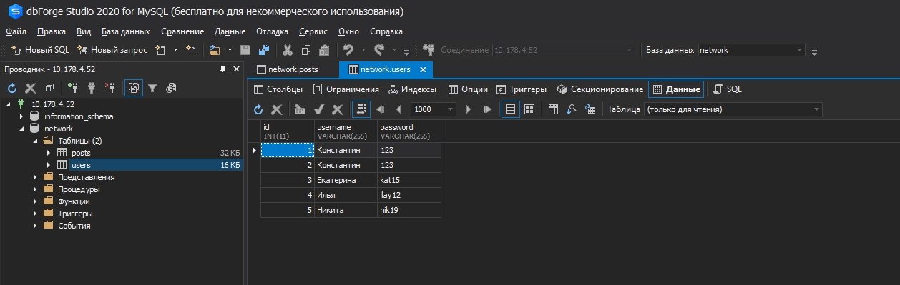

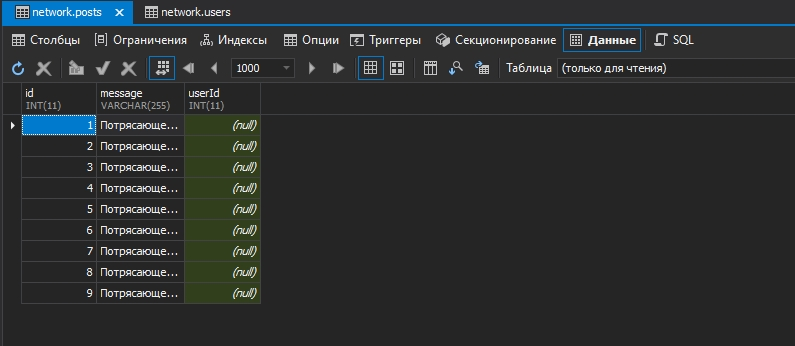

Все **userId** в таблице **posts** равны **null** потому что мы фактически их не связали.

<br/>
<br/>
<br/>

# hasMany_Helper_Methods

Вспомогательные методы **hasMany**.

У метода **hasMany** больше дополнительных методов в отличие от **hasOne**. По этому здесь можно добавить больше методов в нашу исходную модель **User**. Данные методы довольно просты. Но мы рассмотрим не все. Остальные методы смотрите в документации.

Вот здесь

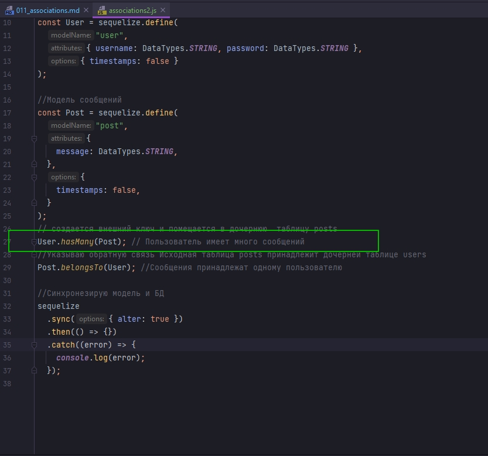

**User** это наша исходная модель, таблица, а **Post** это целевая модель, таблица. Метод **hasMany** позволяет позволяет добавлять в целевую таблицу, внешний ключ в столбец внешнего ключа несколько раз один и тот же внешний ключ.

По этому давайте установим в каждую публикацию, которая будет создаваться, принадлежность к пользователю.

```js
const Sequelize = require("sequelize");
const { DataTypes, Op } = require("sequelize");

const sequelize = new Sequelize("network", "asu8", "123", {
  host: "10.178.4.52",
  dialect: "mysql",
});

//Модель пользователей
const User = sequelize.define(
  "user",
  { username: DataTypes.STRING, password: DataTypes.STRING },
  { timestamps: false }
);

//Модель сообщений
const Post = sequelize.define(
  "post",
  {
    message: DataTypes.STRING,
  },
  {
    timestamps: false,
  }
);
// создается внешний ключ и помещается в дочернюю  таблицу posts
User.hasMany(Post); // Пользователь имеет много сообщений
//Указываю обратную связь Исходная таблица posts принадлежит дочерней таблице users
Post.belongsTo(User); //Сообщения принадлежат одному пользователю

let user, posts;

//Синхронезирую модель и БД
sequelize
  .sync({ alter: true })
  .then(() => {
    //ищу пользователя
    return User.findOne({ where: { username: "Константин" } });
  })
  .then((data) => {
    user = data; //найденный пользователь
    return Post.findAll();
  })
  .then((data) => {
    posts = data; // все найденные сообщения пользователя
    return user.addPosts(posts);
  })
  .then((data) => {
    console.log(data);
  })
  .catch((error) => {
    console.log(error);
  });

```

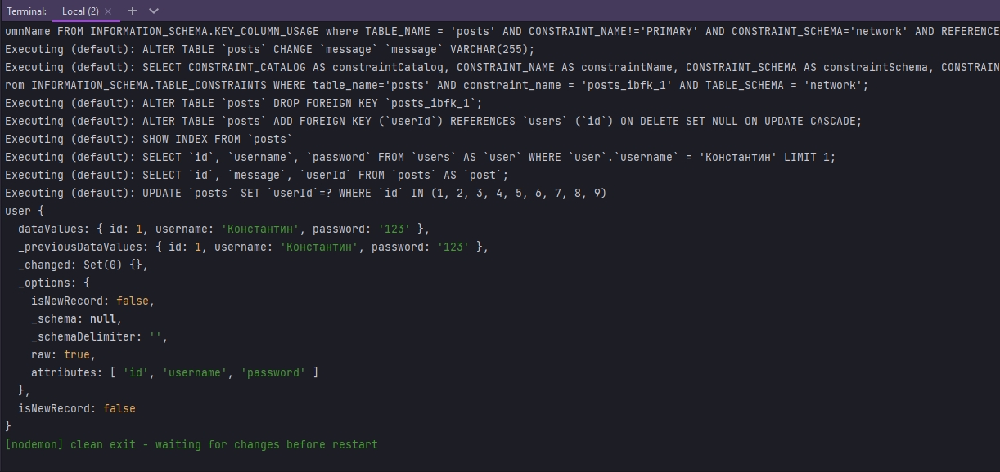

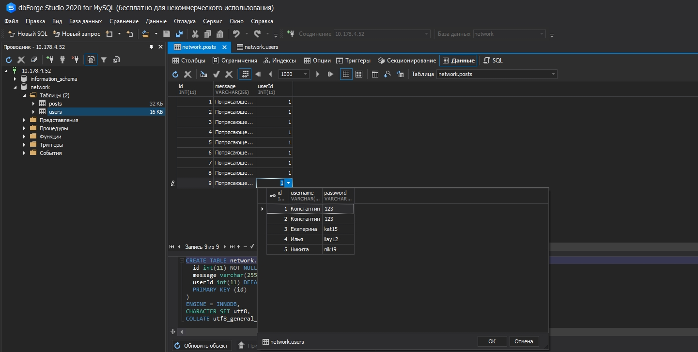


И вот всем сообщениям присвоился внешний ключ, индентефикатор пользователя Константин.

Другой полезный метод который мы можем использовать это подсчет сообщений. И это вернет столько сторок в дочерней таблице связан с определенной строкой в родительской таблице. Для этого использую метод **countPosts**

```js
const Sequelize = require("sequelize");
const { DataTypes, Op } = require("sequelize");

const sequelize = new Sequelize("network", "asu8", "123", {
  host: "10.178.4.52",
  dialect: "mysql",
});

//Модель пользователей
const User = sequelize.define(
  "user",
  { username: DataTypes.STRING, password: DataTypes.STRING },
  { timestamps: false }
);

//Модель сообщений
const Post = sequelize.define(
  "post",
  {
    message: DataTypes.STRING,
  },
  {
    timestamps: false,
  }
);
// создается внешний ключ и помещается в дочернюю  таблицу posts
User.hasMany(Post); // Пользователь имеет много сообщений
//Указываю обратную связь Исходная таблица posts принадлежит дочерней таблице users
Post.belongsTo(User); //Сообщения принадлежат одному пользователю

let user, posts;

//Синхронезирую модель и БД
sequelize
  .sync({ alter: true })
  .then(() => {
    //ищу пользователя
    return User.findOne({ where: { username: "Константин" } });
  })
  .then((data) => {
    user = data; //найденный пользователь
    return user.countPosts(); //
  })

  .then((data) => {
    console.log(data);
  })
  .catch((error) => {
    console.log(error);
  });

```

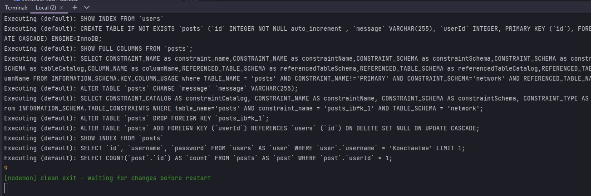

и у нас есть **9** сообщений принадлежащих пользователю **Константин**.


Еще один метод это удаление сообщений. И есть так же метод удаления сообщения. Но я собираюсь показать вам как просто удалить одно сообщение

```js
const Sequelize = require("sequelize");
const { DataTypes, Op } = require("sequelize");

const sequelize = new Sequelize("network", "asu8", "123", {
    host: "10.178.4.52",
    dialect: "mysql",
});

//Модель пользователей
const User = sequelize.define(
    "user",
    { username: DataTypes.STRING, password: DataTypes.STRING },
    { timestamps: false }
);

//Модель сообщений
const Post = sequelize.define(
    "post",
    {
        message: DataTypes.STRING,
    },
    {
        timestamps: false,
    }
);
// создается внешний ключ и помещается в дочернюю  таблицу posts
User.hasMany(Post); // Пользователь имеет много сообщений
//Указываю обратную связь Исходная таблица posts принадлежит дочерней таблице users
Post.belongsTo(User); //Сообщения принадлежат одному пользователю

let user, posts;

//Синхронезирую модель и БД
sequelize
    .sync({ alter: true })
    .then(() => {
        //ищу пользователя
        return User.findOne({ where: { username: "Константин" } });
    })
    .then((data) => {
        user = data; //найденный пользователь
        return Post.findOne(); //Вернет первый найденный элемент
    })

    .then((data) => {
        posts = data; //найденное сообщение
        return user.removePost(posts); //удаляю сообщение пользователя
    })
    .then((data) => {
        console.log(data);
    })
    .catch((error) => {
        console.log(error);
    });

```


И теперь смотрите в первом найденном сообщении был удален внешний ключ пользователя Константин. Индентефикатор пользователя на данную публикацию обновился и стал **null**.

Для того что бы удалить все внешнии ключи мне нужно использовать вместо **findOne**, **findAll** в модели **Post**. 

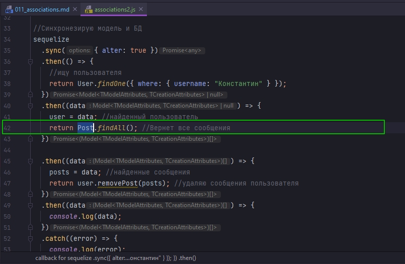

```js
const Sequelize = require("sequelize");
const { DataTypes, Op } = require("sequelize");

const sequelize = new Sequelize("network", "asu8", "123", {
  host: "10.178.4.52",
  dialect: "mysql",
});

//Модель пользователей
const User = sequelize.define(
  "user",
  { username: DataTypes.STRING, password: DataTypes.STRING },
  { timestamps: false }
);

//Модель сообщений
const Post = sequelize.define(
  "post",
  {
    message: DataTypes.STRING,
  },
  {
    timestamps: false,
  }
);
// создается внешний ключ и помещается в дочернюю  таблицу posts
User.hasMany(Post); // Пользователь имеет много сообщений
//Указываю обратную связь Исходная таблица posts принадлежит дочерней таблице users
Post.belongsTo(User); //Сообщения принадлежат одному пользователю

let user, posts;

//Синхронезирую модель и БД
sequelize
  .sync({ alter: true })
  .then(() => {
    //ищу пользователя
    return User.findOne({ where: { username: "Константин" } });
  })
  .then((data) => {
    user = data; //найденный пользователь
    return Post.findAll(); //Вернет все сообщения
  })

  .then((data) => {
    posts = data; //найденные сообщения
    return user.removePost(posts); //удаляю сообщения пользователя
  })
  .then((data) => {
    console.log(data);
  })
  .catch((error) => {
    console.log(error);
  });

```

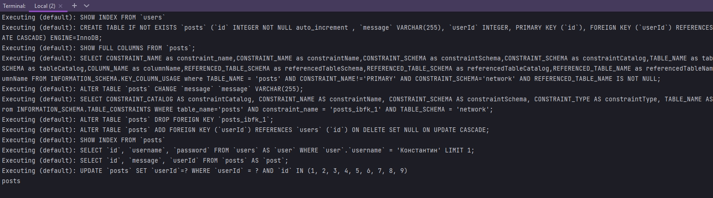

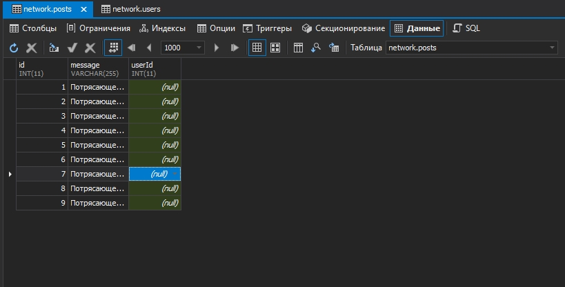


<br/>
<br/>
<br/>

# onDelete_and_onUpdate_with_hasMany

И теперь следующее что я хочу пройти это снова **CASCADE**. Если мы установим каскадное удаление аналогично тому как мы делали ранее. Вторым параметром в ассоциации **hasMany** указываю **{onDelete:'CASCADE}** и у ассоциации **belongsTo**. 

Длаее в первой цепочке **then** вызываю модель **User** у которой вызываю метод **destroy**. И далее пишу условие **where:{username:'Константин'}**. Далее я не перехожу к следующей цепочке then так как пользователь все равно будет уничтожен.


```js
const Sequelize = require("sequelize");
const { DataTypes, Op } = require("sequelize");
const { log } = require("nodemon/lib/utils");

const sequelize = new Sequelize("sequelize_002", "root", "4343", {
  // host: "10.178.4.52",
  dialect: "mysql",
});

//Модель пользователей
const User = sequelize.define(
  "user",
  { username: DataTypes.STRING, password: DataTypes.STRING },
  { timestamps: false }
);

//Модель сообщений
const Post = sequelize.define(
  "post",
  {
    message: DataTypes.STRING,
  },
  {
    timestamps: false,
  }
);
// создается внешний ключ и помещается в дочернюю  таблицу posts
User.hasMany(Post, { onDelete: "CASCADE" }); // Пользователь имеет много сообщений
//Указываю обратную связь Исходная таблица posts принадлежит дочерней таблице users
Post.belongsTo(User, { onDelete: "CASCADE" }); //Сообщения принадлежат одному пользователю

let user, posts;

//Синхронезирую модель и БД
sequelize
  .sync({ alter: true })
  .then(() => {
    return User.destroy({ where: { username: "Константин" } });
  })

  .catch((error) => {
    console.log(error);
  });

```

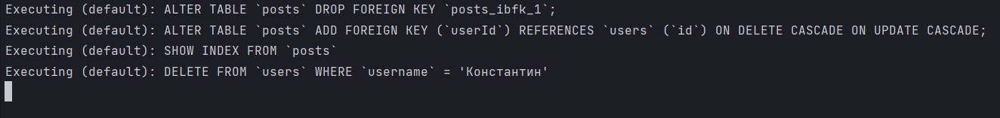

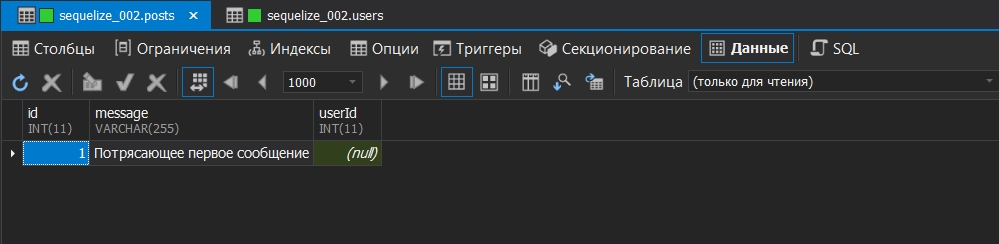

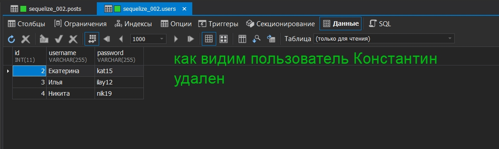

И вот с помощью каскадного удаления мы удалили все что имеет внешний ключ или первичный ключ Константина, который находился в таблице внешнего ключа таблицы **posts**

<br/>
<br/>
<br/>


# belongsTo_Helper_Methods_with_One_to_Many

Мы получили несколько новых служебных методов для использования метода **hasMany**. Но мы все еще собираемся использовать принадлежность к сообщениям. Потому что сообщения принадлежат только одному пользователю. По этому не будет ни каких методов таких как добавление пользователей во множественном числе или удаление пользователей во множественном числе.
Пользователь получает те же методы из нашей взаимно-однозначной ассоциации,**belongsTo**, которые будут получать пользователи.

Давайте сначала найдем нашего первого пользователя. Во второй цепочке then получаю этого пользователя. Затем обращаюсь к модели **Post** вызываю **findOne**. В следующей цепочке **then** олучаю эту публикацию, сообщение. После чего обращаюсь к найденному сообщению **posts** и вызываю сеттер **setUser(user)** и получаю данного пользователя. Т.е. я получаю того пользователя который отправил данное сообщение.

```js
const Sequelize = require("sequelize");
const { DataTypes, Op } = require("sequelize");
const { log } = require("nodemon/lib/utils");

const sequelize = new Sequelize("sequelize_002", "root", "4343", {
    // host: "10.178.4.52",
    dialect: "mysql",
});

//Модель пользователей
const User = sequelize.define(
    "user",
    { username: DataTypes.STRING, password: DataTypes.STRING },
    { timestamps: false }
);

//Модель сообщений
const Post = sequelize.define(
    "post",
    {
        message: DataTypes.STRING,
    },
    {
        timestamps: false,
    }
);
// создается внешний ключ и помещается в дочернюю  таблицу posts
User.hasMany(Post, { onDelete: "CASCADE" }); // Пользователь имеет много сообщений
//Указываю обратную связь Исходная таблица posts принадлежит дочерней таблице users
Post.belongsTo(User, { onDelete: "CASCADE" }); //Сообщения принадлежат одному пользователю

let user, posts;

//Синхронезирую модель и БД
sequelize
    .sync({ alter: true })
    .then(() => {
        return User.findOne();
    })
    .then((data) => {
        user = data;
        return Post.findOne();
    })
    .then((data) => {
        posts = data;
        posts.setUser(user); // Связываю сообщение с конкретным пользователем.
    })

    .catch((error) => {
        console.log(error);
    });

```

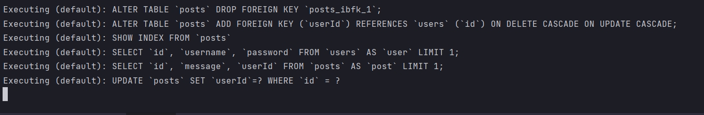

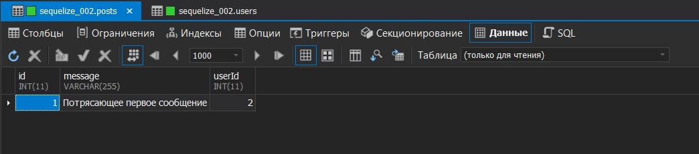

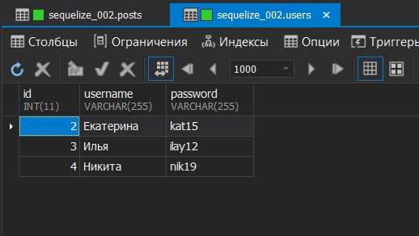

И вот мы установили внешний ключ первого найденного пользователя, который равен двум, первому найденному сообщению. Он указан в калонке **userId**. Спомощью **belongsTo** я просто получаю сообщение которое принадлежит определенному пользователю


<br/>
<br/>
<br/>


# What_is_a_Many_to_Many_Relationship

Что такое отношение многие ко многим.

И теперь окончательная ассоциация которую я хочу рассмотреть это многие ко многим.

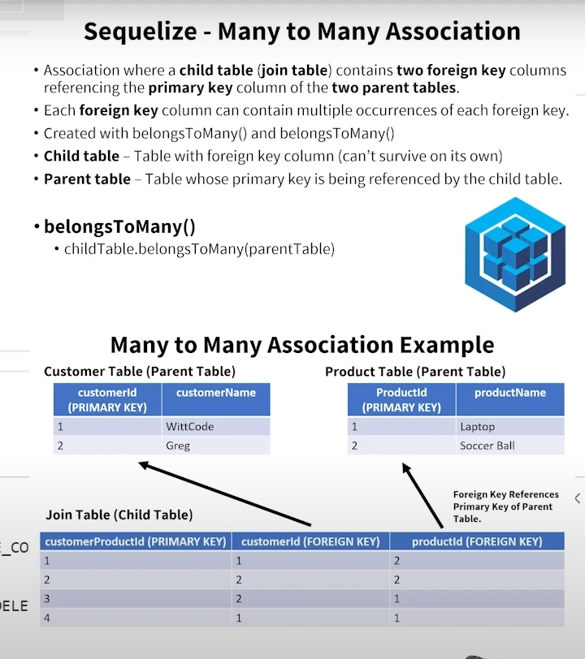

Отношение многие ко многим возникает когда несколько записей или строк в таблице связаны с несколькими записями или строками в другой таблице. 

Примером этого является отношение между покупителями продуктами. Клиент может приобрести множество продуктов. А продукт может быть преобретен  многими клиентами. Отношение многие ко многим немного сложнее чем отношения один ко многим, и один кодному.

Отношение один ко многим не позволяют на прямую реализовать отношение один ко многим. Вместо этого вы разбиваете отношение многие ко многим на два отношения **one-to-many** использую третью таблицу называемой таблицей соединения. И кажждая запись иои строка в таблице соединения будет содержать первичные ключи обеих таблиц. И поскольку первичные ключи других таблиц находяться в объедененной таблице. Это означает что объедененная таблица - это то, что содержит внешние ключи, внешние ключи обеспечивают ссылки на другие таблицы. Внешние ключи ссылаются на первичные ключи в других таблицах.

Однако таблица соединений известна как модель соединения. По этому модель соединения - это дополнительная модель, или дополнительная таблица в БД, которая имеет несколько столбцов внешнего ключа.  И в любом случае отслеживает ассоциации.

<br/>
<br/>
<br/>

# Creating_Models_to_Demonstrate_Many_to_Many

Давайте сначала создадим две таблицы. Создаю файл

```js
const Sequelize = require("sequelize");
const { DataTypes, Op, STRING } = require("sequelize");

const sequelize = new Sequelize("network", "asu8", "123", {
  host: "10.178.4.52",
  dialect: "mysql",
});

//Модель покупателя
const Customer = sequelize.define(
  "customer",
  {
    customerName: {
      type: DataTypes.STRING,
    },
  },
  { timestamps: false }
);

//Модель продуктов
const Product = sequelize.define(
  "product",
  {
    productName: {
      type: DataTypes.STRING,
    },
  },
  {
    timestamps: false,
  }
);

//отношение многие ко многим
Customer.belongsToMany(Product);
Product.belongsToMany(Customer);

```

# Creating_a_Many_to_Many_with_belongsToMany

Однако если вы помните нам нужна соеденяющая таблица для хранения наших внешних ключей. Это делается в рамках параметра объектов переданного в **belongsToMany**.

Мы должны передать так называемый сквозной ключ. Он требуется при создании отношений многие ко многим. Для создания сквозного ключа использую атрибут **through(перев. Через)**. В значении **through** указываю название таблицы в которой я буду хранить внешние ключи.

```js
const Sequelize = require("sequelize");
const { DataTypes, Op, STRING } = require("sequelize");

const sequelize = new Sequelize("network", "asu8", "123", {
  host: "10.178.4.52",
  dialect: "mysql",
});

//Модель покупателя
const Customer = sequelize.define(
  "customer",
  {
    customerName: {
      type: DataTypes.STRING,
    },
  },
  { timestamps: false }
);

//Модель продуктов
const Product = sequelize.define(
  "product",
  {
    productName: {
      type: DataTypes.STRING,
    },
  },
  {
    timestamps: false,
  }
);

//отношение многие ко многим
Customer.belongsToMany(Product, { through: "customerproduct" });
Product.belongsToMany(Customer, { through: "customerproduct" });

```

**customerproduct** - это будет нашей моделью соединения которая будет содержать каждый внешний ключ. Который связывает эти две таблицы. По этому здесь автоматически создается модель **customerproduct**, которая будет содержать наши внешнинии ключи 

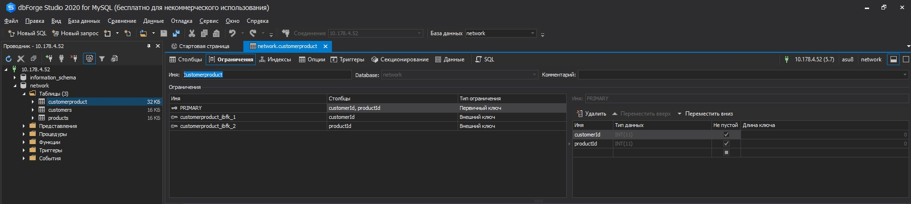

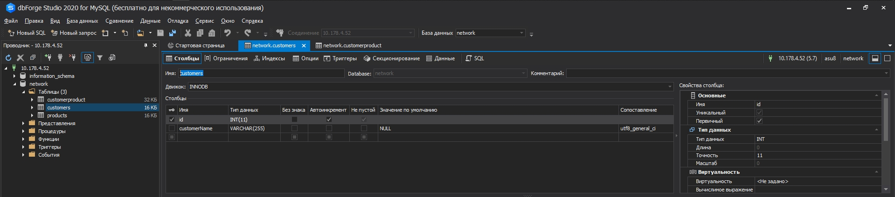

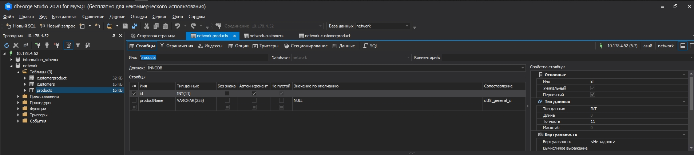

Как видите у нас в **customerproduct** есть **productId** и **customerId** которые будут внешними ключами, ссылками. Как видите в наших таблицах **products** и **customers** нет столбцов с внешнего ключа, потому что все они размещены в таблице **customerproduct**. В таблице **customerproduct** есть метки времени, созданные и обновленные 


# Passing_More_Options_to_belongsToMany

Передача дополнительных параметров в **belongsToMany**.

Кроме сквозного ключа, мы можем изменить имя внешнего ключа который мы поместили в таблицу. Я могу указать **foreignKey**

```js
const Sequelize = require("sequelize");
const { DataTypes, Op, STRING } = require("sequelize");

const sequelize = new Sequelize("network", "asu8", "123", {
  host: "10.178.4.52",
  dialect: "mysql",
});

//Модель покупателя
const Customer = sequelize.define(
  "customer",
  {
    customerName: {
      type: DataTypes.STRING,
    },
  },
  { timestamps: false }
);

//Модель продуктов
const Product = sequelize.define(
  "product",
  {
    productName: {
      type: DataTypes.STRING,
    },
  },
  {
    timestamps: false,
  }
);

//отношение многие ко многим
Customer.belongsToMany(Product, {
  through: "customerproduct",
  foreignKey: "customer_id",
});
Product.belongsToMany(Customer, {
  through: "customerproduct",
  foreignKey: { name: "product_id" },
});

//Синхронизация с БД
sequelize
  .sync({ alter: true })
  .then(() => {})
  .catch((error) => {
    console.log(error);
  });

```

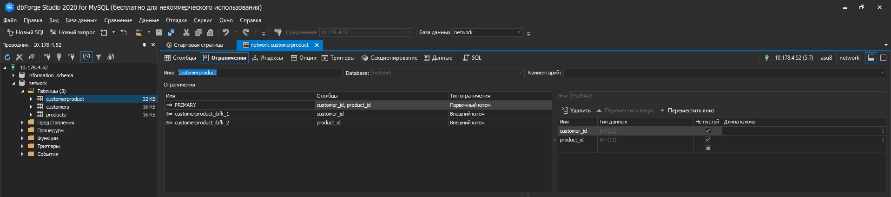

Пришлось удалить таблицы что бы изменения применились.


<br/>
<br/>
<br/>


# Creating_Our_Own_Junction_Table

Создание собственной соеденительной таблицы.

Еще одну вещь которую вы можете сделать это создать собственную соеденительную таблицу. По этому если мы хотим создать таблицу соеденений продуктов **products** и клиентов **customers**. Мы могли бы сделать это обычным способом, которым мы создаем модель. По этому давайте давайте сделаем это и избавимся от временных меток, а так же добавим первичный ключ.

```js
const Sequelize = require("sequelize");
const { DataTypes, Op, STRING } = require("sequelize");

const sequelize = new Sequelize("network", "asu8", "123", {
    host: "10.178.4.52",
    dialect: "mysql",
});

//Модель покупателя
const Customer = sequelize.define(
    "customer",
    {
        customerName: {
            type: DataTypes.STRING,
        },
    },
    { timestamps: false }
);

//Модель продуктов
const Product = sequelize.define(
    "product",
    {
        productName: {
            type: DataTypes.STRING,
        },
    },
    {
        timestamps: false,
    }
);

//модель объеденения товаров и клиентов
const customerProduct = sequelize.define(
    "customerproduct",
    {
        customerproductId: {
            type: DataTypes.INTEGER,
            primaryKey: true,
            autoIncrement: true,
        },
    },
    { timestamps: false }
);

//отношение многие ко многим
Customer.belongsToMany(Product, {
    through: customerProduct, //передаю название соеденительной модели
});
Product.belongsToMany(Customer, {
    through: customerProduct, //передаю название соеденительной модели
});

//Синхронизация с БД
sequelize
    .sync({ alter: true })
    .then(() => {})
    .catch((error) => {
        console.log(error);
    });

```

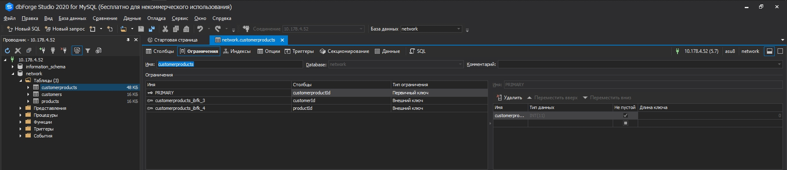

Смотрите как мы создали модель, то при создании модели **sequelize** автоматически присвоил ей множественное число **customerproducts**. И теперь как видите у меня есть **customerproductId** который является первичным ключом. Нет меток времени. А так же есть два внешних ключа **customerId** и **productId**.


<br/>
<br/>
<br/>


# Bulk_Creating_Records_to_Demonstrate_Many_to_Many

Массовое создание записи для демострации **Many-to-Many**.

```js
const Sequelize = require("sequelize");
const { DataTypes, Op, STRING } = require("sequelize");

const sequelize = new Sequelize("network", "asu8", "123", {
  host: "10.178.4.52",
  dialect: "mysql",
});

//Модель покупателя
const Customer = sequelize.define(
  "customer",
  {
    customerName: {
      type: DataTypes.STRING,
    },
  },
  { timestamps: false }
);

//Модель продуктов
const Product = sequelize.define(
  "product",
  {
    productName: {
      type: DataTypes.STRING,
    },
  },
  {
    timestamps: false,
  }
);

//модель объеденения товаров и клиентов
const customerProduct = sequelize.define(
  "customerproduct",
  {
    customerproductId: {
      type: DataTypes.INTEGER,
      primaryKey: true,
      autoIncrement: true,
    },
  },
  { timestamps: false }
);

//отношение многие ко многим
Customer.belongsToMany(Product, {
  through: customerProduct, //передаю название соеденительной модели
});
Product.belongsToMany(Customer, {
  through: customerProduct, //передаю название соеденительной модели
});

//Синхронизация с БД
sequelize
  .sync({ alter: true })
  .then(() => {
    Customer.bulkCreate([
      { customerName: "Константин" },
      { customerName: "Екатерина" },
      { customerName: "Илья" },
      { customerName: "Никита" },
    ]);

    Product.bulkCreate([
      { productName: "Батон" },
      { productName: "Морожение" },
      { productName: "Макароны" },
      { productName: "Орехи" },
    ]);
  })
  .catch((error) => {
    console.log(error);
  });

```

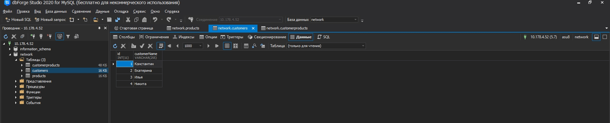

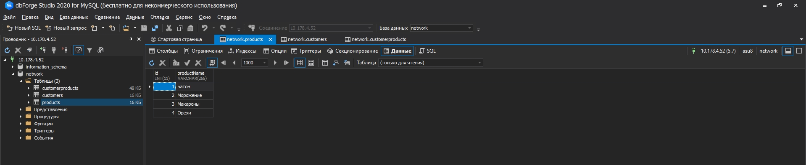

<br/>
<br/>
<br/>


# belongsToMany_Helper_Methods

Теперь давайте начнем добавлять в нашу таблицу соеденений что бы мы могли связать две таблицы с ассоциацией многие-ко-многим. Конечно мы собираемся делать это с помощью служебных методов. 

На самом деле эти методы точно такие же как и те которые предоставляет **hasMany**. По этому они точно такие же, как и те, которые мы использовали в наших отношениях один-ко-многим.

Давайте сначало начнем с добавления **product**, которые если вы помните, добавлятся во множественном числе. Так же **product** является дочерней таблицей.

Поскольку таблица **customerproducts** содержит внешнии ключи таблиц **customers** и **products**, которые еще технически формируют связь между нашим продуктом и клиентом. 

```js
const Sequelize = require("sequelize");
const { DataTypes, Op, STRING } = require("sequelize");

const sequelize = new Sequelize("network", "asu8", "123", {
  host: "10.178.4.52",
  dialect: "mysql",
});

//Модель покупателя
const Customer = sequelize.define(
  "customer",
  {
    customerName: {
      type: DataTypes.STRING,
    },
  },
  { timestamps: false }
);

//Модель продуктов
const Product = sequelize.define(
  "product",
  {
    productName: {
      type: DataTypes.STRING,
    },
  },
  {
    timestamps: false,
  }
);

//модель объеденения товаров и клиентов
const customerProduct = sequelize.define(
  "customerproduct",
  {
    customerproductId: {
      type: DataTypes.INTEGER,
      primaryKey: true,
      autoIncrement: true,
    },
  },
  { timestamps: false }
);

//отношение многие ко многим
Customer.belongsToMany(Product, {
  through: customerProduct, //передаю название соеденительной модели
});
Product.belongsToMany(Customer, {
  through: customerProduct, //передаю название соеденительной модели
});

let customer, product;

//Синхронизация с БД
sequelize
  .sync({ alter: true })
  .then(() => {
    return Customer.findOne({ where: { customerName: "Екатерина" } });
  })
  .then((data) => {
    customer = data;
    return Product.findAll();
  })
  .then((data) => {
    product = data;
    customer.addProducts(product);
  })
  .catch((error) => {
    console.log(error);
  });

```

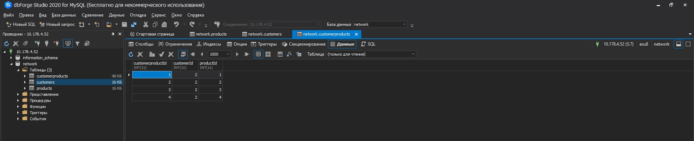

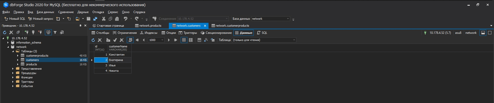

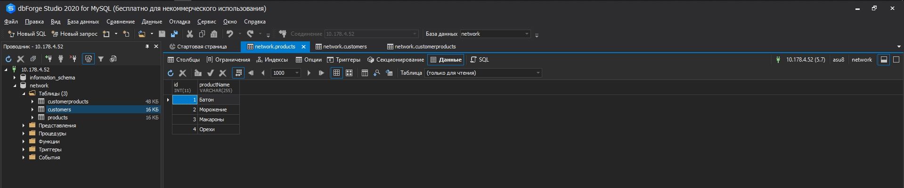

И теперь вы видите что индентификатор клиента  **customerId** для каждого продуката один. 

Но поскольку это отношение **Many-to-Many** у нас может быть много с обеих сторон. Допустим у нас есть продукт который был куплен много раз всеми покупателями.

```js
const Sequelize = require("sequelize");
const { DataTypes, Op, STRING } = require("sequelize");

const sequelize = new Sequelize("network", "asu8", "123", {
  host: "10.178.4.52",
  dialect: "mysql",
});

//Модель покупателя
const Customer = sequelize.define(
  "customer",
  {
    customerName: {
      type: DataTypes.STRING,
    },
  },
  { timestamps: false }
);

//Модель продуктов
const Product = sequelize.define(
  "product",
  {
    productName: {
      type: DataTypes.STRING,
    },
  },
  {
    timestamps: false,
  }
);

//модель объеденения товаров и клиентов
const customerProduct = sequelize.define(
  "customerproduct",
  {
    customerproductId: {
      type: DataTypes.INTEGER,
      primaryKey: true,
      autoIncrement: true,
    },
  },
  { timestamps: false }
);

//отношение многие ко многим
Customer.belongsToMany(Product, {
  through: customerProduct, //передаю название соеденительной модели
});
Product.belongsToMany(Customer, {
  through: customerProduct, //передаю название соеденительной модели
});

let customer, product;

//Синхронизация с БД
sequelize
  .sync({ alter: true })
  .then(() => {
    return Product.findOne({ where: { productName: "Батон" } });
  })
  .then((data) => {
    product = data;
    return Customer.findAll();
  })
  .then((data) => {
    customer = data;
    product.addCustomer(customer);
  })
  .catch((error) => {
    console.log(error);
  });

```

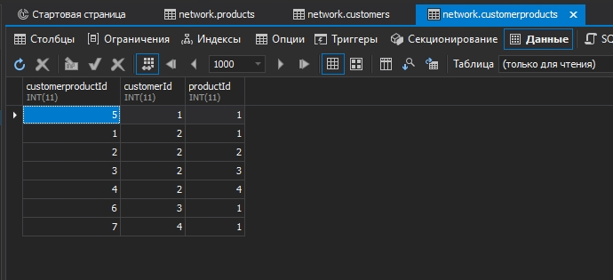

Как видите мы можем иметь несколько вхождений каждого индентификатора или каждого внешнего ключа в каждом столбце.

<br/>
<br/>
<br/>


# onDelete_onUpdate_with_Many_to_Many

С отношениями один к одному и один ко многим по умолчание значение внешенго ключа установлено в **null**. При удалении и каскадировании в отношении **many-to-many** значения по умолчанию для обоих случаев на **update** и **onDelete** являются каскадными **CASCADE**. По этому нам не нужно указывать каскад удаления, он просто автоматически удалит все записи, которые ссылаются на него в таблице соединений.

```js
const Sequelize = require("sequelize");
const { DataTypes, Op, STRING } = require("sequelize");
const { log } = require("nodemon/lib/utils");

const sequelize = new Sequelize("network", "asu8", "123", {
  host: "10.178.4.52",
  dialect: "mysql",
});

//Модель покупателя
const Customer = sequelize.define(
  "customer",
  {
    customerName: {
      type: DataTypes.STRING,
    },
  },
  { timestamps: false }
);

//Модель продуктов
const Product = sequelize.define(
  "product",
  {
    productName: {
      type: DataTypes.STRING,
    },
  },
  {
    timestamps: false,
  }
);

//модель объеденения товаров и клиентов
const customerProduct = sequelize.define(
  "customerproduct",
  {
    customerproductId: {
      type: DataTypes.INTEGER,
      primaryKey: true,
      autoIncrement: true,
    },
  },
  { timestamps: false }
);

//отношение многие ко многим
Customer.belongsToMany(Product, {
  through: customerProduct, //передаю название соеденительной модели
});
Product.belongsToMany(Customer, {
  through: customerProduct, //передаю название соеденительной модели
});

let customer, product;

//Синхронизация с БД
sequelize
  .sync({ alter: true })
  .then(() => {
    return Customer.destroy({ where: { customerName: "Екатерина" } });
  })
  .then((data) => {
    console.log(data);
  })

  .catch((error) => {
    console.log(error);
  });

```

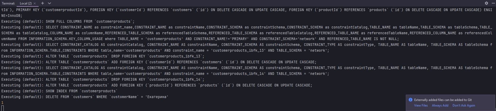

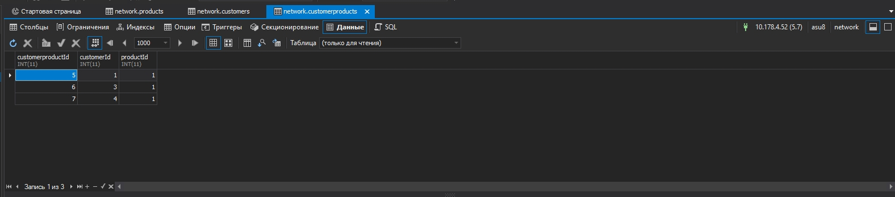

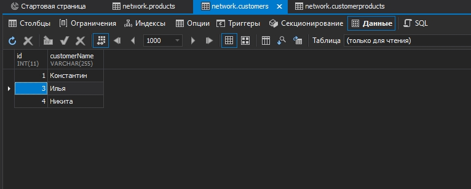

Как видим **customerId:2** пропал. И все продукты которые были куплены данным покупателем так же пропали. И нам даже не нужно было указывать **CASCADE**.

