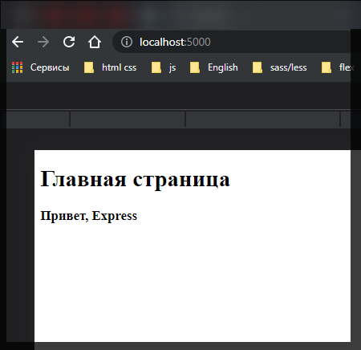
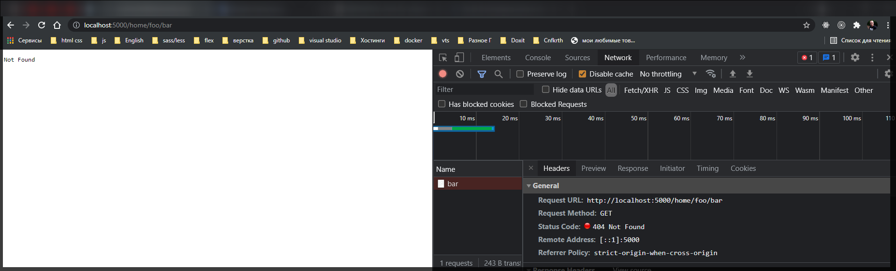
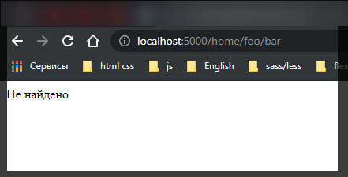

# Отправка ответа.

Для отправки ответа в **express** у объекта **response** можно вызвать ряд функций. Самый распостраненный способ отправки ответа представляет функция **send()**. В качестве параметра эта функция может принимать объект **Buffer**, строку, в том числе с **html** кодом, объект **JS** или массив.

Объект **buffer** формально представляет собой некоторые бинарные данные.

Метод **send** удобен для отправки строк, некторого **html** кода не большой длинны, однако если отправляемый код **html** довольно большой, то соответственно код приложения тоже становится довольно громоздким.

Для этого лучше использовать функцию **sendFile()**

Определим в папке проекта новый **index.html**.

```html
<!DOCTYPE html>
<html>
  <head>
    <title>Главная</title>
    <meta charset="utf-8" />
  </head>
  <body>
    <h1>Главная страница</h1>
    <h3>Привет, Express</h3>
  </body>
  <html></html>
</html>
```

```js
// server index.js

// подключаю express
const express = require('express');

// создаю объект приложения
const app = express();

// определяю обработчик маршрута
app.use('/', function (req, res) {
  res.sendFile(__dirname + '/index.html');
});

// прослушиваю порт
app.listen(5000);
```

В итоге мы получим результат.



Следует учитывать, что в функции **sendFile** необходимо передавать абсолютный путь к файлу, именно для этого с помощью **\_\_dirname** получаем абсолютный путь к текущему проекту, т.е. абсолютный путь от файла **index.js** в котором прописана данная функция **sendFile**. Т.е. получаем абсолютный путь к текущей дирректории и затем добавляем к нему путь к файлу в рамках текущего проекта.

Отправка статусных кодов.

Функция **sendStatus()** отправляет пользователю определенный статусный код с некоторым сообщением по умолчанию.

```js
// server index.js

// подключаю express
const express = require('express');

// создаю объект приложения
const app = express();

// определяю обработчик маршрута
// app.use('/', function (req, res) {
//   res.sendFile(__dirname + '/index.html');
// });

app.use('/home/foo/bar', function (req, res) {
  res.status(404);
});

// прослушиваю порт
app.listen(5000);
```



Как видно из скриншота, при отправке статусного кода **404** так же отправляется сообщение **"Not Found"**. Но возможно мы захотим отправлять свои более информатиные сообщения. В этом случае можно использовать комбинацию функций **status()**, которая так же отправляет статусны код, и функция **send()**.

```js
// server index.js

// подключаю express
const express = require('express');

// создаю объект приложения
const app = express();

// определяю обработчик маршрута
// app.use('/', function (req, res) {
//   res.sendFile(__dirname + '/index.html');
// });

app.use('/home/foo/bar', function (req, res) {
  res.status(404).send('Не найдено');
});

// прослушиваю порт
app.listen(5000);
```


