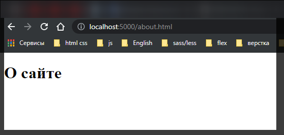
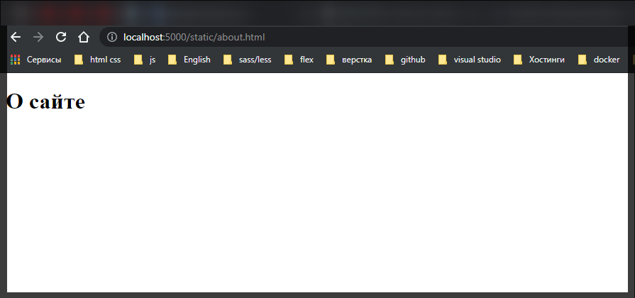

# Статические_файлы

Рассмотрим как в **NodeJS** + **Express** отправлять пользователю статические файлы **html**. Для работы со статическими файлами **Express** определен специальный компонент **express.static()**, который указывает на каталог с файлами.

В папке **server** создаю папку **public** и в ней **about.html**.

```html
<!DOCTYPE html>
<html>
  <head>
    <title>О сайте</title>
    <meta charset="utf-8" />
  </head>
  <body>
    <h1>О сайте</h1>
  </body>
  <html></html>
</html>
```

```js
// server index.js

// подключаю express
const express = require('express');

// создаю объект приложения
const app = express();

app.use(express.static(__dirname + '/public'));

console.log(__dirname);

app.use('/', function (req, res) {
  res.send('<h1>Главная страница</h1>');
});

// прослушиваю порт
app.listen(5000);
```

Я тут подвис и пыталсяс пипки **client** вывести эти статические данные. Однако статические файл используются в самом **express** а не на клиенте. Статические файлы в **express** используют лиш для того когда необходимо вывести какой-нибудь лэндинг в обход клиента.



Что бы встроить компонент **express.static** в процесс обработки запроса, вызывается функция **app.use()**. Эта функция позволяет добавлять различные компоненты, которые еще называются **middleware**, в конвеер обработки запроса.

```js
app.use(express.static(__dirname + '/public'));
```

Причем данный вызов помещается до всех остальных вызовов функции **app.get()**. В саму же функцию **express.static()** передается путь к папке со статическими файлами. Специальное выражение **\_\_dirname** позволяет получить полный путь к папке.

Для того что бы в браузере обратится к статическому файлу указываю

```
http://localhost:5000/about.html
```

Следует отметить что для обращения к файлу мы указываем только имя файла без названия каталога **public**. Так же не следует путать подобное обращение к файлам с действием функции **sendFile:** в данном случае мы напрямую обращаемся к статическим файлам, а функция **sendFile** фактически берет содержимое из файла и отсылает его пользователю.

Дополнительно мы можем изменить путь к каталогу статических файлов.

```js
// server index.js

// подключаю express
const express = require('express');

// создаю объект приложения
const app = express();

app.use('/static', express.static(__dirname + '/public'));

console.log(__dirname);

app.use('/', function (req, res) {
  res.send('<h1>Главная страница</h1>');
});

// прослушиваю порт
app.listen(5000);
```


