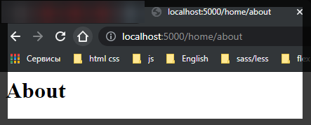
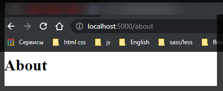
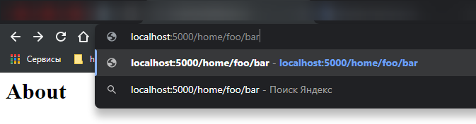
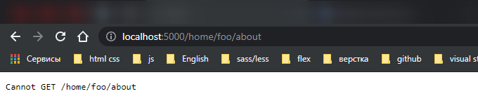
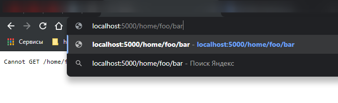
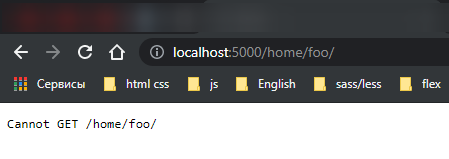
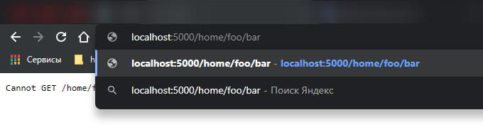
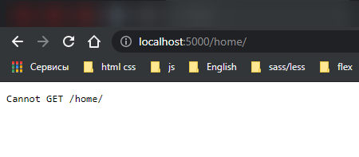

# Переадресация.

Для переадресации применяется метод **redirect()**

```js
redirect([status], path);
```

В качестве параметра **path** передается путь, на который будет перенаправляться пользователь. Дополнительный параметр **status** задает статусный код переадресации. Если этот параметр не задан, тогда по умолчанию отправляется статусный код **302**, который предполагает временную переадресацию.

С помощью данного метода можно выполнить переадресацию как по относительным путям, так и по абсолютным, в том числе и на другие домены.

Переадресация по абсолютному пути.

```js
// server index.js

// подключаю express
const express = require('express');

// создаю объект приложения
const app = express();

app.use('/index', function (req, res) {
  res.redirect('https://metanit.com');
});

// прослушиваю порт
app.listen(5000);
```

Переадресация по относительным путям так же не очень сложна, но здесь важно учитывать, как именно определяется адрес для редиректа. Рассмотрим редирект относительн текущего пути, с которого производится редирект.

```js
// server index.js

// подключаю express
const express = require('express');

// создаю объект приложения
const app = express();

// Переадресация по абсолютному пути
app.use('/index', function (req, res) {
  res.redirect('https://metanit.com');
});

// Переадресация по односительному пути
app.use('/home', function (req, res) {
  res.redirect('about');
});

app.use('/home/about', function (req, res) {
  res.send('<h1>About</h1>');
});

// прослушиваю порт
app.listen(5000);
```

В данном случае будет идти перенаправление с ресурса **"/home"** на ресурс **"/about"**, то есть, условно говоря, с **http://localhost:5000/home** на **http://localhost:5000/about**.

Теперь рассмотрим похожий пример.



Здесь с ресурса **"/home/bar"** так же идет переадресация на ресурс **"about"**, однако в реальности это будет не **http://localhost:5000/about**, а **http://localhost:5000/home/about**. Т.е. мы как бы поднимаемся на один уровень вверх - с **"home/bar" на "home/"** и затем к нему добавляется **"about"**.

Если нам необходимо выполнить переадресацию не относительно текущего ресурса, а относительно корневого католога приложения, то в начале адреса ставится слэш

```js
// server index.js

// подключаю express
const express = require('express');

// создаю объект приложения
const app = express();

// Переадресация по абсолютному пути
app.use('/index', function (req, res) {
  res.redirect('https://metanit.com');
});

// Переадресация по односительному пути
app.use('/home/bar', function (req, res) {
  res.redirect('/about'); // Переадресация относительно каталога
});

// сам каталог
app.use('/about', function (req, res) {
  res.send('<h1>About</h1>');
});

// прослушиваю порт
app.listen(5000);
```



Есть несколько примеров. Переадресация относительно текущего адреса на адрес на том же уровне.

```js
// server index.js

// подключаю express
const express = require('express');

// создаю объект приложения
const app = express();

// Переадресация по абсолютному пути
app.use('/index', function (req, res) {
  res.redirect('https://metanit.com');
});

// Переадресация по односительному пути
app.use('/home/bar', function (req, res) {
  res.redirect('/about'); // Переадресация относительно каталога
});

// Переадресация относительно текущего адреса на адрес на том же уровне:
app.use('/home/foo/bar', function (req, res) {
  res.redirect('./about');
});

// сам каталог
app.use('/about', function (req, res) {
  res.send('<h1>About</h1>');
});

// прослушиваю порт
app.listen(5000);
```





Здесь идет переадресация с **http://localhost:5000/home/foo/bar** на **http://localhost:5000/home/foo/about**

Переадресация на адрес, который располагается уровнем выше:

```js
// server index.js

// подключаю express
const express = require('express');

// создаю объект приложения
const app = express();

// Переадресация по абсолютному пути
app.use('/index', function (req, res) {
  res.redirect('https://metanit.com');
});

// Переадресация по односительному пути
app.use('/home/bar', function (req, res) {
  res.redirect('/about'); // Переадресация относительно каталога
});

// Переадресация относительно текущего адреса на адрес на том же уровне:
app.use('/home/foo/bar', function (req, res) {
  res.redirect('./about');
});

// Переадресация на адрес, который располагается уровнем выше:
app.use('/home/foo/bar', function (req, res) {
  res.redirect('../about');
});

// сам каталог
app.use('/about', function (req, res) {
  res.send('<h1>About</h1>');
});

// прослушиваю порт
app.listen(5000);
```

Здесь идет переадресация с **http://localhost:3000/home/foo/bar** на **http://localhost:3000/home/about**

Переадресация на уровень выше:

```js
// server index.js

// подключаю express
const express = require('express');

// создаю объект приложения
const app = express();

// Переадресация по абсолютному пути
app.use('/index', function (req, res) {
  res.redirect('https://metanit.com');
});

// Переадресация по односительному пути
app.use('/home/bar', function (req, res) {
  res.redirect('/about'); // Переадресация относительно каталога
});

// Переадресация относительно текущего адреса на адрес на том же уровне:
app.use('/home/foo/bar', function (req, res) {
  res.redirect('./about');
});

// Переадресация на адрес, который располагается уровнем выше:
app.use('/home/foo/bar', function (req, res) {
  res.redirect('../about');
});

//Переадресация на уровень выше:
app.use('/home/foo/bar', function (req, res) {
  res.redirect('.');
});

// сам каталог
app.use('/about', function (req, res) {
  res.send('<h1>About</h1>');
});

// прослушиваю порт
app.listen(5000);
```

Здесь идет переадресация с **http://localhost:5000/home/foo/bar** на **http://localhost:5000/home/foo**

Переадресация на два уровня выше:

```js
// server index.js

// подключаю express
const express = require('express');

// создаю объект приложения
const app = express();

// Переадресация по абсолютному пути
app.use('/index', function (req, res) {
  res.redirect('https://metanit.com');
});

// Переадресация по односительному пути
app.use('/home/bar', function (req, res) {
  res.redirect('/about'); // Переадресация относительно каталога
});

// Переадресация относительно текущего адреса на адрес на том же уровне:
app.use('/home/foo/bar', function (req, res) {
  res.redirect('./about');
});

// Переадресация на адрес, который располагается уровнем выше:
app.use('/home/foo/bar', function (req, res) {
  res.redirect('../about');
});

//Переадресация на уровень выше:
app.use('/home/foo/bar', function (req, res) {
  res.redirect('.');
});

// Переадресация на два уровня выше:
app.use('/home/foo/bar', function (req, res) {
  res.redirect('..');
});

// сам каталог
app.use('/about', function (req, res) {
  res.send('<h1>About</h1>');
});

// прослушиваю порт
app.listen(5000);
```


```js
app.use('/home/foo/bar', function (req, res) {
  res.redirect('.');
});
```





```js
app.use('/home/foo/bar', function (req, res) {
  res.redirect('..');
});
```





По умолчанию при редиректе передается статусный код **302**, который указывает, что ресурс временно доступен по новому адресу. Но мы можем указать статусный код **301**, чтобы сделать переадресацию постоянной:

```js
// server index.js

// подключаю express
const express = require('express');

// создаю объект приложения
const app = express();

// Переадресация по абсолютному пути
app.use('/index', function (req, res) {
  res.redirect('https://metanit.com');
});

// Переадресация по односительному пути
app.use('/home/bar', function (req, res) {
  res.redirect('/about'); // Переадресация относительно каталога
});

// Переадресация относительно текущего адреса на адрес на том же уровне:
// app.use('/home/foo/bar', function (req, res) {
//   res.redirect('./about');
// });

// Переадресация на адрес, который располагается уровнем выше:
// app.use('/home/foo/bar', function (req, res) {
//   res.redirect('../about');
// });

//Переадресация на уровень выше:
// app.use('/home/foo/bar', function (req, res) {
//   res.redirect('.');
// });

// Переадресация на два уровня выше:
app.use('/home/foo/bar', function (req, res) {
  res.redirect('..');
});

// сам каталог
app.use('/about', function (req, res) {
  res.send('<h1>About</h1>');
});

//По умолчанию при редиректе передается статусный код 302, который указывает, что ресурс временно доступен по новому адресу. Но мы можем указать статусный код 301, чтобы сделать переадресацию постоянной:
app.use('/home/foo/bar', function (request, response) {
  response.redirect(301, '/about');
});

// прослушиваю порт
app.listen(5000);
```
