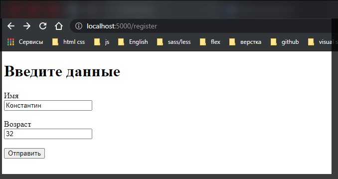
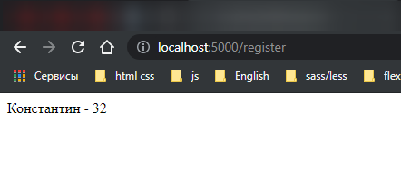

# POST-запросы и отправка форм

При отправке каких-то сложных данных обычно используют формы. Рассмотрим, как получать отправленные данные в **Express**. Для получения данных форм из запроса необходимо использовать специальный пакет **body-parser**.

```shell
npm install body-parser --save
```

Определим в папке проекта новый файл **register.html**.

```html
<!DOCTYPE html>
<html>
  <head>
    <title>Регистрация</title>
    <meta charset="utf-8" />
  </head>
  <body>
    <h1>Введите данные</h1>
    <form action="/register" method="post">
      <label>Имя</label><br />
      <input type="text" name="userName" /><br /><br />
      <label>Возраст</label><br />
      <input type="number" name="userAge" /><br /><br />
      <input type="submit" value="Отправить" />
    </form>
  </body>
</html>
```

Здесь определены два поля для ввода имени и возраста пользователя. После нажатия на кнопку данные будут уходить по адресу **"/register"**.

В файле **app.js** определим следующий код: **На сайте написано содайте app.js. Не работает. Создал index.js.**

```js
const express = require('express');
const bodyParser = require('body-parser');

const app = express();

//создаем parser  для данных application/x-www-form-urlencoded
const urlencodedParser = bodyParser.urlencoded({ extended: false });

app.get('/register', urlencodedParser, function (req, res) {
  res.sendFile(__dirname + '/register.html');
});

app.post('/register', urlencodedParser, function (req, res) {
  if (!req.body) return res.sendStatus(400);
  console.log(req.body);
  res.send(`${req.body.userName} - ${req.body.userAge}`);
});

app.get('/', function (req, res) {
  res.send('Главная страница');
});

app.listen(5000);
```

Прежде всего для получения отпревленных данных необходимо создать парсер:

```js
const urlencodedParser = bodyParser.urlencoded({ extended: false });
```

Поскольку данные отправляются с помощью формы, то для создания парсера применяется функция **urlencoded()**. В эту функцию передается объект, устанавливающий параметры парсинга. Значение **extended: false** указывает, что бъект - результат парсинга будет представлять пры ключ значение, а каждое значение может быть представлено ввиде строки или массива.

При переходе по адресу **"register"** будет срабатывать метод **app.get**, который отправить пользователю файл **register.html**.

Так как данные отправляются с помощью метода **POST**, то для обработки определяем функцию **app.post('/register',...)**. Первый параметр функции - адрес, на который идет отправка - **'/register'**. Стоит отметить что в в данном случае с одним адресом **'/register'**, связаны две функции, только одна обрабатывает запросы **get**, а другай - запросы **post**. Второй параметр - выше созданный парсер. Третий параметр - обработчик:

```js
app.post('/register', urlencodedParser, function (req, res) {
  if (!req.body) return res.sendStatus(400);
  console.log(req.body);
  res.send(`${req.body.userName} - ${req.body.userAge}`);
});
```

Для получения самих отправленных данных используем выражения типа **request.body.userName**, где **request.body** инкапсулирует данные формы, а **userName** - ключ данных, который соответствует значению атрибута **name** поля ввода на **html-странице:**




