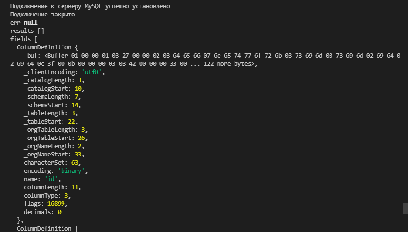
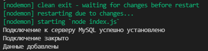

# Выполнение запросов к MySQL

Для выполнения запросов у объекта подключения применяется метод **query()**. Наиболее простая его форма:

```js
query(sqlString, callback);
```

Где **sqlString** - выполняемая команда **SQL**-команда,а **callback** - функция обратного вызова, через параметры которой мы можем получить результаты выполнения **sql**-команды или возникшую ошибку.

Например, получим все данные из таблицы.

```js
const mysql = require('mysql2');

const connection = mysql.createConnection({
  host: '10.178.4.52',
  port: '3306',
  user: 'asu8',
  database: 'network',
  password: '123',
});

// тестирование подключения
connection.connect(function (err) {
  if (err) {
    return console.error('Ошибка: ' + err.message);
  } else {
    console.log('Подключение к серверу MySQL успешно установлено');
  }
});

connection.query('SELECT * FROM sim', function (err, results, fields) {
  console.log('err', err);
  console.log('results', results); // сами данные
  console.log('fields', fields); // мета-данные полей
});

// закрытие подключения

connection.end(function (err) {
  if (err) {
    return console.log('Ошибка: ' + err.message);
  } else {
    console.log('Подключение закрыто');
  }
});
```



В данном случае выполняется команда **SELECT**, которая извлекает все данные из таблицы **"sim"**. Функция обратного вызова принимает три параметра. Первый параметр передает ошибка, если она возникла при выполнении запроса. Второй параметр - **results** собственно представляет в виде массива те данные, которые получила команда **SELECT**. И третий параметр **fields** хранит метаданные полей таблицы и дополнительную служебную информацию.

Стоит отметить, что при выполнении запросов неявно устанавливается подключение, поэтому перед выполнением запроса нам в принципе необязательно у объекта подключения вызывать метод **connect()**.

Также в **mysql2** определен метод **execute()**, который работает аналогичным образом:

```js
const mysql = require('mysql2');

const connection = mysql.createConnection({
  host: '10.178.4.52',
  port: '3306',
  user: 'asu8',
  database: 'network',
  password: '123',
});

// тестирование подключения
connection.connect(function (err) {
  if (err) {
    return console.error('Ошибка: ' + err.message);
  } else {
    console.log('Подключение к серверу MySQL успешно установлено');
  }
});

connection.execute('SELECT * FROM sim', function (err, results, fields) {
  console.log('err', err);
  console.log('results', results); // сами данные
  console.log('fields', fields); // мета-данные полей
});

// закрытие подключения

connection.end(function (err) {
  if (err) {
    return console.log('Ошибка: ' + err.message);
  } else {
    console.log('Подключение закрыто');
  }
});
```

<br/>
<br/>
<br/>

Параметризация запросов

Если в запрос надо вводить данные, которые приходят извне, то для избежания **sql**-инъекций рекоммендуется использовать параметризацию.

При параметризации вместо конкретных данных в тексте запроса ставятся плейсхолдеры - знаки вопроса, вместо которых при выполнении запроса будут вставляться собственно данные. Например, добавление данных:

```js
const mysql = require('mysql2');

const connection = mysql.createConnection({
  host: '10.178.4.52',
  port: '3306',
  user: 'asu8',
  database: 'network',
  password: '123',
});

// тестирование подключения
connection.connect(function (err) {
  if (err) {
    return console.error('Ошибка: ' + err.message);
  } else {
    console.log('Подключение к серверу MySQL успешно установлено');
  }
});

const simData = ['A1', '+375298918971'];
const sql = 'INSERT INTO sim(operator, number) VALUES(?,?)';

connection.query(sql, simData, function (err, results) {
  if (err) console.log(err);
  else console.log('Данные добавлены');
});

// закрытие подключения

connection.end(function (err) {
  if (err) {
    return console.log('Ошибка: ' + err.message);
  } else {
    console.log('Подключение закрыто');
  }
});
```


