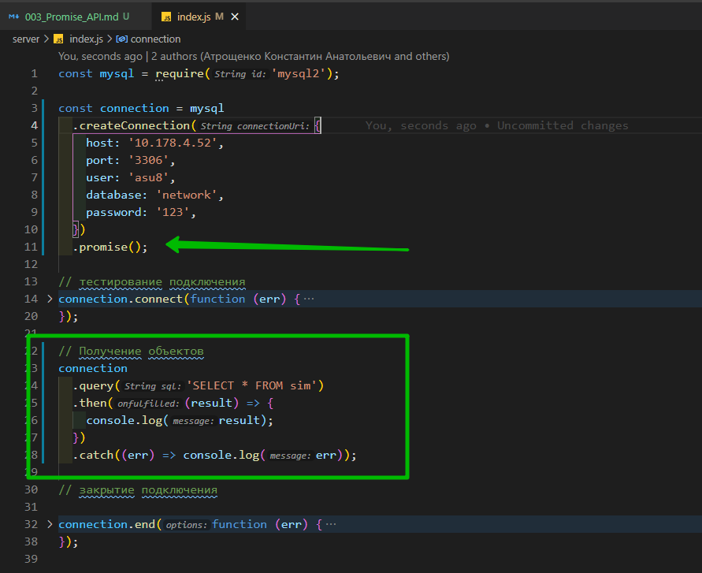
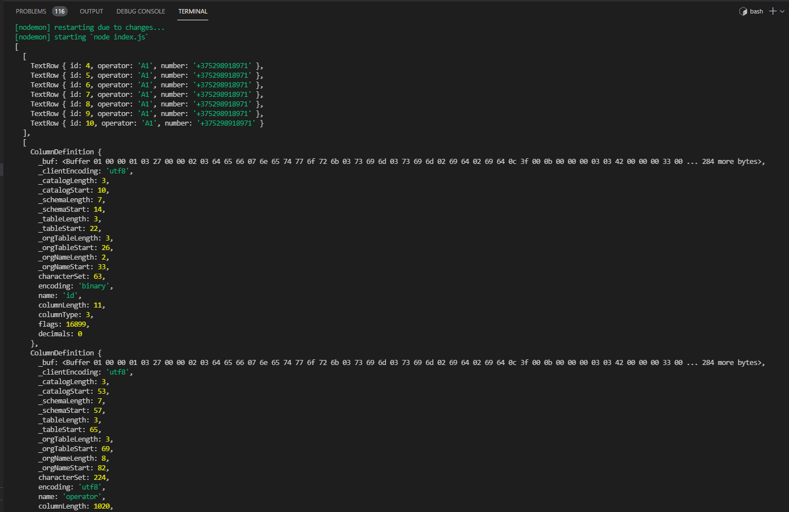
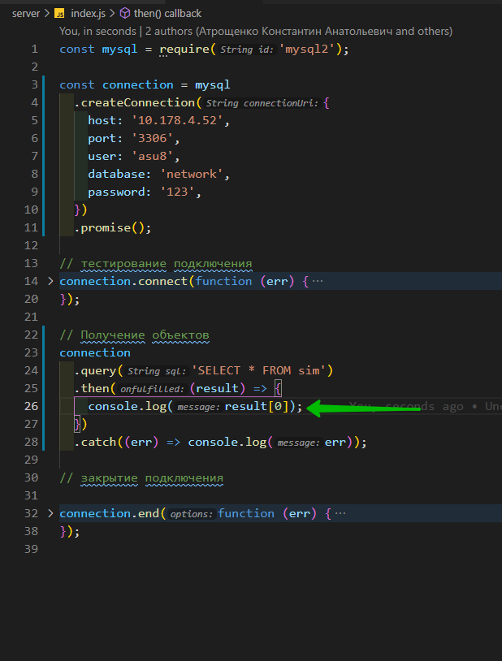
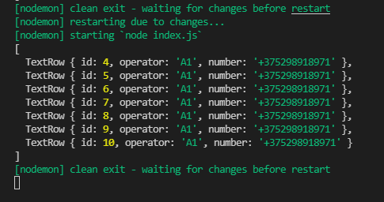
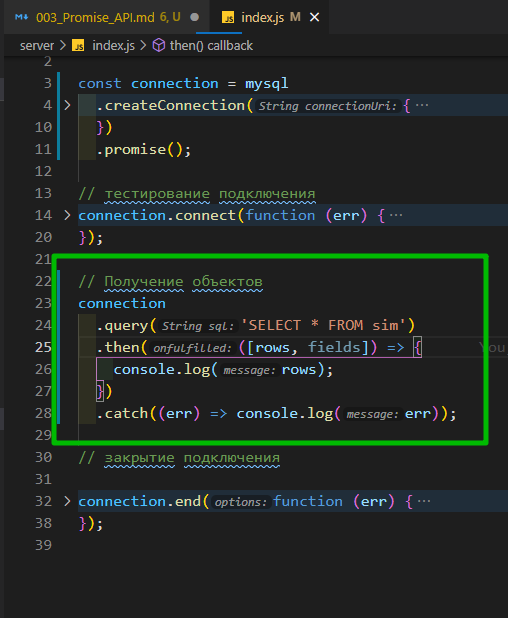
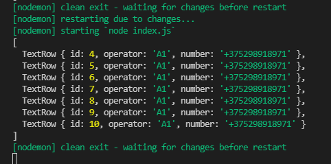
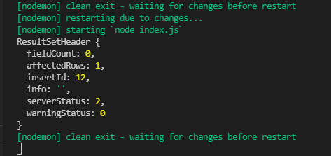
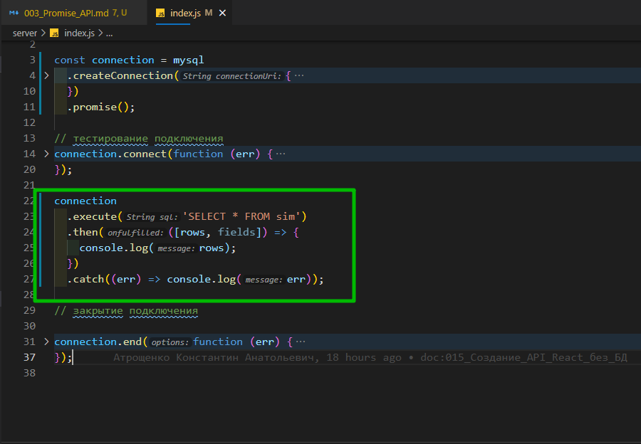
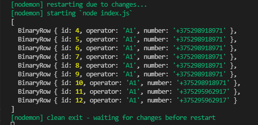

# Promise API

Драйвер **MySQL2** позволяет использовать промисы при выполнении запросов к бд. Например:





```js
const mysql = require('mysql2');

const connection = mysql
  .createConnection({
    host: '10.178.4.52',
    port: '3306',
    user: 'asu8',
    database: 'network',
    password: '123',
  })
  .promise();

// тестирование подключения
connection.connect(function (err) {
  if (err) {
    return console.error('Ошибка: ' + err.message);
  } else {
    console.log('Подключение к серверу MySQL успешно установлено');
  }
});

// Получение объектов
connection
  .query('SELECT * FROM sim')
  .then((result) => {
    console.log(result);
  })
  .catch((err) => console.log(err));

// закрытие подключения

connection.end(function (err) {
  if (err) {
    return console.log('Ошибка: ' + err.message);
  } else {
    console.log('Подключение закрыто');
  }
});
```

Для создания промиса при создании объекта **connection** вызывается метод **promise()**. Затем при выполнении запроса с помощью метода **query()** мы можем к нему по цепочке подсоединить методы **then()** и **catch()**.

Если при выполнении запроса возникла ошибка, то метод **catch()** выполняет функцию, которая передается в метод в качестве параметра. Эта функция принимает один параметр - собственно объект ошибки.

Если запрос выполнился успешно, то вызывается метод **then()**, который выполняет функцию, передаваемую в качестве параметра. Эта функция принимает в качестве параметра результат запроса. Результат запроса может оличаться в зависимости от посылаемой серверу команды **SQL**.

Для команды **SELECT** результат запроса фактически представляет массив из двух объектов, где первый объект - полученные из БД данные в виде массива, а второй - метаданные полей данных. То есть мы могли бы получить непосредственно сами данные так:



```js
const mysql = require('mysql2');

const connection = mysql
  .createConnection({
    host: '10.178.4.52',
    port: '3306',
    user: 'asu8',
    database: 'network',
    password: '123',
  })
  .promise();

// тестирование подключения
connection.connect(function (err) {
  if (err) {
    return console.error('Ошибка: ' + err.message);
  } else {
    console.log('Подключение к серверу MySQL успешно установлено');
  }
});

// Получение объектов
connection
  .query('SELECT * FROM sim')
  .then((result) => {
    console.log(result[0]);
  })
  .catch((err) => console.log(err));

// закрытие подключения

connection.end(function (err) {
  if (err) {
    return console.log('Ошибка: ' + err.message);
  } else {
    console.log('Подключение закрыто');
  }
});
```



или так



```js
const mysql = require('mysql2');

const connection = mysql
  .createConnection({
    host: '10.178.4.52',
    port: '3306',
    user: 'asu8',
    database: 'network',
    password: '123',
  })
  .promise();

// тестирование подключения
connection.connect(function (err) {
  if (err) {
    return console.error('Ошибка: ' + err.message);
  } else {
    console.log('Подключение к серверу MySQL успешно установлено');
  }
});

// Получение объектов
connection
  .query('SELECT * FROM sim')
  .then(([rows, fields]) => {
    console.log(rows);
  })
  .catch((err) => console.log(err));

// закрытие подключения

connection.end(function (err) {
  if (err) {
    return console.log('Ошибка: ' + err.message);
  } else {
    console.log('Подключение закрыто');
  }
});
```



Если выполняется **SQL**-команда **INSERT**, **UPDATE** или **DELETE**, то результатом запроса будет объект, свойства которого описывают результат операции:

```js
const mysql = require('mysql2');

const connection = mysql
  .createConnection({
    host: '10.178.4.52',
    port: '3306',
    user: 'asu8',
    database: 'network',
    password: '123',
  })
  .promise();

// тестирование подключения
connection.connect(function (err) {
  if (err) {
    return console.error('Ошибка: ' + err.message);
  } else {
    console.log('Подключение к серверу MySQL успешно установлено');
  }
});

const sql = 'INSERT INTO sim (operator, number) VALUES (?,?)';
const subscriber = ['A1', '+375295962917'];
connection
  .query(sql, subscriber)
  .then((result) => {
    console.log(result[0]);
  })
  .catch((err) => console.log(err));

// закрытие подключения

connection.end(function (err) {
  if (err) {
    return console.log('Ошибка: ' + err.message);
  } else {
    console.log('Подключение закрыто');
  }
});
```

Опять же результат запроса представляет массив из двух объектов, где собственно результаты операции описываются первым элементом. В частности, в данном случае консольный вывод будет наподобие следующего:



Например, с помощью свойства **affectedRows** полученного объекта мы можем получить количество затронутых операцией **(добавленных/ удаленных/обновленных)** строк.

Все, что было выше сказано про метод **query()** относится и к методу **execute()**, который работает аналогичным образом:





```js
const mysql = require('mysql2');

const connection = mysql
  .createConnection({
    host: '10.178.4.52',
    port: '3306',
    user: 'asu8',
    database: 'network',
    password: '123',
  })
  .promise();

// тестирование подключения
connection.connect(function (err) {
  if (err) {
    return console.error('Ошибка: ' + err.message);
  } else {
    console.log('Подключение к серверу MySQL успешно установлено');
  }
});

connection
  .execute('SELECT * FROM sim')
  .then(([rows, fields]) => {
    console.log(rows);
  })
  .catch((err) => console.log(err));

// закрытие подключения

connection.end(function (err) {
  if (err) {
    return console.log('Ошибка: ' + err.message);
  } else {
    console.log('Подключение закрыто');
  }
});
```
