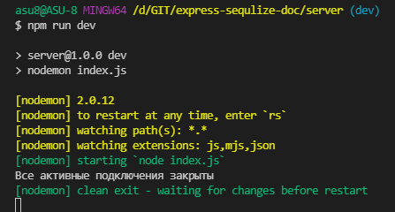
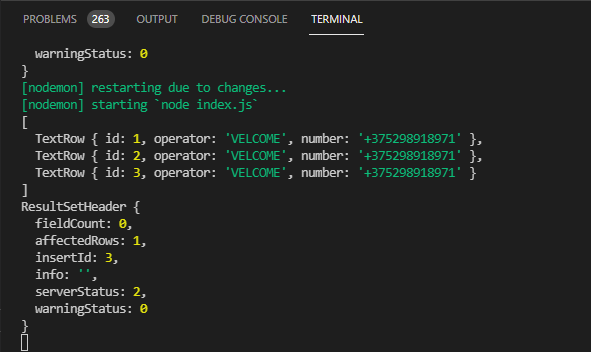
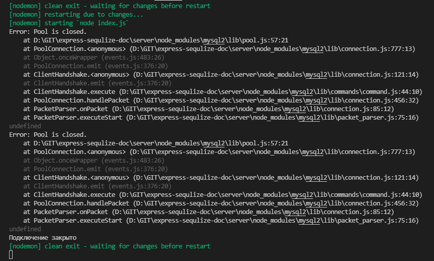
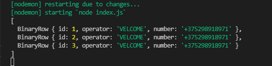
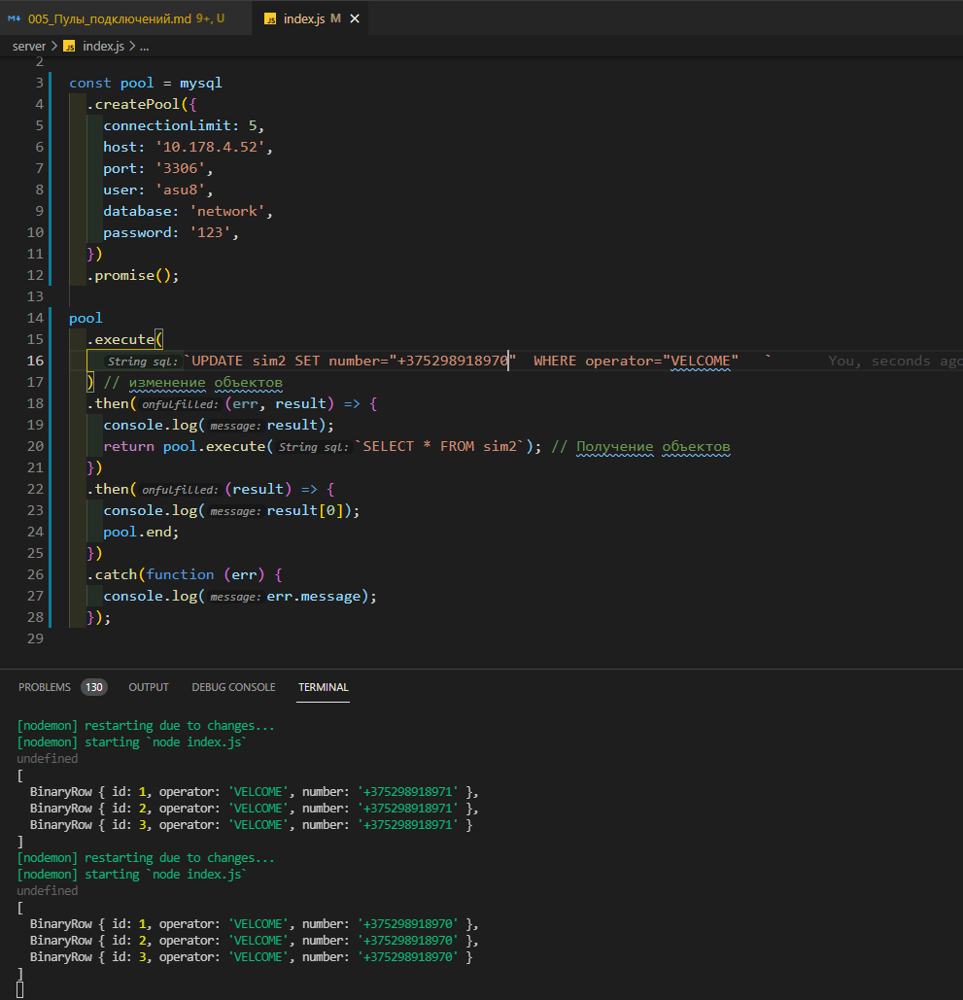
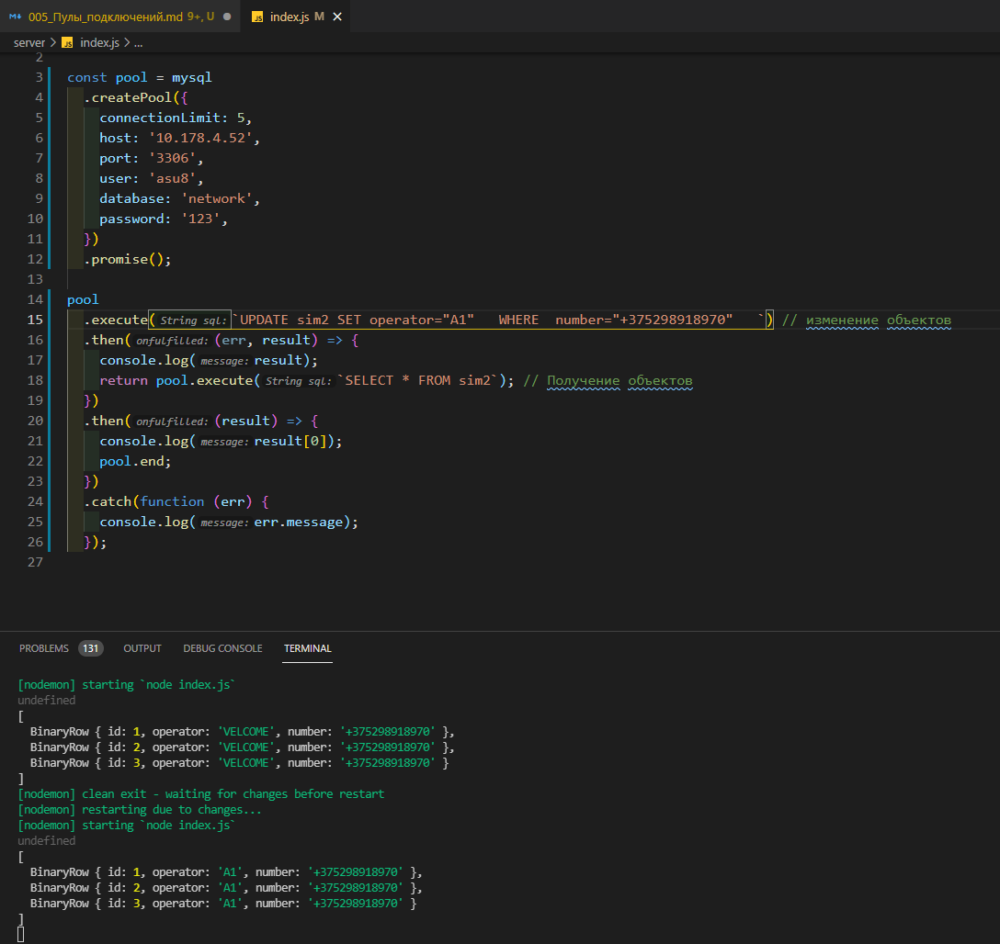

# Пулы подключений

Драйвер **mysql2** позволяет создавать пулы подключений. Пулы подключений позволяют уменьшить время, затраченное на подключение к серверу **MySQL**, благодаря повторному использованию подключений. Когда баз данных посылается запрос, из пула выбиратся свобное подключение (или создается новое, если сводобных нет и не превышен лимит). Это позволяет снизить издержки на создание новых подключений.

Пул подключений создается с помощью функции **createPool()**. Например, создадим пул из пяти подключений:

```js
const mysql = require('mysql2');

const pool = mysql.createPool({
  connectionLimit: 5,
  host: '10.178.4.52',
  port: '3306',
  user: 'asu8',
  database: 'network',
  password: '123',
});
```

Параметр **connectionLimit** определяет максимальное количество подключений. Причем даже если мы определим 100 подключений, но приложениею требуется только 5 подключений, то соответственно будет создаваться и использоваться только 5 подключений.

Для закрытия всех подключений применяется метод **end():**

```js
const mysql = require('mysql2');

const pool = mysql.createPool({
  connectionLimit: 5,
  host: '10.178.4.52',
  port: '3306',
  user: 'asu8',
  database: 'network',
  password: '123',
});

pool.end((err) => {
  if (err) console.log(err);
  else console.log('Все активные подключения закрыты');
});
```



<br/>
<br/>
<br/>

**Запросы к бд**

Запросы к бд через пул подключений выполняются через метод **query()** также, как и в объекте **connection**, который рассматривался в прошлых темах:

```js
const mysql = require('mysql2');

const pool = mysql.createPool({
  connectionLimit: 5,
  host: '10.178.4.52',
  port: '3306',
  user: 'asu8',
  database: 'network',
  password: '123',
});

// Создание таблицы
const sql = `create table if not exists sim2(
  id int primary key auto_increment,
  operator varchar(255) not null,
  number varchar(255)
)`;

pool.query(sql, (err, results) => {
  if (err) console.log(err);
  else console.log('Таблица создана');
});
```


```js
const mysql = require('mysql2');

const pool = mysql.createPool({
  connectionLimit: 5,
  host: '10.178.4.52',
  port: '3306',
  user: 'asu8',
  database: 'network',
  password: '123',
});

// Добавление объекта
const sql = `INSERT INTO sim2(operator,number) VALUES(?,?)`;
const data = ['VELCOME', '+375298918971'];
pool.query(sql, data, (err, results) => {
  if (err) console.log(err);
  console.log(results);
});

// Получение объекта
pool.query(`SELECT * FROM sim2`, (err, results) => {
  if (err) console.log(err);
  console.log(results);
});
```



Обратите внимание, что в случае выше запросы выполняются не последовательно. Поскольку оба вызова метода query выполняются асинхронно, то соответственно нет никакой гарантии, что вначале произойдет добавление, а потом получение объектов.

То же самое следует учитывать и при вызове метода **end()** у пула подключений:

```js
const mysql = require('mysql2');

const pool = mysql.createPool({
  connectionLimit: 5,
  host: '10.178.4.52',
  port: '3306',
  user: 'asu8',
  database: 'network',
  password: '123',
});

// Добавление объекта
const sql = `INSERT INTO sim2(operator,number) VALUES(?,?)`;
const data = ['VELCOME', '+375298918971'];
pool.query(sql, data, (err, results) => {
  if (err) console.log(err);
  console.log(results);
});

// Получение объекта
pool.query(`SELECT * FROM sim2`, (err, results) => {
  if (err) console.log(err);
  console.log(results);
});

// закрытие подключения
pool.end(function (err) {
  if (err) {
    return console.log('Ошибка: ' + err.message);
  } else {
    console.log('Подключение закрыто');
  }
});
```



В данном случае вполне может сложиться ситуация, что первым отработает метод **pool.end()** - до того, как ранее вызванный метод **pool.query()** отправит запрос к базе данных. В итоге при таком сценарии мы получим ошибку.

<br/>
<br/>
<br/>

**Promise API**

Так же, как и объкты подключений, пулы поддерживают работу с промисами:

```js
const mysql = require('mysql2');

const pool = mysql
  .createPool({
    connectionLimit: 5,
    host: '10.178.4.52',
    port: '3306',
    user: 'asu8',
    database: 'network',
    password: '123',
  })
  .promise();

pool
  .execute(`SELECT * FROM sim2`)
  .then((result) => {
    console.log(result[0]);
  })
  .catch((err) => console.log(err.message));
```



Благодаря промисам мы можем обойти вышеописанную проблему с вызовом метода **end** после операции с данными:

```js
const mysql = require('mysql2');

const pool = mysql
  .createPool({
    connectionLimit: 5,
    host: '10.178.4.52',
    port: '3306',
    user: 'asu8',
    database: 'network',
    password: '123',
  })
  .promise();

pool
  .execute(
    `UPDATE sim2 SET number="+375298918970"  WHERE operator="VELCOME"   `
  ) // изменение объектов
  .then((err, result) => {
    console.log(result);
    return pool.execute(`SELECT * FROM sim2`); // Получение объектов
  })
  .then((result) => {
    console.log(result[0]);
    pool.end;
  })
  .catch(function (err) {
    console.log(err.message);
  });
```



Точно так же я могу поменять оператора.



```js
const mysql = require('mysql2');

const pool = mysql
  .createPool({
    connectionLimit: 5,
    host: '10.178.4.52',
    port: '3306',
    user: 'asu8',
    database: 'network',
    password: '123',
  })
  .promise();

pool
  .execute(`UPDATE sim2 SET operator="A1"   WHERE  number="+375298918970"   `) // изменение объектов
  .then((err, result) => {
    console.log(result);
    return pool.execute(`SELECT * FROM sim2`); // Получение объектов
  })
  .then((result) => {
    console.log(result[0]);
    pool.end;
  })
  .catch(function (err) {
    console.log(err.message);
  });
```
