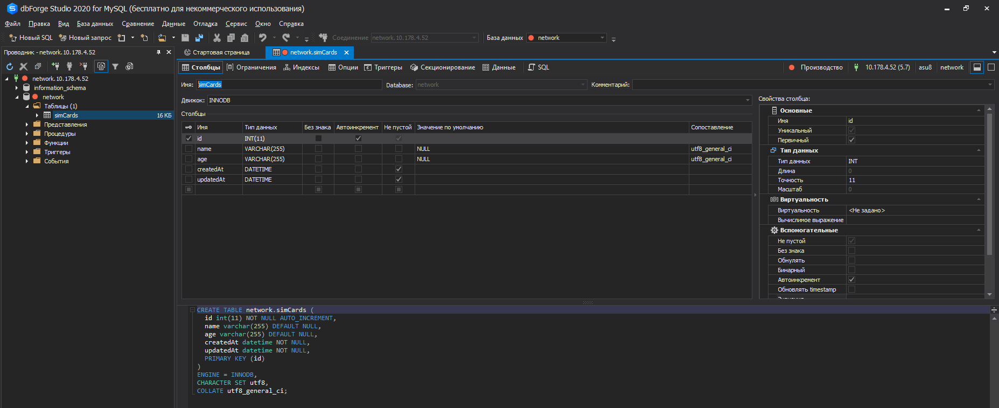

# Определение моделей

Ключевым компонентом в работе **Sequelize** с бд являются модели. Модели описывают стуктуру хранящихся в бд данных. Кроме того, через модели в основном идет взаимодействие с бд.

Есть два способа определения моделей. Первый способ представляет использование метода **define()**. Например, определим модель **simCard**.

```js
const Sequelize = require('sequelize');

const sequelize = new Sequelize('network', 'asu8', '123', {
  dialect: 'mysql',
  host: '10.178.4.52',
});

const simCard = sequelize.define('simCard', {
  id: {
    type: Sequelize.INTEGER,
    autoIncrement: true,
    primaryKey: true,
    allowNull: false,
  },
  operator: {
    type: Sequelize.STRING,
    allowNull: true,
  },
  number: {
    type: Sequelize.INTEGER,
    allowNull: true,
  },
});
```

Первый параметр метода - это название модели. В данном случае модель называется **"simCard"**. Важно учитывать, что если в бд для этой модели нет таблицы, то она будет создаваться. Причем в качестве имени таблицы будет применяться название модели во множественном числе в соответствии с правилами английского языка. То есть в данном случае таблица будет называться **"simCards"**. Это следует учитывать при наименовании моделей.

Второй параметр метода **define()** задает структуру модели, то есть описывает ее поля. Для каждого поля определяется ряд атрибутов. Атрибут **type** указывает на тип поля. В данном случае поля **id** представляет тип **INTEGER**, то есть целое число, а поле **operator** и **number** - тип **STRING**, то есть строку.

Сопоставление некоторых типов **sequelize** с типами **SQL**:

<br/>

|        Sequelize        |      SQL       |
| :---------------------: | :------------: |
|    Sequelize.STRING     |  VARCHAR(255)  |
| Sequelize.STRING.BINARY | VARCHAR BINARY |
|     Sequelize.TEXT      |      TEXT      |
|    Sequelize.INTEGER    |    INTEGER     |
|     Sequelize.FLOAT     |     FLOAT      |
|    Sequelize.DOUBLE     |     DOUBLE     |
|    Sequelize.DECIMAL    |    DECIMAL     |
|    Sequelize.BOOLEAN    |   TINYINT(1)   |

Полный набор типов и их сопоставление с типами **SQL** можно посмотреть в [документации](http://docs.sequelizejs.com/manual/data-types.html).

Дополнительно для поля можно задать еще ряд атрибутов. Атрибут **allowNull** указывает, допускает ли поле отсутствие значение. По умолчанию имеет значение **true** - то есть у поля может отсутствовать значение. Значение **false** указывает, что поле обязательно должно иметь какое-либо значение.

Для поля **id** в данном случае также задается еще пара атрибутов. Атрибут **autoIncrement: true** указывает, что значение столбца в таблице в БД будет автоинкрементироваться, а атрибут **primaryKey: true** говорит о том, что соответствующий столбец в таблице будет выполнять роль первичного ключа.

Второй способ определения модели:

```js
const Sequelize = require('sequelize');

const sequelize = new Sequelize('network', 'asu8', '123', {
  dialect: 'mysql',
  host: '10.178.4.52',
});

class SimCard extends Model {}
SimCard.init(
  {
    id: {
      type: Sequelize.INTEGER,
      autoIncrement: true,
      primaryKey: true,
      allowNull: false,
    },
    operator: {
      type: Sequelize.STRING,
      allowNull: true,
    },
    number: {
      type: Sequelize.STRING,
      allowNull: true,
    },
  },
  {
    sequelize,
    modelName: 'simCards',
  }
);
```

<br/>
<br/>
<br/>

**Синхронизация с бд**

Перед началом взаимодействия с бд нам надо убедиться, что таблицы в базе данных соответствуют определению наших моделей. Для синхронизации выполняется метод **sync:**

```js
sequelize
  .sync()
  .then((result) => console.log(result))
  .catch((err) => console.log(err));
```

```js
const Sequelize = require('sequelize');

const sequelize = new Sequelize('network', 'asu8', '123', {
  dialect: 'mysql',
  host: '10.178.4.52',
});

class SimCard extends Model {}
SimCard.init(
  {
    id: {
      type: Sequelize.INTEGER,
      autoIncrement: true,
      primaryKey: true,
      allowNull: false,
    },
    operator: {
      type: Sequelize.STRING,
      allowNull: true,
    },
    number: {
      type: Sequelize.STRING,
      allowNull: true,
    },
  },
  {
    sequelize,
    modelName: 'simCards',
  }
);

sequelize
  .sync()
  .then((result) => console.log(result))
  .catch((err) => console.log(err));
```

Метод **sync()** синхронизирует структуру базы данных с определением моделей. Например, если для какой-то модели отстуствует соответствующая таблица в БД, то эта таблица создается.

Следует учитывать, что кроме собственно полей модели в таблице по умолчанию будут создаваться два дополнительных поля: **createdAt** и **updatedAt**, которые будут иметь тип **datetime** и будут представлять соответственно время создания и последнего обновления строки в таблице.

Более того, нам не обязательно определять в модели поле **id**, так как **sequelize** по умолчанию также будет создавать подобное поле, которое будет выполнять роль первичного ключа.

Также можно вручную создать таблицу на сервере и потом к ней подключаться без необходимости синхронизации.

Но, возможно, нам не нужны эти дополнительные столбцы **createdAt** и **updatedAt**. В этом случае при определении объекта **Sequelize** нам надо задать параметр **define: {timestamps: false}:**

```js
const Sequelize = require('sequelize');

const sequelize = new Sequelize('network', 'asu8', '123', {
  dialect: 'mysql',
  host: '10.178.4.52',
  define: {
    timestamps: false,
  },
});

class SimCard extends Model {}
SimCard.init(
  {
    id: {
      type: Sequelize.INTEGER,
      autoIncrement: true,
      primaryKey: true,
      allowNull: false,
    },
    operator: {
      type: Sequelize.STRING,
      allowNull: true,
    },
    number: {
      type: Sequelize.STRING,
      allowNull: true,
    },
  },
  {
    sequelize,
    modelName: 'simCards',
  }
);

sequelize
  .sync()
  .then((result) => console.log(result))
  .catch((err) => console.log(err));
```

Но они мне нужны.

```js
const Sequelize = require('sequelize');

const sequelize = new Sequelize('network', 'asu8', '123', {
  dialect: 'mysql',
  host: '10.178.4.52',
});

class SimCard extends Model {}
SimCard.init(
  {
    id: {
      type: Sequelize.INTEGER,
      autoIncrement: true,
      primaryKey: true,
      allowNull: false,
    },
    operator: {
      type: Sequelize.STRING,
      allowNull: true,
    },
    number: {
      type: Sequelize.STRING,
      allowNull: true,
    },
  },
  {
    sequelize,
    modelName: 'simCards',
  }
);

sequelize
  .sync()
  .then((result) => console.log(result))
  .catch((err) => console.log(err));
```

Если в бд есть подобная таблица, но она не соответствует определению модели, то мы можем использоать параметр **{force: true}**, чтобы удалить таблицы и создать их заново, но уже с нужной нам структурой:

```js
sequelize
  .sync({ force: true })
  .then((result) => console.log(result))
  .catch((err) => console.log(err));
```

И так создание моделей через класс рассмотрю позже. Пока что так.

```js
const Sequelize = require('sequelize');

const sequelize = new Sequelize('network', 'asu8', '123', {
  dialect: 'mysql',
  host: '10.178.4.52',
});

const simCard = sequelize.define('simCard', {
  id: {
    type: Sequelize.INTEGER,
    autoIncrement: true,
    primaryKey: true,
    allowNull: false,
  },
  name: {
    type: Sequelize.STRING,
    allowNull: true,
  },
  age: {
    type: Sequelize.STRING,
    allowNull: true,
  },
});

sequelize
  .sync({ force: true })
  .then((result) => console.log(result))
  .catch((err) => console.log(err));
```



