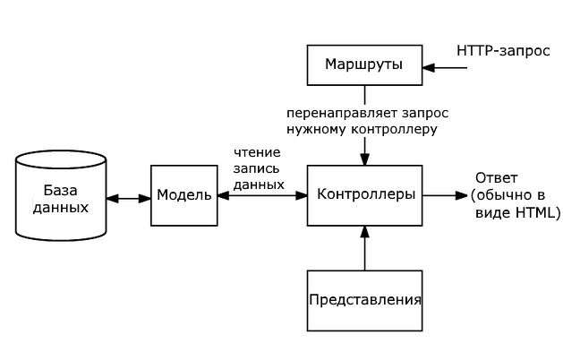
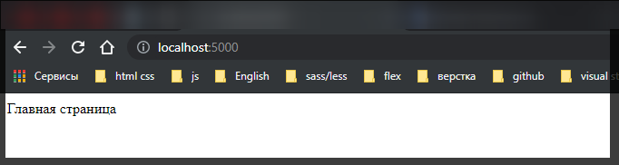
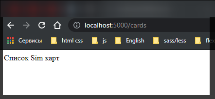
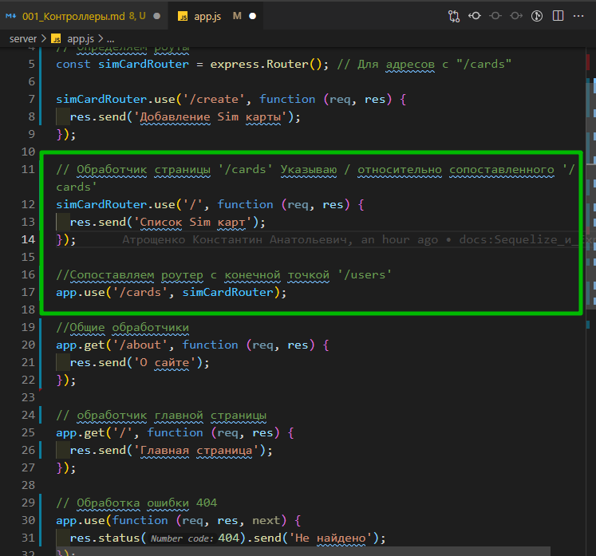
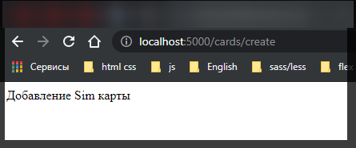
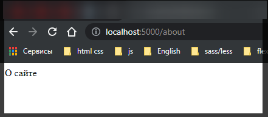
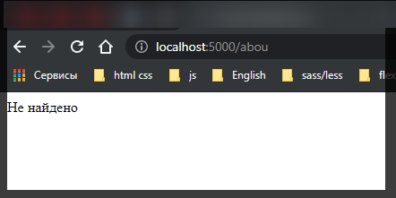

# Контроллеры

Паттерн **MVC** является одним из распространенных паттернов, применяемых в веб-приложениях. В том числе он применяется и в приложениях на **Node.js**.

Паттерн **MVC** включает ряд компонентов:

- **Модели** определяют структуру и логику используемых данных
- **Представления** (views) определяет визуальную часть, как данные будут отображаться
- **Контроллеры** обрабатывают входящие http-запросы, используя для обработки модели и представления, и отправляет в ответ клиенту некоторый результат обработки, нередко в виде html-кода.
- **Система маршрутизация** как дополнительный компонент сопоставляет запросы с маршрутами и выбирает для обработки запросов определенный контроллер.

В общем случае, когда к приложению приходит запрос, система маршрутизации выбирает нужный контроллер для обработки запроса. Контроллер обрабатывает запрос. В процессе обработки он может обращаться к данным через модели и для рендеринга ответа использовать представления. Результат обработки контроллера отправляется в ответ клиенту. Нередко ответ представляет **html**-страницу, которую пользователь видит в своем браузере.



Вкратце рассмотрим, как мы можем применять паттерн **MVC** в приложениях **Node.js**.

Контроллеры в паттерне **MVC** позволяют связать представления и модели и выполняют некоторую логику по обработке запроса.

Поскольку мы будем использовать фреймворк **Express**, то вначале добавим его пакеты в проект:

```shell
npm install express --save
```

В главном файле приложения определим следующий код:

```js
const express = require('express');
const app = express();

// Определяем роуты
const simCardRouter = express.Router(); // Для адресов с "/cards"

simCardRouter.use('/create', function (req, res) {
  res.send('Добавление Sim карты');
});

simCardRouter.use('/', function (req, res) {
  res.send('Список Sim карт');
});

//Сопоставляем роутер с конечной точкой '/users'
app.use('/cards', simCardRouter);

//Общие обработчики
app.get('/about', function (req, res) {
  res.send('О сайте');
});

app.get('/', function (req, res) {
  res.send('Главная страница');
});

// Обработка ошибки 404
app.use(function (req, res, next) {
  res.status(404).send('Не найдено');
});

app.listen(5000);
```

В приложении определен роутер , который сопоставляется с адресами на **"/cards"**, например, **"localhost:5000/cards/create"**, а также два общих адреса: главная страница и адресом **"/about"**.

В данном случае обработчики маршрутов в роутерах для простоты отправляют одну строку. Но логика каждого обработчика может быть гораздо больше, занимать множество строк. Кроме того, маршрутов и соответственно их обработчиков может быть определено гораздо больше. Третий момент - в данном случае мы видим, что обработчики группируются: часть маршрутов увязываются с действиями вокруг условных товаров (просмотр списка пользователей или добавления пользователей), а часть маршрутов представляют функции общего характера - главная страница и информация о сайте.



```js
// обработчик главной страницы
app.get('/', function (req, res) {
  res.send('Главная страница');
});
```



```js
// Обработчик страницы '/cards' Указываю / относительно сопоставленного '/cards'
simCardRouter.use('/', function (req, res) {
  res.send('Список Sim карт');
});
```





```js
simCardRouter.use('/create', function (req, res) {
  res.send('Добавление Sim карты');
});
```



Относится к общим обработчикам как

```js
//Общие обработчики
app.get('/about', function (req, res) {
  res.send('О сайте');
});

// обработчик главной страницы
app.get('/', function (req, res) {
  res.send('Главная страница');
});
```

И обработка не правильных роутов



```js
// Обработка ошибки 404
app.use(function (req, res, next) {
  res.status(404).send('Не найдено');
});
```

Теперь изменим приложение, вынеся всю логику обработки в контроллеры. Для этого определим в каталоге приложения новую папку, которую назовем **controllers**. Создадим в этой папке новый файл **simCardController.js** со следующим кодом:

```js
// controllers simCardController.js
exports.addSimCard = function (req, res) {
  res.send('Добавление Sim карты');
};

exports.getSimCards = function (req, res) {
  res.send('Список Sim карт');
};
```

Далее добавим в папку **controllers** второй файл **homeController.js** со следующим кодом:

```js
// controllers homeController.js

exports.index = function (req, res) {
  res.send('Главная страница');
};

exports.about = function (req, res) {
  res.send('О сайте');
};
```

Фактически каждый файл представляет отдельный контроллер, который содержит набор функций-обработчиков маршрутов.

Теперь используем эти контроллеры в файле приложения:

```js
const express = require('express');
const app = express();

const simCardController = require('./controllers/simCardController');
const homeController = require('./controllers/homeController');

// Определяем роуты
const simCardRouter = express.Router(); // Для адресов с "/cards"
const homeRouter = express.Router();

// определяем маршруты и их обработчики внутри роутера simCardRouter
simCardRouter.use('/create', simCardController.addSimCard); // обработчик
simCardRouter.use('/', simCardController.getSimCards); // обработчик
app.use('/cards', simCardRouter); // определяю маршрут

// определяем маршруты и их обработчики внутри роутера homeRouter
homeRouter.get('/about', homeController.about);
homeRouter.get('/', homeController.index);
app.use('/', homeRouter); // последним определяю маршрут так как обработка документа идет снизу вверх он обрабатывается первым

// Обработка ошибки 404
app.use(function (req, res, next) {
  res.status(404).send('Не найдено');
});

app.listen(5000);
```

Все маршруты отрабатывают.

Контроллеры подключаются как стандартные модули, и затем функции контроллеров используются для обработки маршрутов. Кроме того, для упрощения логической организации маршруты, которые обрабатываются контроллером **homeController**, организованы в отдельный роутер - **homeRouter**.

Однако в данном случае опять же стоит отметить, что внутри каждого роутера может быть определено множество маршрутов. В этом случае для упрощения управления маршрутами каждый роутер организуется и подключается в виде отдельного модуля. Для этого добавим в проект новую папку **routes**. Затем в этой папке создадим новый файл **homeRouter.js** и определим в нем следующий код:

```js
// routes homeRouter.js
const express = require('express');
const homeController = require('../controllers/homeController');
const homeRouter = express.Router();

homeRouter.get('/about', homeController.about);
homeRouter.get('/', homeController.index);

module.exports = homeRouter;
```

По сути здесь определен весь связанный с роутером **homeRouter** код. Также добавим в папку **routes** новый файл **simCardRouter.js**, в который добавим код для второго роутера:

```js
// router simCardRouter.js
const express = require('express');
const simCardController = require('../controllers/simCardController');
const simCardRouter = express.Router();

simCardRouter.use('/create', simCardController.addSimCard);
simCardRouter.use('/', simCardController.getSimCards);

module.exports = simCardRouter;
```

Теперь изменим файл приложения:

```js
const express = require('express');
const app = express();

const simCardRouter = require('./routes/simCardRouter');
const homeRouter = require('.//routes/homeRouter');

// определяю маршрут
app.use('/cards', simCardRouter);
app.use('/', homeRouter);

// Обработка ошибки 404
app.use(function (req, res, next) {
  res.status(404).send('Не найдено');
});

app.listen(5000);
```

Таким образом, за счет выноса логики обработки маршрутов и организации маршрутов в роутеры в отдельные модули общий код приложения стал проще и яснее.
