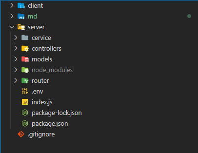
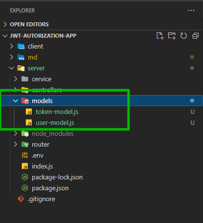

# Структура_проекта. Схема и модель данных. User, Token.

Теперь зададим определенную структуру проекта.

В папке **server** создаю папку с сервисами **service**. Папка с контроллерами **controllers**. И так же создадим папку **models** в которой будем описывать схему данных которые будут храниться в БД. И так же создадим папку **router** в которой реализуем навигацию в нашем приложении.



И так начнем с моделей. Опишем схему данных. Внутри папки **models** создаю файл **user-model.js**. И сразу создаю второй файл который назову **token-model.js**.



И так начну с **user-model.js**.

Деструктурирую **Schema** и **model** из пакета mongoose.

```js
//user-model.js
const { Schema, model } = require('mongoose');
```

И начну с того что как раз создам эту **UserSchema**. Схема описывает какие поля будет содержать у нас сущность пользователя.

```js
//user-model.js
const { Schema, model } = require('mongoose');

const UserSchema = new Schema({});
```

Как параметр передаю объект. И в этом объекте указываю какие поля будут у пользователя.

1. поле **email** которое будет **type:String**. Так же это поле должно быть уникальным **unique: true** т.е. двух одинаковых записей в БД не должно быть. И оно должно быть обязательным **required:true**.

```js
//user-model.js
const { Schema, model } = require('mongoose');

const UserSchema = new Schema({
  email: { type: String, unique: true, required: true },
});
```

2. password это так же строка, но она уже не уникальна

```js
//user-model.js
const { Schema, model } = require('mongoose');

const UserSchema = new Schema({
  email: { type: String, unique: true, required: true },
  password: { type: String, required: true },
});
```

3. Так же будет поле **isActivated** которое будет свидетельствовать о том подтвердил почту пользователь или нет.
4. И поле **activationLink** в котором мы будем хранить ссылку для активации.

```js
//user-model.js
const { Schema, model } = require('mongoose');

const UserSchema = new Schema({
  email: { type: String, unique: true, required: true },
  password: { type: String, required: true },
  isActivated: { type: Boolean, default: false }, // если пользователь перешел по ссылке и подтверил почту то true
  activationLink: { type: String },
});
```

**activationLink** это просто какое-то строковое не обязательное значение.

По итогу из этого файла мы экспортируем модель которую создаем на основании схемы. Первым параметром указываем название модели, а вторым передаем как раз схему т.е. **UserSchema**.

```js
//user-model.js
const { Schema, model } = require('mongoose');

const UserSchema = new Schema({
  email: { type: String, unique: true, required: true },
  password: { type: String, required: true },
  isActivated: { type: Boolean, default: false }, // если пользователь перешел по ссылке и подтверил почту то true
  activationLink: { type: String },
});

module.exports = model('User', UserSchema);
```

Переходим к **token-model.js** Это будет Schema для хранения непосредственно **refresh** токена, **id** пользователя. Сюда же можно добавить **IP** адресс с которого зашел пользователь, **finger-print** браузера и т.д. Но мы будем хранить просто **id** пользователя и сам **refresh** токен.

Поле **refreshToken** у нас получается просто **String** которая является обязательной.

И так же будем хранить ссылку на пользователя. Это поле назовем просто user. **type** здесь будет **ObjectId**. Его мы достаем из **Schema.Types.ObjectId**. И так же необходимо указать на что это поле ссылается. Оно будет ссылаться на модель пользователя **ref: 'User'**.

```js
const { Schema, model } = require('mongoose');

const TokenSchema = new Schema({
  user: { type: Schema.Types.ObjectId, ref: 'User' },
  refreshToken: { type: String, required: true },
});

module.exports = model('Token', TokenSchema);
```
