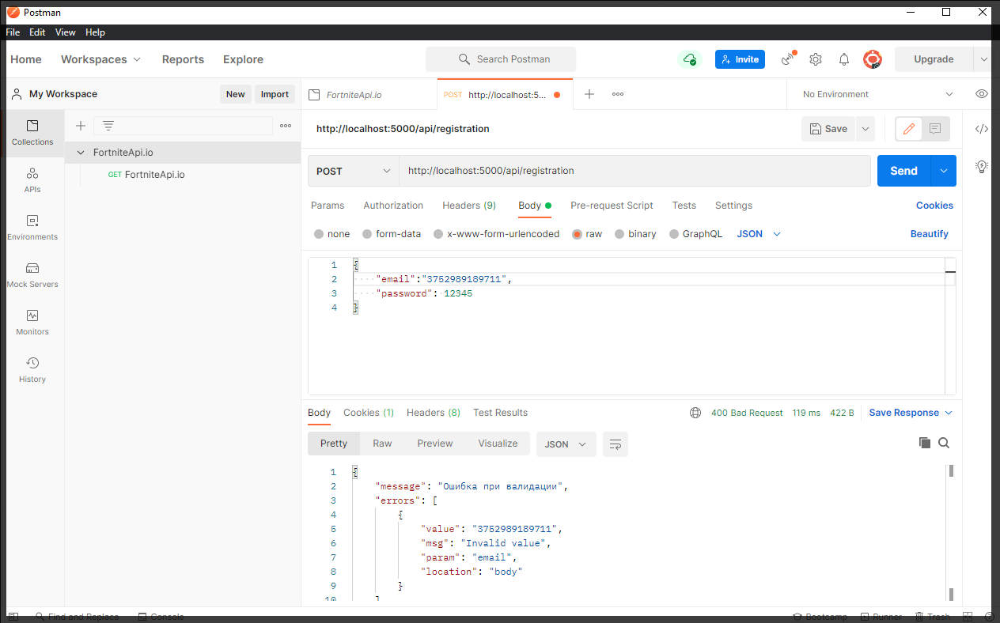
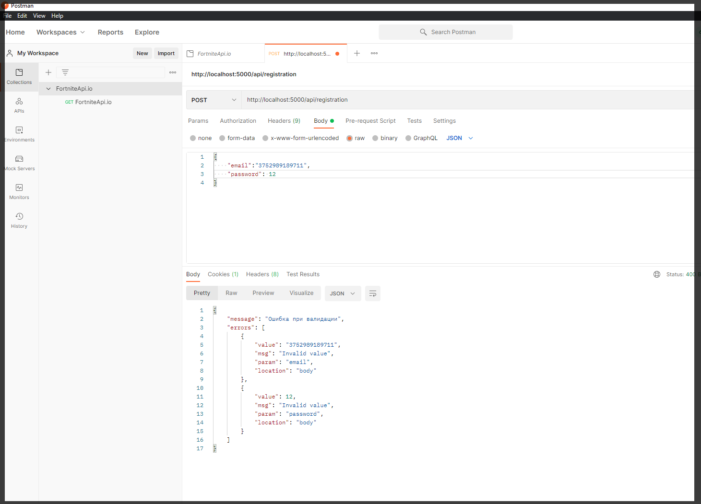
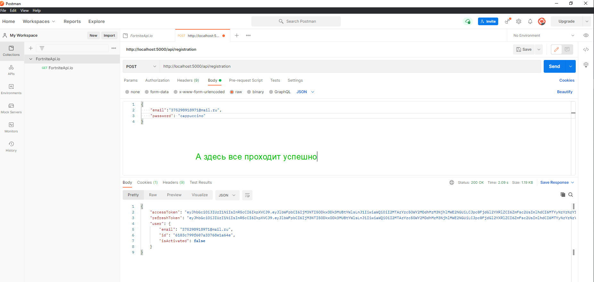

# 011 Валидация тела запроса

В теле запроса мы ожидаем **email** и пароль, но ни какой валидации у нас нет.

Для этого мне понадобится модуль

```shell
npm i express-validator
```

Переходим к **router** **index.js**.

И здесь валидацию буду настраивать.

Во-первых мне понадобится некоторая функция которую из этого пакета мы импортируем. И эта функция называется **body**. Она нужна для валидации тела запроса.

```js
//router index.js
const Router = require('express').Router;
const userController = require('../controllers/user-controller.js');
const router = new Router();
const { body } = require('express-validator');

router.post('/registration', userController.registration);
router.post('/login', userController.login);
router.post('/logout', userController.logout); // выход из акаунта

router.get('/activate/:link', userController.activate); //активация акаунта по ссылке
router.get('/refresh', userController.refresh); // перезаписывает access токен
router.get('/users', userController.getUsers); // получение списка пользователей

module.exports = router;
```

Эту функцию мы передаем как **middleware** в наш роутинг. Т.е. вторым параметром. Вызываем ее и передаем туда называние поля которое мы хотим провалидировать. Здесь есть куча валидаторов но нас интересует конкретно **isEmail**.

И сразу же провалидируем пароль. Валидирую его по длинне.

```js
//router index.js
const Router = require('express').Router;
const userController = require('../controllers/user-controller.js');
const router = new Router();
const { body } = require('express-validator');

router.post(
  '/registration',
  body('email').isEmail(),
  body('password').isLength({ min: 3, max: 32 }),
  userController.registration
);
router.post('/login', userController.login);
router.post('/logout', userController.logout); // выход из акаунта

router.get('/activate/:link', userController.activate); //активация акаунта по ссылке
router.get('/refresh', userController.refresh); // перезаписывает access токен
router.get('/users', userController.getUsers); // получение списка пользователей

module.exports = router;
```

Теперь перейдем к user-controller.js И здесь нам необходимо результат этой валидации получить. Для этого предназначена функция validationResult

```js
// controllers user-controller.js

const { activate } = require('../service/user-service.js');
const userService = require('../service/user-service.js');
const { validationResult } = require('express-validator');

class UserController {
  async registration(req, res, next) {
    try {
      const { email, password } = req.body;
      const userData = await userService.registration(email, password);
      res.cookie('refreshToken', userData.refreshToken, {
        maxAge: 30 * 24 * 60 * 60 * 1000,
        httpOnly: true,
      });
      return res.json(userData);
    } catch (e) {
      next(e);
    }
  }

  async login(req, res, next) {
    try {
    } catch (e) {
      next(e);
    }
  }

  async logout(req, res, next) {
    try {
    } catch (e) {
      next(e);
    }
  }

  async activate(req, res, next) {
    try {
      const activationLink = req.params.link;
      await userService.activate(activationLink); //передаю activationLink в  userService а точнее  user-service.js где отлавливаю в функции activate
      return res.redirect(process.env.CLIENT_URL); // перенаправляю на front-end
    } catch (e) {
      next(e);
    }
  }

  async refresh(req, res, next) {
    try {
    } catch (e) {
      next(e);
    }
  }

  async getUsers(req, res, next) {
    try {
      res.json(['123', '456']);
    } catch (e) {
      next(e);
    }
  }
}

module.exports = new UserController();
```

В блоке **try** создаю переменную и называю ее **errors**. В ней вызываю функцию **validationResult** и туда передаю **req** из него автоматически достанется **body** и провалидируются нужные поля.

Затем мы делаем условия и проверяем находится ли что-то в **error** т.е. не является ли этот массив пустым. Если он не пустой то произошла какая-то ошибка при валидации и нам ее необходимо передать в **error** **handler**.

Импортирую наш класс **ApiError**. В **ErrorMiddleware** мы передаем т.е. **ApiError.BadRequest()**. Первым параметром передаю сообщение, а вторым параметром принимает массив ошибок.

```js
// controllers user-controller.js

const { activate } = require('../service/user-service.js');
const userService = require('../service/user-service.js');
const { validationResult } = require('express-validator');
const ApiError = require('../exceptions/api-error.js');

class UserController {
  async registration(req, res, next) {
    try {
      const errors = validationResult(req);

      if (!errors.isEmpty()) {
        return next(
          ApiError.BadRequest('Ошибка при валидации', errors.array())
        );
      }

      const { email, password } = req.body;
      const userData = await userService.registration(email, password);
      res.cookie('refreshToken', userData.refreshToken, {
        maxAge: 30 * 24 * 60 * 60 * 1000,
        httpOnly: true,
      });
      return res.json(userData);
    } catch (e) {
      next(e);
    }
  }

  async login(req, res, next) {
    try {
    } catch (e) {
      next(e);
    }
  }

  async logout(req, res, next) {
    try {
    } catch (e) {
      next(e);
    }
  }

  async activate(req, res, next) {
    try {
      const activationLink = req.params.link;
      await userService.activate(activationLink); //передаю activationLink в  userService а точнее  user-service.js где отлавливаю в функции activate
      return res.redirect(process.env.CLIENT_URL); // перенаправляю на front-end
    } catch (e) {
      next(e);
    }
  }

  async refresh(req, res, next) {
    try {
    } catch (e) {
      next(e);
    }
  }

  async getUsers(req, res, next) {
    try {
      res.json(['123', '456']);
    } catch (e) {
      next(e);
    }
  }
}

module.exports = new UserController();
```






