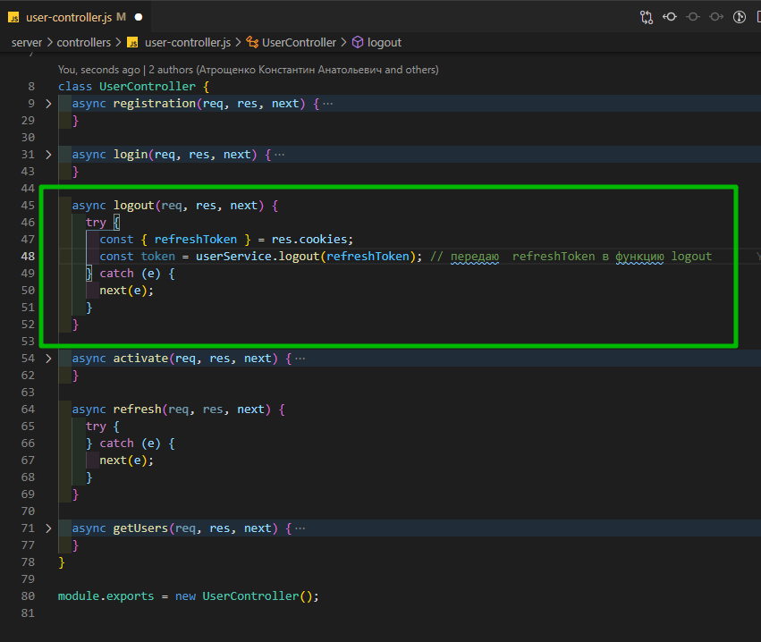
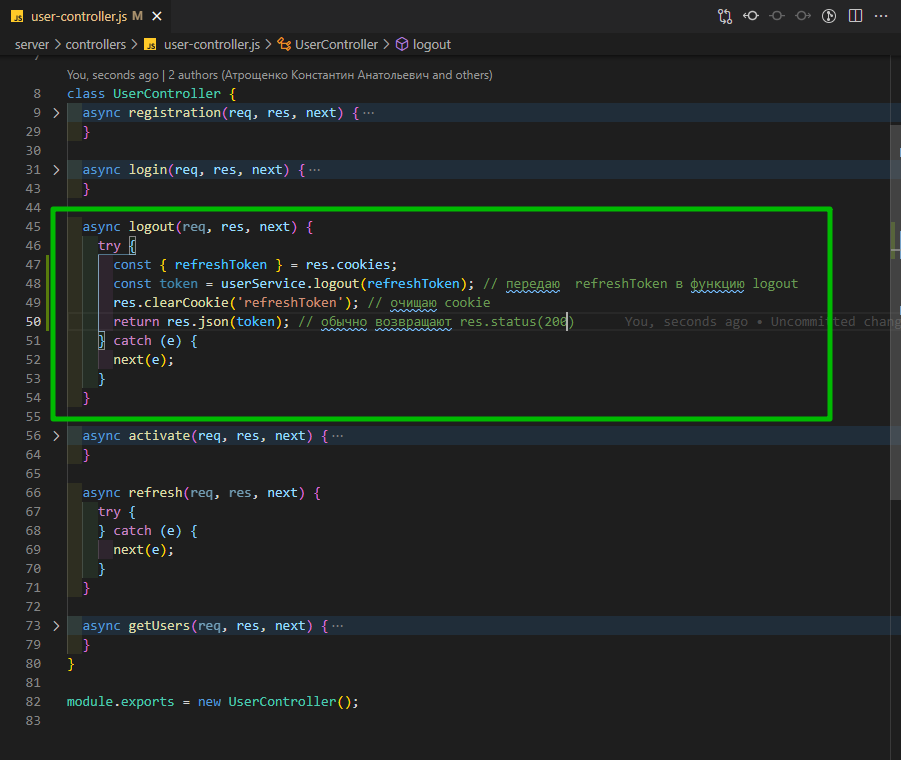
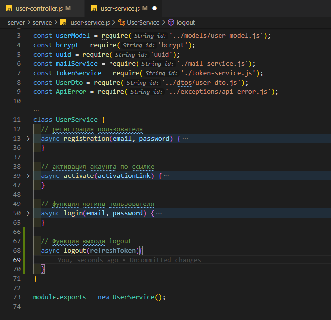
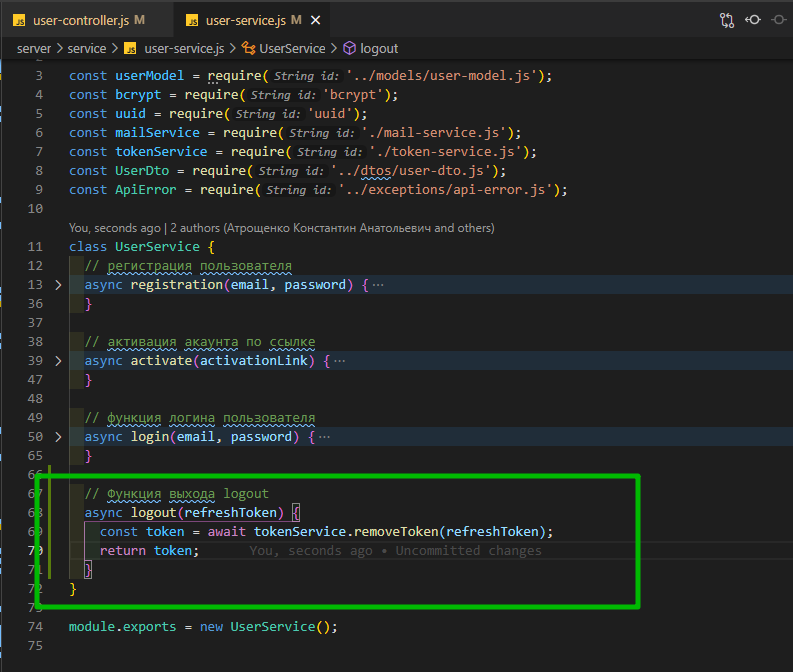
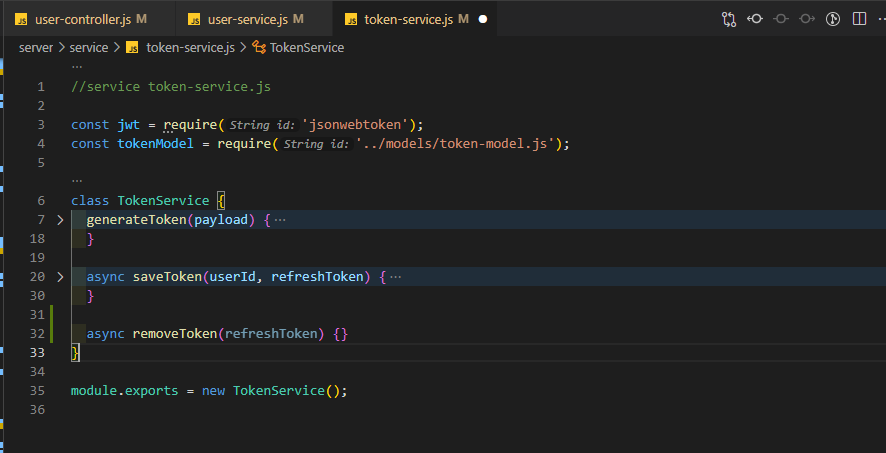
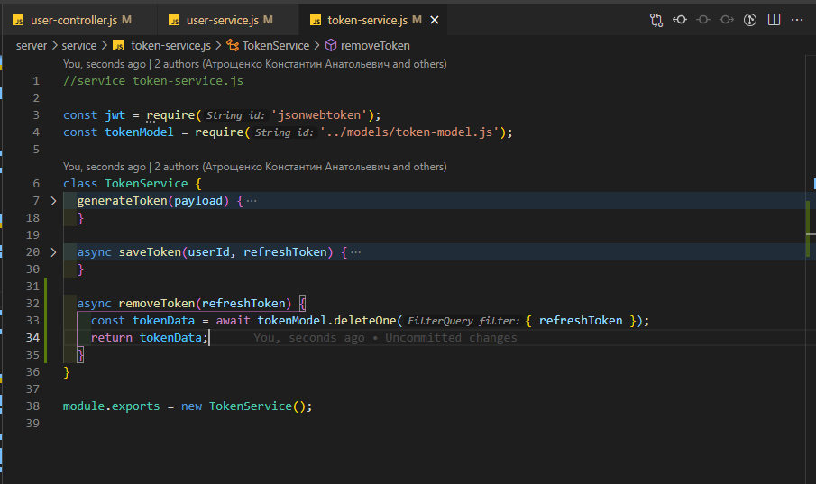
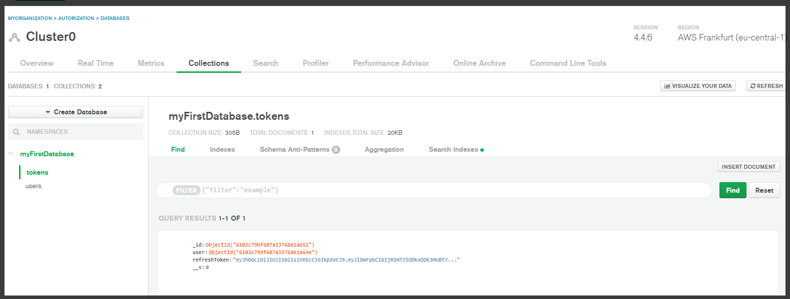
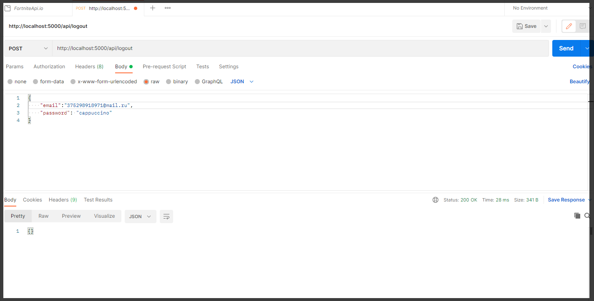

# Функция логаута

В **user-controller.js** в функции **logout** я вытаскиваю **refreshToken** из **req.cookies**. После чего у сервиса вызываю обноименную функцию т.е. **logout** и в нее передаю **refreshToken**. А если быть точным создаю переменную **token** в которую помещаю вызов await **userServise.logout(refreshToken)**.



```js
// controllers user-controller.js

const { activate } = require('../service/user-service.js');
const userService = require('../service/user-service.js');
const { validationResult } = require('express-validator');
const ApiError = require('../exceptions/api-error.js');

class UserController {
  async registration(req, res, next) {
    try {
      const errors = validationResult(req); // валидация

      if (!errors.isEmpty()) {
        return next(
          ApiError.BadRequest('Ошибка при валидации', errors.array())
        );
      }

      const { refreshToken } = req.cookies;
      const userData = await userService.registration(email, password);
      res.cookie('refreshToken', userData.refreshToken, {
        maxAge: 30 * 24 * 60 * 60 * 1000,
        httpOnly: true,
      });
      return res.json(userData);
    } catch (e) {
      next(e);
    }
  }

  async login(req, res, next) {
    try {
      const { email, password } = req.body;
      const userData = await userService.login(email, password);
      res.cookie('refreshToken', userData.refreshToken, {
        maxAge: 30 * 24 * 60 * 60 * 1000,
        httpOnly: true,
      });
      return res.json(userData);
    } catch (e) {
      next(e);
    }
  }

  async logout(req, res, next) {
    try {
      const { refreshToken } = res.cookies;
      const token = userService.logout(refreshToken); // передаю  refreshToken в функцию logout
    } catch (e) {
      next(e);
    }
  }

  async activate(req, res, next) {
    try {
      const activationLink = req.params.link;
      await userService.activate(activationLink); //передаю activationLink в  userService а точнее  user-service.js где отлавливаю в функции activate
      return res.redirect(process.env.CLIENT_URL); // перенаправляю на front-end
    } catch (e) {
      next(e);
    }
  }

  async refresh(req, res, next) {
    try {
    } catch (e) {
      next(e);
    }
  }

  async getUsers(req, res, next) {
    try {
      res.json(['123', '456']);
    } catch (e) {
      next(e);
    }
  }
}

module.exports = new UserController();
```

Теперь так же необходимо удалить саму **cookie** c **refreshToken**. Делается это с помощью функции **clearCookie**. Обращаюсь к объекту **res** вызываю у него функцию **clearCookie** в которую передаю название которое у меня **'refreshToken'**.
И после чего возвращаем ответ наклиент **return res.json(token)**. Здесь можно было вернуть просто **200** статус код. Однако мы вернем сам токен.



```js
// controllers user-controller.js

const { activate } = require('../service/user-service.js');
const userService = require('../service/user-service.js');
const { validationResult } = require('express-validator');
const ApiError = require('../exceptions/api-error.js');

class UserController {
  async registration(req, res, next) {
    try {
      const errors = validationResult(req); // валидация

      if (!errors.isEmpty()) {
        return next(
          ApiError.BadRequest('Ошибка при валидации', errors.array())
        );
      }

      const { email, password } = req.body;
      const userData = await userService.registration(email, password);
      res.cookie('refreshToken', userData.refreshToken, {
        maxAge: 30 * 24 * 60 * 60 * 1000,
        httpOnly: true,
      });
      return res.json(userData);
    } catch (e) {
      next(e);
    }
  }

  async login(req, res, next) {
    try {
      const { email, password } = req.body;
      const userData = await userService.login(email, password);
      res.cookie('refreshToken', userData.refreshToken, {
        maxAge: 30 * 24 * 60 * 60 * 1000,
        httpOnly: true,
      });
      return res.json(userData);
    } catch (e) {
      next(e);
    }
  }

  async logout(req, res, next) {
    try {
      const { refreshToken } = req.cookies;
      const token = userService.logout(refreshToken); // передаю  refreshToken в функцию logout
      res.clearCookie('refreshToken'); // очищаю cookie
      return res.json(token); // обычно возвращают res.status(200)
    } catch (e) {
      next(e);
    }
  }

  async activate(req, res, next) {
    try {
      const activationLink = req.params.link;
      await userService.activate(activationLink); //передаю activationLink в  userService а точнее  user-service.js где отлавливаю в функции activate
      return res.redirect(process.env.CLIENT_URL); // перенаправляю на front-end
    } catch (e) {
      next(e);
    }
  }

  async refresh(req, res, next) {
    try {
    } catch (e) {
      next(e);
    }
  }

  async getUsers(req, res, next) {
    try {
      res.json(['123', '456']);
    } catch (e) {
      next(e);
    }
  }
}

module.exports = new UserController();
```

Перехожу в **user-service.js** Создаю функцию **logout** параметром которая принимает **refreshToken**



```js
//service user-service.js

const userModel = require('../models/user-model.js');
const bcrypt = require('bcrypt');
const uuid = require('uuid');
const mailService = require('./mail-service.js');
const tokenService = require('./token-service.js');
const UserDto = require('../dtos/user-dto.js');
const ApiError = require('../exceptions/api-error.js');

class UserService {
  // регистрация пользователя
  async registration(email, password) {
    const candidate = await userModel.findOne({ email });
    if (candidate) {
      throw ApiError.BadRequest(`Пользователь с таким ${email} уже существует`);
    } else {
      const hashPassword = await bcrypt.hash(password, 3);
      const activationLink = uuid.v4();
      const user = await userModel.create({
        email,
        password: hashPassword,
        activationLink,
      });
      await mailService.sendActivationMail(
        email,
        `${process.env.API_URL}/api/activate/${activationLink}`
      );

      const userDto = new UserDto(user); // id, email, isActivated
      const tokens = tokenService.generateToken({ ...userDto }); // помещаю accessToken и refreshToken в объект
      await tokenService.saveToken(userDto.id, tokens.refreshToken);

      return { ...tokens, user: userDto };
    }
  }

  // активация акаунта по ссылке
  async activate(activationLink) {
    const user = await userModel.findOne({ activationLink }); // ищем пользователя по ссылке
    if (!user) {
      throw ApiError.BadRequest('Неккоректная ссылка активации ');
    } else {
      user.isActivated = true; // активирую акаунт
      await user.save(); // сохраняю обновленного пользователя
    }
  }

  // функция логина пользователя
  async login(email, password) {
    const user = await userModel.findOne({ email }); // убеждаемся что пользователь зарегистрирован
    if (!user) {
      throw ApiError.BadRequest('Пользователь с таким email не найден');
    } else {
      const isPassEquals = await bcrypt.compare(password, user.password); // c помощью compare сверяю хэшированные пароли
      // Если  в isPassEquals возвращается null выкидываю ошибку
      if (!isPassEquals) {
        throw ApiError.BadRequest('Неверный пароль');
      }
      const userDto = new UserDto(user); // выбрасываю все не нужное
      const tokens = tokenService.generateToken({ ...userDto }); // генирирую новый token
      await tokenService.saveToken(userDto.id, tokens.refreshToken); // сохраняю в БД
      return { ...tokens, user: userDto }; // Возвращаю все tokens и в user кладу нужные поля
    }
  }

  // Функция выхода logout
  async logout(refreshToken) {}
}

module.exports = new UserService();
```

Все что нам здесь нужно сделать это удалить **refreshToken** из БД. Создаю переменную **token =** в которой обращаюсь **await tokenService** с помощью функции **removeToken(refreshToken)**. И то что нам эта функция будет возвращать возвращаем из функции **logout** т.е. **return token**



```js
//service user-service.js

const userModel = require('../models/user-model.js');
const bcrypt = require('bcrypt');
const uuid = require('uuid');
const mailService = require('./mail-service.js');
const tokenService = require('./token-service.js');
const UserDto = require('../dtos/user-dto.js');
const ApiError = require('../exceptions/api-error.js');

class UserService {
  // регистрация пользователя
  async registration(email, password) {
    const candidate = await userModel.findOne({ email });
    if (candidate) {
      throw ApiError.BadRequest(`Пользователь с таким ${email} уже существует`);
    } else {
      const hashPassword = await bcrypt.hash(password, 3);
      const activationLink = uuid.v4();
      const user = await userModel.create({
        email,
        password: hashPassword,
        activationLink,
      });
      await mailService.sendActivationMail(
        email,
        `${process.env.API_URL}/api/activate/${activationLink}`
      );

      const userDto = new UserDto(user); // id, email, isActivated
      const tokens = tokenService.generateToken({ ...userDto }); // помещаю accessToken и refreshToken в объект
      await tokenService.saveToken(userDto.id, tokens.refreshToken);

      return { ...tokens, user: userDto };
    }
  }

  // активация акаунта по ссылке
  async activate(activationLink) {
    const user = await userModel.findOne({ activationLink }); // ищем пользователя по ссылке
    if (!user) {
      throw ApiError.BadRequest('Неккоректная ссылка активации ');
    } else {
      user.isActivated = true; // активирую акаунт
      await user.save(); // сохраняю обновленного пользователя
    }
  }

  // функция логина пользователя
  async login(email, password) {
    const user = await userModel.findOne({ email }); // убеждаемся что пользователь зарегистрирован
    if (!user) {
      throw ApiError.BadRequest('Пользователь с таким email не найден');
    } else {
      const isPassEquals = await bcrypt.compare(password, user.password); // c помощью compare сверяю хэшированные пароли
      // Если  в isPassEquals возвращается null выкидываю ошибку
      if (!isPassEquals) {
        throw ApiError.BadRequest('Неверный пароль');
      }
      const userDto = new UserDto(user); // выбрасываю все не нужное
      const tokens = tokenService.generateToken({ ...userDto }); // генирирую новый token
      await tokenService.saveToken(userDto.id, tokens.refreshToken); // сохраняю в БД
      return { ...tokens, user: userDto }; // Возвращаю все tokens и в user кладу нужные поля
    }
  }

  // Функция выхода logout
  async logout(refreshToken) {
    const token = await tokenService.removeToken(refreshToken);
    return token;
  }
}

module.exports = new UserService();
```

Теперь перехожу в **token-service.js** и создаю здесь эту функцию **removeToken**. Т.е. логика по удалению токена у нас находится на уровне **token-service.js**.



Теле функции я создаю переменную **tokenData =** в ней обращаюсь к **await tokenModel** и вызываю функцию функцию **deleteOne** куда парамектром передаю **{refreshToken}**. И на сколько я помню сама запись с БД вернется поэтом помещаем ее в переменную **tokenData**.



```js
//service token-service.js

const jwt = require('jsonwebtoken');
const tokenModel = require('../models/token-model.js');

class TokenService {
  generateToken(payload) {
    const accessToken = jwt.sign(payload, process.env.JWT_ACCESS_SECRET, {
      expiresIn: '30m',
    });
    const refreshToken = jwt.sign(payload, process.env.JWT_REFRESH_SECRET, {
      expiresIn: '30d',
    });
    return {
      accessToken,
      refreshToken,
    };
  }

  async saveToken(userId, refreshToken) {
    const tokenData = await tokenModel.findOne({ user: userId });
    if (tokenData) {
      tokenData.refreshToken = refreshToken; // если в БД нашел токен, то перезаписываю
      return tokenData.save(); // сохраняю новый токен
    } else {
      // если userId не найден вероятно он логинется первый раз
      const token = await tokenModel.create({ user: userId, refreshToken });
      return token; // возвращаю созданный token
    }
  }

  async removeToken(refreshToken) {
    const tokenData = await tokenModel.deleteOne({ refreshToken });
    return tokenData;
  }
}

module.exports = new TokenService();
```

И так это вся функция **logout**.

И так вот у меня есть один токен от одного залогиневшегося пользователя.





У него в теле возвращается какой-то объект. У меня он пустой. и в **IDE** в логах никаких ошибок нет. И так смотрю в коллекцию **MongoDB**. И так пользователь остался, а токен удалился. Таким образом выход пользователя совершен успешно.
