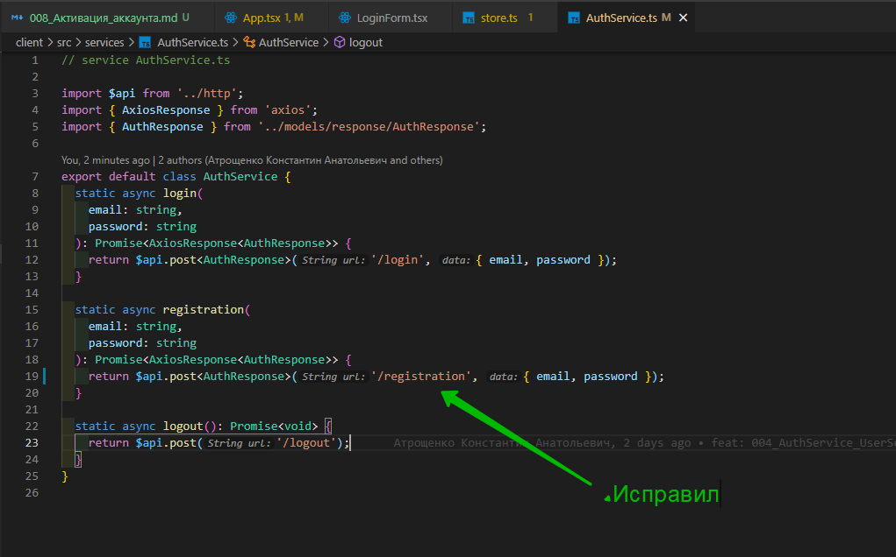
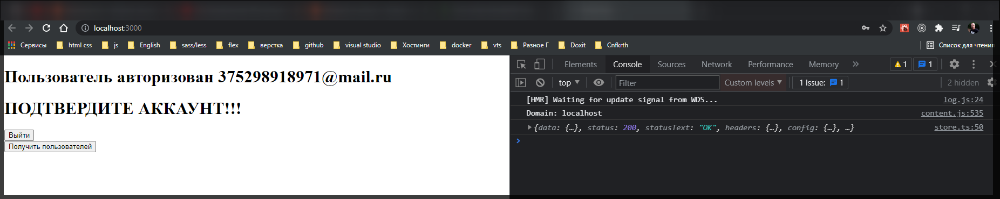
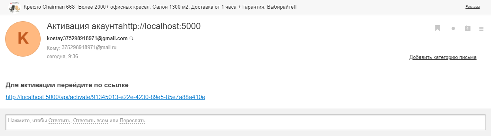
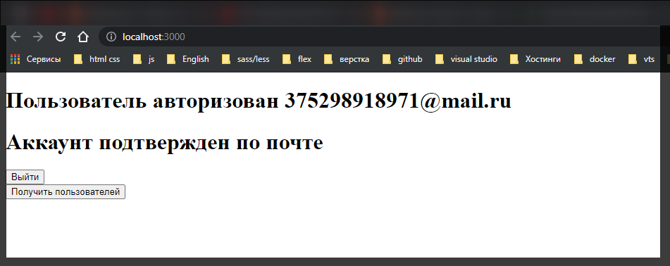

# 008 Активация аккаунта

Теперь в **App** создаю еще один **h1** в котором с помощью тернарного оператора буду проверять.

```tsx
import React, { FC, useEffect, useContext } from 'react';
import LoginForm from './components/LoginForm';
import { Context } from './index';
import { observer } from 'mobx-react-lite';
import { useState } from 'react';
import { IUser } from './models/IUser';
import UserService from './services/UserService';

const App: FC = () => {
  const { store } = useContext(Context);
  const [users, setUsers] = useState<IUser[]>([]);

  useEffect(() => {
    if (localStorage.getItem('token')) {
      store.checkAuth();
    }
  }, []);

  // получаю пользователей
  async function getUsers() {
    try {
      const response = await UserService.fetchUsers(); // из сервиса UserService вызываю функцию fetchUsers с помощью которой делаю запрос на получение пользователей.
      setUsers(response.data); // то что возвращает сервер помещаю в состояние
    } catch (e) {
      console.log(e);
    }
  }

  if (store.isLoading) {
    return <div>Загрузка...</div>;
  }

  if (!store.isAuth) {
    return (
      <div>
        <h1>АВТОРИЗУЙТЕСЬ</h1>
        <LoginForm />
        <div>
          <button onClick={getUsers}>Получить пользователей</button>
        </div>
      </div>
    );
  }

  return (
    <div>
      <h1>
        {store.isAuth
          ? `Пользователь авторизован ${store.user.email}`
          : `АВТОРИЗУЙТЕСЬ`}
      </h1>
      <h1>
        {store.user.isActivated
          ? 'Аккаунт подтвержден по почте'
          : 'ПОДТВЕРДИТЕ АККАУНТ!!!'}
      </h1>
      <button onClick={() => store.logout()}>Выйти</button>
      <div>
        <button onClick={getUsers}>Получить пользователей</button>
      </div>
      {users.map((user) => (
        <div key={user.email}>{user.email}</div>
      ))}
    </div>
  );
};

export default observer(App);
```



```tsx
// service AuthService.ts

import $api from '../http';
import { AxiosResponse } from 'axios';
import { AuthResponse } from '../models/response/AuthResponse';

export default class AuthService {
  static async login(
    email: string,
    password: string
  ): Promise<AxiosResponse<AuthResponse>> {
    return $api.post<AuthResponse>('/login', { email, password });
  }

  static async registration(
    email: string,
    password: string
  ): Promise<AxiosResponse<AuthResponse>> {
    return $api.post<AuthResponse>('/registration', { email, password });
  }

  static async logout(): Promise<void> {
    return $api.post('/logout');
  }
}
```

И так заново регистрируюсь






