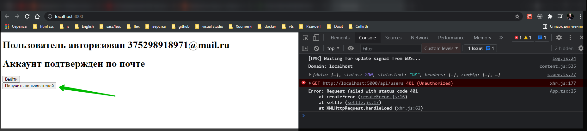
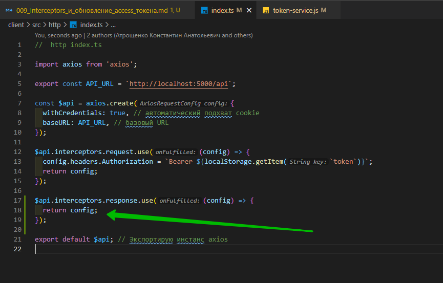
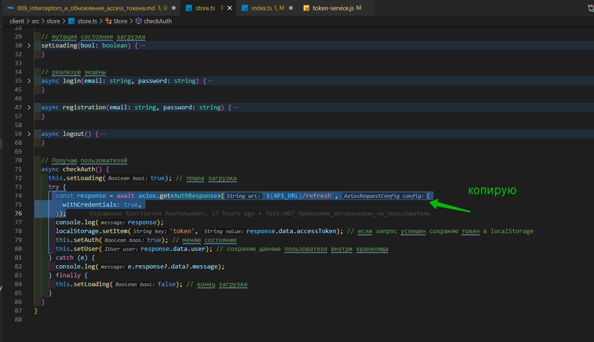
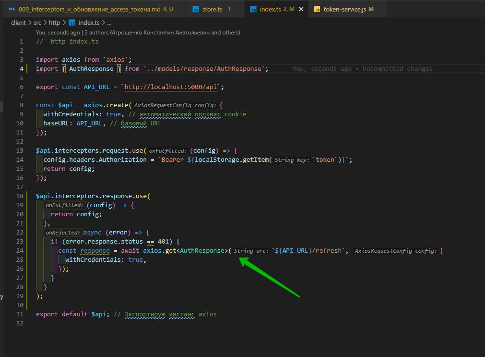
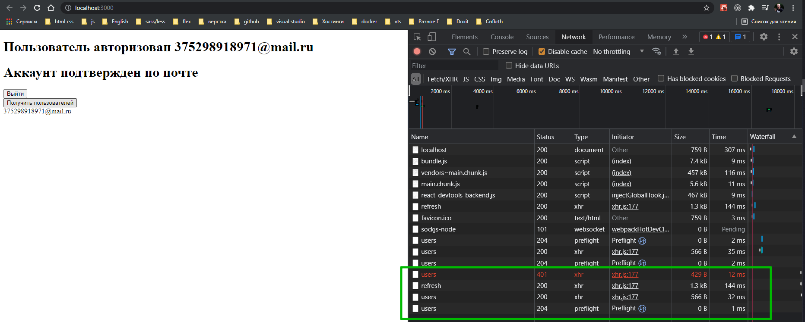
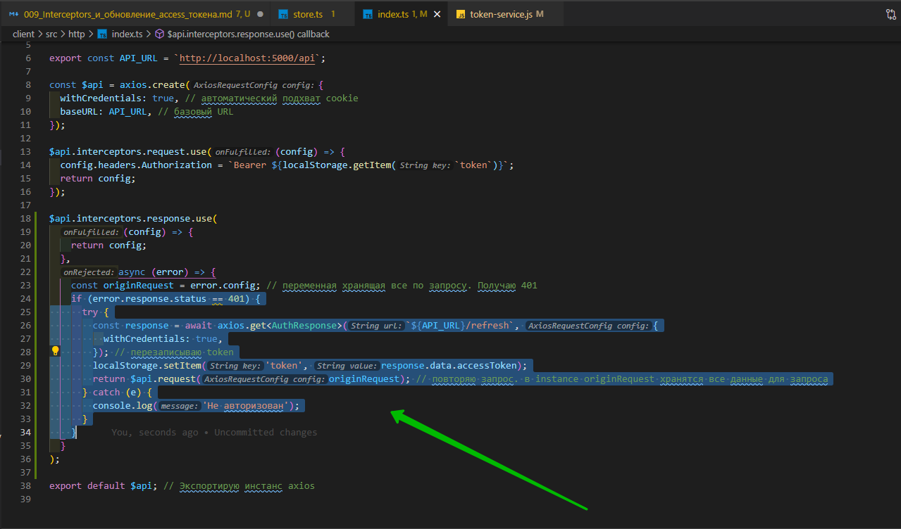
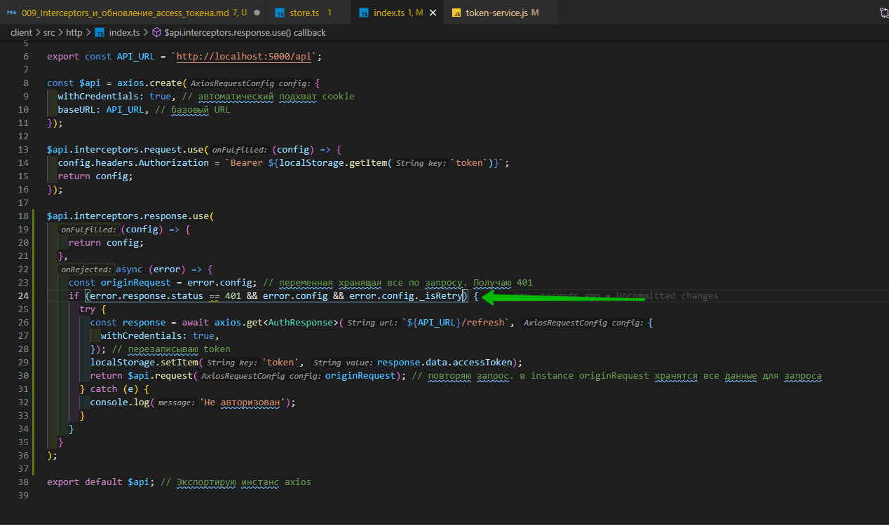
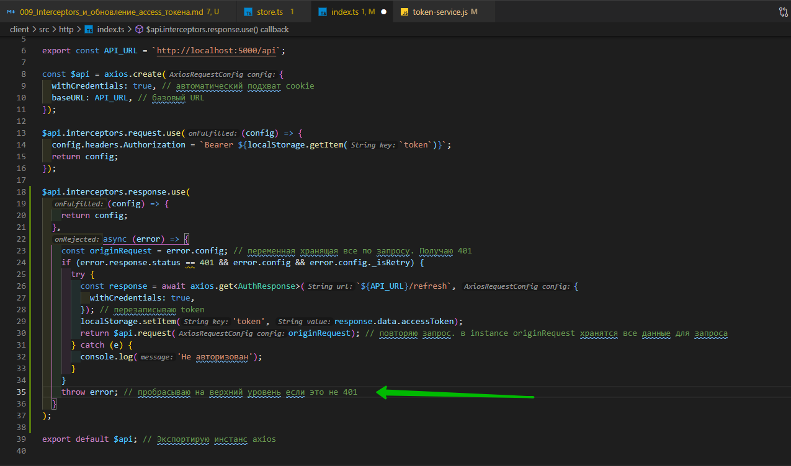

# Interceptors и обновление access токена

Открываю token-service.js и время жизни accessToken делаю 15 сек для наглядности.

```js
//service token-service.js

const jwt = require('jsonwebtoken');
const tokenModel = require('../models/token-model.js');

class TokenService {
  generateToken(payload) {
    const accessToken = jwt.sign(payload, process.env.JWT_ACCESS_SECRET, {
      expiresIn: '15s',
    });
    const refreshToken = jwt.sign(payload, process.env.JWT_REFRESH_SECRET, {
      expiresIn: '30d',
    });
    return {
      accessToken,
      refreshToken,
    };
  }

  // Валидация access токена
  validateAccessToken(token) {
    try {
      const userData = jwt.verify(token, process.env.JWT_ACCESS_SECRET);
      return userData;
    } catch (e) {
      return null;
    }
  }

  // Валидация refresh токена
  validateRefreshToken(token) {
    try {
      const userData = jwt.verify(token, process.env.JWT_REFRESH_SECRET);
      return userData;
    } catch (e) {
      return null;
    }
  }

  async saveToken(userId, refreshToken) {
    const tokenData = await tokenModel.findOne({ user: userId });
    if (tokenData) {
      tokenData.refreshToken = refreshToken; // если в БД нашел токен, то перезаписываю
      return tokenData.save(); // сохраняю новый токен
    } else {
      // если userId не найден вероятно он логинется первый раз
      const token = await tokenModel.create({ user: userId, refreshToken });
      return token; // возвращаю созданный token
    }
  }

  async removeToken(refreshToken) {
    const tokenData = await tokenModel.deleteOne({ refreshToken });
    return tokenData;
  }

  // После валидации поиск токена в БД
  async findToken(refreshToken) {
    const tokenData = await tokenModel.findOne({ refreshToken });
    return tokenData;
  }
}

module.exports = new TokenService();
```



accessToken умер но refreshToken у нас еще живой. Но обратите внимание что если мы страницу обновляем, то доступ к аккаунту мы по прежнему имеем. И в течении 15 секунд функция получения пользователей у нас еще доступна.

Теперь нам необходимо реализовать тот самый interceptor который будет токен перезаписывать в случае если у нас пришел 401 статус.

Перехожу в http index.js

На request у нас уже interceptor висит.

Теперь делаем точно такой же interceptor но уже на response. Т.е. $api.interceptors.response.use(). Первым параметром передается callback который выполняется если запрос прошел успешно. И здесь мы просто возвращаем config.



И вот второй callback нас интересует уже больше. Он вызывается в тот момент когда произошла ошибка.

Делаю условие в котором проверяю статус код который нам вернулся. error обращаюсь к полю pesponse к полю status и проверяем равен от 401, ставлю двойное равенство так как проверяю значение а не тип т.е. на эквивалентность не проверяю. Если он равен 401 то тогда нам необходимо сделать запрос на end-point с refreshToken т.е. перезаписать.

Захожу в store.js в checkAuth копирю то самый запрос.



```ts
// store store.js

import { makeAutoObservable } from 'mobx';
import axios from 'axios';
import AuthService from '../services/AuthService';
import { IUser } from './../models/IUser';
import { AuthResponse } from '../models/response/AuthResponse';
import { API_URL } from '../http/index';

export default class Store {
  user = {} as IUser; // сохраняю данные о пользователе
  isAuth = false; // авторизован ли пользователь
  isLoading = false; // Загрузка

  constructor() {
    makeAutoObservable(this);
  }

  // мутация для изменения переменной isAuth
  setAuth(bool: boolean) {
    this.isAuth = bool;
  }

  // мутация для изменения переменной user
  setUser(user: IUser) {
    this.user = user;
  }

  // мутация состояния загрузки
  setLoading(bool: boolean) {
    this.isLoading = bool;
  }

  // реализую экшены
  async login(email: string, password: string) {
    try {
      const response = await AuthService.login(email, password); // делаю запрос
      console.log(response);
      localStorage.setItem('token', response.data.accessToken); // если запрос успешен сохраняю токен в localStorage
      this.setAuth(true); // меняю состояние
      this.setUser(response.data.user); // сохраняю данные пользователя внутри хранилища
    } catch (e) {
      console.log(e.response?.data?.message);
    }
  }

  async registration(email: string, password: string) {
    try {
      const response = await AuthService.registration(email, password); // делаю запрос
      console.log(response);
      localStorage.setItem('token', response.data.accessToken); // если запрос успешен сохраняю токен в localStorage
      this.setAuth(true); // меняю состояние
      this.setUser(response.data.user); // сохраняю данные пользователя внутри хранилища
    } catch (e) {
      console.log(e.response?.data?.message);
    }
  }

  async logout() {
    try {
      const response = await AuthService.logout(); // делаю запрос
      localStorage.removeItem('token'); // Удаляю токен
      this.setAuth(false); // меняю состояние
      this.setUser({} as IUser); // сохраняю данные пользователя внутри хранилища
    } catch (e) {
      console.log(e.response?.data?.message);
    }
  }

  // Получаю пользователей
  async checkAuth() {
    this.setLoading(true); // пошла загрузка
    try {
      const response = await axios.get<AuthResponse>(`${API_URL}/refresh`, {
        withCredentials: true,
      });
      console.log(response);
      localStorage.setItem('token', response.data.accessToken); // если запрос успешен сохраняю токен в localStorage
      this.setAuth(true); // меняю состояние
      this.setUser(response.data.user); // сохраняю данные пользователя внутри хранилища
    } catch (e) {
      console.log(e.response?.data?.message);
    } finally {
      this.setLoading(false); // конец загрузки
    }
  }
}
```



```ts
//  http index.ts

import axios from 'axios';
import { AuthResponse } from '../models/response/AuthResponse';

export const API_URL = `http://localhost:5000/api`;

const $api = axios.create({
  withCredentials: true, // автоматический подхват cookie
  baseURL: API_URL, // базовый URL
});

$api.interceptors.request.use((config) => {
  config.headers.Authorization = `Bearer ${localStorage.getItem(`token`)}`;
  return config;
});

$api.interceptors.response.use(
  (config) => {
    return config;
  },
  async (error) => {
    if (error.response.status == 401) {
      const response = await axios.get<AuthResponse>(`${API_URL}/refresh`, {
        withCredentials: true,
      });
    }
  }
);

export default $api; // Экспортирую инстанс axios
```

Если этот запрос прошел успешно, то нам вернется пара токенов. По этому accessToken мы по новой сохраняем в localStorage.setItem('token', response.data.accessToken);

```ts
//  http index.ts

import axios from 'axios';
import { AuthResponse } from '../models/response/AuthResponse';

export const API_URL = `http://localhost:5000/api`;

const $api = axios.create({
  withCredentials: true, // автоматический подхват cookie
  baseURL: API_URL, // базовый URL
});

$api.interceptors.request.use((config) => {
  config.headers.Authorization = `Bearer ${localStorage.getItem(`token`)}`;
  return config;
});

$api.interceptors.response.use(
  (config) => {
    return config;
  },
  async (error) => {
    if (error.response.status == 401) {
      const response = await axios.get<AuthResponse>(`${API_URL}/refresh`, {
        withCredentials: true,
      });
      localStorage.setItem('token', response.data.accessToken);
    }
  }
);

export default $api; // Экспортирую инстанс axios
```

Следующий важный момент. Нам надо повторить исходный запрос. Т.е. мы отправили запрос на получение пользователей. Получили 401. Перезаписали токен и опять повторили запрос на получение пользователей. Все должно происходить так что бы пользователь который использует нашу систему ничего даже и не заметил. Для этого const originRequest = error.config; // переменная хранящая все по запросу. Получаю 401.

После перезаписи токена опять повторяю запрос на получение пользователей. return $api.request(originRequest); // повторяю запрос. в instance originRequest хранятся все данные для запроса

```ts
//  http index.ts

import axios from 'axios';
import { AuthResponse } from '../models/response/AuthResponse';

export const API_URL = `http://localhost:5000/api`;

const $api = axios.create({
  withCredentials: true, // автоматический подхват cookie
  baseURL: API_URL, // базовый URL
});

$api.interceptors.request.use((config) => {
  config.headers.Authorization = `Bearer ${localStorage.getItem(`token`)}`;
  return config;
});

$api.interceptors.response.use(
  (config) => {
    return config;
  },
  async (error) => {
    const originRequest = error.config; // переменная хранящая все по запросу. Получаю 401
    if (error.response.status == 401) {
      const response = await axios.get<AuthResponse>(`${API_URL}/refresh`, {
        withCredentials: true,
      }); // перезаписываю token
      localStorage.setItem('token', response.data.accessToken);
      return $api.request(originRequest); // повторяю запрос. в instance originRequest хранятся все данные для запроса
    }
  }
);

export default $api; // Экспортирую инстанс axios
```

Оборачиваю тело условия в блок try catch потому что здесь могут произойти ошибки.

```ts
//  http index.ts

import axios from 'axios';
import { AuthResponse } from '../models/response/AuthResponse';

export const API_URL = `http://localhost:5000/api`;

const $api = axios.create({
  withCredentials: true, // автоматический подхват cookie
  baseURL: API_URL, // базовый URL
});

$api.interceptors.request.use((config) => {
  config.headers.Authorization = `Bearer ${localStorage.getItem(`token`)}`;
  return config;
});

$api.interceptors.response.use(
  (config) => {
    return config;
  },
  async (error) => {
    const originRequest = error.config; // переменная хранящая все по запросу. Получаю 401
    if (error.response.status == 401) {
      try {
        const response = await axios.get<AuthResponse>(`${API_URL}/refresh`, {
          withCredentials: true,
        }); // перезаписываю token
        localStorage.setItem('token', response.data.accessToken);
        return $api.request(originRequest); // повторяю запрос. в instance originRequest хранятся все данные для запроса
      } catch (e) {
        console.log('Не авторизован');
      }
    }
  }
);

export default $api; // Экспортирую инстанс axios
```



Но есть еще один нюанс о котором нельзя забывать. Если вот этот вот originRequest который мы повторяем опять вернет 401 статус код, то interceptor опять отработает и все это дело зациклится. У нас будет бесконечно проходить запрос на refresh и бесконечно все это будет крутиться. По этому к конфигу самого запроса.



Мы добавим еще одно поле которое будет сообщать нам о том что запрос мы уже делали. originRequest.\_isRetry = true; // поле сообщающее что запрос мы уже делали И в условии мы будем проверять во-первых что этот error.config существует и во-вторых поле !error.config.\_isRetry не равняется true.



```ts
//  http index.ts

import axios from 'axios';
import { AuthResponse } from '../models/response/AuthResponse';

export const API_URL = `http://localhost:5000/api`;

const $api = axios.create({
  withCredentials: true, // автоматический подхват cookie
  baseURL: API_URL, // базовый URL
});

$api.interceptors.request.use((config) => {
  config.headers.Authorization = `Bearer ${localStorage.getItem(`token`)}`;
  return config;
});

$api.interceptors.response.use(
  (config) => {
    return config;
  },
  async (error) => {
    const originRequest = error.config; // переменная хранящая все по запросу. Получаю 401
    if (error.response.status == 401 && error.config && error.config._isRetry) {
      originRequest._isRetry = true; // поле сообщающее что запрос мы уже делали
      try {
        const response = await axios.get<AuthResponse>(`${API_URL}/refresh`, {
          withCredentials: true,
        }); // перезаписываю token
        localStorage.setItem('token', response.data.accessToken);
        return $api.request(originRequest); // повторяю запрос. в instance originRequest хранятся все данные для запроса
      } catch (e) {
        console.log('Не авторизован');
      }
    }
  }
);

export default $api; // Экспортирую инстанс axios
```

И еще важный момент если это условие не отработало, то нам необходимо эту ошибку пробросить не верхний уровень. Т.е. нам может прилететь ошибка у которой не 401 статус код.



```ts
//  http index.ts

import axios from 'axios';
import { AuthResponse } from '../models/response/AuthResponse';

export const API_URL = `http://localhost:5000/api`;

const $api = axios.create({
  withCredentials: true, // автоматический подхват cookie
  baseURL: API_URL, // базовый URL
});

$api.interceptors.request.use((config) => {
  config.headers.Authorization = `Bearer ${localStorage.getItem(`token`)}`;
  return config;
});

$api.interceptors.response.use(
  (config) => {
    return config;
  },
  async (error) => {
    const originRequest = error.config; // переменная хранящая все по запросу. Получаю 401
    if (error.response.status == 401 && error.config && error.config._isRetry) {
      originRequest._isRetry = true; // поле сообщающее что запрос мы уже делали
      try {
        const response = await axios.get<AuthResponse>(`${API_URL}/refresh`, {
          withCredentials: true,
        }); // перезаписываю token
        localStorage.setItem('token', response.data.accessToken);
        return $api.request(originRequest); // повторяю запрос. в instance originRequest хранятся все данные для запроса
      } catch (e) {
        console.log('Не авторизован');
      }
    }
    throw error; // пробрасываю на верхний уровень если это не 401
  }
);

export default $api; // Экспортирую инстанс axios
```

Для того что бы это окончательно протестировать даю время жизни refreshToken 30 сек.

```js
//service token-service.js

const jwt = require('jsonwebtoken');
const tokenModel = require('../models/token-model.js');

class TokenService {
  generateToken(payload) {
    const accessToken = jwt.sign(payload, process.env.JWT_ACCESS_SECRET, {
      expiresIn: '15s',
    });
    const refreshToken = jwt.sign(payload, process.env.JWT_REFRESH_SECRET, {
      expiresIn: '30s',
    });
    return {
      accessToken,
      refreshToken,
    };
  }

  // Валидация access токена
  validateAccessToken(token) {
    try {
      const userData = jwt.verify(token, process.env.JWT_ACCESS_SECRET);
      return userData;
    } catch (e) {
      return null;
    }
  }

  // Валидация refresh токена
  validateRefreshToken(token) {
    try {
      const userData = jwt.verify(token, process.env.JWT_REFRESH_SECRET);
      return userData;
    } catch (e) {
      return null;
    }
  }

  async saveToken(userId, refreshToken) {
    const tokenData = await tokenModel.findOne({ user: userId });
    if (tokenData) {
      tokenData.refreshToken = refreshToken; // если в БД нашел токен, то перезаписываю
      return tokenData.save(); // сохраняю новый токен
    } else {
      // если userId не найден вероятно он логинется первый раз
      const token = await tokenModel.create({ user: userId, refreshToken });
      return token; // возвращаю созданный token
    }
  }

  async removeToken(refreshToken) {
    const tokenData = await tokenModel.deleteOne({ refreshToken });
    return tokenData;
  }

  // После валидации поиск токена в БД
  async findToken(refreshToken) {
    const tokenData = await tokenModel.findOne({ refreshToken });
    return tokenData;
  }
}

module.exports = new TokenService();
```

И так я абсолютно не понимаю почему. Прошрстил каждый файл как на фронте
