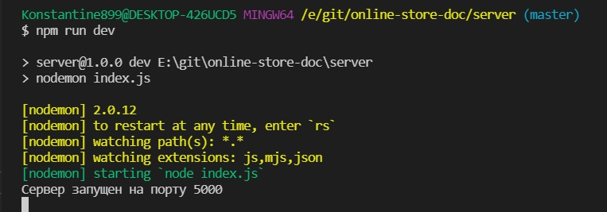

Создаю папку **server**. В ней инициализирую проект

```shell
npm init -y
```

создаю файл **index.js**. С данного файла будет начинаться запуск.

Далее устанавливаю зависимости.

```shell
npm install --save express body-parser  mysql2 sequelize nodemon cors dotenv
```

```shell
npm install -D  nodemon
```

Он разрабатывает на **postgresql**. Я же буду на **MySQL**.

- **body-parser** для того что бы парсить тело запросов
- **mysql2** плагин для работы с sequelize
- **sequelize** оболочка для работы с моделями
- **nodemon** автоматический перезапуск сервера
- **cors** для того что бы мы могли обращаться с браузера к нашему серверу
- **dotenv** для того что бы задавать переменные окружения.

```json
{
  "name": "server",
  "version": "1.0.0",
  "description": "",
  "main": "index.js",
  "scripts": {
    "dev": "nodemon index.js"
  },
  "keywords": [],
  "author": "",
  "license": "ISC",
  "dependencies": {
    "body-parser": "^1.19.0",
    "cors": "^2.8.5",
    "dotenv": "^10.0.0",
    "express": "^4.17.1",
    "mysql2": "^2.3.0",
    "sequelize": "^6.6.5"
  },
  "devDependencies": {
    "nodemon": "^2.0.12"
  }
}
```

Перехожу к структуре создания приложения.

Создаю базовую структуру подключения к серверу

```js
const express = require('express');

const PORT = 5000;

const app = express();

app.listen(PORT, () => console.log(`Сервер запущен на порту ${5000}`));
```



Но объявлять порт статично не очено хорошая практика. По этому всю конфигурацию мы будем выносить в переменную окружения.

```env
# .env
PORT=5000
```

И теперь получать этот **PORT** мы будем из переменных окружения с помощью **process.env**. Но для того что бы наш сервер мог считывать этот файл необходимо так же импортировать **config** из модуля **dotenv**.

```js
require('dotenv').config();
const express = require('express');

const PORT = process.env.PORT || 5000;

const app = express();

app.listen(PORT, () => console.log(`Сервер запущен на порту ${PORT}`));
```
