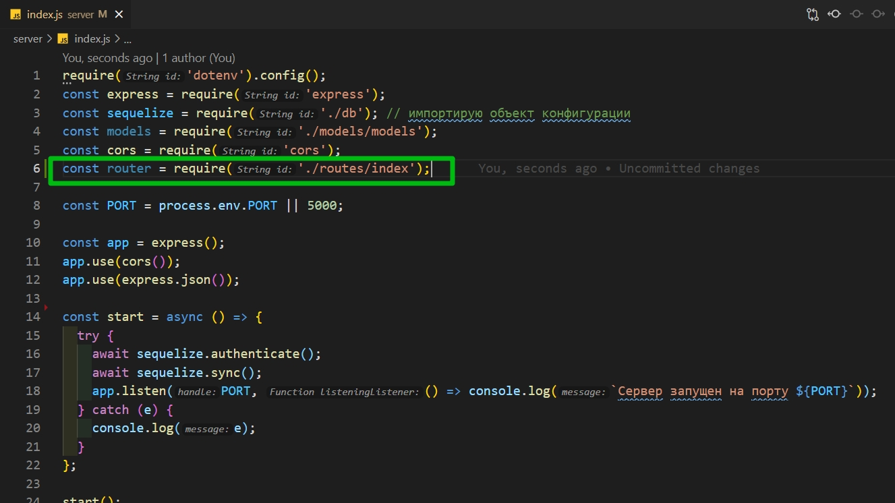
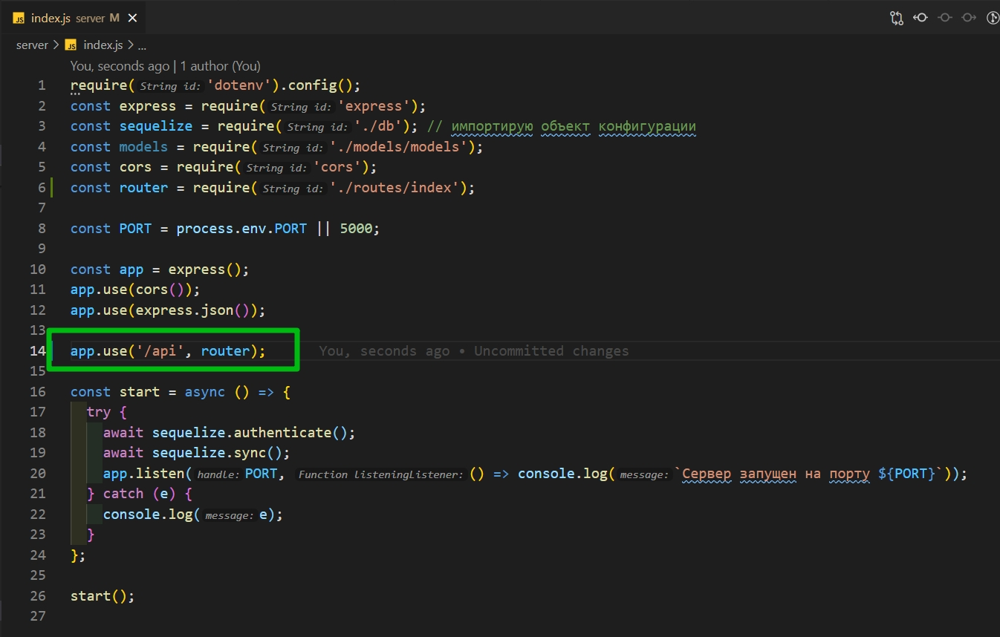
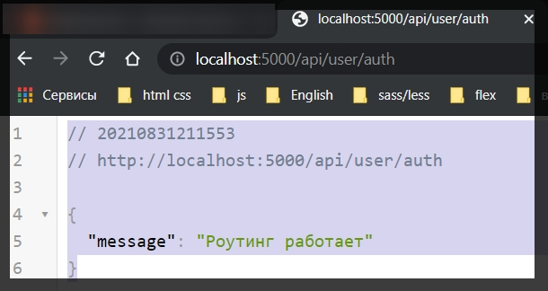
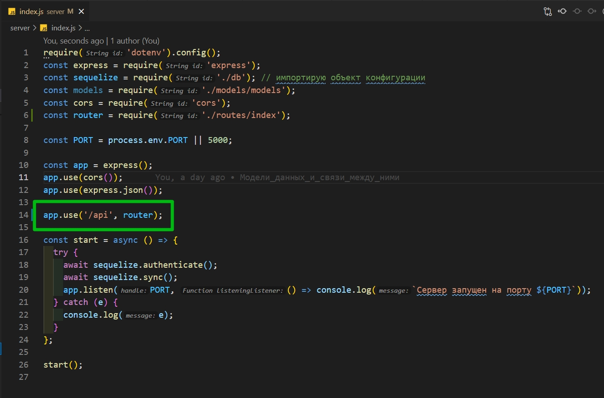
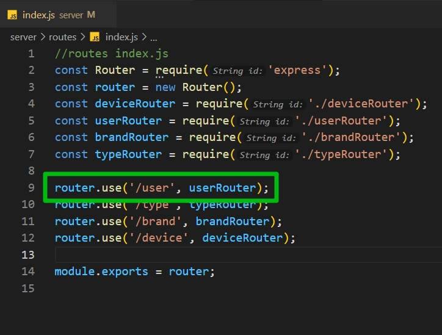
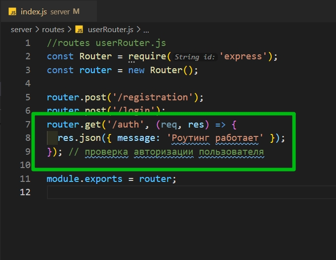
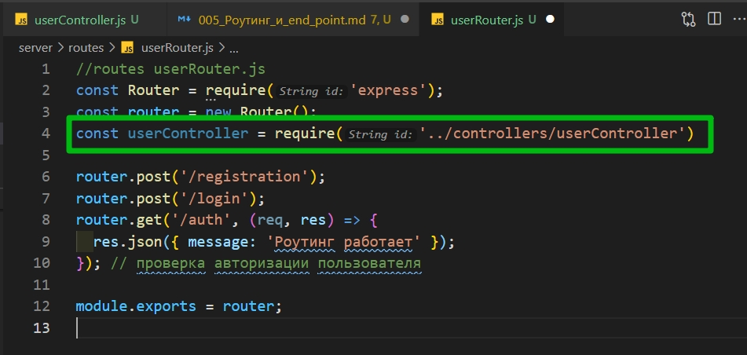
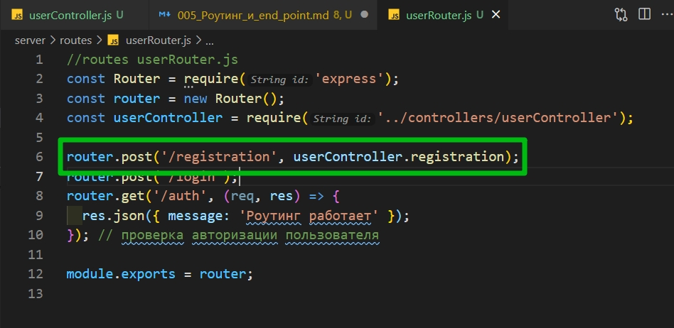
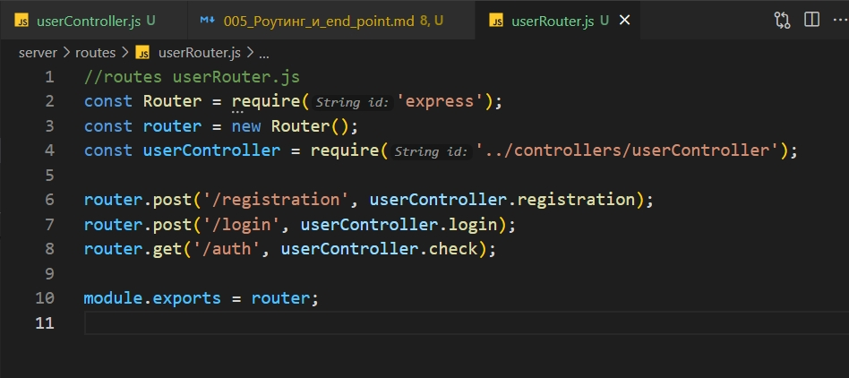
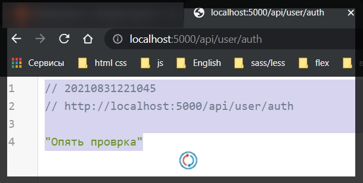

# Роутинг и end point

**Get** запрос сделанный ранее я убираю.

```js
require('dotenv').config();
const express = require('express');
const sequelize = require('./db'); // импортирую объект конфигурации
const models = require('./models/models');
const cors = require('cors');

const PORT = process.env.PORT || 5000;

const app = express();
app.use(cors());
app.use(express.json());

const start = async () => {
  try {
    await sequelize.authenticate();
    await sequelize.sync();
    app.listen(PORT, () => console.log(`Сервер запущен на порту ${PORT}`));
  } catch (e) {
    console.log(e);
  }
};

start();
```

Теперь зададим карказ нашего приложения. Начну с создания папки **routes** по которым будут отрабатывать те или иные методы. И в ней **index.js**, **typeRouter.js** **brandRouter.js** **userRouter.js** **deviceRouter.js**. Файл **index** будет все эти маршруты объеденять т.е. основной роутер нашего приложения.

В **index.js** мы получаем **Router** из **express**. Далее создаю объект этого **const router = new Router()**. И по итогу этот **router** мы из этого файла экспортируем.

```js
//routes index.js
const Router = require('express');
const router = new Router();

module.exports = router;
```

Так как файлы **typeRouter.js** **brandRouter.js** **userRouter.js** **deviceRouter.js** будут являться подроутерами. Мы должны в основном роутере **index.js** это указать.

У **router** вызываю **use()**. Первым параметром указываю **url** по которому тот **router** будет отрабатывать. А вторым параметром чуть позже необходимо будет указать сам роутер.

```js
//routes index.js
const Router = require('express');
const router = new Router();

router.use('/user');
router.use('/type');
router.use('/brand');
router.use('/device');

module.exports = router;
```

Теперь описываю **brandRouter**.

```js
//routes brandRouter.js
const Router = require('express');
const router = new Router();

module.exports = router;
```

Какие методы у нас будут по работе с **brand**?

Это соответственно **router.post('/')** для того что бы **brand** создавать. И так же соответственно метод **router.get('/')** для того что бы все брэнды получать.

```js
//routes brandRouter.js
const Router = require('express');
const router = new Router();

router.post('/');
router.get('/');

module.exports = router;
```

По хорошему бы добавить **delete** но на это мы время тратить не будем. Для **typeRouter.js** маршруты будут абсолютно одинаковы.

```js
//routes typeRouter.js
const Router = require('express');
const router = new Router();

router.post('/');
router.get('/');

module.exports = router;
```

Для пользователя уже будут отличаться.

```js
//routes userRouter.js
const Router = require('express');
const router = new Router();

router.post('/registration');
router.post('/login');
router.get('/auth'); // проверка авторизации пользователя

module.exports = router;
```

Для **device** будут те же методы на создание и получение, но добавляется еще один для того что бы получить один отдельно взятый девайс после того как мы перешли на страницу подробной информации.

```js
//routes deviceRouter.js
const Router = require('express');
const router = new Router();

router.post('/');
router.get('/');
router.get('/:id');

module.exports = router;
```

Теперь возвращаюсь на страницу **index.js** и все эти роутеры которые мы только что сделали импортируем в этот файл.

```js
//routes index.js
const Router = require('express');
const router = new Router();
const deviceRouter = require('./deviceRouter');
const userRouter = require('./userRouter');
const brandRouter = require('./brandRouter');
const typeRouter = require('./typeRouter');

router.use('/user', userRouter);
router.use('/type', typeRouter);
router.use('/brand', brandRouter);
router.use('/device', deviceRouter);

module.exports = router;
```

На данном этапе мы объеденили все 4 роутера в 1. Но наш сервер об этом ничего не знает.

Возвращаюсь в корневой **index.js**. И сюда импортирую основной роутер который связывает все остальные.



```js
require('dotenv').config();
const express = require('express');
const sequelize = require('./db'); // импортирую объект конфигурации
const models = require('./models/models');
const cors = require('cors');
const router = require('./routes/index');

const PORT = process.env.PORT || 5000;

const app = express();
app.use(cors());
app.use(express.json());

const start = async () => {
  try {
    await sequelize.authenticate();
    await sequelize.sync();
    app.listen(PORT, () => console.log(`Сервер запущен на порту ${PORT}`));
  } catch (e) {
    console.log(e);
  }
};

start();
```

Затем по анологии вызываю функцию **use** у **app** и указываю **url** по которому роут должен обрабатываться, в нашем случае это **'/api'**, а вторым параметром передаю сам роутер.



```js
require('dotenv').config();
const express = require('express');
const sequelize = require('./db'); // импортирую объект конфигурации
const models = require('./models/models');
const cors = require('cors');
const router = require('./routes/index');

const PORT = process.env.PORT || 5000;

const app = express();
app.use(cors());
app.use(express.json());

app.use('/api', router);

const start = async () => {
  try {
    await sequelize.authenticate();
    await sequelize.sync();
    app.listen(PORT, () => console.log(`Сервер запущен на порту ${PORT}`));
  } catch (e) {
    console.log(e);
  }
};

start();
```

открываю файл **userRouter.js** и вторым параметром в **get** метод передаю **callback** которая параметрами принимает запрос и ответ **response** и **request**. И возвращаем какое-нибудь сообщение в **json** формате.

```js
//routes userRouter.js
const Router = require('express');
const router = new Router();

router.post('/registration');
router.post('/login');
router.get('/auth', (req, res) => {
  res.json({ message: 'Роутинг работает' });
}); // проверка авторизации пользователя

module.exports = router;
```



Т.е. путь составляется с



```js
require('dotenv').config();
const express = require('express');
const sequelize = require('./db'); // импортирую объект конфигурации
const models = require('./models/models');
const cors = require('cors');
const router = require('./routes/index');

const PORT = process.env.PORT || 5000;

const app = express();
app.use(cors());
app.use(express.json());

app.use('/api', router);

const start = async () => {
  try {
    await sequelize.authenticate();
    await sequelize.sync();
    app.listen(PORT, () => console.log(`Сервер запущен на порту ${PORT}`));
  } catch (e) {
    console.log(e);
  }
};

start();
```



```js
//routes index.js
const Router = require('express');
const router = new Router();
const deviceRouter = require('./deviceRouter');
const userRouter = require('./userRouter');
const brandRouter = require('./brandRouter');
const typeRouter = require('./typeRouter');

router.use('/user', userRouter);
router.use('/type', typeRouter);
router.use('/brand', brandRouter);
router.use('/device', deviceRouter);

module.exports = router;
```



```js
//routes userRouter.js
const Router = require('express');
const router = new Router();

router.post('/registration');
router.post('/login');
router.get('/auth', (req, res) => {
  res.json({ message: 'Роутинг работает' });
}); // проверка авторизации пользователя

module.exports = router;
```

Т.е. все эти маршруты которые мы указывали от роутера к роутеру спдюсовались и мы можем с ними работать.

Сейчас мы функцию написали на прямую в роутере. Их логику по хорошему отделять. Для этого мы создадим папку **controllers**. И в ней создадим для каждого роутера соответствующий контроллер.

Начну с **userController.js**.

Здесь создаю одноименный класс.

```js
// controller userController.js
class UserController {}
```

Можно обойтись и без классов. Просто создавать функции. Но классы грубо говоря группируют. И здесь создадим соответствующие функции.

```js
// controller userController.js
class UserController {
  async registration(req, res) {}
  async login(req, res) {}
  async check(req, res) {} // проверка авторизован пользователь или нет
}
```

На выходе из этого файла у нас будет новый объект созданный из этого класса **module.exports = new UserController()** через точку будем обращаться к этим функциям.

```js
// controller userController.js
class UserController {
  async registration(req, res) {}
  async login(req, res) {}
  async check(req, res) {} // проверка авторизован пользователь или нет
}

module.exports = new UserController();
```

Откроем опять **userRouter.js** и сюда импортируем этот самый **userController.js**.



Теперь в каждый из **post** или **get** метод передаю соответствующую функцию.



```js
//routes userRouter.js
const Router = require('express');
const router = new Router();
const userController = require('../controllers/userController');

router.post('/registration', userController.registration);
router.post('/login');
router.get('/auth', (req, res) => {
  res.json({ message: 'Роутинг работает' });
}); // проверка авторизации пользователя

module.exports = router;
```

Обратите внимание передаем мы ее без скобок т.е. мы ее не вызываем а просто передаем как объект.



```js
//routes userRouter.js
const Router = require('express');
const router = new Router();
const userController = require('../controllers/userController');

router.post('/registration', userController.registration);
router.post('/login', userController.login);
router.get('/auth', userController.check);

module.exports = router;
```

Теперь проделаю ту же самую операцию для всех остальных контроллеров.

```js
// controllers typeController
class TypeController {
  async create(req, res) {}

  async getAll(req, res) {}
}

module.exports = TypeController();
```

```js
// controllers brandController.js
class BrandController {
  async create(req, res) {}

  async getAll(req, res) {}
}

module.exports = BrandController();
```

```js
// controllers deviceController.js
class DeviceController {
  async create(req, res) {}

  async getAll(req, res) {}

  async getOne(req, res) {}
}

module.exports = DeviceController();
```

```js
// controller userController.js
class UserController {
  async registration(req, res) {}
  async login(req, res) {}
  async check(req, res) {
    res.json('Опять проврка');
  } // проверка авторизован пользователь или нет
}

module.exports = new UserController();
```


