# CRUD

И так научимся добавлять в БД объекты. Начну с **TypeController.js**

И так в первую очередь в **TypeController.js** импортирую модель которая находится в папке **models** в файле **models.js**

```js
// controllers typeController
const { Type } = require('../models/models');
class TypeController {
  async create(req, res) {}

  async getAll(req, res) {}
}

module.exports = new TypeController();
```

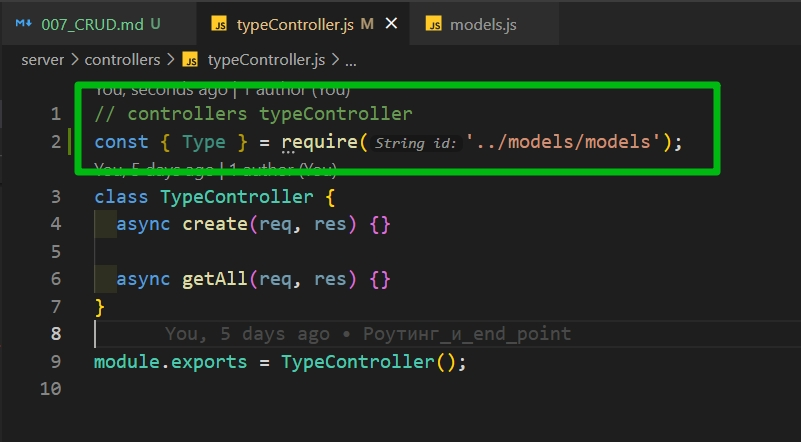

И так же сюда импортируем ApiError.

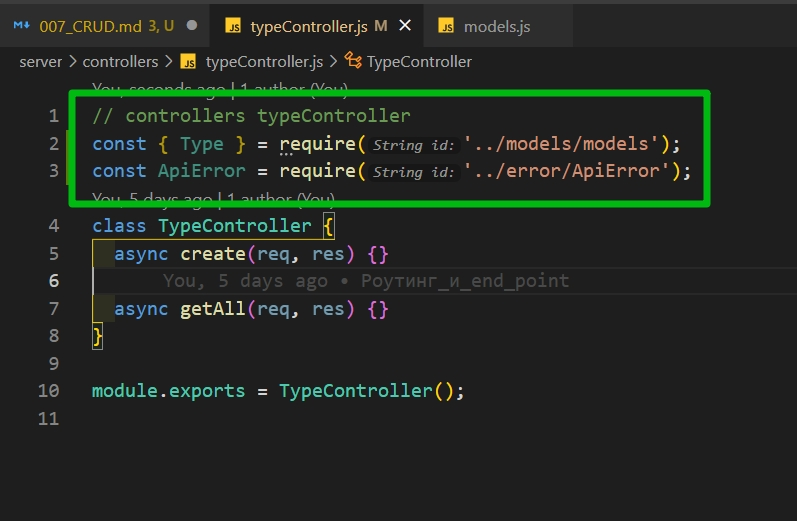

```js
// controllers typeController
const { Type } = require('../models/models');
const ApiError = require('../error/ApiError');
class TypeController {
  async create(req, res) {}

  async getAll(req, res) {}
}

module.exports = new TypeController();
```

Сразу обращу внимание что каждый случай мы обрабатывать не будем. Прям полноценную валидацию мы делать тоже не будем. Иначе ролик можно растянут на 15 часов.

И так в функции создания сразу делаю диструктуризацию

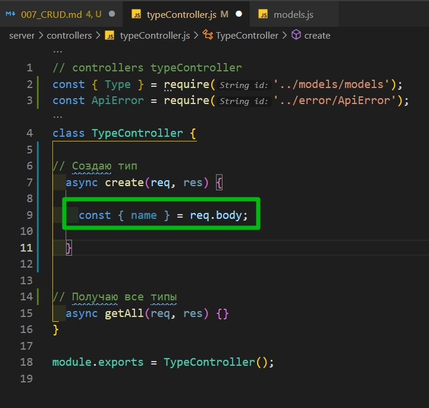

И их тела запроса, поскольку это **POST** запрос у него есть тело, извлекаем название т.е. name этого типа.
Затем с помощью фунции **create** этот тип мы создаем.

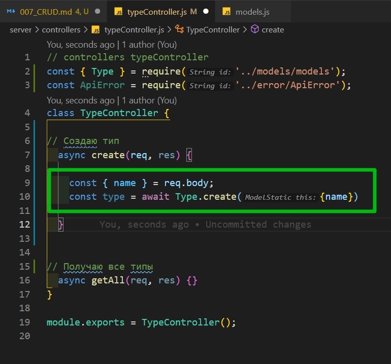

```js
// controllers typeController
const { Type } = require('../models/models');
const ApiError = require('../error/ApiError');
class TypeController {
  // Создаю тип
  async create(req, res) {
    const { name } = req.body;
    const type = await Type.create({ name });
  }

  // Получаю все типы
  async getAll(req, res) {}
}

module.exports = new TypeController();
```

Обратите внимание на то что эта функция асинхронная. По этому добавляем **await**. Параметром в функцию **create** мы передаем объект где указываем нужные поля. В данном случае необходимо указать только название типа, а **id** будет присвоен автоматически.

Полученный **responce** т.е. ответ конвертирую в **json**.

```js
// controllers typeController
const { Type } = require('../models/models');
const ApiError = require('../error/ApiError');
class TypeController {
  // Создаю тип
  async create(req, res) {
    const { name } = req.body;
    const type = await Type.create({ name });
    return res.json(type);
  }

  // Получаю все типы
  async getAll(req, res) {}
}

module.exports = new TypeController();
```

В **POSTMAN** прописываю **POST** запрос где в тело помещаю Холодильники.

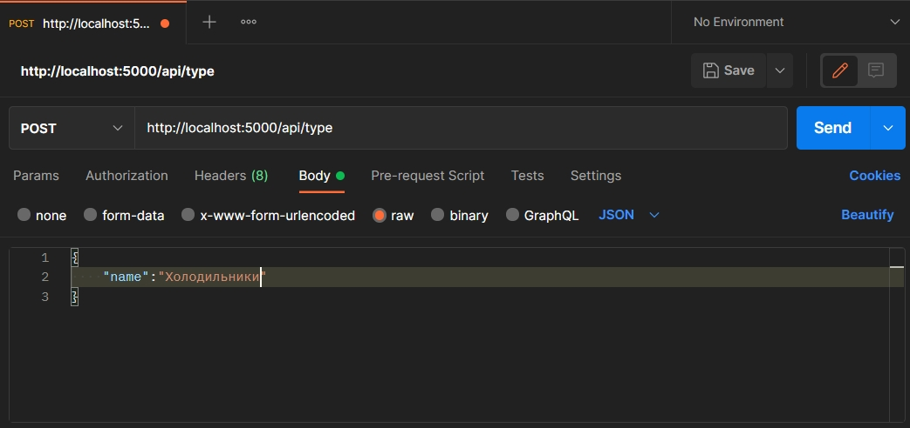

И сразу я получаю ошибку потому что мы контроллер сделали, но не указали функции которые должны отрабатывать на тот или иной маршрут.

По этому перехожу в **typeRouter.js**. Импортирую сюда **typeController**. В post метод передаю функцию **create**. А в **get** метод передаю функцию **getAll**.

```js
//routes typeRouter.js
const Router = require('express');
const router = new Router();
const typeController = require('../controllers/typeController');

router.post('/', typeController.create);
router.get('/', typeController.getAll);

module.exports = router;
```

Что бы к этому не возвращаться сделаем то же самое и для **brand**.

```js
//routes brandRouter.js
const Router = require('express');
const router = new Router();
const brandController = require('../controllers/brandController');

router.post('/', brandController.create);
router.get('/', brandController.getAll);

module.exports = router;
```

И тоже амое делаем и для **device**.

```js
//routes deviceRouter.js
const Router = require('express');
const router = new Router();
const deviceController = require('../controllers/deviceController');

router.post('/', deviceController.create);
router.get('/', deviceController.getAll);
router.get('/:id', deviceController.getOne);

module.exports = router;
```

Открываю **POSTMAN** и пытаюсь отправить запрос еще раз.

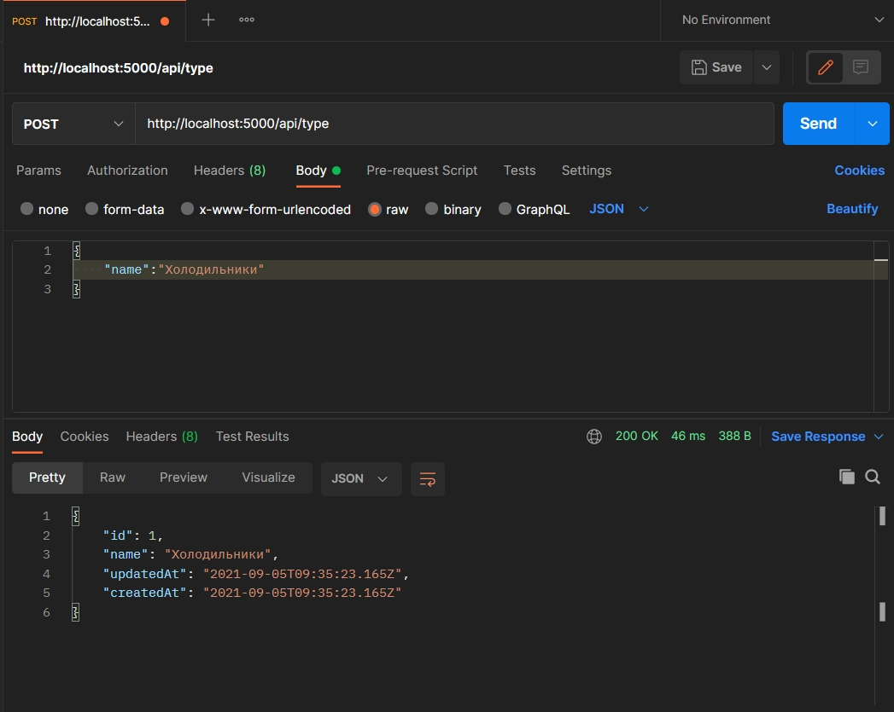

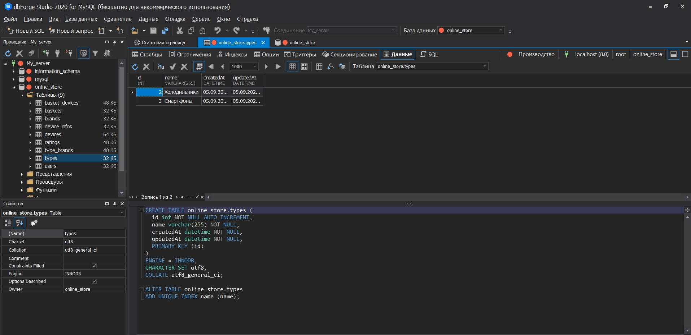

<br />
<br />
<br />

Создавать типы мы научились. Теперь научимся их получать.

Создаю переменную и называю ее **types** и у модели Type вызываю функцию **findAll** которая вернет нам се существующие записи которые есть в БД.

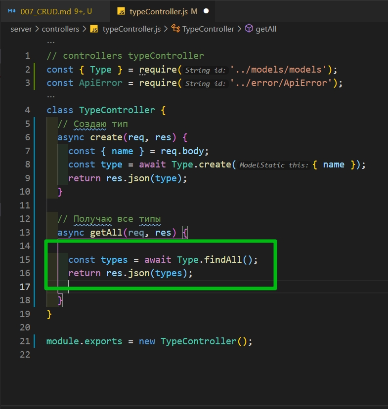

```js
// controllers typeController
const { Type } = require('../models/models');
const ApiError = require('../error/ApiError');
class TypeController {
  // Создаю тип
  async create(req, res) {
    const { name } = req.body;
    const type = await Type.create({ name });
    return res.json(type);
  }

  // Получаю все типы
  async getAll(req, res) {
    const types = await Type.findAll();
    return res.json(types);
  }
}

module.exports = new TypeController();
```

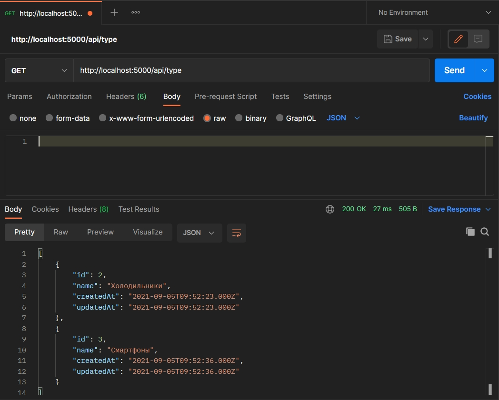

На данный момент эти функции доступны каждому. Любой пользователь может взять и создать какой-то тип. Но чуть позже мы сделаем так что бы эти функции были доступны только администратору.

Переходим к **brandController.js**. Тут логика похожа.

```js
// controllers brandController.js
const { Brand } = require('../models/models');
const ApiError = require('../error/ApiError');
class BrandController {
  async create(req, res) {
    const { name } = req.body;
    const brand = await Brand.create({ name });
    return res.json(brand);
  }

  async getAll(req, res) {
    const brands = await Brand.findAll();
    return res.json(brands);
  }
}

module.exports = new BrandController();
```

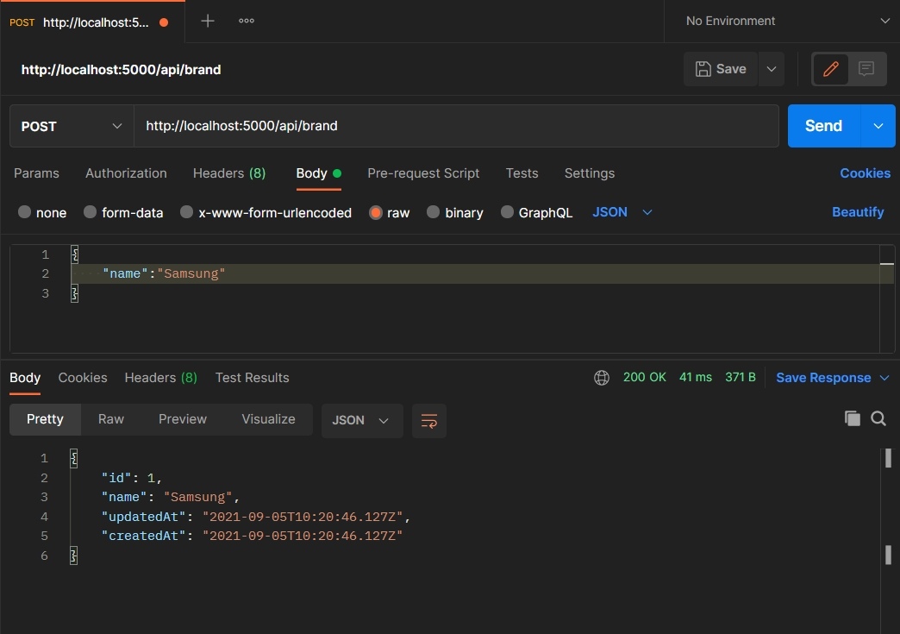

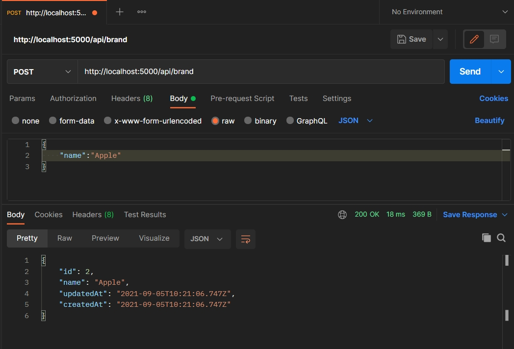

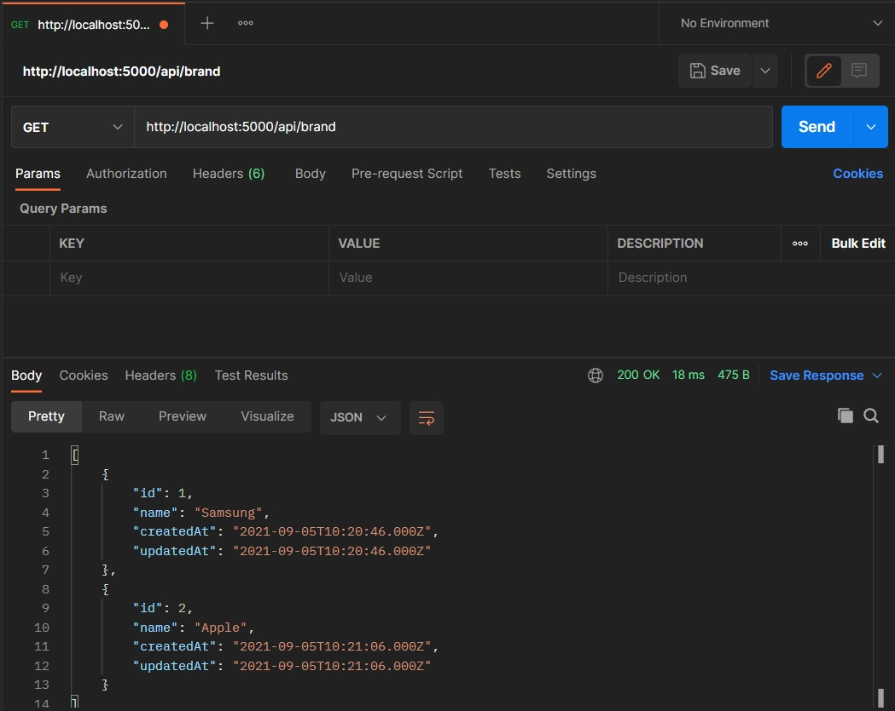

<br/>
<br/>
<br/>

Теперь перехожу к **deviceController**. Здесь все будет несколько сложнее.
Начнем мы с создания **device** и первое что мы сделаем это получим данные из тела запроса. Здесь нас интересует называние товара **name**, его цена **price**, его **brandId** и его **typeId** и массив **info**.

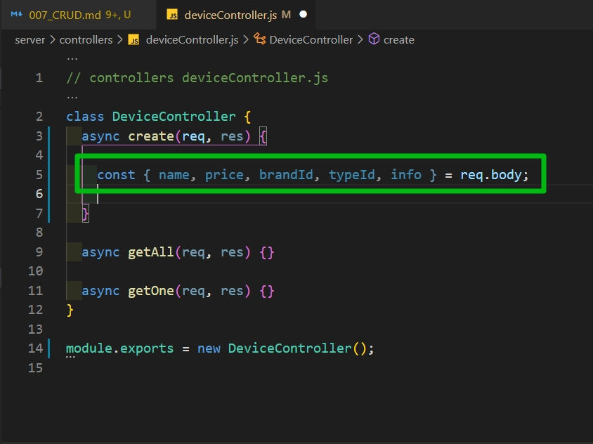

```js
// controllers deviceController.js
class DeviceController {
  async create(req, res) {
    const { name, price, brandId, typeId, info } = req.body;
  }

  async getAll(req, res) {}

  async getOne(req, res) {}
}

module.exports = new DeviceController();
```

Но не забываем что у каждого устройства у нас будет какая-то картинка. Ее мы можем получить из поля files.

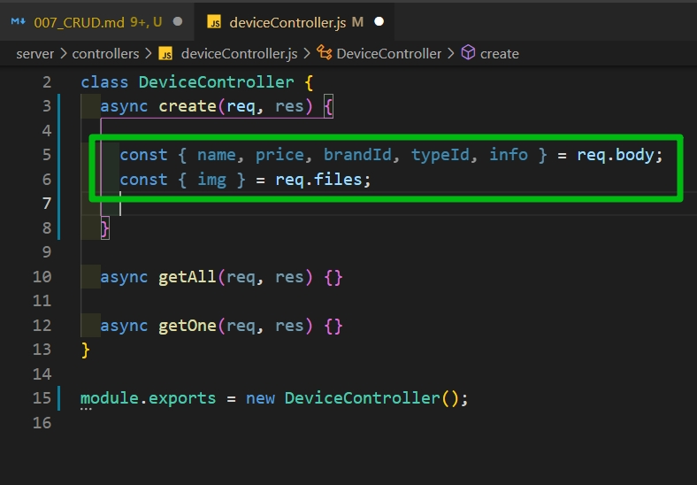

```js
// controllers deviceController.js
class DeviceController {
  async create(req, res) {
    const { name, price, brandId, typeId, info } = req.body;
    const { img } = req.files;
  }

  async getAll(req, res) {}

  async getOne(req, res) {}
}

module.exports = new DeviceController();
```

Но здесь не все так просто. Для этого необходимо установить специальный пакет.

В папке server устанавливаю пакет express-fileupload.

```shell
npm i express-fileupload
```

Его так же необходимо зарегистрировать.

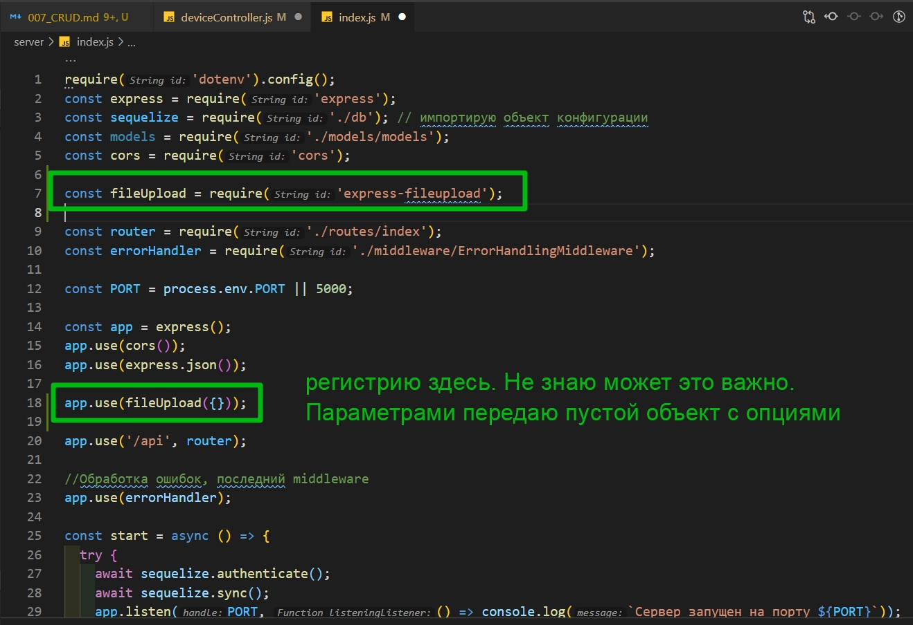

```js
require('dotenv').config();
const express = require('express');
const sequelize = require('./db'); // импортирую объект конфигурации
const models = require('./models/models');
const cors = require('cors');

const fileUpload = require('express-fileupload');

const router = require('./routes/index');
const errorHandler = require('./middleware/ErrorHandlingMiddleware');

const PORT = process.env.PORT || 5000;

const app = express();
app.use(cors());
app.use(express.json());

app.use(fileUpload({}));

app.use('/api', router);

//Обработка ошибок, последний middleware
app.use(errorHandler);

const start = async () => {
  try {
    await sequelize.authenticate();
    await sequelize.sync();
    app.listen(PORT, () => console.log(`Сервер запущен на порту ${PORT}`));
  } catch (e) {
    console.log(e);
  }
};

start();
```

Параметрами передаю пустой объект с опциями.

На данном этапе мы уже можем работать с файлами. По этому возвращаюсь к deviceController.js и продолжаю работать с нашей функцией.

После того как файл мы получили из req.files. Нам для него необходимо сгенерировать уникальное имя. Что бы потом по этому имени мы могли этот файл получать.

Для этого установим пакет

```shell
npm i uuid
```

который будет генерировать случайные рандомные id которые не будут повторяться.

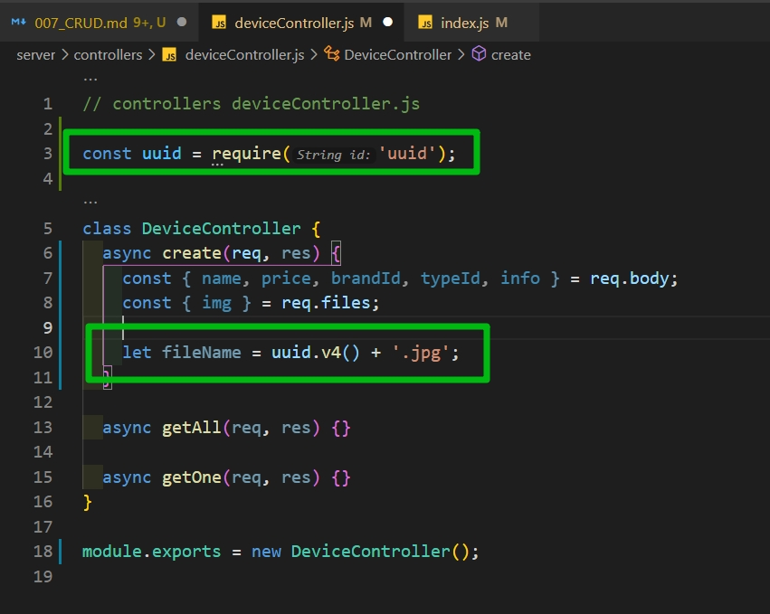

```js
// controllers deviceController.js
const uuid = require('uuid');

class DeviceController {
  async create(req, res) {
    const { name, price, brandId, typeId, info } = req.body;
    const { img } = req.files;
    let fileName = uuid.v4() + '.jpg';
  }

  async getAll(req, res) {}

  async getOne(req, res) {}
}

module.exports = new DeviceController();
```

теперь создадим еще одну папку в папке server которую назовем static. В нее будем перемещать все файлы которые будут отправляться с клиента. А затем ноучим наш сервер эти файлы отдавать как статику что бы мы через браузер могли спокойно эти файлы получать.

И что бы файл в эту папку переместить вызовем функцию mv у константы img.

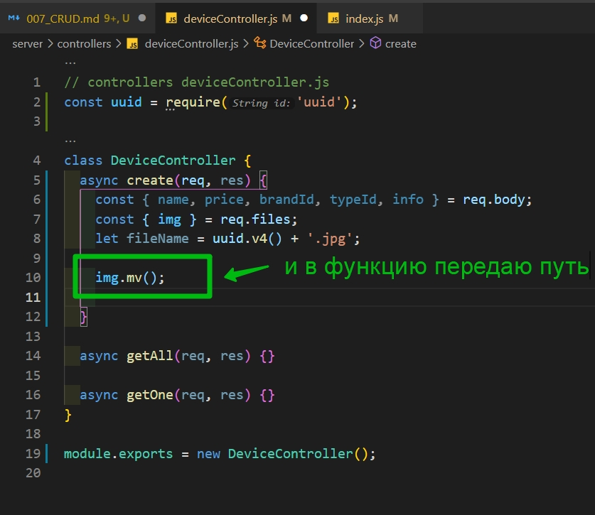

```js
// controllers deviceController.js
const uuid = require('uuid');

class DeviceController {
  async create(req, res) {
    const { name, price, brandId, typeId, info } = req.body;
    const { img } = req.files;
    let fileName = uuid.v4() + '.jpg';

    img.mv();
  }

  async getAll(req, res) {}

  async getOne(req, res) {}
}

module.exports = new DeviceController();
```

Захардкоженный путь это не правильно. Импортирую модуль path который есть у NodeJS.

```js
// controllers deviceController.js
const uuid = require('uuid');
const path = require('path');

class DeviceController {
  async create(req, res) {
    const { name, price, brandId, typeId, info } = req.body;
    const { img } = req.files;
    let fileName = uuid.v4() + '.jpg';

    img.mv();
  }

  async getAll(req, res) {}

  async getOne(req, res) {}
}

module.exports = new DeviceController();
```

У него вызовем функцию resolve() которая адаптирует указанный путь к операционной системе. Первым параметром передаем \_\_dirname, это путь до текущей папки с которой контроллерами. В скобках указываю две точки т.е. выхожу из дирректории controllers и далее указываю папку static. Четвертым параметром указываю сгенерированный файл т.е. в моем случае fileName.

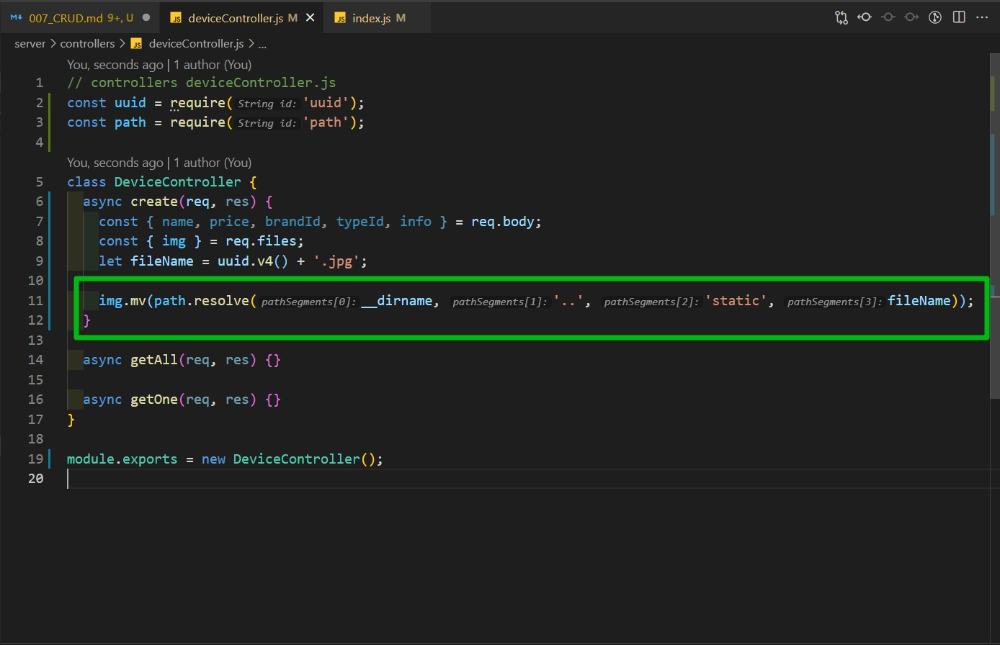

```js
// controllers deviceController.js
const uuid = require('uuid');
const path = require('path');

class DeviceController {
  async create(req, res) {
    const { name, price, brandId, typeId, info } = req.body;
    const { img } = req.files;
    let fileName = uuid.v4() + '.jpg';

    img.mv(path.resolve(__dirname, '..', 'static', fileName));
  }

  async getAll(req, res) {}

  async getOne(req, res) {}
}

module.exports = new DeviceController();
```

таким образом мы переместим файл с заданным именем в нужную для нас папку.

Следующим этапом, после того как файл перемещен. Нам необходимо создать сам device. Для этого импортирую сюда модель.

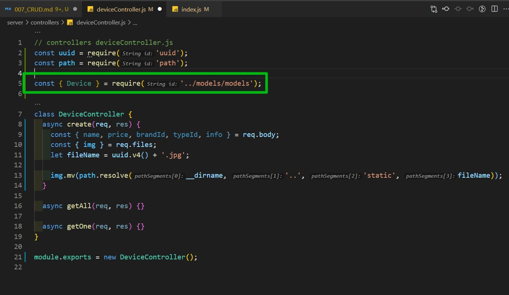

Создаю переменную const device. У модели Device вызываю функцию create и туду передаем все необходимые параметры name, price, brandId, typeId. С массивом характеристик info мы разберемся чуть позже. И как имя файла передаю img: fileName.

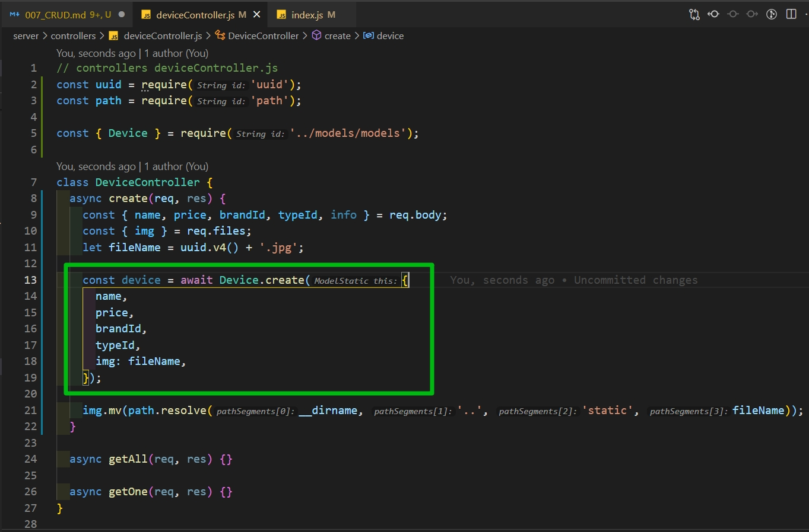

```js
// controllers deviceController.js
const uuid = require('uuid');
const path = require('path');

const { Device } = require('../models/models');

class DeviceController {
  async create(req, res) {
    const { name, price, brandId, typeId, info } = req.body;
    const { img } = req.files;
    let fileName = uuid.v4() + '.jpg';
    img.mv(path.resolve(__dirname, '..', 'static', fileName));

    const device = await Device.create({
      name,
      price,
      brandId,
      typeId,
      img: fileName,
    });
  }

  async getAll(req, res) {}

  async getOne(req, res) {}
}

module.exports = new DeviceController();
```

Затем по этому названию fileName мы этот файл будем получать.

rating мы не указывам по скольку по скольку по default в модели он указан как 0.

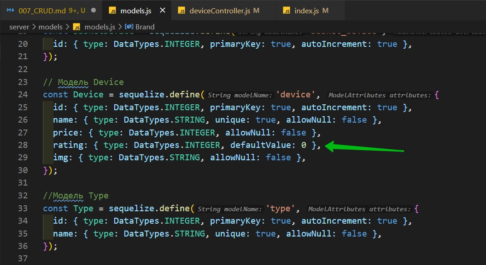

```js
// models models.js
const sequelize = require('../db');
const { DataTypes, STRING } = require('sequelize');

//Модель пользователя
const User = sequelize.define('user', {
  id: { type: DataTypes.INTEGER, primaryKey: true, autoIncrement: true },
  email: { type: DataTypes.STRING, unique: true },
  password: { type: DataTypes.STRING },
  role: { type: DataTypes.STRING, defaultValue: 'USER' },
});

//Модель Корзины
const Basket = sequelize.define('basket', {
  id: { type: DataTypes.INTEGER, primaryKey: true, autoIncrement: true },
});

// девайса в корзине
const BasketDevice = sequelize.define('basket_device', {
  id: { type: DataTypes.INTEGER, primaryKey: true, autoIncrement: true },
});

// Модель Device
const Device = sequelize.define('device', {
  id: { type: DataTypes.INTEGER, primaryKey: true, autoIncrement: true },
  name: { type: DataTypes.STRING, unique: true, allowNull: false },
  price: { type: DataTypes.INTEGER, allowNull: false },
  rating: { type: DataTypes.INTEGER, defaultValue: 0 },
  img: { type: DataTypes.STRING, allowNull: false },
});

//Модель Type
const Type = sequelize.define('type', {
  id: { type: DataTypes.INTEGER, primaryKey: true, autoIncrement: true },
  name: { type: DataTypes.STRING, unique: true, allowNull: false },
});

//Модель Type
const Brand = sequelize.define('brand', {
  id: { type: DataTypes.INTEGER, primaryKey: true, autoIncrement: true },
  name: { type: DataTypes.STRING, unique: true, allowNull: false },
});

//Модель Type
const Rating = sequelize.define('rating', {
  id: { type: DataTypes.INTEGER, primaryKey: true, autoIncrement: true },
  name: { type: DataTypes.STRING, allowNull: false },
});

//Модель DeviceInfo
const DeviceInfo = sequelize.define('device_info', {
  id: { type: DataTypes.INTEGER, primaryKey: true, autoIncrement: true },
  title: { type: DataTypes.STRING, allowNull: false },
  description: { type: DataTypes.STRING, allowNull: false },
});

//Модель связующей таблицы
const TypeBrand = sequelize.define('type_brand', {
  id: { type: DataTypes.INTEGER, primaryKey: true, autoIncrement: true },
});

User.hasOne(Basket);
Basket.belongsTo(User);

User.hasMany(Rating);
Rating.belongsTo(User);

Basket.hasMany(BasketDevice);
BasketDevice.belongsTo(Basket);

Type.hasMany(Device);
Device.belongsTo(Type);

Brand.hasMany(Device);
Device.belongsTo(Brand);

Device.hasMany(Rating);
Rating.belongsTo(Device);

Device.hasMany(BasketDevice);
BasketDevice.belongsTo(Device);

Device.hasMany(DeviceInfo);
DeviceInfo.belongsTo(Device);

Type.belongsToMany(Brand, { through: TypeBrand });
Brand.belongsToMany(Type, { through: TypeBrand });

module.exports = {
  User,
  Basket,
  BasketDevice,
  Device,
  Type,
  Brand,
  Rating,
  TypeBrand,
  DeviceInfo,
};
```

После того как устройство мы создали. Мы возвращаем инфоормацию о нем обратно на клиент return res.json(device).

```js
// controllers deviceController.js
const uuid = require('uuid');
const path = require('path');

const { Device } = require('../models/models');

class DeviceController {
  async create(req, res) {
    const { name, price, brandId, typeId, info } = req.body;
    const { img } = req.files;
    let fileName = uuid.v4() + '.jpg';
    img.mv(path.resolve(__dirname, '..', 'static', fileName));

    const device = await Device.create({
      name,
      price,
      brandId,
      typeId,
      img: fileName,
    });

    return res.json(device);
  }

  async getAll(req, res) {}

  async getOne(req, res) {}
}

module.exports = new DeviceController();
```

Здесь потенциально может возникнуть какая-нибудь ошибка. По этому оборачиваю все в блок try catch. И в случае если эта ошибка возникла, как обычно добавляем функцию next и туда передаем вызов функции ApiError. и в функцию badRequest передаю сообщение которое лежит в ошибке error.message.

```js
// controllers deviceController.js
const uuid = require('uuid');
const path = require('path');
const ApiError = require('../error/ApiError');

const { Device } = require('../models/models');

class DeviceController {
  async create(req, res, next) {
    try {
      const { name, price, brandId, typeId, info } = req.body;
      const { img } = req.files;
      let fileName = uuid.v4() + '.jpg';
      img.mv(path.resolve(__dirname, '..', 'static', fileName));

      const device = await Device.create({
        name,
        price,
        brandId,
        typeId,
        img: fileName,
      });

      return res.json(device);
    } catch (error) {
      next(ApiError.badRequest(error.message));
    }
  }

  async getAll(req, res) {}

  async getOne(req, res) {}
}

module.exports = new DeviceController();
```

Открываю POSTMAN. Меняю http://localhost:5000/api/device. Открываю тело body и здесь тело у нас будет не как JSON строка а как form-data поскольку нам нужно будет прикрепить еще и файл.

Что бы семантика была правильной проверяю под какими id brandId и typeId

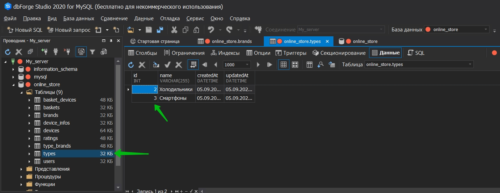

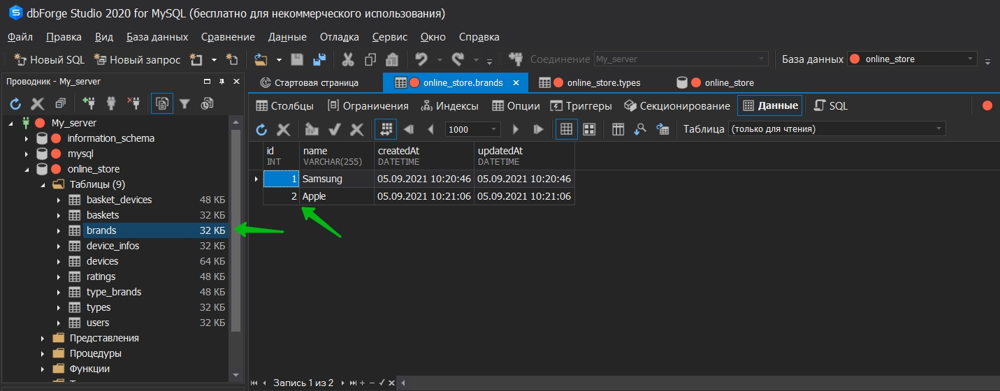

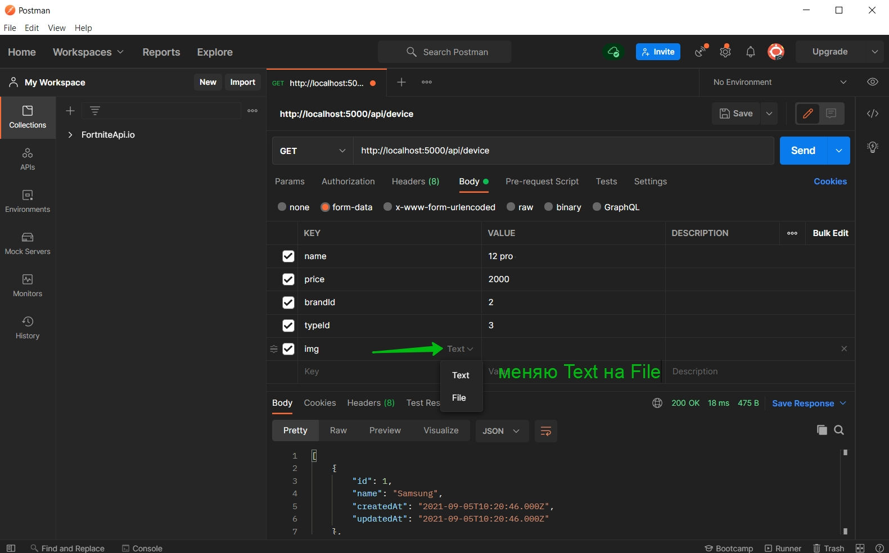

И указываю путь к файлу.

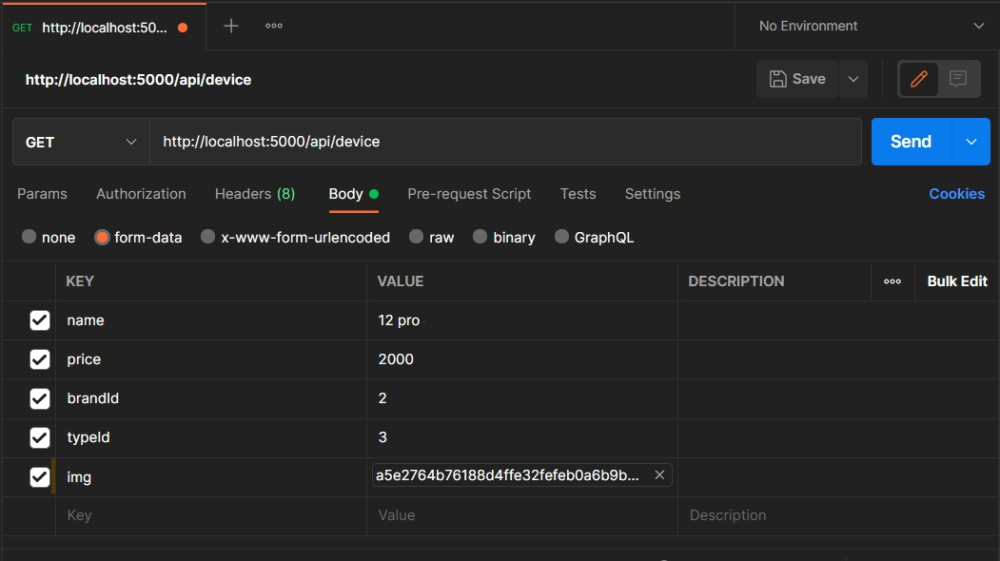

И делаю запрос.

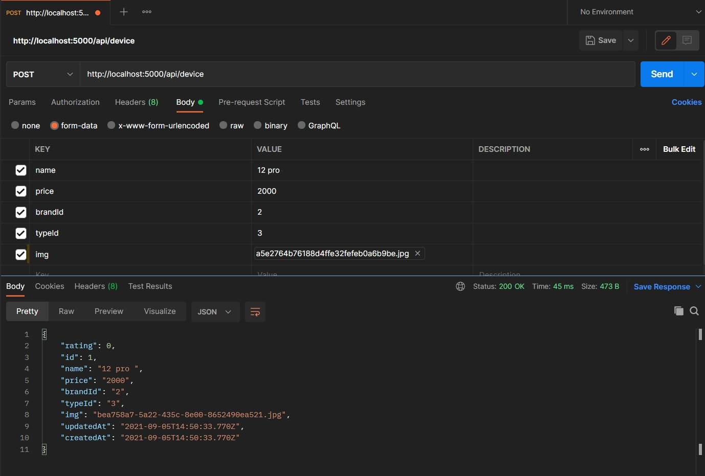

Если мы откроем папку static мы увидим сгенерированное имя файла. Если я сейчас скопирую имя файла с расширением и вставлю это в адресную строку браузера, то я получу ошибку.

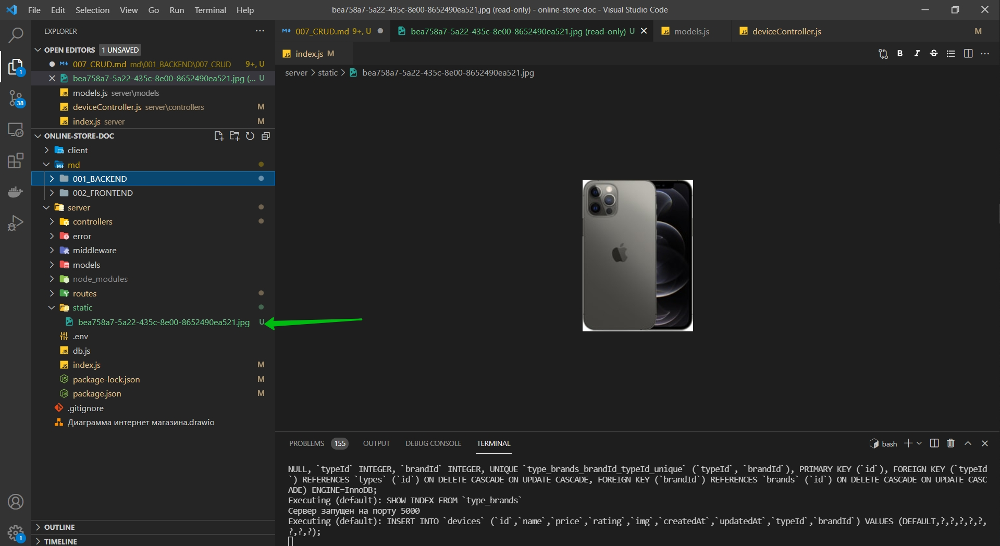

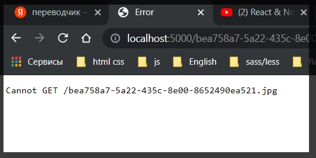

Ним необходимо указать серверу что файлы из папки static необходимо раздавать как статику.

```js
require('dotenv').config();
const express = require('express');
const sequelize = require('./db'); // импортирую объект конфигурации
const models = require('./models/models');
const cors = require('cors');
const fileUpload = require('express-fileupload');
const router = require('./routes/index');
const errorHandler = require('./middleware/ErrorHandlingMiddleware');
const path = require('path');

const PORT = process.env.PORT || 5000;

const app = express();
app.use(cors());
app.use(express.json());
app.use(express.static(path.resolve(__dirname, 'static')));
app.use(fileUpload({}));

app.use('/api', router);

//Обработка ошибок, последний middleware
app.use(errorHandler);

const start = async () => {
  try {
    await sequelize.authenticate();
    await sequelize.sync();
    app.listen(PORT, () => console.log(`Сервер запущен на порту ${PORT}`));
  } catch (e) {
    console.log(e);
  }
};

start();
```

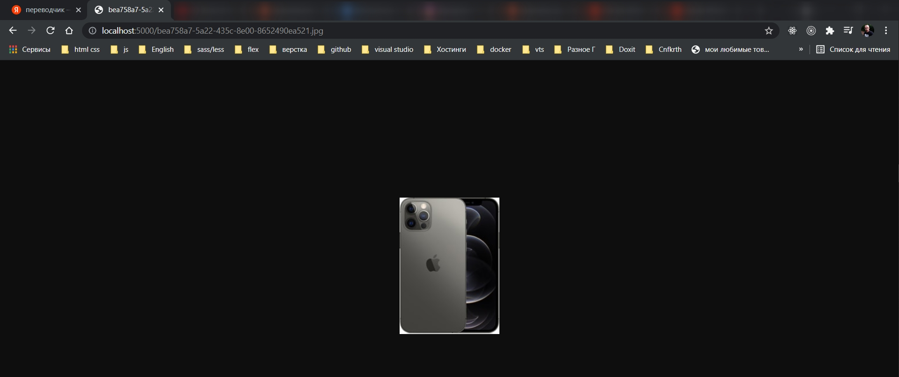

Теперь ко все файлам которе лежат в папке static мы можем обращаться по названию и получать их.

Чуть-чуть подправил на сервере подправил

```js
// controllers deviceController.js
const uuid = require('uuid');
const path = require('path');
const ApiError = require('../error/ApiError');

const { Device, DeviceInfo } = require('../models/models');

class DeviceController {
  async create(req, res, next) {
    try {
      let { name, price, brandId, typeId, info } = req.body;
      const { img } = req.files;
      let fileName = uuid.v4() + '.jpg';
      img.mv(path.resolve(__dirname, '..', 'static', fileName));
      const device = await Device.create({
        name,
        price,
        brandId,
        typeId,
        img: fileName,
      });

      if (info) {
        info = JSON.parse(info);
        info.forEach((i) =>
          DeviceInfo.create({
            title: i.title,
            description: i.description,
            deviceId: device.id,
          })
        );
      }

      return res.json(device);
    } catch (error) {
      next(ApiError.badRequest(error.message));
    }
  }

  async getAll(req, res, next) {
    let { brandId, typeId, page, limit } = req.query;

    page = page || 1;
    limit = Number(limit) || 9; // Для того что бы нормально отработало переведи в Number
    let offset = page * limit - limit;
    let devices;

    try {
      // если brandId и typeId не указаны возвращаю все devices
      if (!brandId && !typeId) {
        devices = await Device.findAndCountAll({ limit, offset });
      }

      //Фильтрация по brandId
      if (brandId && !typeId) {
        devices = await Device.findAndCountAll({
          where: { brandId },
          limit,
          offset,
        });
      }
      // Фильтрация по typeId
      if (!brandId && typeId) {
        devices = await Device.findAndCountAll({
          where: { typeId },
          limit,
          offset,
        });
      }

      //Фильтрация по typeId и по typeId
      if (brandId && typeId) {
        devices = await Device.findAndCountAll({
          where: { brandId, typeId },
          limit,
          offset,
        });
      }
      // возвращаю массив девайсов
      return res.json(devices);
    } catch (error) {
      next(ApiError.badRequest(error.message));
    }
  }

  async getOne(req, res, next) {
    const { id } = req.params;
    try {
      const device = await Device.findOne({
        where: Number(id),
        include: [{ model: DeviceInfo, as: 'info' }],
      });
      return res.json(device);
    } catch (error) {
      next(ApiError.badRequest(error.message));
    }
  }
}

module.exports = new DeviceController();
```
