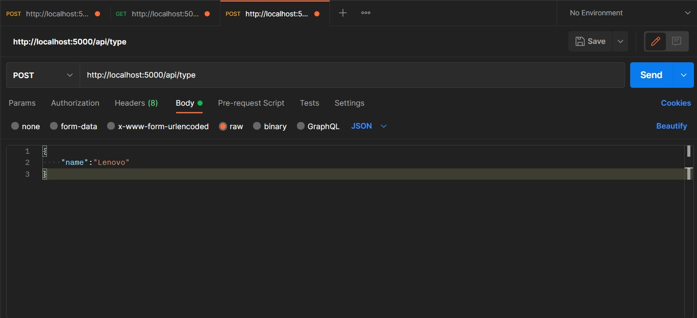
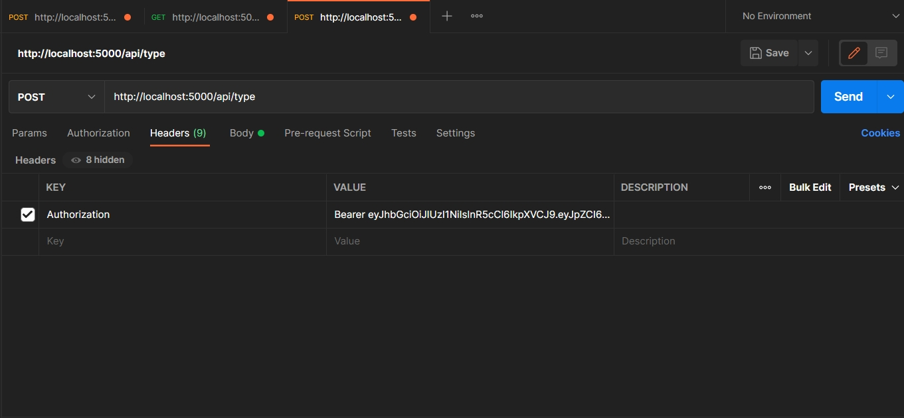
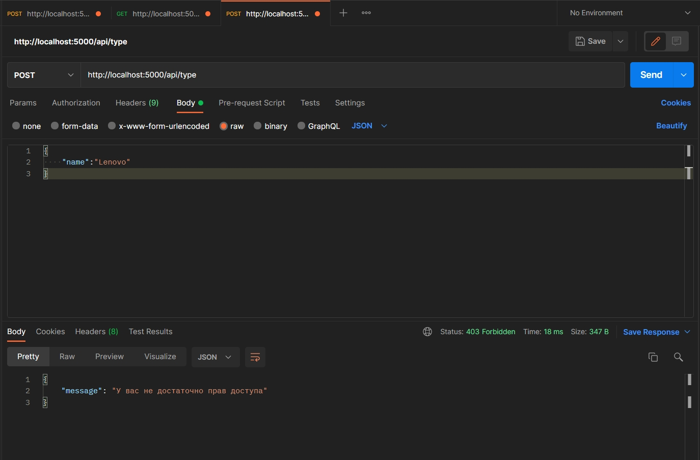
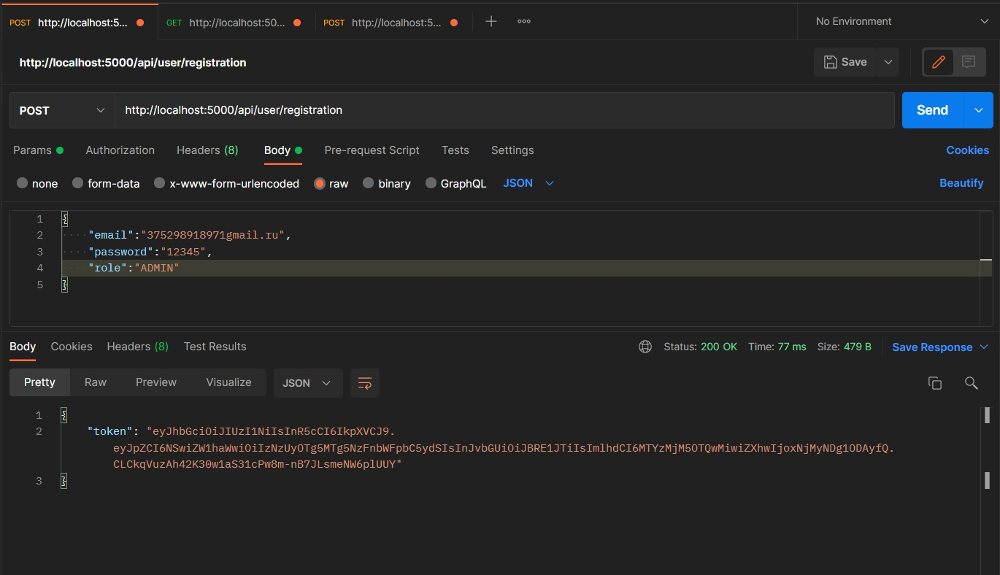
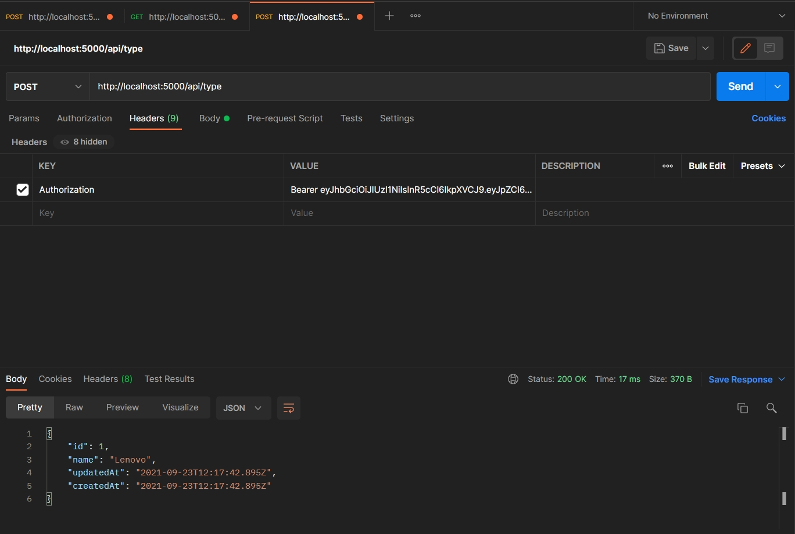

# Middleware проверяющий роль пользователя

На данный момент мы можем добавлять типы брэнды. Получать их. Добавлять устройства. Но это может сделать абсолютно любой пользователь.

Нам необходимо убедиться в том что добавить новое устройство в магазин пытается именно администратор.

Поэтому создаем новый **middleware** **checkRoleMiddleware.js**.

И здесь я экспортирую функцию которая не **req**, **res** как предыдущий **middleware**. А принимает параметром **role**.

```js
// middleware checkRoleMiddleware.js

const jwt = require('jsonwebtoken');

module.exports = function (role) {};
```

А уже из этой функции мы возвращаем тот самый **middleware** **auth** точнее его логику. Своего рода замыкание.
Т.е. мы вызываем функцию, передаем туда **role** и эта функция нам уже возвращает **middleware**.

```js
// middleware checkRoleMiddleware.js

const jwt = require('jsonwebtoken');

module.exports = function (role) {
  return function (req, res, next) {
    if (req.method === 'OPTIONS') {
      next();
    }
    try {
      // Вытаскиваю токен
      const token = req.headers.authorization.split(' ')[1]; // Bearer asdfghjkl
      if (!token) {
        return res.status(401).json({ message: 'Пользователь не авторизован' });
      } else {
        // Если токен есть я его декодирую
        const decoded = jwt.verify(token, process.env.SECRET_KEY);
        // в поле req.user добавляю декодированные данные
        req.user = decoded;
        next();
      }
    } catch (error) {
      res.status(401).json({ message: 'Пользователь не авторизован' });
    }
  };
};
```

И здесь единственное отличие. Нам необходимо будет после того как **token** мы декодировали выцепить оттуда роль пользователя и сравнить ее с ролью которую мы передали в **middleware**. Если роль не совпадае передаю ошибку.

```js
// middleware checkRoleMiddleware.js

const jwt = require('jsonwebtoken');

module.exports = function (role) {
  return function (req, res, next) {
    if (req.method === 'OPTIONS') {
      next();
    }
    try {
      // Вытаскиваю токен
      const token = req.headers.authorization.split(' ')[1]; // Bearer asdfghjkl
      if (!token) {
        return res.status(401).json({ message: 'Пользователь не авторизован' });
      } else {
        // Если токен есть я его декодирую
        const decoded = jwt.verify(token, process.env.SECRET_KEY);
        // в поле req.user добавляю декодированные данные
        req.user = decoded;
        // проверяю роль пользователя
        if (decoded.role !== role) {
          return res
            .status(403)
            .json({ message: 'У вас не достаточно прав доступа' });
        }
        next();
      }
    } catch (error) {
      res.status(401).json({ message: 'Пользователь не авторизован' });
    }
  };
};
```

На этом впринципе **middleware** закончен. Есть проблема в том что код дублируется. Но тратить время на разделение логики мы сейчас не будем.

Переходим в **typeRouter**. Этот **middleware** мы импортируем и присваиваем переменной **checkRole**. И вторым параметром мы этот **middleware** не просто передаем а вызываем

```js
//routes typeRouter.js
const Router = require('express');
const router = new Router();
const typeController = require('../controllers/typeController');
const checkRole = require('../middleware/checkRoleMiddleware');

router.post('/', checkRole('ADMIN'), typeController.create);
router.get('/', typeController.getAll);

module.exports = router;
```

Параметром передаю роль администратора.

Теперь пробую создать какой-либо тип.



Получаем ошибку.

В Данном случае мы токен не указали вообще поэтому получаем ошибку. Авторизуюсь копирую токен и при отправке запроса добавляю в **header**.



И теперь отправляю еще раз.



И теперь все отрабатывает.

Создаю еще одного пользователя и у него указываю роль.



и теперь создаюе **type** с токином администратора.



type успешно создался. Создался под **id** **1** так как база у меня сейчас пуста.

Этот **middleware** так же передаем на создание **device** и **brand**.

```js
//routes brandRouter.js
const Router = require('express');
const router = new Router();
const brandController = require('../controllers/brandController');
const checkRole = require('../middleware/checkRoleMiddleware');

router.post('/', checkRole('ADMIN'), brandController.create);
router.get('/', brandController.getAll);

module.exports = router;
```

```js
//routes deviceRouter.js
const Router = require('express');
const router = new Router();
const deviceController = require('../controllers/deviceController');
const checkRole = require('../middleware/checkRoleMiddleware');

router.post('/', checkRole('ADMIN'), deviceController.create);
router.get('/', deviceController.getAll);
router.get('/:id', deviceController.getOne);

module.exports = router;
```

Таким образом у нас получилось почти полноценное **REST** **API**. По хорошему еще нужно добавить еще удаление товара. Наш сервер может раздавать статику. Мы можем регистрироваться, авторизовываться. Основная составляющая интернет магазина готова.
