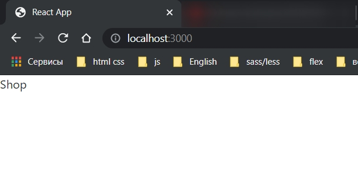
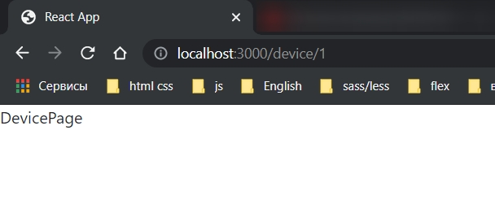
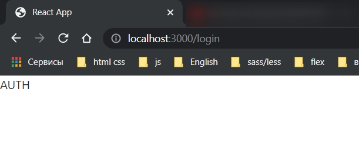
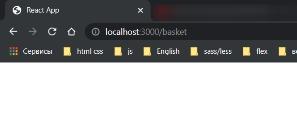
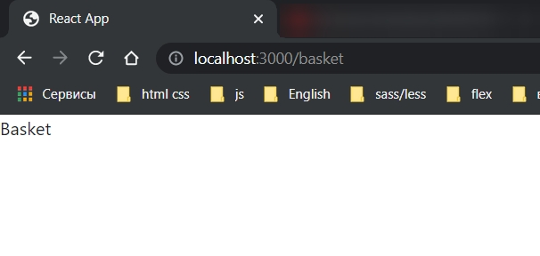

# Навигация роутинг Switch, Route, Redirect, AppRouter

В папке компонент создаем компонент и называем его **AppRouter.js**. В нем будет описана логика навигации по страницам. На какие-то страницы сможет зайти любой человек, на какие-то только авторизованый. Здесь нам понадобятся следующие компоненты

```js
import React from 'react';
import { Switch, Route, Redirect } from 'react-router-dom';

const AppRouter = () => {
  return <div></div>;
};

export default AppRouter;
```

Чуть позже о каждом поговорим.

Что бы навигиция была возможной в компоненте **App.js** Все оборачиваю в **BrowserRouter**

```js
import React from 'react';
import { BrowserRouter } from 'react-router-dom';

function App() {
  return <BrowserRouter></BrowserRouter>;
}

export default App;
```

И сюда добавляю сам компонент **AppRouter.js**

```js
import React from 'react';
import { BrowserRouter } from 'react-router-dom';
import AppRouter from './components/AppRouter';

function App() {
  return (
    <BrowserRouter>
      <AppRouter />
    </BrowserRouter>
  );
}

export default App;
```

Следующим этапом создадим файл в **src** **routes.js**. Тут будут описаны все маршруты к конкретным страницам которые есть в нашем приложении.

Здесь у нас будут два массива. Один массив я назову **authRoutes**. В нем будет список маршрутов тех траниц к которым имеет доступ авторизованный пользователь.

И второй массив **publicRoutes**. На эти маршруты может перейти абсолютно любой пользователь.

```js
// routes.js

export const authRoutes = [];

export const publicRoutes = [];
```

В каждый массив добавляем объект. У каждого объекта будет путь **path**. Это соответственно ссылка по которой та или иная страница будет отрабатывать. И Component это непосредственно сама страница.

```js
// routes.js
import Admin from './pages/Admin';

export const authRoutes = [{ path: '/admin', Component: Admin }];

export const publicRoutes = [];
```

В данном случае по пути **'/admin'** будет вызываться компонент **Admin**.

Но вот так вот указывать маршруты ввиде строки является не очень хорошей практикой. Представте у вас 20 страниц. Есть вложенные подстраницы. Будет путаница.

Для этого создадим папку **utils** и в ней файлик с константами.

```js
// utils consts.js
export const ADMIN_ROUTE = '/admin';
export const LOGIN_ROUTE = '/login';
export const REGISTRATION_ROUTE = '/registration';
export const SHOP_ROUTE = '/';
export const BASKET_ROUTE = '/basket';
export const DEVICE_ROUTE = '/device';
```

В дальнейшам мы можем эти константы экспортировать и использовать в нужных местах

```js
// routes.js
import Admin from './pages/Admin';
import { ADMIN_ROUTE } from './utils/consts';

export const authRoutes = [{ path: ADMIN_ROUTE, Component: Admin }];

export const publicRoutes = [];
```

И будет еще одна страница на которую сможет зайти авторизованный пользователь это страница с корзиной.

```js
// routes.js
import Admin from './pages/Admin';
import { ADMIN_ROUTE, BASKET_ROUTE } from './utils/consts';

export const authRoutes = [
  { path: ADMIN_ROUTE, Component: Admin },
  { path: BASKET_ROUTE, Component: Admin },
];

export const publicRoutes = [];
```

Теперь делаем роуты для публичных страниц.

```js
// routes.js
import Admin from './pages/Admin';
import {
  ADMIN_ROUTE,
  BASKET_ROUTE,
  SHOP_ROUTE,
  LOGIN_ROUTE,
  REGISTRATION_ROUTE,
  DEVICE_ROUTE,
} from './utils/consts';
import Basket from './pages/Basket';
import Shop from './pages/Shop';
import Auth from './pages/Auth';
import DevicePage from './pages/DevicePage';

// маршруты для авторизованного пользователя
export const authRoutes = [
  { path: ADMIN_ROUTE, Component: Admin },
  { path: BASKET_ROUTE, Component: Basket },
];

// маршруты для всех пользователей
export const publicRoutes = [
  { path: SHOP_ROUTE, Component: Shop },
  { path: LOGIN_ROUTE, Component: Auth },
  { path: REGISTRATION_ROUTE, Component: Auth },
  { path: DEVICE_ROUTE + '/:id', Component: DevicePage },
];
```

Для **LOGIN_ROUTE** и для **REGISTRATION_ROUTE** буду использовать один компонент **Auth**. Но в зависимости от маршрута в строке запросв буду выводить либо регистрацию, либо авторизацию.

теперь для оживления маршрутов перехожу в **AppRouter.js**. И возвращаем компонент **Switch**.

Он работает таким образом. Он сверяет все маршруты и если ни один из них не отработал то сработает самый последний в этом свиче.

```js
import React from 'react';
import { Switch, Route, Redirect } from 'react-router-dom';

const AppRouter = () => {
  return <Switch></Switch>;
};

export default AppRouter;
```

Следующим этапом создам заглушку **isAuth**. Она будет показывать авторизован ли пользователь или нет. В дальнейшем мы будем хранить это где-нибудь в **store**, отправлять **token** на сервер, убеждаться в том что он валидный, а затем эту переменную присваивать присваивать.

Пока что делаю заглушку.

Мы импортируем сюда массив с роутами который доступен только авторизованному пользователю. Пробегаюсь с помощью функции map. Сразу делаю деструктуризацию и вытаскиваю из объекта **path** и **Component**.

```js
import React from 'react';
import { Switch, Route, Redirect } from 'react-router-dom';
import { authRoutes } from '../routes';

const AppRouter = () => {
  const isAuth = false; // заглушка авторизован пользователь или нет
  return (
    <Switch>
      {authRoutes.map(({ path, Component }) => {
        <Route key={path} path={path} component={Component} exact />;
      })}
    </Switch>
  );
};

export default AppRouter;
```

напоминаю что **exact** это значит что путь должен полностью совпадать.

Но если все оставить так то эти маршруты будут доступны каждому пользователю.

Необходимо сделать проверку.

Если **isAuth === true** то этот код выполняем **&&** код. В ином случае пропускаем.

```js
import React from 'react';
import { Switch, Route, Redirect } from 'react-router-dom';
import { authRoutes, publicRoutes } from '../routes';

const AppRouter = () => {
  const isAuth = false; // заглушка авторизован пользователь или нет
  return (
    <Switch>
      {/* Авторизованный пользователь */}
      {isAuth &&
        authRoutes.map(({ path, Component }) => (
          <Route key={path} path={path} component={Component} exact />
        ))}
      {/* Если пользователь не авторизован эти маршруты все равно будут отрабатывать */}
      {publicRoutes.map(({ path, Component }) => (
        <Route key={path} path={path} component={Component} exact />
      ))}
    </Switch>
  );
};

export default AppRouter;
```







Как видим все маршруты отрабатываю. Но попробуем открыть корзину и получаем пустую страницу.



Делаю пользователя авторизованным.

```js
import React from 'react';
import { Switch, Route, Redirect } from 'react-router-dom';
import { authRoutes, publicRoutes } from '../routes';

const AppRouter = () => {
  const isAuth = true; // заглушка авторизован пользователь или нет
  return (
    <Switch>
      {/* Авторизованный пользователь */}
      {isAuth &&
        authRoutes.map(({ path, Component }) => (
          <Route key={path} path={path} component={Component} exact />
        ))}
      {/* Если пользователь не авторизован эти маршруты все равно будут отрабатывать */}
      {publicRoutes.map(({ path, Component }) => (
        <Route key={path} path={path} component={Component} exact />
      ))}
    </Switch>
  );
};

export default AppRouter;
```



Как я и сказал что если в **switch** ни один маршрут не отрабатывает, то отрабатывает самый последний. Поэтому последним добавим **Redirect** на страницу **SHOP_ROUTE**.

```js
import React from 'react';
import { Switch, Route, Redirect } from 'react-router-dom';
import { authRoutes, publicRoutes } from '../routes';
import { SHOP_ROUTE } from '../utils/consts';

const AppRouter = () => {
  const isAuth = true; // заглушка авторизован пользователь или нет
  return (
    <Switch>
      {/* Авторизованный пользователь */}
      {isAuth &&
        authRoutes.map(({ path, Component }) => (
          <Route key={path} path={path} component={Component} exact />
        ))}
      {/* Если пользователь не авторизован эти маршруты все равно будут отрабатывать */}
      {publicRoutes.map(({ path, Component }) => (
        <Route key={path} path={path} component={Component} exact />
      ))}
      <Redirect to={SHOP_ROUTE} />
    </Switch>
  );
};

export default AppRouter;
```
