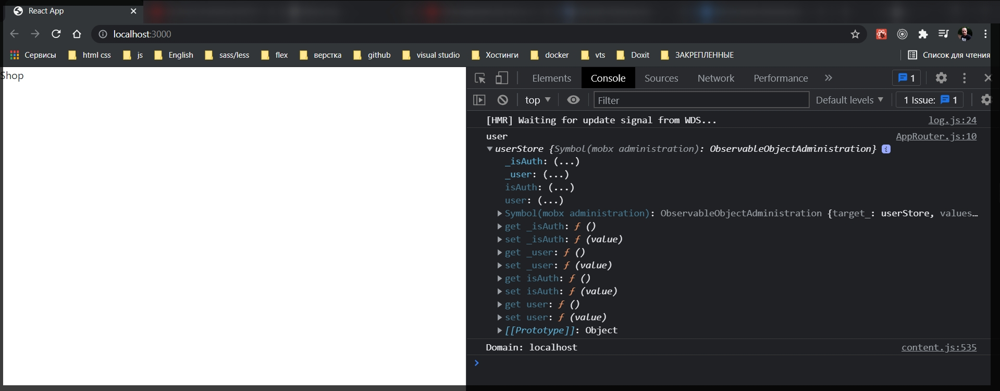
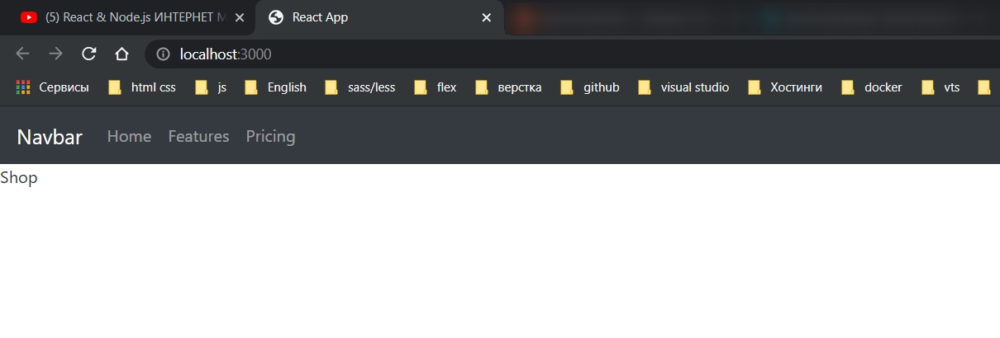
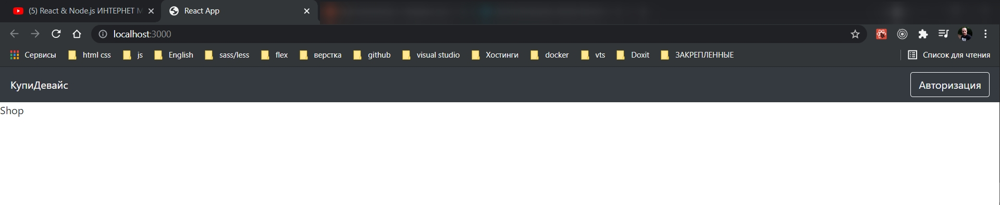
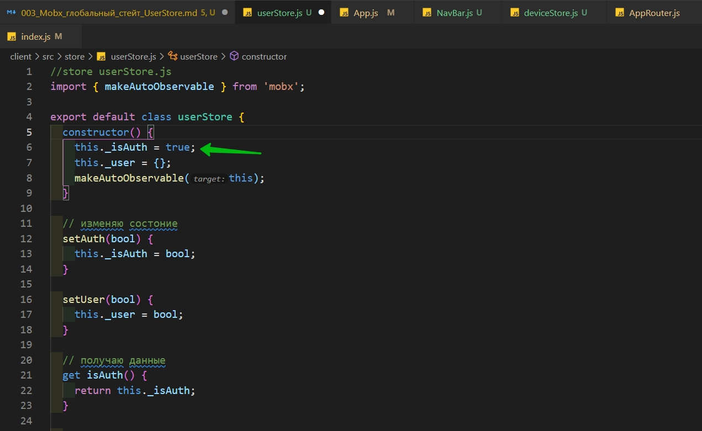
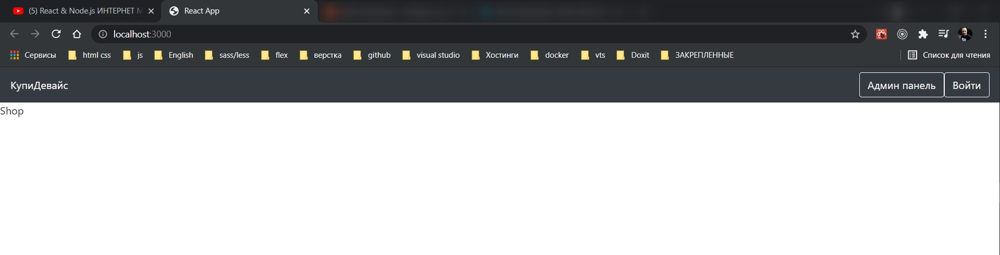

# Mobx глобальный стейт UserStore

В папке **store** создаю файл **userStore**. И по умолчанию экспортирую одноименный класс.

```js
//store userStore.js
export default class userStore {}
```

Внутри класса создаю конструктор

```js
//store userStore.js
export default class userStore {
  constructor() {}
}
```

Он будет вызываться при создании объекта данного класса. И здесь создадим несколько переменных. Это переменная **\_isAuth**. Нижнее подчеркивание мы ставим для того что бы видить то что данная переменная изменяться не может. Это не правило, это просто соглашение о том что переменные с таким названием нельзя изменять.

Указываю user как пустой объект.

И обязательно вызываю функцию **makeAutoObservable()**, которую импортирую их **mobx** и параметром в нее передаем объект **this**. После чего **mobx** будет следить за измененияями этих переменных. И соответственно при их изменении компоненты будут перерендериваться.

```js
//store userStore.js
import { makeAutoObservable } from 'mobx';

export default class userStore {
  constructor() {
    this._isAuth = false;
    this._user = {};
    makeAutoObservable(this);
  }
}
```

Теперь создадим **actions** это функции которые изменяют состояние. В данном случае функция **setAuth** принимает **bool** значение и присваивает его переменной **\_isAuth**.

```js
//store userStore.js
import { makeAutoObservable } from 'mobx';

export default class userStore {
  constructor() {
    this._isAuth = false;
    this._user = {};
    makeAutoObservable(this);
  }

  setAuth(bool) {
    this._isAuth = bool;
  }

  setUser(bool) {
    this._user = bool;
  }
}
```

Следующим этапом создадим одноименные геттеры. Они нужны для того что бы получать какие-то переменные из нашего состояния. Но называем их уже без нижнего подчеркивания. К ним мы будем обращаться как к обычным объектам. Это так называемые **computed**(вычисление) функции. Они вызываются только в том случае если переменная которая используется внутри была изменена. Своего рода оптимизация.

```js
//store userStore.js
import { makeAutoObservable } from 'mobx';

export default class userStore {
  constructor() {
    this._isAuth = false;
    this._user = {};
    makeAutoObservable(this);
  }

  // изменяю состоние
  setAuth(bool) {
    this._isAuth = bool;
  }

  setUser(bool) {
    this._user = bool;
  }

  // получаю данные
  get isAuth() {
    return this._isAuth;
  }

  get user() {
    return this._user;
  }
}
```

Теперь разберемся с тем как это состояние прокидывать в наши компоненты.

В **index.js** воспользуется контекстом реакта. Он создается с помощью функии **createContext()**. Параметром передаю **null**. И далее у этого контекста есть компонент **Provider**. В него оборачиваем наше приложение

```js
import React, { createContext } from 'react';
import ReactDOM from 'react-dom';
import './index.css';
import App from './App';

 export tconst Context = createContext(null);

ReactDOM.render(
  <Context.Provider>
    <App />
  </Context.Provider>,
  document.getElementById('root')
);
```

И в **props** **value** теперь можно передавать какие-то данные.

В нашем случае передадим туда объект. И в поле user создадим новый объект класса **new** **UserStore** который мы сделали.

```js
import React, { createContext } from 'react';
import ReactDOM from 'react-dom';
import './index.css';
import App from './App';
import userStore from './store/userStore';

export const Context = createContext(null);

ReactDOM.render(
  <Context.Provider value={{ user: new userStore() }}>
    <App />
  </Context.Provider>,
  document.getElementById('root')
);
```

Теперь откроем **AppRouter.js** и попробуем переменную **isAuth** из этого стора получить. Однако сначало с помощью **useContext** указываю с каким контекстом я буду взаимодействовать и вытащу от туда **user**. И теперь переменную **isAuth** я получаю из **user** стора.

```js
import React, { useContext } from 'react';
import { Switch, Route, Redirect } from 'react-router-dom';
import { Context } from '../index';
import { authRoutes, publicRoutes } from '../routes';
import { SHOP_ROUTE } from '../utils/consts';

const AppRouter = () => {
  const { user } = useContext(Context);

  console.log('user', user);

  return (
    <Switch>
      {/* Авторизованный пользователь */}
      {user.isAuth &&
        authRoutes.map(({ path, Component }) => (
          <Route key={path} path={path} component={Component} exact />
        ))}
      {/* Если пользователь не авторизован эти маршруты все равно будут отрабатывать */}
      {publicRoutes.map(({ path, Component }) => (
        <Route key={path} path={path} component={Component} exact />
      ))}
      <Redirect to={SHOP_ROUTE} />
    </Switch>
  );
};

export default AppRouter;
```



Таким образом у меня теперь есть глобальное хранилище и в любом месте приложения мы можем получать из него данные.

Сразу создадим второй **store**. Назовем его **deviceStore**.

```js
// store deviceStore.js

import { makeAutoObservable } from 'mobx';

export default class deviceStore {
  constructor() {
    this._types = [
      { id: 1, name: 'Холодильники' },
      { id: 2, name: 'Смартфоны' },
    ];
    this._brands = [
      { id: 1, name: 'Samsung' },
      { id: 2, name: 'Apple' },
    ];
    this._devices = [
      {
        id: 1,
        name: 'Iphone 12 pro',
        price: 2500,
        rating: 5,
        img: 'https://static.21vek.by/img/galleries/6240/333/iphone12pro128gbmgmn3_apple_5f9bdbcc46c7c.jpeg',
      },
      {
        id: 2,
        name: 'Iphone 12 pro',
        price: 2500,
        rating: 5,
        img: 'https://static.21vek.by/img/galleries/6240/333/iphone12pro128gbmgmn3_apple_5f9bdbcc46c7c.jpeg',
      },
      {
        id: 3,
        name: 'Iphone 12 pro',
        price: 2500,
        rating: 5,
        img: 'https://static.21vek.by/img/galleries/6240/333/iphone12pro128gbmgmn3_apple_5f9bdbcc46c7c.jpeg',
      },
      {
        id: 4,
        name: 'Iphone 12 pro',
        price: 2500,
        rating: 5,
        img: 'https://static.21vek.by/img/galleries/6240/333/iphone12pro128gbmgmn3_apple_5f9bdbcc46c7c.jpeg',
      },
      {
        id: 5,
        name: 'Iphone 12 pro',
        price: 2500,
        rating: 5,
        img: 'https://static.21vek.by/img/galleries/6240/333/iphone12pro128gbmgmn3_apple_5f9bdbcc46c7c.jpeg',
      },
    ];
    makeAutoObservable(this);
  }
}
```

Для того что бы все сработало нужно будет на бэке это все добавить. Пока делаю такие заглушки. Позже это все будет через запросы к серверу.

Далее по известной схеме создаю **actions**.

```js
// store deviceStore.js

import { makeAutoObservable } from 'mobx';

export default class deviceStore {
  constructor() {
    this._types = [
      { id: 1, name: 'Холодильники' },
      { id: 2, name: 'Смартфоны' },
    ];
    this._brands = [
      { id: 1, name: 'Samsung' },
      { id: 2, name: 'Apple' },
    ];
    this._devices = [
      {
        id: 1,
        name: 'Iphone 12 pro',
        price: 2500,
        rating: 5,
        img: 'https://static.21vek.by/img/galleries/6240/333/iphone12pro128gbmgmn3_apple_5f9bdbcc46c7c.jpeg',
      },
      {
        id: 2,
        name: 'Iphone 12 pro',
        price: 2500,
        rating: 5,
        img: 'https://static.21vek.by/img/galleries/6240/333/iphone12pro128gbmgmn3_apple_5f9bdbcc46c7c.jpeg',
      },
      {
        id: 3,
        name: 'Iphone 12 pro',
        price: 2500,
        rating: 5,
        img: 'https://static.21vek.by/img/galleries/6240/333/iphone12pro128gbmgmn3_apple_5f9bdbcc46c7c.jpeg',
      },
      {
        id: 4,
        name: 'Iphone 12 pro',
        price: 2500,
        rating: 5,
        img: 'https://static.21vek.by/img/galleries/6240/333/iphone12pro128gbmgmn3_apple_5f9bdbcc46c7c.jpeg',
      },
      {
        id: 5,
        name: 'Iphone 12 pro',
        price: 2500,
        rating: 5,
        img: 'https://static.21vek.by/img/galleries/6240/333/iphone12pro128gbmgmn3_apple_5f9bdbcc46c7c.jpeg',
      },
    ];
    makeAutoObservable(this);
  }

  // изменяю
  setTypes(types) {
    this._types = types;
  }

  setBrands(brands) {
    this._brands = brands;
  }

  setDevices(devices) {
    this._devices = devices;
  }

  // получаю данные
  get types() {
    return this._types;
  }

  get brands() {
    return this._brands;
  }

  get devices() {
    return this._brands;
  }
}
```

Теперь вернемся в **index.js**. В value добавляю **deviceStore**.

```js
import React, { createContext } from 'react';
import ReactDOM from 'react-dom';
import './index.css';
import App from './App';
import userStore from './store/userStore';
import deviceStore from './store/deviceStore';

export const Context = createContext(null);

ReactDOM.render(
  <Context.Provider
    value={{ user: new userStore(), device: new deviceStore() }}
  >
    <App />
  </Context.Provider>,
  document.getElementById('root')
);
```

Верстка.

Начинаю с **NavBar**.

```js
import React, { useContext } from 'react';
import { Context } from '..';

const NavBar = () => {
  const { user } = useContext(Context);
  return <div></div>;
};

export default NavBar;
```

Достаю **user** из контекста. Потому что в зависимости от того зарегистрирован пользователь или нет **NavBar** будет отображаться по разному.

С документации **react-bootstrap** беру шаблон

```js
import React, { useContext } from 'react';
import { Context } from '..';
import { Navbar, Nav } from 'react-bootstrap';

const NavBar = () => {
  const { user } = useContext(Context);
  return (
    <Navbar bg="dark" variant="dark">
      <Navbar.Brand href="#home">Navbar</Navbar.Brand>
      <Nav className="mr-auto">
        <Nav.Link href="#home">Home</Nav.Link>
        <Nav.Link href="#features">Features</Nav.Link>
        <Nav.Link href="#pricing">Pricing</Nav.Link>
      </Nav>
    </Navbar>
  );
};

export default NavBar;
```

И затем в **App.js** добавляю этот компонент. Он будет отоб ражаться на каждой странице.

```js
import React from 'react';
import { BrowserRouter } from 'react-router-dom';
import AppRouter from './components/AppRouter';
import NavBar from './components/NavBar';

function App() {
  return (
    <BrowserRouter>
      <NavBar />
      <AppRouter />
    </BrowserRouter>
  );
}

export default App;
```



```js
import React, { useContext } from 'react';
import { Context } from '..';
import { Navbar, Nav, Button } from 'react-bootstrap';
import { NavLink } from 'react-router-dom';
import { SHOP_ROUTE } from '../utils/consts';

const NavBar = () => {
  const { user } = useContext(Context);
  return (
    <Navbar bg="dark" variant="dark">
      <NavLink style={{ color: 'white' }} to={SHOP_ROUTE}>
        КупиДевайс
      </NavLink>
      {user.isAuth ? (
        <Nav className="ml-auto" style={{ color: 'white' }}>
          <Button variant={'outline-light'}>Админ панель</Button>
          <Button variant={'outline-light'}>Войти</Button>
        </Nav>
      ) : (
        <Nav className="ml-auto" style={{ color: 'white' }}>
          <Button variant={'outline-light'}>Авторизация</Button>
        </Nav>
      )}
    </Navbar>
  );
};

export default NavBar;
```



Если в userStore поменяю статус пользователя





Что бы панель перерендеривалась в режиме реального времени. Что бы **mobx** мог отслеживать изменения значений состояния необходимо обернуть компонент в функцию **observer**. И по клику на кнопку меняю статус пользователя.

```js
import React, { useContext } from 'react';
import { Context } from '..';
import { Navbar, Nav, Button, Container } from 'react-bootstrap';
import { NavLink } from 'react-router-dom';
import { SHOP_ROUTE } from '../utils/consts';
import { observer } from 'mobx-react-lite';

const NavBar = observer(() => {
  const { user } = useContext(Context);
  return (
    <Navbar bg="dark" variant="dark">
      <Container>
        <NavLink style={{ color: 'white' }} to={SHOP_ROUTE}>
          КупиДевайс
        </NavLink>
        {user.isAuth ? (
          <Nav className="ml-auto" style={{ color: 'white' }}>
            <Button variant={'outline-light'}>Админ панель</Button>
            <Button variant={'outline-light'} className="ml-4">
              Войти
            </Button>
          </Nav>
        ) : (
          <Nav className="ml-auto" style={{ color: 'white' }}>
            <Button
              variant={'outline-light'}
              onClick={() => user.setAuth(true)}
            >
              Авторизация
            </Button>
          </Nav>
        )}
      </Container>
    </Navbar>
  );
});

export default NavBar;
```
