# Cтраница администратора модальные окна

Что бы переходить на админ панель нам необходимо оживить кнопку. Переходим в **NavBar**. Импортирую **useHistory**.

```js
import React, { useContext } from 'react';
import { Context } from '..';
import { Navbar, Nav, Button, Container } from 'react-bootstrap';
import { NavLink } from 'react-router-dom';
import { ADMIN_ROUTE, LOGIN_ROUTE, SHOP_ROUTE } from '../utils/consts';
import { observer } from 'mobx-react-lite';
import { useHistory } from 'react-router-dom';

const NavBar = observer(() => {
  const { user } = useContext(Context);
  const history = useHistory();
  return (
    <Navbar bg="dark" variant="dark">
      <Container>
        <NavLink style={{ color: 'white' }} to={SHOP_ROUTE}>
          КупиДевайс
        </NavLink>
        {user.isAuth ? (
          <Nav className="ml-auto" style={{ color: 'white' }}>
            <Button
              variant={'outline-light'}
              onClick={() => history.push(ADMIN_ROUTE)}
            >
              Админ панель
            </Button>
            <Button
              variant={'outline-light'}
              onClick={() => history.push(LOGIN_ROUTE)}
              className="ml-4"
            >
              Выйти
            </Button>
          </Nav>
        ) : (
          <Nav className="ml-auto" style={{ color: 'white' }}>
            <Button
              variant={'outline-light'}
              onClick={() => user.setAuth(true)}
            >
              Авторизация
            </Button>
          </Nav>
        )}
      </Container>
    </Navbar>
  );
});

export default NavBar;
```

Приступаю к заключительной странице, странице Админ панели.

Оборачиваю все в **Container** и добавляю несколько кнопок.

```js
// pages Admin.js
import React from 'react';
import { Button, Container } from 'react-bootstrap';

const Admin = () => {
  return (
    <Container className="d-flex flex-column">
      <Button>Добавить тип</Button>
      <Button>Добавить брэнд</Button>
      <Button>Добавить устройство</Button>
    </Container>
  );
};

export default Admin;
```

Для того что бы проверить роутинг делаю админа авторизованным

```js
//store userStore.js
import { makeAutoObservable } from 'mobx';

export default class UserStore {
  constructor() {
    this._isAuth = true;
    this._user = {};
    makeAutoObservable(this);
  }

  // изменяю состоние
  setAuth(bool) {
    this._isAuth = bool;
  }

  setUser(bool) {
    this._user = bool;
  }

  // получаю данные
  get isAuth() {
    return this._isAuth;
  }

  get user() {
    return this._user;
  }
}
```

И после пробую переходить на админ панель.

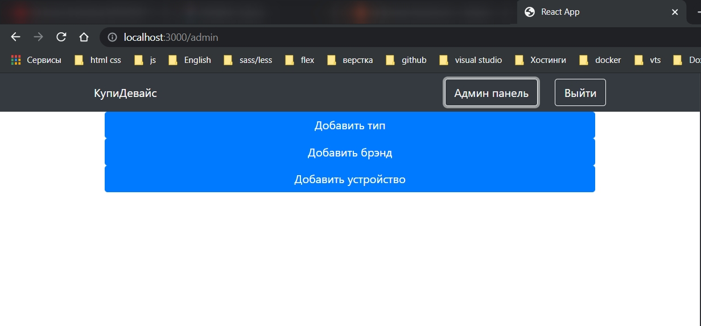

```js
// pages Admin.js
import React from 'react';
import { Button, Container } from 'react-bootstrap';

const Admin = () => {
  return (
    <Container className="d-flex flex-column">
      <Button variant={'outline-dark'} className="mt-2 p-2">
        Добавить тип
      </Button>
      <Button variant={'outline-dark'} className="mt-2 p-2">
        Добавить брэнд
      </Button>
      <Button variant={'outline-dark'} className="mt-2 p-2">
        Добавить устройство
      </Button>
    </Container>
  );
};

export default Admin;
```

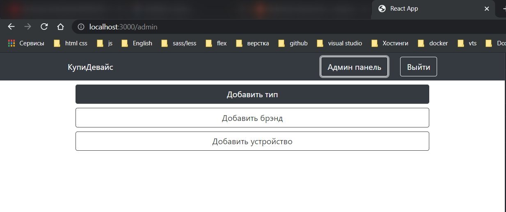

При нажатии на каждую кнопку будет всплывать модальное окно в котором будут всякие input-ты.

Нахожу в **bootstrap** компонент **modal**.

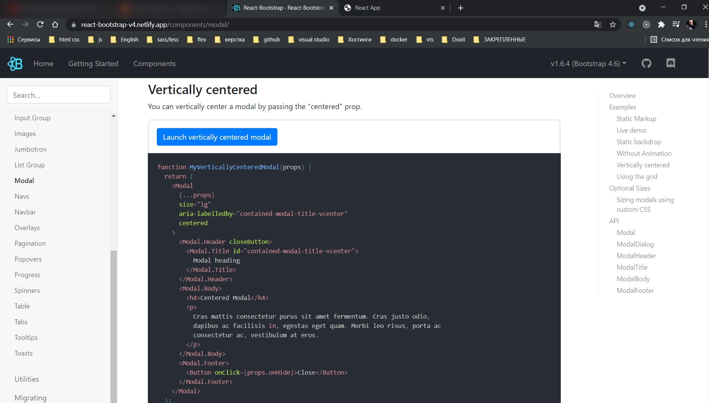

Копирую начинку.

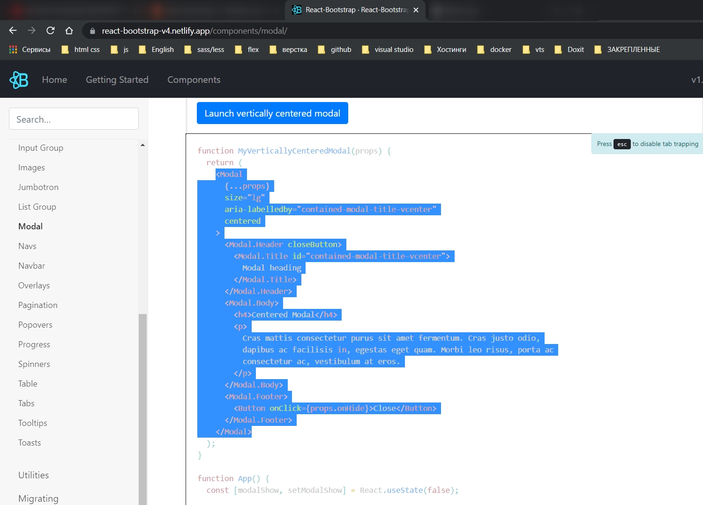

В папке **components** создаю папку **modals**. У нас будет три модальных окна. Под тип, под брэнд и под девайс. И Создаю три кмпонента **CreateBrand.js**, **CreateType.js**, **CreateDevice.js**.

Начну с **CreateType.js**.

```js
// components modal CreateType.js
import React from 'react';
import { Modal, Button } from 'react-bootstrap';

const CreateType = ({ show, onHide }) => {
  return (
    <Modal size="lg" aria-labelledby="contained-modal-title-vcenter" centered>
      <Modal.Header closeButton>
        <Modal.Title id="contained-modal-title-vcenter">
          Добавить новый тип
        </Modal.Title>
      </Modal.Header>
      <Modal.Body></Modal.Body>
      <Modal.Footer>
        <Button onClick={onHide}>Close</Button>
      </Modal.Footer>
    </Modal>
  );
};

export default CreateType;
```

Сюда передаю два реквизита

- **show** - компонент виден
- **onHide** - компонент скрыт

В само модальное окно прокидываем пропс **show={show}**, **onHide={onHide}**

```js
// components modal CreateType.js
import React from 'react';
import { Modal, Button } from 'react-bootstrap';

const CreateType = ({ show, onHide }) => {
  return (
    <Modal show={show} onHide={onHide} size="lg" centered>
      <Modal.Header closeButton>
        <Modal.Title id="contained-modal-title-vcenter">
          Добавить новый тип
        </Modal.Title>
      </Modal.Header>
      <Modal.Body></Modal.Body>
      <Modal.Footer>
        <Button onClick={onHide}>Close</Button>
      </Modal.Footer>
    </Modal>
  );
};

export default CreateType;
```

В нутри тела модального окна добавляю форму

```js
// components modal CreateType.js
import React from 'react';
import { Modal, Button, Form } from 'react-bootstrap';

const CreateType = ({ show, onHide }) => {
  return (
    <Modal show={show} onHide={onHide} size="lg" centered>
      <Modal.Header closeButton>
        <Modal.Title id="contained-modal-title-vcenter">
          Добавить новый тип
        </Modal.Title>
      </Modal.Header>
      <Modal.Body>
        <Form>
          <Form.Control placeholder={'Введите название типа'} />
        </Form>
      </Modal.Body>
      <Modal.Footer>
        <Button variant={'outline-danger'} onClick={onHide}>
          Закрыть
        </Button>
        <Button variant={'outline-success'}>Добавить</Button>
      </Modal.Footer>
    </Modal>
  );
};

export default CreateType;
```

Теперь откроем страницу админки и сюда три созданных модальных окна добавляем.

```js
// pages Admin.js
import React from 'react';
import { Button, Container } from 'react-bootstrap';
import CreateBrand from '../components/modals/CreateBrand';
import CreateDevice from '../components/modals/CreateDevice';

const Admin = () => {
  return (
    <Container className="d-flex flex-column">
      <Button variant={'outline-dark'} className="mt-2 p-2">
        Добавить тип
      </Button>
      <Button variant={'outline-dark'} className="mt-2 p-2">
        Добавить брэнд
      </Button>
      <Button variant={'outline-dark'} className="mt-2 p-2">
        Добавить устройство
      </Button>
      <CreateBrand />
      <CreateDevice />
      <CreateType />
    </Container>
  );
};

export default Admin;
```

Эти компоненты ппринимают два пропса. Попробуем сделать **show={true}**

```js
// pages Admin.js
import React from 'react';
import { Button, Container } from 'react-bootstrap';
import CreateBrand from '../components/modals/CreateBrand';
import CreateDevice from '../components/modals/CreateDevice';
import CreateType from '../components/modals/CreateType';

const Admin = () => {
  return (
    <Container className="d-flex flex-column">
      <Button variant={'outline-dark'} className="mt-2 p-2">
        Добавить тип
      </Button>
      <Button variant={'outline-dark'} className="mt-2 p-2">
        Добавить брэнд
      </Button>
      <Button variant={'outline-dark'} className="mt-2 p-2">
        Добавить устройство
      </Button>
      <CreateBrand />
      <CreateDevice />
      <CreateType show={true} />
    </Container>
  );
};

export default Admin;
```

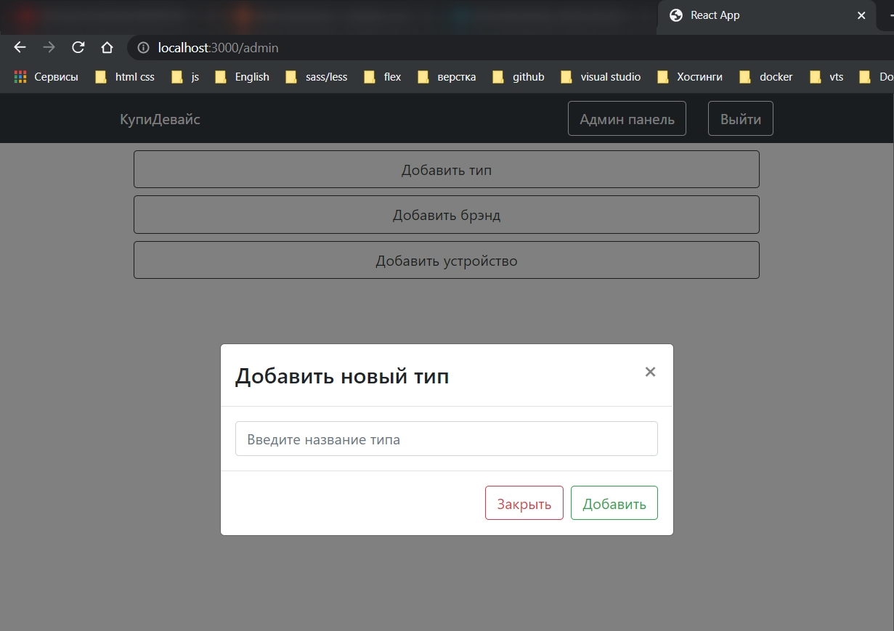

И при переходе на админ панель сразу видим вот такое модальное окно.

```js
// components modal CreateBrand
import React from 'react';
import { Modal, Button, Form } from 'react-bootstrap';

const CreateBrand = ({ show, onHide }) => {
  return (
    <Modal show={show} onHide={onHide} size="lg" centered>
      <Modal.Header closeButton>
        <Modal.Title id="contained-modal-title-vcenter">
          Добавить новый брэнд
        </Modal.Title>
      </Modal.Header>
      <Modal.Body>
        <Form>
          <Form.Control placeholder={'Введите название бренда'} />
        </Form>
      </Modal.Body>
      <Modal.Footer>
        <Button variant={'outline-danger'} onClick={onHide}>
          Закрыть
        </Button>
        <Button variant={'outline-success'}>Добавить</Button>
      </Modal.Footer>
    </Modal>
  );
};

export default CreateBrand;
```

```js
// components modal CreateDevice
import React from 'react';
import { Modal, Form, Button } from 'react-bootstrap';

const CreateDevice = ({ show, onHide }) => {
  return (
    <Modal show={show} onHide={onHide} size="lg" centered>
      <Modal.Header closeButton>
        <Modal.Title id="contained-modal-title-vcenter">
          Добавить новый девайс
        </Modal.Title>
      </Modal.Header>
      <Modal.Body>
        <Form>
          <Form.Control placeholder={'Введите название девайс'} />
        </Form>
      </Modal.Body>
      <Modal.Footer>
        <Button variant={'outline-danger'} onClick={onHide}>
          Закрыть
        </Button>
        <Button variant={'outline-success'}>Добавить</Button>
      </Modal.Footer>
    </Modal>
  );
};

export default CreateDevice;
```

CreateDevice будет значительно отличаться.

Далее открываем страницу админки и здесь создадим три состояния. Они будут отвечать за то видим мы модальное окно или нет.

```js
// pages Admin.js
import React, { useState } from 'react';
import { Button, Container } from 'react-bootstrap';
import CreateBrand from '../components/modals/CreateBrand';
import CreateDevice from '../components/modals/CreateDevice';
import CreateType from '../components/modals/CreateType';

const Admin = () => {
  const [brandVisible, setBrandVisible] = useState(false);
  const [typeVisible, setTypeVisible] = useState(false);
  const [deviceVisible, setDeviceVisible] = useState(false);
  return (
    <Container className="d-flex flex-column">
      <Button variant={'outline-dark'} className="mt-2 p-2">
        Добавить тип
      </Button>
      <Button variant={'outline-dark'} className="mt-2 p-2">
        Добавить брэнд
      </Button>
      <Button variant={'outline-dark'} className="mt-2 p-2">
        Добавить устройство
      </Button>
      <CreateBrand />
      <CreateDevice />
      <CreateType show={true} />
    </Container>
  );
};

export default Admin;
```

теперь это состояние мы можем передавать как **props show**

```js
// pages Admin.js
import React, { useState } from 'react';
import { Button, Container } from 'react-bootstrap';
import CreateBrand from '../components/modals/CreateBrand';
import CreateDevice from '../components/modals/CreateDevice';
import CreateType from '../components/modals/CreateType';

const Admin = () => {
  const [brandVisible, setBrandVisible] = useState(false);
  const [typeVisible, setTypeVisible] = useState(false);
  const [deviceVisible, setDeviceVisible] = useState(false);
  return (
    <Container className="d-flex flex-column">
      <Button variant={'outline-dark'} className="mt-2 p-2">
        Добавить тип
      </Button>
      <Button variant={'outline-dark'} className="mt-2 p-2">
        Добавить брэнд
      </Button>
      <Button variant={'outline-dark'} className="mt-2 p-2">
        Добавить устройство
      </Button>
      <CreateBrand show={brandVisible} onHide={() => setBrandVisible(false)} />
      <CreateDevice
        show={deviceVisible}
        onHide={() => setDeviceVisible(false)}
      />
      <CreateType show={typeVisible} onHide={() => setTypeVisible(false)} />
    </Container>
  );
};

export default Admin;
```

И остается повесить на кнопки слушатель события нажатия что бы при нажатии на соответствующую кнопку у нас открывалось соответствующее модальное окно. В функции **set** передаем **true**.

```js
// pages Admin.js
import React, { useState } from 'react';
import { Button, Container } from 'react-bootstrap';
import CreateBrand from '../components/modals/CreateBrand';
import CreateDevice from '../components/modals/CreateDevice';
import CreateType from '../components/modals/CreateType';

const Admin = () => {
  const [brandVisible, setBrandVisible] = useState(false);
  const [typeVisible, setTypeVisible] = useState(false);
  const [deviceVisible, setDeviceVisible] = useState(false);
  return (
    <Container className="d-flex flex-column">
      <Button
        variant={'outline-dark'}
        className="mt-2 p-2"
        onClick={() => setTypeVisible(true)}
      >
        Добавить тип
      </Button>
      <Button
        variant={'outline-dark'}
        className="mt-2 p-2"
        onClick={() => setBrandVisible(true)}
      >
        Добавить брэнд
      </Button>
      <Button
        variant={'outline-dark'}
        className="mt-2 p-2"
        onClick={() => setDeviceVisible(true)}
      >
        Добавить устройство
      </Button>
      <CreateBrand show={brandVisible} onHide={() => setBrandVisible(false)} />
      <CreateDevice
        show={deviceVisible}
        onHide={() => setDeviceVisible(false)}
      />
      <CreateType show={typeVisible} onHide={() => setTypeVisible(false)} />
    </Container>
  );
};

export default Admin;
```

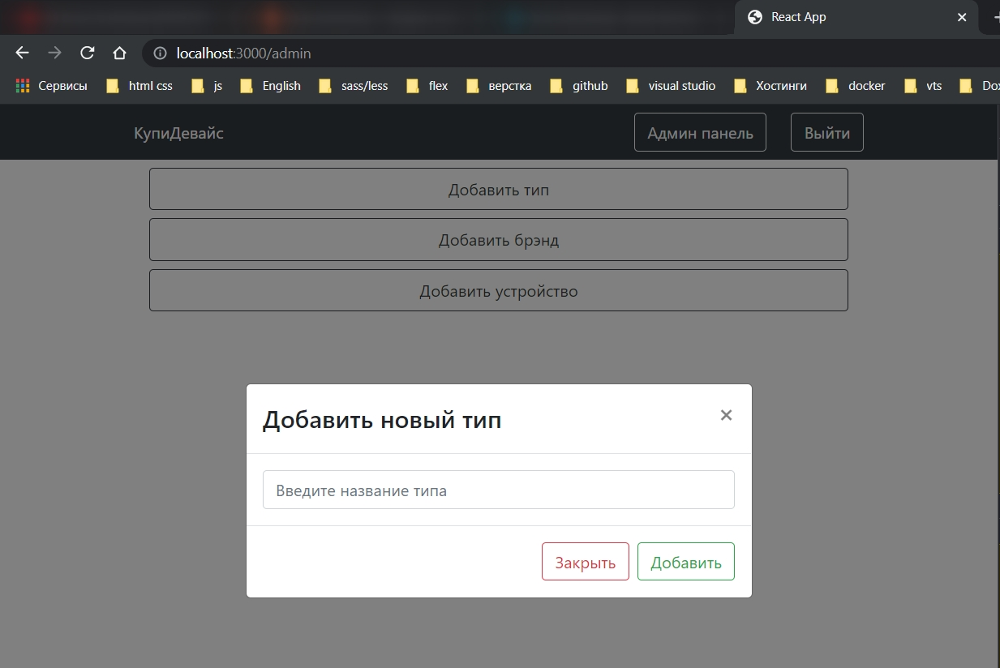

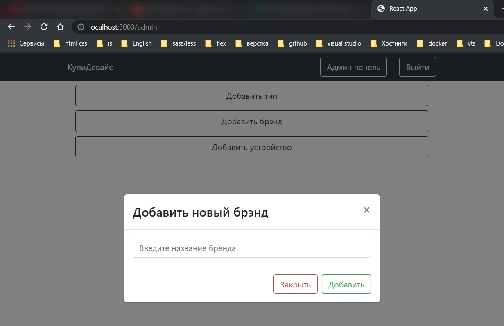

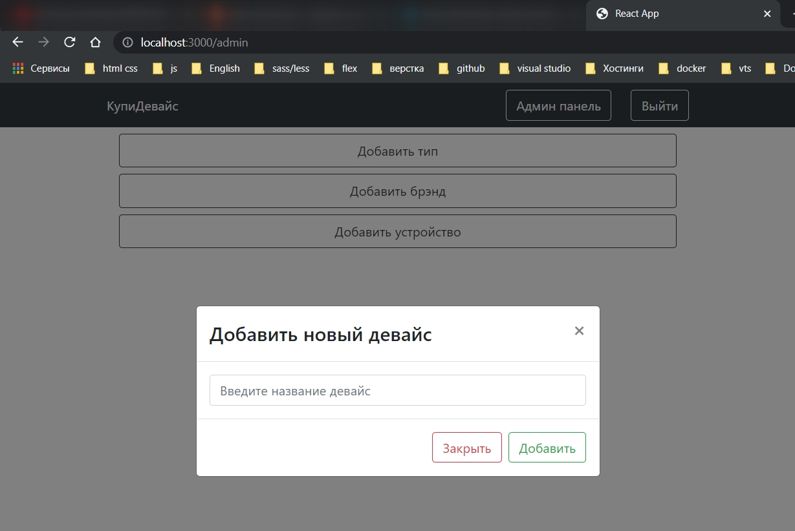

Остается закончить модальное окно с **device**.

Здесь нам понадобится **device** **store**. Получаем его с помощью хука **useContext**.

```js
// components modal CreateDevice
import React, { useContext } from 'react';
import { Modal, Form, Button } from 'react-bootstrap';
import { Context } from '../../index.js';

const CreateDevice = ({ show, onHide }) => {
  const { device } = useContext(Context);
  return (
    <Modal show={show} onHide={onHide} size="lg" centered>
      <Modal.Header closeButton>
        <Modal.Title id="contained-modal-title-vcenter">
          Добавить новый девайс
        </Modal.Title>
      </Modal.Header>
      <Modal.Body>
        <Form>
          <Form.Control placeholder={'Введите название девайс'} />
        </Form>
      </Modal.Body>
      <Modal.Footer>
        <Button variant={'outline-danger'} onClick={onHide}>
          Закрыть
        </Button>
        <Button variant={'outline-success'}>Добавить</Button>
      </Modal.Footer>
    </Modal>
  );
};

export default CreateDevice;
```

Вместо input добавляю компонент **Dropdown** - это выпадающее меню. С помощью него будем выбирать тип и брэнд для нового устройства.

```js
// components modal CreateDevice
import React, { useContext } from 'react';
import { Modal, Form, Button, Dropdown } from 'react-bootstrap';
import { Context } from '../../index.js';

const CreateDevice = ({ show, onHide }) => {
  const { device } = useContext(Context);
  return (
    <Modal show={show} onHide={onHide} size="lg" centered>
      <Modal.Header closeButton>
        <Modal.Title id="contained-modal-title-vcenter">
          Добавить новый девайс
        </Modal.Title>
      </Modal.Header>
      <Modal.Body>
        <Form>
          <Dropdown>
            <Dropdown.Toggle>Выберите тип</Dropdown.Toggle>
            <Dropdown.Menu>
              {device.types.map((type) => (
                <Dropdown.Item key={type.id}>{type.name}</Dropdown.Item>
              ))}
            </Dropdown.Menu>
          </Dropdown>
        </Form>
      </Modal.Body>
      <Modal.Footer>
        <Button variant={'outline-danger'} onClick={onHide}>
          Закрыть
        </Button>
        <Button variant={'outline-success'}>Добавить</Button>
      </Modal.Footer>
    </Modal>
  );
};

export default CreateDevice;
```

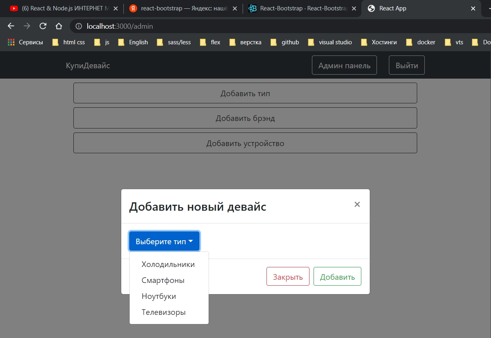

```js
// components modal CreateDevice
import React, { useContext } from 'react';
import { Modal, Form, Button, Dropdown } from 'react-bootstrap';
import { Context } from '../../index.js';

const CreateDevice = ({ show, onHide }) => {
  const { device } = useContext(Context);
  return (
    <Modal show={show} onHide={onHide} size="lg" centered>
      <Modal.Header closeButton>
        <Modal.Title id="contained-modal-title-vcenter">
          Добавить новый девайс
        </Modal.Title>
      </Modal.Header>
      <Modal.Body>
        <Form>
          <Dropdown className="mt-2 mb-2">
            <Dropdown.Toggle>Выберите тип</Dropdown.Toggle>
            <Dropdown.Menu>
              {device.types.map((type) => (
                <Dropdown.Item key={type.id}>{type.name}</Dropdown.Item>
              ))}
            </Dropdown.Menu>
          </Dropdown>
          <Dropdown className="mt-2 mb-2">
            <Dropdown.Toggle>Выберите брэнд</Dropdown.Toggle>
            <Dropdown.Menu>
              {device.brands.map((brand) => (
                <Dropdown.Item key={brand.id}>{brand.name}</Dropdown.Item>
              ))}
            </Dropdown.Menu>
          </Dropdown>
        </Form>
      </Modal.Body>
      <Modal.Footer>
        <Button variant={'outline-danger'} onClick={onHide}>
          Закрыть
        </Button>
        <Button variant={'outline-success'}>Добавить</Button>
      </Modal.Footer>
    </Modal>
  );
};

export default CreateDevice;
```

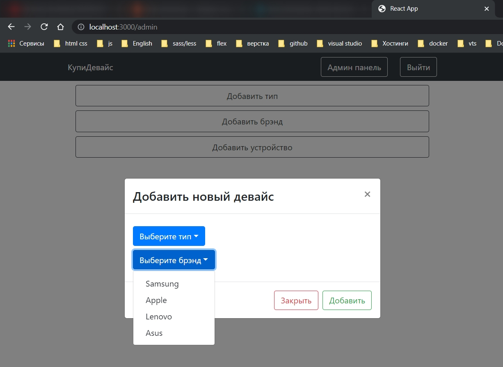

Под выпадающими списками добавим один **input**. Это будет **input** для названия устройства.

```js
// components modal CreateDevice
import React, { useContext } from 'react';
import { Modal, Form, Button, Dropdown } from 'react-bootstrap';
import { Context } from '../../index.js';

const CreateDevice = ({ show, onHide }) => {
  const { device } = useContext(Context);
  return (
    <Modal show={show} onHide={onHide} size="lg" centered>
      <Modal.Header closeButton>
        <Modal.Title id="contained-modal-title-vcenter">
          Добавить новый девайс
        </Modal.Title>
      </Modal.Header>
      <Modal.Body>
        <Form>
          <Dropdown className="mt-2 mb-2">
            <Dropdown.Toggle>Выберите тип</Dropdown.Toggle>
            <Dropdown.Menu>
              {device.types.map((type) => (
                <Dropdown.Item key={type.id}>{type.name}</Dropdown.Item>
              ))}
            </Dropdown.Menu>
          </Dropdown>
          <Dropdown className="mt-2 mb-2">
            <Dropdown.Toggle>Выберите брэнд</Dropdown.Toggle>
            <Dropdown.Menu>
              {device.brands.map((brand) => (
                <Dropdown.Item key={brand.id}>{brand.name}</Dropdown.Item>
              ))}
            </Dropdown.Menu>
          </Dropdown>
          <Form.Control
            className="mt-3"
            placeholder="Введите название устройства"
          />
          <Form.Control
            className="mt-3"
            placeholder="Введите стоимость устройства"
            type="number"
          />
          <Form.Control className="mt-3" type="file" />
          <hr />
        </Form>
      </Modal.Body>
      <Modal.Footer>
        <Button variant={'outline-danger'} onClick={onHide}>
          Закрыть
        </Button>
        <Button variant={'outline-success'}>Добавить</Button>
      </Modal.Footer>
    </Modal>
  );
};

export default CreateDevice;
```

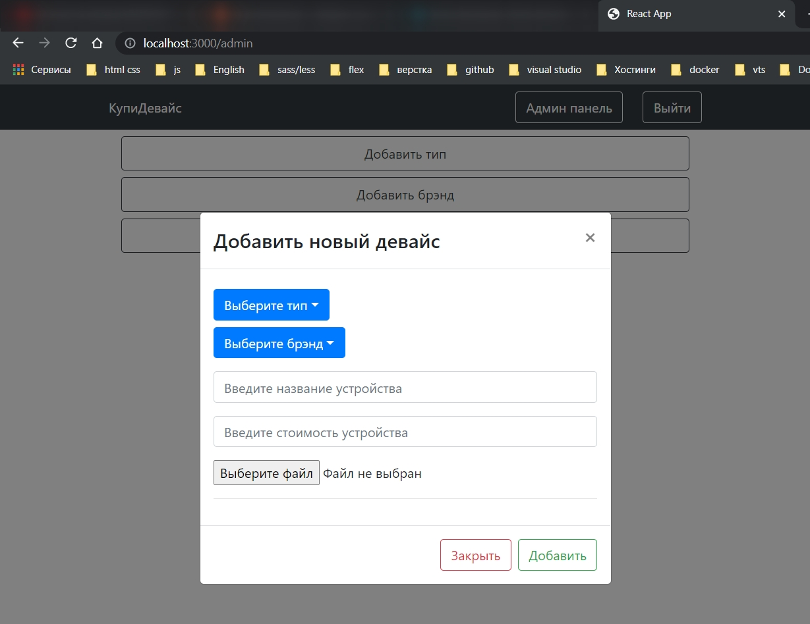

Так же для каждого устройства нужно будет добавлять массив характеристик. Сразу же сделаем для него состояние.

```js
// components modal CreateDevice
import React, { useContext, useState } from 'react';
import { Modal, Form, Button, Dropdown } from 'react-bootstrap';
import { Context } from '../../index.js';

const CreateDevice = ({ show, onHide }) => {
  const { device } = useContext(Context);
  const [info, setInfo] = useState([]);
  return (
    <Modal show={show} onHide={onHide} size="lg" centered>
      <Modal.Header closeButton>
        <Modal.Title id="contained-modal-title-vcenter">
          Добавить новый девайс
        </Modal.Title>
      </Modal.Header>
      <Modal.Body>
        <Form>
          <Dropdown className="mt-2 mb-2">
            <Dropdown.Toggle>Выберите тип</Dropdown.Toggle>
            <Dropdown.Menu>
              {device.types.map((type) => (
                <Dropdown.Item key={type.id}>{type.name}</Dropdown.Item>
              ))}
            </Dropdown.Menu>
          </Dropdown>
          <Dropdown className="mt-2 mb-2">
            <Dropdown.Toggle>Выберите брэнд</Dropdown.Toggle>
            <Dropdown.Menu>
              {device.brands.map((brand) => (
                <Dropdown.Item key={brand.id}>{brand.name}</Dropdown.Item>
              ))}
            </Dropdown.Menu>
          </Dropdown>
          <Form.Control
            className="mt-3"
            placeholder="Введите название устройства"
          />
          <Form.Control
            className="mt-3"
            placeholder="Введите стоимость устройства"
            type="number"
          />
          <Form.Control className="mt-3" type="file" />
          <hr />
        </Form>
      </Modal.Body>
      <Modal.Footer>
        <Button variant={'outline-danger'} onClick={onHide}>
          Закрыть
        </Button>
        <Button variant={'outline-success'}>Добавить</Button>
      </Modal.Footer>
    </Modal>
  );
};

export default CreateDevice;
```

Под разделительной чертой Добавим кнопку "**Добавить новое свойство**"

```js
// components modal CreateDevice
import React, { useContext, useState } from 'react';
import { Modal, Form, Button, Dropdown } from 'react-bootstrap';
import { Context } from '../../index.js';

const CreateDevice = ({ show, onHide }) => {
  const { device } = useContext(Context);
  const [info, setInfo] = useState([]);
  return (
    <Modal show={show} onHide={onHide} size="lg" centered>
      <Modal.Header closeButton>
        <Modal.Title id="contained-modal-title-vcenter">
          Добавить новый девайс
        </Modal.Title>
      </Modal.Header>
      <Modal.Body>
        <Form>
          <Dropdown className="mt-2 mb-2">
            <Dropdown.Toggle>Выберите тип</Dropdown.Toggle>
            <Dropdown.Menu>
              {device.types.map((type) => (
                <Dropdown.Item key={type.id}>{type.name}</Dropdown.Item>
              ))}
            </Dropdown.Menu>
          </Dropdown>
          <Dropdown className="mt-2 mb-2">
            <Dropdown.Toggle>Выберите брэнд</Dropdown.Toggle>
            <Dropdown.Menu>
              {device.brands.map((brand) => (
                <Dropdown.Item key={brand.id}>{brand.name}</Dropdown.Item>
              ))}
            </Dropdown.Menu>
          </Dropdown>
          <Form.Control
            className="mt-3"
            placeholder="Введите название устройства"
          />
          <Form.Control
            className="mt-3"
            placeholder="Введите стоимость устройства"
            type="number"
          />
          <Form.Control className="mt-3" type="file" />
          <hr />
          <Button variant={'outline-dark'}>Добавить новое свойство</Button>
        </Form>
      </Modal.Body>
      <Modal.Footer>
        <Button variant={'outline-danger'} onClick={onHide}>
          Закрыть
        </Button>
        <Button variant={'outline-success'}>Добавить</Button>
      </Modal.Footer>
    </Modal>
  );
};

export default CreateDevice;
```

И реализуем функцию **addInfo** с помощью которой мы эти характеристики будем добавлять. В эту функцию добавляю функцию **setInfo**. В нее добавляю массив. В этот массив разворачиваю старый массив **...info**. И вторым параметром добавляю новый элемент у которого есть **title**, **description**. И для того что бы не париться с **id** добавим полу **number** которое будем получать из времени **Date.now()**.

```js
// components modal CreateDevice
import React, { useContext, useState } from 'react';
import { Modal, Form, Button, Dropdown } from 'react-bootstrap';
import { Context } from '../../index.js';

const CreateDevice = ({ show, onHide }) => {
  const { device } = useContext(Context);
  const [info, setInfo] = useState([]);

  const addInfo = () => {
    setInfo([...info, { title: '', description: '', number: Date.now() }]);
  };

  return (
    <Modal show={show} onHide={onHide} size="lg" centered>
      <Modal.Header closeButton>
        <Modal.Title id="contained-modal-title-vcenter">
          Добавить новый девайс
        </Modal.Title>
      </Modal.Header>
      <Modal.Body>
        <Form>
          <Dropdown className="mt-2 mb-2">
            <Dropdown.Toggle>Выберите тип</Dropdown.Toggle>
            <Dropdown.Menu>
              {device.types.map((type) => (
                <Dropdown.Item key={type.id}>{type.name}</Dropdown.Item>
              ))}
            </Dropdown.Menu>
          </Dropdown>
          <Dropdown className="mt-2 mb-2">
            <Dropdown.Toggle>Выберите брэнд</Dropdown.Toggle>
            <Dropdown.Menu>
              {device.brands.map((brand) => (
                <Dropdown.Item key={brand.id}>{brand.name}</Dropdown.Item>
              ))}
            </Dropdown.Menu>
          </Dropdown>
          <Form.Control
            className="mt-3"
            placeholder="Введите название устройства"
          />
          <Form.Control
            className="mt-3"
            placeholder="Введите стоимость устройства"
            type="number"
          />
          <Form.Control className="mt-3" type="file" />
          <hr />
          <Button variant={'outline-dark'} onClick={addInfo}>
            Добавить новое свойство
          </Button>
        </Form>
      </Modal.Body>
      <Modal.Footer>
        <Button variant={'outline-danger'} onClick={onHide}>
          Закрыть
        </Button>
        <Button variant={'outline-success'}>Добавить</Button>
      </Modal.Footer>
    </Modal>
  );
};

export default CreateDevice;
```

При нажатии на кнопку мы эту функцию вызываем. И под кнопкой, по этому массиву с информацией мы пробегаемся. Для каждой характеристики будет отрисовывать **Row** и внутри добавим пару колонок.

```js
// components modal CreateDevice
import React, { useContext, useState } from 'react';
import { Modal, Form, Button, Dropdown, Row, Col } from 'react-bootstrap';
import { Context } from '../../index.js';

const CreateDevice = ({ show, onHide }) => {
  const { device } = useContext(Context);
  const [info, setInfo] = useState([]);

  const addInfo = () => {
    setInfo([...info, { title: '', description: '', number: Date.now() }]);
  };

  return (
    <Modal show={show} onHide={onHide} size="lg" centered>
      <Modal.Header closeButton>
        <Modal.Title id="contained-modal-title-vcenter">
          Добавить новый девайс
        </Modal.Title>
      </Modal.Header>
      <Modal.Body>
        <Form>
          <Dropdown className="mt-2 mb-2">
            <Dropdown.Toggle>Выберите тип</Dropdown.Toggle>
            <Dropdown.Menu>
              {device.types.map((type) => (
                <Dropdown.Item key={type.id}>{type.name}</Dropdown.Item>
              ))}
            </Dropdown.Menu>
          </Dropdown>
          <Dropdown className="mt-2 mb-2">
            <Dropdown.Toggle>Выберите брэнд</Dropdown.Toggle>
            <Dropdown.Menu>
              {device.brands.map((brand) => (
                <Dropdown.Item key={brand.id}>{brand.name}</Dropdown.Item>
              ))}
            </Dropdown.Menu>
          </Dropdown>
          <Form.Control
            className="mt-3"
            placeholder="Введите название устройства"
          />
          <Form.Control
            className="mt-3"
            placeholder="Введите стоимость устройства"
            type="number"
          />
          <Form.Control className="mt-3" type="file" />
          <hr />
          <Button variant={'outline-dark'} onClick={addInfo}>
            Добавить новое свойство
          </Button>
          {info.map((i) => (
            <Row className="mt-3" key={i.number}>
              <Col md={4}>
                <Form.Control placeholder="Введите название" />
              </Col>
              <Col md={4}>
                <Form.Control placeholder="Введите описание" />
              </Col>
              <Col md={4}>
                <Button variant={'outline-danger'}>Удалить</Button>
              </Col>
            </Row>
          ))}
        </Form>
      </Modal.Body>
      <Modal.Footer>
        <Button variant={'outline-danger'} onClick={onHide}>
          Закрыть
        </Button>
        <Button variant={'outline-success'}>Добавить</Button>
      </Modal.Footer>
    </Modal>
  );
};

export default CreateDevice;
```


И сразу же реализую функцию которая характеристику будет удалять. Пораметром она как раз этот **number** и будет принимать. Вызываю функцию **setInfo**. Пробегаюсь по существующему массиву с помощью функции **filter** и проверяю совпадает ли номер элемента **i.number** с номером который передали параметром **number**.

И при нажатии на кнопку удалить эту функцию необходимо будет вызывать. Через **onClick** вызываю эту функцию **removeInfo** и параметром передаю в нее номер текущего элемента характеристики **i.number**.

```js
// components modal CreateDevice
import React, { useContext, useState } from 'react';
import { Modal, Form, Button, Dropdown, Row, Col } from 'react-bootstrap';
import { Context } from '../../index.js';

const CreateDevice = ({ show, onHide }) => {
  const { device } = useContext(Context);
  const [info, setInfo] = useState([]);

  const addInfo = () => {
    setInfo([...info, { title: '', description: '', number: Date.now() }]);
  };

  const removeInfo = (number) => {
    setInfo(info.filter((i) => i.number !== number));
  };

  return (
    <Modal show={show} onHide={onHide} size="lg" centered>
      <Modal.Header closeButton>
        <Modal.Title id="contained-modal-title-vcenter">
          Добавить новый девайс
        </Modal.Title>
      </Modal.Header>
      <Modal.Body>
        <Form>
          <Dropdown className="mt-2 mb-2">
            <Dropdown.Toggle>Выберите тип</Dropdown.Toggle>
            <Dropdown.Menu>
              {device.types.map((type) => (
                <Dropdown.Item key={type.id}>{type.name}</Dropdown.Item>
              ))}
            </Dropdown.Menu>
          </Dropdown>
          <Dropdown className="mt-2 mb-2">
            <Dropdown.Toggle>Выберите брэнд</Dropdown.Toggle>
            <Dropdown.Menu>
              {device.brands.map((brand) => (
                <Dropdown.Item key={brand.id}>{brand.name}</Dropdown.Item>
              ))}
            </Dropdown.Menu>
          </Dropdown>
          <Form.Control
            className="mt-3"
            placeholder="Введите название устройства"
          />
          <Form.Control
            className="mt-3"
            placeholder="Введите стоимость устройства"
            type="number"
          />
          <Form.Control className="mt-3" type="file" />
          <hr />
          <Button variant={'outline-dark'} onClick={addInfo}>
            Добавить новое свойство
          </Button>
          {info.map((i) => (
            <Row className="mt-3" key={i.number}>
              <Col md={4}>
                <Form.Control placeholder="Введите название" />
              </Col>
              <Col md={4}>
                <Form.Control placeholder="Введите описание" />
              </Col>
              <Col md={4}>
                <Button
                  variant={'outline-danger'}
                  onClick={() => removeInfo(i.number)}
                >
                  Удалить
                </Button>
              </Col>
            </Row>
          ))}
        </Form>
      </Modal.Body>
      <Modal.Footer>
        <Button variant={'outline-danger'} onClick={onHide}>
          Закрыть
        </Button>
        <Button variant={'outline-success'}>Добавить</Button>
      </Modal.Footer>
    </Modal>
  );
};

export default CreateDevice;
```

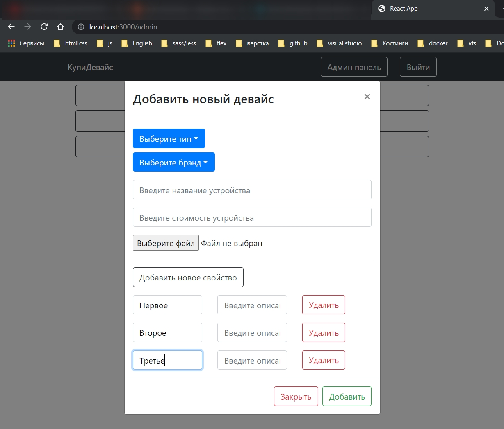

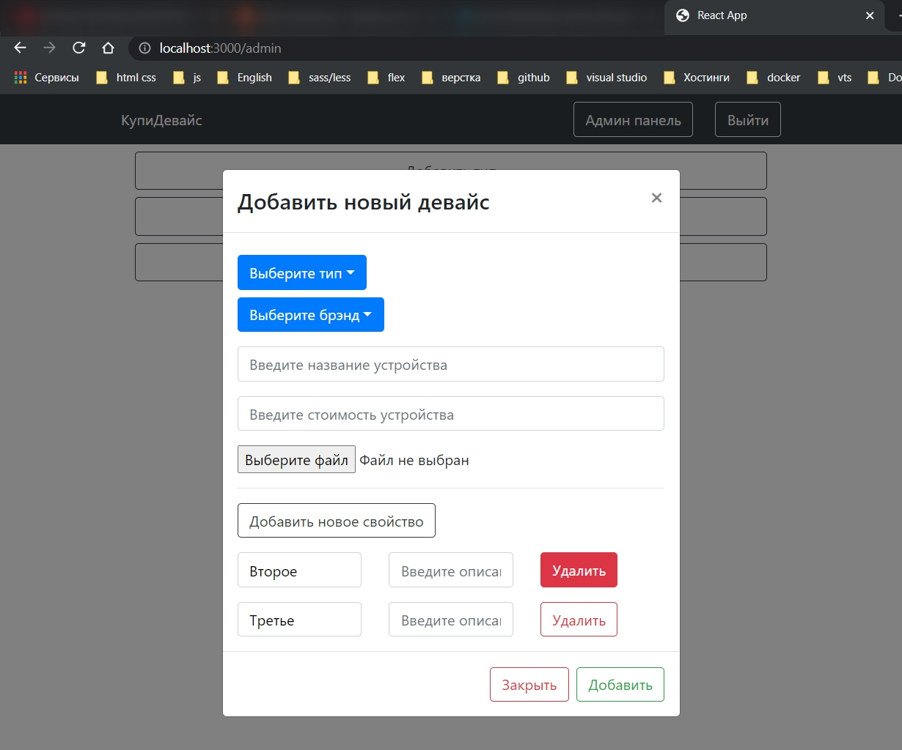

И вот удаление происходит успешно.
