# взаимодействие с сервером настраиваем axios

Создаю папку и называю ее **http**. Внутри создаю **index.js**. и здесь настроим **axios**.

Создадим два инстанса.

Первый будет для обычных запросов которые не требуют авторизации. Назовем его просто **$host**.

```js
// http index.js
import axios from 'axios';

// Запросы не требующие авторизации
const $host = axios.create({});
```

Во второй же инстанс к каждому запросу автоматически будет подставлятся **header** **Authorization** и туда бует добавляться **token**.

```js
// http index.js
import axios from 'axios';

// Запросы не требующие авторизации
const $host = axios.create({});

// Запросы требующие авторизацию
const $authHost = axios.create({});
```

В опциях мы можем указать baseURL на которые будут отправляться запросы. Хардкодить мы его не будем.

Так же создадим файлик **.env**.
И здесь как системную переменную укажем **REACT_APP_API_URL**

```js
REACT_APP_API_URL = 'http://localhost:5000/';
```

Обязательно перед названием переменных добавляем **REACT_APP**.

Откроем **index.js** и в логи выводим эту переменную тем самым убеждаемся что **react** ее считывает.

```js
import React, { createContext } from 'react';
import ReactDOM from 'react-dom';
import App from './App';
import UserStore from './store/UserStore';
import DeviceStore from './store/DeviceStore';

export const Context = createContext(null);
console.log(process.env.REACT_APP_API_URL);

ReactDOM.render(
  <Context.Provider
    value={{
      user: new UserStore(),
      device: new DeviceStore(),
    }}
  >
    <App />
  </Context.Provider>,
  document.getElementById('root')
);
```

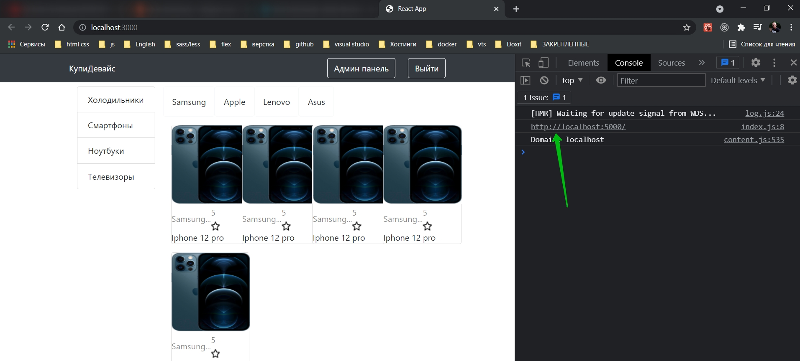

Открываем настройку нашего **axios**.

```js
// http index.js
import axios from 'axios';

// Запросы не требующие авторизации
const $host = axios.create({
  baseURL: process.env.REACT_APP_API_URL,
});

// Запросы требующие авторизацию
const $authHost = axios.create({
  baseURL: process.env.REACT_APP_API_URL,
});
```

В случае второго инстанса нам необходимо подставлять автоматический токен каждому запросу. Для этого существуют так называемые интерцепторы. Это просто функция которая параметрами принимает **config**.

```js
// http index.js
import axios from 'axios';

// Запросы не требующие авторизации
const $host = axios.create({
  baseURL: process.env.REACT_APP_API_URL,
});

// Запросы требующие авторизацию
const $authHost = axios.create({
  baseURL: process.env.REACT_APP_API_URL,
});

const authInterceptor = (config) => {};
```

Здесь в **config** в поле headers добавляем **authorization** и указываем наш **token**.

```js
// http index.js
import axios from 'axios';

// Запросы не требующие авторизации
const $host = axios.create({
  baseURL: process.env.REACT_APP_API_URL,
});

// Запросы требующие авторизацию
const $authHost = axios.create({
  baseURL: process.env.REACT_APP_API_URL,
});

const authInterceptor = (config) => {
  config.headers.authorization = `Bearer ${localStorage.getItem('token')}`;
  return config;
};
```

При авторизации мы этот **token** будем добавлять в **localStorage**.

Затем для инстанса **$authHost** добавляю **interceptors.request.use(authInterceptor)** именно для запроса. Можно так же повешать **interceptors** для ответа. и он будет отрабатывать перед каждым запросом и подставлять **token** в **header Authorization**. Так как мы это делали в **POSTMAN** вручную.

```js
// http index.js
import axios from 'axios';

// Запросы не требующие авторизации
const $host = axios.create({
  baseURL: process.env.REACT_APP_API_URL,
});

// Запросы требующие авторизацию
const $authHost = axios.create({
  baseURL: process.env.REACT_APP_API_URL,
});

//Создаю interceptor
const authInterceptor = (config) => {
  config.headers.authorization = `Bearer ${localStorage.getItem('token')}`;
  return config;
};

//Добавляю interceptor на каждый запрос
$authHost.interceptors.request.use(authInterceptor);

export { $host, $authHost };
```

В папке **http** создаю новый файлик **userAPI.js**.

Здесь мы реализуем функции регистрации, авторизации и проверки токена на валидность, та самай функция **check**.

```js
// http userAPI.js
import { $host, $authHost } from './index';

export const registration = async (email, password) => {};
```

В переменную response будем помещать ответ который будет возвращаться от сервера. Это у нас **post** запрос. Базовый запрос у нас берется из системной переменной и к нему добавляем еще **'api/user/registration'** и вторым параметром в объекте указываю что передаю **email**, **password**.

```js
// http userAPI.js
import { $host, $authHost } from './index';

export const registration = async (email, password) => {
  const response = await $host.post('api/user/registration', {
    email,
    password,
    role: 'ADMIN',
  });
  return response;
};
```

Продублирую

```js
// http userAPI.js
import { $host, $authHost } from './index';

export const registration = async (email, password) => {
  const response = await $host.post('api/user/registration', {
    email,
    password,
    role: 'ADMIN',
  });
  return response;
};

export const login = async (email, password) => {
  const response = await $host.post('api/user/login', {
    email,
    password,
  });
  return response;
};

export const check = async () => {
  const response = await $host.post('api/auth/auth');
  return response;
};
```

Откроем страницу с авторизацией. Здесь создадим нвую функцию и назовем ее **signIn**. И здесь в переменную response поместим вызов функции **registration()**. Пока что выведем в логи то что находится внутри **response**.

Все таки переименуюе эту функцию и сделаем ее универсальной под регистрацию и авторизацию. Назову эту функцию **click** . И в функции просто сделаю проерку. Если **isLogin** будем вызывать запрос на авторизацию, если не **isLogin** соответственно на регистрацию.

```js
// pages Auth.js
import React from 'react';
import { Container, Card, Form, Button, Row } from 'react-bootstrap';
import { NavLink, useLocation } from 'react-router-dom';
import { registration, login } from '../http/userAPI';
import { REGISTRATION_ROUTE, LOGIN_ROUTE } from '../utils/consts';

const Auth = () => {
  const location = useLocation();
  const isLogin = location.pathname === LOGIN_ROUTE;

  const click = async () => {
    if (isLogin) {
      const response = await login();
    } else {
      const response = await registration();
      console.log(response);
    }
  };

  return (
    <Container
      className="d-flex justify-content-center align-items-center"
      style={{ height: window.innerHeight - 54 }}
    >
      <Card style={{ width: 600 }} className="p-5">
        <h2 className="m-auto">{isLogin ? 'Авторизация' : 'Регистрация'}</h2>
        <Form className="d-flex flex-column">
          <Form.Control className="mt-3" placeholder="Введите Email" />
          <Form.Control className="mt-3" placeholder="Введите пароль" />
          <Row className="d-lg-flex justify-content-lg-between m-3">
            {isLogin ? (
              <div>
                Нет аккаунта?{' '}
                <NavLink to={REGISTRATION_ROUTE}>Зарегистрируйтесь</NavLink>
              </div>
            ) : (
              <div>
                Есть аккаунт? <NavLink to={LOGIN_ROUTE}>Войдите</NavLink>
              </div>
            )}
            <Button className="mt-3" variant={'outline-success'}>
              {isLogin ? 'Войти' : 'Регистрация'}
            </Button>
          </Row>
        </Form>
      </Card>
    </Container>
  );
};

export default Auth;
```

На данный момент в функции **login** и **email** необходимо передать **email** и **password**. Однако **input**-ты у на не живые.

Сделаем их управляемыми.

Создадим новое состояние с помощью **useState**.

```js
// pages Auth.js
import React, { useState } from 'react';
import { Container, Card, Form, Button, Row } from 'react-bootstrap';
import { NavLink, useLocation } from 'react-router-dom';
import { registration, login } from '../http/userAPI';
import { REGISTRATION_ROUTE, LOGIN_ROUTE } from '../utils/consts';

const Auth = () => {
  const location = useLocation();
  const isLogin = location.pathname === LOGIN_ROUTE;
  const [email, setEmail] = useState('');
  const [password, setPassword] = useState('');

  const click = async () => {
    if (isLogin) {
      const response = await login();
    } else {
      const response = await registration(email, password);
      console.log(response);
    }
  };

  return (
    <Container
      className="d-flex justify-content-center align-items-center"
      style={{ height: window.innerHeight - 54 }}
    >
      <Card style={{ width: 600 }} className="p-5">
        <h2 className="m-auto">{isLogin ? 'Авторизация' : 'Регистрация'}</h2>
        <Form className="d-flex flex-column">
          <Form.Control
            className="mt-3"
            placeholder="Введите Email"
            value={email}
            onChange={(e) => setEmail(e.target.value)}
          />
          <Form.Control
            className="mt-3"
            placeholder="Введите пароль"
            value={password}
            onChange={(e) => setPassword(e.target.value)}
            type="password"
          />
          <Row className="d-lg-flex justify-content-lg-between m-3">
            {isLogin ? (
              <div>
                Нет аккаунта?{' '}
                <NavLink to={REGISTRATION_ROUTE}>Зарегистрируйтесь</NavLink>
              </div>
            ) : (
              <div>
                Есть аккаунт? <NavLink to={LOGIN_ROUTE}>Войдите</NavLink>
              </div>
            )}
            <Button
              className="mt-3"
              variant={'outline-success'}
              onClick={click}
            >
              {isLogin ? 'Войти' : 'Регистрация'}
            </Button>
          </Row>
        </Form>
      </Card>
    </Container>
  );
};

export default Auth;
```

В **UserStore** делаю пользователя не авторизованным.

```js
//store userStore.js
import { makeAutoObservable } from 'mobx';

export default class UserStore {
  constructor() {
    this._isAuth = false;
    this._user = {};
    makeAutoObservable(this);
  }

  // изменяю состоние
  setAuth(bool) {
    this._isAuth = bool;
  }

  setUser(bool) {
    this._user = bool;
  }

  // получаю данные
  get isAuth() {
    return this._isAuth;
  }

  get user() {
    return this._user;
  }
}
```

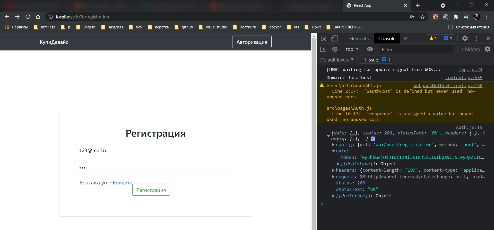

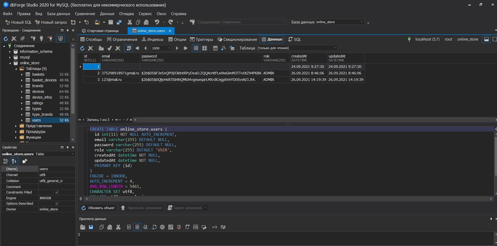

Как видим в БД добавился такой **email**.

И получаем **response** в теле ответа мы видим **token**.

Теперь этот токен мы можем сохранять в локальное хранилище и пользователь будет авторизован.

Но так же нам необходимо сохранять информацию о пользователе. Что бы потом на странице пользователя, в профиле его отрисовывать.

Для этого мне понадобится модуль **JWT** decode. [https://www.npmjs.com/package/jwt-decode](https://www.npmjs.com/package/jwt-decode). С помощью него мы можем **token** распарсить.

```js
npm i jwt-decode
```

открываю userAPI.js.

```js
// http userAPI.js
import { $host, $authHost } from './index';
import jwt_decode from 'jwt-decode';

export const registration = async (email, password) => {
  const response = await $host.post('api/user/registration', {
    email,
    password,
    role: 'ADMIN',
  });
  return response;
};

export const login = async (email, password) => {
  const response = await $host.post('api/user/login', {
    email,
    password,
  });
  return response;
};

export const check = async () => {
  const response = await $host.post('api/auth/auth');
  return response;
};
```

Далее вместо переменной response делаю диструктуризацию и получаю **data**.

```js
// http userAPI.js
import { $host, $authHost } from './index';
import jwt_decode from 'jwt-decode';

export const registration = async (email, password) => {
  const { data } = await $host.post('api/user/registration', {
    email,
    password,
    role: 'ADMIN',
  });
  return jwt_decode(data.token);
};

export const login = async (email, password) => {
  const { data } = await $host.post('api/user/login', {
    email,
    password,
  });
  return jwt_decode(data.token);
};

export const check = async () => {
  const response = await $host.post('api/auth/auth');
  return response;
};
```

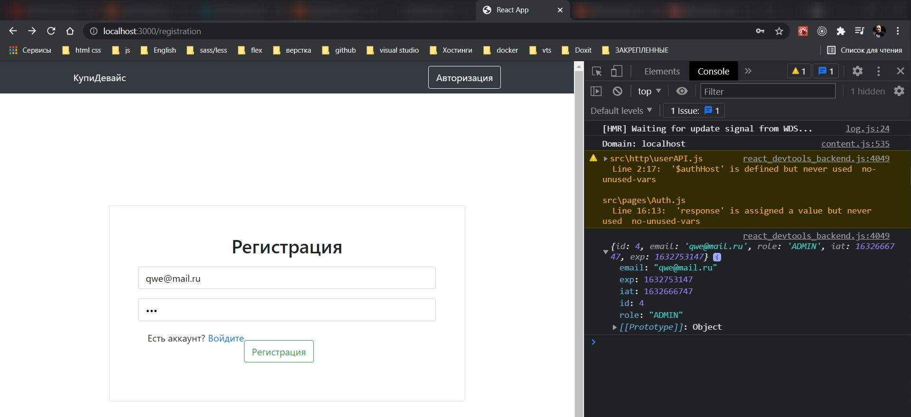

И вот я получаю информацию о пользователе.

Возвращаюсь на **Auth.js**. Сразу же весь компонент обернем в **observer**.

```js
// pages Auth.js
import React, { useState } from 'react';
import { observer } from 'mobx-react-lite';
import { Container, Card, Form, Button, Row } from 'react-bootstrap';
import { NavLink, useLocation } from 'react-router-dom';
import { registration, login } from '../http/userAPI';
import { REGISTRATION_ROUTE, LOGIN_ROUTE } from '../utils/consts';

const Auth = observer(() => {
  const location = useLocation();
  const isLogin = location.pathname === LOGIN_ROUTE;
  const [email, setEmail] = useState('');
  const [password, setPassword] = useState('');

  const click = async () => {
    if (isLogin) {
      const response = await login();
    } else {
      const response = await registration(email, password);
      console.log(response);
    }
  };

  return (
    <Container
      className="d-flex justify-content-center align-items-center"
      style={{ height: window.innerHeight - 54 }}
    >
      <Card style={{ width: 600 }} className="p-5">
        <h2 className="m-auto">{isLogin ? 'Авторизация' : 'Регистрация'}</h2>
        <Form className="d-flex flex-column">
          <Form.Control
            className="mt-3"
            placeholder="Введите Email"
            value={email}
            onChange={(e) => setEmail(e.target.value)}
          />
          <Form.Control
            className="mt-3"
            placeholder="Введите пароль"
            value={password}
            onChange={(e) => setPassword(e.target.value)}
            type="password"
          />
          <Row className="d-lg-flex justify-content-lg-between m-3">
            {isLogin ? (
              <div>
                Нет аккаунта?{' '}
                <NavLink to={REGISTRATION_ROUTE}>Зарегистрируйтесь</NavLink>
              </div>
            ) : (
              <div>
                Есть аккаунт? <NavLink to={LOGIN_ROUTE}>Войдите</NavLink>
              </div>
            )}
            <Button
              className="mt-3"
              variant={'outline-success'}
              onClick={() => click()}
            >
              {isLogin ? 'Войти' : 'Регистрация'}
            </Button>
          </Row>
        </Form>
      </Card>
    </Container>
  );
});

export default Auth;
```

И закончим логику функции **click**.

Теперь с этих запросов нам будет возвращаться **user**. Так же здесь мне нужен user **store** который достаю из контекста.

```js
// pages Auth.js
import React, { useContext, useState } from 'react';
import { Context } from '../index';
import { observer } from 'mobx-react-lite';
import { Container, Card, Form, Button, Row } from 'react-bootstrap';
import { NavLink, useLocation } from 'react-router-dom';
import { registration, login } from '../http/userAPI';
import { REGISTRATION_ROUTE, LOGIN_ROUTE } from '../utils/consts';

const Auth = observer(() => {
  const { user } = useContext(Context);
  const location = useLocation();
  const isLogin = location.pathname === LOGIN_ROUTE;
  const [email, setEmail] = useState('');
  const [password, setPassword] = useState('');

  const click = async () => {
    let data;
    if (isLogin) {
      data = await login(email, password);
    } else {
      data = await registration(email, password);
    }
    user.setUser(user);
    user.setAuth(true);
  };

  return (
    <Container
      className="d-flex justify-content-center align-items-center"
      style={{ height: window.innerHeight - 54 }}
    >
      <Card style={{ width: 600 }} className="p-5">
        <h2 className="m-auto">{isLogin ? 'Авторизация' : 'Регистрация'}</h2>
        <Form className="d-flex flex-column">
          <Form.Control
            className="mt-3"
            placeholder="Введите Email"
            value={email}
            onChange={(e) => setEmail(e.target.value)}
          />
          <Form.Control
            className="mt-3"
            placeholder="Введите пароль"
            value={password}
            onChange={(e) => setPassword(e.target.value)}
            type="password"
          />
          <Row className="d-lg-flex justify-content-lg-between m-3">
            {isLogin ? (
              <div>
                Нет аккаунта?{' '}
                <NavLink to={REGISTRATION_ROUTE}>Зарегистрируйтесь</NavLink>
              </div>
            ) : (
              <div>
                Есть аккаунт? <NavLink to={LOGIN_ROUTE}>Войдите</NavLink>
              </div>
            )}
            <Button
              className="mt-3"
              variant={'outline-success'}
              onClick={() => click()}
            >
              {isLogin ? 'Войти' : 'Регистрация'}
            </Button>
          </Row>
        </Form>
      </Card>
    </Container>
  );
});

export default Auth;
```

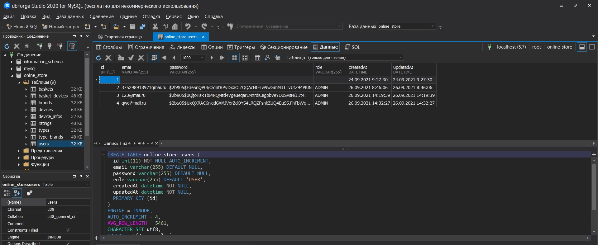

Теперь пробую под этими данными войти.

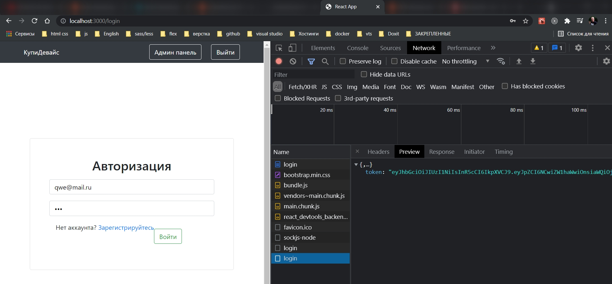

И вот при логине я получаю **token**.

Но так дело не пойдет. Как например пользователь должен узнать о том что он ввел не правильный пароль? Или что пользователь с таким **email** уже существует.

Для этого нам необходимо обработать ошибки. В функции **click** в теле функции оборачиваю все в **try** **catch**.

Сообщение об ошибке вывожу в **alert**.

```js
// pages Auth.js
import React, { useContext, useState } from 'react';
import { Context } from '../index';
import { observer } from 'mobx-react-lite';
import { Container, Card, Form, Button, Row } from 'react-bootstrap';
import { NavLink, useLocation } from 'react-router-dom';
import { registration, login } from '../http/userAPI';
import { REGISTRATION_ROUTE, LOGIN_ROUTE } from '../utils/consts';

const Auth = observer(() => {
  const { user } = useContext(Context);
  const location = useLocation();
  const isLogin = location.pathname === LOGIN_ROUTE;
  const [email, setEmail] = useState('');
  const [password, setPassword] = useState('');

  const click = async () => {
    try {
      let data;
      if (isLogin) {
        data = await login(email, password);
      } else {
        data = await registration(email, password);
      }
      user.setUser(user);
      user.setAuth(true);
    } catch (error) {
      alert(error.response.data.message);
    }
  };

  return (
    <Container
      className="d-flex justify-content-center align-items-center"
      style={{ height: window.innerHeight - 54 }}
    >
      <Card style={{ width: 600 }} className="p-5">
        <h2 className="m-auto">{isLogin ? 'Авторизация' : 'Регистрация'}</h2>
        <Form className="d-flex flex-column">
          <Form.Control
            className="mt-3"
            placeholder="Введите Email"
            value={email}
            onChange={(e) => setEmail(e.target.value)}
          />
          <Form.Control
            className="mt-3"
            placeholder="Введите пароль"
            value={password}
            onChange={(e) => setPassword(e.target.value)}
            type="password"
          />
          <Row className="d-lg-flex justify-content-lg-between m-3">
            {isLogin ? (
              <div>
                Нет аккаунта?{' '}
                <NavLink to={REGISTRATION_ROUTE}>Зарегистрируйтесь</NavLink>
              </div>
            ) : (
              <div>
                Есть аккаунт? <NavLink to={LOGIN_ROUTE}>Войдите</NavLink>
              </div>
            )}
            <Button
              className="mt-3"
              variant={'outline-success'}
              onClick={() => click()}
            >
              {isLogin ? 'Войти' : 'Регистрация'}
            </Button>
          </Row>
        </Form>
      </Card>
    </Container>
  );
});

export default Auth;
```

Так же после того как пользователь залогинелся, нам необходимо его переводить на страницу магазина

```js
// pages Auth.js
import React, { useContext, useState } from 'react';
import { Context } from '../index';
import { observer } from 'mobx-react-lite';
import { Container, Card, Form, Button, Row } from 'react-bootstrap';
import { NavLink, useLocation, useHistory } from 'react-router-dom';
import { registration, login } from '../http/userAPI';
import { REGISTRATION_ROUTE, LOGIN_ROUTE, SHOP_ROUTE } from '../utils/consts';

const Auth = observer(() => {
  const { user } = useContext(Context);
  const location = useLocation();
  const history = useHistory();
  const isLogin = location.pathname === LOGIN_ROUTE;
  const [email, setEmail] = useState('');
  const [password, setPassword] = useState('');

  const click = async () => {
    try {
      let data;
      if (isLogin) {
        data = await login(email, password);
      } else {
        data = await registration(email, password);
      }
      user.setUser(user);
      user.setAuth(true);
      history.push(SHOP_ROUTE);
    } catch (error) {
      alert(error.response.data.message);
    }
  };

  return (
    <Container
      className="d-flex justify-content-center align-items-center"
      style={{ height: window.innerHeight - 54 }}
    >
      <Card style={{ width: 600 }} className="p-5">
        <h2 className="m-auto">{isLogin ? 'Авторизация' : 'Регистрация'}</h2>
        <Form className="d-flex flex-column">
          <Form.Control
            className="mt-3"
            placeholder="Введите Email"
            value={email}
            onChange={(e) => setEmail(e.target.value)}
          />
          <Form.Control
            className="mt-3"
            placeholder="Введите пароль"
            value={password}
            onChange={(e) => setPassword(e.target.value)}
            type="password"
          />
          <Row className="d-lg-flex justify-content-lg-between m-3">
            {isLogin ? (
              <div>
                Нет аккаунта?{' '}
                <NavLink to={REGISTRATION_ROUTE}>Зарегистрируйтесь</NavLink>
              </div>
            ) : (
              <div>
                Есть аккаунт? <NavLink to={LOGIN_ROUTE}>Войдите</NavLink>
              </div>
            )}
            <Button
              className="mt-3"
              variant={'outline-success'}
              onClick={() => click()}
            >
              {isLogin ? 'Войти' : 'Регистрация'}
            </Button>
          </Row>
        </Form>
      </Card>
    </Container>
  );
});

export default Auth;
```

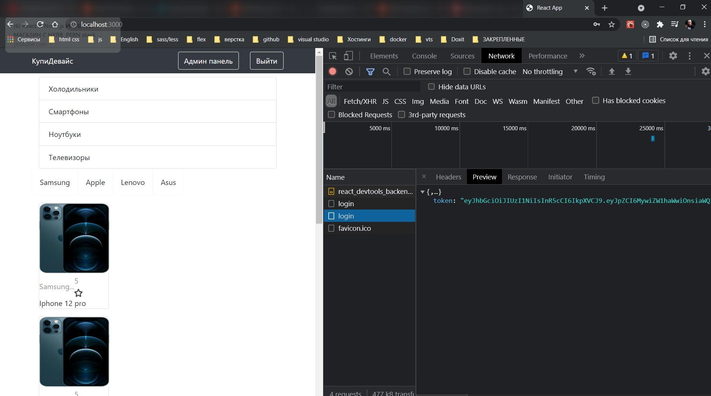

На данный момент мы логинемся, регистрируемся. Но нигде не сохраняем токен. Онкроем файл **userAPI.js** и после того как запрос прошел, мы получили данные, будем в локальное хранилище по ключу **token** помещать токен из тела запроса.

```js
// http userAPI.js
import { $host, $authHost } from './index';
import jwt_decode from 'jwt-decode';

export const registration = async (email, password) => {
  const { data } = await $host.post('api/user/registration', {
    email,
    password,
    role: 'ADMIN',
  });
  localStorage.setItem('token', data.token);
  return jwt_decode(data.token);
};

export const login = async (email, password) => {
  const { data } = await $host.post('api/user/login', {
    email,
    password,
  });
  localStorage.setItem('token', data.token);
  return jwt_decode(data.token);
};

export const check = async () => {
  const response = await $host.post('api/auth/auth');
  return response;
};
```

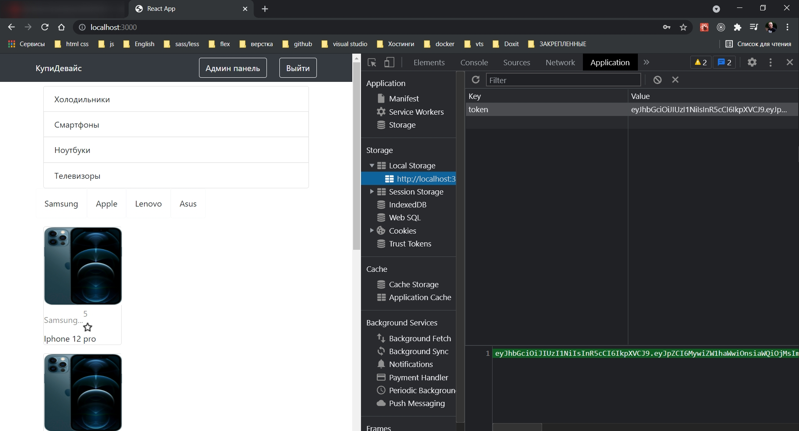

Теперь разберемся с функцией **check**. Здесь нам понадобится **$authHost** поскольку мы к запросу будем прикреплять токен.

Напомню что в папке **server** в папке **routes** в файле **userRouter.js** мы указывали **authMiddleware.js**

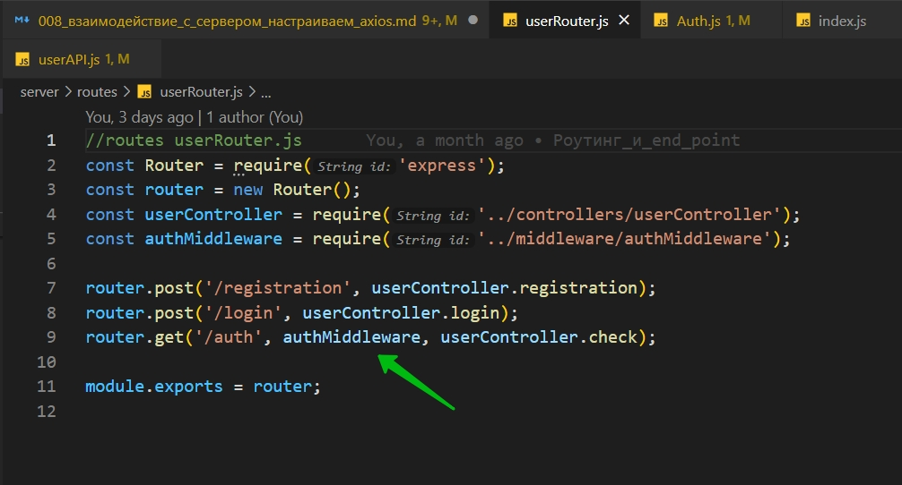

```js
//routes userRouter.js
const Router = require('express');
const router = new Router();
const userController = require('../controllers/userController');
const authMiddleware = require('../middleware/authMiddleware');

router.post('/registration', userController.registration);
router.post('/login', userController.login);
router.get('/auth', authMiddleware, userController.check);

module.exports = router;
```

**authMiddleware** который этот token будет проверять.

Логика такова. Пользователь авторизовался. Токен сохранился. И затем каждый раз при обновлении страницы будет вызываться функция **check**, и если токен не валидный, то пользователь будет разлогиневатся. Если валидный пользователь будет попадать на страницу магазина под своим аккаунтом. И поскольку из этой функции нам так же возвращается токен, мы его перезаписываем, и возвращаем опять данные о пользователе.

```js
// http userAPI.js
import { $host, $authHost } from './index';
import jwt_decode from 'jwt-decode';

export const registration = async (email, password) => {
  const { data } = await $host.post('api/user/registration', {
    email,
    password,
    role: 'ADMIN',
  });
  localStorage.setItem('token', data.token);
  return jwt_decode(data.token);
};

export const login = async (email, password) => {
  const { data } = await $host.post('api/user/login', {
    email,
    password,
  });
  localStorage.setItem('token', data.token);
  return jwt_decode(data.token);
};

export const check = async () => {
  const { data } = await $host.post('api/auth/auth');
  localStorage.setItem('token', data.token);
  return jwt_decode(data.token);
};
```

Теперь перехожу в компоенет **App.js**. Опять же оборачиваю в **observer**, поскольку здесь мне понадобится состояние **user**.

```js
import React, { useContext, useState } from 'react';
import { BrowserRouter } from 'react-router-dom';
import { observer } from 'mobx-react-lite';
import { Context } from './index';
import AppRouter from './components/AppRouter';
import NavBar from './components/NavBar';

const App = observer(() => {
  const { user } = useContext(Context);
  const [loading, setLoading] = useState(true);
  return (
    <BrowserRouter>
      <NavBar />
      <AppRouter />
    </BrowserRouter>
  );
});

export default App;
```

Локальное состояние у нас обвечает за то идет загрузка или нет. Т.е. логика следующая. По **default** это состояние **= true**. На страницу мы добавляем какую-нибудь крутилку. Затем отправляется запрос на проверку пользователя, и после того как нам вернулся ответ мы это состяние делаем false и страница загружается.

теперь этот запрос необходимо отправлять при первой загрузке приложения. Для этого воспользуемся хуком **useEffect** который первым параметром принимат функцию, а вторым массив зависимостей. Если этот массив зависимостей пустой, то функция отработает лиш единажды. Внутри вызываю функцию **check()** и если она выполнилась успешно делем **setUser(true)** и **setAuth(true)**

```js
import React, { useContext, useEffect, useState } from 'react';
import { BrowserRouter } from 'react-router-dom';
import { observer } from 'mobx-react-lite';
import { Context } from './index';
import AppRouter from './components/AppRouter';
import NavBar from './components/NavBar';
import { check } from './http/userAPI';

const App = observer(() => {
  const { user } = useContext(Context);
  const [loading, setLoading] = useState(true);

  useEffect(() => {
    check()
      .then((data) => {
        user.setUser(true);
        user.setAuth(true);
      })
      .finally(() => setLoading(false));
  });

  return (
    <BrowserRouter>
      <NavBar />
      <AppRouter />
    </BrowserRouter>
  );
});

export default App;
```

Через **finally**, блок который отработает в любом случае, заканчиваем загрузку страницы. Т.е. если ошибка, загрузка закончится и выдаст ошибку. Если запрос пройдет успешно, загрузка так же закончится и произойдет перенаправление на главную страницу.

Сейчас токен находится в локальном хранилище и мы авторизованы. После того как мы обновим страницу, запрос улетит на сервер, этот токен провериться, и только после этого мы узнаем авторизованы мы или нет. Эта операция не мгновенная. Запрос на сервер занимает какое-то время.

Сейчас реализую функцию **logOut**.

```js
import React, { useContext } from 'react';
import { Context } from '..';
import { Navbar, Nav, Button, Container } from 'react-bootstrap';
import { NavLink } from 'react-router-dom';
import { ADMIN_ROUTE, LOGIN_ROUTE, SHOP_ROUTE } from '../utils/consts';
import { observer } from 'mobx-react-lite';
import { useHistory } from 'react-router-dom';

const NavBar = observer(() => {
  const { user } = useContext(Context);
  const history = useHistory();

  const logOut = () => {
    user.setUser({});
    user.setAuth(false);
  };

  return (
    <Navbar bg="dark" variant="dark">
      <Container>
        <NavLink style={{ color: 'white' }} to={SHOP_ROUTE}>
          КупиДевайс
        </NavLink>
        {user.isAuth ? (
          <Nav className="ml-auto" style={{ color: 'white' }}>
            <Button
              variant={'outline-light'}
              onClick={() => history.push(ADMIN_ROUTE)}
            >
              Админ панель
            </Button>
            <Button
              variant={'outline-light'}
              onClick={() => logOut()}
              className="ml-4"
            >
              Выйти
            </Button>
          </Nav>
        ) : (
          <Nav className="ml-auto" style={{ color: 'white' }}>
            <Button
              variant={'outline-light'}
              onClick={() => history.push(LOGIN_ROUTE)}
            >
              Авторизация
            </Button>
          </Nav>
        )}
      </Container>
    </Navbar>
  );
});

export default NavBar;
```

Теперь на кнопку выйти перерендеривается **NavBar**


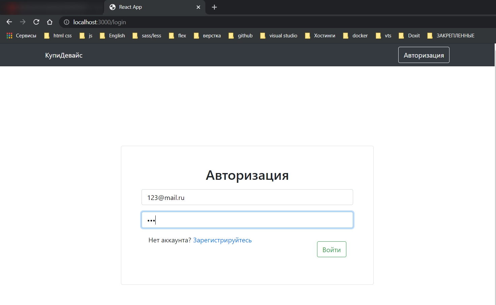

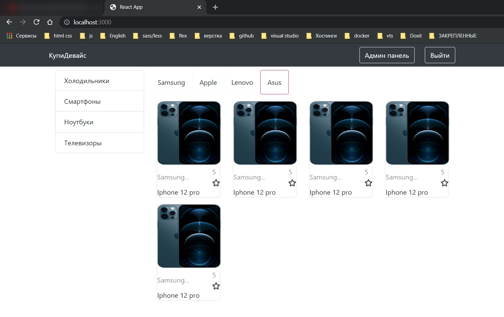

<br/>
<br/>
<br/>

Теперь научимся получать типы брэнды устройства. И их создавать. Для этого в папке **http** создаем новый файлик. Называем его **deviceAPI.js**

```js
import { $host, $authHost } from './index';
import jwt_decode from 'jwt-decode';

//Создание типа
export const createType = async (type) => {
  const { data } = await $authHost.post('api/type', type);
  return data;
};

// Получение типа
export const fetchType = async () => {
  const { data } = await $host.get('api/type');
  return data;
};
```

**createType** параметром будет **type** т.е. сам тип. И в **$authHost.post('api/type', type);** телом запроса этот type будем передавать. Создавать может только админ **$authHost**.

В серверной части в **typeRouter.js** у нас есть есть **middleware** **checkRole** то есть роль пользователя

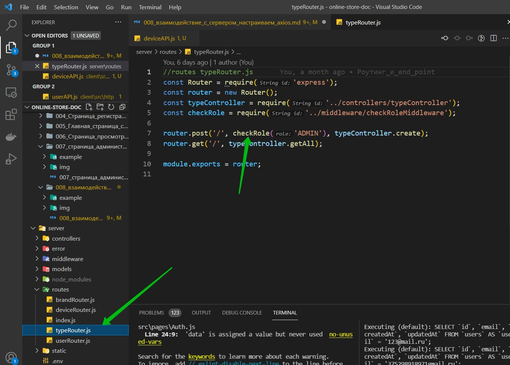

А роль как раз проверяется по токену

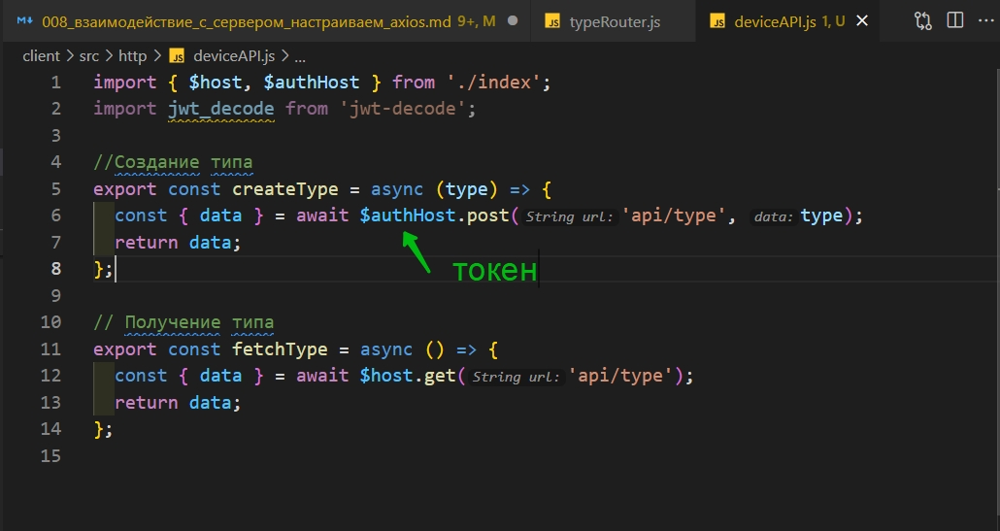

по это му нам нужен авторизованный хост.

Функция **fetchTypes** ни каких параметров принимать не будет. У **fetchTypes** достаточно обычного $host так как любой пользователь может получить список.

С созданием типов разберемся чуть позже. Пока что просто их получим.

Перехожу в **Shop.js**. оборачиваю все в **observer**.

```js
//pages Shop.js
import React from 'react';
import { Container, Row, Col } from 'react-bootstrap';
import TypeBar from '../components/TypeBar';
import BrandBar from '../components/BrandBar';
import DeviceList from '../components/DeviceList';
import { observer } from 'mobx-react-lite';

const Shop = observer(() => {
  return (
    <Container>
      <Row className="mt-2">
        <Col md={3}>
          <TypeBar />
        </Col>
        <Col md={9}>
          <BrandBar />
          <DeviceList />
        </Col>
      </Row>
    </Container>
  );
});

export default Shop;
```

Получаю **divice** **store** с помощью хука **useContext**.

```js
//pages Shop.js
import React, { useContext, useEffect } from 'react';
import { Container, Row, Col } from 'react-bootstrap';
import TypeBar from '../components/TypeBar';
import BrandBar from '../components/BrandBar';
import DeviceList from '../components/DeviceList';
import { observer } from 'mobx-react-lite';
import { Context } from '../index';
import { fetchTypes } from '../http/deviceAPI';

const Shop = observer(() => {
  const { device } = useContext(Context);

  useEffect(() => {
    fetchTypes().then((data) => device.setTypes(data));
  }, []);

  return (
    <Container>
      <Row className="mt-2">
        <Col md={3}>
          <TypeBar />
        </Col>
        <Col md={9}>
          <BrandBar />
          <DeviceList />
        </Col>
      </Row>
    </Container>
  );
});

export default Shop;
```

В **device.setTypes(data)** передаем то что нам вернулось в запросе.

Теперь в **DeviceStore.js** массив **\_types** можно оставить пустым.

```js
// store deviceStore.js

import { makeAutoObservable } from 'mobx';

export default class DeviceStore {
  constructor() {
    this._types = [];
    this._brands = [
      { id: 1, name: 'Samsung' },
      { id: 2, name: 'Apple' },
      { id: 3, name: 'Lenovo' },
      { id: 4, name: 'Asus' },
    ];
    this._devices = [
      {
        id: 1,
        name: 'Iphone 12 pro',
        price: 2500,
        rating: 5,
        img: 'https://static.21vek.by/img/galleries/6240/333/iphone12pro128gbmgmn3_apple_5f9bdbcc46c7c.jpeg',
      },
      {
        id: 2,
        name: 'Iphone 12 pro',
        price: 2500,
        rating: 5,
        img: 'https://static.21vek.by/img/galleries/6240/333/iphone12pro128gbmgmn3_apple_5f9bdbcc46c7c.jpeg',
      },
      {
        id: 3,
        name: 'Iphone 12 pro',
        price: 2500,
        rating: 5,
        img: 'https://static.21vek.by/img/galleries/6240/333/iphone12pro128gbmgmn3_apple_5f9bdbcc46c7c.jpeg',
      },
      {
        id: 4,
        name: 'Iphone 12 pro',
        price: 2500,
        rating: 5,
        img: 'https://static.21vek.by/img/galleries/6240/333/iphone12pro128gbmgmn3_apple_5f9bdbcc46c7c.jpeg',
      },
      {
        id: 5,
        name: 'Iphone 12 pro',
        price: 2500,
        rating: 5,
        img: 'https://static.21vek.by/img/galleries/6240/333/iphone12pro128gbmgmn3_apple_5f9bdbcc46c7c.jpeg',
      },
    ];
    this._selectedType = {};
    this._selectedBrand = {};
    makeAutoObservable(this);
  }

  // изменяю
  setTypes(types) {
    this._types = types;
  }

  setBrands(brands) {
    this._brands = brands;
  }

  setDevices(devices) {
    this._devices = devices;
  }

  setSelectedType(type) {
    this._selectedType = type;
  }

  setSelectedBrand(brand) {
    this._selectedBrand = brand;
  }

  // получаю данные
  get types() {
    return this._types;
  }

  get brands() {
    return this._brands;
  }

  get devices() {
    return this._brands;
  }
  get selectedType() {
    return this._selectedType;
  }
  get selectedBrand() {
    return this._selectedBrand;
  }
}
```

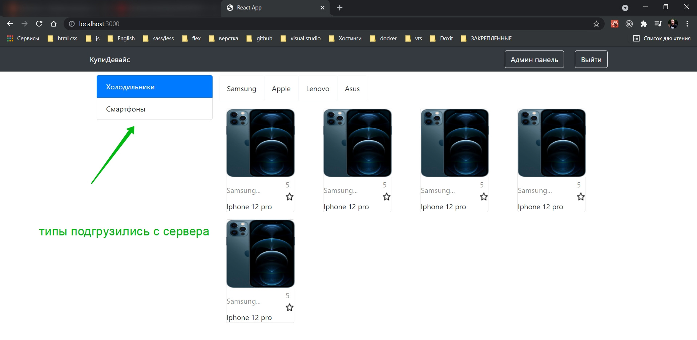

Теперь сделаем тоже самое и с **brand**.

```js
import { $host, $authHost } from './index';
import jwt_decode from 'jwt-decode';

//Создание типа
export const createType = async (type) => {
  const { data } = await $authHost.post('api/type', type);
  return data;
};

// Получение типа
export const fetchTypes = async () => {
  const { data } = await $host.get('api/type');
  return data;
};

// Создаю брэнд
export const createBrand = async (brand) => {
  const { data } = await $authHost.post('api/brand', brand);
  return data;
};

// Получаю брэнд
export const fetchBrands = async () => {
  const { data } = await $host.get('api/brand');
  return data;
};
```

Возвращаюсь на страницу **Shop.js** И помимо функии **fetchTypes** вызываю функцию **fetchBrands**.

```js
//pages Shop.js
import React, { useContext, useEffect } from 'react';
import { Container, Row, Col } from 'react-bootstrap';
import TypeBar from '../components/TypeBar';
import BrandBar from '../components/BrandBar';
import DeviceList from '../components/DeviceList';
import { observer } from 'mobx-react-lite';
import { Context } from '../index';
import { fetchBrands, fetchTypes } from '../http/deviceAPI';

const Shop = observer(() => {
  const { device } = useContext(Context);

  useEffect(() => {
    fetchTypes().then((data) => device.setTypes(data));
    fetchBrands().then((data) => device.setBrands(data));
  }, []);

  return (
    <Container>
      <Row className="mt-2">
        <Col md={3}>
          <TypeBar />
        </Col>
        <Col md={9}>
          <BrandBar />
          <DeviceList />
        </Col>
      </Row>
    </Container>
  );
});

export default Shop;
```

Так же данные которые мы использовали ввиде заглушки так же удаляем.

```js
// store deviceStore.js

import { makeAutoObservable } from 'mobx';

export default class DeviceStore {
  constructor() {
    this._types = [];
    this._brands = [];
    this._devices = [
      {
        id: 1,
        name: 'Iphone 12 pro',
        price: 2500,
        rating: 5,
        img: 'https://static.21vek.by/img/galleries/6240/333/iphone12pro128gbmgmn3_apple_5f9bdbcc46c7c.jpeg',
      },
      {
        id: 2,
        name: 'Iphone 12 pro',
        price: 2500,
        rating: 5,
        img: 'https://static.21vek.by/img/galleries/6240/333/iphone12pro128gbmgmn3_apple_5f9bdbcc46c7c.jpeg',
      },
      {
        id: 3,
        name: 'Iphone 12 pro',
        price: 2500,
        rating: 5,
        img: 'https://static.21vek.by/img/galleries/6240/333/iphone12pro128gbmgmn3_apple_5f9bdbcc46c7c.jpeg',
      },
      {
        id: 4,
        name: 'Iphone 12 pro',
        price: 2500,
        rating: 5,
        img: 'https://static.21vek.by/img/galleries/6240/333/iphone12pro128gbmgmn3_apple_5f9bdbcc46c7c.jpeg',
      },
      {
        id: 5,
        name: 'Iphone 12 pro',
        price: 2500,
        rating: 5,
        img: 'https://static.21vek.by/img/galleries/6240/333/iphone12pro128gbmgmn3_apple_5f9bdbcc46c7c.jpeg',
      },
    ];
    this._selectedType = {};
    this._selectedBrand = {};
    makeAutoObservable(this);
  }

  // изменяю
  setTypes(types) {
    this._types = types;
  }

  setBrands(brands) {
    this._brands = brands;
  }

  setDevices(devices) {
    this._devices = devices;
  }

  setSelectedType(type) {
    this._selectedType = type;
  }

  setSelectedBrand(brand) {
    this._selectedBrand = brand;
  }

  // получаю данные
  get types() {
    return this._types;
  }

  get brands() {
    return this._brands;
  }

  get devices() {
    return this._brands;
  }
  get selectedType() {
    return this._selectedType;
  }
  get selectedBrand() {
    return this._selectedBrand;
  }
}
```

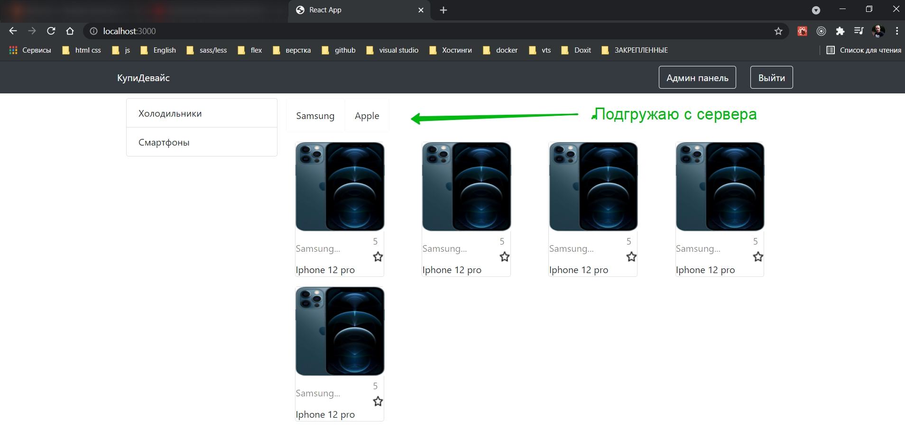

Остается продалать данную процедуру и для **devices**.

```js
import { $host, $authHost } from './index';
import jwt_decode from 'jwt-decode';

//Создание типа
export const createType = async (type) => {
  const { data } = await $authHost.post('api/type', type);
  return data;
};

// Получение типа
export const fetchTypes = async () => {
  const { data } = await $host.get('api/type');
  return data;
};

// Создаю брэнд
export const createBrand = async (brand) => {
  const { data } = await $authHost.post('api/brand', brand);
  return data;
};

// Получаю брэнд
export const fetchBrands = async () => {
  const { data } = await $host.get('api/brand');
  return data;
};

//Создаю device
export const createDevice = async (device) => {
  const { data } = await $authHost.post('api/device', device);
  return data;
};

// получаю девайса
export const fetchDevices = async () => {
  const { data } = await $host.get('api/device');
  return data;
};

// получаю один девайс
export const fetchOneDevice = async (id) => {
  const { data } = await $host.get('api/device' + id);
  return data;
};
```

Чистим данные заглушки

```js
// store deviceStore.js

import { makeAutoObservable } from 'mobx';

export default class DeviceStore {
  constructor() {
    this._types = [];
    this._brands = [];
    this._devices = [];
    this._selectedType = {};
    this._selectedBrand = {};
    makeAutoObservable(this);
  }

  // изменяю
  setTypes(types) {
    this._types = types;
  }

  setBrands(brands) {
    this._brands = brands;
  }

  setDevices(devices) {
    this._devices = devices;
  }

  setSelectedType(type) {
    this._selectedType = type;
  }

  setSelectedBrand(brand) {
    this._selectedBrand = brand;
  }

  // получаю данные
  get types() {
    return this._types;
  }

  get brands() {
    return this._brands;
  }

  get devices() {
    return this._brands;
  }
  get selectedType() {
    return this._selectedType;
  }
  get selectedBrand() {
    return this._selectedBrand;
  }
}
```

```js
//pages Shop.js
import React, { useContext, useEffect } from 'react';
import { Container, Row, Col } from 'react-bootstrap';
import TypeBar from '../components/TypeBar';
import BrandBar from '../components/BrandBar';
import DeviceList from '../components/DeviceList';
import { observer } from 'mobx-react-lite';
import { Context } from '../index';
import { fetchBrands, fetchDevices, fetchTypes } from '../http/deviceAPI';

const Shop = observer(() => {
  const { device } = useContext(Context);

  useEffect(() => {
    fetchTypes().then((data) => device.setTypes(data));
    fetchBrands().then((data) => device.setBrands(data));
    fetchDevices().then((data) => device.setDevices(data));
  }, []);

  return (
    <Container>
      <Row className="mt-2">
        <Col md={3}>
          <TypeBar />
        </Col>
        <Col md={9}>
          <BrandBar />
          <DeviceList />
        </Col>
      </Row>
    </Container>
  );
});

export default Shop;
```

Но сечас мы получим лишь ошибку. Все дело в том что мы добавляли пагинацию на получение девайсов. И помоми самих **devices** нам так же приходит их количество.

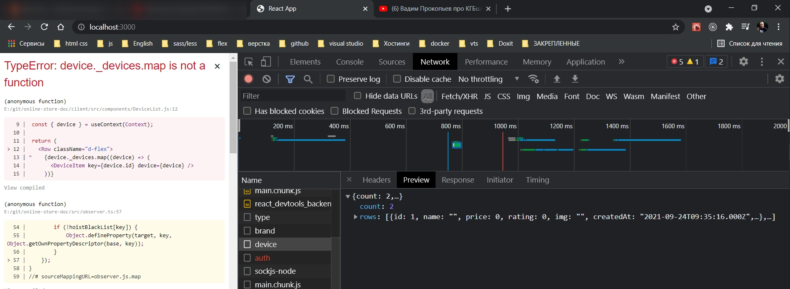

По этому устройства в **useEffect** мы получаем из поля **rows**.

```js
//pages Shop.js
import React, { useContext, useEffect } from 'react';
import { Container, Row, Col } from 'react-bootstrap';
import TypeBar from '../components/TypeBar';
import BrandBar from '../components/BrandBar';
import DeviceList from '../components/DeviceList';
import { observer } from 'mobx-react-lite';
import { Context } from '../index';
import { fetchBrands, fetchDevices, fetchTypes } from '../http/deviceAPI';

const Shop = observer(() => {
  const { device } = useContext(Context);

  useEffect(() => {
    fetchTypes().then((data) => device.setTypes(data));
    fetchBrands().then((data) => device.setBrands(data));
    fetchDevices().then((data) => device.setDevices(data.rows));
  }, []);

  return (
    <Container>
      <Row className="mt-2">
        <Col md={3}>
          <TypeBar />
        </Col>
        <Col md={9}>
          <BrandBar />
          <DeviceList />
        </Col>
      </Row>
    </Container>
  );
});

export default Shop;
```

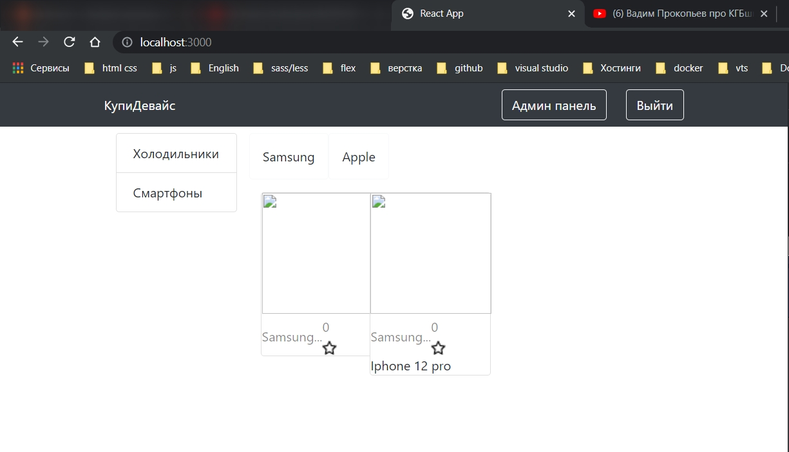

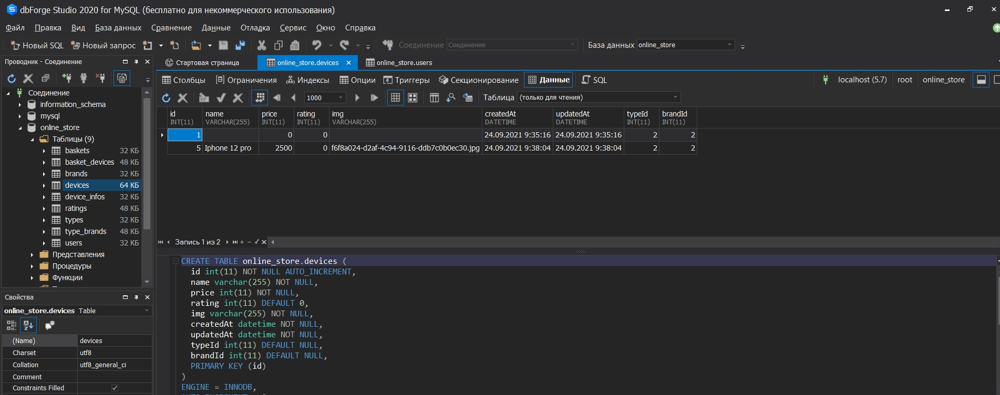

Есть какая - то проблема и изображениями. Открываю компонент **DeviceItem.js**. И как вы помните в поле **Img** в **src** мы храним название файла. Помимо этого названию нам необходимо добавить и **url** сервера.

```js
import React from 'react';
import { useHistory } from 'react-router-dom';
import { Col, Card, Image } from 'react-bootstrap';
import star from '../assets/star.png';
import { DEVICE_ROUTE } from '../utils/consts';

const DeviceItem = ({ device }) => {
  const history = useHistory();

  return (
    <Col
      md={3}
      className="mt-3"
      onClick={() => history.push(DEVICE_ROUTE + '/' + device.id)}
    >
      <Card style={{ width: 150, cursor: 'pointer', border: 'light' }}>
        <Image
          width={150}
          height={150}
          src={process.env.REACT_APP_API_URL + device.img}
        />
        <div className=" text-black-50 mt-1 d-flex justify-content-lg-between align-items-center">
          <div>Samsung...</div>
          <div>
            <div>{device.rating}</div>
            <Image width={18} height={18} src={star} />
          </div>
        </div>
        <div>{device.name}</div>
      </Card>
    </Col>
  );
};

export default DeviceItem;
```

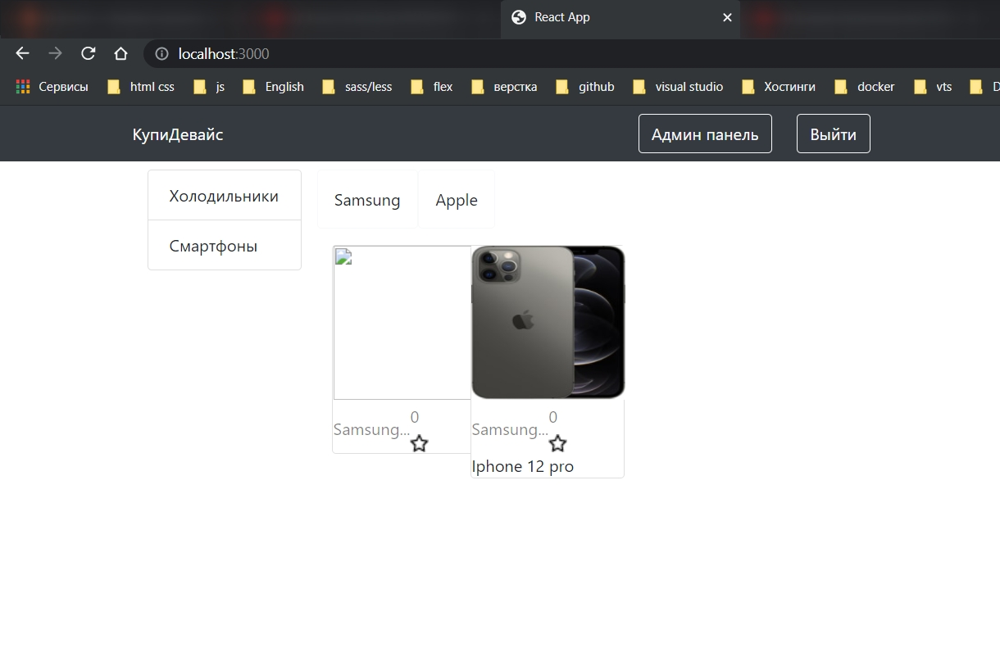

Теперь займемся **DevicePage.js**

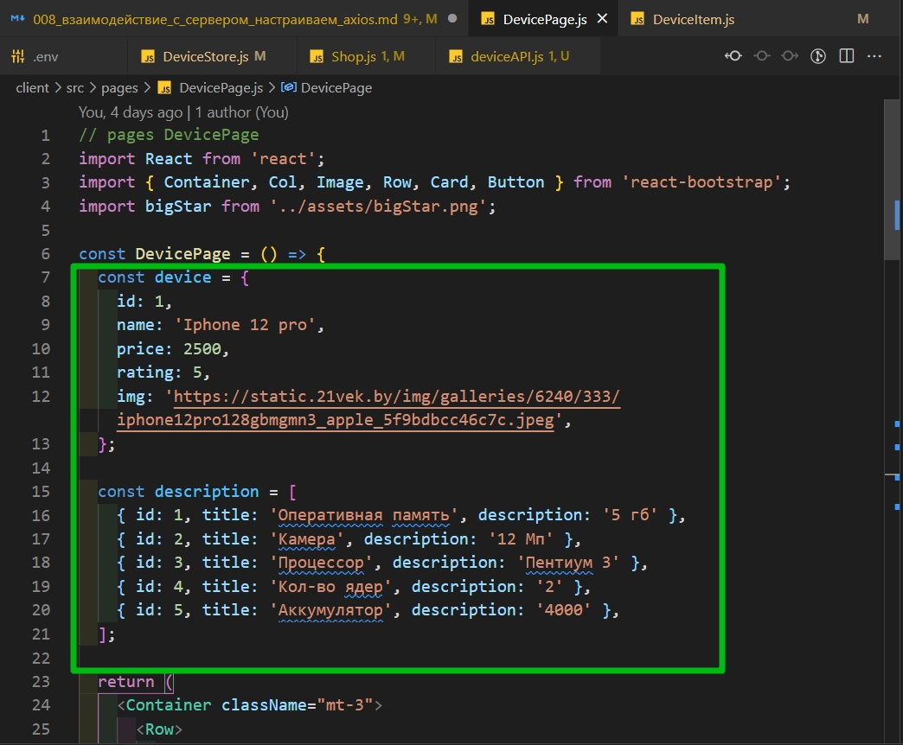

Все вот эти вот данные убираем.

Вместо этого с помощью хука **useState** создаем локальное состояние

```js
// pages DevicePage
import React, { useEffect, useState } from 'react';
import { Container, Col, Image, Row, Card, Button } from 'react-bootstrap';
import bigStar from '../assets/bigStar.png';
import { useParams } from 'react-router-dom';

const DevicePage = () => {
  const [device, setDevice] = useState({ info: [] });
  const params = useParams();
  console.log(params);

  useEffect(() => {}, []);

  return (
    <Container className="mt-3">
      <Row>
        <Col md={4}>
          <Image width={300} height={300} src={device.img} />
        </Col>
        <Col md={4}>
          <Row className="d-flex flex-column align-items-center">
            <h2>{device.name}</h2>
            <div
              className="d-flex align-items-center justify-content-lg-center"
              style={{
                background: `url(${bigStar}) no-repeat center center`,
                width: 240,
                height: 240,
                backgroundSize: 'cover',
                fontSize: 64,
              }}
            >
              {device.rating}
            </div>
          </Row>
        </Col>
        <Col md={4}>
          <Card
            className="d-flex flex-column align-items-center justify-content-center"
            style={{
              width: 300,
              height: 300,
              fontSize: 32,
              border: '5px solid lightgray',
            }}
          >
            <h3>От: {device.price} руб.</h3>
            <Button variant={'outline-dark'}>Добавить в корзину</Button>
          </Card>
        </Col>
      </Row>
      <Row className="d-flex flex-column m-3">
        <h1>Характеристики</h1>
        {device.info.map((info, index) => (
          <Row
            key={info.id}
            style={{
              background: index % 2 === 0 ? 'lightgray' : 'transparent',
              padding: 10,
            }}
          >
            {info.title}: {info.description}
          </Row>
        ))}
      </Row>
    </Container>
  );
};

export default DevicePage;
```

В **useState** по умолчанию это будет пустой объект с одним единственным полем **info** которое будет являться пустым массивом.

Когда мы будем отправлять запрос на сервер нам необходимо знать **id** устройства. Для этого воспользуюсь хукам **useParams** из **react-router-dom**. И с помощью него получаю параметр строки зспроса.

И еще для того что бы не было ошибок я теперь информацию получаю не из **description** а из **device.info**.

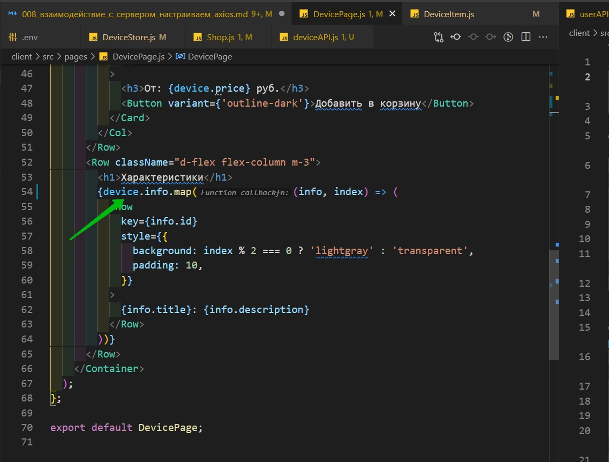

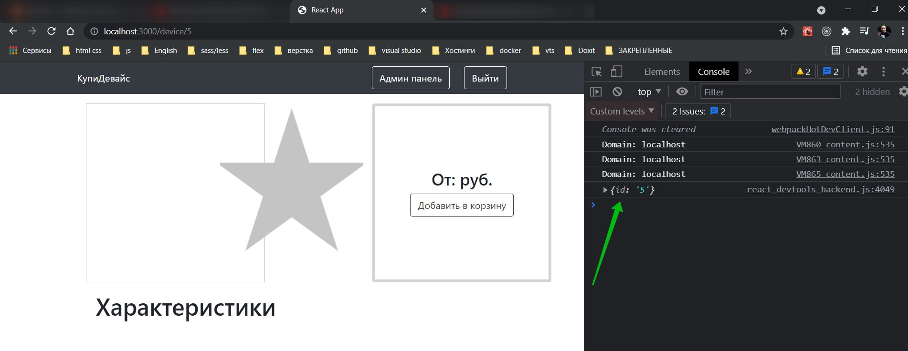

Это **id** из **url**. Я сразу делаю деструктуризацию и вытаскиваю **id**

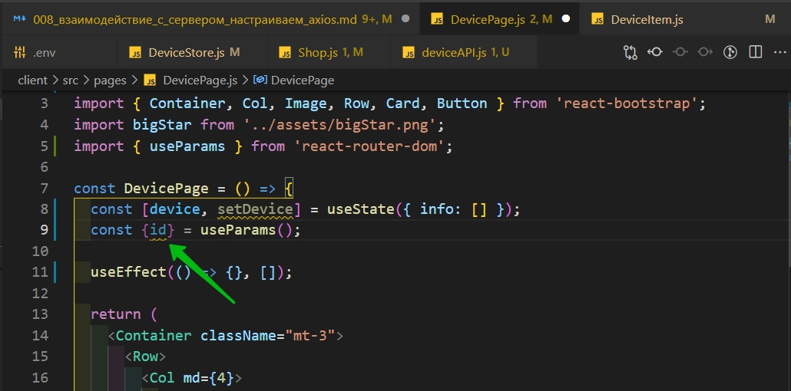

```js
// pages DevicePage
import React, { useEffect, useState } from 'react';
import { Container, Col, Image, Row, Card, Button } from 'react-bootstrap';
import bigStar from '../assets/bigStar.png';
import { useParams } from 'react-router-dom';
import { fetchOneDevice } from '../http/deviceAPI';

const DevicePage = () => {
  const [device, setDevice] = useState({ info: [] });
  const { id } = useParams();

  useEffect(() => {
    fetchOneDevice(id).then((data) => setDevice(data));
  }, []);

  return (
    <Container className="mt-3">
      <Row>
        <Col md={4}>
          <Image
            width={300}
            height={300}
            src={process.env.REACT_APP_API_URL + device.img}
          />
        </Col>
        <Col md={4}>
          <Row className="d-flex flex-column align-items-center">
            <h2>{device.name}</h2>
            <div
              className="d-flex align-items-center justify-content-lg-center"
              style={{
                background: `url(${bigStar}) no-repeat center center`,
                width: 240,
                height: 240,
                backgroundSize: 'cover',
                fontSize: 64,
              }}
            >
              {device.rating}
            </div>
          </Row>
        </Col>
        <Col md={4}>
          <Card
            className="d-flex flex-column align-items-center justify-content-center"
            style={{
              width: 300,
              height: 300,
              fontSize: 32,
              border: '5px solid lightgray',
            }}
          >
            <h3>От: {device.price} руб.</h3>
            <Button variant={'outline-dark'}>Добавить в корзину</Button>
          </Card>
        </Col>
      </Row>
      <Row className="d-flex flex-column m-3">
        <h1>Характеристики</h1>
        {device.info.map((info, index) => (
          <Row
            key={info.id}
            style={{
              background: index % 2 === 0 ? 'lightgray' : 'transparent',
              padding: 10,
            }}
          >
            {info.title}: {info.description}
          </Row>
        ))}
      </Row>
    </Container>
  );
};

export default DevicePage;
```

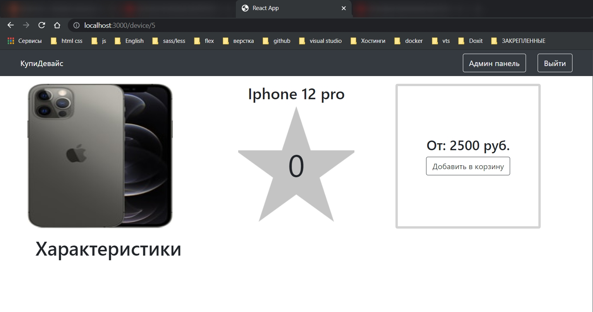

Закончил на 2:21:47

Переходи с этого времени на новую временную точку
