# Добавление устройств и характеристик

Данный раздел я пишу заново. Так как фиксил много ошибок как на лиете так и не сервере. В основном донные ошибки были свзаны с павами дотупа. А точнее не правильным генерированием токена в функции **login** на сервере.

Ошибка была вот здесь

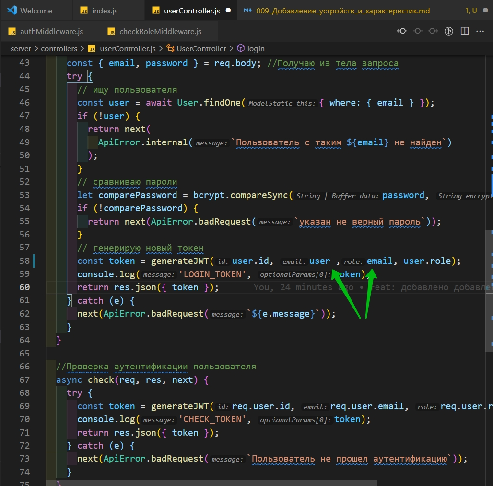

При декодировании токена, а точнее я проверял то что туда попало, с помощью сайта [https://jwt.io/](https://jwt.io/). У меня в **role** пользователя попадал его **email**. И оказывается все довольно просто. На скрине видно что я не вызываю у объекта **user** поле **email**. А случайным образом ввместо точки ставлю запятую, тем самым разбиваю его на отдельные сущности. И в **role** у меня попадает **email**.

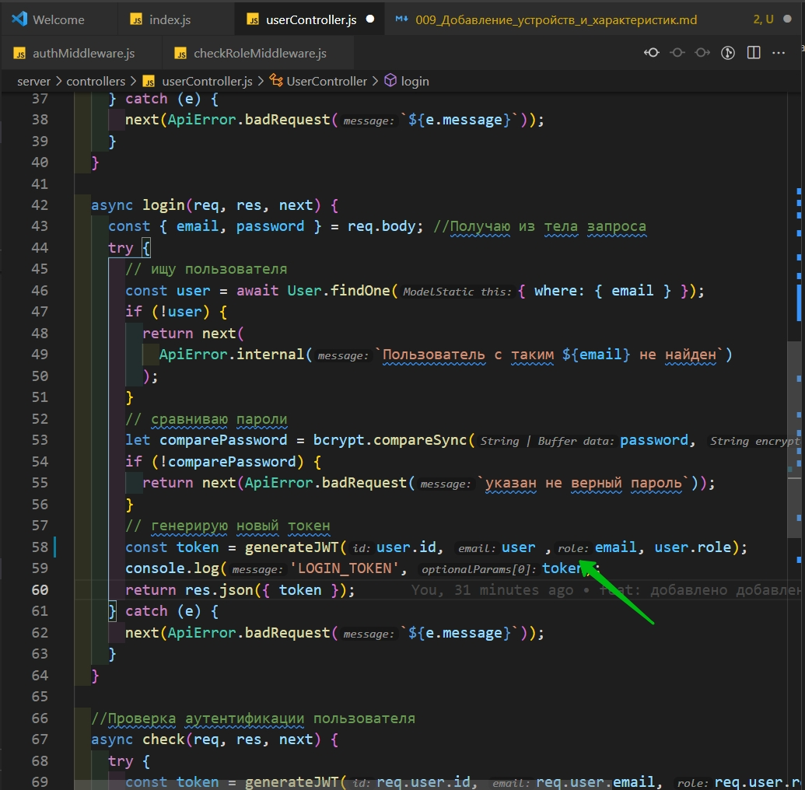

Вот правильный файл

```js
// controller userController.js
const ApiError = require('../error/ApiError');
const bcrypt = require('bcrypt');
const jwt = require('jsonwebtoken');
const { User, Basket } = require('../models/models');

const generateJWT = (id, email, role) => {
  return jwt.sign({ id, email, role }, process.env.SECRET_KEY, {
    expiresIn: '24h',
  });
};

class UserController {
  async registration(req, res, next) {
    const { email, password, role } = req.body; //получаю из тела запроса
    try {
      // Проверка ввода email и password если значения пусты генерируем ошибку
      if (!email || !password) {
        return next(ApiError.badRequest('Не корректный email или пароль'));
      }

      // Проверка существования пользователя с таим email
      const candidate = await User.findOne({ where: { email } });
      if (candidate) {
        return next(
          ApiError.badRequest(`Пользватель с таким email уже сужествует`)
        );
      } else {
        const hashPassword = await bcrypt.hash(password, 5); // хэширую пароль
        const user = await User.create({ email, role, password: hashPassword }); // создаю пользователя, пароль передаю захэшированным
        const basket = await Basket.create({ userId: user.id }); // создаю корзину пользователя. через id пользователя указываю кому принадлежит эта корзина
        // генерирую token
        const token = generateJWT(user.id, user.email, user.role); // Передаю параметры в функцию generateJWT
        console.log('REGISTRATION_TOKEN', token);
        return res.json({ token });
      }
    } catch (e) {
      next(ApiError.badRequest(`${e.message}`));
    }
  }

  async login(req, res, next) {
    const { email, password } = req.body; //Получаю из тела запроса
    try {
      // ищу пользователя
      const user = await User.findOne({ where: { email } });
      if (!user) {
        return next(
          ApiError.internal(`Пользователь с таким ${email} не найден`)
        );
      }
      // сравниваю пароли
      let comparePassword = bcrypt.compareSync(password, user.password);
      if (!comparePassword) {
        return next(ApiError.badRequest(`указан не верный пароль`));
      }
      // генерирую новый токен
      const token = generateJWT(user.id, user.email, user.role);
      console.log('LOGIN_TOKEN', token);
      return res.json({ token });
    } catch (e) {
      next(ApiError.badRequest(`${e.message}`));
    }
  }

  //Проверка аутентификации пользователя
  async check(req, res, next) {
    try {
      const token = generateJWT(req.user.id, req.user.email, req.user.role);
      console.log('CHECK_TOKEN', token);
      return res.json({ token });
    } catch (e) {
      next(ApiError.badRequest(`Пользователь не прошел аутентификацию`));
    }
  }
}

module.exports = new UserController();
```

Теперь как положено оживим админ панель. Научимся добавлять типы, брэнды и устройства.

В первую очередь при нажатии на кнопку добавить мы должны вызывать функцию. Назовем ее **addType**. И в этом модальном окне у нас есть один едиственный инпут в котором мы указываем название типа. Его опять же надо оживить с помощью хука **useState** создаю состояние. Это будет **value**. Передаю это **value** в **input** как пропс **value={value}**. И вешаю слушатель события **onChange** в котором мы это состояние будем изменять на то что сейчас находится в **input**.

```js
// components modal CreateType.js
import React, { useState } from 'react';
import { Modal, Button, Form } from 'react-bootstrap';
import { createType } from '../../http/deviceAPI';

const CreateType = ({ show, onHide }) => {
  const [value, setValue] = useState('');

  const addType = () => {
    createType({ name: value }).then((data) => setValue(''), onHide());
  };

  return (
    <Modal show={show} onHide={onHide} size="lg" centered>
      <Modal.Header closeButton>
        <Modal.Title id="contained-modal-title-vcenter">
          Добавить новый тип
        </Modal.Title>
      </Modal.Header>
      <Modal.Body>
        <Form>
          <Form.Control
            value={value}
            onChange={(event) => setValue(event.target.value)}
            placeholder={'Введите название типа'}
          />
        </Form>
      </Modal.Body>
      <Modal.Footer>
        <Button variant={'outline-danger'} onClick={onHide}>
          Закрыть
        </Button>
        <Button variant={'outline-success'} onClick={addType}>
          Добавить
        </Button>
      </Modal.Footer>
    </Modal>
  );
};

export default CreateType;
```

Затем как мы нажали на кнопку нам необходимо отправлять запрос. Функция которая отправляет этот запрос называется **createType**. И в следующей цепочке **then**, если запрос прошел успешно, буду присваивать **setValue** пустую строку т.е. **input** будем обнулять. и так же не заюываем что параметром в объект мне необходимо передать объект типа. У него указываю **name:** которое мы получаем из состояния **value**. После чего вызываю функцию **onHide()** что бы модальное окно закрылось.

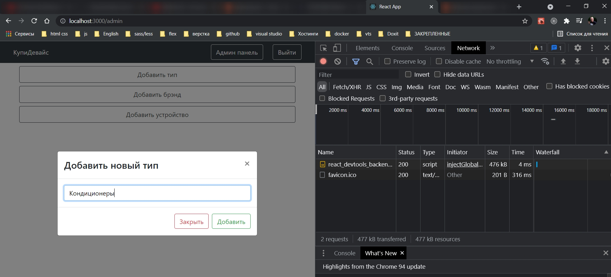

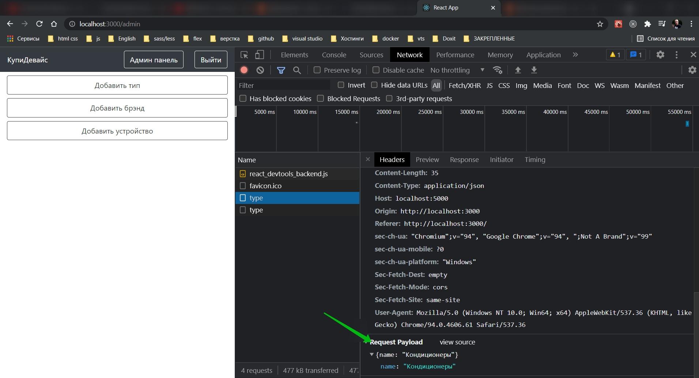

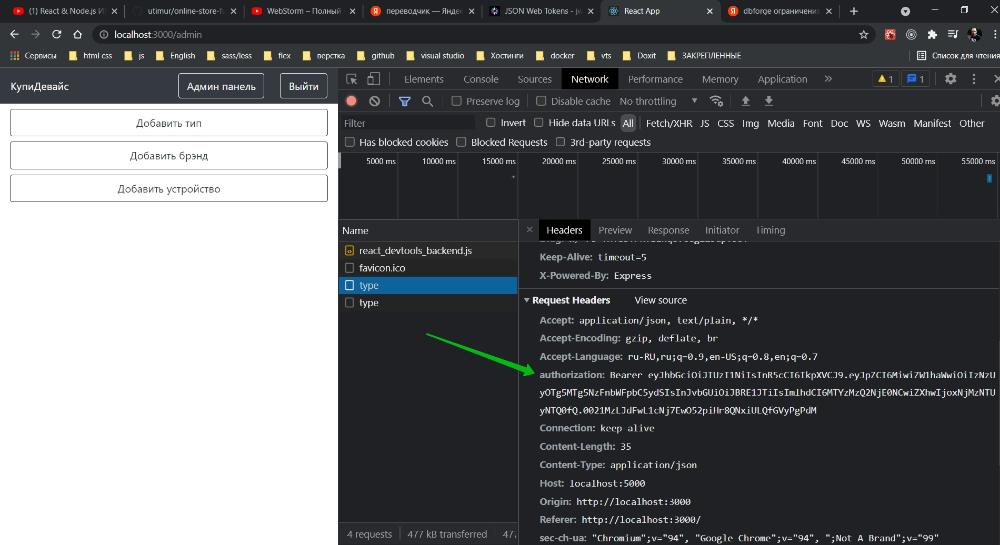

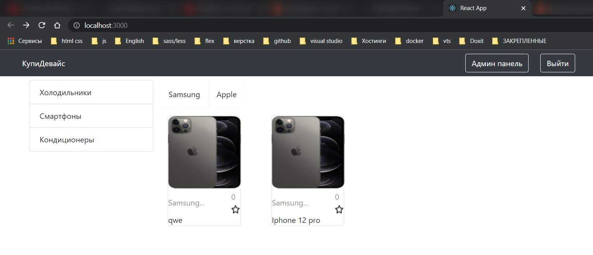

Теперь размеремся с брэндами.

через useState так же создаю состояние и так же создаю функцию **addBrand**.

```js
// components modal CreateBrand
import React, { useState } from 'react';
import { Modal, Button, Form } from 'react-bootstrap';
import { createBrand } from '../../http/deviceAPI';

const CreateBrand = ({ show, onHide }) => {
  const [value, setValue] = useState('');

  const addBrand = () => {
    createBrand({ name: value }).then((data) => {
      setValue('');
      onHide();
    });
  };

  return (
    <Modal show={show} onHide={onHide} size="lg" centered>
      <Modal.Header closeButton>
        <Modal.Title id="contained-modal-title-vcenter">
          Добавить новый брэнд
        </Modal.Title>
      </Modal.Header>
      <Modal.Body>
        <Form>
          <Form.Control
            value={value}
            onChange={(event) => setValue(event.target.value)}
            placeholder={'Введите название бренда'}
          />
        </Form>
      </Modal.Body>
      <Modal.Footer>
        <Button variant={'outline-danger'} onClick={onHide}>
          Закрыть
        </Button>
        <Button variant={'outline-success'} onClick={addBrand}>
          Добавить
        </Button>
      </Modal.Footer>
    </Modal>
  );
};

export default CreateBrand;
```


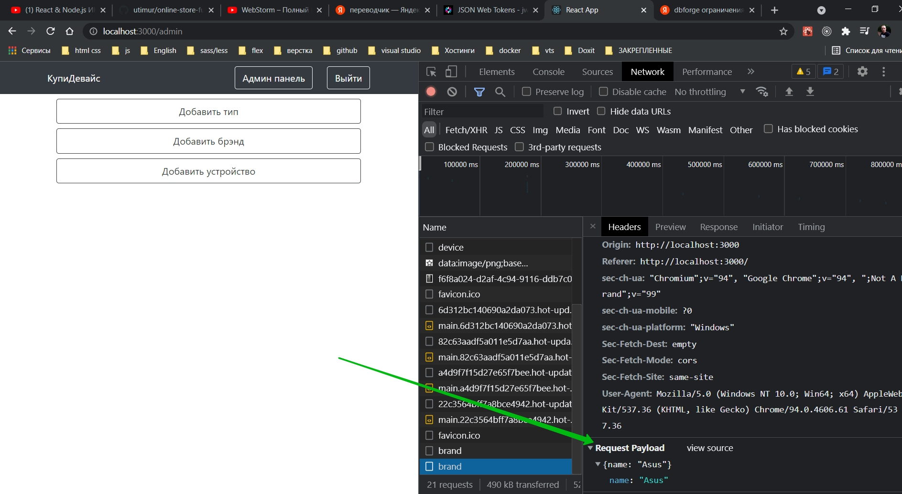

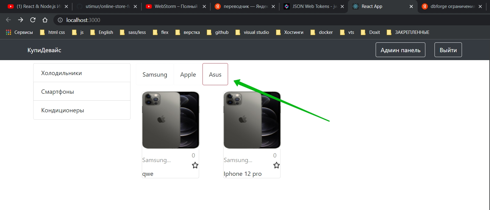

И остается последнее модальное окно с добавлением устройства. Здесь будет чуть посложнее.

```js
// components modal CreateDevice
import React, { useContext, useState } from 'react';
import { Modal, Form, Button, Dropdown, Row, Col } from 'react-bootstrap';
import { Context } from '../../index.js';

const CreateDevice = ({ show, onHide }) => {
  const { device } = useContext(Context);
  const [info, setInfo] = useState([]);

  const addInfo = () => {
    setInfo([...info, { title: '', description: '', number: Date.now() }]);
  };

  const removeInfo = (number) => {
    setInfo(info.filter((i) => i.number !== number));
  };

  return (
    <Modal show={show} onHide={onHide} size="lg" centered>
      <Modal.Header closeButton>
        <Modal.Title id="contained-modal-title-vcenter">
          Добавить новый девайс
        </Modal.Title>
      </Modal.Header>
      <Modal.Body>
        <Form>
          <Dropdown className="mt-2 mb-2">
            <Dropdown.Toggle>Выберите тип</Dropdown.Toggle>
            <Dropdown.Menu>
              {device.types.map((type) => (
                <Dropdown.Item key={type.id}>{type.name}</Dropdown.Item>
              ))}
            </Dropdown.Menu>
          </Dropdown>
          <Dropdown className="mt-2 mb-2">
            <Dropdown.Toggle>Выберите брэнд</Dropdown.Toggle>
            <Dropdown.Menu>
              {device.brands.map((brand) => (
                <Dropdown.Item key={brand.id}>{brand.name}</Dropdown.Item>
              ))}
            </Dropdown.Menu>
          </Dropdown>
          <Form.Control
            className="mt-3"
            placeholder="Введите название устройства"
          />
          <Form.Control
            className="mt-3"
            placeholder="Введите стоимость устройства"
            type="number"
          />
          <Form.Control className="mt-3" type="file" />
          <hr />
          <Button variant={'outline-dark'} onClick={addInfo}>
            Добавить новое свойство
          </Button>
          {info.map((i) => (
            <Row className="mt-3" key={i.number}>
              <Col md={4}>
                <Form.Control placeholder="Введите название" />
              </Col>
              <Col md={4}>
                <Form.Control placeholder="Введите описание" />
              </Col>
              <Col md={4}>
                <Button
                  variant={'outline-danger'}
                  onClick={() => removeInfo(i.number)}
                >
                  Удалить
                </Button>
              </Col>
            </Row>
          ))}
        </Form>
      </Modal.Body>
      <Modal.Footer>
        <Button variant={'outline-danger'} onClick={onHide}>
          Закрыть
        </Button>
        <Button variant={'outline-success'}>Добавить</Button>
      </Modal.Footer>
    </Modal>
  );
};

export default CreateDevice;
```

У нас здесь есть несколько **input** для характеристик, для стоимости, для названия и для файла. Все эти **input** нам сейчас необходимо оживить. По - этому для каждого создаем одноименное состояние.

```js
// components modal CreateDevice
import React, { useContext, useState } from 'react';
import { Modal, Form, Button, Dropdown, Row, Col } from 'react-bootstrap';
import { Context } from '../../index.js';

const CreateDevice = ({ show, onHide }) => {
  const { device } = useContext(Context);
  const [name, setName] = useState('');
  const [price, setPrice] = useState(0);
  const [file, setFile] = useState(null);

  // делаю состояние для выбанного брэнда и типа
  const [brand, setBrand] = useState(null);
  const [type, setType] = useState(null);
  const [info, setInfo] = useState([]);

  const addInfo = () => {
    setInfo([...info, { title: '', description: '', number: Date.now() }]);
  };

  const removeInfo = (number) => {
    setInfo(info.filter((i) => i.number !== number));
  };

  return (
    <Modal show={show} onHide={onHide} size="lg" centered>
      <Modal.Header closeButton>
        <Modal.Title id="contained-modal-title-vcenter">
          Добавить новый девайс
        </Modal.Title>
      </Modal.Header>
      <Modal.Body>
        <Form>
          <Dropdown className="mt-2 mb-2">
            <Dropdown.Toggle>Выберите тип</Dropdown.Toggle>
            <Dropdown.Menu>
              {device.types.map((type) => (
                <Dropdown.Item key={type.id}>{type.name}</Dropdown.Item>
              ))}
            </Dropdown.Menu>
          </Dropdown>
          <Dropdown className="mt-2 mb-2">
            <Dropdown.Toggle>Выберите брэнд</Dropdown.Toggle>
            <Dropdown.Menu>
              {device.brands.map((brand) => (
                <Dropdown.Item key={brand.id}>{brand.name}</Dropdown.Item>
              ))}
            </Dropdown.Menu>
          </Dropdown>
          <Form.Control
            className="mt-3"
            placeholder="Введите название устройства"
          />
          <Form.Control
            className="mt-3"
            placeholder="Введите стоимость устройства"
            type="number"
          />
          <Form.Control className="mt-3" type="file" />
          <hr />
          <Button variant={'outline-dark'} onClick={addInfo}>
            Добавить новое свойство
          </Button>
          {info.map((i) => (
            <Row className="mt-3" key={i.number}>
              <Col md={4}>
                <Form.Control placeholder="Введите название" />
              </Col>
              <Col md={4}>
                <Form.Control placeholder="Введите описание" />
              </Col>
              <Col md={4}>
                <Button
                  variant={'outline-danger'}
                  onClick={() => removeInfo(i.number)}
                >
                  Удалить
                </Button>
              </Col>
            </Row>
          ))}
        </Form>
      </Modal.Body>
      <Modal.Footer>
        <Button variant={'outline-danger'} onClick={onHide}>
          Закрыть
        </Button>
        <Button variant={'outline-success'}>Добавить</Button>
      </Modal.Footer>
    </Modal>
  );
};

export default CreateDevice;
```

Следующим этапом создаю функцию. Называю ее **selectFile**. Она будет вызываться в том случае когда мы выбрали **file** на компьютере. Параметром функция принимает **event**. Посмотрим в логах на поле **files** у **target**. И вешаем слушатель события **onChange** функцию **selectFile**.

```js
// components modal CreateDevice
import React, { useContext, useState } from 'react';
import { Modal, Form, Button, Dropdown, Row, Col } from 'react-bootstrap';
import { Context } from '../../index.js';

const CreateDevice = ({ show, onHide }) => {
  const { device } = useContext(Context);
  const [name, setName] = useState('');
  const [price, setPrice] = useState(0);
  const [file, setFile] = useState(null);

  // делаю состояние для выбанного брэнда и типа
  const [brand, setBrand] = useState(null);
  const [type, setType] = useState(null);
  const [info, setInfo] = useState([]);

  const addInfo = () => {
    setInfo([...info, { title: '', description: '', number: Date.now() }]);
  };

  const removeInfo = (number) => {
    setInfo(info.filter((i) => i.number !== number));
  };

  const selectFile = (event) => {
    console.log(event.target.files);
  };

  return (
    <Modal show={show} onHide={onHide} size="lg" centered>
      <Modal.Header closeButton>
        <Modal.Title id="contained-modal-title-vcenter">
          Добавить новый девайс
        </Modal.Title>
      </Modal.Header>
      <Modal.Body>
        <Form>
          <Dropdown className="mt-2 mb-2">
            <Dropdown.Toggle>Выберите тип</Dropdown.Toggle>
            <Dropdown.Menu>
              {device.types.map((type) => (
                <Dropdown.Item key={type.id}>{type.name}</Dropdown.Item>
              ))}
            </Dropdown.Menu>
          </Dropdown>
          <Dropdown className="mt-2 mb-2">
            <Dropdown.Toggle>Выберите брэнд</Dropdown.Toggle>
            <Dropdown.Menu>
              {device.brands.map((brand) => (
                <Dropdown.Item key={brand.id}>{brand.name}</Dropdown.Item>
              ))}
            </Dropdown.Menu>
          </Dropdown>
          <Form.Control
            className="mt-3"
            placeholder="Введите название устройства"
          />
          <Form.Control
            className="mt-3"
            placeholder="Введите стоимость устройства"
            type="number"
          />
          <Form.Control onChange={selectFile} className="mt-3" type="file" />
          <hr />
          <Button variant={'outline-dark'} onClick={addInfo}>
            Добавить новое свойство
          </Button>
          {info.map((i) => (
            <Row className="mt-3" key={i.number}>
              <Col md={4}>
                <Form.Control placeholder="Введите название" />
              </Col>
              <Col md={4}>
                <Form.Control placeholder="Введите описание" />
              </Col>
              <Col md={4}>
                <Button
                  variant={'outline-danger'}
                  onClick={() => removeInfo(i.number)}
                >
                  Удалить
                </Button>
              </Col>
            </Row>
          ))}
        </Form>
      </Modal.Body>
      <Modal.Footer>
        <Button variant={'outline-danger'} onClick={onHide}>
          Закрыть
        </Button>
        <Button variant={'outline-success'}>Добавить</Button>
      </Modal.Footer>
    </Modal>
  );
};

export default CreateDevice;
```

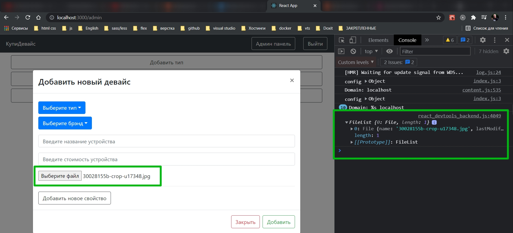

И видим в логах массив состоящий из одного элемента как раз с тем файлом который мы выбрали. Соответственно нам этот файл в состоянии необходимо сохранить **setFile(event=>event.target.files[0])**. По нулевому индексу обращаемся к массиву и сохраняем его в состояние

```js
// components modal CreateDevice
import React, { useContext, useState } from 'react';
import { Modal, Form, Button, Dropdown, Row, Col } from 'react-bootstrap';
import { Context } from '../../index.js';

const CreateDevice = ({ show, onHide }) => {
  const { device } = useContext(Context);
  const [name, setName] = useState('');
  const [price, setPrice] = useState(0);
  const [file, setFile] = useState(null);

  // делаю состояние для выбанного брэнда и типа
  const [brand, setBrand] = useState(null);
  const [type, setType] = useState(null);
  const [info, setInfo] = useState([]);

  const addInfo = () => {
    setInfo([...info, { title: '', description: '', number: Date.now() }]);
  };

  const removeInfo = (number) => {
    setInfo(info.filter((i) => i.number !== number));
  };

  const selectFile = (event) => {
    setFile(event.target.files[0]);
  };

  return (
    <Modal show={show} onHide={onHide} size="lg" centered>
      <Modal.Header closeButton>
        <Modal.Title id="contained-modal-title-vcenter">
          Добавить новый девайс
        </Modal.Title>
      </Modal.Header>
      <Modal.Body>
        <Form>
          <Dropdown className="mt-2 mb-2">
            <Dropdown.Toggle>Выберите тип</Dropdown.Toggle>
            <Dropdown.Menu>
              {device.types.map((type) => (
                <Dropdown.Item key={type.id}>{type.name}</Dropdown.Item>
              ))}
            </Dropdown.Menu>
          </Dropdown>
          <Dropdown className="mt-2 mb-2">
            <Dropdown.Toggle>Выберите брэнд</Dropdown.Toggle>
            <Dropdown.Menu>
              {device.brands.map((brand) => (
                <Dropdown.Item key={brand.id}>{brand.name}</Dropdown.Item>
              ))}
            </Dropdown.Menu>
          </Dropdown>
          <Form.Control
            className="mt-3"
            placeholder="Введите название устройства"
          />
          <Form.Control
            className="mt-3"
            placeholder="Введите стоимость устройства"
            type="number"
          />
          <Form.Control onChange={selectFile} className="mt-3" type="file" />
          <hr />
          <Button variant={'outline-dark'} onClick={addInfo}>
            Добавить новое свойство
          </Button>
          {info.map((i) => (
            <Row className="mt-3" key={i.number}>
              <Col md={4}>
                <Form.Control placeholder="Введите название" />
              </Col>
              <Col md={4}>
                <Form.Control placeholder="Введите описание" />
              </Col>
              <Col md={4}>
                <Button
                  variant={'outline-danger'}
                  onClick={() => removeInfo(i.number)}
                >
                  Удалить
                </Button>
              </Col>
            </Row>
          ))}
        </Form>
      </Modal.Body>
      <Modal.Footer>
        <Button variant={'outline-danger'} onClick={onHide}>
          Закрыть
        </Button>
        <Button variant={'outline-success'}>Добавить</Button>
      </Modal.Footer>
    </Modal>
  );
};

export default CreateDevice;
```

Теперь оживляю и другие **input**. В **input** со стоимостью, при изменении состояния привожу все к числовому значению с помощью функции **Number**.

```js
// components modal CreateDevice
import React, { useContext, useState } from 'react';
import { Modal, Form, Button, Dropdown, Row, Col } from 'react-bootstrap';
import { Context } from '../../index.js';

const CreateDevice = ({ show, onHide }) => {
  const { device } = useContext(Context);
  const [name, setName] = useState('');
  const [price, setPrice] = useState(0);
  const [file, setFile] = useState(null);

  // делаю состояние для выбанного брэнда и типа
  const [brand, setBrand] = useState(null);
  const [type, setType] = useState(null);
  const [info, setInfo] = useState([]);

  const addInfo = () => {
    setInfo([...info, { title: '', description: '', number: Date.now() }]);
  };

  const removeInfo = (number) => {
    setInfo(info.filter((i) => i.number !== number));
  };

  const selectFile = (event) => {
    setFile(event.target.files[0]);
  };

  return (
    <Modal show={show} onHide={onHide} size="lg" centered>
      <Modal.Header closeButton>
        <Modal.Title id="contained-modal-title-vcenter">
          Добавить новый девайс
        </Modal.Title>
      </Modal.Header>
      <Modal.Body>
        <Form>
          <Dropdown className="mt-2 mb-2">
            <Dropdown.Toggle>Выберите тип</Dropdown.Toggle>
            <Dropdown.Menu>
              {device.types.map((type) => (
                <Dropdown.Item key={type.id}>{type.name}</Dropdown.Item>
              ))}
            </Dropdown.Menu>
          </Dropdown>
          <Dropdown className="mt-2 mb-2">
            <Dropdown.Toggle>Выберите брэнд</Dropdown.Toggle>
            <Dropdown.Menu>
              {device.brands.map((brand) => (
                <Dropdown.Item key={brand.id}>{brand.name}</Dropdown.Item>
              ))}
            </Dropdown.Menu>
          </Dropdown>
          <Form.Control
            value={name}
            onChange={(event) => setName(event.target.value)}
            className="mt-3"
            placeholder="Введите название устройства"
          />
          <Form.Control
            value={price}
            onChange={(event) => setPrice(Number(event.target.value))}
            className="mt-3"
            placeholder="Введите стоимость устройства"
            type="number"
          />
          <Form.Control onChange={selectFile} className="mt-3" type="file" />
          <hr />
          <Button variant={'outline-dark'} onClick={addInfo}>
            Добавить новое свойство
          </Button>
          {info.map((i) => (
            <Row className="mt-3" key={i.number}>
              <Col md={4}>
                <Form.Control placeholder="Введите название" />
              </Col>
              <Col md={4}>
                <Form.Control placeholder="Введите описание" />
              </Col>
              <Col md={4}>
                <Button
                  variant={'outline-danger'}
                  onClick={() => removeInfo(i.number)}
                >
                  Удалить
                </Button>
              </Col>
            </Row>
          ))}
        </Form>
      </Modal.Body>
      <Modal.Footer>
        <Button variant={'outline-danger'} onClick={onHide}>
          Закрыть
        </Button>
        <Button variant={'outline-success'}>Добавить</Button>
      </Modal.Footer>
    </Modal>
  );
};

export default CreateDevice;
```

Теперь перехожу к выпадающим меню.

В **CreateDevice** вот это состояние можно убрать.

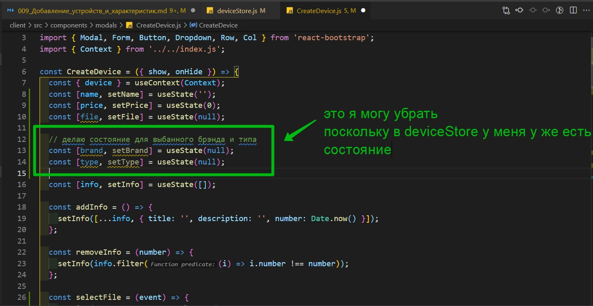

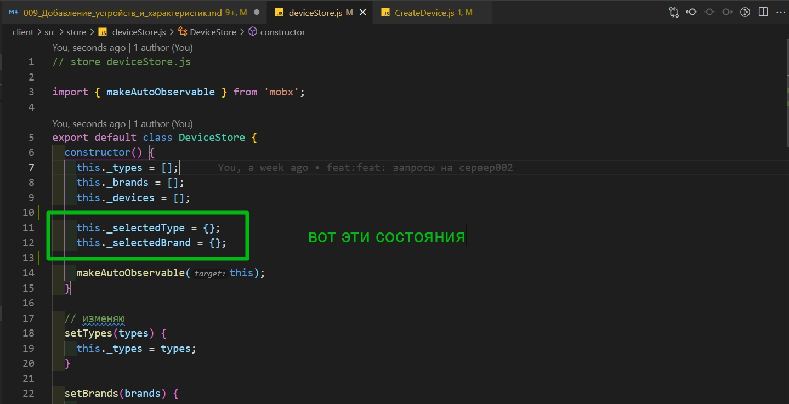

```js
// components modal CreateDevice
import React, { useContext, useState } from 'react';
import { Modal, Form, Button, Dropdown, Row, Col } from 'react-bootstrap';
import { Context } from '../../index.js';

const CreateDevice = ({ show, onHide }) => {
  const { device } = useContext(Context);
  const [name, setName] = useState('');
  const [price, setPrice] = useState(0);
  const [file, setFile] = useState(null);

  const [info, setInfo] = useState([]);

  const addInfo = () => {
    setInfo([...info, { title: '', description: '', number: Date.now() }]);
  };

  const removeInfo = (number) => {
    setInfo(info.filter((i) => i.number !== number));
  };

  const selectFile = (event) => {
    setFile(event.target.files[0]);
  };

  return (
    <Modal show={show} onHide={onHide} size="lg" centered>
      <Modal.Header closeButton>
        <Modal.Title id="contained-modal-title-vcenter">
          Добавить новый девайс
        </Modal.Title>
      </Modal.Header>
      <Modal.Body>
        <Form>
          <Dropdown className="mt-2 mb-2">
            <Dropdown.Toggle>Выберите тип</Dropdown.Toggle>
            <Dropdown.Menu>
              {device.types.map((type) => (
                <Dropdown.Item key={type.id}>{type.name}</Dropdown.Item>
              ))}
            </Dropdown.Menu>
          </Dropdown>
          <Dropdown className="mt-2 mb-2">
            <Dropdown.Toggle>Выберите брэнд</Dropdown.Toggle>
            <Dropdown.Menu>
              {device.brands.map((brand) => (
                <Dropdown.Item key={brand.id}>{brand.name}</Dropdown.Item>
              ))}
            </Dropdown.Menu>
          </Dropdown>
          <Form.Control
            value={name}
            onChange={(event) => setName(event.target.value)}
            className="mt-3"
            placeholder="Введите название устройства"
          />
          <Form.Control
            value={price}
            onChange={(event) => setPrice(Number(event.target.value))}
            className="mt-3"
            placeholder="Введите стоимость устройства"
            type="number"
          />
          <Form.Control onChange={selectFile} className="mt-3" type="file" />
          <hr />
          <Button variant={'outline-dark'} onClick={addInfo}>
            Добавить новое свойство
          </Button>
          {info.map((i) => (
            <Row className="mt-3" key={i.number}>
              <Col md={4}>
                <Form.Control placeholder="Введите название" />
              </Col>
              <Col md={4}>
                <Form.Control placeholder="Введите описание" />
              </Col>
              <Col md={4}>
                <Button
                  variant={'outline-danger'}
                  onClick={() => removeInfo(i.number)}
                >
                  Удалить
                </Button>
              </Col>
            </Row>
          ))}
        </Form>
      </Modal.Body>
      <Modal.Footer>
        <Button variant={'outline-danger'} onClick={onHide}>
          Закрыть
        </Button>
        <Button variant={'outline-success'}>Добавить</Button>
      </Modal.Footer>
    </Modal>
  );
};

export default CreateDevice;
```

```js
// store deviceStore.js

import { makeAutoObservable } from 'mobx';

export default class DeviceStore {
  constructor() {
    this._types = [];
    this._brands = [];
    this._devices = [];

    this._selectedType = {};
    this._selectedBrand = {};

    makeAutoObservable(this);
  }

  // изменяю
  setTypes(types) {
    this._types = types;
  }

  setBrands(brands) {
    this._brands = brands;
  }

  setDevices(devices) {
    this._devices = devices;
  }

  setSelectedType(type) {
    this._selectedType = type;
  }

  setSelectedBrand(brand) {
    this._selectedBrand = brand;
  }

  // получаю данные
  get types() {
    return this._types;
  }

  get brands() {
    return this._brands;
  }

  get devices() {
    return this._brands;
  }
  get selectedType() {
    return this._selectedType;
  }
  get selectedBrand() {
    return this._selectedBrand;
  }
}
```

Далее в **createDevice** на элемент выпадающего списка добавляю слушатель нажатия **onChange** и в **device** вызываю функцию либо **setSelectedType** либо **setSelectedBrand**.

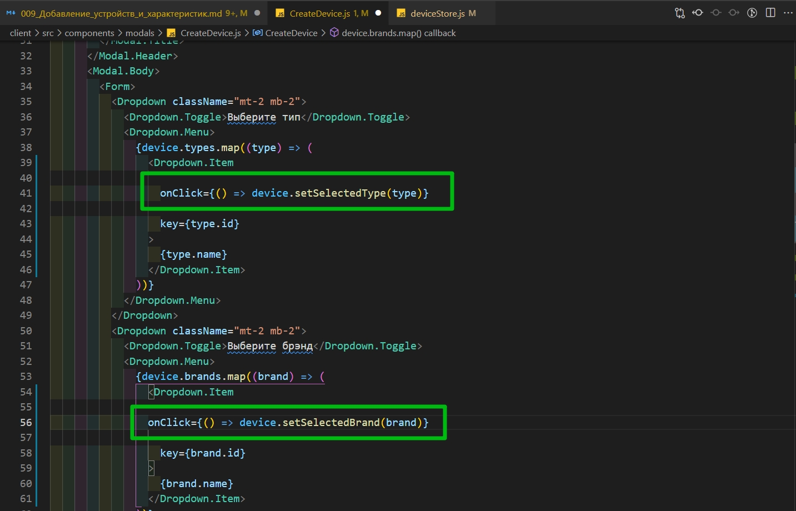

```js
// components modal CreateDevice
import React, { useContext, useState } from 'react';
import { Modal, Form, Button, Dropdown, Row, Col } from 'react-bootstrap';
import { Context } from '../../index.js';

const CreateDevice = ({ show, onHide }) => {
  const { device } = useContext(Context);
  const [name, setName] = useState('');
  const [price, setPrice] = useState(0);
  const [file, setFile] = useState(null);

  const [info, setInfo] = useState([]);

  const addInfo = () => {
    setInfo([...info, { title: '', description: '', number: Date.now() }]);
  };

  const removeInfo = (number) => {
    setInfo(info.filter((i) => i.number !== number));
  };

  const selectFile = (event) => {
    setFile(event.target.files[0]);
  };

  return (
    <Modal show={show} onHide={onHide} size="lg" centered>
      <Modal.Header closeButton>
        <Modal.Title id="contained-modal-title-vcenter">
          Добавить новый девайс
        </Modal.Title>
      </Modal.Header>
      <Modal.Body>
        <Form>
          <Dropdown className="mt-2 mb-2">
            <Dropdown.Toggle>Выберите тип</Dropdown.Toggle>
            <Dropdown.Menu>
              {device.types.map((type) => (
                <Dropdown.Item
                  onClick={() => device.setSelectedType(type)}
                  key={type.id}
                >
                  {type.name}
                </Dropdown.Item>
              ))}
            </Dropdown.Menu>
          </Dropdown>
          <Dropdown className="mt-2 mb-2">
            <Dropdown.Toggle>Выберите брэнд</Dropdown.Toggle>
            <Dropdown.Menu>
              {device.brands.map((brand) => (
                <Dropdown.Item
                  onClick={() => device.setSelectedBrand(brand)}
                  key={brand.id}
                >
                  {brand.name}
                </Dropdown.Item>
              ))}
            </Dropdown.Menu>
          </Dropdown>
          <Form.Control
            value={name}
            onChange={(event) => setName(event.target.value)}
            className="mt-3"
            placeholder="Введите название устройства"
          />
          <Form.Control
            value={price}
            onChange={(event) => setPrice(Number(event.target.value))}
            className="mt-3"
            placeholder="Введите стоимость устройства"
            type="number"
          />
          <Form.Control onChange={selectFile} className="mt-3" type="file" />
          <hr />
          <Button variant={'outline-dark'} onClick={addInfo}>
            Добавить новое свойство
          </Button>
          {info.map((i) => (
            <Row className="mt-3" key={i.number}>
              <Col md={4}>
                <Form.Control placeholder="Введите название" />
              </Col>
              <Col md={4}>
                <Form.Control placeholder="Введите описание" />
              </Col>
              <Col md={4}>
                <Button
                  variant={'outline-danger'}
                  onClick={() => removeInfo(i.number)}
                >
                  Удалить
                </Button>
              </Col>
            </Row>
          ))}
        </Form>
      </Modal.Body>
      <Modal.Footer>
        <Button variant={'outline-danger'} onClick={onHide}>
          Закрыть
        </Button>
        <Button variant={'outline-success'}>Добавить</Button>
      </Modal.Footer>
    </Modal>
  );
};

export default CreateDevice;
```

И так же будем изменять название кнопок.

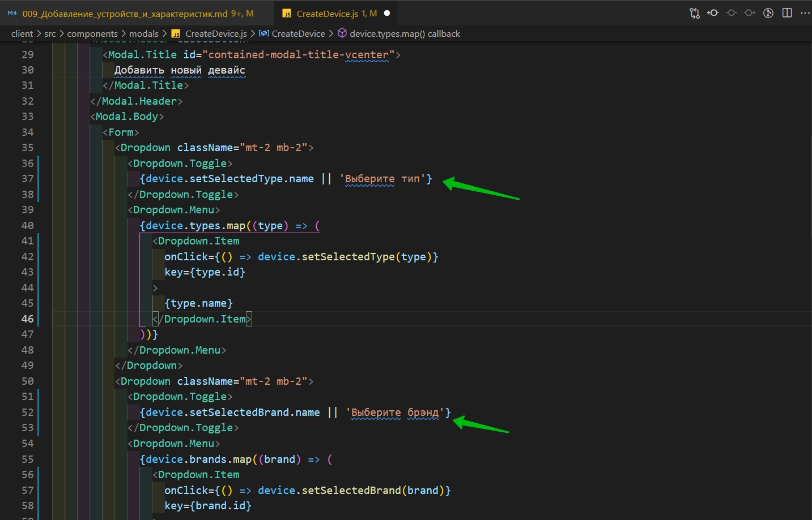

```js
// components modal CreateDevice
import React, { useContext, useState } from 'react';
import { Modal, Form, Button, Dropdown, Row, Col } from 'react-bootstrap';
import { Context } from '../../index.js';

const CreateDevice = ({ show, onHide }) => {
  const { device } = useContext(Context);
  const [name, setName] = useState('');
  const [price, setPrice] = useState(0);
  const [file, setFile] = useState(null);

  const [info, setInfo] = useState([]);

  const addInfo = () => {
    setInfo([...info, { title: '', description: '', number: Date.now() }]);
  };

  const removeInfo = (number) => {
    setInfo(info.filter((i) => i.number !== number));
  };

  const selectFile = (event) => {
    setFile(event.target.files[0]);
  };

  return (
    <Modal show={show} onHide={onHide} size="lg" centered>
      <Modal.Header closeButton>
        <Modal.Title id="contained-modal-title-vcenter">
          Добавить новый девайс
        </Modal.Title>
      </Modal.Header>
      <Modal.Body>
        <Form>
          <Dropdown className="mt-2 mb-2">
            <Dropdown.Toggle>
              {device.setSelectedType.name || 'Выберите тип'}
            </Dropdown.Toggle>
            <Dropdown.Menu>
              {device.types.map((type) => (
                <Dropdown.Item
                  onClick={() => device.setSelectedType(type)}
                  key={type.id}
                >
                  {type.name}
                </Dropdown.Item>
              ))}
            </Dropdown.Menu>
          </Dropdown>
          <Dropdown className="mt-2 mb-2">
            <Dropdown.Toggle>
              {device.setSelectedBrand.name || 'Выберите брэнд'}
            </Dropdown.Toggle>
            <Dropdown.Menu>
              {device.brands.map((brand) => (
                <Dropdown.Item
                  onClick={() => device.setSelectedBrand(brand)}
                  key={brand.id}
                >
                  {brand.name}
                </Dropdown.Item>
              ))}
            </Dropdown.Menu>
          </Dropdown>
          <Form.Control
            value={name}
            onChange={(event) => setName(event.target.value)}
            className="mt-3"
            placeholder="Введите название устройства"
          />
          <Form.Control
            value={price}
            onChange={(event) => setPrice(Number(event.target.value))}
            className="mt-3"
            placeholder="Введите стоимость устройства"
            type="number"
          />
          <Form.Control onChange={selectFile} className="mt-3" type="file" />
          <hr />
          <Button variant={'outline-dark'} onClick={addInfo}>
            Добавить новое свойство
          </Button>
          {info.map((i) => (
            <Row className="mt-3" key={i.number}>
              <Col md={4}>
                <Form.Control placeholder="Введите название" />
              </Col>
              <Col md={4}>
                <Form.Control placeholder="Введите описание" />
              </Col>
              <Col md={4}>
                <Button
                  variant={'outline-danger'}
                  onClick={() => removeInfo(i.number)}
                >
                  Удалить
                </Button>
              </Col>
            </Row>
          ))}
        </Form>
      </Modal.Body>
      <Modal.Footer>
        <Button variant={'outline-danger'} onClick={onHide}>
          Закрыть
        </Button>
        <Button variant={'outline-success'}>Добавить</Button>
      </Modal.Footer>
    </Modal>
  );
};

export default CreateDevice;
```

Если я сейчас попробую открыть какой-нибудь из выпадающих списков то я ничего не увижу. Ведь не брэнды ни типы я нигде не подгружаю.

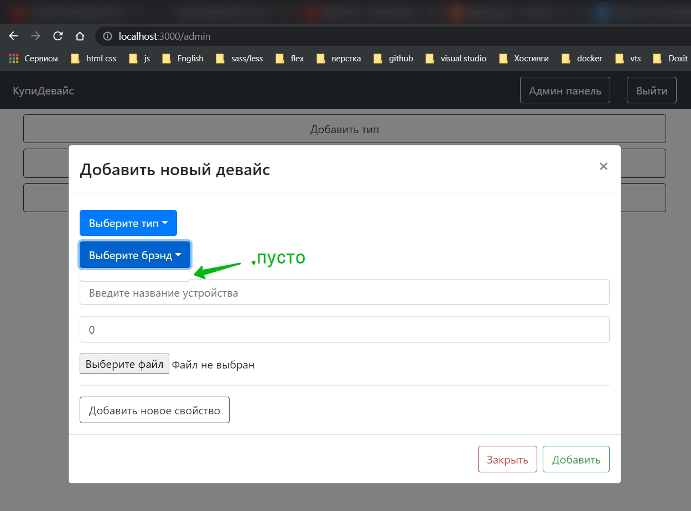

Для этого прописываю **useEffect** в котором при первой загрузке подгружаю все интересующие нас данные.

```js
// components modal CreateDevice
import React, { useContext, useEffect, useState } from 'react';
import { Modal, Form, Button, Dropdown, Row, Col } from 'react-bootstrap';
import { fetchBrands, fetchTypes } from '../../http/deviceAPI.js';
import { Context } from '../../index.js';

const CreateDevice = ({ show, onHide }) => {
  const { device } = useContext(Context);
  const [name, setName] = useState('');
  const [price, setPrice] = useState(0);
  const [file, setFile] = useState(null);
  const [info, setInfo] = useState([]);

  useEffect(
    () => {
      fetchTypes().then((data) => device.setTypes(data));
      fetchBrands().then((data) => device.setBrands(data));
    },
    // eslint-disable-next-line react-hooks/exhaustive-deps
    []
  );

  const addInfo = () => {
    setInfo([...info, { title: '', description: '', number: Date.now() }]);
  };

  const removeInfo = (number) => {
    setInfo(info.filter((i) => i.number !== number));
  };

  const selectFile = (event) => {
    setFile(event.target.files[0]);
  };

  return (
    <Modal show={show} onHide={onHide} size="lg" centered>
      <Modal.Header closeButton>
        <Modal.Title id="contained-modal-title-vcenter">
          Добавить новый девайс
        </Modal.Title>
      </Modal.Header>
      <Modal.Body>
        <Form>
          <Dropdown className="mt-2 mb-2">
            <Dropdown.Toggle>
              {device.selectedType.name || 'Выберите тип'}
            </Dropdown.Toggle>
            <Dropdown.Menu>
              {device.types.map((type) => (
                <Dropdown.Item
                  onClick={() => device.setSelectedType(type)}
                  key={type.id}
                >
                  {type.name}
                </Dropdown.Item>
              ))}
            </Dropdown.Menu>
          </Dropdown>
          <Dropdown className="mt-2 mb-2">
            <Dropdown.Toggle>
              {device.selectedBrand.name || 'Выберите бренд'}
            </Dropdown.Toggle>
            <Dropdown.Menu>
              {device.brands.map((brand) => (
                <Dropdown.Item
                  onClick={() => device.setSelectedBrand(brand)}
                  key={brand.id}
                >
                  {brand.name}
                </Dropdown.Item>
              ))}
            </Dropdown.Menu>
          </Dropdown>
          <Form.Control
            value={name}
            onChange={(event) => setName(event.target.value)}
            className="mt-3"
            placeholder="Введите название устройства"
          />
          <Form.Control
            value={price}
            onChange={(event) => setPrice(Number(event.target.value))}
            className="mt-3"
            placeholder="Введите стоимость устройства"
            type="number"
          />
          <Form.Control onChange={selectFile} className="mt-3" type="file" />
          <hr />
          <Button variant={'outline-dark'} onClick={addInfo}>
            Добавить новое свойство
          </Button>
          {info.map((i) => (
            <Row className="mt-3" key={i.number}>
              <Col md={4}>
                <Form.Control placeholder="Введите название" />
              </Col>
              <Col md={4}>
                <Form.Control placeholder="Введите описание" />
              </Col>
              <Col md={4}>
                <Button
                  variant={'outline-danger'}
                  onClick={() => removeInfo(i.number)}
                >
                  Удалить
                </Button>
              </Col>
            </Row>
          ))}
        </Form>
      </Modal.Body>
      <Modal.Footer>
        <Button variant={'outline-danger'} onClick={onHide}>
          Закрыть
        </Button>
        <Button variant={'outline-success'}>Добавить</Button>
      </Modal.Footer>
    </Modal>
  );
};

export default CreateDevice;
```

Видим что появились как типы так и бренды.

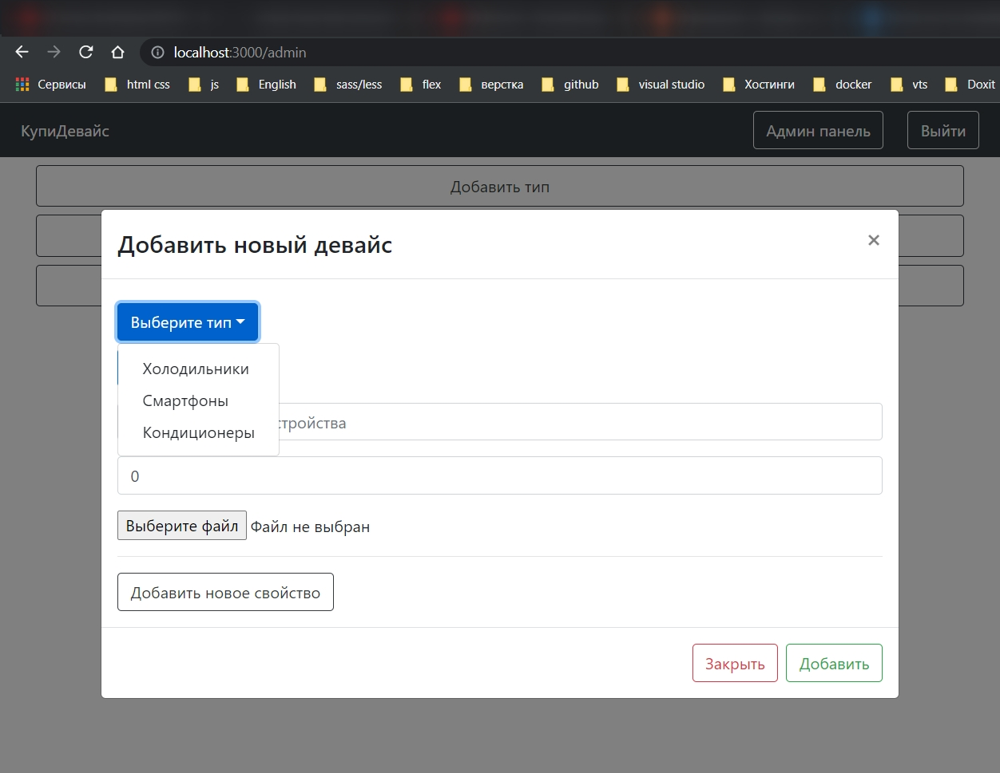

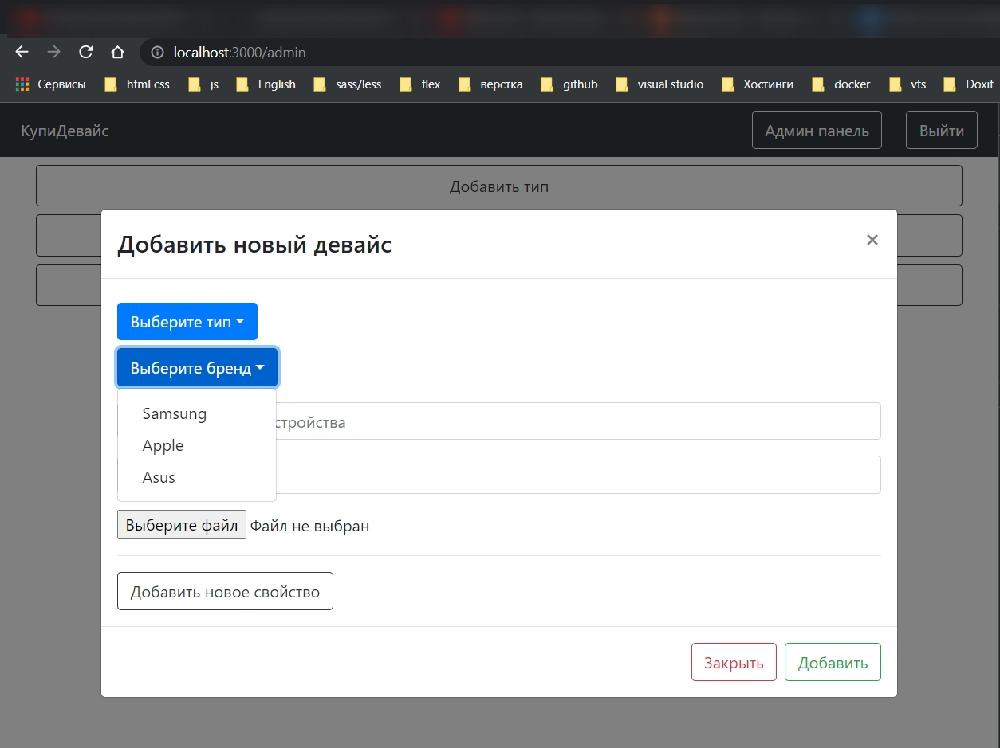

Обернем модальное окно в **observer**. Для того что бы мы могли выбирать что-то из выпадающего списка и сразу видеть ререндеринг.

```js
// components modal CreateDevice
import React, { useContext, useEffect, useState } from 'react';
import { Modal, Form, Button, Dropdown, Row, Col } from 'react-bootstrap';
import { fetchBrands, fetchTypes } from '../../http/deviceAPI.js';
import { Context } from '../../index.js';
import { observer } from 'mobx-react-lite';

const CreateDevice = observer(({ show, onHide }) => {
  const { device } = useContext(Context);
  const [name, setName] = useState('');
  const [price, setPrice] = useState(0);
  const [file, setFile] = useState(null);
  const [info, setInfo] = useState([]);

  useEffect(
    () => {
      fetchTypes().then((data) => device.setTypes(data));
      fetchBrands().then((data) => device.setBrands(data));
    },
    // eslint-disable-next-line react-hooks/exhaustive-deps
    []
  );

  const addInfo = () => {
    setInfo([...info, { title: '', description: '', number: Date.now() }]);
  };

  const removeInfo = (number) => {
    setInfo(info.filter((i) => i.number !== number));
  };

  const selectFile = (event) => {
    setFile(event.target.files[0]);
  };

  return (
    <Modal show={show} onHide={onHide} size="lg" centered>
      <Modal.Header closeButton>
        <Modal.Title id="contained-modal-title-vcenter">
          Добавить новый девайс
        </Modal.Title>
      </Modal.Header>
      <Modal.Body>
        <Form>
          <Dropdown className="mt-2 mb-2">
            <Dropdown.Toggle>
              {device.selectedType.name || 'Выберите тип'}
            </Dropdown.Toggle>
            <Dropdown.Menu>
              {device.types.map((type) => (
                <Dropdown.Item
                  onClick={() => device.setSelectedType(type)}
                  key={type.id}
                >
                  {type.name}
                </Dropdown.Item>
              ))}
            </Dropdown.Menu>
          </Dropdown>
          <Dropdown className="mt-2 mb-2">
            <Dropdown.Toggle>
              {device.selectedBrand.name || 'Выберите бренд'}
            </Dropdown.Toggle>
            <Dropdown.Menu>
              {device.brands.map((brand) => (
                <Dropdown.Item
                  onClick={() => device.setSelectedBrand(brand)}
                  key={brand.id}
                >
                  {brand.name}
                </Dropdown.Item>
              ))}
            </Dropdown.Menu>
          </Dropdown>
          <Form.Control
            value={name}
            onChange={(event) => setName(event.target.value)}
            className="mt-3"
            placeholder="Введите название устройства"
          />
          <Form.Control
            value={price}
            onChange={(event) => setPrice(Number(event.target.value))}
            className="mt-3"
            placeholder="Введите стоимость устройства"
            type="number"
          />
          <Form.Control onChange={selectFile} className="mt-3" type="file" />
          <hr />
          <Button variant={'outline-dark'} onClick={addInfo}>
            Добавить новое свойство
          </Button>
          {info.map((i) => (
            <Row className="mt-3" key={i.number}>
              <Col md={4}>
                <Form.Control placeholder="Введите название" />
              </Col>
              <Col md={4}>
                <Form.Control placeholder="Введите описание" />
              </Col>
              <Col md={4}>
                <Button
                  variant={'outline-danger'}
                  onClick={() => removeInfo(i.number)}
                >
                  Удалить
                </Button>
              </Col>
            </Row>
          ))}
        </Form>
      </Modal.Body>
      <Modal.Footer>
        <Button variant={'outline-danger'} onClick={onHide}>
          Закрыть
        </Button>
        <Button variant={'outline-success'}>Добавить</Button>
      </Modal.Footer>
    </Modal>
  );
});

export default CreateDevice;
```


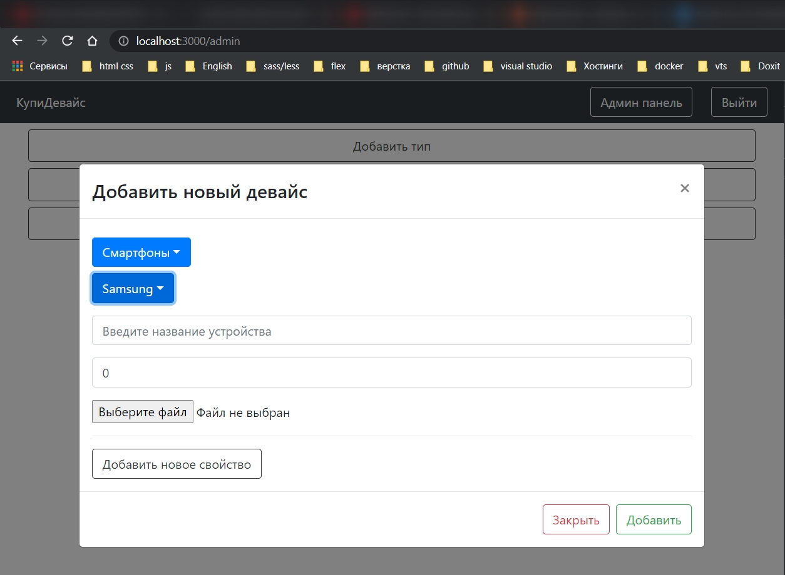

Теперьнужно разобраться с характеристиками. Они как бы в массив добавляются, но **title** и **description** для каждого объекта пустой.

Создаю функцию. Называю ее **changeInfo**. Параметрами она будет принимать **key**, **value**, **number**.

- **key** - это либо **tytle** или **discription**,
- **value** - значение которое мы по key будем устанавливать
- **number** - номер характеристики по которой мы это значение будем изменять.

вызываю фугкцию **setInfo** и в ней с помощью **map** пробегаюсь по **info**. Проверяю если **i.number** совпадает с **number**, т.е. если номер совпадает с элементом итерации, то тогда мы возвращаем новый объект. Разворачиваем в него характеристику **...i**, и по **[key]:** заменяем у нее поле **value**. В ином случае возвращаем объект не измененным **: i**.

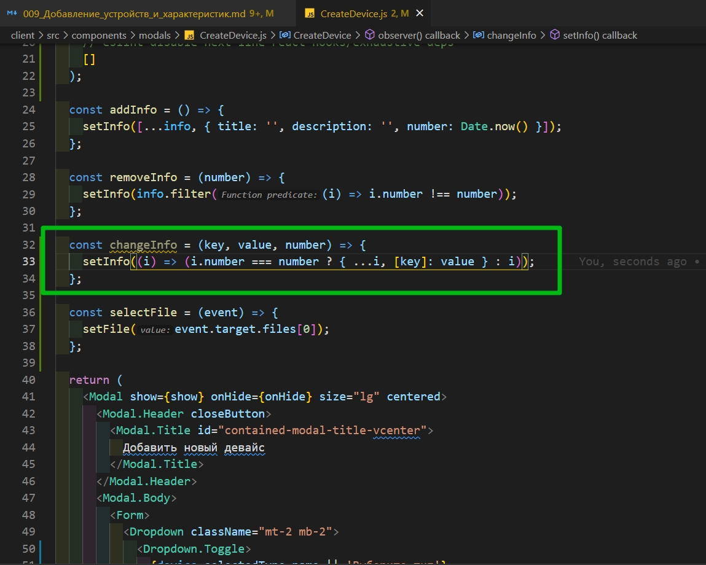

И теперь реализуем функцию которая будет отправлять запрос на сервер и добавлять новое устройство. И пока что просто в логи выведем массив информации.

```js
// components modal CreateDevice
import React, { useContext, useEffect, useState } from 'react';
import { Modal, Form, Button, Dropdown, Row, Col } from 'react-bootstrap';
import { fetchBrands, fetchTypes } from '../../http/deviceAPI.js';
import { Context } from '../../index.js';
import { observer } from 'mobx-react-lite';

const CreateDevice = observer(({ show, onHide }) => {
  const { device } = useContext(Context);
  const [name, setName] = useState('');
  const [price, setPrice] = useState(0);
  const [file, setFile] = useState(null);
  const [info, setInfo] = useState([]);

  useEffect(
    () => {
      fetchTypes().then((data) => device.setTypes(data));
      fetchBrands().then((data) => device.setBrands(data));
    },
    // eslint-disable-next-line react-hooks/exhaustive-deps
    []
  );

  const addInfo = () => {
    setInfo([...info, { title: '', description: '', number: Date.now() }]);
  };

  const removeInfo = (number) => {
    setInfo(info.filter((i) => i.number !== number));
  };

  const changeInfo = (key, value, number) => {
    setInfo(
      info.map((i) => (i.number === number ? { ...i, [key]: value } : i))
    );
  };

  // Отправляю запрос на сервер
  const addDevice = () => {
    console.log(info);
  };

  const selectFile = (event) => {
    setFile(event.target.files[0]);
  };

  return (
    <Modal show={show} onHide={onHide} size="lg" centered>
      <Modal.Header closeButton>
        <Modal.Title id="contained-modal-title-vcenter">
          Добавить новый девайс
        </Modal.Title>
      </Modal.Header>
      <Modal.Body>
        <Form>
          <Dropdown className="mt-2 mb-2">
            <Dropdown.Toggle>
              {device.selectedType.name || 'Выберите тип'}
            </Dropdown.Toggle>
            <Dropdown.Menu>
              {device.types.map((type) => (
                <Dropdown.Item
                  onClick={() => device.setSelectedType(type)}
                  key={type.id}
                >
                  {type.name}
                </Dropdown.Item>
              ))}
            </Dropdown.Menu>
          </Dropdown>
          <Dropdown className="mt-2 mb-2">
            <Dropdown.Toggle>
              {device.selectedBrand.name || 'Выберите бренд'}
            </Dropdown.Toggle>
            <Dropdown.Menu>
              {device.brands.map((brand) => (
                <Dropdown.Item
                  onClick={() => device.setSelectedBrand(brand)}
                  key={brand.id}
                >
                  {brand.name}
                </Dropdown.Item>
              ))}
            </Dropdown.Menu>
          </Dropdown>
          <Form.Control
            value={name}
            onChange={(event) => setName(event.target.value)}
            className="mt-3"
            placeholder="Введите название устройства"
          />
          <Form.Control
            value={price}
            onChange={(event) => setPrice(Number(event.target.value))}
            className="mt-3"
            placeholder="Введите стоимость устройства"
            type="number"
          />
          <Form.Control onChange={selectFile} className="mt-3" type="file" />
          <hr />
          <Button variant={'outline-dark'} onClick={addInfo}>
            Добавить новое свойство
          </Button>
          {info.map((i) => (
            <Row className="mt-3" key={i.number}>
              <Col md={4}>
                <Form.Control placeholder="Введите название" />
              </Col>
              <Col md={4}>
                <Form.Control placeholder="Введите описание" />
              </Col>
              <Col md={4}>
                <Button
                  variant={'outline-danger'}
                  onClick={() => removeInfo(i.number)}
                >
                  Удалить
                </Button>
              </Col>
            </Row>
          ))}
        </Form>
      </Modal.Body>
      <Modal.Footer>
        <Button variant={'outline-danger'} onClick={onHide}>
          Закрыть
        </Button>
        <Button variant={'outline-success'} onClick={addDevice}>
          Добавить
        </Button>
      </Modal.Footer>
    </Modal>
  );
});

export default CreateDevice;
```

И так же инпуты с описанием характеристик так же необходимо оживить.

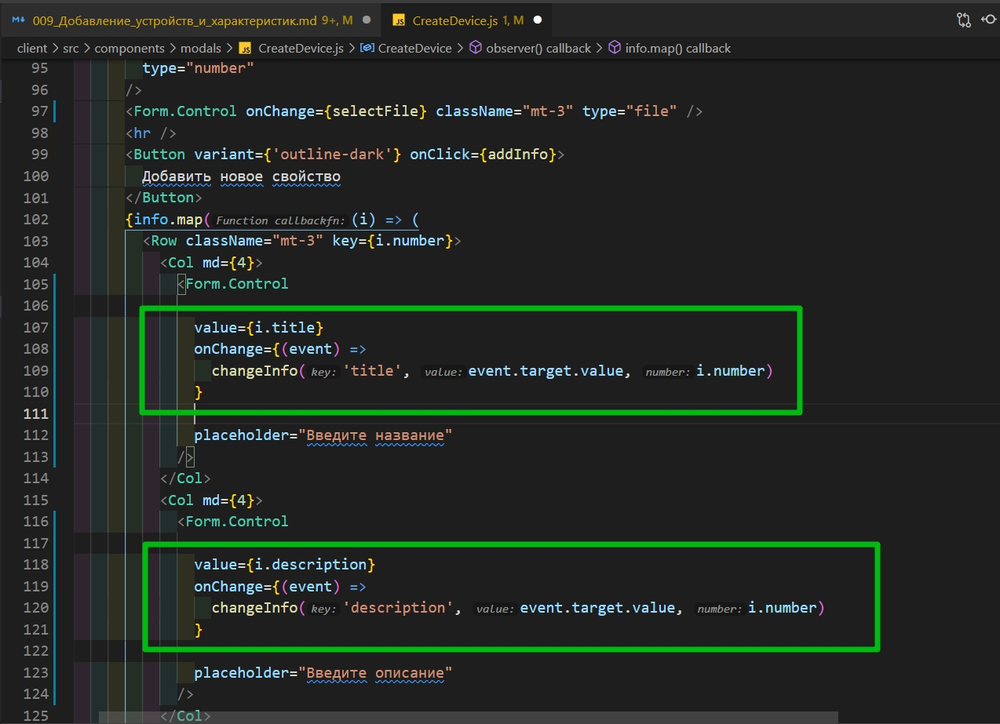

```js
// components modal CreateDevice
import React, { useContext, useEffect, useState } from 'react';
import { Modal, Form, Button, Dropdown, Row, Col } from 'react-bootstrap';
import { fetchBrands, fetchTypes } from '../../http/deviceAPI.js';
import { Context } from '../../index.js';
import { observer } from 'mobx-react-lite';

const CreateDevice = observer(({ show, onHide }) => {
  const { device } = useContext(Context);
  const [name, setName] = useState('');
  const [price, setPrice] = useState(0);
  const [file, setFile] = useState(null);
  const [info, setInfo] = useState([]);

  useEffect(
    () => {
      fetchTypes().then((data) => device.setTypes(data));
      fetchBrands().then((data) => device.setBrands(data));
    },
    // eslint-disable-next-line react-hooks/exhaustive-deps
    []
  );

  const addInfo = () => {
    setInfo([...info, { title: '', description: '', number: Date.now() }]);
  };

  const removeInfo = (number) => {
    setInfo(info.filter((i) => i.number !== number));
  };

  const changeInfo = (key, value, number) => {
    setInfo(
      info.map((i) => (i.number === number ? { ...i, [key]: value } : i))
    );
  };

  // Отправляю запрос на сервер
  const addDevice = () => {
    console.log(info);
  };

  const selectFile = (event) => {
    setFile(event.target.files[0]);
  };

  return (
    <Modal show={show} onHide={onHide} size="lg" centered>
      <Modal.Header closeButton>
        <Modal.Title id="contained-modal-title-vcenter">
          Добавить новый девайс
        </Modal.Title>
      </Modal.Header>
      <Modal.Body>
        <Form>
          <Dropdown className="mt-2 mb-2">
            <Dropdown.Toggle>
              {device.selectedType.name || 'Выберите тип'}
            </Dropdown.Toggle>
            <Dropdown.Menu>
              {device.types.map((type) => (
                <Dropdown.Item
                  onClick={() => device.setSelectedType(type)}
                  key={type.id}
                >
                  {type.name}
                </Dropdown.Item>
              ))}
            </Dropdown.Menu>
          </Dropdown>
          <Dropdown className="mt-2 mb-2">
            <Dropdown.Toggle>
              {device.selectedBrand.name || 'Выберите бренд'}
            </Dropdown.Toggle>
            <Dropdown.Menu>
              {device.brands.map((brand) => (
                <Dropdown.Item
                  onClick={() => device.setSelectedBrand(brand)}
                  key={brand.id}
                >
                  {brand.name}
                </Dropdown.Item>
              ))}
            </Dropdown.Menu>
          </Dropdown>
          <Form.Control
            value={name}
            onChange={(event) => setName(event.target.value)}
            className="mt-3"
            placeholder="Введите название устройства"
          />
          <Form.Control
            value={price}
            onChange={(event) => setPrice(Number(event.target.value))}
            className="mt-3"
            placeholder="Введите стоимость устройства"
            type="number"
          />
          <Form.Control onChange={selectFile} className="mt-3" type="file" />
          <hr />
          <Button variant={'outline-dark'} onClick={addInfo}>
            Добавить новое свойство
          </Button>
          {info.map((i) => (
            <Row className="mt-3" key={i.number}>
              <Col md={4}>
                <Form.Control
                  value={i.title}
                  onChange={(event) =>
                    changeInfo('title', event.target.value, i.number)
                  }
                  placeholder="Введите название"
                />
              </Col>
              <Col md={4}>
                <Form.Control
                  value={i.description}
                  onChange={(event) =>
                    changeInfo('description', event.target.value, i.number)
                  }
                  placeholder="Введите описание"
                />
              </Col>
              <Col md={4}>
                <Button
                  variant={'outline-danger'}
                  onClick={() => removeInfo(i.number)}
                >
                  Удалить
                </Button>
              </Col>
            </Row>
          ))}
        </Form>
      </Modal.Body>
      <Modal.Footer>
        <Button variant={'outline-danger'} onClick={onHide}>
          Закрыть
        </Button>
        <Button variant={'outline-success'} onClick={addDevice}>
          Добавить
        </Button>
      </Modal.Footer>
    </Modal>
  );
});

export default CreateDevice;
```

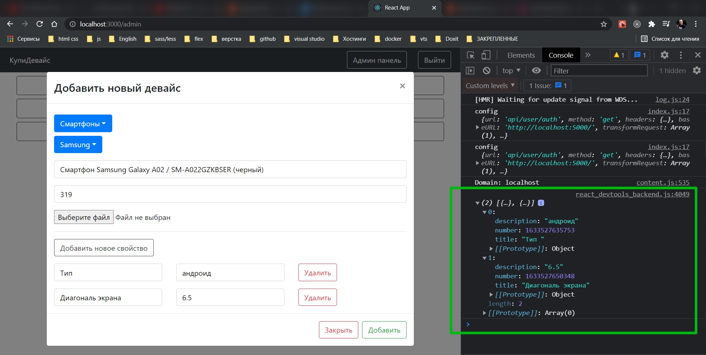

Возвращаемся к функции **addDevice**. Щдесь вызываю функцию **createDevice** которой мы отрправляем запрос на сервер и параметром мы должны передать само устройство.

Вспоминаем. Когда мы тестировали функцию создания девайсов в **POSTMAN** мы использовали не строку вформате **JSON** а **fornData**. В данном случае сделаем все тоже самое.

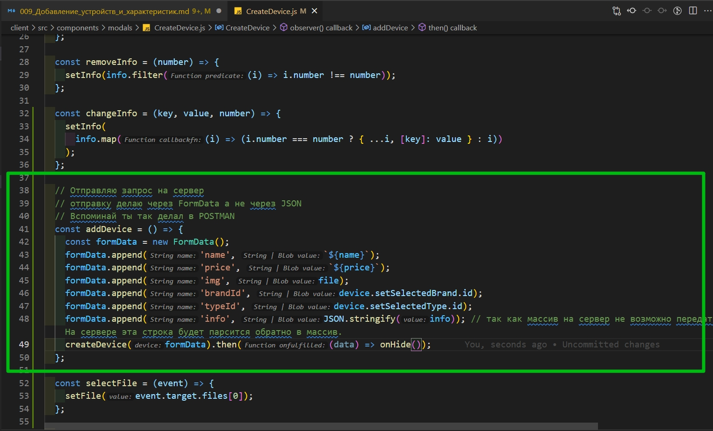

```js
// components modal CreateDevice
import React, { useContext, useEffect, useState } from 'react';
import { Modal, Form, Button, Dropdown, Row, Col } from 'react-bootstrap';
import { createDevice, fetchBrands, fetchTypes } from '../../http/deviceAPI.js';
import { Context } from '../../index.js';
import { observer } from 'mobx-react-lite';

const CreateDevice = observer(({ show, onHide }) => {
  const { device } = useContext(Context);
  const [name, setName] = useState('');
  const [price, setPrice] = useState(0);
  const [file, setFile] = useState(null);
  const [info, setInfo] = useState([]);

  useEffect(
    () => {
      fetchTypes().then((data) => device.setTypes(data));
      fetchBrands().then((data) => device.setBrands(data));
    },
    // eslint-disable-next-line react-hooks/exhaustive-deps
    []
  );

  const addInfo = () => {
    setInfo([...info, { title: '', description: '', number: Date.now() }]);
  };

  const removeInfo = (number) => {
    setInfo(info.filter((i) => i.number !== number));
  };

  const changeInfo = (key, value, number) => {
    setInfo(
      info.map((i) => (i.number === number ? { ...i, [key]: value } : i))
    );
  };

  // Отправляю запрос на сервер
  // отправку делаю через FormData а не через JSON
  // Вспоминай ты так делал в POSTMAN
  const addDevice = () => {
    const formData = new FormData();
    formData.append('name', name);
    formData.append('price', `${price}`);
    formData.append('img', file);
    formData.append('brandId', device.selectedBrand.id);
    formData.append('typeId', device.selectedType.id);
    formData.append('info', JSON.stringify(info));
    createDevice(formData).then((data) => onHide());
  };

  const selectFile = (event) => {
    setFile(event.target.files[0]);
  };

  return (
    <Modal show={show} onHide={onHide} size="lg" centered>
      <Modal.Header closeButton>
        <Modal.Title id="contained-modal-title-vcenter">
          Добавить новый девайс
        </Modal.Title>
      </Modal.Header>
      <Modal.Body>
        <Form>
          <Dropdown className="mt-2 mb-2">
            <Dropdown.Toggle>
              {device.selectedType.name || 'Выберите тип'}
            </Dropdown.Toggle>
            <Dropdown.Menu>
              {device.types.map((type) => (
                <Dropdown.Item
                  onClick={() => device.setSelectedType(type)}
                  key={type.id}
                >
                  {type.name}
                </Dropdown.Item>
              ))}
            </Dropdown.Menu>
          </Dropdown>
          <Dropdown className="mt-2 mb-2">
            <Dropdown.Toggle>
              {device.selectedBrand.name || 'Выберите бренд'}
            </Dropdown.Toggle>
            <Dropdown.Menu>
              {device.brands.map((brand) => (
                <Dropdown.Item
                  onClick={() => device.setSelectedBrand(brand)}
                  key={brand.id}
                >
                  {brand.name}
                </Dropdown.Item>
              ))}
            </Dropdown.Menu>
          </Dropdown>
          <Form.Control
            value={name}
            onChange={(event) => setName(event.target.value)}
            className="mt-3"
            placeholder="Введите название устройства"
          />
          <Form.Control
            value={price}
            onChange={(event) => setPrice(Number(event.target.value))}
            className="mt-3"
            placeholder="Введите стоимость устройства"
            type="number"
          />
          <Form.Control onChange={selectFile} className="mt-3" type="file" />
          <hr />
          <Button variant={'outline-dark'} onClick={addInfo}>
            Добавить новое свойство
          </Button>
          {info.map((i) => (
            <Row className="mt-3" key={i.number}>
              <Col md={4}>
                <Form.Control
                  value={i.title}
                  onChange={(event) =>
                    changeInfo('title', event.target.value, i.number)
                  }
                  placeholder="Введите название"
                />
              </Col>
              <Col md={4}>
                <Form.Control
                  value={i.description}
                  onChange={(event) =>
                    changeInfo('description', event.target.value, i.number)
                  }
                  placeholder="Введите описание"
                />
              </Col>
              <Col md={4}>
                <Button
                  variant={'outline-danger'}
                  onClick={() => removeInfo(i.number)}
                >
                  Удалить
                </Button>
              </Col>
            </Row>
          ))}
        </Form>
      </Modal.Body>
      <Modal.Footer>
        <Button variant={'outline-danger'} onClick={onHide}>
          Закрыть
        </Button>
        <Button variant={'outline-success'} onClick={addDevice}>
          Добавить
        </Button>
      </Modal.Footer>
    </Modal>
  );
});

export default CreateDevice;
```

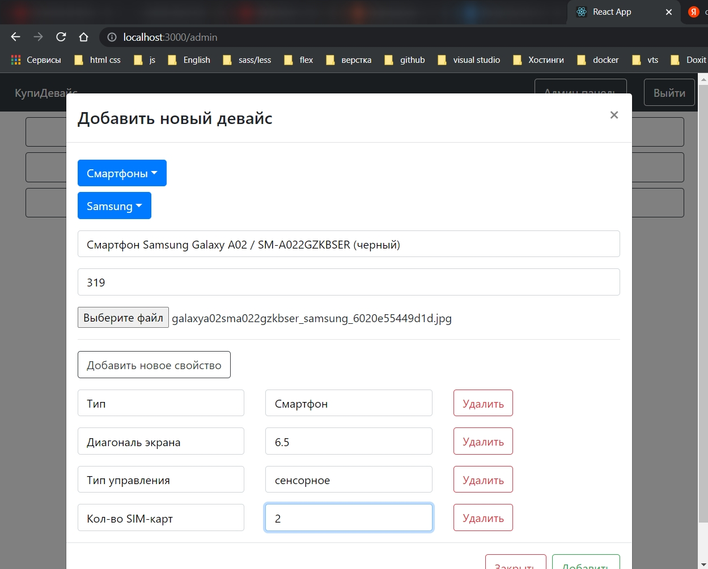

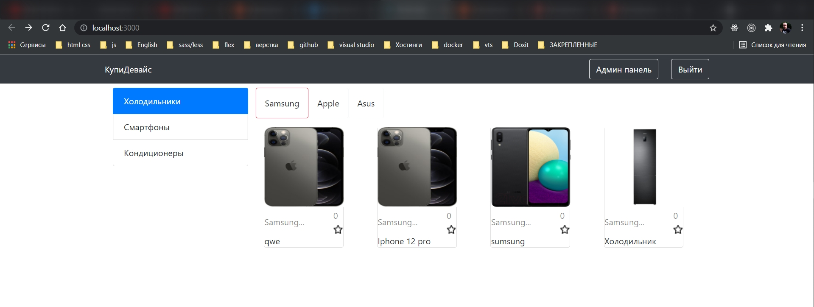

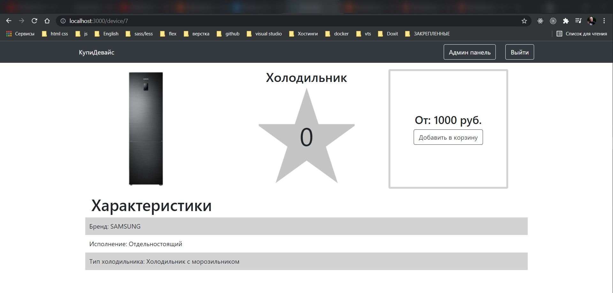

```js
// controllers deviceController.js
const uuid = require('uuid');
const path = require('path');
const ApiError = require('../error/ApiError');

const { Device, DeviceInfo } = require('../models/models');

class DeviceController {
  async create(req, res, next) {
    try {
      let { name, price, brandId, typeId, info } = req.body;
      const { img } = req.files;
      let fileName = uuid.v4() + '.jpg';
      img.mv(path.resolve(__dirname, '..', 'static', fileName));
      const device = await Device.create({
        name,
        price,
        brandId,
        typeId,
        img: fileName,
      });

      if (info) {
        info = JSON.parse(info);
        info.forEach((i) =>
          DeviceInfo.create({
            title: i.title,
            description: i.description,
            deviceId: device.id,
          })
        );
      }

      return res.json(device);
    } catch (error) {
      next(ApiError.badRequest(error.message));
    }
  }

  async getAll(req, res, next) {
    let { brandId, typeId, page, limit } = req.query;

    page = page || 1;
    limit = Number(limit) || 9; // Для того что бы нормально отработало переведи в Number
    let offset = page * limit - limit;
    let devices;

    try {
      // если brandId и typeId не указаны возвращаю все devices
      if (!brandId && !typeId) {
        devices = await Device.findAndCountAll({ limit, offset });
      }

      //Фильтрация по brandId
      if (brandId && !typeId) {
        devices = await Device.findAndCountAll({
          where: { brandId },
          limit,
          offset,
        });
      }
      // Фильтрация по typeId
      if (!brandId && typeId) {
        devices = await Device.findAndCountAll({
          where: { typeId },
          limit,
          offset,
        });
      }

      //Фильтрация по typeId и по typeId
      if (brandId && typeId) {
        devices = await Device.findAndCountAll({
          where: { brandId, typeId },
          limit,
          offset,
        });
      }
      // возвращаю массив девайсов
      return res.json(devices);
    } catch (error) {
      next(ApiError.badRequest(error.message));
    }
  }

  async getOne(req, res, next) {
    const { id } = req.params;
    try {
      const device = await Device.findOne({
        where: Number(id),
        include: [{ model: DeviceInfo, as: 'info' }],
      });
      return res.json(device);
    } catch (error) {
      next(ApiError.badRequest(error.message));
    }
  }
}

module.exports = new DeviceController();
```

Я его немного подправил по примеру автора. Хотя он и без этого должен работать
